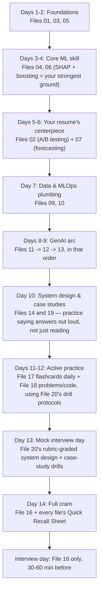

# Data Science Interview Prep — Master Index & Study Plan

This folder is a complete, self-contained interview prep kit built around your background: applied ML/forecasting (XGBoost, LightGBM, Prophet, SARIMAX), marketing attribution (Markov chains, Shapley values), RL-based inventory optimization, AWS/GCP MLOps, and a growing GenAI/LLM skill set. Each file below is independently readable — open any one directly the morning of a specific interview round and it stands on its own.

Total size: **18 content files, ~203,000 words** — theory with full derivations, tables, and mermaid diagrams; per-file interview Q&A; and dedicated practice tools (flashcards, hands-on problems with runnable code, a case-study bank, and mock-interview drills), plus this index.

## How to use this kit

- Read the theory files (01-07, 09-14) roughly in order for a first pass — later files lean on earlier ones (e.g. the RAG file assumes you've seen the Transformers file; the system design file leans on the time-series file).
- Every theory file ends with two Q&A layers before its Quick Recall Sheet: the original **Interview angle** blocks woven through the body, and an **Additional Common Interview Questions** section added at the end covering questions the first pass missed. Between the two, each file has 15-25+ worked interview questions, not just explanations.
- File **16 (Quick-fire Review)** is the single-file cram sheet covering everything in the kit at compressed one-liner density — use it the morning of the interview.
- Files **17-20 are practice tools, not more theory** — they're what turn passive reading into something you can actually produce under pressure. See the dedicated section below.

## File-by-file index

| # | File | Covers | Priority |
|---|------|--------|----------|
| 01 | [`01_statistics_and_probability.md`](01_statistics_and_probability.md) | Descriptive stats, 7 core distributions, CLT, LLN, Bayes' theorem, Bayesian vs Frequentist, correlation/causation, biases, probability brainteasers | Foundation |
| 02 | [`02_hypothesis_testing_and_ab_testing.md`](02_hypothesis_testing_and_ab_testing.md) | Hypothesis testing, CIs, t/z/chi-square/ANOVA, **and a deep A/B testing dive** (power, sample size, multiple testing correction, peeking, SRM, skewed metrics) | **Flagship** |
| 03 | [`03_ml_fundamentals.md`](03_ml_fundamentals.md) | Bias-variance tradeoff, regularization (L1/L2/ElasticNet), linear regression (OLS derivation, VIF), logistic regression (log-loss derivation, odds ratio) | Foundation |
| 04 | [`04_trees_ensembles_boosting.md`](04_trees_ensembles_boosting.md) | Decision trees, bagging/boosting/stacking, random forests, **deep XGBoost & LightGBM internals** (2nd-order Taylor expansion, split gain, GOSS, EFB, leaf-wise growth) | **Flagship** |
| 05 | [`05_other_ml_algorithms.md`](05_other_ml_algorithms.md) | SVM, k-NN, Naive Bayes, clustering (k-means/hierarchical/DBSCAN/GMM), PCA/t-SNE/UMAP | Core |
| 06 | [`06_model_evaluation_feature_engineering.md`](06_model_evaluation_feature_engineering.md) | Classification/regression metrics, calibration, walk-forward CV, imbalanced data, feature engineering, **SHAP deep dive** | **Flagship** |
| 07 | [`07_time_series_forecasting.md`](07_time_series_forecasting.md) | Stationarity, ARIMA/SARIMAX, Prophet, exponential smoothing, ML/DL forecasting, ensembling, forecasting metrics, hierarchical reconciliation, Croston's method | **Flagship** |
| 09 | [`09_sql_pyspark_dbt_data_engineering.md`](09_sql_pyspark_dbt_data_engineering.md) | SQL joins/window functions/CTEs, PySpark internals, dbt, pipeline design | Core |
| 10 | [`10_mlops_cloud_deployment.md`](10_mlops_cloud_deployment.md) | MLflow, FastAPI/Flask, Docker, CI/CD, drift monitoring, AWS/GCP services (incl. AWS ML Specialty depth), Git | Core |
| 11 | [`11_nlp_and_deep_learning_fundamentals.md`](11_nlp_and_deep_learning_fundamentals.md) | Text preprocessing, embeddings (Word2Vec/GloVe/FastText), RNN/LSTM/GRU, attention (pre-Transformer), DL Specialization refresh | Core |
| 12 | [`12_genai_llms_transformers.md`](12_genai_llms_transformers.md) | Transformer architecture (self-attention, positional encoding, tokenization), pretraining/fine-tuning (LoRA/QLoRA/RLHF/DPO), prompt engineering | **Flagship** (GenAI roles) |
| 13 | [`13_rag_agents_llm_systems.md`](13_rag_agents_llm_systems.md) | RAG deep dive, LangChain/LangGraph agents, LLM evaluation, GenAI production deployment | **Flagship** (GenAI roles) |
| 14 | [`14_system_design_ml.md`](14_system_design_ml.md) | ML system design framework + 6 full practice designs (forecasting, fraud, recsys, attribution, RAG chatbot, ad-budget bandits) | **Flagship** |
| 16 | [`16_quickfire_review_and_certifications.md`](16_quickfire_review_and_certifications.md) | AWS ML Specialty & DL Specialization talking points, MTech/BTech prep, **master cram sheet across every file** | Read last, every time |
| 17 | [`17_flashcards_active_recall.md`](17_flashcards_active_recall.md) | 150+ self-quiz flashcards (collapsible Q/A) across every topic file, for spaced-repetition-style drilling | Practice tool |
| 18 | [`18_practice_problems_and_code.md`](18_practice_problems_and_code.md) | SQL problems against a sample schema, probability/stats problems, "derive it from scratch" prompts, and runnable Python code (scratch k-means/gradient descent/logistic regression, XGBoost+SHAP, walk-forward CV) | Practice tool |
| 19 | [`19_case_studies_and_use_cases.md`](19_case_studies_and_use_cases.md) | ~29 case-study/use-case prompts (business, applied ML, GenAI, forecasting/ops, experimentation, ambiguous "what would you do") with structured approaches | Practice tool |
| 20 | [`20_mock_interview_and_progress_tracker.md`](20_mock_interview_and_progress_tracker.md) | Mock-interview rehearsal drills + rubrics, an interview-format/logistics primer, a per-file progress tracker, and a T-minus countdown schedule | Practice tool |

## The practice layer (17-20) — why it's there

Reading a derivation and being able to reproduce it under interview pressure are different skills. Files 17-20 exist specifically to close that gap:

- **17 (flashcards)** is for daily active recall in short bursts — quiz yourself, don't just re-read.
- **18 (practice problems + code)** is for testing whether you can actually *produce* a query or a derivation cold, plus runnable code so you can watch things like SHAP values or a from-scratch gradient descent actually move real numbers.
- **19 (case studies)** is a much larger, broader bank of shorter business/applied/GenAI scenarios than file 14's six deep dives — built for pattern-matching practice across many prompts rather than depth on a few.
- **20 (mock interview + tracker)** is where you rehearse out loud under a timer with a rubric, and track — file by file — what's actually been drilled versus only read.

## Suggested study plan

Adjust the pace to how many days you actually have — the structure (foundations → flagship applied topics → GenAI → system design/case studies → practice/rehearsal → final cram) matters more than the exact day count.

### If you only have a few days

1. File 16 (skim once to see the map of everything) → 2. Files 02, 04, 07 (your resume's core: A/B testing, boosting, forecasting) → 3. Files 14 and 19 (system design + case studies, practiced out loud using file 20's rubric) → 4. File 17 flashcards for whatever feels shakiest → 5. File 16 again as the final pass.

## A note on rigor

Every file was written independently with instructions to show full derivations (not just stated formulas), use tables for every natural comparison, and include mermaid diagrams for processes/architectures. The code in file 18 was reasoned through carefully for correctness against current library APIs but not executed in this environment — run it yourself before relying on it in an interview, both to build muscle memory and to catch anything an interviewer's exact library version might handle differently. If you spot anything that looks off or oversimplified elsewhere while studying, treat your own judgment as the tie-breaker — this kit is a study aid, not a substitute for verifying the trickier formulas (e.g. the XGBoost split-gain derivation, the Shapley value formula, the DPO loss) against a primary source if you want full confidence before an interview where you might be asked to derive one on a whiteboard.

Good luck.
