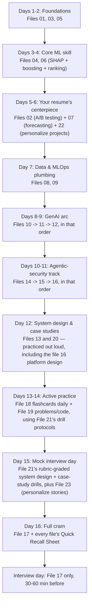

# Data Science / Agentic AI / Security Interview Prep — Master Index & Study Plan

This folder is a complete, self-contained interview prep kit. It covers two tracks in one continuous sequence: a general data-science/ML/GenAI track built around your background (applied ML/forecasting with XGBoost/LightGBM/Prophet/SARIMAX, marketing attribution, RL-based inventory optimization, AWS/GCP MLOps), and an agentic-AI-security track (files 14-16) aimed at a specific role building/tuning a multi-agent security platform in the style of Microsoft's "Project Perception." Each file is independently readable — open any one directly the morning of a specific interview round and it stands on its own.

Total size: **23 content files, ~290,000+ words** — theory with full derivations, tables, and mermaid diagrams; per-file interview Q&A; dedicated practice tools (flashcards, hands-on problems with runnable code, a case-study bank, and mock-interview drills); and two personalizable templates for your own projects and stories, plus this index.

## How to use this kit

- Read the theory files (01-16) roughly in order for a first pass — later files lean on earlier ones (e.g. the RAG file assumes you've seen the Transformers file; the agentic-systems file assumes you've seen RAG/agents; the Project Perception file assumes you've seen both the agentic-systems and security-fundamentals files).
- Every theory file (01-16) ends with two Q&A layers before its Quick Recall Sheet: the original **Interview angle** blocks woven through the body, and an **Additional Common Interview Questions** section added at the end covering questions the first pass missed. Between the two, each file has 15-25+ worked interview questions, not just explanations.
- File **17 (Quick-fire Review)** is the single-file cram sheet covering everything in the kit (both tracks) at compressed one-liner density — use it the morning of the interview.
- Files **18-21 are practice tools, not more theory** — they're what turn passive reading into something you can actually produce under pressure. See the dedicated section below.
- Files **22 and 23 are personalizable templates, not facts about you** — they were written without access to your actual project internals or real stories, using plausible, technically sound scaffolding built from your resume bullets. Read the note in the "Personalizing files 22 and 23" section below before relying on them in an interview.

## File-by-file index

| # | File | Covers | Priority |
|---|------|--------|----------|
| 01 | [`01_statistics_and_probability.md`](01_statistics_and_probability.md) | Descriptive stats, 7 core distributions, CLT, LLN, Bayes' theorem, Bayesian vs Frequentist, correlation/causation, biases, probability brainteasers | Foundation |
| 02 | [`02_hypothesis_testing_and_ab_testing.md`](02_hypothesis_testing_and_ab_testing.md) | Hypothesis testing, CIs, t/z/chi-square/ANOVA, **and a deep A/B testing dive** (power, sample size, multiple testing correction, peeking, SRM, skewed metrics) | **Flagship** |
| 03 | [`03_ml_fundamentals.md`](03_ml_fundamentals.md) | Bias-variance tradeoff, regularization (L1/L2/ElasticNet), linear regression (OLS derivation, VIF), logistic regression (log-loss derivation, odds ratio) | Foundation |
| 04 | [`04_trees_ensembles_boosting.md`](04_trees_ensembles_boosting.md) | Decision trees, bagging/boosting/stacking, random forests, **deep XGBoost & LightGBM internals** | **Flagship** |
| 05 | [`05_other_ml_algorithms.md`](05_other_ml_algorithms.md) | SVM, k-NN, Naive Bayes, clustering (k-means/hierarchical/DBSCAN/GMM), PCA/t-SNE/UMAP, **anomaly detection (isolation forest, one-class SVM, autoencoders)** | Core |
| 06 | [`06_model_evaluation_feature_engineering.md`](06_model_evaluation_feature_engineering.md) | Classification/regression metrics, **ranking as an ML problem (pointwise/pairwise/listwise, RankNet, LambdaMART, NDCG)**, calibration, walk-forward CV, imbalanced data, feature engineering, **SHAP deep dive** | **Flagship** |
| 07 | [`07_time_series_forecasting.md`](07_time_series_forecasting.md) | Stationarity, ARIMA/SARIMAX, Prophet, exponential smoothing, ML/DL forecasting, ensembling, forecasting metrics, hierarchical reconciliation, Croston's method | **Flagship** |
| 08 | [`08_sql_pyspark_dbt_data_engineering.md`](08_sql_pyspark_dbt_data_engineering.md) | SQL joins/window functions/CTEs, PySpark internals, dbt, pipeline design | Core |
| 09 | [`09_mlops_cloud_deployment.md`](09_mlops_cloud_deployment.md) | MLflow, FastAPI/Flask, Docker, CI/CD, drift monitoring, AWS/GCP services (incl. AWS ML Specialty depth), Git | Core |
| 10 | [`10_nlp_and_deep_learning_fundamentals.md`](10_nlp_and_deep_learning_fundamentals.md) | Text preprocessing, embeddings (Word2Vec/GloVe/FastText), RNN/LSTM/GRU, attention (pre-Transformer), DL Specialization refresh | Core |
| 11 | [`11_genai_llms_transformers.md`](11_genai_llms_transformers.md) | Transformer architecture (self-attention, positional encoding, tokenization), pretraining/fine-tuning (LoRA/QLoRA/RLHF/DPO), prompt engineering, **generation & decoding strategies (temperature/top-k/top-p, causal masking), LLM inference & serving (KV cache, continuous batching, quantization, speculative decoding)** | **Flagship** |
| 12 | [`12_rag_agents_llm_systems.md`](12_rag_agents_llm_systems.md) | RAG deep dive (**incl. query rewriting/HyDE, parent-child retrieval, access-control-aware retrieval, context compression**), LangChain/LangGraph agents (**incl. deep tool-calling schemas/validation/idempotency**), LLM evaluation, GenAI production deployment | **Flagship** |
| 13 | [`13_system_design_ml.md`](13_system_design_ml.md) | ML system design framework + 6 full practice designs (forecasting, fraud, recsys, attribution, RAG chatbot, ad-budget bandits) | **Flagship** |
| 14 | [`14_agentic_systems_architecture_and_evaluation.md`](14_agentic_systems_architecture_and_evaluation.md) | Agent architecture taxonomy, planning (ReAct/plan-and-execute/tree search), memory types, multi-agent coordination (**incl. peer-to-peer**), why more agents can make things worse, the 5-layer agent evaluation framework (**incl. regression testing/golden sets**), agent observability, **failure isolation/bulkheading** | **Flagship** (agentic-security track) |
| 15 | [`15_security_fundamentals_and_ai_agent_security.md`](15_security_fundamentals_and_ai_agent_security.md) | CIA triad, RBAC/ABAC, zero trust, SIEM/SOAR/XDR/EDR, MITRE ATT&CK, Entra ID/OAuth/OIDC, prompt injection, agent attacks (confused deputy, memory poisoning), LLM security, agent authorization principle | **Flagship** (agentic-security track) |
| 16 | [`16_project_perception_and_enterprise_platform_design.md`](16_project_perception_and_enterprise_platform_design.md) | The Signals→Context→Models→Harness→Agents→Actuators architecture, Red/Blue/Green closed loop, enterprise system design for a "millions of alerts" platform, **consistency models (CAP theorem)**, reliability engineering, latency and cost optimization — **verify specifics before the interview, see caveat below** | **Flagship** (agentic-security track) |
| 17 | [`17_quickfire_review_and_certifications.md`](17_quickfire_review_and_certifications.md) | AWS ML Specialty & DL Specialization talking points, MTech/BTech prep, **master cram sheet across every file, both tracks** | Read last, every time |
| 18 | [`18_flashcards_active_recall.md`](18_flashcards_active_recall.md) | 270+ self-quiz flashcards (collapsible Q/A) across every topic file, including the agentic-security track, for spaced-repetition-style drilling | Practice tool |
| 19 | [`19_practice_problems_and_code.md`](19_practice_problems_and_code.md) | SQL problems against a sample schema, probability/stats problems, "derive it from scratch" prompts, and runnable Python code | Practice tool |
| 20 | [`20_case_studies_and_use_cases.md`](20_case_studies_and_use_cases.md) | ~32 case-study/use-case prompts (business, applied ML, GenAI, forecasting/ops, experimentation, ambiguous "what would you do", **and agentic-security platform scenarios**) with structured approaches | Practice tool |
| 21 | [`21_mock_interview_and_progress_tracker.md`](21_mock_interview_and_progress_tracker.md) | Mock-interview rehearsal drills + rubrics, an interview-format/logistics primer, a per-file progress tracker, and a T-minus countdown schedule | Practice tool |
| 22 | [`22_project_deep_dives.md`](22_project_deep_dives.md) | Resume project Q&A prep: demand forecasting, multi-touch attribution, RL inventory optimization — **personalize before relying on it** | **Flagship** (personalize first) |
| 23 | [`23_behavioral_star_stories.md`](23_behavioral_star_stories.md) | STAR method + story workbook — **personalize before relying on it** | Foundation (personalize first) |

## Why this order

The kit reads as one continuous arc rather than a general track followed by a bolted-on appendix: foundations (01-07) → data/MLOps plumbing (08-10) → the GenAI arc (11-13, transformers → RAG/agents → system design) → the agentic-security track (14-16, which builds directly on the agent and system-design concepts in 12-13) → the cram sheet (17) → the practice layer (18-21) → your personalized project and behavioral material (22-23), which you'll want close at hand right before the interview regardless of which round is next. If you're targeting the agentic-security role specifically, files 14-16 are just as much "your track" as 01-13 — don't treat their position as a signal they're optional.

## The practice layer (18-21) — why it's there

Reading a derivation and being able to reproduce it under interview pressure are different skills. Files 18-21 exist specifically to close that gap:

- **18 (flashcards)** is for daily active recall in short bursts — quiz yourself, don't just re-read.
- **19 (practice problems + code)** is for testing whether you can actually *produce* a query or a derivation cold, plus runnable code so you can watch things like SHAP values or a from-scratch gradient descent actually move real numbers.
- **20 (case studies)** is a much larger, broader bank of shorter business/applied/GenAI/agentic-security scenarios than file 13's six deep dives — built for pattern-matching practice across many prompts rather than depth on a few.
- **21 (mock interview + tracker)** is where you rehearse out loud under a timer with a rubric, and track — file by file, across both tracks — what's actually been drilled versus only read.

## Personalizing files 22 and 23

These two files are illustrative templates built from your resume bullets, not verified facts about what you actually did — the writers didn't have access to your real implementation details or your real stories. Before relying on either in an interview, go through both and swap in your actual numbers, actual architecture decisions, and actual stories. Treat them as scaffolding, not scripts. File 21's progress tracker has explicit checkboxes for "personalized" on both.

## A caveat on file 16 (Project Perception)

The Signals→Context→Models→Harness→Agents→Actuators architecture, the Red/Blue/Green framing, and any specific model names in file 16 were built from material provided in this conversation, not from an independently verified source — a live web search to cross-check Microsoft's own current public documentation was unavailable when this file was written. Treat file 16 as your rehearsal script for the architecture as you understand it, but verify current terminology and any specific product/model names against Microsoft's own public material before the interview, since product details and naming can change.

## Suggested study plan

Adjust the pace to how many days you actually have. If you're targeting the agentic-security role specifically, prioritize files 14-16 alongside 12/13 rather than treating them as an afterthought at the end.

### If you only have a few days

1. File 17 (skim once to see the map of everything, both tracks) → 2. Files 02, 04, 07 (your resume's ML core) plus 14, 15, 16 if the role is agentic-security-focused → 3. Files 13 and 20 (system design + case studies, practiced out loud using file 21's rubric) → 4. Files 22 and 23 (personalize with your real specifics) → 5. File 18 flashcards for whatever feels shakiest → 6. File 17 again as the final pass.

## A note on rigor

Every file was written independently with instructions to show full derivations (not just stated formulas), use tables for every natural comparison, and include mermaid diagrams for processes/architectures. The code in file 19 was reasoned through carefully for correctness against current library APIs but not executed in this environment — run it yourself before relying on it in an interview. If you spot anything that looks off or oversimplified while studying, treat your own judgment as the tie-breaker — this kit is a study aid, not a substitute for verifying the trickier formulas, or the file 16 architecture specifics, against a primary source if you want full confidence before an interview where you might be asked to derive or draw one from memory.

Good luck.
