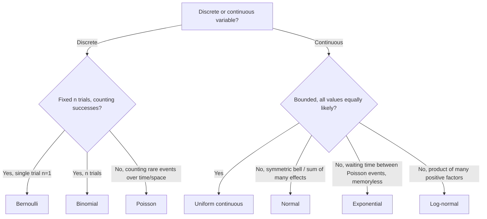
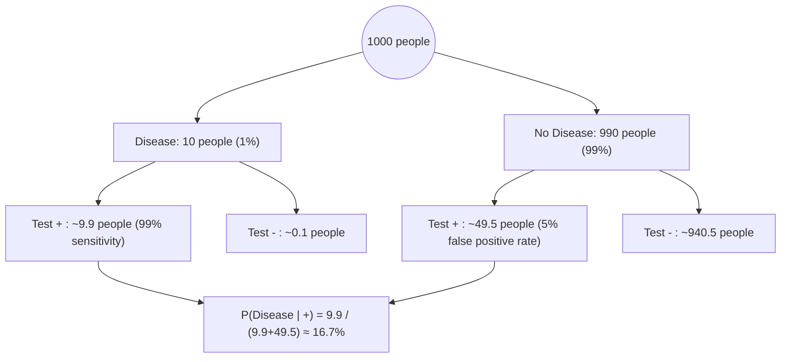

# Statistics & Probability for Data Science Interviews

This file covers the core statistics and probability foundation expected of a senior data scientist: descriptive statistics, the canonical probability distributions and when each applies, the two limit theorems everyone name-drops but few can precisely distinguish, Bayesian reasoning, correlation/causation pitfalls, and the classic brainteasers that show up in interviews. Every formula is derived, not just stated, and every distribution is tied to a concrete real-world scenario so you can reason about *why* a model applies, not just recite it.

## Table of Contents

- [1. Descriptive Statistics](#1-descriptive-statistics)
- [2. Probability Distributions](#2-probability-distributions)
- [3. Central Limit Theorem](#3-central-limit-theorem)
- [4. Law of Large Numbers](#4-law-of-large-numbers)
- [5. Bayes' Theorem](#5-bayes-theorem)
- [6. Bayesian vs Frequentist Inference](#6-bayesian-vs-frequentist-inference)
- [7. Correlation vs Causation](#7-correlation-vs-causation)
- [8. Covariance vs Correlation (Pearson vs Spearman)](#8-covariance-vs-correlation-pearson-vs-spearman)
- [9. Common Biases and Pitfalls](#9-common-biases-and-pitfalls)
- [10. Classic Probability Brainteasers](#10-classic-probability-brainteasers)
- [Quick Recall Sheet](#quick-recall-sheet)

---

## 1. Descriptive Statistics

### Measures of central tendency

| Measure | Definition | Preferred when | Weakness |
|---|---|---|---|
| Mean | $\bar{x} = \frac{1}{n}\sum_{i=1}^n x_i$ | Data roughly symmetric, no extreme outliers, you need a value usable in further algebra (e.g. sums, variance) | Highly sensitive to outliers and skew — a single billionaire wrecks the average income |
| Median | Middle value of sorted data (or average of two middle values if $n$ is even) | Skewed distributions, outliers present (income, house prices, latency/response-time data) | Ignores magnitude of extremes, less algebraically tractable |
| Mode | Most frequently occurring value | Categorical/nominal data, multimodal distributions where you care about the "typical" category | Undefined/non-unique for continuous data without binning; unstable with small samples |

**Rule of thumb:** if mean ≫ median, distribution is right-skewed (long right tail, e.g. income); if mean ≪ median, left-skewed. For symmetric unimodal data, mean ≈ median ≈ mode.

### Variance and standard deviation

**Population variance** (when you have the entire population, true mean $\mu$ known):

$$\sigma^2 = \frac{1}{N}\sum_{i=1}^N (x_i - \mu)^2$$

**Sample variance with Bessel's correction** (when $\mu$ is unknown and estimated by $\bar{x}$ from a sample):

$$s^2 = \frac{1}{n-1}\sum_{i=1}^n (x_i - \bar{x})^2$$

**Why $n-1$, not $n$ — full derivation.** Start by rewriting the sum of squared deviations from the *sample* mean in terms of deviations from the *true* mean:

$$\sum_{i=1}^n (x_i - \bar{x})^2 = \sum_{i=1}^n \big[(x_i - \mu) - (\bar{x} - \mu)\big]^2$$

Expand the square:

$$= \sum_i (x_i-\mu)^2 - 2(\bar{x}-\mu)\sum_i (x_i - \mu) + n(\bar{x}-\mu)^2$$

Since $\sum_i (x_i - \mu) = n(\bar{x} - \mu)$, the middle term becomes $-2n(\bar{x}-\mu)^2$, so:

$$\sum_i (x_i - \bar{x})^2 = \sum_i (x_i-\mu)^2 - n(\bar{x}-\mu)^2$$

Now take expectations. $E\left[\sum_i (x_i-\mu)^2\right] = n\sigma^2$ by definition of variance. And $E[(\bar{x}-\mu)^2] = \text{Var}(\bar{x}) = \sigma^2/n$ (variance of the sample mean). So:

$$E\left[\sum_i (x_i - \bar{x})^2\right] = n\sigma^2 - n \cdot \frac{\sigma^2}{n} = (n-1)\sigma^2$$

Dividing by $n$ therefore gives an estimator that is biased **low** by a factor of $(n-1)/n$. Dividing by $n-1$ instead makes the estimator unbiased:

$$E[s^2] = E\left[\frac{1}{n-1}\sum_i(x_i-\bar{x})^2\right] = \frac{(n-1)\sigma^2}{n-1} = \sigma^2$$

Intuition: the sample mean $\bar{x}$ is, by construction, the value that *minimizes* $\sum(x_i - c)^2$ over all $c$. So squared deviations measured from $\bar{x}$ are systematically smaller than squared deviations from the true (unknown) $\mu$ — we've used up one "degree of freedom" estimating $\mu$ with $\bar{x}$.

**Standard deviation:** $\sigma = \sqrt{\sigma^2}$ (or $s = \sqrt{s^2}$ for the sample version) — same units as the original data, unlike variance.

### Skewness

$$\gamma_1 = \frac{E[(X-\mu)^3]}{\sigma^3}$$

(Sample version applies a small-sample correction factor, but the shape logic is the same.)

- **$\gamma_1 > 0$ (positive/right skew):** long right tail; mean > median > mode. E.g., income, house prices, insurance claim sizes.
- **$\gamma_1 < 0$ (negative/left skew):** long left tail; mean < median < mode. E.g., age at retirement, exam scores capped near 100.
- **$\gamma_1 \approx 0$:** roughly symmetric (not necessarily normal — symmetric ≠ normal).

### Kurtosis

$$\text{Kurt}(X) = \frac{E[(X-\mu)^4]}{\sigma^4}, \qquad \text{Excess Kurtosis} = \text{Kurt}(X) - 3$$

The $-3$ baseline is subtracted because a standard normal distribution has $\text{Kurt} = 3$; excess kurtosis measures deviation *from normal-tail behavior*.

| Excess kurtosis | Name | Interpretation |
|---|---|---|
| $> 0$ | Leptokurtic | Fat tails + sharper peak than normal — more extreme outliers than a normal distribution would predict (e.g., financial returns) |
| $= 0$ | Mesokurtic | Normal-like tail behavior |
| $< 0$ | Platykurtic | Thin tails, flatter peak — fewer extreme values than normal (e.g., uniform distribution) |

**Interview angle:**
> *"When would you report median instead of mean, and why does it matter for a business metric like 'average session duration'?"* — If session duration is right-skewed (most sessions short, a few very long ones from idle tabs), the mean is dragged upward and no longer represents a "typical" user; the median (or trimmed mean) better reflects typical behavior, and reporting both plus skewness reveals whether the mean is even a meaningful summary.

> *"Why do we divide by $n-1$ instead of $n$ when computing sample variance?"* — Because the sample mean $\bar x$ is fit to the same data used to compute the deviations, it minimizes the sum of squared deviations, making the naive $n$-denominator estimator biased downward by a factor of $(n-1)/n$; dividing by $n-1$ corrects this bias exactly, as shown by the expectation derivation above (this is the "loss of one degree of freedom").

---

## 2. Probability Distributions

### Bernoulli

$$P(X=x) = p^x (1-p)^{1-x}, \quad x \in \{0,1\}$$

Mean $= p$, Variance $= p(1-p)$.

**When it applies:** a single binary trial — one coin flip, one ad click/no-click, one churn/no-churn event for one customer.

### Binomial

$$P(X=k) = \binom{n}{k} p^k (1-p)^{n-k}, \quad k = 0,1,\dots,n$$

Mean $= np$, Variance $= np(1-p)$. Parameters: $n$ (number of independent trials), $p$ (success probability per trial).

**When it applies:** counting successes across a *fixed* number of independent identical Bernoulli trials — e.g., number of conversions out of 10,000 website visitors, number of defective items in a batch of 500.

### Poisson

$$P(X=k) = \frac{\lambda^k e^{-\lambda}}{k!}, \quad k=0,1,2,\dots$$

Mean $= \lambda$, Variance $= \lambda$ (mean equals variance is the diagnostic signature). Parameter: $\lambda$ (average rate of events per interval).

**When it applies:** counting the number of independent events in a fixed interval of time/space when events occur at a constant average rate — calls arriving at a call center per minute, number of website hits per second, typos per page, decay events per second. It is the limiting case of Binomial as $n \to \infty$, $p \to 0$, $np = \lambda$ fixed (rare events, many trials).

### Normal / Gaussian

$$f(x) = \frac{1}{\sigma\sqrt{2\pi}} \exp\left(-\frac{(x-\mu)^2}{2\sigma^2}\right)$$

Mean $=\mu$, Variance $=\sigma^2$. Parameters: $\mu$ (location), $\sigma$ (scale).

**When it applies:** measurement errors, physical quantities like height/weight, and — critically — *any sum or average of many small independent effects* by the CLT (test scores, aggregated sales, sums of many independent transaction amounts). It's the default assumption for residuals in linear regression.

### Exponential

$$f(x) = \lambda e^{-\lambda x}, \quad x \ge 0$$

Mean $= 1/\lambda$, Variance $= 1/\lambda^2$. Parameter: $\lambda$ (rate).

**Key property — memorylessness:** $P(X > s+t \mid X > s) = P(X>t)$. The distribution "forgets" how long it has already waited.

**When it applies:** time *between* events in a Poisson process — time until the next customer arrives, time until a machine fails (under constant hazard rate), time between server requests. If event *counts* per interval are Poisson($\lambda$), the *inter-arrival times* are Exponential($\lambda$).

### Uniform (Discrete)

$$P(X=x) = \frac{1}{n}, \quad x \in \{a, a+1, \dots, b\},\ n = b-a+1$$

Mean $= \frac{a+b}{2}$, Variance $= \frac{n^2-1}{12}$.

**When it applies:** every outcome in a finite set is equally likely — a fair die roll, a random integer generator, drawing a card's rank uniformly.

### Uniform (Continuous)

$$f(x) = \frac{1}{b-a}, \quad x \in [a,b]$$

Mean $= \frac{a+b}{2}$, Variance $= \frac{(b-a)^2}{12}$.

**When it applies:** complete uncertainty within a bounded range with no preference for any sub-interval — random number generators (before transformation), arrival time within a scheduled window when no further info is known.

### Log-normal

If $Y = \ln(X) \sim N(\mu, \sigma^2)$, then $X$ is log-normal:

$$f(x) = \frac{1}{x\sigma\sqrt{2\pi}} \exp\left(-\frac{(\ln x - \mu)^2}{2\sigma^2}\right), \quad x > 0$$

Mean $= e^{\mu + \sigma^2/2}$, Variance $= \left(e^{\sigma^2}-1\right)e^{2\mu+\sigma^2}$.

**When it applies:** quantities that arise from *multiplying* many independent positive random factors (rather than adding them) — stock prices and other financial returns compounded over time, income distributions, city population sizes, time-to-failure in some reliability contexts. Intuition: if $X = \prod_i Z_i$ for independent positive $Z_i$, then $\ln X = \sum_i \ln Z_i$, and by the CLT that sum tends toward normal — hence $X$ itself is log-normal.

### Summary Comparison Table

| Distribution | Type | Parameters | Mean | Variance | Typical use case |
|---|---|---|---|---|---|
| Bernoulli | Discrete | $p$ | $p$ | $p(1-p)$ | Single click/no-click event |
| Binomial | Discrete | $n, p$ | $np$ | $np(1-p)$ | # conversions out of $n$ visitors |
| Poisson | Discrete | $\lambda$ | $\lambda$ | $\lambda$ | # calls/hour at a call center |
| Normal | Continuous | $\mu, \sigma$ | $\mu$ | $\sigma^2$ | Aggregated sums, measurement error |
| Exponential | Continuous | $\lambda$ | $1/\lambda$ | $1/\lambda^2$ | Time between Poisson-process events |
| Uniform (discrete) | Discrete | $a,b$ | $(a+b)/2$ | $(n^2-1)/12$ | Fair die roll |
| Uniform (continuous) | Continuous | $a,b$ | $(a+b)/2$ | $(b-a)^2/12$ | Random draw over a fixed range |
| Log-normal | Continuous | $\mu,\sigma$ | $e^{\mu+\sigma^2/2}$ | $(e^{\sigma^2}-1)e^{2\mu+\sigma^2}$ | Stock prices, income, multiplicative growth |

**Interview angle:**
> *"A call center gets an average of 12 calls per 10-minute window. What's the probability of getting exactly 15 calls, and what distribution assumption are you making?"* — Model calls as Poisson($\lambda=12$) since we're counting independent rare events over a fixed interval at a roughly constant rate: $P(X=15) = \frac{12^{15}e^{-12}}{15!} \approx 0.0724$. The key assumptions are independence of calls and a stable arrival rate (no bursts/trends within the window).

> *"Why is income typically modeled as log-normal rather than normal?"* — Income results from multiplicative processes (raises are percentage-based, compounding effects of education/investments), so its logarithm — not the raw value — tends to be approximately normal by the CLT applied to $\ln(\text{income}) = \sum \ln(\text{factors})$. This also explains why income is strictly positive and right-skewed, both of which a plain normal model would violate.

---

## 3. Central Limit Theorem

**Formal statement:** Let $X_1, X_2, \dots, X_n$ be i.i.d. random variables with finite mean $\mu$ and finite variance $\sigma^2 < \infty$. Then as $n \to \infty$:

$$\frac{\bar{X}_n - \mu}{\sigma/\sqrt{n}} \xrightarrow{d} N(0,1)$$

Equivalently, $\bar{X}_n$ is approximately $N\left(\mu, \frac{\sigma^2}{n}\right)$ for large $n$ — **regardless of the shape of the original distribution of $X_i$.**

**Why it matters practically:** it justifies using normal-distribution-based confidence intervals, hypothesis tests (z-tests, t-tests), and standard errors on sample means even when the underlying data is not normal — which is almost always true in practice (skewed revenue data, binary conversion data, etc.). Without the CLT, every inference procedure would need a distribution-specific derivation.

**Rule-of-thumb sample size:** $n \ge 30$ is the classic heuristic, but it is *not universal*:
- Works well for roughly symmetric, light-tailed underlying distributions.
- **Fails / needs much larger $n$** when the underlying distribution is heavily skewed (e.g., revenue-per-user with a long tail of whales) or heavy-tailed (high excess kurtosis, occasional extreme outliers) — convergence to normality is much slower, sometimes requiring $n$ in the hundreds or thousands.
- **Fails entirely** if the variance is infinite (e.g., Cauchy distribution) — the CLT's regularity condition ($\sigma^2 < \infty$) is violated and no amount of averaging produces normality of the mean.

**Worked intuition:** a fair six-sided die roll is uniformly distributed on $\{1,\dots,6\}$ — flat, not remotely bell-shaped, mean $\mu=3.5$, variance $\sigma^2 = 35/12 \approx 2.92$. Take the average of 30 rolls repeatedly across many experiments: that average's distribution is already visibly bell-shaped and well-approximated by $N(3.5, 2.92/30)$, even though a single roll's distribution looks nothing like a bell curve. This is the entire power of the CLT: shape of the *individual* observations washes out under averaging.

**Interview angle:**
> *"You have skewed transaction-amount data with a long right tail. Can you still use a t-test to compare means between two groups with $n=40$ per group?"* — Possibly not safely: $n=40$ helps but heavy right-skew (e.g., a handful of extreme purchases) slows CLT convergence, so the sampling distribution of the mean may still be non-normal at that sample size, inflating false-positive/false-negative rates. Options: use a much larger sample, apply a variance-stabilizing transform (log), use a non-parametric test (Mann-Whitney U), or bootstrap the sampling distribution of the mean directly rather than relying on the CLT approximation.

---

## 4. Law of Large Numbers

**Weak LLN:** the sample mean converges *in probability* to the true mean — for any $\varepsilon > 0$:

$$\lim_{n\to\infty} P\big(|\bar{X}_n - \mu| > \varepsilon\big) = 0$$

**Strong LLN:** the sample mean converges *almost surely* to the true mean:

$$P\left(\lim_{n\to\infty} \bar{X}_n = \mu\right) = 1$$

(Strong LLN is a stronger mode of convergence — it says the sequence of sample means itself converges to $\mu$ with probability 1, not just that deviations become improbable at each fixed $n$.)

**LLN vs CLT — the distinction that trips people up:**

| | Law of Large Numbers | Central Limit Theorem |
|---|---|---|
| What it describes | **Where** the sample mean goes as $n \to \infty$ | **How** the sample mean fluctuates around $\mu$ as $n$ grows |
| Statement | $\bar{X}_n \to \mu$ (a single limiting point) | $\sqrt{n}(\bar{X}_n - \mu) \to N(0,\sigma^2)$ (a limiting *distribution*, not a point) |
| Practical use | Justifies that averaging more data gives a more accurate point estimate | Justifies constructing confidence intervals / p-values around that estimate |
| Requires finite variance? | Weak LLN needs finite mean only (in general form) | Requires finite variance |

**Interview angle:**
> *"If LLN already tells us the sample mean converges to the true mean, why do we need the CLT at all?"* — LLN only guarantees convergence — it says nothing about the *rate* or *shape* of the remaining error for finite $n$, which is exactly what's needed to quantify uncertainty (e.g., "the true conversion rate is $0.12 \pm 0.01$ at 95% confidence"). The CLT fills that gap by telling us the error term $\bar X_n - \mu$, when rescaled by $\sqrt n$, is asymptotically normal — which is what lets us attach confidence intervals and p-values to the point estimate LLN promises will eventually be accurate.

---

## 5. Bayes' Theorem

**Derivation from the definition of conditional probability.** By definition:

$$P(A \mid B) = \frac{P(A \cap B)}{P(B)}, \qquad P(B \mid A) = \frac{P(A \cap B)}{P(A)}$$

Both express $P(A \cap B)$, so:

$$P(A \cap B) = P(A\mid B)\,P(B) = P(B \mid A)\, P(A)$$

Solving for $P(A\mid B)$:

$$\boxed{P(A \mid B) = \frac{P(B \mid A)\,P(A)}{P(B)}}$$

**Terminology:**

| Term | Symbol | Meaning |
|---|---|---|
| Prior | $P(A)$ | Belief about $A$ before observing evidence $B$ |
| Likelihood | $P(B\mid A)$ | Probability of observing evidence $B$ if $A$ is true |
| Posterior | $P(A\mid B)$ | Updated belief about $A$ after observing $B$ |
| Evidence / normalizing constant | $P(B) = \sum_i P(B\mid A_i)P(A_i)$ | Total probability of observing $B$ under all scenarios, ensures posterior sums to 1 |

**Worked numeric example — the classic base-rate fallacy.** A disease affects 1% of the population. A test has 99% sensitivity (true positive rate) and 95% specificity (so a 5% false positive rate). Given a positive test, what is $P(\text{Disease}\mid \text{Positive})$?

$$P(D) = 0.01,\quad P(\text{Pos}\mid D) = 0.99,\quad P(\text{Pos}\mid \neg D) = 0.05,\quad P(\neg D) = 0.99$$

$$P(\text{Pos}) = P(\text{Pos}\mid D)P(D) + P(\text{Pos}\mid \neg D)P(\neg D) = (0.99)(0.01) + (0.05)(0.99) = 0.0099 + 0.0495 = 0.0594$$

$$P(D \mid \text{Pos}) = \frac{0.0099}{0.0594} \approx 0.1667 \;\; (16.7\%)$$

Despite a "99% accurate" test, a positive result only means a ~16.7% chance of actually having the disease — because the disease is rare, false positives from the large healthy population vastly outnumber true positives from the tiny sick population. This is the base-rate fallacy: intuition anchors on the test's accuracy and ignores the low prior.

**Natural-frequency version (often clearer in interviews):** imagine 1,000 people. 10 have the disease (1%); of those, ~9.9 test positive (99% sensitivity). Of the 990 without the disease, ~49.5 test positive (5% false-positive rate). Total positives $\approx 9.9 + 49.5 = 59.4$. Fraction of positives who are truly sick $= 9.9/59.4 \approx 16.7\%$ — same answer, more intuitive.

**Interview angle:**
> *"A fraud model flags 1 in 1000 transactions as fraud, and fraud is truly present in 1 in 10,000 transactions. If the model has 95% recall and flags 2% of legitimate transactions as false positives, what fraction of flagged transactions are actually fraud?"* — This is a direct Bayes'-theorem application: with $P(\text{Fraud})=0.0001$, $P(\text{Flag}\mid\text{Fraud})=0.95$, $P(\text{Flag}\mid\neg\text{Fraud})=0.02$: $P(\text{Flag}) \approx 0.95(0.0001) + 0.02(0.9999) \approx 0.020093$, so $P(\text{Fraud}\mid\text{Flag}) \approx 0.0000950/0.020093 \approx 0.47\%$. Even a "95% recall" model produces a flagged list that's over 99% false positives when the base rate is this low — which is exactly why fraud/anomaly systems need precision-focused thresholds and downstream review, not just high recall.

---

## 6. Bayesian vs Frequentist Inference

**Philosophical difference:**
- **Frequentist:** probability = long-run frequency of an event over infinitely repeated identical trials. Parameters are fixed, unknown constants; only the data is random.
- **Bayesian:** probability = a degree of belief, updated with evidence. Parameters themselves are treated as random variables with a probability distribution (the posterior) reflecting our uncertainty about them.

**Practical difference:**

| | Frequentist | Bayesian |
|---|---|---|
| Parameter view | Fixed unknown constant | Random variable with a distribution |
| Output | Point estimate (MLE) + confidence interval | Full posterior distribution + credible interval |
| Uses prior info? | No | Yes, explicitly via a prior distribution |
| CI/Credible interval meaning | Over repeated sampling, X% of *constructed intervals* would contain the true parameter (NOT "95% probability the true value is in this interval") | Direct probability statement: given data and prior, there's a 95% probability the parameter lies in this interval |
| Hypothesis testing | p-values, reject/fail-to-reject at a significance level $\alpha$ | Posterior probabilities, Bayes factors |
| Sequential updating | Requires correction for repeated testing (e.g., alpha-spending) | Naturally incremental — posterior becomes the next prior |
| Small-sample behavior | Can be unstable / wide intervals | Prior regularizes estimates, more stable with small $n$ |
| Computational cost | Generally cheap (closed-form MLE, analytic tests) | Can require MCMC/variational inference for complex models |

**Pros / cons in practice:**

| | Pros | Cons |
|---|---|---|
| Frequentist | Simple, standardized, no need to specify a prior, widely understood by stakeholders (p-values, CIs) | CI's are frequently *misinterpreted* as probability statements about the parameter; struggles with small samples; can't naturally incorporate prior domain knowledge |
| Bayesian | Naturally incorporates prior knowledge; full posterior gives richer uncertainty quantification; natural for sequential/online updating (e.g., multi-armed bandits) | Requires choosing a prior (subjectivity, though "weak"/uninformative priors mitigate this); computationally heavier for complex models; harder for non-technical stakeholders to parse |

**When practitioners choose each:** Frequentist A/B testing is still the industry default for one-shot significance testing with large samples (cheap, standardized). Bayesian methods are preferred for multi-armed bandits / sequential experimentation (naturally supports "peeking" without inflating error rates), small-sample or rare-event settings where prior domain knowledge is valuable (e.g., early-stage fraud detection), and hierarchical models pooling information across many groups (e.g., per-store demand forecasting where each store borrows strength from the others via shrinkage).

**Interview angle:**
> *"Explain the difference between a 95% confidence interval and a 95% credible interval in plain terms."* — A 95% frequentist CI means: if we repeated the sampling and interval-construction process many times, 95% of the resulting intervals would contain the true (fixed) parameter — it does *not* mean there's a 95% chance the true value lies in *this specific* interval, since the parameter is fixed and either is or isn't in it. A 95% Bayesian credible interval directly says: given the observed data and prior, there is a 95% probability the parameter lies in this interval — which is the interpretation most people intuitively (and incorrectly) apply to frequentist CIs.

---

## 7. Correlation vs Causation

Two variables being correlated (moving together) does not mean one causes the other. Reasons correlation can appear without causation:

- **Confounding variable:** a third variable drives both, e.g., ice cream sales and drowning deaths are correlated because both rise with hot summer weather — heat is the confounder, ice cream doesn't cause drowning.
- **Reverse causation:** $A$ appears to predict $B$, but really $B$ causes $A$ (e.g., companies with more support tickets also have more revenue — could be that revenue growth *causes* more customers, hence more tickets, not tickets causing revenue).
- **Coincidence / spurious correlation:** with enough variables tested, some will correlate by chance alone (classic "Nicolas Cage films vs pool drowning deaths" spurious-correlation examples).
- **Selection effects:** the sampling process itself induces an association not present in the population.

**Establishing actual causality** requires purpose-built tools (each covered in depth in the dedicated experimentation/causal-inference file of this kit):
- **RCTs / A-B tests** — randomization breaks the link between treatment assignment and any confounder, so any observed difference is attributable to treatment.
- **Instrumental variables (IV)** — use a variable that affects the treatment but has no direct effect on the outcome except through treatment, to isolate causal effect in observational data.
- **Difference-in-differences (DiD)** — compare the *change* over time in a treated group vs a control group to net out common trends and time-invariant confounders.

**Interview angle:**
> *"Marketing spend and revenue are highly correlated month over month. Can you conclude marketing spend drives revenue?"* — Not directly: seasonality (e.g., holiday quarters) can drive both spend and revenue upward simultaneously, or a company might *increase* spend in response to early signs of a strong quarter (reverse causation). To establish causality you'd want a randomized geo-experiment (hold out matched regions from spend), or a quasi-experimental design like diff-in-diff around a spend change, or marketing mix modeling with proper lag/confounder controls — not just the raw correlation.

---

## 8. Covariance vs Correlation (Pearson vs Spearman)

### Covariance

$$\text{Cov}(X,Y) = E[(X-\mu_X)(Y-\mu_Y)] = E[XY] - E[X]E[Y]$$

Sign tells direction of the linear relationship (positive = move together, negative = move oppositely), but **magnitude is not interpretable on its own** — it depends on the units/scale of $X$ and $Y$ (covariance of two variables measured in thousands will dwarf the same relationship measured in units).

### Pearson correlation

$$\rho_{X,Y} = \frac{\text{Cov}(X,Y)}{\sigma_X \sigma_Y}$$

This is exactly covariance *normalized* by the standard deviations of each variable, which is why $\rho \in [-1, 1]$ regardless of the original units — it is the unit-free version of covariance, capturing strictly **linear** association strength.

### Spearman rank correlation

Compute Pearson correlation on the **ranks** of the data instead of the raw values. With no tied ranks, this simplifies to:

$$\rho_s = 1 - \frac{6\sum_i d_i^2}{n(n^2-1)}$$

where $d_i$ is the difference between the ranks of paired observations.

### Pearson vs Spearman — when to use which

| | Pearson | Spearman |
|---|---|---|
| Captures | Linear relationships only | Any **monotonic** relationship (linear or non-linear) |
| Input data | Continuous, roughly normal for hypothesis testing on $\rho$ | Works on ranks — handles ordinal data directly |
| Outlier sensitivity | High (raw values used) | Low (ranks compress the effect of extreme values) |
| Use case | Two roughly-normal continuous variables with a straight-line relationship (e.g., height vs weight) | Ranked survey data, monotonic-but-curved relationships (e.g., diminishing-returns effect of ad spend on conversions), presence of outliers |

**Interview angle:**
> *"You compute Pearson correlation between marketing spend and conversions and get 0.3 — weak. But a scatterplot shows a clear diminishing-returns curve. What happened?"* — Pearson only measures *linear* association; a strong but curved (concave, monotonically increasing) relationship can yield a deceptively low Pearson coefficient because the relationship isn't a straight line. Spearman correlation, which only requires monotonicity, would likely be much higher here since it captures "as spend rises, conversions consistently rise too, just not proportionally."

---

## 9. Common Biases and Pitfalls

### Simpson's Paradox

An association observed in aggregated data reverses (or disappears) when the data is broken into meaningful subgroups, because of a lurking/confounding variable correlated with both the grouping variable and the outcome.

**Worked example (real data — kidney stone treatment, Charig et al. 1986):**

| | Small stones | Large stones | **Overall** |
|---|---|---|---|
| Treatment A | 81/87 = **93%** success | 192/263 = **73%** success | 273/350 = **78%** success |
| Treatment B | 234/270 = **87%** success | 55/80 = **69%** success | 289/350 = **83%** success |

Within *each* stone-size subgroup, Treatment A has the higher success rate (93% > 87% for small stones; 73% > 69% for large stones). Yet in the **aggregate**, Treatment B looks better (83% vs 78%)! The reversal happens because Treatment A was disproportionately used on harder (large-stone) cases, while Treatment B was mostly used on easier (small-stone) cases — stone size is the confounder driving both which treatment was chosen and the outcome. **Lesson:** always check whether a key confounder should be controlled for (stratified analysis) before trusting an aggregate comparison.

### Survivorship Bias

Drawing conclusions only from the subset of "survivors" while ignoring failures that are invisible to the analysis. **Classic example:** WWII analysts examined returning bombers' bullet-hole locations and initially proposed reinforcing the areas most hit. Statistician Abraham Wald pointed out the opposite: those planes *survived* despite damage there — the areas with *no* holes among survivors (e.g., engines) were the true weak points, because planes hit there never made it back to be studied.

### Selection Bias

The sample analyzed isn't representative of the population you want to draw conclusions about, because the sampling mechanism itself correlates with the outcome. E.g., surveying app users about satisfaction only reaches people who still use the app — churned unhappy users are systematically excluded, biasing satisfaction estimates upward.

### Confirmation Bias

Preferentially searching for, interpreting, or recalling evidence that confirms a pre-existing hypothesis while discounting disconfirming evidence — e.g., an analyst who believes a feature launch worked runs multiple metric cuts until one shows a positive lift, then stops (this also overlaps with p-hacking/multiple-comparisons problems).

### Regression to the Mean

Extreme observations tend to be followed by less extreme ones purely due to natural variance around a stable underlying mean, not because of any real causal intervention. **Example:** a sales rep with an unusually great month (partly luck) will likely post a more average month next — attributing the "decline" to loss of motivation (rather than statistical regression) is a common misread. Similarly, "Sports Illustrated cover jinx" and "tall parents have shorter children on average (closer to population mean height)" are classic instances.

**Interview angle:**
> *"Marketing says a new onboarding email increased 30-day retention because users who opened it retained better than those who didn't. What's wrong with this claim?"* — This is selection bias: users who choose to open emails are likely already more engaged (a confounder), so the comparison isn't apples-to-apples — you'd need a randomized send (A/B test) comparing "sent" vs "not sent" (intent-to-treat) rather than "opened" vs "didn't open," since open behavior itself is correlated with the outcome.

> *"A rep had an exceptional quarter, then regressed the next quarter after management gave extra coaching. Did the coaching fail?"* — Not necessarily — this is a textbook regression-to-the-mean scenario: an unusually high quarter partly reflects favorable variance (luck, a few big deals landing) that is unlikely to repeat, so some reversion toward the rep's true average performance was expected regardless of the coaching; you'd need a control group of similarly-exceptional reps who did *not* get the coaching to isolate any real coaching effect.

---

## 10. Classic Probability Brainteasers

### 1. Two dice — probability the sum is 8

Full enumeration: each die has 6 faces, so there are $6 \times 6 = 36$ equally likely outcomes. List the pairs $(d_1, d_2)$ summing to 8:

$$(2,6),\ (3,5),\ (4,4),\ (5,3),\ (6,2)$$

That's 5 favorable outcomes out of 36:

$$P(\text{sum}=8) = \frac{5}{36} \approx 0.1389$$

### 2. Birthday paradox

With 23 people in a room, what's the probability at least two share a birthday? Counter-intuitively, it's **> 50%**.

Compute the complement — probability **no** two share a birthday — assuming 365 equally likely birthdays and ignoring leap years:

$$P(\text{no match}) = \frac{365}{365}\cdot\frac{364}{365}\cdot\frac{363}{365}\cdots\frac{365-22}{365} = \prod_{k=0}^{22}\frac{365-k}{365}$$

Each successive person must avoid all previously-taken birthdays. Multiplying these 23 fractions out gives $P(\text{no match}) \approx 0.4927$, so:

$$P(\text{at least one match}) = 1 - 0.4927 \approx 0.5073$$

The reason this feels surprising is that people intuitively think about *their own* birthday matching someone else's (only 22 comparisons), when actually the number of pairwise comparisons among 23 people is $\binom{23}{2} = 253$ — quadratic growth in the number of chances for a coincidence is what drives the probability up so fast.

### 3. Monty Hall problem

Three doors: one hides a car, two hide goats. You pick a door (say Door 1). The host — who *knows* what's behind each door and always opens a goat door you didn't pick — opens, say, Door 3, revealing a goat. Should you switch to Door 2?

**Yes — switching wins with probability $2/3$, staying wins with probability $1/3$.** Reasoning: at the initial pick, $P(\text{car behind your door}) = 1/3$ and $P(\text{car behind one of the other two}) = 2/3$. The host's action (always revealing a goat from the *other two* doors, never revealing the car, never opening your door) doesn't change the initial $1/3$ vs $2/3$ split — it just concentrates the entire $2/3$ probability mass onto the one remaining unopened door you didn't pick. So switching converts your $1/3$ chance into a $2/3$ chance. (Verify by enumeration: across the 3 equally likely initial car placements, switching wins in 2 out of 3 scenarios and loses in exactly 1.)

### 4. Coupon collector — expected rolls to see all 6 faces of a die

By linearity of expectation, break the process into 6 stages: stage $k$ is "you already have $k$ distinct faces, waiting to roll a new (k+1)-th distinct face." While you have $k$ distinct faces, the probability any given roll produces a new face is $\frac{6-k}{6}$, so the expected number of rolls to get the next new face is a geometric-distribution mean:

$$E[\text{rolls in stage }k] = \frac{6}{6-k}$$

Total expectation (sum over stages $k=0$ to $5$, i.e., going from 0 distinct faces up to 6):

$$E[T] = \sum_{k=0}^{5} \frac{6}{6-k} = \frac{6}{6}+\frac{6}{5}+\frac{6}{4}+\frac{6}{3}+\frac{6}{2}+\frac{6}{1} = 1 + 1.2 + 1.5 + 2 + 3 + 6 = 14.7$$

So you need **14.7 rolls on average** to see all 6 faces at least once. In general, for $n$ items this is the Coupon Collector formula $E[T] = n \cdot H_n = n\left(1 + \frac12 + \frac13 + \cdots + \frac1n\right)$, where $H_n$ is the $n$-th harmonic number.

**Interview angle:**
> *"Why does switching in the Monty Hall problem work — most people's intuition says 50/50 after one door is revealed?"* — The 50/50 intuition wrongly treats the host's door-opening as random new information that resets the odds; but the host's choice is *not* random — he always avoids the car and always avoids your door, so his action carries information specifically correlated with where the car *isn't*, concentrating the original 2/3 "car is somewhere else" probability entirely onto the single remaining unopened door. A clean way to convince a skeptic: extend to 100 doors — you pick one (1% chance of car), host opens 98 goat doors leaving one other door; nearly all the 99% probability mass is now on that one remaining door, making the switching advantage viscerally obvious.

---

## Additional Common Interview Questions

**Q: What's the difference between a population and a sample, and why does it actually matter beyond terminology?**

A **population** is the entire set of items/individuals/events you ultimately care about (e.g., every customer who has ever used the app). A **sample** is a subset of the population actually observed and used to compute estimates. The distinction matters for three concrete reasons, not just definitions:

1. **Different formulas.** Population variance divides by $N$; sample variance divides by $n-1$ (Bessel's correction, derived in Section 1) — using the wrong denominator systematically biases your variance estimate.
2. **Parameters vs statistics.** A population quantity ($\mu$, $\sigma^2$) is a fixed, usually unknowable, **parameter**. A sample quantity ($\bar x$, $s^2$) is a **statistic** — a random variable that varies from sample to sample. All of inferential statistics (confidence intervals, hypothesis tests, standard errors) exists precisely because we only ever observe statistics and must reason about how far they can plausibly be from the unknown parameter.
3. **Generalizability depends on how the sample was drawn.** A statistic is only a good estimate of the population parameter if the sample is representative (ideally, a random sample). A biased sampling mechanism (see Selection Bias, Section 9) means no amount of sample size fixes the mismatch — you're accurately estimating a parameter of the *wrong* population (the population of "people who would respond to this survey", not "all customers").

**Interview framing:** if asked "we surveyed 500 users and satisfaction is 4.2/5, can we say that's the true satisfaction score?" — the correct answer distinguishes the sample statistic (4.2, computed from these 500) from the population parameter (the unknown true average across all users), and notes that the honest answer needs a confidence interval around 4.2 *and* an argument that the 500 were sampled representatively.

---

**Q: What is expected value, and why does linearity of expectation hold even when the underlying random variables are dependent?**

**Definition.** For a discrete random variable, $E[X] = \sum_x x \cdot P(X=x)$; for continuous, $E[X] = \int x f(x)\,dx$. It is the probability-weighted average outcome — the long-run average value per trial if the experiment were repeated infinitely (this is exactly what the LLN guarantees converges).

**Linearity of expectation:** for *any* random variables $X_1, \dots, X_n$ (regardless of dependence):

$$E\left[\sum_{i=1}^n X_i\right] = \sum_{i=1}^n E[X_i]$$

**Why it holds even under dependence — proof sketch for two variables.** By definition of expectation over the joint distribution:

$$E[X+Y] = \sum_x \sum_y (x+y)\,P(X=x, Y=y) = \sum_x\sum_y x\,P(x,y) + \sum_x\sum_y y\,P(x,y)$$

The first term $\sum_x x \sum_y P(x,y) = \sum_x x\, P(X=x) = E[X]$ (summing the joint over $y$ recovers the marginal of $X$), and symmetrically the second term is $E[Y]$. Crucially, this derivation never used independence — it only used that expectation is a sum/integral, which distributes over addition regardless of any correlation between $X$ and $Y$. (Note: this is *not* true for variance, where $\text{Var}(X+Y) = \text{Var}(X)+\text{Var}(Y)+2\text{Cov}(X,Y)$ — the cross term only vanishes under independence/zero covariance.)

**Classic trick question this enables — expected number of fixed points in a random permutation.** Shuffle $n$ cards labeled $1$ to $n$ uniformly at random. What is the expected number of cards $i$ that end up in position $i$ (a "fixed point")?

Naively this looks hard because whether card 1 is fixed and whether card 2 is fixed are *dependent* events (if card 1 is fixed, that changes the probabilities for the rest of the deck). But linearity of expectation doesn't care about that dependence. Define indicator variables $X_i = 1$ if card $i$ is in position $i$, else 0. By symmetry, $P(X_i = 1) = 1/n$ for every $i$ (each card is equally likely to land in any of the $n$ positions), so $E[X_i] = 1/n$. Then:

$$E\left[\sum_{i=1}^n X_i\right] = \sum_{i=1}^n E[X_i] = n \cdot \frac{1}{n} = 1$$

The expected number of fixed points is exactly **1**, regardless of $n$ — a surprisingly clean, size-invariant answer that would be very painful to derive by summing over the full (dependent) joint distribution, but falls out immediately from linearity.

---

**Q: What's the difference between conditional probability and joint probability, and how are they related?**

| | Joint probability | Conditional probability |
|---|---|---|
| Notation | $P(A \cap B)$ | $P(A \mid B)$ |
| Meaning | Probability that **both** $A$ and $B$ happen, out of *all possible outcomes* | Probability that $A$ happens, restricted to the world where $B$ is already known to have happened |
| Sample space | Full original sample space | Shrunk to the subset where $B$ occurred |
| Relationship | $P(A \cap B) = P(A\mid B)\, P(B) = P(B \mid A)\, P(A)$ (this identity is literally the derivation Bayes' theorem starts from in Section 5) | Defined as $P(A\mid B) = P(A\cap B)/P(B)$, for $P(B) > 0$ |

**Worked example to make the distinction concrete.** Draw one card from a standard 52-card deck. Let $A$ = "card is a King", $B$ = "card is a face card" (Jack, Queen, King).

- $P(A \cap B)$ = probability the card is *both* a King *and* a face card = probability it's a King (since every King is automatically a face card) $= 4/52 = 1/13$.
- $P(A \mid B)$ = *given* the card is a face card (12 cards: 4 each of J, Q, K), the probability it's specifically a King $= 4/12 = 1/3$.

These are very different numbers ($1/13 \approx 0.077$ vs $1/3 \approx 0.333$) because the joint probability is measured against the *entire* deck of 52, while the conditional probability is measured against the *restricted* world of just the 12 face cards. Confusing the two is a common source of real errors — e.g., conflating "probability a random customer churns and is a high-value customer" (joint) with "probability a customer churns, given they are high-value" (conditional) leads to very different, and often much more actionable, numbers.

---

**Q: What does the i.i.d. (independent and identically distributed) assumption mean, and what actually breaks when it's violated?**

**i.i.d. means two separate properties simultaneously:**
- **Independent:** knowing the outcome of one observation gives no information about another ($P(X_i \mid X_j) = P(X_i)$ for $i \ne j$).
- **Identically distributed:** every observation is drawn from the *same* underlying distribution (same mean, variance, shape).

Almost every foundational result in this file quietly assumes i.i.d. data — the CLT, the standard-error formula $\sigma/\sqrt n$, Bessel's correction, standard hypothesis tests. Here's what specifically breaks when each assumption fails:

| Violation | Concrete example | Consequence |
|---|---|---|
| **Not independent** (autocorrelation) | Daily website traffic (today correlates with yesterday), repeated measurements on the same user, time-series data | Effective sample size is smaller than $n$ suggests, because correlated observations carry less *new* information than independent ones would. Standard error formulas that assume independence **understate** the true uncertainty, causing overconfident (too-narrow) confidence intervals and inflated false-positive rates in hypothesis tests. |
| **Not independent** (clustering) | Students within the same classroom, transactions from the same user | Same root cause as above — observations within a cluster are correlated. Fix: cluster-robust standard errors, mixed-effects/hierarchical models, or aggregate to one observation per cluster. |
| **Not identically distributed** (non-stationarity) | Conversion rate drifting over a multi-week A/B test due to seasonality or novelty effects | The "population" being sampled is itself changing mid-experiment, so pooling all observations as if from one distribution mixes several different underlying means/variances, biasing the aggregate estimate and violating the premise every CLT-based test relies on. |
| **Not identically distributed** (heterogeneous subgroups) | Combining high-spend and low-spend customer segments into one revenue distribution | Can produce Simpson's-Paradox-style aggregation errors (Section 9) and inflated variance that doesn't reflect any single subgroup's real behavior. |

**Why this matters in an interview answer:** naming i.i.d. violations is only half the answer — the strong half is connecting *which* assumption is broken (independence vs identical distribution) to the *specific downstream consequence* (biased point estimate vs understated variance) and naming a fix (clustering-robust SEs, stratification, time-blocking the experiment, hierarchical models).

---

**Q: You roll a fair six-sided die repeatedly. What is the expected number of rolls until you see two 6s in a row?**

This is a classic Markov-chain / conditioning brainteaser (distinct from the coupon-collector problem already covered in Section 10). Define states by "how far into a streak of 6s am I":

- **State 0:** no progress (last roll wasn't a 6, or we just started).
- **State 1:** just rolled one 6.
- **State 2 (absorbing):** just rolled two 6s in a row — done.

Let $E_0$ = expected additional rolls needed starting from state 0, $E_1$ = expected additional rolls needed starting from state 1.

From **state 0**: roll once (1 roll used). With probability $1/6$ we move to state 1; with probability $5/6$ we stay at state 0.

$$E_0 = 1 + \frac{1}{6}E_1 + \frac{5}{6}E_0$$

From **state 1**: roll once (1 roll used). With probability $1/6$ we get a second 6 and finish; with probability $5/6$ we roll a non-6 and fall back to state 0 (the streak breaks).

$$E_1 = 1 + \frac{1}{6}(0) + \frac{5}{6}E_0$$

Solve the system. From the first equation:

$$E_0 - \frac{5}{6}E_0 = 1 + \frac{1}{6}E_1 \implies \frac{1}{6}E_0 = 1 + \frac{1}{6}E_1 \implies E_0 = 6 + E_1$$

Substitute into the second equation:

$$E_1 = 1 + \frac{5}{6}(6+E_1) = 1 + 5 + \frac{5}{6}E_1 = 6 + \frac{5}{6}E_1$$

$$E_1 - \frac{5}{6}E_1 = 6 \implies \frac{1}{6}E_1 = 6 \implies E_1 = 36$$

$$E_0 = 6 + 36 = 42$$

So the expected number of rolls to see two consecutive 6s is **42**. (Sanity-check pattern: expected rolls until a *single* 6 is $6$; until two-in-a-row is $6^2+6=42$; the general formula for $k$ consecutive successes of an event with probability $p$ is $E = \sum_{i=1}^{k} p^{-i} = \frac{p^{-1}(p^{-k}-1)}{p^{-1}-1}$, which for $p=1/6, k=2$ gives $6+36=42$, matching.)

---

**Q: What's the conceptual difference between a parametric and a non-parametric approach to a statistics problem?**

| | Parametric | Non-parametric |
|---|---|---|
| Core assumption | Data comes from a distribution fully described by a **fixed, finite** set of parameters (e.g., assume Normal, estimate just $\mu, \sigma$) | Makes **no** (or minimal) assumption about the underlying distribution's shape; the "model" can grow in complexity with the data |
| Example estimators/tests | Mean/variance under an assumed Normal, $t$-test, linear regression, MLE for a Binomial's $p$ | Median, Spearman correlation (Section 8), Mann-Whitney U test, kernel density estimation, bootstrap resampling |
| Efficiency when assumption holds | More statistically efficient (smaller variance, needs less data) *if the distributional assumption is actually correct* | Typically less efficient (needs more data to reach comparable power) even when the true distribution happens to be well-behaved |
| Robustness when assumption is wrong | Can be badly biased or miscalibrated if the assumed distribution is wrong (e.g., a $t$-test on heavily skewed data with a small $n$, echoing the CLT-convergence caveat in Section 3) | Robust by construction — doesn't rely on a specific shape, so validity holds more broadly |
| Interpretability | Compact — a handful of parameters fully summarizes the data | Often less compact (e.g., an empirical CDF or a full rank-based test statistic rather than two numbers) |

**Rule of thumb for an interview answer:** parametric methods trade an assumption about the data-generating distribution for statistical efficiency; non-parametric methods trade some efficiency for robustness to not knowing (or not trusting) that assumption. In practice: check assumptions (e.g., a Q-Q plot for normality) before defaulting to parametric tests, and fall back to the non-parametric analogue (e.g., Mann-Whitney U instead of a $t$-test) when those assumptions are visibly violated and the sample size isn't large enough for the CLT to bail you out.

---

**Q: What is a moment-generating function, and why is it useful?**

The moment-generating function (MGF) of a random variable $X$ is defined as:

$$M_X(t) = E[e^{tX}]$$

**Why it's called that — it "generates" moments via differentiation.** Expand $e^{tX}$ as a Taylor series:

$$M_X(t) = E\left[1 + tX + \frac{t^2X^2}{2!} + \frac{t^3X^3}{3!} + \cdots\right] = 1 + tE[X] + \frac{t^2}{2!}E[X^2] + \frac{t^3}{3!}E[X^3] + \cdots$$

Differentiating $M_X(t)$ with respect to $t$ and evaluating at $t=0$ pulls out successive raw moments:

$$M_X'(0) = E[X], \qquad M_X''(0) = E[X^2], \qquad M_X^{(k)}(0) = E[X^k]$$

So instead of computing each moment (mean, then $E[X^2]$ for variance, then $E[X^3]$ for skewness, etc.) from scratch via separate integrals/sums, you derive $M_X(t)$ once and differentiate repeatedly.

**The other reason it matters in practice — sums of independent random variables.** The MGF of a sum of *independent* random variables is the *product* of their individual MGFs:

$$M_{X+Y}(t) = E[e^{t(X+Y)}] = E[e^{tX}]E[e^{tY}] = M_X(t)\,M_Y(t) \quad \text{(independence used here)}$$

This is exactly the tool used to prove, e.g., that the sum of independent Poisson($\lambda_1$) and Poisson($\lambda_2$) random variables is Poisson($\lambda_1+\lambda_2$), or that the sum of independent Normals is Normal — multiply the known MGFs and recognize the resulting functional form. It's also the engine behind one common proof route for the Central Limit Theorem (Section 3): show the MGF of the standardized sample mean converges to the MGF of a standard Normal, $e^{t^2/2}$, and invoke the fact that MGF convergence implies distributional convergence.

**Interview-appropriate depth:** you're rarely asked to derive an MGF from scratch in a DS interview, but you should be able to state the definition, explain the moment-extraction property, and name the "MGF of a sum = product of MGFs (under independence)" trick as the reason distributions like Normal and Poisson are "closed" under addition.

---

**Q: Why does sampling without replacement change probability calculations, and when do you need the hypergeometric distribution instead of the binomial?**

The **binomial** distribution assumes each trial is independent with a *constant* success probability $p$ — this is exactly what sampling **with replacement** (or drawing from an effectively infinite population) gives you, since the composition of the remaining pool never changes.

**Sampling without replacement breaks that constant-$p$ assumption**, because each draw removes an item from the pool, changing the probability for the next draw. This is exactly the **hypergeometric** setting: a finite population of size $N$ containing $K$ "successes," from which you draw $n$ items without replacement.

$$P(X=k) = \frac{\binom{K}{k}\binom{N-K}{n-k}}{\binom{N}{n}}$$

**Worked comparison.** A deck-like population has $N=52$ cards, $K=4$ Aces. Draw $n=5$ cards.

- **If you sampled with replacement** (returning and reshuffling each card before the next draw — not how card games work, but illustrates the point): each draw independently has $P(\text{Ace}) = 4/52 = 1/13$, so the number of Aces in 5 draws is Binomial$(5, 1/13)$, with $P(X=1) = \binom{5}{1}(1/13)^1(12/13)^4 \approx 0.309$.
- **Without replacement (the real card-game scenario):** $P(X=1) = \dfrac{\binom{4}{1}\binom{48}{4}}{\binom{52}{5}} \approx 0.299$.

The two answers are close here (because $n=5$ is small relative to $N=52$) but not identical — and the gap widens sharply as $n$ approaches a non-negligible fraction of $N$.

**Key comparison and rule of thumb:**

| | Binomial | Hypergeometric |
|---|---|---|
| Sampling | With replacement (or infinite/very large population) | Without replacement, finite population |
| Trial independence | Independent trials, constant $p$ | Trials **not** independent — $p$ changes after each draw |
| Variance | $np(1-p)$ | $np(1-p)\cdot \dfrac{N-n}{N-1}$ — always *smaller* than binomial variance |
| Practical rule of thumb | Use directly, or as an approximation to hypergeometric when $n \ll N$ (say $n/N < 5\%$) | Required when the sample size is a non-trivial fraction of a finite population (e.g., auditing 40 of 200 invoices, drawing 10 balls from an urn of 30) |

The finite-population-correction factor $\frac{N-n}{N-1}$ in the hypergeometric variance is itself an interview-worthy detail: it explicitly quantifies *how much* less variable a without-replacement sample is compared to an independent-draws model, and it collapses to $\approx 1$ (recovering the binomial variance) as $N \to \infty$ with $n$ fixed — formalizing why "binomial approximates hypergeometric when the population is much larger than the sample."

---

## Quick Recall Sheet

- **Mean/Median/Mode:** mean sensitive to outliers/skew; median robust (use for skewed data, income, latency); mode for categorical/multimodal.
- **Population variance:** $\sigma^2 = \frac{1}{N}\sum(x_i-\mu)^2$. **Sample variance:** $s^2 = \frac{1}{n-1}\sum(x_i-\bar x)^2$ — divide by $n-1$ because $E[\sum(x_i-\bar x)^2] = (n-1)\sigma^2$ (one degree of freedom lost estimating $\mu$ with $\bar x$).
- **Skewness:** $\gamma_1 = E[(X-\mu)^3]/\sigma^3$; positive = right tail/mean>median, negative = left tail/mean<median.
- **Kurtosis:** excess kurtosis $= E[(X-\mu)^4]/\sigma^4 - 3$; positive = fat tails (leptokurtic), negative = thin tails (platykurtic).
- **Bernoulli:** mean $p$, var $p(1-p)$ — single trial.
- **Binomial($n,p$):** mean $np$, var $np(1-p)$ — # successes in $n$ trials.
- **Poisson($\lambda$):** mean = var = $\lambda$ — counts of rare events per interval.
- **Normal($\mu,\sigma$):** mean $\mu$, var $\sigma^2$ — sums/averages of many effects (CLT).
- **Exponential($\lambda$):** mean $1/\lambda$, var $1/\lambda^2$ — waiting time between Poisson events, memoryless.
- **Uniform:** mean $(a+b)/2$; discrete var $(n^2-1)/12$, continuous var $(b-a)^2/12$.
- **Log-normal:** mean $e^{\mu+\sigma^2/2}$; use for multiplicative processes (stock prices, income).
- **CLT:** $\frac{\bar X_n-\mu}{\sigma/\sqrt n}\to N(0,1)$ regardless of underlying shape (finite variance required); $n\ge30$ rule of thumb fails under heavy skew/heavy tails/infinite variance.
- **LLN (weak):** $\bar X_n \to \mu$ in probability. **LLN (strong):** $\bar X_n \to \mu$ almost surely. LLN = *where* the mean converges; CLT = *shape of fluctuations* around that convergence.
- **Bayes' theorem:** $P(A\mid B) = \dfrac{P(B\mid A)P(A)}{P(B)}$; terms = likelihood × prior / evidence. Base-rate fallacy: rare conditions + imperfect tests → low posterior despite "accurate" tests (99%-sensitive test on 1% prevalence + 5% FPR → only ~16.7% posterior).
- **Frequentist vs Bayesian:** frequentist = fixed parameter + long-run-frequency CIs; Bayesian = parameter as distribution + posterior/credible intervals that are direct probability statements.
- **Correlation ≠ causation:** watch for confounders, reverse causation, coincidence; use RCTs/A-B tests, IV, diff-in-diff to establish causality.
- **Covariance:** $\text{Cov}(X,Y)=E[XY]-E[X]E[Y]$, unit-dependent. **Pearson $\rho$:** covariance normalized by $\sigma_X\sigma_Y$, linear association only, range $[-1,1]$. **Spearman:** Pearson on ranks, captures monotonic non-linear relationships, robust to outliers.
- **Simpson's Paradox:** aggregate trend reverses vs subgroup trends due to a confounder (kidney stone treatment example: A beats B in both subgroups, B beats A overall).
- **Survivorship bias:** ignoring failures/non-survivors skews conclusions (WWII bomber armor).
- **Selection bias:** non-representative sampling mechanism correlated with outcome.
- **Confirmation bias:** cherry-picking evidence supporting a prior belief.
- **Regression to the mean:** extreme results trend back toward average due to natural variance, not intervention.
- **Two dice sum to 8:** $5/36$.
- **Birthday paradox:** 23 people → $>50\%$ chance of a shared birthday ($1-\prod_{k=0}^{22}\frac{365-k}{365}\approx0.507$).
- **Monty Hall:** switching wins with probability $2/3$; host's non-random door-opening concentrates probability onto the unopened door.
- **Coupon collector (die, 6 faces):** $E[T] = 6\left(1+\tfrac12+\tfrac13+\tfrac14+\tfrac15+\tfrac16\right) = 14.7$ rolls.
