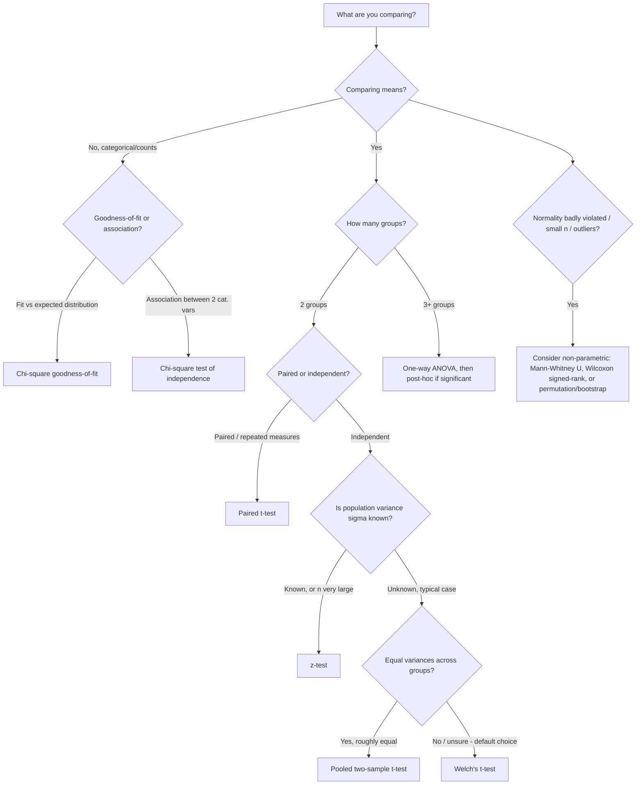
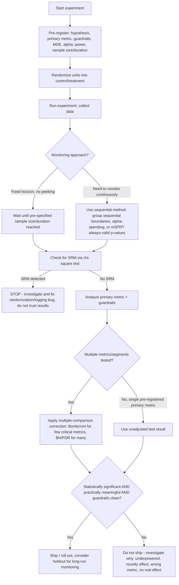

# Hypothesis Testing & A/B Testing

Statistical inference underlies nearly every "is this real or noise?" decision a data scientist makes, and A/B testing is the industrial application of that machinery to product and business decisions. This file builds the foundations of hypothesis testing from first principles (errors, p-values, power, test selection), then goes deep on the full lifecycle of a real-world A/B test — design, sizing, multiple comparisons, interference, peeking, non-normal metrics, and sample ratio mismatch — since this is a resume-anchored skill area for this candidate and gets outsized interview weight. Every formula is derived or stated explicitly; nothing is left as a "named concept" you have to look up separately.

## Table of Contents

- [Part A — Hypothesis Testing Foundations](#part-a--hypothesis-testing-foundations)
  - [1. Null vs Alternative Hypothesis](#1-null-vs-alternative-hypothesis)
  - [2. Type I and Type II Errors](#2-type-i-and-type-ii-errors)
  - [3. p-values: Precise Definition and Misinterpretations](#3-p-values-precise-definition-and-misinterpretations)
  - [4. Statistical Power](#4-statistical-power)
  - [5. Significance Level (alpha)](#5-significance-level-alpha)
  - [6. Test Types and Formulas](#6-test-types-and-formulas)
  - [7. Confidence Intervals](#7-confidence-intervals)
- [Part B — A/B Testing Deep Dive](#part-b--ab-testing-deep-dive)
  - [8. Designing an Experiment](#8-designing-an-experiment)
  - [9. Sample Size / Power Calculation](#9-sample-size--power-calculation)
  - [10. Multiple Testing Correction](#10-multiple-testing-correction)
  - [11. Novelty Effects and Interference/Network Effects](#11-novelty-effects-and-interferencenetwork-effects)
  - [12. The Peeking Problem and Sequential Testing](#12-the-peeking-problem-and-sequential-testing)
  - [13. Non-Parametric Tests](#13-non-parametric-tests)
  - [14. Handling Skewed Metrics](#14-handling-skewed-metrics)
  - [15. Sample Ratio Mismatch (SRM)](#15-sample-ratio-mismatch-srm)
- [Part C — Popular Interview Questions, Answered in Full](#part-c--popular-interview-questions-answered-in-full)
- [Quick Recall Sheet](#quick-recall-sheet)

---

## Part A — Hypothesis Testing Foundations

### 1. Null vs Alternative Hypothesis

Every hypothesis test starts with two competing, mutually exclusive statements about a population parameter (mean, proportion, variance, difference between groups, etc.):

- **Null hypothesis ($H_0$)**: the "no effect / no difference / status quo" statement. It is what you assume true until data provides sufficient evidence against it. Example: $H_0: \mu_A = \mu_B$ (the new checkout flow has the same conversion rate as the old one).
- **Alternative hypothesis ($H_1$ or $H_a$)**: the statement you're trying to find evidence for. Example: $H_1: \mu_A \neq \mu_B$.

**Formulating them properly:**
- $H_0$ must contain the equality (e.g., $=, \leq, \geq$) because the test statistic's null distribution is built by assuming a specific parameter value — you can't calibrate a test against an inequality.
- $H_1$ is the complement and encodes the direction of interest.

**One-tailed vs two-tailed:**

| | Two-tailed | One-tailed (right) | One-tailed (left) |
|---|---|---|---|
| $H_0$ | $\mu = \mu_0$ | $\mu \leq \mu_0$ | $\mu \geq \mu_0$ |
| $H_1$ | $\mu \neq \mu_0$ | $\mu > \mu_0$ | $\mu < \mu_0$ |
| Rejection region | both tails, $\alpha/2$ each | right tail, $\alpha$ | left tail, $\alpha$ |
| When to use | you care about a difference in either direction | you only care if it's an *improvement* (or only a *decline*) | symmetric case |

A one-tailed test is more powerful for detecting an effect in the specified direction (all of $\alpha$ is concentrated in one tail), but it is dangerous in practice: if the effect turns out to be large in the "wrong" direction, a one-tailed test as pre-registered cannot claim significance for it. In A/B testing specifically, most practitioners default to two-tailed tests unless there's a strong, pre-registered business reason to only care about one direction (e.g., a guardrail metric where you only care if it gets *worse*).

**Interview angle:**
> **Q: Why must the null hypothesis always contain the equality sign?**
> A: Because the entire testing procedure works by assuming a single, fixed value of the parameter under $H_0$ and deriving the sampling distribution of the test statistic under that assumption. If $H_0$ were an inequality (e.g., $\mu \leq \mu_0$), there would be a whole range of possible true values, each giving a different sampling distribution, and you couldn't compute a single p-value. In practice, the test is calibrated at the boundary value ($\mu = \mu_0$), which is also the worst case for Type I error control across the whole null region.

> **Q: When would you deliberately use a one-tailed test in an A/B test, and what's the risk?**
> A: I'd use one only when a decline in the direction opposite to my hypothesis is truly irrelevant to the decision — e.g., testing whether a new recommendation algorithm increases click-through rate, where the only decision on the table is "ship if it's better, don't ship otherwise," and a statistically significant decrease would lead to the same action (don't ship) as no effect. The risk is that it inflates power in a way that's easy to abuse: if you switch to one-tailed *after* seeing which direction the data leans, you're effectively p-hacking. It should be a pre-registration decision, not a post-hoc one, and most organizations default to two-tailed for defensibility.

---

### 2. Type I and Type II Errors

|  | $H_0$ is actually True | $H_0$ is actually False |
|---|---|---|
| **Reject $H_0$** | Type I Error (False Positive), probability = $\alpha$ | Correct decision (True Positive), probability = $1-\beta$ = **Power** |
| **Fail to reject $H_0$** | Correct decision (True Negative), probability = $1-\alpha$ | Type II Error (False Negative), probability = $\beta$ |

- **Type I error ($\alpha$)**: concluding there's an effect when there isn't one. In A/B testing: shipping a change that actually does nothing (or hurts), believing it helped.
- **Type II error ($\beta$)**: failing to detect a real effect. In A/B testing: killing a genuinely good change because the test didn't reach significance.

**The trade-off:** For a fixed sample size, decreasing $\alpha$ (making it harder to reject $H_0$) shifts the critical value in a way that necessarily increases $\beta$ (makes it harder to detect real effects), and vice versa. The only way to reduce both simultaneously is to increase sample size (which shrinks the sampling distribution's spread) or increase the effect size you're trying to detect. This is why sample-size planning is a joint decision over $\alpha$, $\beta$, effect size, and variance — you can't set all four independently and expect an arbitrary $n$ to satisfy them.

**Interview angle:**
> **Q: In a medical screening test vs. a marketing email A/B test, would you weight Type I and Type II errors differently, and why?**
> A: Yes — the cost asymmetry of the two error types depends entirely on business/domain context, and you should set $\alpha$ and target power accordingly rather than blindly using 0.05/0.80. For a cancer screening test, a Type II error (missing a real cancer) is catastrophic compared to a Type I error (a false alarm leading to a follow-up test), so you'd tolerate a higher $\alpha$ to buy lower $\beta$. For a low-stakes marketing email subject-line test, a Type I error (rolling out a "winning" subject line that's actually no different) mostly costs a bit of missed optimization, while being overly aggressive with many tests can waste engineering time — so a stricter $\alpha$, especially under multiple comparisons, is more appropriate. The key interview point is that $\alpha = 0.05$ is a convention, not a law, and the right values are a business decision informed by the relative cost of the two error types.

---

### 3. p-values: Precise Definition and Misinterpretations

**Precise definition:** the p-value is the probability, **assuming $H_0$ is true**, of observing a test statistic at least as extreme as the one actually observed.

$$p = P(\text{Test Statistic} \geq T_{obs} \mid H_0 \text{ true})$$

(for a two-tailed test, "at least as extreme" includes both tails, symmetric around the null value).

This is a statement about $P(\text{data} \mid H_0)$ — a probability of data given a hypothesis. It says **nothing** directly about $P(H_0 \mid \text{data})$ — the probability the hypothesis is true given the data.

**The classic misinterpretation trap:** "The p-value is the probability that the null hypothesis is true" — **this is wrong**, and the reason is a direct confusion of conditional probability directions, exactly the kind of error Bayes' rule exists to correct:

$$P(H_0 \mid \text{data}) \neq P(\text{data} \mid H_0)$$

Bayes' rule relates them as:

$$P(H_0 \mid \text{data}) = \frac{P(\text{data} \mid H_0) \, P(H_0)}{P(\text{data})}$$

To go from the p-value ($P(\text{data}\mid H_0)$, roughly) to $P(H_0 \mid \text{data})$ you would need the **prior probability** $P(H_0)$ that the null is true before seeing any data, and the marginal $P(\text{data})$ — neither of which a p-value calculation uses or provides. The p-value is purely a frequentist object computed under one fixed hypothesis; it has no mechanism to incorporate a prior over hypotheses, so it structurally cannot equal a posterior probability. This is exactly analogous to confusing $P(\text{positive test} \mid \text{disease})$ (sensitivity) with $P(\text{disease} \mid \text{positive test})$ (which also needs the disease's base rate).

**Other common misinterpretations to name in an interview:**
1. **"p = 0.03 means there's a 3% chance the result is due to random chance."** Wrong for the same reason above — this is again treating $P(\text{data}\mid H_0)$ as $P(H_0 \mid \text{data})$.
2. **"p = 0.20 means $H_0$ has a 20% chance of being true, so there's a 20% probability of 'no effect.'"** Same error, restated.
3. **"A smaller p-value means a larger / more important effect."** Wrong — the p-value conflates effect size and sample size. A tiny, practically irrelevant effect can produce a minuscule p-value with a large enough sample, and a large, meaningful effect can fail to reach significance with a small sample. p-values say nothing about magnitude or practical importance on their own — always report effect size and confidence intervals alongside.
4. **"Failing to reject $H_0$ (p > 0.05) proves $H_0$ is true / proves there's no effect."** Wrong — absence of evidence is not evidence of absence; it may simply mean the test was underpowered.

**Interview angle:**
> **Q: A junior analyst tells you "the p-value was 0.02, so there's a 2% chance the null hypothesis is true." What do you say?**
> A: I'd explain that this reverses the conditional probability. The p-value of 0.02 means: *if* the null hypothesis (no effect) were true, there would be a 2% chance of seeing a result this extreme or more extreme purely from sampling variability. It says nothing about the probability that the null itself is true — that would be $P(H_0 \mid \text{data})$, a posterior probability, which requires a prior $P(H_0)$ via Bayes' rule that the p-value calculation never uses. Concretely, if we tested 1,000 completely null-true effects (e.g., a coin we know is fair) with $\alpha=0.05$, about 50 of them would produce p < 0.05 purely by chance — the p-value doesn't distinguish "the 1 real effect" from "one of the 50 false alarms" without more information (like a prior or a replication).

---

### 4. Statistical Power

**Definition:** power is $1-\beta$, the probability of correctly rejecting $H_0$ when $H_1$ is actually true — i.e., the probability of detecting a real effect if one exists.

**Four things that affect power, and direction:**

| Factor | Effect on power as it increases | Intuition |
|---|---|---|
| Effect size ($\delta$, true difference) | ↑ increases power | Bigger true differences are easier to detect above noise |
| Sample size ($n$) | ↑ increases power | Standard error shrinks as $1/\sqrt{n}$, sharpening the sampling distribution |
| Significance level ($\alpha$) | ↑ increases power | A looser rejection threshold makes it easier to reject $H_0$ (at the cost of more false positives) |
| Population/sample variance ($\sigma^2$) | ↑ decreases power | More noise makes the signal harder to separate from chance |

**Power formula for a two-sample z-test** (comparing two means/proportions with known variances, large-sample approximation used heavily in A/B testing):

The test statistic under $H_1$ (true difference $\delta = \mu_1-\mu_2 \neq 0$) is approximately:

$$Z = \frac{\bar{X}_1 - \bar{X}_2 - \delta}{\sqrt{\sigma_1^2/n_1 + \sigma_2^2/n_2}} \sim N(0,1)$$

Power for a two-tailed test at level $\alpha$ is:

$$\text{Power} = 1 - \beta = P\left(|Z| > z_{1-\alpha/2} \;\Big|\; \delta \right) \approx \Phi\left(\frac{\delta}{SE} - z_{1-\alpha/2}\right)$$

where $SE = \sqrt{\sigma_1^2/n_1 + \sigma_2^2/n_2}$ and $\Phi$ is the standard normal CDF, $z_{1-\alpha/2}$ is the critical value (e.g., 1.96 for $\alpha=0.05$). This one-line formula is the basis for the sample-size formula derived in Part B, Section 9 — sample size calculations are literally "solve this equation for $n$ given a target power."

**Interview angle:**
> **Q: Your A/B test came back with p = 0.35 — no significant difference. Your PM says "great, the change has no effect, let's move on." How do you respond?**
> A: I'd first check power, not just the p-value. If the test was underpowered — say we only had enough traffic to reliably detect a 5% relative lift but the true effect was closer to 1% — then "no significant difference" doesn't mean "no effect," it means "we couldn't have detected this effect size even if it existed." I'd compute or recall the achieved power for the observed sample size and the minimum detectable effect (MDE), and possibly the effect size actually observed with its confidence interval. If the CI is wide and includes both practically meaningful positive and negative effects, the honest conclusion is "inconclusive, need more data" rather than "no effect," and I'd push back on treating this as a proven null result.

---

### 5. Significance Level (alpha)

$\alpha$ is the probability of Type I error you're willing to tolerate — the threshold below which a p-value is declared "statistically significant," and equivalently, the size of the rejection region under $H_0$.

**Why 0.05 is a convention, not a law:** it traces back to Ronald Fisher's somewhat arbitrary suggestion in the 1920s that a 1-in-20 chance was a reasonable line for "worth a second look," not a mathematically derived optimum. There is nothing special about it — the correct $\alpha$ depends on the relative cost of false positives vs false negatives in the specific decision at hand (Section 2), and industries like physics use much stricter thresholds (e.g., "5-sigma," $\alpha \approx 3\times10^{-7}$, for discovery claims) because false discoveries are extremely costly to their credibility.

**Consequences of p-hacking / multiple comparisons on the false-positive rate:** if you run many tests (or repeatedly test subgroups, metrics, or time cuts of the same experiment) each at $\alpha=0.05$, the probability that *at least one* comes back "significant" purely by chance grows quickly. For $m$ independent tests, each with Type I error $\alpha$, the family-wise error rate (probability of at least one false positive) is:

$$FWER = 1-(1-\alpha)^m$$

At $m=20$ independent tests with $\alpha=0.05$: $FWER = 1-(0.95)^{20} \approx 0.64$ — a 64% chance of at least one false "discovery" even if nothing real is happening anywhere. This is the formal basis for needing multiple-comparison corrections, covered in depth in Section 10. p-hacking (trying many metrics/cuts/models until something clears $p<0.05$, then reporting only that one) is exactly this problem committed implicitly and non-transparently.

**Interview angle:**
> **Q: Why isn't $\alpha = 0.05$ always the "right" threshold?**
> A: Because $\alpha$ is a policy decision about the acceptable false-positive rate for a specific decision, not a universal constant. It should reflect the asymmetry of costs: a low-stakes internal experiment where a false positive just means slightly wasted engineering effort can tolerate $\alpha=0.05$ or even looser; a high-stakes claim (a new drug's efficacy, a major site redesign that's expensive to roll back) warrants a stricter threshold like $\alpha=0.01$ or lower. Additionally, when running many tests simultaneously, using an uncorrected $\alpha=0.05$ per test causes the family-wise false-positive rate to balloon — with 20 independent tests it's already ~64% — so the *effective* threshold needs correction (Bonferroni, BH) to keep the overall error rate at the intended level.

---

### 6. Test Types and Formulas

**One-sample t-test** — tests whether a sample mean differs from a known/hypothesized value $\mu_0$:

$$t = \frac{\bar{x}-\mu_0}{s/\sqrt{n}}, \quad df = n-1$$

where $s$ is the sample standard deviation.

**Two-sample independent t-test, pooled (equal variance assumed):**

$$t = \frac{\bar{x}_1-\bar{x}_2}{s_p\sqrt{\tfrac{1}{n_1}+\tfrac{1}{n_2}}}, \qquad s_p = \sqrt{\frac{(n_1-1)s_1^2+(n_2-1)s_2^2}{n_1+n_2-2}}, \qquad df=n_1+n_2-2$$

$s_p$ is the pooled standard deviation, a weighted average of the two sample variances.

**Two-sample independent t-test, Welch's (unequal variance):** used when the two groups' variances can't be assumed equal (the safer default in A/B testing, since treatment can change variance too):

$$t = \frac{\bar{x}_1-\bar{x}_2}{\sqrt{\tfrac{s_1^2}{n_1}+\tfrac{s_2^2}{n_2}}}, \qquad df \approx \frac{\left(\tfrac{s_1^2}{n_1}+\tfrac{s_2^2}{n_2}\right)^2}{\tfrac{(s_1^2/n_1)^2}{n_1-1}+\tfrac{(s_2^2/n_2)^2}{n_2-1}} \quad \text{(Welch–Satterthwaite equation)}$$

The degrees of freedom formula gives a non-integer value in general; software rounds down or interpolates. Welch's test is recommended as the default two-sample t-test in most modern practice, since assuming equal variances when they aren't equal distorts the Type I error rate, and Welch's loses very little power when variances actually are equal.

**Paired t-test** — used when observations are naturally paired (before/after on the same user, matched pairs). Reduce to a one-sample t-test on the differences $d_i = x_{1i}-x_{2i}$:

$$t = \frac{\bar{d}}{s_d/\sqrt{n}}, \quad df = n-1$$

This is more powerful than an unpaired test when there's meaningful within-pair correlation, because it removes between-subject variance from the comparison.

**z-test vs t-test — when to use which:**

| | z-test | t-test |
|---|---|---|
| Population variance $\sigma^2$ | known | unknown, estimated by $s$ |
| Sample size | any, but typically used when $n$ large | any, but essential for small $n$ |
| Distribution used | Standard normal $N(0,1)$ | Student's $t$ with $df$ degrees of freedom (heavier tails) |
| Behavior as $n \to \infty$ | — | $t$-distribution converges to $N(0,1)$ |

In practice, for large $n$ (rule of thumb $n \gtrsim 30$ per group, though this depends on how skewed the underlying distribution is), the t and z tests give nearly identical results because $s \to \sigma$ and the $t$-distribution's tails converge to the normal. Most A/B testing on conversion rates uses a **z-test for proportions**, since with large sample sizes the sampling distribution of a proportion is well-approximated by a normal via the CLT.

**Chi-square goodness-of-fit test** — tests whether observed category counts match an expected/hypothesized distribution:

$$\chi^2 = \sum_{i=1}^{k} \frac{(O_i - E_i)^2}{E_i}, \quad df = k-1$$

where $O_i$ = observed count in category $i$, $E_i$ = expected count under $H_0$. This is exactly the test used to detect Sample Ratio Mismatch (Section 15).

**Chi-square test of independence** — tests whether two categorical variables are associated, using a contingency table:

$$\chi^2 = \sum_{i}\sum_{j} \frac{(O_{ij}-E_{ij})^2}{E_{ij}}, \quad E_{ij} = \frac{(\text{row}_i \text{ total})(\text{col}_j \text{ total})}{\text{grand total}}, \quad df=(r-1)(c-1)$$

**One-way ANOVA (Analysis of Variance)** — tests whether ≥3 group means are equal, using the ratio of between-group to within-group variance:

$$F = \frac{MS_{between}}{MS_{within}} = \frac{SS_{between}/(k-1)}{SS_{within}/(N-k)}$$

where:
- $SS_{between} = \sum_{j=1}^{k} n_j(\bar{x}_j - \bar{x}_{grand})^2$ (variance explained by group membership)
- $SS_{within} = \sum_{j=1}^{k}\sum_{i=1}^{n_j}(x_{ij}-\bar{x}_j)^2$ (residual variance within groups)
- $k$ = number of groups, $N$ = total sample size, $df_{between}=k-1$, $df_{within}=N-k$

Under $H_0$ (all group means equal), $F \sim F_{(k-1, N-k)}$ distribution.

**Why not just run many pairwise t-tests instead of ANOVA?** Because of the multiple-comparisons problem from Section 5 — testing $k$ groups pairwise requires $\binom{k}{2}$ tests, and each at $\alpha=0.05$ inflates the family-wise error rate (e.g., with 4 groups, 6 pairwise tests give $FWER = 1-0.95^6\approx 0.26$). ANOVA tests the single joint hypothesis "all means are equal" with one test at the nominal $\alpha$, controlling the overall Type I error rate; only if the omnibus F-test is significant do you proceed to post-hoc pairwise comparisons (e.g., Tukey's HSD), which have their own built-in multiple-comparison correction.

**Comparison table:**

| Test | Use case | Key assumptions | Test statistic |
|---|---|---|---|
| One-sample t-test | Sample mean vs known value | Normality (or large $n$), unknown $\sigma$ | $t=\dfrac{\bar{x}-\mu_0}{s/\sqrt n}$ |
| Two-sample t (pooled) | Compare 2 group means, equal variances | Normality, equal variances, independence | $t=\dfrac{\bar x_1-\bar x_2}{s_p\sqrt{1/n_1+1/n_2}}$ |
| Welch's t-test | Compare 2 group means, unequal variances | Normality (large-$n$ robust), independence | $t=\dfrac{\bar x_1-\bar x_2}{\sqrt{s_1^2/n_1+s_2^2/n_2}}$ |
| Paired t-test | Before/after, matched pairs | Differences approx. normal | $t=\dfrac{\bar d}{s_d/\sqrt n}$ |
| z-test | Compare mean/proportion, $\sigma$ known or large $n$ | Known $\sigma$ or CLT applies | $z=\dfrac{\bar x - \mu_0}{\sigma/\sqrt n}$ |
| Chi-square goodness-of-fit | Observed vs expected category counts | Expected counts $\geq5$ per cell | $\sum (O_i-E_i)^2/E_i$ |
| Chi-square independence | Association between 2 categorical vars | Expected counts $\geq5$ per cell | $\sum (O_{ij}-E_{ij})^2/E_{ij}$ |
| One-way ANOVA | Compare ≥3 group means | Normality, equal variances (homoscedasticity), independence | $F=MS_{between}/MS_{within}$ |

**Interview angle:**
> **Q: In an A/B test, why do most experimentation platforms default to Welch's t-test over the pooled/Student's t-test?**
> A: Because assuming equal variances between the control and treatment groups is often unjustified — a treatment (say, a new checkout flow) can change the variance of a metric even when it changes the mean only slightly, or even if it doesn't change the mean at all. Using the pooled test when variances actually differ distorts the true Type I error rate (it can be higher or lower than the nominal $\alpha$ depending on which group has the larger sample and variance). Welch's test corrects the degrees of freedom to account for the variance imbalance and has only a small power cost when variances happen to be equal, so it's a safe default.

> **Q: Why does ANOVA use an F-statistic (ratio of variances) rather than directly comparing means?**
> A: Because with more than 2 groups, there's no single "difference" to test — instead ANOVA asks whether the variability *between* group means is large relative to the variability *within* groups that we'd expect from pure sampling noise. If the null (all means equal) is true, both $MS_{between}$ and $MS_{within}$ are independent estimators of the same underlying error variance $\sigma^2$, so their ratio should be close to 1; a large F indicates the group means are more spread out than random chance would produce.

---

### 7. Confidence Intervals

For a sample mean with unknown population variance, the $(1-\alpha)\times100\%$ confidence interval uses the t-distribution:

$$\bar{x} \pm t_{1-\alpha/2, \, df}\cdot \frac{s}{\sqrt{n}}, \quad df = n-1$$

For large $n$ (or known $\sigma$), the normal-based version is used instead:

$$\bar{x} \pm z_{1-\alpha/2}\cdot \frac{\sigma}{\sqrt{n}}$$

**Precise correct interpretation:** a 95% confidence interval means that if you repeated the sampling-and-interval-construction procedure many times (imagine 100 independent experiments), approximately 95% of the resulting intervals would contain the true, fixed (but unknown) population parameter. It is a statement about the **long-run performance of the procedure**, not a probability statement about this one specific interval you just computed.

**Common (incorrect) interpretation:** "there is a 95% probability that the true parameter lies within this specific interval." This is wrong in the strict frequentist framework because, once the interval is computed from your one observed sample, it's a fixed pair of numbers — the true parameter either is or isn't in it (probability 1 or 0, we just don't know which); there's no remaining randomness in *that specific interval* to attach a 95% probability to. The 95% describes the *method's* coverage rate across repeated sampling, not this one realization. (Note: a Bayesian *credible interval* does support the "95% probability the parameter is in this range" statement, but that requires a prior and is a conceptually different object from a frequentist CI.)

**Interview angle:**
> **Q: What's wrong with saying "there's a 95% chance the true conversion rate lies in this confidence interval"?**
> A: Strictly, in the frequentist framework the true conversion rate is a fixed, if unknown, number — it's not a random variable, so it doesn't have a "95% chance" of being anywhere; it either is or isn't in the interval I computed. The randomness is in the interval itself, not the parameter: the correct statement is that the *procedure* used to construct the interval — sample, compute $\bar x \pm t \cdot SE$ — would capture the true value in about 95% of repeated experiments if I ran the study over and over. For a single interval from a single experiment, "95% confidence" describes my trust in the method, not a probability about this particular interval containing the truth. This distinction matters practically: it's why you shouldn't say "there's a 95% chance the lift is between 1% and 5%" from a single A/B test CI — that phrasing implicitly (and incorrectly) treats the true lift as random.

---

## Part B — A/B Testing Deep Dive

### 8. Designing an Experiment

**Forming a testable hypothesis:** a good A/B test hypothesis is specific and falsifiable, in the form: *"Changing X (the checkout flow) will cause metric Y (completion rate) to change by at least Z (a meaningfully-sized effect), because of mechanism M (reducing friction/clicks)."* Vague hypotheses ("let's see if this new design is better") make it impossible to pre-specify a primary metric, MDE, or sample size, and invite post-hoc metric shopping.

**Primary metric vs guardrail metrics:**
- **Primary (decision) metric**: the single metric the experiment is designed and powered to move, tied directly to the hypothesis — e.g., checkout completion rate for a checkout-flow redesign. There should typically be *one* primary metric to avoid the multiple-comparisons problem contaminating the ship/no-ship decision (Section 10).
- **Guardrail metrics**: metrics you don't expect to improve but must not regress — e.g., page load time, error rate, customer support contact rate, revenue per user, unsubscribe rate. Guardrails act as tripwires: even if the primary metric wins, a guardrail regression can veto the launch.
- **Secondary / diagnostic metrics**: help explain *why* the primary metric moved (e.g., funnel step-by-step drop-off) but aren't decision-driving on their own.

Example for a checkout-flow test: primary = completion rate; guardrails = average order value, page latency, error/exception rate, refund rate; secondary/diagnostic = per-step funnel drop-off, time-to-complete.

**Choosing the randomization unit — user vs session vs device:**

| Unit | Pros | Cons / risks |
|---|---|---|
| **User** (logged-in ID) | Consistent experience across sessions/devices; correct unit when treatment affects perceived consistency or has learning/habituation effects | Requires reliable login/identity; doesn't capture logged-out traffic well |
| **Session** | Simple, works without identity; good for session-scoped changes (e.g., a one-time UI test) | Same user can see both variants across sessions → contamination/inconsistent experience, biases metrics that span sessions (e.g., retention) |
| **Device / cookie** | Works for anonymous/logged-out traffic | Users with multiple devices get inconsistent treatment; cookie churn (clearing cookies) causes users to bounce between arms |

The randomization unit must be **at least as coarse as** the level at which the metric of interest is measured and at which meaningful spillover could occur. If you're measuring weekly retention, randomizing at the session level is wrong — the same user could experience both variants inconsistently within the same week, muddying the causal story.

**Interference / network effects risk:** if units interact (e.g., a marketplace where sellers and buyers, or friends within a social network, are split across arms), one arm's treatment can leak into the other — e.g., a "reduce prices for treatment group" experiment on a marketplace with fixed inventory means control-group buyers see less inventory because treatment-group buyers bought more of it, contaminating the control's counterfactual. This is discussed further with mitigations in Section 11.

**Interview angle:**
> **Q: For an experiment on a two-sided marketplace (e.g., ride-sharing pricing), why might per-user randomization give you a biased estimate of the treatment effect?**
> A: Because drivers and riders share a common, constrained pool of resources (available cars, surge capacity) — if I randomize riders into a "lower surge pricing" treatment, those riders will book more rides, consuming driver supply that would otherwise have been available to control-group riders. That shifts the control group's true experience (less availability, higher effective wait times) away from what it would be if the treatment didn't exist at all — a **violation of SUTVA** (the Stable Unit Treatment Value Assumption — one unit's outcome shouldn't depend on another unit's treatment assignment). This biases the naive per-user treatment effect estimate. The standard mitigation is switching to geographic or time-based (switchback) randomization, where whole markets or whole time windows get one treatment at a time, so the interference happens *within* an arm rather than *across* arms.

---

### 9. Sample Size / Power Calculation

**Setup:** comparing two proportions (baseline conversion rate $p_1$, and the rate under treatment $p_2 = p_1 + \delta$ where $\delta$ is the minimum detectable effect, MDE), testing at significance $\alpha$ (two-tailed) with target power $1-\beta$, equal allocation ($n_1=n_2=n$).

**Derivation sketch:** Under $H_0$ ($p_1=p_2$), the standardized difference in sample proportions is approximately normal. We need $n$ large enough that the critical value under $H_0$ and the point corresponding to power $1-\beta$ under $H_1$ are consistent with the observed $\delta$. This yields the standard formula:

$$n = \frac{\left(z_{1-\alpha/2}\sqrt{2\bar p(1-\bar p)} + z_{1-\beta}\sqrt{p_1(1-p_1)+p_2(1-p_2)}\right)^2}{\delta^2}$$

where $\bar p = (p_1+p_2)/2$, $\delta = p_2-p_1$, and $n$ is the required sample size **per arm**.

A commonly used simplified approximation (assuming $p_1\approx p_2$ for the variance term, which is fine for small-to-moderate MDEs) is:

$$n \approx \frac{2\,\bar p(1-\bar p)\,(z_{1-\alpha/2}+z_{1-\beta})^2}{\delta^2}$$

**Worked numeric example:** Suppose baseline conversion rate $p_1 = 5\%$, and we want to detect an absolute MDE of $\delta = 1$ percentage point (i.e., $p_2=6\%$), at $\alpha=0.05$ (two-tailed, so $z_{1-\alpha/2}=1.96$) and power $80\%$ ($z_{1-\beta}=z_{0.8}=0.8416$).

$\bar p = (0.05+0.06)/2 = 0.055$

$$n \approx \frac{2(0.055)(0.945)(1.96+0.8416)^2}{(0.01)^2} = \frac{2 \times 0.052 \times 7.845}{0.0001} \approx \frac{0.8168}{0.0001} \approx 8{,}168$$

So you'd need roughly **~8,200 users per arm** (~16,400 total) to reliably detect a 1-percentage-point absolute lift from a 5% baseline at 80% power / 5% significance. Note the strong sensitivity to $\delta$: halving the MDE to 0.5pp roughly quadruples the required $n$ (since $n \propto 1/\delta^2$) — a key intuition to state out loud in an interview.

**Key relationships to call out:**
- $n \propto 1/\delta^2$ — detecting smaller effects requires quadratically more data.
- $n \propto (z_{1-\alpha/2}+z_{1-\beta})^2$ — stricter $\alpha$ or higher target power both increase required $n$.
- $n \propto p(1-p)$ — variance is maximized near $p=0.5$ and shrinks near 0 or 1, so metrics with very low or very high baseline rates need proportionally less "variance-driven" sample size but are often harder to move by a fixed absolute delta.

**Interview angle:**
> **Q: Your PM wants to detect a 0.2 percentage-point lift on a metric with a 3% baseline, but you only get 50,000 users/week of eligible traffic. What do you do?**
> A: First, I'd actually run the sample-size formula to see how many weeks that requires, since $n$ scales as $1/\delta^2$ and a 0.2pp MDE on a 3% base is a very small relative effect (~6.7% relative lift) — likely requiring on the order of 100k+ users per arm, i.e., several weeks minimum, possibly much more depending on variance. If the required duration is impractical, I have a few levers: (1) negotiate a larger MDE if a smaller true effect wouldn't be business-meaningful anyway, (2) use variance-reduction techniques like CUPED (Section 14) to shrink the effective variance and thus the needed sample size for the same power, (3) switch to a more sensitive or upstream metric that has a stronger, less noisy signal (e.g., add-to-cart rate instead of final purchase, if that's a valid proxy), or (4) accept a lower power/looser $\alpha$ if the decision stakes support it. I'd present the trade-off transparently rather than silently shipping an underpowered test.

---

### 10. Multiple Testing Correction

**The problem, formally:** if you test $m$ independent hypotheses each at level $\alpha$, the probability of at least one false positive (family-wise error rate) is:

$$FWER = 1-(1-\alpha)^m$$

For $m=10$ tests at $\alpha=0.05$: $FWER = 1-0.95^{10}\approx 0.401$ — a 40% chance of at least one spurious "win" even if nothing is real. This is the exact scenario of testing many secondary metrics, many audience segments, or many variants in one experiment.

**Bonferroni correction:** the simplest fix — test each of the $m$ hypotheses at a stricter per-test threshold:

$$\alpha_{Bonferroni} = \frac{\alpha}{m}$$

This guarantees $FWER \leq \alpha$ (by the union bound: $P(\bigcup_i A_i) \leq \sum_i P(A_i) = m\cdot(\alpha/m) = \alpha$, true regardless of dependence structure between tests). It is simple and always valid, but **conservative** — as $m$ grows, the per-test threshold shrinks linearly, sharply reducing power to detect true effects, especially when tests are positively correlated (in which case the true FWER is already lower than the union bound suggests, making Bonferroni "over-correct").

**Benjamini-Hochberg (BH) procedure — controlling False Discovery Rate (FDR) instead of FWER:**

FDR = the expected proportion of false positives *among all rejected (declared significant) hypotheses* — a fundamentally different (and for large $m$, more useful) quantity than FWER, which asks about *any* false positive at all.

**Step-by-step BH procedure:**
1. Run all $m$ tests, obtain p-values $p_1, p_2, \ldots, p_m$.
2. Sort them in ascending order: $p_{(1)} \leq p_{(2)} \leq \cdots \leq p_{(m)}$.
3. For a target FDR level $q$ (e.g., $q=0.05$), find the largest rank $k$ such that:
$$p_{(k)} \leq \frac{k}{m}\cdot q$$
4. Reject (declare significant) all hypotheses with rank $\leq k$, i.e., all of $p_{(1)}, \ldots, p_{(k)}$.

Intuition: instead of a single flat threshold for all tests (Bonferroni), BH uses an increasingly lenient threshold for larger p-value ranks, which controls the *rate* of false discoveries among rejections rather than the probability of even one.

**When to prefer FDR (BH) over FWER (Bonferroni):**

| | FWER / Bonferroni | FDR / Benjamini-Hochberg |
|---|---|---|
| Controls | P(≥1 false positive across all tests) | Expected proportion of false positives among declared significant results |
| Conservativeness | Very conservative, especially for large $m$ | Less conservative, more power |
| Best used when | Small number of tests, each individually consequential (e.g., a handful of pre-registered guardrail metrics where any single false claim is costly) | Large number of tests where some false positives are tolerable as long as most declared "wins" are real (e.g., scanning dozens of experiment metrics, genomics-style multi-metric dashboards, many simultaneous experiment variants) |

In A/B testing practice: use Bonferroni (or just a few pre-registered guardrails tested individually with unadjusted or lightly-adjusted $\alpha$) when you have a handful of critical metrics where you truly can't tolerate any false claim; use BH when you're scanning many secondary/diagnostic metrics or many experiment arms/segments and want a reasonable trade-off between discovery power and false-positive control.

**Interview angle:**
> **Q: Your experimentation dashboard shows 15 metrics, and 3 of them are "significant" at p<0.05. How do you decide what to trust?**
> A: I'd first check whether any of these 15 were pre-registered as the primary decision metric — if one specific metric was designated primary before the test ran, I'd trust that one's result largely at face value (perhaps with a guardrail check on the others). For the rest, I'd apply a multiple-comparisons correction rather than trusting all 3 "wins" at face value, since with 15 tests at $\alpha=0.05$ the FWER is already $1-0.95^{15}\approx 0.54$ — more likely than not that at least one is a false positive purely from chance. I'd apply Benjamini-Hochberg across the 15 p-values to control the false discovery rate, since with this many simultaneous comparisons FDR gives a better power/false-positive trade-off than Bonferroni; I'd only reject Bonferroni-style flat correction if the decision truly hinges on a single, highly consequential metric.

---

### 11. Novelty Effects and Interference/Network Effects

**Novelty effects:** users react to a change simply because it's *new/different*, not because it's actually better — engagement can spike temporarily and then decay back to baseline (or below) as the novelty wears off ("novelty effect"), or conversely, users can show a temporary dip due to unfamiliarity/friction with the new design before improving as they learn it ("primacy/learning effect," sometimes called change aversion). Either way, a short experiment window risks measuring a transient reaction rather than the true steady-state effect.

**Mitigation — holdout periods:** run the experiment for long enough (multiple weeks) to let the novelty/primacy effect wash out, and examine the treatment effect trend over time (e.g., plot daily lift) rather than a single pooled number — a lift that's shrinking (or reversing) over the experiment duration is a novelty-effect red flag. A common practice is to maintain a long-running small holdout of never-treated users even after a broader rollout, to keep measuring the long-run true effect separately from the rollout population.

**Network / interference effects (spillover):** occur when a unit's outcome depends not only on its own treatment assignment but also on the treatment assignment of other units it interacts with — a violation of SUTVA (Stable Unit Treatment Value Assumption). Classic examples: social network features (a treated user's friends, who might be in control, are exposed to the treated user's new behavior/content), marketplace supply-demand competition (Section 8's ride-sharing example), or shared-resource systems (e.g., ranking/recommendation systems trained or served with pooled inventory).

**Why it biases results:** if treatment "leaks" into the control group (or vice versa), the control group is no longer a valid counterfactual for "what would have happened with no treatment at all" — it's contaminated by partial exposure. This typically causes the naive per-user estimate to **understate** the true effect (because control isn't a clean baseline anymore), though the direction of bias depends on the specific interference mechanism.

**Mitigation strategies:**
- **Cluster randomization**: randomize at the level of a naturally-isolated cluster (e.g., geographic market, social-network community, school, hospital) rather than individual users, so interactions mostly happen *within* a cluster (which is wholly treatment or wholly control) rather than *across* arms.
- **Switchback designs**: for shared/marketplace systems where clustering by geography isn't feasible or clusters are too large, alternate the *entire* system between treatment and control over short time windows (e.g., alternate every few hours which pricing algorithm is live city-wide) — this avoids cross-contamination within a time window at the cost of needing to be careful about carryover/lag effects between switches.
- **Ego-network / graph-cluster randomization**: for social-network features, cluster users into densely-connected communities first (via graph partitioning) and randomize whole clusters together, minimizing edges that cross treatment/control boundaries.
- **Holdout periods** (as above) also help distinguish genuine steady-state network effects from transient reactions.

**Interview angle:**
> **Q: You're testing a new "invite a friend" referral feature. Why is a standard per-user randomized A/B test potentially misleading here?**
> A: Because the feature's entire mechanism of action is inherently relational — a treated user (who sees the new invite flow) can bring in a friend who, if that friend happens to be a control-group user, now has an altered experience of the product (e.g., arriving with pre-seeded content, a referral credit) that they wouldn't have had in a true "no treatment exists anywhere" world. This spillover means the control group's outcomes are partly contaminated by the treatment, understating the feature's true effect — a SUTVA violation. I'd address this by randomizing at the cluster level — e.g., partition the social graph into loosely-connected communities and assign whole communities to treatment or control — or, if the feature's effect is more temporal/aggregate than user-specific, consider a switchback or geo-based randomization instead of individual-level assignment.

---

### 12. The Peeking Problem and Sequential Testing

**The problem:** it's tempting to check a running experiment's p-value every day and "call it" the moment it crosses $p<0.05$, then stop. This dramatically inflates the true false-positive rate beyond the nominal $\alpha$, even when $H_0$ is true.

**Why it happens — the random-walk intuition:** under $H_0$, the cumulative test statistic (or equivalently, the running p-value) behaves like a random walk over time as more data accrues — it wanders up and down due to sampling noise, not converging monotonically to any particular value. A classical fixed-sample test controls $\alpha$ only for **one look at one pre-specified sample size** — it asks "what's the probability this specific final statistic exceeds the threshold?" But if you check the statistic at many time points and stop the first time it *ever* crosses the threshold, you're really asking a different question: "what's the probability this random walk **ever** crosses the threshold at any point along its path?" That probability is much higher than the single-look probability, because a wandering random walk with enough steps will cross almost any fixed boundary with high, and in the unbounded-time limit, near-certain probability (related to the law of the iterated logarithm / optional stopping problems). Concretely, simulation studies show that continuously peeking at a two-arm test with a true null effect and stopping at the first p<0.05 can push the actual false-positive rate up to 20-30%+ (versus the nominal 5%) depending on peeking frequency and duration.

**Formal framing:** the fixed-horizon test's $\alpha$ guarantee is a statement about a single hypothesis test performed once, at one sample size. Repeated testing at multiple sample sizes without correction is equivalent to running many correlated hypothesis tests and taking the union of rejection events — directly related to the multiple-comparisons problem in Section 10, except here the "tests" are the same test repeated over an accumulating dataset, so they're highly (positively) correlated rather than independent, but the inflation effect is qualitatively the same: more chances to reject → higher realized Type I error.

**Sequential testing solutions:**

1. **Group sequential designs**: pre-specify a fixed number of "looks" (interim analyses) at the data (e.g., after 25%, 50%, 75%, 100% of planned sample size), and use a spending function (e.g., O'Brien-Fleming or Pocock boundaries) that allocates a shrinking "budget" of $\alpha$ to each interim look so the *total* Type I error across all looks still sums to the nominal $\alpha$. O'Brien-Fleming boundaries are very conservative early (hard to stop early) and relax toward the final look; Pocock boundaries spend $\alpha$ more evenly across looks.
2. **Alpha-spending functions**: a generalization of group sequential design that doesn't require pre-specifying the exact number/timing of looks — instead, define a monotonically increasing function $\alpha(t)$ of the information fraction $t\in[0,1]$ (fraction of planned sample collected) such that $\alpha(1) = \alpha$, and at each look, only "spend" the incremental piece of the $\alpha$ budget corresponding to the new information accrued. This gives flexibility on when to peek while maintaining overall Type I error control.
3. **mSPRT (mixture Sequential Probability Ratio Test) / "always-valid" p-values**: rather than a Neyman-Pearson-style fixed-horizon test, this approach (popularized by Optimizely/Microsoft-style "always valid inference") builds a test statistic (via a mixture of likelihood ratios over a prior on the effect size) whose associated p-value remains valid — i.e., maintains the Type I error guarantee — **no matter when or how many times you look**, including continuous monitoring. This is the practically most convenient solution for product teams who want to check dashboards daily without a statistician manually pre-specifying look times, because it makes "peek whenever you want" statistically safe by construction, at some cost of requiring somewhat more data to reach the same power compared to a well-planned fixed-horizon test.

**Practical takeaway for an interview:** the safest default without special tooling is to **pre-register a fixed sample size / duration and don't act on interim results** ("look but don't touch" — you can monitor for guardrail/bug catastrophes, but don't stop-early for a win on the primary metric unless using a validated sequential method). If the team wants to monitor continuously and act on results in real time, use a platform/library that implements always-valid inference (mSPRT-style) or a pre-specified group sequential design — never naive repeated t-tests with a fixed $\alpha=0.05$ threshold at each check.

**Interview angle:**
> **Q: Why does checking a dashboard's p-value every day and stopping the first time it dips below 0.05 inflate the false-positive rate, even though each individual check uses the "correct" threshold of 0.05?**
> A: Because the $\alpha=0.05$ guarantee from a standard test is a promise about looking at the data exactly once, at a pre-specified sample size — it bounds $P(\text{reject} \mid H_0) = 0.05$ for that one look. When you check repeatedly as data accrues, the running p-value fluctuates like a random walk under $H_0$ rather than moving monotonically, so across many looks there are many independent-ish chances for that random walk to dip below 0.05 purely by noise, even though the true effect is zero. Stopping the moment it first crosses the threshold means you're selecting on the most extreme point of a noisy trajectory, which is a form of optional stopping bias — the actual probability that the walk crosses 0.05 *at least once* over many looks is much higher than 5%. The fix is either to commit to a single look at a pre-registered sample size, or to use a method explicitly designed for repeated looks — group sequential boundaries with an alpha-spending function, or an always-valid/mSPRT-based test that keeps the cumulative Type I error at the nominal level regardless of how often you check.

---

### 13. Non-Parametric Tests

Used when the assumptions behind t-tests/ANOVA (normality, particularly for small samples; homogeneity of variance) are violated, or data is ordinal/ranked rather than continuous, or there are extreme outliers.

| Test | Parametric analogue | Use case | What it actually compares |
|---|---|---|---|
| **Mann-Whitney U test** (aka Wilcoxon rank-sum) | Two-sample (independent) t-test | Comparing two independent groups when normality is questionable or data is ordinal | Whether one group's values tend to be systematically larger than the other's, based on **ranks** of the pooled data, not means |
| **Wilcoxon signed-rank test** | Paired t-test | Comparing paired/matched samples when the differences aren't normally distributed | Whether the signed ranks of the within-pair differences are symmetric around zero |
| **Permutation test** | Any parametric test (very general) | Comparing any statistic (mean, median, ratio, etc.) between groups with minimal distributional assumptions | Whether the observed statistic is extreme relative to the distribution of the same statistic computed after randomly reshuffling group labels many times |
| **Bootstrap test/CI** | Any parametric test/CI | Constructing a CI or test for a metric (especially non-standard ones like a ratio, median, or percentile) where the analytic sampling distribution is unknown or intractable | Resamples the observed data (with replacement) many times to empirically approximate the sampling distribution of the statistic |

**When to reach for each vs a t-test:**
- **Mann-Whitney U**: small samples with visibly skewed/non-normal distributions, ordinal data (e.g., satisfaction ratings 1-5), or when outliers would badly distort a mean-based test. Note it technically tests a slightly different null hypothesis (stochastic dominance / equality of distributions) than "equal means," which is a common point of confusion — clarify this if asked.
- **Wilcoxon signed-rank**: paired-data version of the above, e.g., before/after within-user comparisons where the differences are skewed.
- **Permutation test**: when you want to test an arbitrary statistic (e.g., difference in medians, difference in a custom business metric, a ratio of ratios) without relying on a known analytic null distribution — you build the null distribution empirically by shuffling treatment/control labels and recomputing the statistic thousands of times, then see where your observed statistic falls in that empirical null distribution.
- **Bootstrap**: similar spirit but used more for constructing confidence intervals or standard errors for a complex statistic (e.g., median revenue per user, or a ratio metric like revenue/sessions) by resampling the data itself. In large-sample A/B testing, both permutation and bootstrap approaches are computationally cheap enough to be practical defaults, and they sidestep debates about whether the t-test's normality assumption "is close enough."

**Interview angle:**
> **Q: When would you choose a Mann-Whitney U test over a t-test in an A/B test analysis?**
> A: I'd reach for it if the metric is a small-sample, clearly non-normal continuous measurement (e.g., page load time or time-on-task, which are typically right-skewed with a long tail of slow outliers) or genuinely ordinal (e.g., a 1-5 satisfaction rating), where the mean isn't a robust or even meaningful summary and a few extreme values could dominate a t-test's result. It's worth being precise that Mann-Whitney tests a somewhat different hypothesis than the t-test — roughly, "is one group's distribution stochastically larger than the other's," based on rank sums, rather than "are the means equal" — so I'd make sure that's the question I actually care about before defaulting to it. In most large-sample A/B tests on business metrics I'd actually prefer a permutation or bootstrap test for the mean/median difference over Mann-Whitney, since it lets me test the exact statistic (e.g., mean revenue difference) I care about for the business decision, rather than a rank-based proxy.

---

### 14. Handling Skewed Metrics

Metrics like revenue, ARPU (average revenue per user), session duration, or time-to-purchase are typically heavily right-skewed (many zeros/small values, a long tail of high spenders/outliers) — this is common in demand-forecasting-adjacent and marketing-attribution contexts too, where a small share of customers/orders drive a large share of revenue.

**Why a t-test on raw skewed data can be unreliable at typical sample sizes:** the t-test relies on the Central Limit Theorem to justify treating the sampling distribution of the mean as approximately normal. For extremely skewed distributions (especially with a heavy right tail or a few very large outliers), the sample size needed for the CLT approximation to "kick in" well can be much larger than the typical few-thousand-to-tens-of-thousands users in a standard A/B test — the sampling distribution of the mean can remain noticeably skewed and heavy-tailed, meaning the nominal Type I error rate isn't actually achieved (often it's inflated), and confidence intervals can have poor coverage. A single whale customer/order in one arm can swing the observed mean difference dramatically, and the t-test's variance estimate ($s^2$) is itself unstable under heavy skew.

**Practical fixes:**

1. **Bootstrapping the sampling distribution of the mean/median**: resample the observed data (with replacement, same size as original sample) many times (e.g., 10,000 iterations) for each arm, compute the statistic of interest (mean, median, or the difference between arms) on each resample, and use the empirical distribution of these resampled statistics directly as the (approximate) sampling distribution — read off percentiles for a CI, or compute the fraction of resampled differences on the "wrong side" of zero for a p-value-like measure. This makes no normality assumption and directly captures the actual skew/heavy-tailedness of the data.
2. **Log-transform**: apply $\log(x+1)$ (the "+1" or similar offset handles zeros) to compress the right tail and make the distribution closer to normal, then run a standard t-test on the transformed values. **Caveat**: the test now answers a question about the geometric mean / median-like quantity on the *log scale*, not the arithmetic mean on the original scale — a statistically significant difference in log-transformed means does not directly translate to "X% higher average revenue" without care. Back-transforming (e.g., $\exp(\hat\delta)-1$) approximates a multiplicative/relative effect (roughly, percentage change in the geometric mean), not the additive difference in the arithmetic mean that the business usually cares about — this discrepancy should be called out explicitly when reporting results to stakeholders.
3. **Trimming / Winsorizing**: cap (winsorize) or remove (trim) the most extreme values (e.g., top/bottom 1%) before running the standard test. This reduces the influence of outliers and stabilizes the variance estimate, but changes the estimand — you're now estimating the treatment effect on a "typical user" excluding extreme whales, which may or may not be what the business wants to know (if whales are a large fraction of revenue, trimming them away can materially understate business impact — a genuine trade-off to flag).
4. **CUPED (Controlled-experiment Using Pre-Experiment Data)** — a variance-reduction technique, standard practice at this level even though not the primary ask here: use a pre-experiment covariate $X$ (e.g., the same metric measured for the same users before the experiment started) that's correlated with the outcome $Y$ but unaffected by treatment, and construct an adjusted metric:
$$Y_{CUPED} = Y - \theta(X - \bar{X}), \qquad \theta = \frac{Cov(X,Y)}{Var(X)}$$
This is exactly a residualization of $Y$ against the pre-period covariate $X$ (in spirit similar to fitting $Y$ on $X$ via OLS and removing the predictable component). $Y_{CUPED}$ has the same expectation as $Y$ (since $E[X-\bar X]=0$) but strictly lower variance whenever $X$ and $Y$ are correlated, since $Var(Y_{CUPED}) = Var(Y)(1-\rho_{X,Y}^2)$. Lower variance directly translates into either a shorter required experiment duration for the same power, or higher power for the same duration — a substantial practical win at large tech companies with high-variance revenue metrics, since users' pre-period behavior is often strongly predictive of their in-period behavior.

**Interview angle:**
> **Q: You're A/B testing a pricing change and the primary metric is revenue per user, which is famously right-skewed. A vanilla t-test gives p=0.04, but you're suspicious. What do you check, and what would you do differently?**
> A: First I'd look at the raw distribution — a handful of very large orders can single-handedly swing a t-test's result, so I'd check whether the "significant" result is being driven by one or two outliers in one arm, which the t-test's mean/variance are sensitive to. I'd re-run the analysis with a bootstrap: resample each arm's data with replacement thousands of times, compute the difference in means (or medians) on each resample, and build an empirical confidence interval / p-value from that — this doesn't assume normality and directly reflects the actual skewness. I'd also compare with a log-transformed t-test as a robustness check, being explicit that the log-scale result reflects roughly a multiplicative/relative effect on the geometric mean, not the arithmetic-mean dollar impact leadership will want to see. If the bootstrap and log-transform corroborate the raw t-test's conclusion (roughly the same direction and comparable significance), I'd trust the result more; if they disagree substantially, I'd flag the raw t-test result as fragile and likely outlier-driven, and dig into which specific users/orders are responsible before making a ship decision. I'd also consider whether CUPED using pre-period revenue as a covariate could have given a cleaner, lower-variance estimate from the start.

---

### 15. Sample Ratio Mismatch (SRM)

**What it is:** when the actual observed split of users across experiment arms deviates from the intended/expected allocation (e.g., you configured a 50/50 split but observe 49,200 in control vs 50,800 in treatment far beyond what random chance would produce) — this is a *diagnostic* check, not a hypothesis about the metric itself, and must be checked **before** trusting any metric result from the experiment.

**Why it invalidates an experiment:** SRM is a strong signal that randomization or logging is broken in some systematic way — and if that's true, there's no guarantee the two groups are otherwise comparable (the core assumption underlying causal interpretation of the A/B comparison). Any observed metric difference could then be an artifact of *which kind of users* ended up disproportionately in one arm (a confound), not a causal effect of the treatment itself. A "statistically significant" result on top of an SRM is not trustworthy and should not be used to make a ship decision.

**How to detect it — chi-square goodness-of-fit test:** compare observed counts per arm against the expected counts under the intended allocation ratio.

$$\chi^2 = \sum_{i=1}^{k} \frac{(O_i-E_i)^2}{E_i}, \quad df = k-1$$

For a standard 2-arm 50/50 test with $N$ total users, $O_1, O_2$ observed counts and $E_1=E_2=N/2$ expected:

$$\chi^2 = \frac{(O_1-N/2)^2}{N/2} + \frac{(O_2-N/2)^2}{N/2}$$

Compare $\chi^2$ against the $\chi^2$ distribution with $df=1$; a conventional practice is to use a *much stricter* threshold than the usual $\alpha=0.05$ for SRM checks — e.g., $p<0.001$ (equivalently $\chi^2 > 10.83$ roughly) — because SRM checks are run routinely on every experiment (effectively many repeated tests across an organization's whole experiment portfolio), and because the cost of missing a true SRM (silently shipping a biased conclusion) is high relative to the cost of a false alarm (re-checking a healthy experiment).

**Worked numeric example:** intended 50/50 split, $N=100{,}000$ total, observed $O_1=49{,}500$ (control), $O_2=50{,}500$ (treatment), expected $E_1=E_2=50{,}000$:

$$\chi^2 = \frac{(49{,}500-50{,}000)^2}{50{,}000}+\frac{(50{,}500-50{,}000)^2}{50{,}000} = \frac{250{,}000}{50{,}000}+\frac{250{,}000}{50{,}000}=5+5=10$$

With $df=1$, $\chi^2=10$ corresponds to $p\approx0.0016$ — below a strict SRM threshold like 0.001 it's borderline/flagged for investigation; this illustrates how even a seemingly small 500-user (1%) imbalance out of 100k can be statistically far from chance, because with $N=100{,}000$ the expected sampling noise around a 50/50 split is tiny.

**Common root causes:**
- **Bucketing/hashing bugs**: the randomization function (e.g., hash of user ID mod 100) has a subtle bias, or its output isn't uniformly distributed for the given user ID space.
- **Differential logging/instrumentation**: one arm's exposure/assignment events are logged or fire at a different rate than the other (e.g., the treatment's new UI has a client-side bug that fails to log the "user was bucketed" event for some fraction of users, especially on slow devices).
- **Bot/crawler filtering asymmetry**: automated traffic filters interact differently with one arm (e.g., treatment loads slower and gets timed out/filtered by a bot-detection or quality filter more often).
- **Redirect/funnel asymmetry**: if assignment happens at one point in a funnel (e.g., page load) but eligibility/analysis happens at another (e.g., only users who reach checkout are analyzed), and the treatment itself changes who reaches that later point, you can get an SRM in the *analyzed* population even if the true randomization was clean at the top of the funnel.
- **Caching or pre-fetching artifacts**: cached content/pages assigned before an experiment started can bypass proper (re-)randomization for some users.
- **Multiple/simultaneous experiments interacting**: overlapping experiments or platform migrations can subtly disturb an otherwise clean random assignment mechanism.

**Interview angle:**
> **Q: How would you detect and diagnose a Sample Ratio Mismatch in a live A/B test?**
> A: I'd run a chi-square goodness-of-fit test comparing the observed counts in each arm to the expected counts under the intended allocation (e.g., 50/50), using $\chi^2=\sum (O_i-E_i)^2/E_i$ with $df=k-1$ arms minus 1. Because SRM checks are effectively run as a standard, repeated diagnostic across every experiment in the organization's portfolio, I'd use a much stricter threshold than the usual 0.05 — commonly $p<0.001$ — to avoid constantly flagging healthy experiments due to routine multiple-testing noise, while still catching real issues (since a genuine randomization bug tends to produce very large chi-square statistics, not borderline ones). If SRM is flagged, I would not trust any metric result from that experiment — I'd instead dig into the assignment and logging pipeline: check whether the bucketing/hash function is uniform across the ID space, whether exposure-logging fires at equal rates in both arms (a common culprit is the treatment's new code path silently failing to fire the assignment event for a subset of users, e.g., due to a client-side error only present in the new UI), whether bot-filtering or funnel-stage eligibility differs between arms, and whether any overlapping experiments or caching layers could have disturbed the randomization.

---

## Part C — Popular Interview Questions, Answered in Full

**"Explain a p-value to a non-technical stakeholder."**

I'd avoid statistical jargon and use an analogy: "Imagine we assume, for the sake of argument, that our new checkout flow makes absolutely no difference to whether people complete a purchase — that's our starting assumption. The p-value tells us: if that assumption were actually true, how surprising would it be to see a difference in conversion rates at least as big as what we actually observed, just from random noise in who happened to visit the site? A small p-value, like 0.01, means 'this result would be quite surprising/rare if there really were no effect' — so we start to doubt that starting assumption and lean toward believing the new flow really did something. A p-value of 0.4 means 'this result wouldn't be surprising at all even if nothing changed' — so we don't have strong evidence of a real effect." I'd explicitly avoid saying "there's a 5% chance this is due to random luck" phrased as a probability that the null is true, since that's a subtly different (and technically incorrect) statement — I'd stick to the "how surprising would this be if nothing were going on" framing, which captures the right idea without the jargon.

**"How would you design an A/B test for a new checkout flow?"**

I'd start with a clear, falsifiable hypothesis: "The new one-page checkout flow will increase checkout completion rate by reducing the number of steps/clicks, relative to the current multi-page flow." Primary metric: checkout completion rate (orders started → orders completed). Guardrail metrics: average order value (make sure we're not just converting smaller/rushed orders), page load time, payment error rate, and refund/chargeback rate (a sneaky failure mode where "completion" goes up but quality goes down). Randomization unit: I'd randomize at the user level (using a stable logged-in ID where available, falling back to a persistent cookie/device ID for guests), assigned at first entry to checkout, since a user's checkout experience should be internally consistent and checkout doesn't usually have cross-user interference concerns (unlike a marketplace/social feature). I'd compute the required sample size upfront using the baseline completion rate, a business-agreed MDE (e.g., a 1 percentage point absolute lift), $\alpha=0.05$, and 80% power, and pre-commit to a fixed run duration covering at least one full weekly cycle (to average out day-of-week effects) — ideally 2+ weeks to let any novelty/primacy effects stabilize. Before analyzing results, I'd run an SRM check via chi-square test on the arm allocation. Then I'd analyze the primary metric with Welch's t-test (or a z-test for proportions) and check all guardrails, applying a multiple-comparison correction across the guardrails if testing several, and only ship if the primary metric shows a statistically *and* practically significant improvement with no guardrail regressions.

**"You run an A/B test and the p-value is 0.06 — what do you do?"**

I would not treat 0.05 as a hard cliff where 0.049 means "real" and 0.06 means "nothing happened" — that's a common but flawed binary framing given both values reflect very similar strength of evidence. My first step is to check whether the test was adequately powered for the pre-registered MDE: if power was borderline, a p=0.06 with a directionally-positive, practically meaningful effect size is more likely a true positive we simply didn't have enough data to confirm at the stricter threshold, not evidence of "no effect." I'd look at the point estimate and confidence interval, not just the p-value — e.g., if the 95% CI for the lift is [-0.1%, +2.3%], the data is broadly consistent with a meaningful positive effect and a p=0.06 shouldn't be read as "the effect is zero." Practical next steps: (a) if traffic/time allows without introducing peeking bias, extend the experiment to the next pre-planned checkpoint (not an ad hoc "just a bit longer," which reintroduces the peeking problem) to gain more power, (b) check for issues like SRM, novelty effects, or unequal variance that might be adding noise, (c) if this is a low-cost, easily-reversible change, consider a longer or replication run rather than making an irreversible call off one borderline result, and (d) ultimately weigh the decision against the cost of a Type I vs Type II error for this specific business context rather than mechanically applying a fixed 0.05 cutoff.

**"How do you handle multiple metrics in one experiment without inflating false positive rate?"**

The first line of defense is experimental design, not statistical correction after the fact: designate exactly one primary/decision metric before the test runs, and treat everything else as either a guardrail (tested individually, since a guardrail regression should independently veto a launch regardless of the primary metric's multiple-comparisons status) or a secondary/diagnostic metric (used to understand *why*, not to make the ship/no-ship call). This avoids most of the multiple-comparisons problem by construction, since the decision doesn't depend on "did any of N metrics come back significant." For situations where I genuinely need to evaluate many metrics on equal footing (e.g., a broad platform change with many plausibly-affected KPIs, or scanning many audience segments), I'd apply a correction: Bonferroni ($\alpha/m$) if the list is short and each metric is individually consequential enough that I can't tolerate any false claim, or Benjamini-Hochberg to control the false discovery rate if scanning a longer list where I can tolerate a controlled fraction of false discoveries among the ones I flag as significant. I'd also always pair statistical significance with a check on practical/business significance (effect size vs. a pre-agreed minimum meaningful threshold) as an additional filter against acting on noise.

**"What's the difference between covariance and correlation?"**

Briefly: covariance measures the direction of the linear relationship between two variables ($Cov(X,Y)=E[(X-\mu_X)(Y-\mu_Y)]$) but its magnitude is in the product of the variables' units and is unbounded, making it hard to compare across variable pairs. Correlation ($\rho = Cov(X,Y)/(\sigma_X\sigma_Y)$) normalizes covariance by both variables' standard deviations, producing a unitless value bounded in $[-1,1]$ that's directly comparable across different pairs of variables — this is why correlation, not covariance, is the standard tool for judging the *strength* of a linear relationship. (Full treatment of variance/covariance/correlation, including the correlation-vs-causation distinction, is covered in the core probability & statistics file of this kit.)

**"How would you detect if an A/B test has a sample ratio mismatch (SRM)?"**

See Section 15 in full above — in short: run a chi-square goodness-of-fit test comparing observed vs. expected arm counts ($\chi^2=\sum(O_i-E_i)^2/E_i$, $df=k-1$), using a strict threshold (commonly $p<0.001$, not the usual 0.05) since SRM checks are effectively run routinely across an entire experimentation platform's portfolio. If flagged, treat all metric results from that experiment as untrustworthy until the root cause (bucketing/hashing bugs, differential logging/instrumentation, bot-filtering asymmetry, funnel-stage eligibility mismatches, or caching artifacts) is found and fixed.

---

## Additional Common Interview Questions

**Q: What is an A/A test, and why would you run one?**

An A/A test splits traffic into two (or more) groups using the exact same experimentation pipeline as a real A/B test, but shows both groups the identical experience — there is no treatment at all, so the true effect is known to be zero by construction. The point isn't to learn anything about a product change; it's to validate the *experimentation system itself* before trusting it for real experiments. Concretely, an A/A test lets you check: (1) that the randomization/bucketing mechanism actually produces a balanced split — run the SRM chi-square check (Section 15) on it, since any imbalance here is unambiguously a plumbing bug, not a real effect; (2) that the observed false-positive rate across many metrics roughly matches the nominal $\alpha$ — e.g., if you evaluate 100 metrics on an A/A test and expect about 5 to show $p<0.05$ purely by chance, seeing 30 "significant" metrics would indicate the variance estimation or logging pipeline is broken (metrics are noisier than assumed, or there's leakage/duplication in the data); and (3) that the assumed variance used in sample-size planning matches the empirically observed variance, since sample-size formulas (Section 9) depend on a variance estimate that's often taken from historical data and can be wrong. In practice, running a quick A/A test — or periodically holding out a small "always A/A" slice of traffic on a mature experimentation platform — is a cheap, high-leverage way to catch bucketing bugs, logging bugs, or violated statistical assumptions before they silently bias every real experiment run on the platform.

**Q: What's the difference between a confidence interval and a prediction interval, and why does it matter for A/B testing?**

Both are interval estimates built from the same sample, but they answer different questions. A confidence interval (Section 7) is an interval for a **population parameter** — e.g., the true average treatment effect $\delta$ across the whole user base — and its width shrinks toward zero as $n\to\infty$, because with infinite data you can pin down a fixed population quantity exactly: $\bar x \pm t_{1-\alpha/2,df}\cdot \frac{s}{\sqrt n}$. A prediction interval is instead an interval for a **single future/individual observation** — e.g., "what range would one particular user's or one particular store's outcome fall into" — and it must account for both the uncertainty in estimating the mean *and* the inherent variability of individuals around that mean, so it never shrinks to a point even as $n\to\infty$:

$$\bar{x} \pm t_{1-\alpha/2,\,df}\cdot s\sqrt{1+\frac{1}{n}}$$

As $n$ grows, the $1/n$ term vanishes but the "$1$" doesn't — the prediction interval asymptotes to $\bar x \pm z_{1-\alpha/2}\cdot s$, reflecting irreducible individual-level variance, while the confidence interval keeps shrinking. In an A/B testing context this distinction matters when a stakeholder asks two superficially similar but different questions: "what's our best estimate of the true average lift, and how precise is it?" (confidence interval — the right tool for a ship/no-ship decision on the aggregate effect) versus "if we roll this out, what range of outcomes should a specific store/region/cohort expect?" (prediction interval — relevant for setting expectations with an individual stakeholder, e.g., a specific market's GM asking "will *my* market see this lift," where individual-market variance around the average effect can be large even when the average effect itself is precisely estimated).

**Q: How would you explain the difference between statistical significance and practical (business) significance to a stakeholder?**

I'd frame it as "statistically significant" answers *"are we confident this effect is real and not just noise?"* while "practically significant" answers *"is this effect big enough to actually matter for the business?"* — and a result can satisfy one without the other. With enough sample size, even a genuinely tiny, business-irrelevant effect will eventually produce a vanishingly small p-value, because the p-value conflates effect size with sample size (Section 3) — e.g., testing a button color change with 10 million users could yield $p<0.0001$ for a 0.01 percentage-point conversion lift that isn't worth the engineering cost of maintaining two code paths. Conversely, a large, business-meaningful effect can fail to reach significance if the sample size is too small (an underpowered test, Section 4) — that's a "we don't have enough evidence yet" situation, not "there's no effect." The fix is to always report and act on effect size and its confidence interval alongside the p-value, and — most importantly — to set the minimum detectable effect (MDE) *before* running the test based on what lift would actually be worth shipping (accounting for engineering/maintenance cost, opportunity cost of the team's time, and any negative guardrail trade-offs), so "significant" and "big enough to matter" are calibrated together from the start rather than debated after the fact when it's tempting to rationalize whichever number came back.

**Q: You notice the treatment group has much higher variance than the control group. What do you do?**

First I'd confirm it's real and not a data artifact — check for outliers or a logging bug that's inflating variance in just one arm (e.g., a new UI path double-firing events for a subset of users), and formally test for the variance difference with something like Levene's test (an F-test/ANOVA run on the absolute deviations of each observation from its group's median, robust to non-normality, rather than assuming equal variances outright). If the variance difference is genuine, it's often not just a statistical nuisance but a substantive finding: it suggests the treatment has a **heterogeneous effect** — helping some users a lot while hurting or not affecting others, producing a bimodal or fatter-tailed distribution in treatment even if the *average* effect looks modest. That's worth investigating directly via segment analysis (with an appropriate multiple-comparisons correction per Section 10, since segment-cutting is exactly the multiple-testing scenario described there) to see if there's an identifiable subgroup driving the variance, which can itself be actionable (e.g., "ship to power users only"). Statistically, the practical fix is straightforward: never use the pooled/Student's t-test's equal-variance assumption here — Welch's t-test (Section 6) already handles unequal variances correctly by adjusting the degrees of freedom, so use that as the default rather than trying to "fix" the variance. If the inflated variance is driven by a handful of extreme outliers rather than genuine heterogeneity, a bootstrap-based test or trimmed/Winsorized comparison (Section 14) can give a more stable estimate; if it's driven by real heterogeneity, no transformation should paper over it — that's signal, not noise, and deserves its own analysis rather than being averaged away.

**Q: What's the difference between a false positive rate and a false discovery rate, in plain terms?**

They sound similar but condition on different things, which is the exact same distinction as FWER vs. FDR in Section 10, restated at the level of a single test vs. a batch of results. The **false positive rate (FPR)**, which for a single test is just $\alpha$, is the probability that a *truly null* effect incorrectly comes back significant — it's a statement made *before* seeing any results, conditioned on the ground truth being "no effect": $FPR = P(\text{reject }H_0 \mid H_0\text{ true})$. The **false discovery rate (FDR)** is instead the expected proportion of false positives *among the results you've already declared significant* — a statement made *after* seeing your list of "wins," conditioned on having rejected: roughly $FDR = E\left[\frac{FP}{FP+TP}\right]$ where $FP+TP$ is the total number of significant results. A clean way to see the contrast: imagine testing 1,000 completely null (truly-no-effect) metrics at $\alpha=0.05$ — the FPR per test is 5% by definition, and you'd expect about 50 false alarms; if instead you test 500 null and 500 truly-real effects and end up with 400 "significant" results total, of which 40 are the false alarms from the null group, your FDR is $40/400 = 10\%$ even though the per-test FPR is still 5%. In practice, FPR/$\alpha$ is what you *set* before running any test (it's a design parameter), while FDR is what you *estimate or control* after looking at a batch of results (via Benjamini-Hochberg) — this is exactly why BH is described as controlling a different, more informative quantity than a flat per-test threshold once you're evaluating many metrics or segments at once.

**Q: Two metrics disagree after an experiment — say, revenue per user goes up but customer satisfaction (or a retention proxy) goes down. How do you decide whether to ship?**

The first thing I'd check is whether this was anticipated: if the primary/decision metric and guardrail metrics were designated *before* the test ran (Section 8), the decision rule is often already implicit — a guardrail regression can veto a launch regardless of what the primary metric shows, precisely so this situation doesn't get relitigated ad hoc under pressure to ship. If the two conflicting metrics are both legitimately important and weren't pre-ranked, I'd resist the temptation to pick whichever number supports the outcome I want, and instead: (1) dig into *why* they diverge — e.g., is the revenue increase coming from more aggressive upsells or a dark-pattern-style flow that's plausibly the direct cause of the satisfaction drop, in which case the two metrics are telling a coherent story about a real trade-off, versus the two movements being unrelated/noisy, in which case one might just not be statistically or practically significant on closer inspection; (2) check statistical significance and effect size on both — a "down" metric that's within its confidence interval of zero isn't actually in conflict with an "up" metric that's a real effect; (3) think about time horizon — a short-term revenue gain that trades off a long-term retention/trust metric is a classic pattern where the short-term metric moves first and the long-term cost shows up later (or in a longer holdout), so I'd weight a credible retention/satisfaction signal more heavily than a same-window revenue signal if there's reason to think revenue is being "borrowed" from the future; and (4) if this trade-off is likely to recur, propose a pre-agreed Overall Evaluation Criterion (OEC) — a single composite metric with business-agreed weights on revenue vs. satisfaction/retention — so future conflicts are resolved by a formula decided in advance rather than by whoever argues more persuasively after the results are in.

**Q: How do you calculate the required sample size for an A/B test when the metric is a continuous measure (like revenue per user or session duration) rather than a conversion rate?**

The derivation mirrors the proportions case in Section 9 exactly, just swapping the proportion's variance $p(1-p)$ for the metric's actual variance $\sigma^2$. For comparing two means with a true difference $\delta = \mu_2-\mu_1$ you want to detect, equal allocation, and (for simplicity) similar variance $\sigma^2$ in both arms:

$$n \approx \frac{2\sigma^2(z_{1-\alpha/2}+z_{1-\beta})^2}{\delta^2}$$

where $n$ is again the required sample size **per arm**. Since $\sigma$ and $\delta$ are often more naturally expressed together as a standardized effect size (Cohen's $d = \delta/\sigma$, "how many standard deviations apart are the two means"), this is frequently rewritten as $n \approx \dfrac{2(z_{1-\alpha/2}+z_{1-\beta})^2}{d^2}$, making explicit that sample size for a mean-comparison test depends only on the *standardized* effect size, not the raw units. Worked example: suppose historical data shows session duration has $\sigma \approx 40$ seconds, and we want to detect a $\delta = 5$-second lift at $\alpha=0.05$ (two-tailed, $z=1.96$) and 80% power ($z=0.8416$): $n \approx \dfrac{2(40)^2(1.96+0.8416)^2}{5^2} = \dfrac{2(1600)(7.845)}{25} = \dfrac{25{,}104}{25}\approx 1{,}004$ users per arm. The practical wrinkle versus the proportions case is that $\sigma$ isn't bounded between fixed limits the way $p(1-p)$ is — you have to estimate it from historical/pilot data or a similar past experiment, and if that estimate is wrong (e.g., the true metric is more variable than the historical pilot suggested, or a heavy-tailed metric like revenue has an unstable sample variance — Section 14), the resulting sample size can be badly miscalibrated; it's good practice to sanity-check the assumed $\sigma$ against the most recent production data right before launching, not just a stale historical number.

**Q: What is Simpson's paradox, and how could it show up in A/B test analysis?**

Simpson's paradox is when a trend that holds in the aggregated data reverses (or disappears) once the data is broken down by a confounding subgroup — e.g., treatment looks worse than control overall, but treatment is actually better than control within *every* individual segment (new users, returning users, mobile, desktop, etc.), because the *mix* of segments differs between the two arms. This can happen in an A/B test even when the raw arm sizes pass an SRM check (Section 15), because SRM only checks the *overall* 50/50 split, not whether the composition *within* that split is balanced — e.g., if the experiment ramped up gradually and a marketing campaign shifted the incoming user mix (more new, lower-intent users) disproportionately into one arm during a specific week, or if randomization is nominally at the user level but one arm's users are systematically more likely to be observed for a different average duration (survivorship-style imbalance), the pooled comparison can be confounded by segment mix even with a clean overall allocation. The practical defense is twofold: (1) check covariate balance across arms on pre-experiment characteristics (tenure, device, historical spend), not just the total N, ideally as a standard pre-launch health check alongside the SRM test; and (2) when a pooled result looks surprising or contradicts intuition, slice it by the plausible confounders and check whether the direction is consistent within each slice — if the aggregate and the disaggregated views disagree, trust the segment-consistent story and investigate the mix-shift mechanism before making a launch decision on the pooled number alone.

**Q: What's the difference between an A/B test and a multi-armed bandit approach, and when would you use each?**

Both are experimentation frameworks, but they optimize for different things. A fixed-horizon A/B test allocates traffic in fixed proportions (e.g., 50/50) for a pre-specified duration, computes a rigorous statistical comparison at the end, and *then* routes 100% of traffic to the winner — it fully "explores" during the test and only "exploits" afterward, which means some users are deliberately shown the (possibly inferior) losing variant for the entire test duration purely for the sake of clean measurement. A multi-armed bandit instead continuously shifts traffic *during* the test toward whichever arm is currently performing better (using algorithms like Thompson sampling, UCB, or epsilon-greedy), explicitly minimizing **regret** — the cumulative opportunity cost of showing users an inferior option — at the cost of a less "clean" causal comparison, since the allocation itself is adaptive and correlated with the observed outcomes rather than fixed and independent of them (this makes classical confidence intervals and p-values computed naively on bandit data invalid without specialized adjustment). The practical trade-off: use a bandit when the opportunity cost of serving the losing variant is high and you mainly care about the operational objective (e.g., maximizing clicks on a rotating set of headlines or ad creatives in real time, where you don't need a precise, defensible effect-size estimate — you just want the best-performing option shown most often); use a traditional fixed-horizon A/B test when you need a rigorous, unbiased, and interpretable estimate of the treatment effect to support a discrete business decision (ship/no-ship, a go/no-go for an irreversible or costly change, or anything where guardrail metrics and a defensible causal claim matter more than in-test optimization).

**Q: Beyond hitting the required sample size, how do you decide how long to actually run an A/B test?**

Sample size alone tells you the *minimum* number of units needed for the desired power — it doesn't account for time-based confounds that a purely numerical target can miss if traffic is high enough to hit that number in, say, two days. First, business-cycle effects: user behavior varies systematically by day of week (weekday vs. weekend shopping patterns) and sometimes by time of month (paycheck cycles) — running for only 2-3 days risks a result that's really "how does this play out on a Tuesday" rather than a representative average, so a standard rule of thumb is to run for whole-week multiples (ideally 2+ full weekly cycles) even if the raw sample-size target is reached sooner. Second, novelty/primacy effects (Section 11): a short window risks capturing a transient reaction rather than the steady-state effect, so duration should be long enough for the daily lift trend to visibly stabilize. Third, **cohort/user-mix dilution**: if the treatment effect is heterogeneous by user tenure (e.g., it helps brand-new users a lot but does little for established users), and new users continuously enter the experiment over time, the pooled average effect measured at any given moment is a mix of "long-exposed users near their steady-state effect" and "just-enrolled users barely exposed" — running longer changes this mix, so the estimated effect itself can drift over the experiment's life independent of statistical power considerations. Fourth, calendar confounds: avoid windows that straddle holidays, major sales events, or unrelated product launches unless that's specifically what you want to measure. In practice, the actual run duration should be $\max(\text{sample-size-implied duration},\ \geq 1\text{–}2\text{ full weekly cycles},\ \text{novelty-stabilization window})$, decided and pre-registered before the test starts rather than adjusted opportunistically once results start coming in (which would reintroduce the peeking problem from Section 12).

---

## Quick Recall Sheet

**Errors & Decision Framework**

| Term | Formula / definition |
|---|---|
| Type I error | $\alpha = P(\text{reject } H_0 \mid H_0 \text{ true})$ |
| Type II error | $\beta = P(\text{fail to reject } H_0 \mid H_1 \text{ true})$ |
| Power | $1-\beta = P(\text{reject } H_0 \mid H_1 \text{ true})$ |
| p-value | $P(\text{data at least as extreme} \mid H_0 \text{ true})$ — NOT $P(H_0\mid\text{data})$ |
| Bayes' rule (why p-value ≠ P(H0 true)) | $P(H_0\mid D) = \dfrac{P(D\mid H_0)P(H_0)}{P(D)}$ — needs a prior the p-value doesn't use |

**Power drivers:** ↑ effect size → ↑power · ↑sample size → ↑power · ↑alpha → ↑power · ↑variance → ↓power.

**Test statistics**

| Test | Formula |
|---|---|
| One-sample t | $t=\dfrac{\bar x-\mu_0}{s/\sqrt n}$, $df=n-1$ |
| Pooled two-sample t | $t=\dfrac{\bar x_1-\bar x_2}{s_p\sqrt{1/n_1+1/n_2}}$, $s_p=\sqrt{\dfrac{(n_1-1)s_1^2+(n_2-1)s_2^2}{n_1+n_2-2}}$ |
| Welch's t | $t=\dfrac{\bar x_1-\bar x_2}{\sqrt{s_1^2/n_1+s_2^2/n_2}}$, Welch–Satterthwaite $df$ |
| Paired t | $t=\dfrac{\bar d}{s_d/\sqrt n}$ |
| z-test | $z=\dfrac{\bar x-\mu_0}{\sigma/\sqrt n}$ (known $\sigma$ or large $n$) |
| Chi-square GOF/independence | $\chi^2=\sum\dfrac{(O_i-E_i)^2}{E_i}$ |
| One-way ANOVA | $F=\dfrac{MS_{between}}{MS_{within}}=\dfrac{SS_{between}/(k-1)}{SS_{within}/(N-k)}$ |
| Power (two-sample z) | $\text{Power}\approx\Phi\left(\dfrac{\delta}{SE}-z_{1-\alpha/2}\right)$, $SE=\sqrt{\sigma_1^2/n_1+\sigma_2^2/n_2}$ |
| CI for mean | $\bar x \pm t_{1-\alpha/2,df}\cdot s/\sqrt n$ |

**A/B testing core formulas**

| Concept | Formula |
|---|---|
| Sample size per arm (two proportions) | $n=\dfrac{\left(z_{1-\alpha/2}\sqrt{2\bar p(1-\bar p)}+z_{1-\beta}\sqrt{p_1(1-p_1)+p_2(1-p_2)}\right)^2}{\delta^2}$ |
| FWER (m independent tests) | $FWER=1-(1-\alpha)^m$ |
| Bonferroni threshold | $\alpha_{Bonf}=\alpha/m$ |
| BH / FDR step | reject up to largest $k$ with $p_{(k)}\leq \dfrac{k}{m}q$ |
| CUPED adjustment | $Y_{CUPED}=Y-\theta(X-\bar X)$, $\theta=Cov(X,Y)/Var(X)$; $Var(Y_{CUPED})=Var(Y)(1-\rho^2)$ |
| SRM check (2-arm) | $\chi^2=\dfrac{(O_1-N/2)^2}{N/2}+\dfrac{(O_2-N/2)^2}{N/2}$, $df=1$, use strict $p<0.001$ |

**One-liners to remember**
- $H_0$ always contains the equality; you calibrate the test at that boundary.
- p-value confuses people because it's $P(\text{data}\mid H_0)$, not $P(H_0\mid\text{data})$ — that reversal needs Bayes' rule and a prior.
- CI's "95%" describes the long-run coverage of the *procedure*, not a probability about one specific interval.
- Welch's t-test (unequal variance) is the safer default two-sample test; ANOVA replaces many pairwise t-tests to control the joint Type I error.
- $n \propto 1/\delta^2$: halving the MDE roughly quadruples the required sample size.
- FWER controls "any false positive at all" (Bonferroni: conservative, few tests); FDR controls "expected fraction of false positives among rejections" (BH: more power, many tests).
- Novelty/primacy effects wash out over time — run long enough and watch the trend, don't judge on day 1.
- Interference/network effects violate SUTVA — fix via cluster randomization or switchback designs, not per-user randomization.
- Peeking inflates false positives because the fixed-horizon $\alpha$ guarantee is a "one look" promise, not a "look whenever" promise — use group sequential/alpha-spending/mSPRT for real-time monitoring.
- For skewed metrics (revenue/ARPU): bootstrap, log-transform (mind the back-transform caveat), trim/winsorize, or use CUPED for variance reduction — don't blindly trust a raw t-test's p-value.
- Always check for SRM (chi-square, strict threshold) before trusting any experiment result — SRM means the groups may not be comparable at all.
