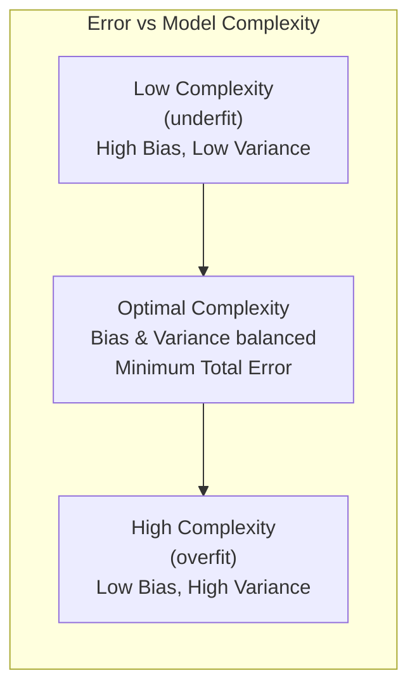
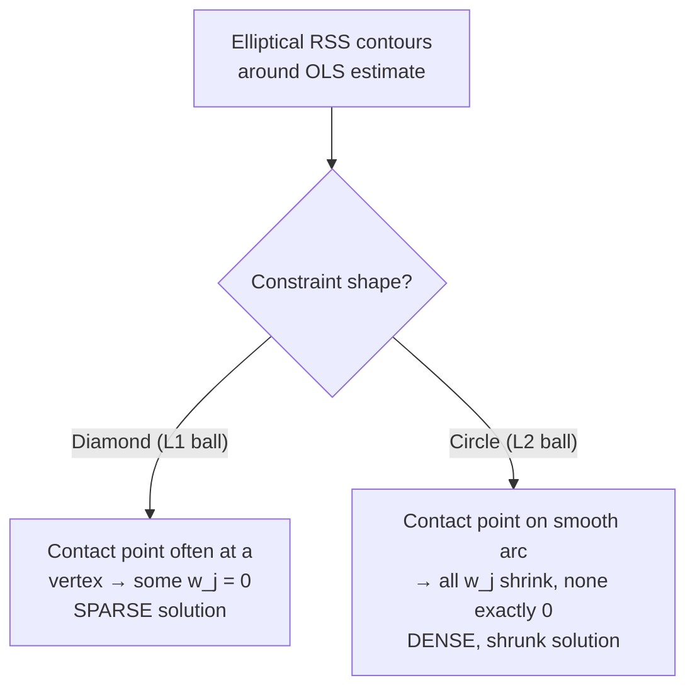

# ML Fundamentals: Bias-Variance, Regularization, Linear & Logistic Regression

This file covers the theoretical bedrock that senior DS interviews probe relentlessly: the bias-variance decomposition, over/underfitting diagnosis, the full regularization family (L1/L2/ElasticNet) with geometric intuition, and deep derivations for linear and logistic regression. Every formula below is derived, not just stated, so you can reconstruct it live on a whiteboard.

## Table of Contents

1. [Bias-Variance Tradeoff](#1-bias-variance-tradeoff)
2. [Overfitting and Underfitting](#2-overfitting-and-underfitting)
3. [Regularization: L1, L2, ElasticNet](#3-regularization-l1-l2-elasticnet)
4. [Linear Regression — Deep Dive](#4-linear-regression--deep-dive)
5. [Logistic Regression — Deep Dive](#5-logistic-regression--deep-dive)
6. [Quick Recall Sheet](#quick-recall-sheet)

---

## 1. Bias-Variance Tradeoff

### 1.1 Formal decomposition

Let the true data generating process be $y = f(x) + \epsilon$, where $\epsilon$ is irreducible noise with $E[\epsilon] = 0$ and $\text{Var}(\epsilon) = \sigma^2$. Let $\hat{f}(x)$ be a model trained on a random training set $D$ (so $\hat{f}$ itself is a random variable over draws of $D$). We want the expected test MSE at a fixed point $x_0$, averaged over draws of the training set and the noise:

$$
\text{Err}(x_0) = E_D\left[(y_0 - \hat{f}(x_0))^2\right]
$$

Substitute $y_0 = f(x_0) + \epsilon_0$:

$$
\text{Err}(x_0) = E\left[(f(x_0) + \epsilon_0 - \hat{f}(x_0))^2\right]
$$

Add and subtract $E_D[\hat{f}(x_0)]$ (the average prediction over all possible training sets):

$$
\text{Err}(x_0) = E\left[\left(\left(f(x_0) - E_D[\hat{f}(x_0)]\right) + \left(E_D[\hat{f}(x_0)] - \hat{f}(x_0)\right) + \epsilon_0\right)^2\right]
$$

Expand the square. Denote $A = f(x_0) - E_D[\hat{f}(x_0)]$ (a constant, not random), $B = E_D[\hat{f}(x_0)] - \hat{f}(x_0)$ (mean-zero random variable over $D$), and $\epsilon_0$ (mean-zero, independent of $D$):

$$
\text{Err}(x_0) = A^2 + E[B^2] + E[\epsilon_0^2] + 2A\,E[B] + 2A\,E[\epsilon_0] + 2E[B\epsilon_0]
$$

The cross terms vanish: $E[B] = 0$ by construction, $E[\epsilon_0] = 0$ by assumption, and $B \perp \epsilon_0$ so $E[B\epsilon_0] = 0$. This leaves:

$$
\boxed{\text{Err}(x_0) = \underbrace{\left(f(x_0) - E_D[\hat f(x_0)]\right)^2}_{\text{Bias}^2} + \underbrace{E_D\left[(\hat f(x_0) - E_D[\hat f(x_0)])^2\right]}_{\text{Variance}} + \underbrace{\sigma^2}_{\text{Irreducible error}}}
$$

- **Bias**: the systematic error from the model's assumptions being wrong — how far the *average* prediction (over all possible training sets) is from the truth. High bias = underfitting.
- **Variance**: how much the prediction would change if trained on a different sample. High variance = overfitting / sensitivity to the specific training set.
- **Irreducible error** ($\sigma^2$): noise inherent to the problem; no model can reduce this.

### 1.2 Concrete example

Fit a degree-1 (linear) model and a degree-15 polynomial to the same noisy data generated from a true cubic function.

- **Linear model**: Cannot represent the curvature of the true cubic → high bias (systematically wrong shape) but low variance (a new sample barely changes the fitted line).
- **Degree-15 polynomial**: Can wiggle through every training point, including noise → low bias on the training data but very high variance (a new sample produces a wildly different curve, especially near the boundaries).

The sweet spot (e.g., degree-3, matching the true function) minimizes the sum: low bias because the functional form is right, low-to-moderate variance because it doesn't chase noise.

### 1.3 Bias-variance vs. complexity curve

To sketch this from memory as an actual curve:
- X-axis: model complexity (degree of polynomial, tree depth, number of parameters, inverse of $\lambda$).
- Bias² curve: monotonically **decreasing**, starts high, flattens near zero as complexity grows.
- Variance curve: monotonically **increasing**, starts near zero, grows (often explosively) with complexity.
- Total test error = Bias² + Variance + irreducible error: **U-shaped**, with the minimum at the point where the marginal decrease in bias² equals the marginal increase in variance.
- Training error: monotonically decreasing (always), and it keeps dropping past the point where test error starts rising — that gap is the visual signature of overfitting.

**Interview angle:**
- *"Derive the bias-variance decomposition."* Walk through the derivation in §1.1 exactly: define $\text{Err}(x_0) = E[(y_0-\hat f(x_0))^2]$, substitute $y_0 = f(x_0)+\epsilon_0$, add/subtract $E_D[\hat f(x_0)]$, expand, and show the cross terms vanish because $B$ has mean zero and $\epsilon_0$ is independent noise with mean zero.
- *"Give an example from your forecasting work where you saw high variance."* A good answer ties to demand forecasting: a deep, unregularized tree-based model (e.g., XGBoost with max_depth=12, no L2, no min_child_weight) memorizing promotional spikes in one region's history, producing wild forecasts when a new SKU/region combination appears — classic high variance, fixed by shrinkage (learning rate), depth limits, and L2 leaf-weight regularization.
- *"Can you have zero bias and zero variance simultaneously?"* Only in the degenerate case where the model class contains the true function AND you have infinite data (or noiseless data) — in practice there's always a tradeoff governed by finite sample size and model flexibility; the irreducible error floor always remains regardless.

---

## 2. Overfitting and Underfitting

| | Underfitting | Overfitting |
|---|---|---|
| **Definition** | Model too simple to capture the underlying pattern | Model captures noise/idiosyncrasies of training data as if they were signal |
| **Train loss** | High | Low (often near zero) |
| **Validation loss** | High (close to train loss) | High (diverges upward from train loss) |
| **Bias/Variance** | High bias, low variance | Low bias, high variance |
| **Symptom on learning curve** | Both curves plateau at a high error, close together | Train curve keeps decreasing; validation curve decreases then turns upward — a widening gap |

### 2.1 Learning curves as a diagnostic

Plot training and validation error (or loss) against training set size (or epochs for iterative models like neural nets/GBMs):

- **Underfitting signature**: both curves converge to a high error value and stay close together, even as more data is added — more data won't help; you need a more expressive model or better features.
- **Overfitting signature**: training error is low and validation error is noticeably higher, with a persistent (or growing) gap — more data, regularization, or a simpler model will help.
- **Good fit**: both curves converge to a low, similar error with a small, stable gap.

For iterative learners (neural nets, gradient boosting), plot loss vs. epoch/boosting round instead of vs. dataset size — this is exactly the mechanism behind **early stopping**: stop training at the epoch/round where validation loss is minimized, before it starts rising again.

### 2.2 Mitigation strategies (catalog — regularization is expanded in §3)

- **More data**: directly reduces variance; the model has less freedom to fit noise. Doesn't help underfitting.
- **Regularization** (L1/L2/ElasticNet/dropout/tree pruning): penalizes complexity, shrinks variance at the cost of a small bias increase.
- **Simpler model / feature reduction**: fewer parameters, lower capacity to overfit — but risks underfitting if pushed too far.
- **Early stopping**: halt training when validation metric stops improving — effectively controls the "effective complexity" of an iterative model.
- **Cross-validation**: doesn't reduce overfitting by itself, but gives an honest estimate of generalization error so you can tune complexity/regularization hyperparameters correctly (k-fold, stratified k-fold for classification, time-series/rolling-origin CV for forecasting).
- **Ensembling**: bagging (e.g., Random Forest) reduces variance by averaging decorrelated high-variance learners; boosting reduces bias by sequentially correcting errors (must be controlled with shrinkage/depth/subsampling to avoid overfitting itself).
- **Data augmentation / noise injection**: effectively enlarges the training distribution, particularly in vision/NLP.
- **Dropout, batch norm, weight decay**: neural-net-specific regularizers analogous to L2/ensembling.

**Interview angle:**
- *"How would you tell, from a single number (final validation accuracy), whether you're overfitting or underfitting?"* You can't from one number alone — you need the train metric too. If train and validation are both mediocre and close, it's underfitting; if train is excellent and validation is much worse, it's overfitting. This is why I always log both curves, not just a final holdout score.
- *"Your XGBoost model has near-perfect train AUC but mediocre validation AUC — what's your action list?"* In order: check for target leakage first (sometimes it's not variance at all), then reduce max_depth, increase min_child_weight, add subsample/colsample_bytree < 1, add L1/L2 (reg_alpha/reg_lambda) on leaf weights, lower learning_rate while increasing n_estimators with early_stopping_rounds on a validation set, and reconfirm with proper (ideally time-based) cross-validation.

---

## 3. Regularization: L1, L2, ElasticNet

### 3.1 L1 (Lasso)

$$
\mathcal{L}_{\text{Lasso}}(w) = \underbrace{\sum_{i=1}^n (y_i - x_i^\top w)^2}_{\text{RSS}} + \lambda \sum_{j=1}^p |w_j|
$$

**Why L1 induces sparsity — geometric argument.** The penalized problem is equivalent (via Lagrangian duality) to constrained minimization of RSS subject to $\sum_j |w_j| \le t$ for some $t$ that's a decreasing function of $\lambda$. The constraint region $\{w : \sum_j |w_j| \le t\}$ is an $\ell_1$-ball — in 2D, a **diamond** (rotated square) with vertices on the axes at $(\pm t, 0)$ and $(0, \pm t)$.

The RSS loss forms elliptical contours centered at the unconstrained OLS solution $\hat\beta_{\text{OLS}}$. The constrained solution is the point where the smallest such ellipse touches the constraint region. Because the diamond has **sharp corners exactly on the coordinate axes**, and because the ellipse is convex, the first point of contact is disproportionately likely to be a corner — a point where one or more coordinates are exactly zero. This is a purely geometric fact: a convex region with corners on the axes creates a nonzero-measure preference for the optimum to land exactly on those corners, whereas a smooth boundary (as in L2, see below) essentially never touches at a point of zero coordinate.

**Effect**: L1 performs implicit feature selection — irrelevant/redundant features get driven to exactly zero, giving an interpretable, sparse model. No closed-form solution exists in general (the objective is non-differentiable at $w_j=0$); solved via coordinate descent or LARS.

### 3.2 L2 (Ridge)

$$
\mathcal{L}_{\text{Ridge}}(w) = \sum_{i=1}^n (y_i - x_i^\top w)^2 + \lambda \sum_{j=1}^p w_j^2
$$

**Geometric argument (contrast with L1).** The equivalent constraint region $\{w: \sum_j w_j^2 \le t\}$ is a **circle/sphere** — perfectly smooth, no corners. When the elliptical RSS contours expand outward from $\hat\beta_{\text{OLS}}$ and first touch this smooth boundary, the tangency point is generically at a location where *all* coordinates are nonzero (touching exactly on an axis has probability zero for a smooth, rotationally-symmetric boundary). Hence L2 shrinks all coefficients smoothly toward zero but essentially never sets any exactly to zero.

**Closed-form ridge solution — full derivation.** The ridge objective in matrix form:

$$
J(w) = (y - Xw)^\top (y - Xw) + \lambda w^\top w
$$

Expand:

$$
J(w) = y^\top y - 2w^\top X^\top y + w^\top X^\top X w + \lambda w^\top w
$$

Take the gradient w.r.t. $w$ and set to zero:

$$
\nabla_w J = -2X^\top y + 2X^\top X w + 2\lambda w = 0
$$

$$
X^\top X w + \lambda w = X^\top y \quad\Longrightarrow\quad (X^\top X + \lambda I) w = X^\top y
$$

$$
\boxed{\hat w_{\text{ridge}} = (X^\top X + \lambda I)^{-1} X^\top y}
$$

**Why adding $\lambda I$ helps**: $X^\top X$ is positive semi-definite; when features are collinear (or $p > n$), $X^\top X$ is singular or near-singular (has zero or near-zero eigenvalues), making $(X^\top X)^{-1}$ blow up or not exist, which is exactly why OLS coefficients become unstable under multicollinearity (§4.5). Adding $\lambda I$ shifts every eigenvalue of $X^\top X$ up by $\lambda$, guaranteeing $X^\top X + \lambda I$ is strictly positive definite (hence invertible) for any $\lambda > 0$, and it numerically conditions the matrix (reduces the condition number = ratio of largest to smallest eigenvalue), directly stabilizing the solution.

### 3.3 ElasticNet

$$
\mathcal{L}_{\text{EN}}(w) = \sum_{i=1}^n (y_i - x_i^\top w)^2 + \lambda_1 \sum_j |w_j| + \lambda_2 \sum_j w_j^2
$$

Often reparameterized with a mixing parameter $\alpha \in [0,1]$ and single strength $\lambda$:

$$
\mathcal{L}_{\text{EN}}(w) = \text{RSS} + \lambda\left(\alpha \sum_j |w_j| + (1-\alpha)\sum_j w_j^2\right)
$$

**Why use it**: Pure Lasso has a known weakness with **correlated features** — among a group of highly correlated predictors, Lasso tends to arbitrarily pick one and zero out the rest (unstable selection, sensitive to small data perturbations). The L2 component in ElasticNet encourages a **grouping effect**: correlated features get similar, non-zero coefficients together rather than one being arbitrarily chosen, while the L1 component still provides sparsity overall. This is the standard justification for using ElasticNet over Lasso in high-dimensional settings with correlated feature blocks (e.g., many engineered lag/rolling features in demand forecasting that are naturally correlated).

### 3.4 Comparison table

| Property | L1 (Lasso) | L2 (Ridge) | ElasticNet |
|---|---|---|---|
| Penalty | $\lambda\sum\|w_j\|$ | $\lambda\sum w_j^2$ | $\lambda\alpha\sum\|w_j\| + \lambda(1-\alpha)\sum w_j^2$ |
| Constraint geometry | Diamond ($\ell_1$-ball), sharp corners on axes | Circle/sphere ($\ell_2$-ball), smooth | Rounded diamond — corners softened by the $\ell_2$ term |
| Produces exact sparsity | Yes | No | Yes (moderated by $\alpha$) |
| Closed-form solution | No (non-differentiable at 0; needs coordinate descent/LARS) | Yes: $(X^\top X+\lambda I)^{-1}X^\top y$ | No (same iterative solvers as Lasso) |
| Handles $p > n$ | Yes, but selects at most $n$ features | Yes, no limit on selected features (keeps all) | Yes, not limited to $n$ selections |
| Behavior with correlated features | Picks one arbitrarily, zeros the rest (unstable) | Shrinks correlated features together, keeps all | Groups correlated features, shrinks together, some sparsity |
| Best use case | Feature selection, interpretable sparse models | Multicollinearity, prediction-focused, keep all features | Many correlated features + need for some sparsity (genomics, text, engineered lag features) |

**Interview angle:**
- *"Why does L1 give sparse solutions but L2 doesn't? Prove it geometrically."* Reproduce the diamond-vs-circle argument in §3.1/§3.2: the constrained optimization view shows the solution is where RSS ellipses first touch the constraint region boundary; L1's polytope has corners on the axes so contact preferentially happens there (zeroing coordinates), while L2's smooth spherical boundary has no such preferred points, so tangency generically occurs with all coordinates nonzero.
- *"Derive the closed-form ridge regression solution and explain what $\lambda I$ does mathematically."* Reproduce §3.2's full derivation: expand the objective, differentiate, set to zero, and explain the eigenvalue-shift argument for invertibility/conditioning.
- *"When would you pick ElasticNet over plain Lasso in a real project?"* When there are groups of highly correlated features (e.g., 7/14/28-day lag features that move together) — pure Lasso's arbitrary single-feature selection hurts both stability (different CV folds pick different features) and interpretability; ElasticNet's ridge component stabilizes selection across correlated groups while still zeroing out truly irrelevant features.

---

## 4. Linear Regression — Deep Dive

### 4.1 Assumptions and what breaks when violated

| Assumption | What it means | What breaks if violated |
|---|---|---|
| **Linearity** | $E[y\mid X] = X\beta$ — the true relationship is linear in the parameters | Model systematically mis-predicts (bias); residuals show curved patterns vs. fitted values — fix with polynomial/spline terms, transformations, or a nonlinear model |
| **Independence of errors** | $\text{Cov}(\epsilon_i, \epsilon_j) = 0$ for $i \ne j$ | Common in time series (autocorrelated residuals) — standard errors are wrong (usually understated), so hypothesis tests/CIs are invalid even though point estimates of $\beta$ can remain unbiased; detect via Durbin-Watson test, fix with Newey-West SEs, GLS, or explicit time-series structure (ARIMA errors, lag features) |
| **Homoscedasticity** | $\text{Var}(\epsilon_i \mid X) = \sigma^2$, constant across all $X$ | Heteroscedasticity → OLS point estimates stay unbiased but are no longer BLUE (not minimum variance); standard errors are biased → invalid t-tests/CIs; detect via Breusch-Pagan/White test or a residuals-vs-fitted funnel shape; fix with robust (White/HC) standard errors, weighted least squares, or a variance-stabilizing transform (log target) |
| **No perfect multicollinearity** | No feature is an exact linear combination of others | $X^\top X$ becomes singular → $(X^\top X)^{-1}$ doesn't exist → OLS has no unique solution (see §4.5); with high-but-imperfect multicollinearity, coefficients become highly unstable with inflated variance |
| **Normality of residuals** | $\epsilon \sim \mathcal{N}(0, \sigma^2)$ | Needed only for exact finite-sample inference (t-tests, F-tests, CIs); by CLT, inference is approximately valid in large samples even without it; **not required for point prediction / coefficient consistency** — OLS is still the best linear unbiased estimator (Gauss-Markov) without normality, you just lose exact small-sample inference |

### 4.2 Full OLS derivation (normal equation)

Setup: $n$ observations, $p$ features, design matrix $X \in \mathbb{R}^{n\times p}$ (including an intercept column of ones), target $y \in \mathbb{R}^n$, coefficient vector $\beta \in \mathbb{R}^p$. The sum of squared residuals (RSS) in matrix form:

$$
J(\beta) = (y - X\beta)^\top (y - X\beta)
$$

Expand:

$$
J(\beta) = y^\top y - y^\top X\beta - \beta^\top X^\top y + \beta^\top X^\top X \beta
$$

Since $y^\top X \beta$ is a scalar, it equals its own transpose $\beta^\top X^\top y$, so:

$$
J(\beta) = y^\top y - 2\beta^\top X^\top y + \beta^\top X^\top X \beta
$$

Take the gradient with respect to $\beta$ using matrix calculus identities ($\nabla_\beta (a^\top \beta) = a$ and $\nabla_\beta(\beta^\top A \beta) = 2A\beta$ for symmetric $A$; here $A = X^\top X$ is symmetric):

$$
\nabla_\beta J(\beta) = -2X^\top y + 2X^\top X \beta
$$

Set the gradient to zero (first-order condition for a minimum — confirmed by the Hessian $2X^\top X$ being positive semi-definite):

$$
-2X^\top y + 2X^\top X\hat\beta = 0 \;\;\Longrightarrow\;\; X^\top X \hat\beta = X^\top y
$$

This is the **normal equation**. Assuming $X^\top X$ is invertible (full column rank, i.e., no perfect multicollinearity):

$$
\boxed{\hat\beta = (X^\top X)^{-1} X^\top y}
$$

### 4.3 Gradient descent vs. closed-form

| | Closed-form (normal equation) | Gradient Descent |
|---|---|---|
| Formula | $\hat\beta = (X^\top X)^{-1}X^\top y$ | $\beta \leftarrow \beta - \eta \nabla_\beta J(\beta)$ |
| Complexity | $O(p^3)$ to invert $X^\top X$ (plus $O(np^2)$ to form it) | $O(np)$ per iteration |
| When infeasible / preferred | $p$ very large (matrix inversion cost explodes cubically) or $X^\top X$ singular/ill-conditioned | Large $n$ (can't hold everything conveniently, or want incremental updates), very large $p$, or when the loss doesn't have a closed form at all (e.g., adding non-differentiable-friendly regularizers, logistic loss) |
| Exactness | Exact solution in one shot (given invertibility) | Iterative approximation; needs a learning rate schedule and convergence check |

**Update rule (batch GD)**: with $J(\beta) = \frac{1}{n}\sum_i (y_i - x_i^\top\beta)^2$,

$$
\beta \leftarrow \beta - \eta \cdot \frac{2}{n} X^\top (X\beta - y)
$$

- **Batch GD**: uses the full dataset per update — stable, accurate gradient, but slow per step for large $n$.
- **Stochastic GD (SGD)**: uses one random sample per update — very noisy but fast and can escape shallow local structure; needs a decaying learning rate to converge.
- **Mini-batch GD**: uses a small batch (e.g., 32–512) per update — the practical default, balancing gradient variance against computational efficiency, and vectorizes well on hardware.

### 4.4 VIF — detecting multicollinearity

For feature $j$, regress it on all other features: $x_j = X_{-j}\gamma + u$, obtain $R_j^2$ from that regression, then:

$$
\text{VIF}_j = \frac{1}{1 - R_j^2}
$$

**Interpretation**: $\text{VIF}_j$ quantifies how much the variance of $\hat\beta_j$ is inflated due to $x_j$'s linear relationship with the other predictors, relative to if $x_j$ were uncorrelated with them. If $R_j^2 = 0$ (no correlation), $\text{VIF}_j = 1$ (no inflation). As $R_j^2 \to 1$ (near-perfect collinearity), $\text{VIF}_j \to \infty$.

**Thresholds** (rules of thumb, not laws): $\text{VIF} > 5$ warrants investigation; $\text{VIF} > 10$ is a strong red flag for serious multicollinearity requiring action.

**Remedies for high VIF**:
- Drop one of the correlated features (the less theoretically/predictively important one).
- Combine correlated features (e.g., sum/average, or domain-driven ratio) into a single composite feature.
- Apply L2/ElasticNet regularization, which directly addresses the instability (§3.2).
- Use PCA/PLS to project onto orthogonal components before regressing.
- Increase sample size if feasible (doesn't fix collinearity itself but improves estimation precision somewhat).

### 4.5 Explicit answers to the classic multicollinearity questions

**"What happens to linear regression if two features are perfectly correlated?"** If $x_2 = c\cdot x_1$ for some constant $c$, then a column of $X$ is an exact linear combination of another, so $X$ does not have full column rank, and $X^\top X$ is **singular** (has a zero eigenvalue, determinant zero). $(X^\top X)^{-1}$ does not exist, so the normal equation $X^\top X\hat\beta = X^\top y$ has **infinitely many solutions** rather than a unique one — any split of the combined effect between $\beta_1$ and $\beta_2$ that preserves $\beta_1 + c\beta_2$ (their joint contribution) fits equally well. Numerically, most solvers will still return *some* answer (often via pseudo-inverse) but the individual coefficients are meaningless/unstable — tiny changes in data produce wildly different coefficient splits, even though the overall predictions $\hat y$ remain stable.

**"How do you detect and handle multicollinearity?"** Detect via: (1) VIF per feature (§4.4), (2) a correlation matrix / heatmap of pairwise correlations, (3) condition number of $X^\top X$ (large condition number ⇒ near-singular), (4) noticing coefficient signs that flip counter-intuitively or standard errors that are implausibly large. Handle via: dropping/combining redundant features, ridge/ElasticNet regularization, PCA dimensionality reduction, or domain-driven feature engineering to remove redundancy (e.g., keep only one of several near-duplicate lag features).

**Interview angle:**
- *"Derive the OLS normal equation from scratch."* Reproduce §4.2 exactly — matrix RSS, expand, gradient via matrix calculus, set to zero, solve. Emphasize the assumption that $X^\top X$ must be invertible (full column rank).
- *"Your training set has 2 million rows and 50,000 engineered features. Would you use the closed-form solution?"* No — inverting a $50000\times 50000$ matrix is $O(p^3)$, computationally infeasible (and likely singular/ill-conditioned given that many rows < features or highly correlated engineered features); use mini-batch (stochastic) gradient descent, or ridge regression solved iteratively (e.g., conjugate gradient), or a tree-based/gradient-boosted approach instead if linear structure isn't essential.
- *"How would you detect multicollinearity and what would you actually do about it in a demand-forecasting feature set with many lag/rolling-window features?"* Compute VIF across all lag/rolling/seasonal features; expect clusters of highly correlated features (7-day vs 14-day lag, week-of-year vs month dummies); prune or combine within clusters, and prefer tree-based models (immune to multicollinearity for prediction, though feature importance still gets diluted across correlated features) or ElasticNet if a linear/interpretable model is required.

---

## 5. Logistic Regression — Deep Dive

### 5.1 The sigmoid function

To model $P(y=1\mid x) \in (0,1)$ from an unbounded linear score $z = x^\top w$, we need a monotonic map from $\mathbb{R}$ to $(0,1)$. The sigmoid (logistic function):

$$
\sigma(z) = \frac{1}{1+e^{-z}}
$$

**Why this specific form**: it arises naturally as the inverse of the **logit** (log-odds) link, $\text{logit}(p) = \ln\frac{p}{1-p}$. Setting $\ln\frac{p}{1-p} = z$ and solving for $p$:

$$
\frac{p}{1-p} = e^z \;\Longrightarrow\; p = e^z(1-p) \;\Longrightarrow\; p + pe^z = e^z \;\Longrightarrow\; p(1+e^z) = e^z \;\Longrightarrow\; p = \frac{e^z}{1+e^z} = \frac{1}{1+e^{-z}}
$$

which is exactly $\sigma(z)$. As $z \to +\infty$, $\sigma(z) \to 1$; as $z\to -\infty$, $\sigma(z)\to 0$; $\sigma(0) = 0.5$. It's smooth, monotonic, and symmetric ($\sigma(-z) = 1-\sigma(z)$).

**Derivative of the sigmoid** (needed for the gradient derivation below):

$$
\sigma'(z) = \frac{d}{dz}\left(1+e^{-z}\right)^{-1} = -\left(1+e^{-z}\right)^{-2}\cdot(-e^{-z}) = \frac{e^{-z}}{(1+e^{-z})^2}
$$

Rewrite $\frac{e^{-z}}{(1+e^{-z})^2} = \frac{1}{1+e^{-z}}\cdot\frac{e^{-z}}{1+e^{-z}} = \sigma(z)\cdot\left(1 - \sigma(z)\right)$ (since $\frac{e^{-z}}{1+e^{-z}} = 1 - \frac{1}{1+e^{-z}} = 1-\sigma(z)$):

$$
\boxed{\sigma'(z) = \sigma(z)\,(1-\sigma(z))}
$$

This elegant self-referential derivative is exactly why the gradient of log-loss comes out so clean.

### 5.2 Log-loss derived from Bernoulli likelihood via MLE

Model each label as Bernoulli: $y_i \mid x_i \sim \text{Bernoulli}(p_i)$ where $p_i = \sigma(x_i^\top w)$. The Bernoulli PMF:

$$
P(y_i \mid x_i; w) = p_i^{y_i}(1-p_i)^{1-y_i}
$$

Assuming i.i.d. samples, the likelihood over the whole dataset:

$$
L(w) = \prod_{i=1}^n p_i^{y_i}(1-p_i)^{1-y_i}
$$

Take the log (monotonic transform, preserves the maximizer, turns the product into a sum):

$$
\ell(w) = \ln L(w) = \sum_{i=1}^n \left[y_i \ln p_i + (1-y_i)\ln(1-p_i)\right]
$$

**Maximum likelihood** seeks $w$ that maximizes $\ell(w)$. Equivalently, define the **negative** log-likelihood as a loss to *minimize*:

$$
\boxed{\mathcal{L}_{\text{log-loss}}(w) = -\sum_{i=1}^n \left[y_i \ln p_i + (1-y_i)\ln(1-p_i)\right]}
$$

This is exactly **binary cross-entropy**. Minimizing it is identical to maximum likelihood estimation of the logistic model.

**Gradient derivation.** For a single sample, with $p_i = \sigma(x_i^\top w)$, the loss contribution is $\ell_i(w) = -[y_i\ln p_i + (1-y_i)\ln(1-p_i)]$. By the chain rule:

$$
\frac{\partial \ell_i}{\partial p_i} = -\left(\frac{y_i}{p_i} - \frac{1-y_i}{1-p_i}\right) = \frac{p_i - y_i}{p_i(1-p_i)}
$$

And using $\frac{\partial p_i}{\partial w} = \sigma'(x_i^\top w)\cdot x_i = p_i(1-p_i)\,x_i$ (from §5.1), the chain rule gives:

$$
\frac{\partial \ell_i}{\partial w} = \frac{p_i-y_i}{p_i(1-p_i)}\cdot p_i(1-p_i)\,x_i = (p_i - y_i)\,x_i
$$

The $p_i(1-p_i)$ terms cancel exactly — this is the payoff of pairing the sigmoid with the log-loss. Summed/vectorized over all $n$ samples (with $\hat y$ the vector of predicted probabilities):

$$
\boxed{\nabla_w \mathcal{L} = X^\top(\hat y - y)}
$$

identical in form to the linear regression gradient $X^\top(X\beta - y)$ — a well-known and interview-favorite parallel.

### 5.3 Odds ratio interpretation

Define odds as $\text{odds} = \dfrac{p}{1-p}$. Logistic regression models the **log-odds (logit)** as linear in the features:

$$
\ln\left(\frac{p}{1-p}\right) = w_0 + w_1 x_1 + \cdots + w_k x_k
$$

**Coefficient interpretation**: holding all other features fixed, increasing $x_j$ by one unit changes the log-odds by exactly $w_j$, which means the odds themselves get **multiplied** by $e^{w_j}$:

$$
\text{odds}_{x_j+1} = \text{odds}_{x_j} \cdot e^{w_j}
$$

So "a one-unit increase in $x_j$ multiplies the odds of the positive class by $e^{w_j}$" — if $w_j = 0.4$, odds multiply by $e^{0.4}\approx 1.49$ (a ~49% increase in odds, *not* a 49% increase in probability — a common interview trap). If $w_j < 0$, $e^{w_j} < 1$ and the odds shrink.

### 5.4 Multiclass extensions

**One-vs-Rest (OvR)**: train $K$ independent binary logistic classifiers, one per class $k$, each discriminating "class $k$" vs. "all others." At inference, predict the class with the highest raw score/probability among the $K$ classifiers (scores aren't necessarily calibrated to sum to 1 across classifiers, since each is trained independently).

**Softmax / multinomial logistic regression**: models all $K$ classes jointly with a shared normalization. For class $k$, define score $z_k = x^\top w_k$, and:

$$
P(y=k\mid x) = \frac{e^{z_k}}{\sum_{j=1}^K e^{z_j}}
$$

This guarantees $\sum_k P(y=k\mid x) = 1$ by construction. **Multiclass cross-entropy loss** (derived the same way as binary log-loss, via MLE on the categorical/multinoulli likelihood), with $y_{ik}$ a one-hot indicator that sample $i$ belongs to class $k$:

$$
\mathcal{L} = -\sum_{i=1}^n\sum_{k=1}^K y_{ik}\ln P(y_i=k\mid x_i)
$$

Note binary log-loss is the $K=2$ special case of this (with the second class probability written as $1-p$ rather than a separate softmax output — the two forms are algebraically equivalent).

**When OvR is still preferred over softmax**:
- **Very large label spaces** (thousands of classes, e.g., extreme multiclass/multilabel): training $K$ independent binary models can be more parallelizable/scalable, and cheap to update incrementally when new classes are added (retrain just the new binary classifier, not the whole joint model).
- **Label independence / multilabel settings**: if classes aren't mutually exclusive (an instance can belong to multiple classes simultaneously), OvR naturally generalizes to multilabel classification, whereas softmax's normalization assumes mutual exclusivity and is not directly appropriate.
- **Simplicity/interpretability**: each OvR model's coefficients have a clean "this class vs. everything else" interpretation, useful when stakeholders want per-class odds-ratio explanations independently.

**Interview angle:**
- *"Derive log-loss from first principles."* Reproduce §5.2 fully: Bernoulli PMF per sample → i.i.d. likelihood as a product → log-likelihood as a sum → negative log-likelihood is exactly cross-entropy → minimizing it is MLE.
- *"Show that the gradient of logistic regression's loss has the same clean form as linear regression's."* Reproduce §5.2's chain-rule derivation, highlighting that $\sigma'(z)=\sigma(z)(1-\sigma(z))$ cancels against the $\frac{1}{p(1-p)}$ term from the log-loss derivative, leaving $\nabla_w\mathcal L = X^\top(\hat y - y)$ — structurally identical to OLS's $X^\top(X\beta-y)$, which is why both are estimated with near-identical gradient descent code.
- *"A coefficient for 'has_discount' is 0.7 — interpret it for a business stakeholder."* The odds of the outcome (e.g., purchase) are multiplied by $e^{0.7}\approx 2.01$ when a discount is present, holding other factors constant — roughly a doubling of the odds, not a doubling of the probability itself; if the baseline probability is high (e.g., 80%), the same odds multiplier produces a much smaller absolute probability change than if the baseline is low (e.g., 10%).
- *"Why not just use one-hot softmax for everything?"* Softmax assumes mutually exclusive, jointly normalized classes and requires retraining the shared parameter matrix whenever new classes are added; OvR is preferable for extreme classification (many classes), for multilabel problems, or when classes are added incrementally in production without wanting to retrain the whole model.

---

## Additional Common Interview Questions

**Q: How do you choose the regularization strength $\lambda$ in practice?**

$\lambda$ is itself a hyperparameter that trades bias for variance, so it cannot be estimated from the training data by the same procedure that estimates $w$ (minimizing training RSS/log-loss is always improved by $\lambda=0$, which defeats the purpose). The standard approach is **k-fold cross-validation over a grid (or random search) of candidate $\lambda$ values**: for each candidate $\lambda$, fit the model on $k-1$ folds and evaluate on the held-out fold, average the CV error across folds, and repeat for every $\lambda$ in the grid (typically log-spaced, e.g., $10^{-4}, 10^{-3}, \dots, 10^{2}$, since the effect of $\lambda$ is multiplicative on the penalty). Two common selection rules once you have the CV-error-vs-$\lambda$ curve: (1) **$\lambda_{\min}$** — simply pick the $\lambda$ that minimizes mean CV error; (2) **the "one-standard-error rule" ($\lambda_{\text{1se}}$)** — pick the *largest* $\lambda$ whose CV error is still within one standard error of the minimum. The 1-SE rule deliberately trades a small amount of CV performance for a simpler, more regularized, more stable model, which is often preferable when the CV-error curve is fairly flat near its minimum (common with Lasso/ElasticNet, where many nearby $\lambda$'s give statistically indistinguishable performance but very different sparsity). For Lasso/ElasticNet specifically, solvers exploit the **regularization path**: coordinate descent can warm-start from the solution at a slightly larger $\lambda$ to solve the whole path of $\lambda$ values almost as cheaply as one fit (this is what `glmnet`/`sklearn`'s `*CV` estimators do internally). If you need an honest estimate of *both* the chosen $\lambda$ and the resulting generalization error (e.g., for a paper or a production SLA), use **nested cross-validation** — an outer loop for performance estimation, an inner loop for $\lambda$ selection — since using the same CV loop to both select $\lambda$ and report performance is optimistically biased.

**Q: What's the difference between L1/L2 regularization and early stopping as a regularization technique?**

L1/L2 regularization and early stopping both control **effective model complexity** and both shrink the effective magnitude of weights, but they intervene at different points in the optimization. L1/L2 modify the **objective function itself** — the penalty term is present at every iteration, and the optimizer runs to full convergence *of the penalized objective*, so the shrinkage is baked into where the optimum lands, permanently and deterministically for a given $\lambda$. Early stopping, by contrast, doesn't touch the loss function at all — it uses the **original unregularized objective** but simply halts gradient descent/iterative training before it reaches that objective's true minimum, monitored via a validation set (stop at the epoch/round where validation loss is lowest, before it starts rising as in §2.1). There is a well-known theoretical equivalence for the case of gradient descent on a quadratic (linear-regression-like) loss starting from $w_0 = 0$: each additional GD iteration approximately shrinks the components of $w$ along the low-curvature (small-eigenvalue) directions of $X^\top X$ less aggressively than along the high-curvature directions, tracing out a shrinkage path that closely resembles the Ridge path as a function of "iterations" rather than $\lambda$ — informally, **early stopping behaves like an implicit, iteration-indexed L2 penalty** (fewer iterations ≈ larger effective $\lambda$). The practical differences: L1/L2 need a well-chosen $\lambda$ and are agnostic to the optimizer/training schedule (they'd give the same fitted model whether solved via coordinate descent, closed-form, or GD-to-convergence); early stopping is tied to the specific optimization trajectory, requires monitoring a validation set *during* training rather than tuning a static penalty beforehand, is essentially free computationally (no extra terms to compute each step, you just stop sooner), and is the dominant regularizer for deep nets and gradient-boosted trees where an explicit closed-form penalty on a huge, non-convex parameter space is less tractable or less effective than simply not training past the point of overfitting.

**Q: Why does gradient descent sometimes fail to converge, and how do you diagnose it?**

Gradient descent's update is $\theta \leftarrow \theta - \eta \nabla_\theta J(\theta)$, and failure to converge almost always traces back to one of three causes. **(1) Learning rate too large**: for a quadratic loss with Hessian eigenvalues $d_i$ (e.g., eigenvalues of $2X^\top X$ for OLS), convergence along eigen-direction $i$ requires $\eta < 2/d_i$; exceeding this causes the update to overshoot the minimum along that direction and the loss **oscillates or diverges outright** (loss increases each step, sometimes to $\infty$/NaN). **(2) Ill-conditioning**: if the ratio of largest to smallest Hessian eigenvalue (the condition number) is large — typically from unscaled/unnormalized features with very different variances — a single learning rate that's small enough to be stable along the steep (high-curvature) direction is far too small for the shallow direction, producing the classic **zig-zagging, painfully slow convergence** down a narrow valley. This is diagnosed by plotting the loss curve: a smoothly-but-extremely-slowly decreasing loss over many iterations is the signature, and the fix is feature standardization (rescaling all features to comparable variance, which directly improves the condition number of $X^\top X$), momentum, or adaptive per-parameter learning rates (Adam/RMSprop/Adagrad). **(3) Non-convexity**: for non-convex losses (neural nets), GD can get stuck at a **local minimum** or, more commonly in high dimensions, near a **saddle point** where the gradient is near zero but it's not a minimum in all directions — the loss plateaus for a long stretch before (if ever) resuming its decrease. To diagnose in practice: always plot loss vs. iteration/epoch — divergence or oscillation ⇒ lower the learning rate; very slow smooth decrease ⇒ suspect ill-conditioning, normalize features, add momentum, or increase the learning rate cautiously with a schedule; a long plateau followed by a sudden drop or no further movement ⇒ suspect saddle points/flat regions, mitigated by momentum-based optimizers, better initialization (e.g., Xavier/He), batch normalization, or a learning-rate warmup/cyclical schedule. Gradient norm monitoring (is $\|\nabla J\|$ actually shrinking, or oscillating, or exploding?) is the more granular diagnostic underneath the loss curve.

**Q: What's the difference between a convex and a non-convex loss function, and why does it matter for optimization guarantees?**

A function $f$ is **convex** if, for any two points $\theta_1, \theta_2$ in its domain and any $t \in [0,1]$:

$$
f(t\theta_1 + (1-t)\theta_2) \le t f(\theta_1) + (1-t) f(\theta_2)
$$

— geometrically, the line segment connecting any two points on the graph lies on or above the graph itself. An equivalent second-order condition (when $f$ is twice differentiable) is that the **Hessian is positive semi-definite everywhere**: $\nabla^2 f(\theta) \succeq 0 \;\forall \theta$. Both OLS's RSS and logistic regression's log-loss satisfy this: OLS's Hessian is $2X^\top X$, which is PSD by construction (it's a Gram matrix, $z^\top X^\top X z = \|Xz\|^2 \ge 0$ for any $z$); logistic regression's Hessian works out to $X^\top \text{diag}(p_i(1-p_i)) X$, which is also PSD since every diagonal weight $p_i(1-p_i) \ge 0$ (with equality only in the degenerate saturated case). **The critical guarantee convexity gives you**: for a convex function, *any* local minimum is automatically a **global minimum** — there are no other local minima or saddle points to get trapped in, so gradient descent (with an appropriately small learning rate) is guaranteed to converge to the global optimum regardless of initialization. This is precisely why OLS and logistic regression can be trained reliably from any starting point (even $w=0$) with vanilla gradient descent and no restarts. **Non-convex losses** — essentially all neural network objectives, once you stack nonlinear activations and multiple layers — have no such guarantee: there can be many local minima, and, more consequentially in high dimensions, many **saddle points** (where the gradient is zero but the Hessian has both positive and negative eigenvalues), so GD offers no proof of reaching a global optimum, only a stationary point. In practice this is managed rather than solved: multiple random initializations, momentum/adaptive optimizers to escape shallow local structure and saddle points, and the empirical (not fully theoretically guaranteed) observation that in very overparameterized networks most local minima found in practice tend to generalize comparably well — but this is an empirical regularity of the specific architecture/loss landscape, not a mathematical guarantee the way convexity provides for linear/logistic regression.

**Q: How would you detect and handle heteroscedasticity in a linear regression model?**

Heteroscedasticity means $\text{Var}(\epsilon_i \mid x_i)$ is not constant across observations (contrast with the homoscedasticity assumption in §4.1) — commonly, residual variance grows with the magnitude of the fitted value (e.g., in sales/revenue regressions, larger predicted values tend to have larger absolute errors). **Detection**: (1) plot residuals vs. fitted values — a classic "funnel" or "cone" shape (spread widening or narrowing systematically) is the visual signature; (2) formal tests — the **Breusch-Pagan test** regresses the squared residuals $\hat\epsilon_i^2$ on the original features and tests whether that regression has significant explanatory power (if $\text{Var}(\epsilon_i)$ truly depends on $x_i$, the squared residuals will correlate with $x_i$); the **White test** is a more general version that also includes cross-products/squared terms, so it detects heteroscedasticity without requiring you to specify its exact functional form in advance. **Consequence if ignored**: OLS point estimates $\hat\beta$ remain **unbiased and consistent** (unbiasedness of OLS does not require homoscedasticity), but they are **no longer BLUE** (not minimum variance among unbiased estimators — Gauss-Markov requires homoscedasticity for that optimality), and critically the **standard errors reported by default OLS software are wrong** (typically understated), which invalidates t-tests, p-values, and confidence intervals even though $\hat\beta$ itself is fine for point prediction. **Remedies**, roughly in order of how much they change the model: (1) **Robust (White/Huber-White, "HC") standard errors** — keep the exact same $\hat\beta$, but recompute the covariance matrix as $(X^\top X)^{-1} X^\top \hat\Omega X (X^\top X)^{-1}$ where $\hat\Omega = \text{diag}(\hat\epsilon_i^2)$ instead of assuming $\hat\Omega = \hat\sigma^2 I$ — this is the easiest fix when you only care about correcting inference, not predictions. (2) **Weighted Least Squares (WLS)** — if you know or can estimate how variance scales with $x$ (e.g., $\text{Var}(\epsilon_i) \propto x_i$), minimize $\sum_i w_i(y_i - x_i^\top\beta)^2$ with weights $w_i = 1/\widehat{\text{Var}(\epsilon_i)}$, giving the closed form $\hat\beta_{\text{WLS}} = (X^\top W X)^{-1} X^\top W y$ with $W=\text{diag}(w_i)$ — this both fixes inference and improves efficiency (lower variance) relative to plain OLS, unlike robust SEs which only fix inference. (3) **Variance-stabilizing transform of the target**, most commonly $\log(y)$ (or Box-Cox more generally) — if variance grows proportionally with the mean (a very common real-world pattern, e.g. in sales data), modeling $\log y$ instead of $y$ often restores near-constant residual variance on the transformed scale, at the cost of needing to back-transform predictions carefully (naive back-transformation of a log-scale mean prediction is biased low; a smearing/lognormal correction is needed for an unbiased level-scale prediction).

**Q: What is Ridge regression's effect on the bias-variance tradeoff, precisely — not just qualitatively?**

Take the eigen/SVD decomposition $X = UDV^\top$, so $X^\top X = VD^2V^\top$ with singular values $d_1 \ge d_2 \ge \dots \ge d_p \ge 0$. Substituting into the ridge estimator from §3.2:

$$
\hat\beta_{\text{ridge}} = (X^\top X + \lambda I)^{-1}X^\top y = V(D^2+\lambda I)^{-1}DU^\top y
$$

Compare this to OLS, $\hat\beta_{\text{OLS}} = VD^{-1}U^\top y$. In the rotated coordinate system defined by $V$, ridge scales each OLS coefficient by a **shrinkage factor** $\dfrac{d_j^2}{d_j^2+\lambda} \in (0,1)$ — directions with large singular value $d_j$ (high-variance-explaining, well-determined directions) are barely shrunk, while directions with small $d_j$ (poorly-determined, near-collinear directions) are shrunk aggressively toward zero. This is exactly why ridge is such a good multicollinearity fix: it doesn't shrink uniformly, it shrinks precisely the directions that OLS was least confident about (i.e., where $X^\top X$ has small eigenvalues and $(X^\top X)^{-1}$ blows up). **Bias**: $E[\hat\beta_{\text{ridge}}] = (X^\top X+\lambda I)^{-1}X^\top X\,\beta \ne \beta$ for any $\lambda > 0$, so ridge is a **biased** estimator — the bias vector is $-\lambda(X^\top X + \lambda I)^{-1}\beta$, which grows monotonically in magnitude (component-wise, in the rotated basis) as $\lambda$ increases, reaching $-\beta$ (i.e., predicting the intercept-only model) as $\lambda\to\infty$. **Variance**: $\text{Var}(\hat\beta_{\text{ridge}}) = \sigma^2 (X^\top X+\lambda I)^{-1}X^\top X(X^\top X+\lambda I)^{-1}$, which in the rotated basis has eigenvalues $\sigma^2 \dfrac{d_j^2}{(d_j^2+\lambda)^2}$ — this is **strictly decreasing in $\lambda$** for every $j$, so ridge's total variance (trace of this matrix, summed over all $p$ directions) is monotonically non-increasing as $\lambda$ grows, in contrast to OLS's variance $\sigma^2(X^\top X)^{-1}$ which is the $\lambda=0$ special case and is often explosively large under near-collinearity (small $d_j$). Putting these together, there provably exists a range of $\lambda > 0$ for which the **decrease in variance exceeds the increase in squared bias**, so total MSE $= \text{bias}^2 + \text{variance}$ is strictly lower than OLS's — this is the classical Hoerl-Kennard result guaranteeing ridge can always beat OLS in MSE for some $\lambda>0$, which is the precise mathematical justification (not just an analogy) for why ridge "trades bias for variance" in the bias-variance framework of §1.

**Q: Explain the difference between parametric and non-parametric models, using linear regression and KNN as examples.**

A **parametric** model assumes a fixed functional form governed by a **fixed, finite number of parameters that does not grow with the size of the training data** — linear regression is the canonical example: regardless of whether you train on 100 or 100 million rows, the model is fully described by the $p+1$ coefficients $\hat\beta$, and once fit, prediction at a new point is a fixed $O(p)$ dot product that doesn't require touching the training data again. This buys you low variance (few parameters to estimate ⇒ each is estimated more precisely for a given $n$) at the cost of a bias that's entirely determined by whether the assumed functional form (linearity) is actually correct — no amount of additional data can fix a wrong assumption about the shape of $f$, since a straight line will never curve to fit an inherently nonlinear pattern. A **non-parametric** model, by contrast, does not commit to a fixed functional form in advance, and its **effective complexity grows with the amount of training data** — $K$-nearest-neighbors is the canonical example: there are no coefficients to fit at all ("training" is just storing the dataset), and prediction at a new point $x_0$ requires computing distances to some or all of the $n$ training points and averaging/voting over the $k$ nearest, so both storage and (naively) prediction cost scale with $n$. This buys enormous flexibility — KNN can approximate essentially any function shape given enough data, so its bias can be driven arbitrarily low — at the cost of much higher variance for a given (especially small) $n$, and a much steeper data requirement to perform well in high dimensions (the curse of dimensionality: in high-dimensional space, "nearest" neighbors are often not very near at all, since volume grows exponentially with dimension, so local averaging becomes unreliable unless $n$ is astronomically large relative to $p$). Within KNN itself, its own hyperparameter $k$ traces out the same bias-variance curve seen in §1: small $k$ (e.g., $k=1$) means predictions depend on a tiny, noisy local neighborhood ⇒ low bias, high variance (very wiggly decision boundary); large $k$ approaching $n$ averages over more and more of the dataset ⇒ high bias, low variance, with $k=n$ degenerating to always predicting the global mean/majority class regardless of $x_0$ (maximum bias, minimum variance). The general interview-ready summary: parametric = fixed capacity, fast, data-efficient, but only as good as its assumed functional form; non-parametric = capacity that grows with data, flexible enough to eventually fit anything, but needs much more data and compute, and degrades badly in high dimensions.

**Q: What happens to logistic regression when the classes are perfectly (or quasi-perfectly) separable?**

If there exists a hyperplane $w^\top x = 0$ that perfectly separates the two classes — every $y_i=1$ point has $x_i^\top w > 0$ and every $y_i=0$ point has $x_i^\top w < 0$ — then the maximum-likelihood solution for logistic regression **does not exist as a finite vector**. Recall the log-likelihood is maximized by pushing every $p_i = \sigma(x_i^\top w)$ toward its correct extreme (1 for positives, 0 for negatives); with perfect separation, scaling the separating direction $w \to c\cdot w$ for any $c > 0$ pushes every $p_i$ strictly closer to its target extreme without ever misclassifying a point, so the log-loss can be driven monotonically toward its infimum of **zero** by letting $c \to \infty$ — the true maximizer is at $\|w\| = \infty$, i.e., it doesn't exist in $\mathbb{R}^p$. In practice, running iterative solvers (Newton-Raphson/IRLS, gradient descent) on such data produces **coefficients that grow without bound** and never converge — you'll typically see a "perfect separation detected" or convergence-failure warning from statistical software (e.g., `statsmodels`), coefficient magnitudes exploding to absurd values (hundreds or thousands), and correspondingly nonsensical, wildly inflated standard errors, even though the resulting decision boundary itself may look reasonable. **Fixes**: (1) **L2 (ridge) regularization** is the standard practical fix — adding $\lambda\|w\|^2$ to the objective means large $\|w\|$ is now penalized, so a finite optimum exists for any $\lambda > 0$, and this is exactly why most production logistic regression implementations (e.g., `sklearn`'s default) apply a small L2 penalty by default; (2) **Firth's penalized likelihood / bias-reduction method**, a technique from the biostatistics literature specifically designed for rare-event and (quasi-)separable logistic regression, which adds a Jeffreys-prior-based penalty to keep estimates finite and less biased than plain ridge; (3) recognize this as a modeling red flag rather than purely a numerical nuisance — perfect separation on real (non-synthetic) data often indicates either a very small sample size, a near-duplicate or leaking feature that trivially encodes the label, or a genuinely tiny/well-separated dataset where a simpler rule-based or margin-based classifier (e.g., an SVM, which handles separable data natively via the max-margin objective rather than diverging) might be more appropriate than logistic regression.

---

## Quick Recall Sheet

**Bias-Variance**
- $\text{Err}(x_0) = \text{Bias}(\hat f(x_0))^2 + \text{Var}(\hat f(x_0)) + \sigma^2$
- Bias² decreases, variance increases with model complexity; total test error is U-shaped.
- High bias → underfit (train & val both high, close together). High variance → overfit (train low, val high, growing gap).

**Regularization**
- Lasso: $\text{RSS} + \lambda\sum|w_j|$ — diamond constraint, corners → sparsity, no closed form.
- Ridge: $\text{RSS} + \lambda\sum w_j^2$ — circular constraint, smooth boundary → shrinkage, no sparsity. Closed form: $\hat w = (X^\top X+\lambda I)^{-1}X^\top y$.
- ElasticNet: $\text{RSS} + \lambda[\alpha\sum|w_j| + (1-\alpha)\sum w_j^2]$ — groups correlated features, partial sparsity.
- $\lambda I$ shifts eigenvalues of $X^\top X$ up, guarantees invertibility, improves conditioning.

**Linear Regression**
- Loss: $J(\beta)=(y-X\beta)^\top(y-X\beta)$; gradient $\nabla_\beta J = -2X^\top y + 2X^\top X\beta$.
- Normal equation: $\hat\beta = (X^\top X)^{-1}X^\top y$.
- Closed-form cost $O(p^3)$; use GD when $p$/$n$ huge or $X^\top X$ singular/ill-conditioned.
- GD update: $\beta \leftarrow \beta - \eta\cdot\frac{2}{n}X^\top(X\beta - y)$; batch (full data), SGD (1 sample), mini-batch (small batch, the practical default).
- Assumptions: linearity, error independence, homoscedasticity, no perfect multicollinearity, normal residuals (inference only, not needed for point estimates under Gauss-Markov).
- VIF: $\text{VIF}_j = \dfrac{1}{1-R_j^2}$; flag at >5, strong concern at >10. Fix: drop/combine features, regularize, PCA.
- Perfect collinearity ⇒ $X^\top X$ singular ⇒ no unique $\hat\beta$ (infinite solutions), predictions can stay stable even as individual coefficients are meaningless.

**Logistic Regression**
- Sigmoid: $\sigma(z) = \dfrac{1}{1+e^{-z}}$, derived as inverse-logit. Derivative: $\sigma'(z)=\sigma(z)(1-\sigma(z))$.
- Log-loss (from Bernoulli MLE): $\mathcal L = -\sum_i[y_i\ln p_i + (1-y_i)\ln(1-p_i)]$.
- Gradient: $\nabla_w\mathcal L = X^\top(\hat y - y)$ — same clean form as linear regression.
- Odds $= p/(1-p)$; logit $=\ln(\text{odds}) = x^\top w$; one-unit increase in $x_j$ multiplies odds by $e^{w_j}$.
- Multiclass: OvR trains $K$ independent binary classifiers; softmax $P(y=k\mid x)=\dfrac{e^{z_k}}{\sum_j e^{z_j}}$ with joint cross-entropy $\mathcal L = -\sum_i\sum_k y_{ik}\ln P(y_i=k\mid x_i)$; prefer OvR for huge/incremental label spaces or multilabel settings.
