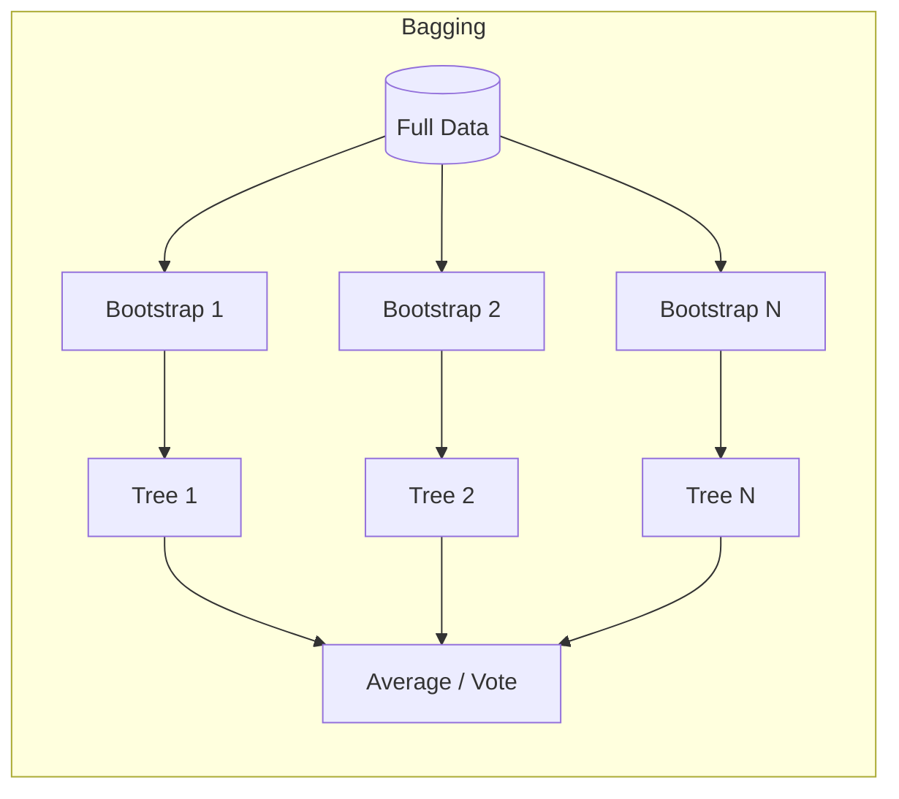
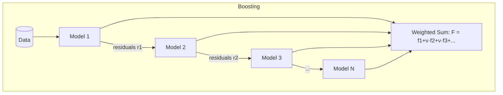
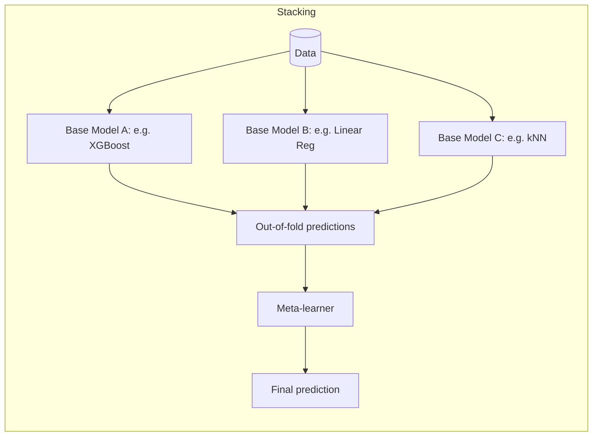
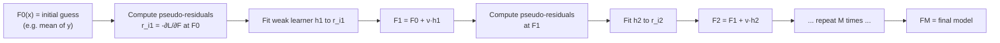
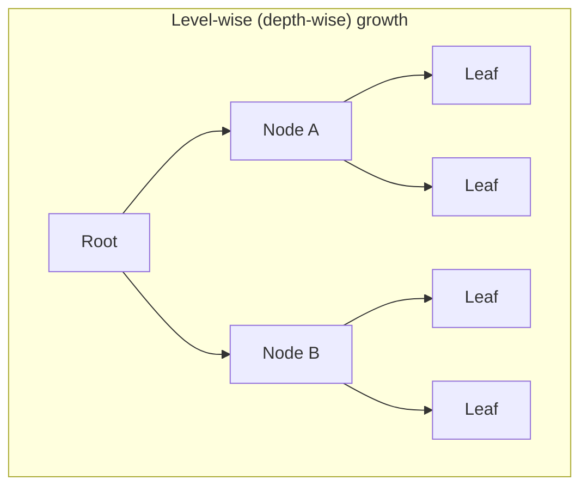
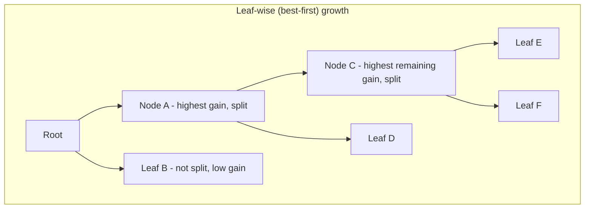
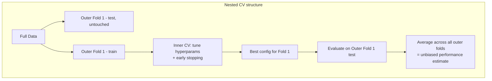

# Decision Trees, Ensembles & Gradient Boosting (XGBoost / LightGBM Deep Dive)

This file is the flagship of the kit: it goes from single decision-tree splitting criteria, through bagging/Random Forests, into a full mathematical derivation of gradient boosting and the specific internals that make XGBoost and LightGBM production-grade (regularized objective, second-order Taylor expansion, split gain, histogram binning, GOSS, EFB, leaf-wise growth). Given 4 years of production forecasting experience with both libraries, expect interviewers to probe *why* design choices were made, not just *what* the hyperparameters do — this file optimizes for that.

## Table of Contents

1. [Decision Trees](#1-decision-trees)
2. [Ensemble Methods Overview: Bagging vs Boosting vs Stacking](#2-ensemble-methods-overview-bagging-vs-boosting-vs-stacking)
3. [Random Forests](#3-random-forests)
4. [Gradient Boosting Fundamentals — Derived](#4-gradient-boosting-fundamentals--derived)
5. [XGBoost Internals — Deep Dive](#5-xgboost-internals--deep-dive)
6. [LightGBM Internals — Deep Dive](#6-lightgbm-internals--deep-dive)
7. [Key Hyperparameters (XGBoost & LightGBM)](#7-key-hyperparameters-xgboost--lightgbm)
8. [Handling Categorical Features](#8-handling-categorical-features)
9. [Early Stopping & Cross-Validation for Boosting](#9-early-stopping--cross-validation-for-boosting)
10. [Popular Interview Questions — Full Answers](#10-popular-interview-questions--full-answers)
11. [Quick Recall Sheet](#quick-recall-sheet)

---

## 1. Decision Trees

A decision tree recursively partitions the feature space into axis-aligned regions, fitting a simple constant (majority class, or mean value) in each region. The core algorithmic question at every node is: **which feature and threshold split best increases the "purity" of the child nodes?**

### 1.1 Gini Impurity

For a node $t$ with $K$ classes, let $p_k$ be the proportion of samples of class $k$ in that node. Gini impurity measures the probability of misclassifying a randomly chosen sample if it were labeled randomly according to the class distribution in the node:

$$
Gini(t) = 1 - \sum_{k=1}^{K} p_k^2 = \sum_{k=1}^K p_k(1-p_k)
$$

**Worked example (binary, 2-class):** Suppose a node has 10 samples, 6 of class A and 4 of class B. $p_A = 0.6$, $p_B = 0.4$.

$$
Gini = 1 - (0.6^2 + 0.4^2) = 1 - (0.36 + 0.16) = 1 - 0.52 = 0.48
$$

A pure node ($p_A=1, p_B=0$) gives $Gini = 1-(1+0)=0$. A maximally impure 50/50 node gives $Gini = 1-(0.25+0.25)=0.5$ — the theoretical max for 2 classes.

**Split evaluation:** given a candidate split that sends $n_L$ samples left and $n_R$ samples right (parent size $n = n_L+n_R$), the weighted Gini of the split is:

$$
Gini_{split} = \frac{n_L}{n}Gini(L) + \frac{n_R}{n}Gini(R)
$$

The tree picks the split that **minimizes** $Gini_{split}$ (equivalently maximizes the Gini decrease $Gini(parent) - Gini_{split}$).

**Worked split example:** Parent node: 10 samples (6 A, 4 B), $Gini=0.48$ as above. A candidate split on feature $X \le 5$ produces:
- Left: 5 samples, 4 A / 1 B → $p_A=0.8,p_B=0.2$ → $Gini_L = 1-(0.64+0.04)=0.32$
- Right: 5 samples, 2 A / 3 B → $p_A=0.4,p_B=0.6$ → $Gini_R = 1-(0.16+0.36)=0.48$

$$
Gini_{split} = \frac{5}{10}(0.32) + \frac{5}{10}(0.48) = 0.16+0.24 = 0.40
$$

Decrease in impurity $= 0.48 - 0.40 = 0.08$. This is compared against decreases from other candidate splits (other features/thresholds), and the tree greedily picks the maximum.

### 1.2 Entropy and Information Gain

Entropy (from information theory) measures the expected number of bits needed to encode the class label:

$$
Entropy(t) = -\sum_{k=1}^K p_k \log_2 p_k
$$

For the same node (6 A, 4 B, $p_A=0.6,p_B=0.4$):

$$
Entropy = -(0.6\log_2 0.6 + 0.4\log_2 0.4) = -(0.6\times(-0.737) + 0.4\times(-1.322))
$$
$$
= 0.4422 + 0.5288 = 0.971 \text{ bits}
$$

**Information Gain (IG)** for a split is the reduction in entropy from parent to weighted children:

$$
IG = Entropy(parent) - \sum_{c \in \{L,R\}} \frac{n_c}{n} Entropy(c)
$$

**Worked example**, using the same split as above:
- Left (4A/1B): $p_A=0.8, p_B=0.2$ → $Entropy_L = -(0.8\log_2 0.8+0.2\log_2 0.2) = -(0.8(-0.322)+0.2(-2.322)) = 0.2575+0.4644=0.722$
- Right (2A/3B): $p_A=0.4,p_B=0.6$ → $Entropy_R = -(0.4\log_2 0.4+0.6\log_2 0.6)=0.5288+0.4422=0.971$

$$
IG = 0.971 - \left(\tfrac{5}{10}(0.722)+\tfrac{5}{10}(0.971)\right) = 0.971 - (0.361+0.4855) = 0.971-0.8465 = 0.1245 \text{ bits}
$$

The tree picks the split with the highest IG (equivalent in spirit to lowest Gini decrease criterion, just a different impurity measure). C4.5 additionally normalizes IG by "split information" (intrinsic value) to get **Gain Ratio**, penalizing splits that create many small partitions.

### 1.3 Gini vs Entropy — Practical Comparison

| Aspect | Gini Impurity | Entropy / Information Gain |
|---|---|---|
| Formula | $1-\sum p_k^2$ | $-\sum p_k\log_2 p_k$ |
| Computation | No logarithm — faster (pure arithmetic) | Requires log — marginally slower |
| Range (binary) | [0, 0.5] | [0, 1] bit |
| Sensitivity | Slightly favors larger partitions / dominant class | Slightly more sensitive to class balance changes (peaks more sharply) |
| Used by default in | CART, scikit-learn `DecisionTreeClassifier` (default `'gini'`) | ID3, C4.5; available in sklearn as `'entropy'` |
| Practical difference | Empirically produce nearly identical trees >99% of the time; disagreements are rare and usually inconsequential to final accuracy | Same |

**Bottom line for interviews:** they almost always agree on which split is best; Gini is preferred in practice purely for computational speed (no log), not because it's "more correct."

### 1.4 Variance Reduction (Regression Trees)

For regression, the impurity measure is variance (equivalently, this is minimizing SSE). For a node $t$ with target values $y_i$ and mean $\bar{y}_t$:

$$
Var(t) = \frac{1}{n_t}\sum_{i \in t}(y_i - \bar{y}_t)^2
$$

A split is scored by weighted variance reduction:

$$
\Delta Var = Var(parent) - \left(\frac{n_L}{n}Var(L) + \frac{n_R}{n}Var(R)\right)
$$

This is exactly equivalent to minimizing the sum of squared errors (SSE) in the children, since at each leaf the optimal constant prediction under squared-error loss is the mean. The tree searches over all features and thresholds to maximize $\Delta Var$ (i.e., maximize SSE reduction).

### 1.5 Pruning: Pre-pruning vs Post-pruning

**Pre-pruning** (early stopping during growth) constrains tree growth via hyperparameters:
- `max_depth`: hard cap on tree depth.
- `min_samples_split`: minimum samples required at a node to even consider splitting it.
- `min_samples_leaf`: minimum samples required in each resulting leaf (rejects a split if either child would be smaller).
- `min_impurity_decrease`: reject a split unless it improves impurity by at least this amount.

Pre-pruning is cheap (no need to grow the full tree) but greedy/myopic — it can stop a genuinely useful split early just because the immediate gain looks small (a split that seems useless now might enable a very good split one level deeper).

**Post-pruning (Cost-Complexity Pruning, CCP / "weakest link pruning"):** grow the tree fully (or near-fully), then prune back. Define the cost-complexity measure for a subtree $T$:

$$
R_\alpha(T) = R(T) + \alpha \cdot |T|
$$

where $R(T)$ is the total misclassification/impurity cost summed over all leaves, $|T|$ is the number of leaves (terminal nodes), and $\alpha \ge 0$ is a complexity penalty per leaf (analogous to a regularization strength). For $\alpha=0$ the fully grown tree is optimal (no penalty for leaves); as $\alpha \to \infty$ the single-root tree becomes optimal. The algorithm computes, for each internal node, the value of $\alpha$ at which pruning the subtree rooted there becomes preferable to keeping it (the "effective alpha" $\alpha_{eff}$), producing a finite sequence of nested subtrees $T_0 \supset T_1 \supset \dots \supset \{root\}$. Cross-validation is then used to pick the $\alpha$ (and thus the subtree in the sequence) that minimizes validation error — this is exactly what scikit-learn's `cost_complexity_pruning_path` + `ccp_alpha` exposes.

Post-pruning is more principled (looks at the fully-grown tree's actual structure rather than making greedy local decisions) but costlier since you must grow the full tree first.

**Interview angle:**

> **Q: Why does scikit-learn use Gini by default instead of entropy?**
> A: They almost always yield the same tree structure in practice; Gini avoids computing logarithms at every candidate split across every feature, which matters when you're evaluating thousands of split candidates during training — it's a speed optimization, not an accuracy one. Entropy can be marginally more sensitive near class-balance boundaries because $-p\log p$ has a steeper penalty for very unbalanced distributions in some regions, but this rarely changes the chosen split in practice.

> **Q: Why is post-pruning generally preferred over just tuning max_depth?**
> A: max_depth is a blunt, global, greedy constraint — it can prevent a genuinely valuable deep split in one branch just because another branch happens to need more depth, and it doesn't look at how much benefit a subtree actually provides once fully grown. Cost-complexity pruning grows the full tree, measures the actual empirical trade-off between leaf count and error via $\alpha$, and selects the subtree that CV shows generalizes best — it's an empirical, per-branch decision rather than a fixed global limit.

---

## 2. Ensemble Methods Overview: Bagging vs Boosting vs Stacking

| Dimension | Bagging | Boosting | Stacking |
|---|---|---|---|
| Base learner training | Parallel / independent — each learner trained on an independent bootstrap sample | Sequential / dependent — each learner corrects the errors of the ensemble so far | Parallel base learners (often diverse model *types*), then a meta-learner trained on their outputs |
| Primarily reduces | Variance | Bias (and can reduce variance too via shrinkage/subsampling) | Both, by learning optimal combination weights instead of simple averaging |
| Base learner strength | Strong, low-bias, high-variance learners (deep trees) | Weak learners (shallow trees, "stumps" to depth-6 trees) | Any mix — often heterogeneous (tree + linear + kNN, etc.) |
| Combination rule | Simple average (regression) / majority vote (classification) — unweighted | Weighted additive sum, weights learned implicitly via the boosting procedure (e.g., learning rate, per-tree contribution) | A learned meta-model (e.g., logistic regression, another GBM) maps base-model predictions → final prediction |
| Overfitting risk | Low — bagging is fairly robust to overfitting even with many estimators (variance keeps dropping, bias unaffected) | Higher — sequential fitting to residuals can overfit noise if not regularized (learning rate, early stopping, shrinkage needed) | Risk of meta-learner overfitting to base-model predictions if not using out-of-fold predictions for training the meta-learner |
| Canonical examples | Random Forest, Bagged Decision Trees, Extra Trees | AdaBoost, Gradient Boosting Machine, XGBoost, LightGBM, CatBoost | Stacked generalization (Wolpert), often the top layer of Kaggle-winning ensembles |

**Interview angle:**

> **Q: If bagging reduces variance, why doesn't boosting also just reduce variance by averaging many trees?**
> A: Boosting's trees aren't independent — each is explicitly fit to the errors of the current ensemble, so they're highly correlated by construction (a bagging-style variance-reduction argument, which relies on averaging independent/i.i.d.-ish errors, doesn't directly apply). What boosting is doing instead is a form of gradient descent in function space: each new weak learner is a step that reduces bias by chipping away at the part of the loss the current model hasn't captured yet. It's regularized against overfitting variance via shrinkage (learning rate), subsampling, and tree constraints — not via ensembling of independent estimators.

---

## 3. Random Forests

Random Forest = bagging over decision trees + **feature subsampling at each split** (this second ingredient is what distinguishes it from plain "bagged trees").

### 3.1 Bootstrap Sampling and the 63.2% Rule

Each tree is trained on a bootstrap sample: $n$ draws **with replacement** from a dataset of size $n$. What fraction of the original rows end up appearing in a bootstrap sample?

The probability a specific sample $i$ is **not** picked in a single draw is $1 - \frac{1}{n}$. The probability it's not picked in any of the $n$ independent draws is:

$$
P(\text{sample } i \text{ never chosen}) = \left(1-\frac{1}{n}\right)^n
$$

Taking the limit as $n \to \infty$:

$$
\lim_{n\to\infty}\left(1-\frac{1}{n}\right)^n = e^{-1} \approx 0.368
$$

(Derivation: let $x = 1/n \to 0$. $\left(1-x\right)^{1/x} \to e^{-1}$ by the standard limit definition of $e$, since $\ln\left[(1-x)^{1/x}\right] = \frac{\ln(1-x)}{x} \to \frac{-x - x^2/2 - \dots}{x} \to -1$ as $x\to0$.)

So the probability a given sample **is** included at least once is $1 - e^{-1} \approx 0.632$, i.e., **~63.2% of unique original rows** appear in any bootstrap sample (some appear multiple times, filling up the remaining ~36.8% of "slots" with duplicates). The excluded ~36.8% are the **out-of-bag (OOB)** samples for that tree.

### 3.2 Feature Subsampling at Each Split

At every split (not just per-tree, but per-node), Random Forest considers only a random subset of $m$ features out of the total $p$ (commonly $m=\sqrt{p}$ for classification, $m=p/3$ for regression). This is the second and equally important randomization ingredient.

**Why it matters — decorrelating trees:** If you only bootstrapped rows but let every tree consider all features, a handful of very strong predictors would dominate the top split of nearly every tree, making the trees highly correlated. Averaging $B$ correlated estimators with pairwise correlation $\rho$ and individual variance $\sigma^2$ gives ensemble variance:

$$
Var(\bar{f}) = \rho\sigma^2 + \frac{1-\rho}{B}\sigma^2
$$

As $B\to\infty$, the second term vanishes but the $\rho\sigma^2$ term remains — so variance reduction is capped by how correlated the trees are. Feature subsampling directly reduces $\rho$ (forces different trees to use different features, especially at top splits), which lowers the *floor* on achievable variance, letting the ensemble genuinely benefit from adding more trees rather than plateauing early.

### 3.3 Out-of-Bag (OOB) Error Estimation

Since each tree only saw ~63.2% of the training rows, the remaining ~36.8% (OOB for that tree) can be used as a validation set *for that specific tree* without any extra data split. For each training sample $i$, aggregate predictions only from the trees for which $i$ was OOB, and compare to the true label — this gives the **OOB error**, an estimate of generalization error obtained essentially "for free" during training, without needing a separate held-out validation set or explicit k-fold CV. It has been empirically shown to be a nearly unbiased estimate of true test error (comparable to k-fold CV) for Random Forests specifically, though it is model-family specific — it exploits bagging's structure and isn't available for boosting-style ensembles.

### 3.4 Why RF Reduces Variance Without Increasing Bias Much

Individual deep decision trees (grown to near-purity) are low-bias, high-variance estimators — they fit the training data almost perfectly but are unstable (small data perturbations produce very different trees). Averaging $B$ i.i.d.-ish trees:
- Leaves the **bias unchanged** — averaging unbiased (or similarly-biased) estimators doesn't change the expected value: $E[\bar{f}] = E[f]$.
- **Reduces variance** roughly by a factor related to $B$ and correlation $\rho$ as shown above.

So RF keeps the trees deep and expressive (low bias, by design not pruning much) and attacks variance through bootstrap aggregation + decorrelation via feature subsampling — this is exactly the opposite regularization philosophy of boosting, which uses *shallow* weak learners (deliberately high-bias) and reduces bias sequentially.

**Interview angle:**

> **Q: Derive why ~1/3 of the data is OOB for each tree in a Random Forest.**
> A: (Give the derivation above: $P(\text{not selected in one draw})=1-1/n$; over $n$ draws with replacement, $(1-1/n)^n \to e^{-1}\approx0.368$ as $n$ grows; so about 36.8% of rows are excluded — the OOB set — and 63.2% appear at least once in the bootstrap sample.)

> **Q: Why does Random Forest also randomly select a subset of features at each split, rather than just bootstrapping rows?**
> A: Row bootstrapping alone still lets every tree pick the single strongest feature at the root and near-root splits almost every time, making trees highly correlated. Since ensemble variance has a floor term proportional to $\rho\sigma^2$ (pairwise tree correlation), simply adding more correlated trees doesn't keep reducing variance. Randomly restricting the candidate features at each split forces diversity, lowers $\rho$, and lets the $\frac{1-\rho}{B}\sigma^2$ term actually shrink toward zero as $B$ grows.

---

## 4. Gradient Boosting Fundamentals — Derived

### 4.1 The Core Idea: Fitting to Pseudo-Residuals

Gradient boosting builds an additive model incrementally:

$$
F_M(x) = \sum_{m=1}^{M} \nu \cdot h_m(x)
$$

where each $h_m$ is a weak learner (typically a shallow regression tree, even for classification — it predicts a real-valued score) and $\nu$ is the learning rate. At each boosting round $m$, we want to find $h_m$ that most reduces the total loss:

$$
L\big(y, F_{m-1}(x) + h_m(x)\big)
$$

Rather than solving this directly (hard in general), gradient boosting treats it as functional gradient descent: we compute the gradient of the loss with respect to the *current predictions* $F_{m-1}(x_i)$ for each training sample, and fit $h_m$ to approximate the **negative gradient** (the direction that would most reduce loss if we could move $F(x_i)$ freely).

**General differentiable loss.** Define the pseudo-residual for sample $i$ at round $m$ as:

$$
r_{im} = -\left[\frac{\partial L(y_i, F(x_i))}{\partial F(x_i)}\right]_{F(x)=F_{m-1}(x)}
$$

We then fit weak learner $h_m$ via ordinary least-squares regression against the targets $r_{im}$ — i.e., we approximate the negative-gradient "direction" with a tree, because we cannot take an infinitesimal step in an infinite-dimensional function space, but we *can* fit a function that points roughly the same direction as the true negative gradient at the training points.

**Squared-error loss special case.** Let $L(y,F) = \frac{1}{2}(y-F)^2$. Then:

$$
\frac{\partial L}{\partial F} = \frac{\partial}{\partial F}\left[\tfrac12(y-F)^2\right] = -(y-F)
$$

So the pseudo-residual is:

$$
r_{im} = -\left[-(y_i - F_{m-1}(x_i))\right] = y_i - F_{m-1}(x_i)
$$

This is **literally the ordinary residual** — which is why "gradient boosting" for regression under squared-error loss reduces to the intuitive "fit a tree to the current residuals, add it to the model, repeat." This special case is what makes gradient boosting easy to introduce, but the general framework (using $-\partial L/\partial F$) is what lets the same algorithm plug in log-loss for classification, Huber loss for robust regression, quantile loss, ranking losses (e.g., LambdaRank), etc. — you just swap in a different gradient formula.

### 4.2 The Additive Update and Learning Rate as Shrinkage

$$
F_m(x) = F_{m-1}(x) + \nu \cdot h_m(x), \qquad 0 < \nu \le 1
$$

At each step, instead of adding the full correction $h_m(x)$ (which was fit to fully explain the current residuals and would aggressively chase noise), we scale it down by $\nu$ — the **learning rate** / shrinkage factor. This is a direct bias-variance trade-off knob:
- Small $\nu$ (e.g., 0.01–0.1): each tree contributes a small, conservative update — reduces overfitting, improves generalization, but requires many more boosting rounds ($M$) to reach the same training fit.
- Large $\nu$ (e.g., close to 1): faster convergence in fewer rounds, but each tree's idiosyncrasies (including noise it happened to fit) get baked into the ensemble at full strength, increasing overfitting risk.

There's a well-known empirical trade-off: $\nu$ and $M$ (number of trees) trade off against each other — lowering $\nu$ and proportionally raising $M$ tends to improve generalization (this is essentially why "more trees, smaller learning rate" is standard production advice, subject to compute budget and early stopping to pick the right $M$).

**Interview angle:**

> **Q: Explain gradient boosting step by step, and why it's called "gradient" boosting.**
> A: (See full worked answer in Section 10 — "Explain how gradient boosting works, step by step.")

> **Q: For squared error loss, why does fitting to "the residual" work out to be the same as fitting to "the negative gradient"?**
> A: Because the gradient of $\frac12(y-F)^2$ w.r.t. $F$ is $-(y-F)$, so the negative gradient is exactly $y-F$, the residual. It's a coincidence of squared-error's specific derivative — for other losses (e.g. log-loss for classification, Huber loss), the "pseudo-residual" is a different, loss-specific quantity, but the mechanics (fit a tree to it, add with shrinkage) stay identical. This generality is the whole point of formulating it via gradients rather than "residuals" — residuals is just the squared-error special case.

---

## 5. XGBoost Internals — Deep Dive

XGBoost (eXtreme Gradient Boosting) formalizes gradient boosting with an explicit **regularized objective** and uses a **second-order** (not just first-order/gradient) Taylor approximation to choose both leaf weights and splits analytically at each boosting round.

### 5.1 The Regularized Objective

$$
Obj = \sum_{i=1}^{n} l(y_i, \hat{y}_i) + \sum_{k=1}^{K} \Omega(f_k)
$$

where the first term is the usual training loss (sum over all samples of any differentiable loss $l$ — logloss, squared error, etc.) and the second term penalizes model complexity across the $K$ trees added so far:

$$
\Omega(f) = \gamma T + \frac{1}{2}\lambda \sum_{j=1}^{T} w_j^2
$$

Breaking down every term:
- $T$ = number of leaves in the tree $f$.
- $w_j$ = the weight (predicted value) of leaf $j$.
- $\gamma$ = the minimum-gain-to-split threshold / per-leaf complexity penalty. Each additional leaf costs $\gamma$ in the objective — so a split is only worth making if it reduces loss by more than $\gamma$. This is the mechanism behind XGBoost's loss-guided pruning (see §5.4).
- $\lambda$ = L2 regularization coefficient on the leaf weights — shrinks leaf weights toward zero, similar in spirit to ridge regression, reducing variance/overfitting from any single leaf making an extreme prediction based on few samples.

This objective explicitly trades off fit quality against tree complexity in the same units (both are parts of one scalar objective), which is more principled than post-hoc pruning heuristics.

### 5.2 Second-Order Taylor Expansion of the Loss

At boosting round $t$, we want to choose $f_t$ (the new tree) to minimize:

$$
Obj^{(t)} = \sum_{i=1}^n l\big(y_i,\, \hat{y}_i^{(t-1)} + f_t(x_i)\big) + \Omega(f_t) + \text{const}
$$

Instead of an exact minimization (intractable for arbitrary $l$), XGBoost approximates $l(y_i, \hat y^{(t-1)}_i + f_t(x_i))$ via a **second-order Taylor expansion** around the current prediction $\hat y_i^{(t-1)}$, treating $f_t(x_i)$ as the small perturbation $\Delta$:

$$
l(y_i, \hat y_i^{(t-1)} + f_t(x_i)) \approx l(y_i, \hat y_i^{(t-1)}) + g_i f_t(x_i) + \frac12 h_i f_t(x_i)^2
$$

where:

$$
g_i = \frac{\partial\, l(y_i, \hat y)}{\partial \hat y}\Bigg|_{\hat y = \hat y_i^{(t-1)}} \quad\text{(gradient / first derivative)}
$$
$$
h_i = \frac{\partial^2\, l(y_i, \hat y)}{\partial \hat y^2}\Bigg|_{\hat y = \hat y_i^{(t-1)}} \quad\text{(Hessian / second derivative)}
$$

Dropping the constant term $l(y_i,\hat y_i^{(t-1)})$ (it doesn't depend on $f_t$, so irrelevant to the optimization) and substituting the regularization term, the objective for growing tree $t$ becomes:

$$
\tilde{Obj}^{(t)} = \sum_{i=1}^n \left[g_i f_t(x_i) + \frac12 h_i f_t(x_i)^2\right] + \gamma T + \frac12\lambda\sum_{j=1}^T w_j^2
$$

**Why second order, not just first (as in classic GBM)?** Using the Hessian gives a much more accurate local approximation of the loss surface (like Newton's method vs plain gradient descent), leading to better-informed leaf weights and split decisions, especially for loss functions with significant curvature (e.g., logistic loss). It also means XGBoost can support arbitrary differentiable/twice-differentiable custom loss functions in a generic way — you just supply $g_i$ and $h_i$.

### 5.3 Deriving the Optimal Leaf Weight and the Split Gain Formula

Group training samples by which leaf $j$ they fall into: let $I_j = \{i : q(x_i) = j\}$ be the set of sample indices assigned to leaf $j$ (where $q(x)$ is the tree's routing function). Since every sample in leaf $j$ gets the same prediction $w_j$ (i.e., $f_t(x_i) = w_j$ for all $i \in I_j$), we can regroup the sum over samples into a sum over leaves:

$$
\tilde{Obj}^{(t)} = \sum_{j=1}^T \left[\left(\sum_{i\in I_j} g_i\right) w_j + \frac12\left(\sum_{i\in I_j} h_i + \lambda\right) w_j^2\right] + \gamma T
$$

Define $G_j = \sum_{i \in I_j} g_i$ (sum of gradients in leaf $j$) and $H_j = \sum_{i\in I_j} h_i$ (sum of Hessians in leaf $j$). Then for a **fixed tree structure** $q$ (i.e., fixed splits — we're only solving for the optimal leaf values given the structure):

$$
\tilde{Obj}^{(t)} = \sum_{j=1}^T \left[G_j w_j + \frac12(H_j+\lambda)w_j^2\right] + \gamma T
$$

This is now a simple sum of independent per-leaf quadratics in $w_j$. Each term $G_j w_j + \frac12(H_j+\lambda)w_j^2$ is a parabola in $w_j$ opening upward (since $H_j + \lambda > 0$); its minimum is found by setting the derivative w.r.t. $w_j$ to zero:

$$
\frac{\partial}{\partial w_j}\left[G_j w_j + \frac12(H_j+\lambda)w_j^2\right] = G_j + (H_j+\lambda)w_j = 0
$$

$$
\boxed{w_j^* = -\frac{G_j}{H_j + \lambda}}
$$

Substituting back gives the optimal objective value for that fixed structure:

$$
\tilde{Obj}^*(q) = -\frac12\sum_{j=1}^{T}\frac{G_j^2}{H_j+\lambda} + \gamma T
$$

This scalar is a direct measure of "how good" a tree structure is — **lower is better** — and is used exactly like the Gini/entropy impurity score was for classic CART, except now it comes from the actual second-order loss approximation.

**Split gain formula.** To decide whether to split a leaf into left/right children (and to compare candidate splits/features/thresholds), compute the objective *before* the split (single leaf, combined $G=G_L+G_R$, $H=H_L+H_R$) versus *after* the split (two leaves), and take the reduction:

$$
Gain = \underbrace{\frac12\left[\frac{G_L^2}{H_L+\lambda} + \frac{G_R^2}{H_R+\lambda}\right]}_{\text{score of left + right leaves}} - \underbrace{\frac12\frac{(G_L+G_R)^2}{H_L+H_R+\lambda}}_{\text{score if not split (one leaf)}} - \gamma
$$

i.e., precisely:

$$
Gain = \frac12\left[\frac{G_L^2}{H_L+\lambda} + \frac{G_R^2}{H_R+\lambda} - \frac{(G_L+G_R)^2}{H_L+H_R+\lambda}\right] - \gamma
$$

This is evaluated for every candidate split (every feature, every threshold — using pre-sorted feature values or histogram bins), and the split with the **highest positive Gain** is chosen. If no candidate split has $Gain > 0$, the node is not split (this is exactly the loss-guided pruning mechanism — see §5.4). This formula is the direct structural analogue of "information gain" from CART, but derived from the actual second-order loss approximation rather than a heuristic impurity measure — this is the single most important derivation to be able to reproduce cold in an interview given the resume alignment.

### 5.4 Tree Growth / Pruning Policies: `depthwise` vs `lossguide`

XGBoost supports two `grow_policy` settings (also called `tree_method`-adjacent, but conceptually distinct from the split-finding algorithm):

- **`depthwise`** (default): grow the tree level by level, splitting every node at the current depth before moving to the next depth, up to `max_depth`. This produces balanced, symmetric trees. Pruning here is primarily depth-based (pre-pruning) plus post-hoc: XGBoost actually grows to `max_depth` first and then prunes back any splits whose Gain (as derived above) was negative even after accounting for $\gamma$ — so it's really "grow to max depth, then retroactively prune negative-gain splits," which handles the same "a bad split now might enable a good split later" issue that naive greedy pre-pruning suffers from, since it doesn't stop early purely on one level's low gain.
- **`lossguide`**: grow the tree leaf-wise (best-first) — at each step, split whichever leaf (anywhere in the tree, regardless of current depth) has the highest Gain, subject to `max_leaves` as the stopping criterion rather than depth. This mirrors LightGBM's leaf-wise growth strategy (§6.1) and is what XGBoost added specifically to match LightGBM's speed/accuracy profile on large datasets, especially when combined with the histogram-based `tree_method='hist'`.

| | `depthwise` (level-wise) | `lossguide` (leaf-wise) |
|---|---|---|
| Growth order | All nodes at depth $d$ split before depth $d+1$ | Always split the single highest-Gain leaf globally |
| Stopping control | `max_depth` | `max_leaves` (and Gain $\le 0$ due to $\gamma$) |
| Tree shape | Balanced / symmetric | Can be deep and asymmetric |
| Overfitting risk | Lower per tree (bounded depth) | Higher if unconstrained — needs careful `max_leaves`/`min_child_weight`/regularization |
| Typical use | Default, smaller-to-medium data | Large data, when matching LightGBM-style speed/accuracy |

### 5.5 Handling Missing Values: Sparsity-Aware Split Finding

Rather than requiring imputation, XGBoost learns a **default direction** for missing values at each split, per node, during training. For each candidate split, the algorithm evaluates the Gain twice: once assuming all missing-valued samples for that feature go left, and once assuming they all go right (only actually present/non-missing values are used for the threshold enumeration itself). Whichever direction yields the higher Gain is recorded as that node's default direction for missing values, and used at inference time whenever a sample has a missing value for the splitting feature. This is efficient because it only requires iterating over the non-missing values to determine candidate thresholds (the sparse fraction is essentially skipped in the enumeration and handled by trying both default directions in bulk), and it lets the tree learn a *data-driven* pattern (e.g., "missing income tends to correlate with lower spending, so route missing values into the low-spend branch") rather than assuming an arbitrary constant imputation.

**Interview angle:**

> **Q: Derive the optimal leaf weight in XGBoost from the regularized objective.**
> A: (Reproduce §5.3: Taylor-expand the loss to second order around current predictions to get $g_i,h_i$ per sample; group samples by leaf to get per-leaf quadratics $G_jw_j+\frac12(H_j+\lambda)w_j^2$; take the derivative w.r.t. $w_j$ and set to zero, giving $w_j^*=-G_j/(H_j+\lambda)$.)

> **Q: Where does the $\gamma$ term in the split gain formula come from, and what does it control?**
> A: $\gamma$ is the per-leaf complexity penalty from $\Omega(f)=\gamma T+\frac12\lambda\sum w_j^2$. When comparing "objective with split" vs "objective without split," splitting adds exactly one extra leaf, so it costs an extra $\gamma$ in the complexity penalty — hence it's subtracted directly in the Gain formula. Practically, raising $\gamma$ makes the algorithm more conservative about splitting (fewer, more confident splits — a knob for controlling overfitting/tree size), and it's also literally the mechanism for XGBoost's "stop growing when no split has positive gain" pruning behavior in `lossguide` mode.

> **Q: How does XGBoost handle missing values without imputation?**
> A: At training time, for each candidate split on a feature with missing values, it evaluates the Gain both ways — sending all missing values left, and sending them all right — using only the non-missing values to define candidate thresholds. It keeps whichever direction gives higher Gain as the learned "default direction" for that node, and applies that direction at inference for any sample missing that feature. This is called sparsity-aware split finding, and it means the missing-value handling is learned from the data's actual loss-reduction pattern rather than requiring an upstream imputation step.

---

## 6. LightGBM Internals — Deep Dive

LightGBM's central design goal is training speed and memory efficiency on large, high-dimensional (often sparse) datasets, achieved via four largely independent innovations: leaf-wise growth, histogram-based split finding, GOSS, and EFB.

### 6.1 Leaf-Wise (Best-First) Growth vs Level-Wise (Depth-Wise) Growth

Classic GBM and XGBoost's default (`depthwise`) grow trees **level-wise**: every node at the current depth is split before any node at the next depth is considered, regardless of how much loss-reduction each split actually provides. This wastes computation splitting low-gain nodes just because "it's their turn," and produces balanced trees.

LightGBM grows trees **leaf-wise**: at every step, across the *entire current tree* (all open leaves, regardless of depth), it finds the single leaf with the maximum possible loss reduction (highest Gain, using the same style of gain formula as XGBoost's second-order derivation) and splits only that leaf. This is a best-first search rather than a breadth-first one.

**Consequence:** for a fixed number of leaves, leaf-wise growth achieves lower training loss than level-wise growth, because it always spends its "leaf budget" on the highest-value splits available anywhere in the tree, rather than being forced to split every node at a given depth even if some of those splits are nearly useless. The trade-off is that leaf-wise trees can become **deep and asymmetric** — one branch might go 15 levels deep chasing a strong signal while another stays at depth 2 — which increases overfitting risk on smaller datasets if left unconstrained. This is why LightGBM's most important regularization knob is **`num_leaves`** (direct cap on tree complexity) rather than (or in addition to) `max_depth`; a common LightGBM footgun is setting a high `num_leaves` without a corresponding `max_depth` cap, leading to overfitting via absurdly deep single branches.

### 6.2 Histogram-Based Split Finding

Classic split-finding (as in vanilla CART/GBM, and XGBoost's `exact` method) sorts each continuous feature's values and considers a split between every consecutive pair of distinct values — cost $O(\#data \times \#features)$ per level (needs sorted access to exact values).

LightGBM (and XGBoost's `tree_method='hist'`) instead **buckets each continuous feature into a fixed number of discrete bins** (e.g., 255 bins by default) during a one-time preprocessing pass, building a histogram of gradient/Hessian sums per bin per feature. Split-finding then only needs to iterate over the (small, fixed) number of bins rather than every unique value:

$$
O(\#bins \times \#features) \text{ per node, instead of } O(\#data \times \#features)
$$

Since $\#bins \ll \#data$ typically (255 vs potentially millions of rows), this is a large constant-factor speedup, and — critically — it also cuts memory usage dramatically, since each feature value can now be stored as a small integer bin index (e.g., 8 bits) instead of a full float, and the histogram itself only needs $\#bins$ accumulator slots per feature per node rather than storing/sorting all raw values.

**Histogram subtraction trick.** When a node splits into left and right children, instead of building each child's histogram from scratch (each requiring a full pass over its data), LightGBM builds the histogram for only the *smaller* child directly from its data, then obtains the *larger* child's histogram by simple subtraction:

$$
Hist(\text{larger child}) = Hist(\text{parent}) - Hist(\text{smaller child})
$$

Since the parent's histogram was already computed, this turns one of the two child histogram-construction costs into an $O(\#bins)$ subtraction instead of another full data pass — roughly halving the histogram-building cost at each split.

### 6.3 GOSS — Gradient-based One-Side Sampling

The motivation: in gradient boosting, samples with **large gradient magnitude** are the ones the current model is still getting badly wrong ("under-trained") and are the most informative for computing accurate split gain estimates; samples with small gradients are already well-fit and contribute less new information. GOSS exploits this asymmetry to subsample rows for speed without losing much accuracy in the gain estimates:

1. Sort all training instances by absolute gradient magnitude.
2. Keep the **top $a \times 100\%$** of instances with the largest gradients (e.g., top 20%) — always kept, unmodified.
3. From the **remaining $(1-a)$** instances (the small-gradient, well-fit majority), **randomly sample** a fraction $b$ (e.g., sample 10% of them) rather than keeping all of them.
4. To keep the gradient-sum statistics (used in the split-gain formula, i.e., $G_L, G_R, H_L, H_R$) an **unbiased estimate** of what they'd be over the full dataset, multiply the sampled small-gradient instances' gradients (and Hessians) by a compensation factor $\frac{1-a}{b}$ when accumulating histograms.

This means the effective training set per iteration is only $a+b$ fraction of the full data (e.g., 20%+10%=30%), giving a large speedup in histogram construction, while the compensation multiplier ensures the expected value of the sampled gradient sum still (approximately) matches the true full-data gradient sum — so split decisions remain close to what they'd be with the full dataset. The intuition for *why this doesn't hurt accuracy much*: the large-gradient instances (kept in full) are precisely the ones that matter most for deciding where to split next, while the small-gradient majority mostly just needs to contribute a roughly-correct aggregate statistic, which random sampling + reweighting preserves.

### 6.4 EFB — Exclusive Feature Bundling

Motivation: high-dimensional sparse feature spaces (very common after one-hot encoding categoricals, or in bag-of-words/TF-IDF-style features) waste time on histogram construction over features that are mostly zero. EFB observes that many sparse features are **mutually exclusive** — they are (almost) never simultaneously non-zero for the same sample (the canonical example: the one-hot-encoded columns of a single categorical variable — exactly one is 1, the rest are 0, for any given row).

EFB **bundles** such mutually-exclusive features into a single combined feature, using an offset trick: since the original features never overlap in which rows are non-zero, you can assign each original feature a distinct offset range within the combined feature's value domain, so the bundled feature's value unambiguously encodes "which original feature was non-zero, and what its value was" without any information loss (or, if a small number of near-exclusive collisions exist — features that are almost, but not perfectly, mutually exclusive — EFB tolerates a small conflict rate controlled by a `max_conflict_rate` parameter, trading a negligible amount of accuracy for a much bigger dimensionality reduction).

This reduces the effective feature count from $\#original\_sparse\_features$ down to $\#bundles$ (often far fewer), directly shrinking the cost of histogram-based split finding, which scales with $\#features$. Finding the optimal bundling (which features can be grouped) is itself framed as a graph coloring problem (features = graph vertices, edges connect features that do conflict/co-occur, and bundles = color classes) solved with a greedy approximation, since exact graph coloring is NP-hard.

### 6.5 Why LightGBM Is Faster on Large Data — Putting It Together

| Ingredient | What it saves |
|---|---|
| Histogram binning | Turns per-split cost from $O(\#data \times \#features)$ into $O(\#bins \times \#features)$; also reduces memory footprint (integer bin indices vs floats) |
| Histogram subtraction | Halves the cost of building sibling histograms after a split |
| GOSS | Reduces the effective number of *rows* used per iteration while keeping gradient-sum estimates unbiased |
| EFB | Reduces the effective number of *columns*, especially in high-cardinality sparse/one-hot settings |
| Leaf-wise growth | Uses a fixed leaf budget more efficiently (always the highest-gain split), reaching lower loss with fewer total splits than level-wise for the same leaf count |

These four are largely orthogonal (row sampling, column bundling, split-cost reduction, and search-order efficiency) and compound multiplicatively — this combination is why LightGBM was originally benchmarked as substantially faster than then-contemporary XGBoost (`exact`/pre-`hist`) on large tabular datasets, though modern XGBoost with `tree_method='hist'` (and GPU support) closes much of that historical gap.

### 6.6 Level-wise vs Leaf-wise — Full Comparison Table

| Aspect | Level-wise (Depth-wise) | Leaf-wise (Best-first) |
|---|---|---|
| Split order | All nodes at depth $d$, then depth $d+1$ | Always the single global highest-Gain leaf |
| Used by (default) | Classic GBM, XGBoost `grow_policy='depthwise'` (default) | LightGBM (default), XGBoost `grow_policy='lossguide'` |
| Tree shape | Balanced/symmetric | Potentially deep and asymmetric |
| Loss reduction for fixed #leaves | Higher total loss (some splits are low-value but forced) | Lower total loss (always spends budget on best split) |
| Overfitting control | `max_depth` | `num_leaves` (primary), plus `max_depth` as secondary guard |
| Risk if unconstrained | Grows uniformly deep, slower but safer | Can overfit hard via one very deep branch — must bound `num_leaves` |

**Interview angle:**

> **Q: Why does LightGBM emphasize `num_leaves` over `max_depth` as its primary regularization knob?**
> A: Because leaf-wise growth doesn't grow uniformly by depth — it can create a tree where one branch is 20 levels deep while the rest of the tree is shallow, all while satisfying a generous `max_depth`. Capping `max_depth` alone doesn't tightly bound model complexity when growth is best-first; `num_leaves` directly caps the total number of terminal nodes, which is what actually determines model capacity/overfitting risk in a leaf-wise tree. A common rule of thumb is to keep roughly `num_leaves < 2^max_depth` to keep the two constraints consistent with each other.

> **Q: Explain GOSS and why the gradient-compensation multiplier is needed.**
> A: GOSS keeps all large-gradient (under-trained) instances since they carry the most information about where the model still needs to improve, and randomly subsamples the small-gradient (already well-fit) instances to save computation. But if you just drop most small-gradient rows without compensation, the total gradient/Hessian sums used in the split-gain formula ($G_L,G_R,H_L,H_R$) would be systematically too small relative to the true full-dataset statistics, biasing split decisions. Multiplying the sampled small-gradient instances by $\frac{1-a}{b}$ rescales their contribution so the *expected* sum still matches the full-data gradient sum, keeping split-gain estimates approximately unbiased while still doing much less work per iteration.

> **Q: What is Exclusive Feature Bundling and when does it help?**
> A: It's a preprocessing step that merges sparse, (near-)mutually-exclusive features — the classic case being the one-hot-encoded columns of a high-cardinality categorical — into a single combined feature using non-overlapping value ranges, so no information is lost when the mutual exclusivity is exact (and only a small controlled amount is lost when it's approximate). It matters most for wide, sparse, high-cardinality data (lots of one-hot or bag-of-words style columns) where it can massively cut the effective feature count and therefore the cost of histogram-based split search, which scales with feature count.

---

## 7. Key Hyperparameters (XGBoost & LightGBM)

| Concept | XGBoost name | LightGBM name | What it controls | Effect of increasing it |
|---|---|---|---|---|
| Learning rate | `eta` / `learning_rate` | `learning_rate` | Shrinkage applied to each new tree's contribution | ↓ overfitting risk, ↑ bias per tree (needs more rounds); too high → overfits/diverges |
| Number of trees | `n_estimators` / `num_boost_round` | `n_estimators` / `num_iterations` | Total boosting rounds | ↑ risk of overfitting if learning rate isn't small and/or no early stopping; ↑ variance-fitting capacity |
| Max tree depth | `max_depth` | `max_depth` | Depth cap per tree (level-wise: direct capacity cap) | ↑ model capacity/complexity → ↓ bias, ↑ variance/overfitting risk |
| Max leaves | `max_leaves` (with `grow_policy='lossguide'`) | `num_leaves` (primary knob, default 31) | Direct leaf-count cap (matters most for leaf-wise growth) | ↑ capacity → ↓ bias, ↑ overfitting risk; should scale consistently with `max_depth` |
| Row subsampling | `subsample` | `bagging_fraction` (+ `bagging_freq`) | Fraction of rows randomly sampled per tree/iteration | ↓ overfitting (adds bagging-style variance reduction and stochasticity), too low → underfitting/noisy gradient estimates |
| Column subsampling | `colsample_bytree` (also `colsample_bylevel`, `colsample_bynode`) | `feature_fraction` | Fraction of features randomly sampled per tree (or per level/node) | ↓ overfitting, decorrelates trees (RF-style benefit); too low → underfitting |
| Min child weight | `min_child_weight` (min sum of Hessian in a child) | `min_child_weight` / `min_sum_hessian_in_leaf` | Minimum sum of Hessian (roughly, "effective sample weight") required in a leaf to allow a split | ↑ → more conservative splitting (fewer, more robust leaves), ↓ overfitting; too high → underfitting |
| Min samples in leaf | (indirectly via `min_child_weight`) | `min_data_in_leaf` (often the single most impactful LightGBM anti-overfitting knob) | Minimum raw sample count per leaf | ↑ → simpler trees, ↓ overfitting risk, especially important since leaf-wise growth can create tiny leaves |
| L2 regularization | `lambda` / `reg_lambda` | `lambda_l2` | Coefficient $\lambda$ on $\sum w_j^2$ in the objective (shrinks leaf weights) | ↑ → smaller/more conservative leaf weights, ↓ overfitting/variance |
| L1 regularization | `alpha` / `reg_alpha` | `lambda_l1` | L1 penalty on leaf weights (encourages sparsity/zeroing out some leaf weights) | ↑ → sparser leaf weights, can act as implicit feature/leaf selection, ↓ overfitting |
| Min split gain | `gamma` / `min_split_loss` | `min_gain_to_split` | Minimum Gain required to make a split (the $\gamma$ term derived in §5.3) | ↑ → fewer splits, simpler trees, ↓ overfitting; too high → underfitting |

**Practical tuning heuristic (both libraries):** lower `learning_rate` + raise `n_estimators` (with early stopping to find the actual best round) generally improves generalization at the cost of training time; then control tree complexity primarily via `max_depth`/`num_leaves` + `min_child_weight`/`min_data_in_leaf`, and add stochasticity via `subsample`/`bagging_fraction` and `colsample_bytree`/`feature_fraction` to further fight overfitting and speed up training; `lambda`/`alpha`/`gamma` are finer-grained regularization knobs to reach for once the structural hyperparameters are roughly right.

**Interview angle:**

> **Q: You've tuned a LightGBM model and it's still overfitting badly even with reasonable `max_depth`. What do you check first?**
> A: `num_leaves` — since LightGBM grows leaf-wise, `max_depth` alone doesn't tightly bound complexity; a generous `max_depth` combined with the default or a large `num_leaves` can still produce very deep, high-capacity single branches. I'd tighten `num_leaves` first (rule of thumb: keep it comfortably below $2^{max\_depth}$), then check `min_data_in_leaf` (a common cause of overfitting on smaller datasets — leaf-wise growth can carve out tiny, noise-fitting leaves), and only then move to `feature_fraction`/`bagging_fraction` and the `lambda_l1`/`lambda_l2` regularization terms.

---

## 8. Handling Categorical Features

**LightGBM's native categorical support.** LightGBM can take integer-encoded categorical columns directly (via the `categorical_feature` parameter) without one-hot encoding. Internally, for a categorical feature at a given node, rather than trying every possible subset partition of categories (which is combinatorially explosive — $2^{k-1}-1$ possible partitions for $k$ categories), LightGBM uses a specialized algorithm: it sorts the categories by a statistic derived from the accumulated gradient/Hessian (roughly, sorting by $\frac{\sum gradient}{\sum hessian}$ per category, analogous to sorting by the mean target/gradient per category), and then searches for the best split point along this sorted order — reducing an exponential search to an $O(k \log k)$ sort plus a linear scan, analogous in spirit to Breiman's classical result for optimal binary splits on categoricals in regression trees. This avoids both the dimensionality blowup of one-hot encoding (which is especially bad for high-cardinality categoricals — creates many extremely sparse columns and can dilute split-finding quality/dilate tree depth) and the arbitrary ordinal assumption of naive label encoding.

**XGBoost's traditional approach.** Classic XGBoost required categorical columns to be preprocessed before training — typically one-hot encoding (fine for low cardinality, but creates high-dimensional sparse data for high-cardinality features, which then also increases training cost and can dilute feature importance/split quality across many binary indicator columns), label encoding (risky — imposes an arbitrary/misleading ordinal relationship the tree may exploit spuriously), target encoding / frequency encoding (powerful but requires careful out-of-fold computation to avoid target leakage), or embedding-based approaches for very high cardinality features in more complex pipelines. Recent XGBoost versions (roughly 1.5+) have added experimental native categorical support (`enable_categorical=True`, requiring the `hist` or GPU tree method) that similarly avoids explicit one-hot preprocessing, but this is newer and historically the ecosystem default/expectation for XGBoost has been "preprocess categoricals yourself," in contrast to LightGBM's original design goal of native categorical handling.

| | LightGBM | XGBoost |
|---|---|---|
| Native categorical support | Yes, from early versions — pass integer-coded column + mark as categorical | Experimental, added later (`enable_categorical=True`, needs `hist`/GPU tree method) |
| Underlying method | Sort categories by gradient/Hessian-derived statistic, then find best split along that order | Similar partition-search approach in the experimental path; historically relied on external preprocessing |
| High-cardinality handling | Efficient, avoids one-hot sparsity explosion | Historically requires target/frequency encoding or one-hot (with associated sparsity/dimensionality cost) |
| Risk if you one-hot high-cardinality features anyway | N/A if using native support | Increases dimensionality, can dilute split quality and slow training; use `hist` + native support or target encoding instead where possible |

**Interview angle:**

> **Q: Why is one-hot encoding a poor choice for a high-cardinality categorical feature when using tree-based models?**
> A: One-hot encoding turns a single high-cardinality column into hundreds/thousands of extremely sparse binary columns. Each individual binary column now carries very little information gain on its own (a single category is rarely predictive in isolation) and dramatically increases the feature count the tree has to search over at every split, which both slows down training and dilutes feature-importance and split-quality signal (the true joint effect of the categorical variable gets fragmented across many weak columns instead of being handled as one coherent partition decision). LightGBM's native categorical handling — sorting categories by a gradient-derived statistic and searching along that order — handles this natively and much more efficiently. When using XGBoost without native categorical support, target/frequency encoding (computed carefully out-of-fold to avoid leakage) is usually a better alternative to one-hot for high-cardinality columns.

---

## 9. Early Stopping & Cross-Validation for Boosting

**How early stopping works.** Boosting models are trained iteration by iteration; at each round, you can evaluate a validation metric (e.g., RMSE, logloss, AUC) on a held-out validation set (`eval_set` in both libraries). Early stopping tracks this metric across rounds and stops training once it hasn't improved for a specified number of consecutive rounds (`early_stopping_rounds`), rather than always training for the full requested `n_estimators`. The model records `best_iteration` (the round at which the best validation score was observed), and inference is done using the ensemble truncated to `best_iteration` (not the final round reached, since the extra rounds trained past the best point are, by definition, overfitting on the training data relative to the validation metric).

This directly serves as a data-driven, automatic mechanism to prevent overfitting in the number-of-trees dimension, replacing manual trial-and-error tuning of `n_estimators`.

**Why plain early stopping (against a single validation split) isn't the whole story — the "peeking" problem.** Early stopping implicitly uses the validation set not just to *evaluate* the model but to *select* a hyperparameter (`best_iteration`) — this makes the validation metric at `best_iteration` an optimistic estimate of true generalization error, because you specifically chose the stopping point that looked best on that exact validation set (a mild form of overfitting to the validation set itself, sometimes called "peeking"). If that same validation split is also being used to compare/tune other hyperparameters (learning rate, depth, regularization), the risk compounds — the reported validation score across many tuning iterations is no longer an unbiased estimate of generalization performance.

**Why k-fold CV matters for boosting specifically.** Because boosting models can be sensitive to the particular composition of the training/validation split (sequential residual-fitting means early trees' behavior is shaped by whichever samples happen to look "hard" in that specific split), relying on a single train/validation split for both early stopping and hyperparameter selection risks a biased, split-specific view of performance. Standard practice is to use k-fold CV: for each fold, use early stopping against that fold's own validation portion (often the held-out fold itself, or a further split within the training folds) to pick `best_iteration`/hyperparameters for that fold, then average the resulting out-of-fold metric to get a more robust generalization estimate less sensitive to one lucky/unlucky split.

**Nested CV for a fully unbiased estimate.** If you're also tuning hyperparameters (not just early-stopping the tree count), a single level of k-fold CV used both to select hyperparameters *and* to report the final performance estimate is still optimistically biased (you're reporting the metric on the same folds you used to pick the winning configuration). The fully rigorous approach is **nested cross-validation**: an outer k-fold loop provides the final unbiased performance estimate (each outer fold's test portion is *never* touched during hyperparameter/early-stopping selection), while an inner k-fold loop (run entirely within each outer training fold) is used purely for hyperparameter tuning and choosing `best_iteration`. This is computationally expensive ($O(k_{outer} \times k_{inner})$ model fits) and in real production settings is often replaced by a pragmatic compromise — a single held-out test set kept completely untouched until the very end, with k-fold CV (with early stopping inside each fold) used only for model selection/tuning on the remaining data.

**Interview angle:**

> **Q: Your model with early stopping reports a great validation AUC. Why might you be skeptical of that number as your final reported performance?**
> A: Because early stopping used that exact validation set to choose `best_iteration` — effectively a form of model selection performed on the validation data — so the reported metric at that best iteration is optimistically biased relative to true out-of-sample performance, especially if I also used the same split to compare other hyperparameters. I'd want a separate, never-touched test set (or an outer CV loop) to report the final number, reserving the early-stopping validation set purely for picking the iteration count/hyperparameters.

---

## 10. Popular Interview Questions — Full Answers

### "Explain how gradient boosting works, step by step."

1. **Initialize** the model with a constant prediction that minimizes the loss over the whole training set — for squared error this is just the mean of $y$; for logloss it's the log-odds of the base rate: $F_0(x) = \arg\min_c \sum_i l(y_i, c)$.
2. **For each boosting round $m = 1 \ldots M$:**
   a. Compute the **pseudo-residuals** for every training sample: $r_{im} = -\left[\partial L(y_i,F(x_i))/\partial F(x_i)\right]_{F=F_{m-1}}$ — for squared error this is literally $y_i - F_{m-1}(x_i)$; for other losses it's the loss-specific negative gradient.
   b. **Fit a weak learner** $h_m$ (typically a shallow regression tree) to these pseudo-residuals — i.e., train $h_m$ to predict $r_{im}$ from $x_i$ using ordinary least-squares splitting criteria.
   c. (In algorithms like classic GBM) optionally compute an optimal per-leaf multiplier/step size via line search; in XGBoost this step is replaced by the closed-form second-order optimal leaf weight $w_j^*=-G_j/(H_j+\lambda)$.
   d. **Update the model additively with shrinkage:** $F_m(x) = F_{m-1}(x) + \nu \cdot h_m(x)$, where $\nu$ (learning rate) scales down each tree's contribution to prevent overfitting to any single round's residual pattern.
3. **Repeat** for $M$ rounds (or until early stopping triggers on a validation metric), producing the final additive ensemble $F_M(x) = F_0(x) + \nu\sum_{m=1}^M h_m(x)$.

It's called "gradient" boosting because each new weak learner is fit to approximate the negative gradient of the loss function with respect to the current model's predictions — i.e., each step is a functional-gradient-descent step in the (infinite-dimensional) space of prediction functions, using a tree as the best-available approximation to the true gradient direction at the training points. XGBoost extends this with a second-order (Newton-style) correction using the Hessian, giving more accurate leaf weights and a principled split-gain criterion, plus explicit L1/L2 regularization on leaf weights and leaf count.

### "What's the difference between bagging and boosting?"

The fundamental difference is **how the base learners relate to each other and what error component they primarily attack**:

- **Bagging** trains multiple learners **independently and in parallel**, each on an independent bootstrap resample of the data, and combines them by simple averaging/voting. Because the learners are (approximately) independent, averaging them **reduces variance** without changing bias much — this is why bagging works best with low-bias, high-variance base learners (deep, unpruned trees), and why Random Forest deliberately doesn't prune its trees much.
- **Boosting** trains learners **sequentially and dependently** — each new learner is explicitly fit to the errors (residuals/pseudo-gradients) left by the ensemble so far, so it's not resampling independent data, it's chasing whatever the current model got wrong. This directly **reduces bias**, since each round adds new information about a systematic error the model was missing; it uses weak learners on purpose (shallow trees) because you're building up complexity gradually and want each step to be a small, controlled correction (with the learning rate further controlling how large a step each round takes).
- As a **secondary effect**, boosting can also reduce variance somewhat through mechanisms like shrinkage and row/column subsampling (stochastic gradient boosting), but its core mechanism (sequential error-correction) is fundamentally a bias-reduction procedure, while bagging's core mechanism (averaging independent estimators) is fundamentally a variance-reduction procedure. This is also reflected in overfitting risk: bagging is fairly robust to adding more estimators (variance keeps shrinking, doesn't blow up), whereas boosting can and will overfit if you add too many rounds without adequate shrinkage/regularization/early stopping, since each round is actively fitting to whatever's left in the training residuals — including noise, eventually.

### "Why would you choose LightGBM over XGBoost, or vice versa?"

**Favor LightGBM when:**
- The dataset is large (hundreds of thousands to millions+ of rows) and/or high-dimensional, where training speed and memory footprint matter — histogram binning + GOSS + EFB + leaf-wise growth compound to make LightGBM noticeably faster in these regimes historically.
- There are high-cardinality categorical features you'd rather not one-hot/target-encode manually — LightGBM's native categorical splitting handles this natively and efficiently.
- You want leaf-wise growth's ability to reach lower training loss per leaf budget on complex signal, provided you can tune `num_leaves`/`min_data_in_leaf` carefully to control overfitting.

**Favor XGBoost when:**
- The dataset is small-to-medium, where LightGBM's leaf-wise growth is more prone to overfitting and the speed advantage matters less.
- You want a more mature, heavily battle-tested ecosystem with very well-understood default behavior (`depthwise` growth is more conservative/robust out of the box), extensive tooling, and broad production tooling support (e.g., very mature GPU support, monotonic constraint support, SHAP integration has historically been rock-solid with XGBoost).
- You need the more "exact"/robust default split-finding behavior, or want XGBoost's explicit sparsity-aware missing-value handling and mature interaction/monotonic-constraint APIs.
- In practice for many tabular problems, well-tuned XGBoost and LightGBM achieve very similar accuracy — the choice often comes down to training-speed/scale requirements, categorical feature handling ergonomics, team familiarity, and existing production infrastructure/tooling (e.g., an existing forecasting pipeline already built around one library's serialization format/serving stack) rather than a large intrinsic accuracy gap. In a production forecasting setting specifically, I'd lean toward whichever library's incremental retraining, categorical handling, and latency profile better matches the serving constraints — LightGBM if features are heavily categorical and data volume is large and retraining cadence is tight; XGBoost if the pipeline already has mature monotonic-constraint/SHAP tooling built around it and dataset sizes are moderate.

### "When would you choose Random Forest over XGBoost?"

- **Fast, robust baseline with minimal tuning:** Random Forest has far fewer hyperparameters that meaningfully affect performance (mainly `n_estimators`, `max_features`, `max_depth`/`min_samples_leaf`) and is quite forgiving — it rarely catastrophically overfits even with default settings, since averaging independent bootstrapped trees is inherently stable. XGBoost/LightGBM, by contrast, can overfit badly if learning rate, tree complexity, and regularization aren't tuned reasonably carefully.
- **Noisy data / outliers:** RF's bagging-based averaging tends to be more robust to noisy labels/outliers than boosting, since boosting will actively try to fit residuals from every sample, including especially noisy ones, round after round (though robust losses like Huber and subsampling mitigate this in GBMs).
- **Need for "free" validation via OOB error:** if you want a quick generalization estimate without setting aside a separate validation split or running full k-fold CV, RF's OOB error gives that essentially for free, which can be convenient in early-stage exploration/prototyping.
- **Parallelizable training is critical and sequential dependency is a bottleneck:** Random Forest trees are fully independent and trivially parallelizable across cores/machines with no coordination; boosting is inherently sequential (though within-tree computations like histogram building do parallelize).
- **Interpretability/stability of feature importance across retraining runs:** RF's feature importances (especially permutation importance) tend to be a bit more stable run-to-run than boosting's, since boosting's sequential fitting can make importance rankings more sensitive to hyperparameters like learning rate and tree count.
- **When you don't need the last few points of accuracy:** in most benchmarked tabular competitions and production comparisons, well-tuned gradient boosting (XGBoost/LightGBM) edges out Random Forest on raw predictive accuracy, especially with enough data and careful tuning — so if squeezing out maximum accuracy is the priority and you have time/expertise to tune (and validate against overfitting) a boosted model, that usually wins; RF is the right choice when simplicity, robustness to misconfiguration, training-time parallelism, or resistance to noisy data matter more than the last percentage points of accuracy.

---

## Additional Common Interview Questions

**Q: In terms of the bias-variance decomposition, why do tree ensembles tend to overfit less than a single very deep tree?**

Recall the standard decomposition of expected test error at a point $x$ for a squared-error-style loss:

$$
\mathbb{E}\left[(y-\hat f(x))^2\right] = \sigma^2 + \text{Bias}\big(\hat f(x)\big)^2 + \text{Var}\big(\hat f(x)\big)
$$

where $\sigma^2$ is irreducible noise, $\text{Bias}(\hat f(x)) = \mathbb{E}[\hat f(x)] - f(x)$, and $\text{Var}(\hat f(x)) = \mathbb{E}\left[(\hat f(x)-\mathbb{E}[\hat f(x)])^2\right]$. A single tree grown to near-full depth has essentially zero training bias (it can carve out a region for almost every training point, fitting the training data's idiosyncrasies including noise) but very high variance — a small perturbation to the training set (a handful of different rows) can produce a substantially different tree structure, since splits are chosen greedily and small changes near the top of the tree cascade into completely different downstream partitions. So for a lone deep tree, the *variance* term dominates total error even though the *bias* term is near zero.

Bagging-style ensembles (Random Forest) attack exactly this dominant variance term. Averaging $B$ trees, each still grown deep (so each individual tree keeps its low bias), gives an ensemble variance of

$$
\text{Var}(\bar f) = \rho\sigma_{tree}^2 + \frac{1-\rho}{B}\sigma_{tree}^2
$$

(the same correlation-based formula derived in §3.2). Since averaging unbiased-ish estimators doesn't change the expectation ($\mathbb{E}[\bar f] = \mathbb{E}[f]$), the bias term is essentially untouched, but the variance term shrinks toward the floor $\rho\sigma_{tree}^2$ as $B$ grows — so total error drops because the previously-dominant variance term is being suppressed while bias stays low. This is why bagging works best when combined with high-variance, low-bias base learners (deep trees) rather than shallow ones — there's more variance to remove and bias was never the problem.

Boosting attacks the *opposite* imbalance. A single shallow tree (a "stump" or depth-3 tree) has low variance (it's a simple, stable model) but high bias (it can't capture much signal). Boosting starts from this high-bias, low-variance regime and sequentially adds more weak learners, each correcting the residual bias left by the ensemble so far — so the *bias* term shrinks round over round. Variance is kept in check not by averaging independent estimators (the trees in boosting are highly correlated by construction, since each is fit to the previous ensemble's mistakes) but by shrinkage ($\nu$), row/column subsampling, and regularization on leaf weights/tree size — these are what prevent the variance term from re-inflating as more rounds are added to reduce bias.

The unifying takeaway for an interview: a single deep tree sits at the high-variance/low-bias corner and a single shallow tree sits at the low-variance/high-bias corner; both have high *total* error, just from different terms. Ensembling doesn't eliminate the bias-variance tradeoff — it lets you attack whichever term is dominant using a mechanism suited to it (independent averaging for variance in bagging, sequential correction for bias in boosting), which is why *both* families of ensemble reliably beat their single-model building blocks, but via genuinely different mathematical mechanisms.

---

**Q: Given a limited compute budget, in what order would you tune a boosting model's hyperparameters?**

Because `learning_rate` (`ν`) and `n_estimators`/`num_boost_round` trade off against each other almost linearly (halving $\nu$ and roughly doubling the number of rounds gives a similar fit), it's wasteful to search over them jointly with a fine-grained low learning rate from the start — every trial would be expensive. The efficient strategy is a staged search that front-loads cheap, high-signal experiments and only pays for the expensive, high-fidelity final pass once:

1. **Fix a moderate learning rate** (e.g., $\nu=0.1$) and use early stopping with a generous `n_estimators` cap to get a fast, cheap read on how well any given configuration performs — at $\nu=0.1$, convergence happens in tens to low hundreds of rounds rather than thousands, so each trial in the search is cheap. Don't touch $\nu$ again until the very end.
2. **Tune the structural/capacity hyperparameters first**: `max_depth`/`num_leaves` and `min_child_weight`/`min_data_in_leaf` jointly (they interact — a high `num_leaves` needs a correspondingly higher `min_data_in_leaf` to avoid tiny, noise-fitting leaves). These control the fundamental capacity of each weak learner and have the largest effect on the bias/variance tradeoff, so getting them roughly right first anchors everything downstream.
3. **Tune stochasticity next**: `subsample`/`bagging_fraction` and `colsample_bytree`/`feature_fraction`. These add robustness and decorrelate boosting rounds from each other, and interact more mildly with tree-depth choices than depth interacts with itself, so they're reasonably tunable in a second, narrower pass around the Step 2 optimum.
4. **Tune fine-grained regularization last**: `gamma`/`min_split_gain`, `lambda`/`reg_lambda`, `alpha`/`reg_alpha`. These are second-order refinements on top of an already-reasonable structural configuration — searching them earlier, before capacity is roughly right, tends to waste trials compensating for a structural misconfiguration rather than genuinely improving the model.
5. **Only at the end**, with the other hyperparameters roughly settled, **lower the learning rate substantially** (e.g., to 0.01–0.03) and **raise `n_estimators`** correspondingly (with early stopping to find the exact best round) for the final production model — this last pass is the expensive one (many more boosting rounds to converge) but is only run once or a handful of times, not once per trial in the broader search.

For the search algorithm itself, random search or Bayesian optimization (e.g., Optuna, Hyperopt) dominates grid search at this budget, since grid search wastes evaluations on unpromising corners of a multi-dimensional space; successive halving / Hyperband-style approaches (allocate a small compute budget — few rounds/small data subsample — to many candidate configurations, then progressively allocate more budget only to the survivors) further improve efficiency when compute is the binding constraint. The core principle throughout is: **do the many, cheap, low-fidelity experiments (moderate $\nu$) to find the right region of hyperparameter space, then do the few, expensive, high-fidelity experiments (low $\nu$, high `n_estimators`) only to finalize.**

---

**Q: Tree-based feature importance is known to be biased toward high-cardinality features. Why does this happen, and how does it relate to SHAP?**

The default "gain" or "split count" feature importance in tree models (sum of loss-reduction, or number of times, a feature is chosen as a split variable across the whole forest/ensemble) is systematically inflated for continuous or high-cardinality categorical features relative to binary or low-cardinality ones, even when the high-cardinality feature has no real relationship to the target. The mechanism is a **multiple-comparisons / selection bias** effect: at every node, the tree-growing algorithm evaluates *every possible threshold* for *every candidate feature* and greedily picks whichever single (feature, threshold) pair happens to show the highest impurity/loss reduction on that particular sample of data. A feature with many possible split points (e.g., a continuous variable, or a categorical variable with hundreds of levels) offers vastly more (feature, threshold) candidates to search over than a binary flag does — and simply by chance, out of hundreds of candidate thresholds, at least one is likely to look spuriously informative on the training sample, purely from sampling noise, even under the null hypothesis of no true relationship. This is exactly analogous to why testing many hypotheses and reporting only the best one inflates apparent significance — the tree is (implicitly) doing exactly that at every node. Permutation importance (measuring the actual drop in a held-out metric when a feature's values are shuffled) is far less susceptible to this bias, because it measures the feature's *actual out-of-sample predictive contribution* rather than in-sample search-selected impurity reduction, but it's more expensive to compute (requires re-scoring the model once per feature) and can itself be distorted by correlated features (shuffling one of two correlated features barely hurts performance because the other still carries the signal, understating both features' true joint importance).

SHAP (SHapley Additive exPlanations) values address a closely related but distinct problem: rather than a single global importance score with search-driven bias, SHAP allocates each individual prediction's deviation from a baseline among the input features using Shapley values from cooperative game theory, satisfying the axioms of local accuracy (attributions sum exactly to the prediction), missingness, and consistency (a feature's attributed importance can only increase or stay the same if the model comes to rely on it more, regardless of the model's internal structure). For tree ensembles specifically, **TreeSHAP** computes exact Shapley values in polynomial time (rather than the naively exponential $O(2^p)$ cost of the general Shapley formula) by exploiting the tree structure, and it is *not* subject to the same cardinality-driven selection bias as gain-based importance, because it's evaluating the actual marginal contribution of each feature to each prediction rather than counting how often a feature won a greedy, many-candidate split search. That said, SHAP importance can still be affected by feature correlation (correlated features share attributed credit in ways that can look arbitrary at the individual-feature level even though the joint attribution is well-defined) — so cardinality bias and correlation-driven credit-splitting are two separate phenomena, both worth knowing, and SHAP mainly fixes the former, not fully the latter. (See file 06 for the full SHAP derivation, including the Shapley value formula, TreeSHAP's polynomial algorithm, and worked examples of attribution for individual predictions.)

---

**Q: How does XGBoost's regularization differ from a classic decision tree's regularization, and why does that matter on small datasets?**

A classic CART-style decision tree regularizes **only structurally and only implicitly**: hyperparameters like `max_depth`, `min_samples_leaf`, and cost-complexity pruning control *how many* leaves the tree is allowed to have and *how much data* must support each one, but once a leaf exists, its predicted value is simply the unconstrained empirical mean (or majority class) of whatever training points land in it — there is no penalty on how extreme that leaf's value is allowed to be. If a leaf happens to contain 3 training points with an unusually extreme average target, the tree will predict that extreme average at full strength for any future point routed there, regardless of how little evidence supports it.

XGBoost regularizes in **two additive, differentiable terms baked directly into the objective**: $\Omega(f) = \gamma T + \frac12\lambda\sum_j w_j^2$ (§5.1). The $\gamma T$ term is structural, playing a similar role to classic pruning (penalizing leaf count). But the $\frac12\lambda\sum w_j^2$ term is fundamentally different from anything in classic CART — it's an **L2 penalty directly on the leaf *values*, solved for jointly with the tree structure at every split evaluation**, not applied post-hoc. Recall the derived optimal leaf weight, $w_j^* = -G_j/(H_j+\lambda)$: without regularization ($\lambda=0$) this is $-G_j/H_j$, the unregularized Newton step, which for a leaf with very little data (small $H_j$, since Hessian sums scale with effective sample count/confidence) can be an extreme, noise-driven value — exactly the classic-CART failure mode above. With $\lambda>0$, the leaf weight is shrunk multiplicatively toward zero in proportion to how little Hessian mass (how little "statistical evidence") supports that leaf: a leaf with large $H_j$ (lots of confidently-classified samples) is barely affected by $\lambda$, while a leaf with tiny $H_j$ (a handful of ambiguous or sparse samples) has its prediction damped substantially, exactly like ridge regression's coefficient shrinkage being strongest for poorly-determined coefficients.

This matters most on **small datasets** because that's precisely where individual leaves are most likely to end up with very few supporting samples and correspondingly noisy, extreme empirical means — the regime where classic CART's "leaf value = raw sample mean" is most dangerous, and where XGBoost's $\lambda$-shrunk leaf weight provides real protection that pruning alone can't, since pruning only controls *whether* a leaf exists, not *how confidently extreme* its prediction is allowed to be once it does exist. This is also why, in practice, `reg_lambda` (and `reg_alpha` for L1-style sparsity on leaf weights) are hyperparameters worth tuning specifically when working with small or noisy datasets, in addition to the more familiar structural knobs (`max_depth`, `min_child_weight`).

---

**Q: What happens to a gradient boosting model if the learning rate is set too high?**

With $\nu$ close to (or, in a manually-implemented setting, even exceeding) 1, each new tree's full-strength correction is added to the ensemble every round essentially unshrunk. Since each tree is fit to the current pseudo-residuals/gradients — which includes both genuine signal *and* whatever noise happens to be present in that particular training sample — a high $\nu$ bakes in each round's idiosyncrasies (including noise) into the ensemble at close to full strength rather than as a small, tentative step. The training loss will drop very quickly (few rounds are needed to drive training error near zero, since each round makes an aggressive correction), which can look deceptively good if you're only watching the training curve — but the validation/test loss will typically start climbing after only a handful of rounds, since the model is now fitting sampling noise rather than the underlying signal. In practice, with early stopping enabled, this shows up as `best_iteration` being reached extremely early (sometimes within the first 10–20 rounds) followed by steadily worsening validation performance, a strong diagnostic signature of $\nu$ being too high relative to the noise level in the data.

Beyond the bias/variance framing, there's also a numerical-optimization angle: gradient boosting (and especially XGBoost's second-order variant) is implicitly taking a Newton-style step of size proportional to $\nu$ at each round, where the second-order Taylor approximation of the loss is only locally valid — a step that's too large can overshoot the loss surface's local curvature, causing the model's predictions to oscillate round to round rather than smoothly converge (this is analogous to a gradient-descent step size that's too large for the local curvature, causing divergence/oscillation instead of steady descent, and is more likely to manifest with loss functions that have sharp curvature, e.g., logistic loss on strongly separable or imbalanced data). The standard fix is exactly what §4.2 already establishes: lower $\nu$ and raise the number of rounds (with early stopping to avoid needing to guess the right number) — this converts one large, noise-prone step per unit of "model capacity added" into many small, averaged-out steps, smoothing the optimization trajectory and improving generalization, at the cost of more boosting rounds (and thus more training time) to reach the same effective fit.

---

**Q: How does class imbalance affect a boosted tree model differently than it affects logistic regression?**

Logistic regression under class imbalance is affected in a comparatively simple, well-understood way: the model is fit by maximizing a single global, convex log-likelihood surface, and with a highly imbalanced base rate the fitted intercept term absorbs most of the imbalance (it converges toward the log-odds of the base rate, $\log\frac{\pi}{1-\pi}$), while the feature coefficients themselves are relatively less distorted, since the gradient of the log-loss with respect to each coefficient is a smooth, additive sum over *all* samples regardless of class, and rebalancing (class weights, resampling) acts in a clean, understood way — reweighting samples in logistic regression's loss is mathematically equivalent to shifting the effective intercept/prior, and doesn't interact with anything like a discrete split-search.

Boosted trees are affected in a more structurally entangled way, for two compounding reasons. First, splits are chosen by comparing aggregate gradient/Hessian sums ($G_L,G_R,H_L,H_R$) across candidate partitions (§5.3) — with a large majority class, these aggregate statistics are numerically dominated by majority-class samples unless gradients are explicitly reweighted (e.g., `scale_pos_weight` in XGBoost, `is_unbalance`/`scale_pos_weight` in LightGBM, both of which upweight the minority class's gradient contribution to rebalance the sums used in the split-gain formula), so without this correction the tree can end up choosing splits that mostly optimize majority-class impurity while barely isolating the minority class. Second, and more subtly, trees make **hard, discrete partitions** of the feature space rather than a single smooth decision surface — carving out a region that isolates a sparse minority class can require several splits that route very few samples down a branch, which directly collides with `min_child_weight`/`min_data_in_leaf` regularization constraints (designed to prevent overfitting to small leaves): a split that would genuinely help isolate real minority-class structure may get rejected purely because the resulting leaf's Hessian mass or row count is too small, whereas the same signal wouldn't be structurally blocked in logistic regression's smooth, globally-fit surface. Additionally, if using LightGBM's GOSS (§6.3), the sampling scheme keeps all large-gradient rows by design (which, under imbalance, will disproportionately include minority-class/misclassified samples early on) but this interacts with — rather than simply solves — the imbalance problem, since it doesn't rebalance the aggregate class proportions used in gain calculations. Practically, this means boosted trees typically need *both* a rebalancing mechanism (`scale_pos_weight`, resampling, or a class-weighted/focal-loss objective) *and* care around `min_child_weight`/`min_data_in_leaf` being set low enough to permit minority-isolating splits, whereas logistic regression usually only needs the former. (See file 06's imbalance section for the fuller treatment of resampling strategies, cost-sensitive thresholds, and evaluation metrics like PR-AUC that are more informative than accuracy/ROC-AUC under imbalance.)

---

**Q: Explain AdaBoost's algorithm and how it relates mathematically to gradient boosting.**

AdaBoost (Adaptive Boosting), historically the first practical boosting algorithm (predating Friedman's gradient boosting formulation), works by **reweighting training samples** rather than fitting to residuals directly. For binary classification with labels $y_i \in \{-1,+1\}$:

1. **Initialize** uniform sample weights: $w_i^{(1)} = 1/n$ for all $i$.
2. **For each round $m=1,\dots,M$:**
   - Fit a weak classifier $h_m(x) \to \{-1,+1\}$ (classically a decision stump) that minimizes the *weighted* misclassification error $\epsilon_m = \sum_i w_i^{(m)} \mathbb{1}[y_i \ne h_m(x_i)] \big/ \sum_i w_i^{(m)}$.
   - Compute the classifier's voting weight: $\alpha_m = \frac12 \ln\left(\frac{1-\epsilon_m}{\epsilon_m}\right)$. Note $\alpha_m > 0$ whenever $\epsilon_m < 0.5$ (better than random guessing), and $\alpha_m \to \infty$ as $\epsilon_m \to 0$ (a perfect weak learner gets an enormous vote), while $\alpha_m \to 0$ as $\epsilon_m \to 0.5$ (a coin-flip-quality learner is ignored).
   - **Update sample weights**, upweighting misclassified points and downweighting correctly classified ones: $w_i^{(m+1)} = w_i^{(m)}\exp\big(-\alpha_m y_i h_m(x_i)\big)$, then renormalize so weights sum to 1. Since $y_i h_m(x_i) = +1$ for correct predictions and $-1$ for incorrect ones, this exactly means: correctly classified points get multiplied by $e^{-\alpha_m}<1$ (downweighted) and misclassified points get multiplied by $e^{\alpha_m}>1$ (upweighted) — forcing the *next* weak learner to focus its attention on whatever the ensemble is currently getting wrong.
3. **Final prediction**: $H(x) = \text{sign}\left(\sum_{m=1}^M \alpha_m h_m(x)\right)$ — a weighted vote across all weak learners.

The deep connection to gradient boosting, shown by Friedman, Hastie & Tibshirani (2000), is that **AdaBoost is exactly equivalent to forward stagewise additive modeling that minimizes the exponential loss** $L(y,F(x)) = e^{-yF(x)}$. If you fix the previous ensemble $F_{m-1}$ and ask "what weak learner $h_m$ and step size $\alpha_m$ minimize $\sum_i e^{-y_i(F_{m-1}(x_i)+\alpha h(x_i))}$?", expanding $e^{-y_iF_{m-1}(x_i)}\cdot e^{-y_i\alpha h(x_i)}$ and noting the first factor is just a fixed per-sample weight $w_i^{(m)} \propto e^{-y_iF_{m-1}(x_i)}$ (matching AdaBoost's weight update above) shows that minimizing this expression over $h$ reduces to minimizing the weighted misclassification rate $\epsilon_m$, and solving for the optimal $\alpha$ analytically yields exactly $\alpha_m = \frac12\ln\frac{1-\epsilon_m}{\epsilon_m}$ — the AdaBoost formula, derived, not asserted. This means **AdaBoost is a special case of gradient boosting restricted to the exponential loss**, and gradient boosting is the generalization of the same "forward stagewise, reweight-by-what's-currently-wrong" idea to *any* differentiable loss function (squared error, logistic/log-loss, Huber, quantile, ranking losses), via the pseudo-residual/negative-gradient formulation in §4.1 rather than an explicit per-loss weight-update derivation. A practical consequence of AdaBoost's exponential loss is that it's notably sensitive to outliers/mislabeled points (since $e^{-yF(x)}$ grows unboundedly for a badly-misclassified, high-confidence-wrong point, exploding that point's weight), which is one reason log-loss-based gradient boosting (bounded gradient contributions) is generally preferred in noisy real-world tabular settings today.

---

**Q: How would you explain to a stakeholder why a random forest's feature importance ranking differs from a linear model's coefficient ranking on the same data?**

The two are measuring genuinely different things, not two noisy estimates of the same underlying quantity, and the differences trace to a few concrete mechanisms worth walking a stakeholder through directly. First, a linear model's coefficient captures a **global, ceteris-paribus, linear marginal effect** — "holding every other feature fixed, how much does the prediction change per unit increase in this feature" — and is meaningful only to the extent the true relationship actually is linear and additive; it is also scale-dependent (coefficients aren't comparable across features unless inputs are standardized first). Tree-based importance, by contrast, measures **how much, and how often, the model actually used a feature to make useful splits** across potentially deep, nonlinear, interaction-heavy decision paths — it says nothing about the *direction* or *functional form* of the relationship, only that the feature was informative *somewhere* in the partitioning. A feature with a strong, clean threshold effect (e.g., "risk jumps sharply above age 65") can dominate tree importance while having a modest linear coefficient (since a single linear slope poorly approximates a step function), and conversely a feature with a genuinely strong, steady linear effect but no single informative split point can rank lower in tree importance than intuition suggests.

Second, **correlated/multicollinear features get "credit" split differently in each model family**. In linear regression, multicollinearity inflates coefficient variance and can arbitrarily divide (or destabilize the sign of) the fitted weight between two correlated predictors depending on exact sample composition. In a tree ensemble, when two features are highly correlated, whichever one happens to be selected first at a given split (often close to arbitrary, or driven by minor numerical differences) gets the impurity-reduction credit for that split, while the other correlated feature is used less often simply because it's redundant *given* the first was already chosen — so both mechanisms dilute/split credit among correlated features, but via different arithmetic, meaning the *specific* ranking each model produces among a correlated cluster of features can differ substantially even though both models agree the cluster as a whole matters.

Third, tree importance (particularly gain/split-count-based, as opposed to permutation- or SHAP-based) carries an inherent bias toward high-cardinality or continuous features purely from the multiple-comparisons effect described earlier in this section, which has no direct analogue in a linear model's coefficient magnitude (whose bias sources are different — mainly omitted-variable bias and scale). The practical framing for a stakeholder: "the linear model tells you the slope of the best-fit straight line for each feature holding others fixed; the random forest tells you how much the model actually leaned on each feature across many different, possibly nonlinear and interacting decision rules — they can legitimately disagree, and when they do, it's often a signal that the true relationship for that feature isn't well described by a single global linear slope."

---

**Q: What's the difference between Random Forest and Extremely Randomized Trees (Extra Trees), and when would you prefer one over the other?**

Extra Trees (Extremely Randomized Trees) extends Random Forest's randomization along two further axes. First, Extra Trees typically **does not bootstrap** — by default it grows each tree on the *entire* training set rather than a bootstrap resample (bootstrapping is optional but off by default in most implementations), so the only per-tree data randomization, if any, has to come from elsewhere. Second, and more importantly, at each candidate split, instead of searching for the single **optimal** threshold for each randomly-selected candidate feature (which requires sorting the feature's values and evaluating impurity reduction at every possible cut point, as CART/Random Forest do), Extra Trees draws **one uniformly random threshold** per candidate feature (from within that feature's observed range at the node) and then picks the best-scoring feature among those random-threshold candidates. This means Extra Trees never does the expensive sorted-threshold-search step at all — it substitutes an additional layer of randomness (random thresholds) for exhaustive search, which is both a further decorrelation mechanism (§3.2's argument about lowering $\rho$ applies here even more strongly, since even *given* the same bootstrap sample and the same candidate feature subset, two Extra Trees would still likely pick different, randomly-drawn thresholds) and a training-speed win (no per-feature sort/threshold-scan required at each node).

The tradeoff is a modest increase in per-tree bias (a randomly chosen threshold is, on average, worse than the truly optimal one, so any single Extra Tree is a slightly weaker/noisier learner than a single Random Forest tree) in exchange for a larger reduction in variance/correlation across trees and materially faster training (skipping the sorted threshold search is often the dominant cost in growing a tree). In practice, this tends to make Extra Trees a good choice when: the dataset is large and training-time-sensitive (the speedup from skipping optimal-threshold search compounds across many trees and features); the data is noisy, where Random Forest's optimal-threshold search can sometimes overfit to spurious, noise-driven "optimal" cut points at individual nodes (echoing the same multiple-comparisons issue discussed for feature-importance bias above) — the random-threshold approach is less prone to chasing that particular noise; and when squeezing out the very best variance reduction (at a small bias cost) matters more than having each individual tree be as strong as possible. Random Forest tends to be preferred when the dataset is smaller (where the extra per-tree bias from random thresholds is less easily washed out by averaging) or when interpretability/consistency of individual-tree splits closer to "the genuinely best local split" is valued, e.g., for partial dependence-style diagnostics built on individual trees.

---

## Quick Recall Sheet

**Impurity formulas**
- Gini: $1-\sum p_k^2$; Entropy: $-\sum p_k\log_2 p_k$; both nearly always agree on best split; Gini is faster (no log).
- Regression trees split on variance/SSE reduction; leaf prediction = mean of leaf's $y$.

**Pruning**
- Pre-pruning: `max_depth`, `min_samples_split`, `min_samples_leaf` — greedy, cheap, can stop too early.
- Post-pruning (CCP): $R_\alpha(T) = R(T)+\alpha|T|$; grow full tree, generate nested subtree sequence over $\alpha$, pick via CV.

**Bagging vs Boosting vs Stacking**
- Bagging: parallel, independent, reduces variance, unweighted average → Random Forest.
- Boosting: sequential, dependent, reduces bias, weighted additive sum → XGBoost/LightGBM/AdaBoost.
- Stacking: parallel heterogeneous base models + learned meta-model combiner.

**Random Forest**
- Bootstrap sample: $(1-1/n)^n \to e^{-1}\approx0.368$ excluded → ~63.2% unique rows per bootstrap, ~36.8% OOB.
- Feature subsampling at each split decorrelates trees, lowering the $\rho\sigma^2$ variance floor.
- OOB error = free validation estimate using each tree's excluded samples.

**Gradient boosting core**
- Pseudo-residual: $r_i = -\partial L/\partial F(x_i)$; for squared error this equals $y_i - F(x_i)$ exactly.
- Additive update: $F_m = F_{m-1} + \nu h_m$; $\nu$ = shrinkage, trades convergence speed for generalization.

**XGBoost derivation chain**
- Objective: $\sum l(y_i,\hat y_i) + \sum_k \Omega(f_k)$, $\Omega(f)=\gamma T + \tfrac12\lambda\sum w_j^2$.
- 2nd-order Taylor: $l \approx l_0 + g_i f_t(x_i) + \tfrac12 h_i f_t(x_i)^2$.
- Optimal leaf weight: $w_j^* = -G_j/(H_j+\lambda)$.
- Optimal objective (fixed structure): $-\tfrac12\sum_j G_j^2/(H_j+\lambda) + \gamma T$.
- Split gain: $Gain = \tfrac12\left[\frac{G_L^2}{H_L+\lambda}+\frac{G_R^2}{H_R+\lambda}-\frac{(G_L+G_R)^2}{H_L+H_R+\lambda}\right]-\gamma$.
- Missing values: sparsity-aware, learns best default direction per node by comparing Gain both ways.
- Growth policies: `depthwise` (level-wise, `max_depth`) vs `lossguide` (leaf-wise, `max_leaves`).

**LightGBM key ideas**
- Leaf-wise growth: always split global max-Gain leaf; more efficient per leaf-budget, controlled via `num_leaves`.
- Histogram binning: $O(\#bins\times\#features)$ vs $O(\#data\times\#features)$; histogram subtraction halves sibling cost.
- GOSS: keep all large-gradient rows, sample small-gradient rows with compensation factor $(1-a)/b$ to stay unbiased.
- EFB: bundle mutually-exclusive sparse features (e.g. one-hot columns) into one feature, near-lossless dimensionality cut.
- Native categorical splitting: sort categories by gradient/Hessian statistic, search along that order — no one-hot needed.

**Hyperparameter directionality:** ↑ learning_rate/depth/num_leaves/n_estimators → ↑ variance/overfitting risk; ↑ subsample/colsample_bytree/min_child_weight/min_data_in_leaf/lambda/alpha/gamma → generally ↓ overfitting risk (more regularization/stochasticity).

**Early stopping:** monitor validation metric, stop after N non-improving rounds, use `best_iteration`; beware "peeking" bias if the same split is reused for hyperparameter tuning; nested CV gives the fully unbiased estimate at the cost of $k_{outer}\times k_{inner}$ fits.
