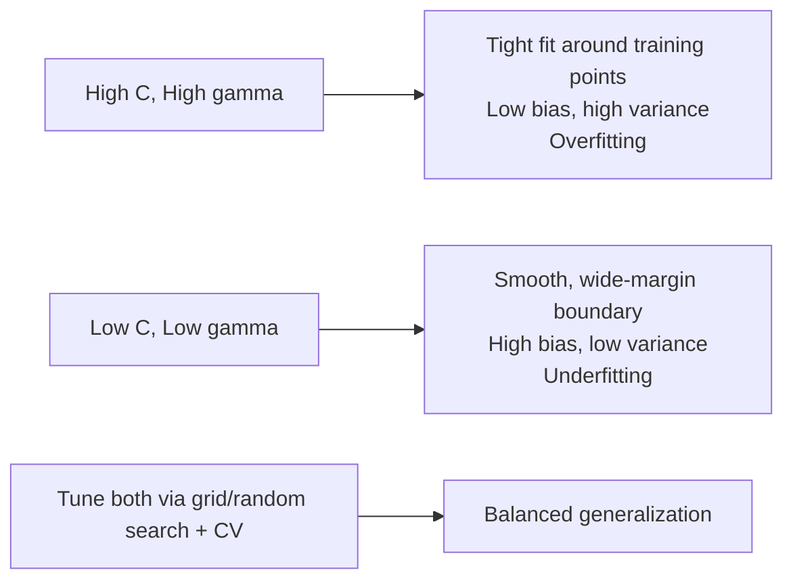
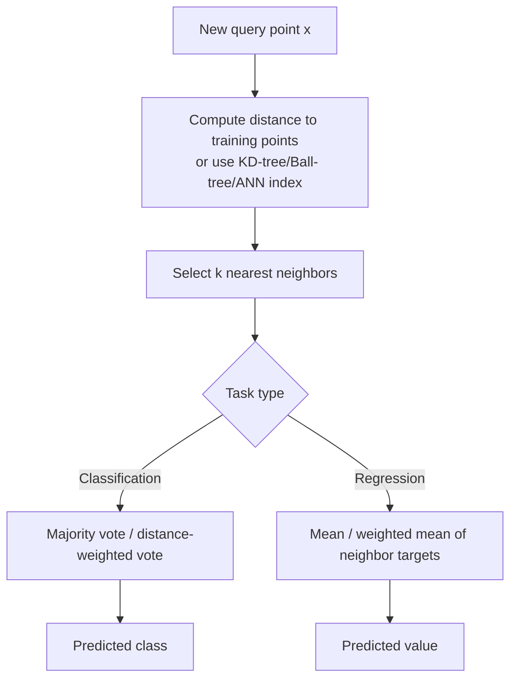
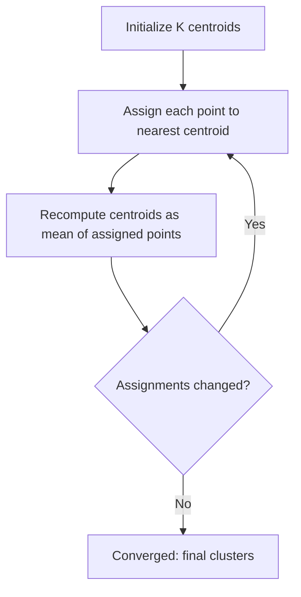
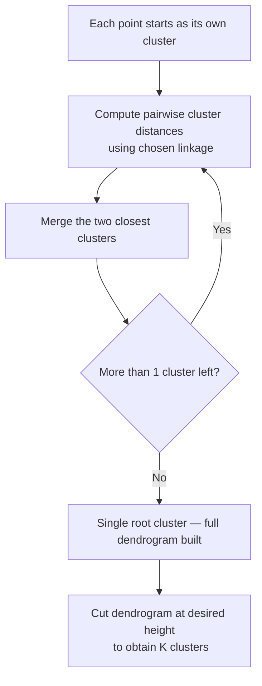
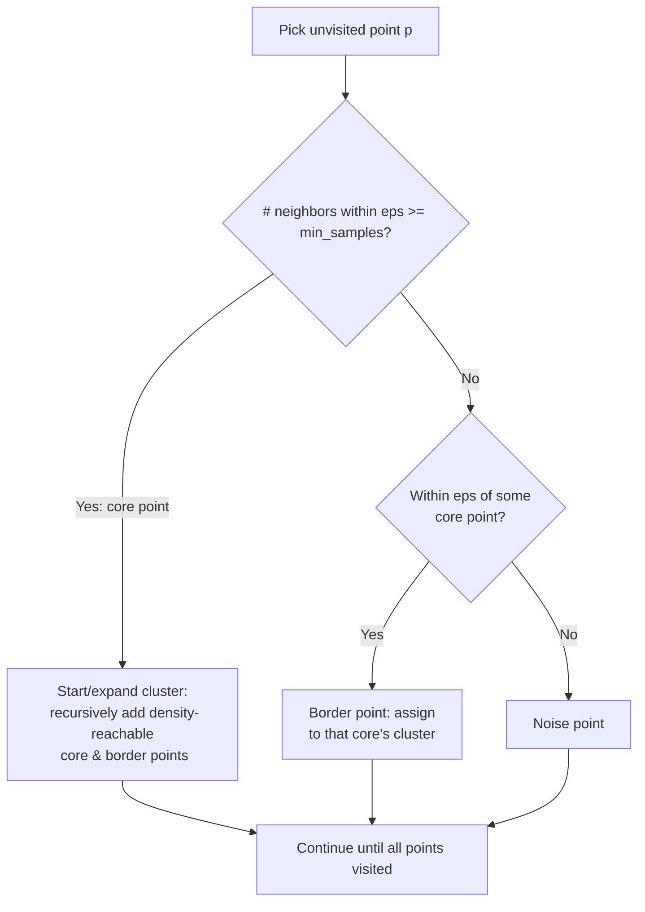
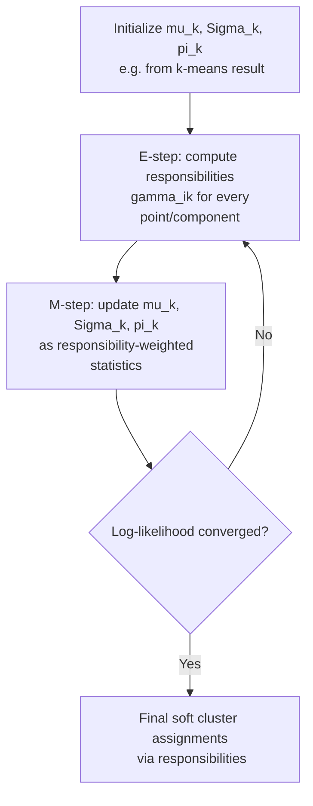
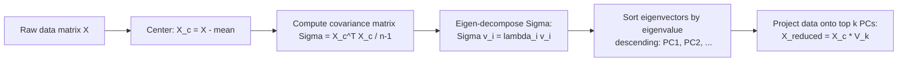

# Other ML Algorithms: SVM, k-NN, Naive Bayes, Clustering & Dimensionality Reduction

This file covers the classical, non-neural-network ML algorithms that remain heavily interview-tested for applied ML/forecasting roles: SVMs and the kernel trick, k-NN and the curse of dimensionality, Naive Bayes, the major clustering families, and dimensionality reduction (PCA/t-SNE/UMAP/feature selection). Each section derives the core math, walks through the algorithm mechanics with a diagram where useful, and closes with realistic interview Q&A.

## Table of Contents
1. [Support Vector Machines](#support-vector-machines)
2. [k-Nearest Neighbors](#k-nearest-neighbors)
3. [Naive Bayes](#naive-bayes)
4. [Clustering](#clustering)
   - [K-Means](#k-means)
   - [Hierarchical Clustering](#hierarchical-clustering)
   - [DBSCAN](#dbscan)
   - [Gaussian Mixture Models](#gaussian-mixture-models)
   - [Clustering Comparison Table](#clustering-comparison-table)
5. [Dimensionality Reduction](#dimensionality-reduction)
   - [PCA](#pca)
   - [t-SNE vs UMAP](#t-sne-vs-umap)
   - [Feature Selection vs Feature Extraction](#feature-selection-vs-feature-extraction)
6. [Popular Questions — Full Answers](#popular-questions--full-answers)
7. [Quick Recall Sheet](#quick-recall-sheet)

---

## Support Vector Machines

### The margin-maximization objective

SVM finds the hyperplane that separates two classes with the **maximum margin** — the largest possible distance between the decision boundary and the nearest points of either class (the *support vectors*).

A hyperplane is defined as $w \cdot x + b = 0$. For a linearly separable dataset with labels $y_i \in \{-1, +1\}$, we want every point correctly classified with some buffer:

$$y_i(w \cdot x_i + b) \geq 1 \quad \forall i$$

The distance from a point on the boundary of the margin to the hyperplane is $\frac{1}{\|w\|}$, so the total margin width is $\frac{2}{\|w\|}$. Maximizing the margin is equivalent to minimizing $\|w\|$, which for mathematical convenience (differentiability, convexity) is written as minimizing $\frac{1}{2}\|w\|^2$.

**Hard-margin SVM (primal form):**

$$\min_{w,b} \frac{1}{2}\|w\|^2 \quad \text{subject to} \quad y_i(w \cdot x_i + b) \geq 1 \; \forall i$$

This only works if the data is perfectly linearly separable. Real data rarely is, so we introduce **slack variables** $\xi_i \geq 0$ that allow individual points to violate the margin (or even be misclassified), penalized by a cost hyperparameter $C$:

**Soft-margin SVM:**

$$\min_{w,b,\xi} \frac{1}{2}\|w\|^2 + C\sum_{i=1}^n \xi_i \quad \text{subject to} \quad y_i(w\cdot x_i + b) \geq 1 - \xi_i, \;\; \xi_i \geq 0$$

- $\xi_i = 0$: point is correctly classified outside/on the margin.
- $0 < \xi_i \leq 1$: point is inside the margin but still correctly classified.
- $\xi_i > 1$: point is misclassified.

This is a convex quadratic program, solved in practice via its **dual formulation** (Lagrangian dual), which is what actually enables the kernel trick:

$$\max_{\alpha} \sum_i \alpha_i - \frac{1}{2}\sum_i\sum_j \alpha_i \alpha_j y_i y_j (x_i \cdot x_j) \quad \text{s.t.} \quad 0 \le \alpha_i \le C, \;\; \sum_i \alpha_i y_i = 0$$

Only points with $\alpha_i > 0$ (the support vectors) determine the final decision boundary — this is why SVMs can be memory-efficient at prediction time relative to the training set size.

### The kernel trick

Notice the dual only involves training points through dot products $x_i \cdot x_j$. If the data isn't linearly separable in its original space, we can map it into a higher-dimensional feature space via some function $\phi(x)$, where it might become separable. Instead of explicitly computing $\phi(x)$ (which could be extremely high-dimensional, even infinite), we use a **kernel function**:

$$K(x, x') = \phi(x) \cdot \phi(x')$$

The kernel computes the inner product in the transformed space directly from the original inputs, without ever materializing $\phi$. Replace every dot product in the dual with $K(x_i, x_j)$ and the entire algorithm — training and prediction — proceeds unchanged. This is the "kernel trick": it lets SVM (and other dot-product-based algorithms) implicitly operate in very high-dimensional, even infinite-dimensional, feature spaces at the computational cost of evaluating $K$ in the original space.

Common kernels:

| Kernel | Formula | Use case |
|---|---|---|
| Linear | $K(x,x') = x \cdot x'$ | High-dim sparse data (text), when classes are already roughly linearly separable |
| Polynomial | $K(x,x') = (\gamma\, x\cdot x' + r)^d$ | Captures feature interactions up to degree $d$ |
| RBF / Gaussian | $K(x,x') = \exp(-\gamma \|x - x'\|^2)$ | Default choice for non-linear boundaries; maps to infinite-dim space |
| Sigmoid | $K(x,x') = \tanh(\gamma\, x\cdot x' + r)$ | Behaves like a neural-net activation; less commonly used |

### Role of C and gamma

**C** (soft-margin penalty) controls the tradeoff between a wide margin and margin violations:
- **High C**: heavily penalizes misclassification/margin violations → narrower margin, fits training data closely → low bias, high variance → risk of overfitting.
- **Low C**: tolerates more violations → wider margin, smoother boundary → high bias, low variance → risk of underfitting.

**gamma** (RBF kernel width) controls how far the influence of a single training example reaches:
- **High gamma**: influence radius is small (points must be very close to matter) → decision boundary hugs individual points tightly → highly non-linear, jagged boundary → overfitting risk.
- **Low gamma**: influence radius is large → boundary is smoother/more linear-like → underfitting risk if too low.

Intuitively, gamma is $\propto 1/\sigma^2$ where $\sigma$ is the Gaussian's standard deviation — small $\sigma$ (high gamma) means each point's "bump" is narrow.



**Interview angle:**

- **Q: Why does maximizing the margin lead to better generalization?**
  A: A larger margin means the decision boundary sits as far as possible from the training points of both classes, which (via VC-dimension / statistical learning theory arguments) bounds the model's capacity and reduces sensitivity to small perturbations in new data. Intuitively, a narrow-margin boundary is "closer" to the data and more likely to have been shaped by noise in specific points; a wide margin generalizes better because it commits to fewer assumptions about borderline points.

- **Q: What's the difference between the primal and dual SVM formulation, and why do we care?**
  A: The primal directly optimizes $w$ and $b$ in the original feature space — cost scales with the number of features. The dual reformulates the problem in terms of Lagrange multipliers $\alpha_i$ over training points and only requires pairwise dot products $x_i \cdot x_j$. This dual form is what allows the kernel trick — we swap the dot product for $K(x_i,x_j)$ and implicitly work in a much higher-dimensional space without ever computing $\phi(x)$ explicitly, which is essential when that space is infinite-dimensional (as with RBF).

- **Q: You trained an RBF-SVM and it has 95% train accuracy but 65% test accuracy. What do you check first?**
  A: Classic overfitting signature — likely gamma too high (each support vector's influence too localized, memorizing noise) and/or C too high (over-penalizing margin violations). I'd run a grid search over C and gamma with k-fold CV, look at the validation curve, and consider whether features need scaling (RBF kernel distance is scale-sensitive) or whether a simpler kernel (linear) is more appropriate given the data's true dimensionality.

---

## k-Nearest Neighbors

### How it works

k-NN is a non-parametric, instance-based ("lazy") learner. There's no training phase beyond storing the data. To predict a new point $x$:
1. Compute distance from $x$ to every training point.
2. Take the $k$ closest points.
3. **Classification**: majority vote among their labels (optionally distance-weighted, e.g. weight $= 1/d$, so closer neighbors count more).
4. **Regression**: average (or distance-weighted average) of their target values.

### Distance metrics

| Metric | Formula | When to use |
|---|---|---|
| Euclidean | $\sqrt{\sum_i (x_i-x_i')^2}$ | Continuous, similarly-scaled features; default choice |
| Manhattan | $\sum_i \|x_i - x_i'\|$ | High-dimensional / grid-like data; more robust to outliers than Euclidean |
| Minkowski (general) | $\left(\sum_i \|x_i-x_i'\|^p\right)^{1/p}$ | Generalizes Euclidean ($p=2$) and Manhattan ($p=1$); $p$ tunable |
| Cosine distance | $1 - \dfrac{x \cdot x'}{\|x\|\|x'\|}$ | Text/TF-IDF and high-dim sparse vectors, where direction matters more than magnitude |

Cosine distance is preferred for text because document length (magnitude) shouldn't affect similarity — two documents about the same topic with different lengths should still be "close," which cosine captures by measuring the angle between vectors rather than absolute distance.

### The curse of dimensionality

As the number of dimensions $d$ grows, distance-based methods degrade because **distances between points become less discriminative** — the ratio between the nearest and farthest neighbor distance tends toward 1:

$$\lim_{d \to \infty} \frac{\text{dist}_{\max} - \text{dist}_{\min}}{\text{dist}_{\min}} \to 0$$

This is the **concentration of distances** phenomenon: in high dimensions, all pairwise distances become roughly equal, so "nearest neighbor" stops meaning anything special.

A concrete geometric way to see this: consider the ratio of the volume of a hypersphere (radius $r$) inscribed in a hypercube of side $2r$. In $d$ dimensions:

$$\frac{V_{\text{sphere}}}{V_{\text{cube}}} = \frac{\pi^{d/2}}{2^d\, \Gamma(d/2+1)}$$

This ratio shrinks toward zero extremely fast as $d$ increases — meaning almost all the volume of a high-dimensional cube sits in its "corners," far from the center, and data points that appear uniformly distributed become increasingly sparse and pushed toward the boundary/corners of the space. With data sparse and spread toward the edges, the notion of a "local neighborhood" breaks down, and k-NN (which fundamentally relies on locality) suffers.

Practical consequence: as $d$ grows, you need exponentially more data to maintain the same density of points per unit volume, or you must reduce dimensionality (PCA, feature selection) before applying k-NN.

### Choosing k

- **Small k (e.g. k=1)**: very flexible decision boundary, fits local noise → **low bias, high variance** → overfitting.
- **Large k**: smoother decision boundary, averages over many points → **high bias, low variance** → underfitting (in the extreme, k = n just predicts the global majority class/mean).
- Choose $k$ via cross-validation, plotting validation error vs. $k$ and picking the value at the low point of the error curve (bias-variance tradeoff). Odd $k$ is conventional for binary classification to avoid ties.

### Computational cost and mitigations

Naive k-NN prediction is $O(n \cdot d)$ per query (compute distance to all $n$ points in $d$ dimensions) — expensive at scale. Mitigations:
- **KD-trees**: partition space recursively along axes; efficient in low-to-moderate dimensions (roughly $d \lesssim 20$), degrades toward brute-force in high dimensions.
- **Ball trees**: partition data into nested hyperspheres rather than axis-aligned splits; more robust than KD-trees in higher dimensions.
- **Approximate nearest neighbor (ANN)** methods: locality-sensitive hashing (LSH), HNSW graphs, FAISS/Annoy — trade a small amount of accuracy for large speedups, standard in production retrieval/recommendation systems at scale.



**Interview angle:**

- **Q: Why is k-NN called a "lazy learner," and what's the tradeoff?**
  A: There's no explicit training/model-fitting step — it just stores the training data ("lazy"). This makes training instant but prediction expensive, since all computation is deferred to query time. Contrast with "eager" learners like logistic regression or SVM, which spend compute upfront to learn parameters, making prediction fast (just a dot product) but training slower.

- **Q: You have a 200-feature dataset and k-NN is performing poorly. Why, and what would you do?**
  A: Likely the curse of dimensionality — with 200 features, pairwise distances concentrate and neighbors stop being meaningfully "close." I'd apply dimensionality reduction (PCA, feature selection via mutual information/tree importances) to shrink to a much smaller effective dimensionality, ensure features are standardized (unscaled features dominate the distance calculation), and consider switching to a metric more robust in high-dim (e.g., cosine if the data is sparse/text-like) or a model less sensitive to dimensionality (tree ensembles).

- **Q: How would you pick between Euclidean and Manhattan distance for a given problem?**
  A: Euclidean is the default for continuous, roughly isotropic feature spaces (it's the natural geometric distance). Manhattan is preferable when features have a grid-like/independent-axis structure, when outliers should have less inflated influence (Manhattan grows linearly rather than quadratically with per-feature difference), or in higher dimensions where Manhattan tends to be more robust. In practice I'd try both via CV and let validation performance decide.

---

## Naive Bayes

### Derivation from Bayes' theorem

We want $P(y \mid x_1, \dots, x_n)$ — the probability of class $y$ given observed features. Bayes' theorem gives:

$$P(y \mid x_1,\dots,x_n) = \frac{P(y)\, P(x_1,\dots,x_n \mid y)}{P(x_1,\dots,x_n)}$$

Since the denominator is constant across classes for a given input, classification reduces to:

$$\hat{y} = \arg\max_y P(y)\, P(x_1,\dots,x_n \mid y)$$

The joint likelihood $P(x_1,\dots,x_n\mid y)$ is intractable to estimate directly for anything but tiny feature sets (exponential number of parameter combinations). The **naive** assumption is conditional independence of features given the class:

$$P(x_1,\dots,x_n \mid y) = \prod_{i=1}^n P(x_i \mid y)$$

giving the full classifier:

$$\hat{y} = \arg\max_y\; P(y)\prod_{i=1}^n P(x_i \mid y)$$

i.e. **posterior ∝ prior × (product of per-feature likelihoods)**. In practice we work in log-space to avoid numerical underflow:

$$\hat{y} = \arg\max_y \; \left[\log P(y) + \sum_{i=1}^n \log P(x_i\mid y)\right]$$

### Why it works despite the unrealistic assumption

Features are rarely truly conditionally independent given the class (e.g., in text, word co-occurrences are correlated). Yet Naive Bayes often performs surprisingly well because:
- Classification only needs the **arg-max** class to be correct, not the exact posterior probabilities — even if the estimated probabilities are miscalibrated due to violated independence, the *ranking* of classes often stays correct.
- With limited training data, a low-variance biased model (few parameters — just per-feature-per-class probabilities) can outperform a higher-variance "correct" model that overfits.
- Errors from correlated features tend to compound in the same direction across classes, partially canceling out in the relative comparison used for arg-max.

### Use cases and variants

Classic use case: **text classification / spam filtering**, where each word is a feature.

| Variant | Feature representation | Likelihood model |
|---|---|---|
| **Multinomial NB** | Word counts / term frequencies | $P(x_i\mid y)$ modeled as multinomial distribution over word counts — captures "how many times" a word appears |
| **Bernoulli NB** | Binary word presence/absence | $P(x_i\mid y)$ modeled as Bernoulli — only captures "did this word appear," ignores frequency; also explicitly penalizes absence of words |
| **Gaussian NB** | Continuous features | $P(x_i\mid y)$ modeled as Gaussian with per-class mean/variance |

Multinomial NB typically outperforms Bernoulli on longer documents where word frequency carries signal; Bernoulli can do better on short texts where presence/absence is the dominant signal.

### Laplace (additive) smoothing

If a word never appears with a given class in training data, $P(x_i \mid y) = 0$, which zeroes out the entire product regardless of other evidence — a single unseen word torpedoes the whole prediction. **Laplace smoothing** adds a pseudo-count $\alpha$ (typically 1) to every count:

$$P(x_i \mid y) = \frac{\text{count}(x_i, y) + \alpha}{\text{count}(y) + \alpha \cdot |V|}$$

where $|V|$ is the vocabulary size (number of possible feature values). This ensures no probability is ever exactly zero, while barely perturbing well-estimated probabilities when counts are large.

```mermaid
flowchart LR
    A[Training corpus] --> B[Estimate P(y) priors\nper class]
    A --> C[Estimate P(x_i|y)\nper word per class\n with Laplace smoothing]
    D[New document] --> E[Tokenize into features x_1..x_n]
    B --> F[Compute log P(y) + sum log P(x_i|y)\nfor each class]
    C --> F
    E --> F
    F --> G[Predict argmax class]
```

**Interview angle:**

- **Q: Naive Bayes assumes feature independence given the class — why does it still work well for spam detection?**
  A: Because classification only requires the correct class to have the highest posterior score, not a perfectly calibrated probability. Word correlations in spam vs. ham tend to bias the log-likelihood sums for both classes similarly, so the relative ranking (arg-max) is often preserved even though the individual probability estimates are technically wrong. Combined with very fast training/inference and good performance on high-dimensional sparse data (bag-of-words), it's a strong, simple baseline.

- **Q: Why is Laplace smoothing necessary, and what would happen without it?**
  A: Without smoothing, any word absent from a class's training vocabulary yields $P(x_i \mid y) = 0$, which zeroes the entire product for that class — a single new/rare word (e.g. a misspelling in a spam email) would make the model refuse to ever assign that class, regardless of how much other evidence points to it. Adding a pseudo-count $\alpha$ (Laplace, $\alpha=1$) ensures all probabilities stay strictly positive and the impact of unseen features shrinks as training data grows.

- **Q: When would you choose Bernoulli NB over Multinomial NB?**
  A: Bernoulli NB when only presence/absence of features matters (e.g., short texts, or when you explicitly want the model to penalize the *absence* of expected words, which Bernoulli does but Multinomial doesn't). Multinomial NB when word frequency is informative — e.g., a document repeating "free money" many times is more likely spam than one mentioning it once, and Multinomial's count-based likelihood captures that gradation.

---

## Clustering

### K-Means

**Objective function** — minimize the within-cluster sum of squares (WCSS), also called inertia:

$$J = \sum_{k=1}^{K} \sum_{x_i \in C_k} \|x_i - \mu_k\|^2$$

where $\mu_k$ is the centroid of cluster $C_k$. This is a non-convex combinatorial optimization problem (NP-hard in general), so k-means uses **Lloyd's algorithm** to find a local optimum:

1. **Initialize** $K$ centroids (randomly, or via k-means++, see below).
2. **Assign step**: assign each point to its nearest centroid: $C_k = \{x_i : k = \arg\min_j \|x_i - \mu_j\|^2\}$.
3. **Update step**: recompute each centroid as the mean of points assigned to it: $\mu_k = \frac{1}{|C_k|}\sum_{x_i \in C_k} x_i$.
4. **Repeat** steps 2-3 until assignments stop changing (or WCSS improvement falls below a threshold).

Each iteration is guaranteed to not increase $J$ (assign step picks the closest centroid, minimizing per-point distance; update step picks the mean, which minimizes squared distance to a set of points), so the algorithm converges — but only to a **local** optimum dependent on initialization.



**k-means++ initialization**: Random initialization can place initial centroids poorly (e.g., two centroids close together in the same true cluster), leading to convergence to a bad local optimum. k-means++ seeds centroids to be spread out:
1. Choose the first centroid uniformly at random from the data.
2. For each remaining point $x$, compute $D(x)$ = distance to the nearest already-chosen centroid.
3. Choose the next centroid from the data with probability proportional to $D(x)^2$ (points farther from existing centroids are more likely to be picked).
4. Repeat until $K$ centroids are chosen, then run standard Lloyd's algorithm from there.

This probabilistic spreading dramatically reduces the chance of poor local optima and typically speeds up convergence, at only $O(\log K)$ expected approximation-ratio worse than optimal (theoretical guarantee from the original paper).

**Choosing K — Elbow method**: plot WCSS ($J$) against $K$. WCSS monotonically decreases as $K$ increases (more clusters can only fit data better), but the *rate* of decrease drops sharply after the "true" number of clusters — plot looks like an arm, and the "elbow" (point of diminishing returns) is chosen as $K$.

**Silhouette score**: for each point $i$, let $a(i)$ = mean distance to other points in the same cluster (cohesion), $b(i)$ = mean distance to points in the nearest *other* cluster (separation). Then:

$$s(i) = \frac{b(i) - a(i)}{\max(a(i), b(i))}$$

- $s(i)$ ranges from $-1$ to $1$.
- $s(i) \approx 1$: point is well-matched to its own cluster, far from neighboring clusters (good clustering).
- $s(i) \approx 0$: point is on/near the boundary between two clusters.
- $s(i) < 0$: point is likely assigned to the wrong cluster (closer on average to a different cluster than its own).

Average silhouette across all points is computed for each candidate $K$; the $K$ maximizing average silhouette is preferred. It's often more reliable than the elbow method since it doesn't require subjectively eyeballing a bend.

**Limitations**:
- Assumes clusters are **spherical/isotropic** and roughly **equal size/density** — fails badly on elongated, nested, or unevenly-sized/dense clusters.
- **Scale-sensitive**: features with larger numeric ranges dominate the Euclidean distance; always standardize (z-score) before running k-means.
- **Sensitive to outliers**: a single far-flung point can pull a centroid away from the bulk of its true cluster (since centroids are means, and means are outlier-sensitive) — k-medoids (PAM) is a robust alternative that uses actual data points as cluster centers.
- Must specify $K$ upfront.

**Interview angle:**

- **Q: Walk me through why k-means can converge to different results on different runs.**
  A: Lloyd's algorithm only guarantees convergence to a local minimum of the WCSS objective, and the non-convex loss surface has many local minima. Random initial centroid placement determines which basin of attraction the algorithm falls into. In practice, run k-means multiple times with different random seeds (`n_init` in scikit-learn) and keep the run with lowest final WCSS, or use k-means++ initialization to systematically reduce the chance of bad starts.

- **Q: When would you avoid k-means entirely?**
  A: When clusters are non-spherical (e.g., moons, rings, elongated ellipses), have very different densities or sizes, or contain significant outliers/noise you don't want forced into a cluster. In those cases DBSCAN (density-based, handles noise and arbitrary shapes) or GMM (allows elliptical clusters via covariance) are better fits.

---

### Hierarchical Clustering

Builds a hierarchy of clusters rather than a single flat partition, visualized as a **dendrogram**.

- **Agglomerative (bottom-up)**: start with every point as its own cluster, iteratively merge the two closest clusters, until all points are in one cluster. This is the far more commonly used variant — it's computationally simpler to implement greedily.
- **Divisive (top-down)**: start with all points in one cluster, recursively split. Requires deciding *how* to split at each step (itself a hard sub-problem, often requiring something like k-means or graph partitioning internally), so it's rarely used in practice ($O(2^n)$ possible splits to consider naively).

**Linkage methods** — define the "distance between two clusters" used to decide which pair to merge next:

| Linkage | Definition | Effect on cluster shape |
|---|---|---|
| **Single (min)** | Distance between closest pair of points across the two clusters | Can produce long, straggly clusters — **"chaining"** effect, where a chain of close points links otherwise distant groups |
| **Complete (max)** | Distance between farthest pair of points across the two clusters | Produces compact, roughly equal-diameter clusters; sensitive to outliers |
| **Average** | Mean distance over all cross-cluster pairs | Compromise between single and complete; moderately robust |
| **Ward's** | Merge that minimizes the increase in total within-cluster variance (WCSS-like criterion) | Tends to produce compact, similarly-sized spherical clusters — most similar in spirit to k-means |

**Dendrogram**: a tree diagram where the y-axis is the distance/dissimilarity at which clusters were merged, and the x-axis lists individual points. To get $K$ flat clusters, draw a horizontal line that crosses exactly $K$ vertical branches — cutting at different heights yields different numbers of clusters, giving you a whole family of solutions without re-running the algorithm.



**Interview angle:**

- **Q: Why does single linkage produce "chaining," and why can that be a problem?**
  A: Single linkage merges clusters based on their single closest pair of points, ignoring the overall shape/density of the clusters. This means a thin bridge of intermediate points can cause two otherwise well-separated dense blobs to be merged into one long, snake-like cluster — the algorithm greedily follows the chain of nearest neighbors rather than respecting overall compactness. Complete or Ward's linkage avoids this by considering the full extent of each cluster.

- **Q: What's the advantage of hierarchical clustering over k-means when you don't know K?**
  A: The dendrogram encodes the entire nested clustering structure at all resolutions simultaneously — you build it once and can cut at any height to get any number of clusters, inspecting the tree to choose a sensible cut point (e.g., largest vertical gap = most natural separation). K-means requires re-running the whole algorithm for each candidate $K$. The tradeoff is computational: naive agglomerative clustering is $O(n^2 \log n)$ or worse and doesn't scale to very large datasets the way k-means does.

---

### DBSCAN

**Density-Based Spatial Clustering of Applications with Noise** groups together points that are closely packed, marking points in low-density regions as noise/outliers.

Two parameters:
- **eps ($\varepsilon$)**: radius of the neighborhood around a point.
- **min_samples**: minimum number of points (including itself) required within $\varepsilon$ for a point to be considered a **core point**.

**Point classification**:
- **Core point**: has at least `min_samples` points within $\varepsilon$ of it (including itself).
- **Border point**: not a core point itself, but lies within $\varepsilon$ of a core point.
- **Noise point**: neither core nor border — doesn't belong to any cluster.

**Algorithm**: pick an unvisited point; if it's a core point, start a new cluster and recursively absorb all points density-reachable from it (all core points reachable through chains of core points, plus their border points); if not core, mark as noise (temporarily — it may later be claimed as a border point of another cluster). Repeat until all points are visited.



**Advantages**: naturally identifies outliers as noise (no forced assignment, unlike k-means), discovers arbitrarily shaped clusters (not limited to spherical), doesn't require specifying $K$ upfront.

**Limitation**: struggles with **clusters of varying density** — a single global $\varepsilon$/`min_samples` pair can't simultaneously be "tight" enough for a dense cluster and "loose" enough for a sparse one; a sparse true cluster may get shredded into noise while a dense one may get artificially merged with a nearby less-dense one. (HDBSCAN extends DBSCAN to handle varying density by building a hierarchy over multiple density thresholds.)

**Interview angle:**

- **Q: How does DBSCAN decide the number of clusters?**
  A: It doesn't require it as an input — the number of clusters emerges naturally from the density structure of the data, determined jointly by $\varepsilon$ and `min_samples`. This is a major advantage over k-means when $K$ is genuinely unknown, but it shifts the tuning burden onto choosing good $\varepsilon$/`min_samples` (commonly via a k-distance plot: sort each point's distance to its $k$-th nearest neighbor, plot it, and look for the "knee" as a candidate $\varepsilon$).

- **Q: Your dataset has one dense cluster and one sparse, spread-out cluster. Why might DBSCAN fail here, and what would you do?**
  A: A single $\varepsilon$ can't serve both — set small enough to resolve the dense cluster, it'll shatter the sparse cluster into noise/many tiny clusters; set large enough to capture the sparse cluster, it may merge the dense cluster's boundary with nearby points that shouldn't belong, or absorb noise into it. I'd consider HDBSCAN, which builds a cluster hierarchy across a range of density thresholds and extracts stable clusters at each their own natural density level, removing the need for one global $\varepsilon$.

---

### Gaussian Mixture Models

GMM performs **soft, probabilistic clustering**: each cluster $k$ is modeled as a Gaussian distribution $\mathcal{N}(\mu_k, \Sigma_k)$, and the overall data distribution is a weighted mixture:

$$p(x) = \sum_{k=1}^{K} \pi_k\, \mathcal{N}(x \mid \mu_k, \Sigma_k), \qquad \sum_k \pi_k = 1$$

where $\pi_k$ is the mixing weight (prior probability) of component $k$. Instead of assigning each point to exactly one cluster, GMM outputs a **responsibility** $\gamma_{ik} = P(z_i = k \mid x_i)$ — the posterior probability that point $i$ belongs to component $k$.

Parameters ($\pi_k, \mu_k, \Sigma_k$ for all $k$) are estimated via the **Expectation-Maximization (EM)** algorithm:

- **E-step**: given current parameter estimates, compute the responsibilities for every point/component pair using Bayes' rule:
$$\gamma_{ik} = \frac{\pi_k\, \mathcal{N}(x_i\mid \mu_k,\Sigma_k)}{\sum_{j} \pi_j\, \mathcal{N}(x_i \mid \mu_j, \Sigma_j)}$$
- **M-step**: given the responsibilities, re-estimate each component's parameters as responsibility-weighted statistics:
  - $\mu_k = \frac{\sum_i \gamma_{ik} x_i}{\sum_i \gamma_{ik}}$ (weighted mean)
  - $\Sigma_k = \frac{\sum_i \gamma_{ik}(x_i-\mu_k)(x_i-\mu_k)^T}{\sum_i \gamma_{ik}}$ (weighted covariance)
  - $\pi_k = \frac{1}{n}\sum_i \gamma_{ik}$ (updated mixing weight)
- Repeat E and M steps until the log-likelihood converges. Like k-means, EM converges to a local optimum only, so multiple random restarts are recommended.



**GMM vs. k-means**:
- k-means is effectively a special case of GMM where all covariances are constrained to be spherical and identical ($\Sigma_k = \sigma^2 I$) and assignment is hardened (each point forced 100% into its nearest cluster rather than a soft responsibility).
- GMM allows **elliptical clusters** of varying orientation/size via the full covariance matrix $\Sigma_k$, and gives **soft assignments** — useful when cluster boundaries are genuinely ambiguous (e.g., a point 55%/45% between two clusters) rather than forcing a hard commitment.
- GMM is more flexible but has more parameters to estimate (full covariance matrices), so needs more data and is more prone to overfitting/singular covariance issues with small clusters.

**Interview angle:**

- **Q: How is GMM different from k-means, mechanically and conceptually?**
  A: Mechanically, k-means uses Lloyd's algorithm (hard assign → recompute mean); GMM uses EM (soft responsibility → recompute weighted mean/covariance/mixing weight). Conceptually, k-means assumes clusters are spherical, equally sized, and gives a hard 0/1 assignment; GMM models each cluster as its own Gaussian with its own shape/orientation (via covariance) and gives a probabilistic degree of membership — better suited when clusters overlap or have elongated/correlated feature structure.

- **Q: When would you prefer GMM's soft assignments over k-means' hard assignments?**
  A: When cluster boundaries are ambiguous and you want to propagate uncertainty downstream (e.g., using responsibility scores as continuous features in another model), when true clusters are elliptical/correlated rather than spherical, or when you want a principled probabilistic model (density estimate, ability to compute likelihood of new points, use BIC/AIC for model selection) rather than just a partition.

---

### Clustering Comparison Table

| Method | Cluster shape assumption | Specify K upfront? | Handles noise/outliers | Scalability |
|---|---|---|---|---|
| **K-Means** | Spherical, similar size/density | Yes | No (all points forced into a cluster) | Very good — $O(nKd)$ per iteration, scales to large $n$ |
| **Hierarchical (agglomerative)** | Depends on linkage (Ward ≈ spherical, single = arbitrary but chains) | No (cut dendrogram after) | No | Poor — typically $O(n^2 \log n)$ or worse, doesn't scale to very large $n$ |
| **DBSCAN** | Arbitrary (density-connected regions) | No (emerges from $\varepsilon$/min_samples) | Yes — explicit noise label | Good with spatial indexing (KD-tree/ball-tree), degrades in high dimensions |
| **GMM** | Elliptical (via covariance structure) | Yes | No (soft, but every point gets nonzero weight everywhere) | Moderate — EM iterations cost similar order to k-means but with covariance estimation overhead |

---

## Dimensionality Reduction

### PCA

**Goal**: find a lower-dimensional linear subspace that preserves as much variance (information) in the data as possible.

**Derivation**:

1. **Center the data**: subtract the mean from each feature so the dataset has zero mean: $X_c = X - \bar{X}$. (Also typically standardize each feature to unit variance if features are on different scales.)

2. **Compute the covariance matrix**:
$$\Sigma = \frac{1}{n-1} X_c^T X_c$$
where $\Sigma$ is $d \times d$ (for $d$ features), and $\Sigma_{jk}$ captures the covariance between features $j$ and $k$.

3. **Eigen-decompose the covariance matrix**: find eigenvectors $v_1, \dots, v_d$ and corresponding eigenvalues $\lambda_1 \geq \lambda_2 \geq \dots \geq \lambda_d$ satisfying:
$$\Sigma v_i = \lambda_i v_i$$
Because $\Sigma$ is symmetric and positive semi-definite, all eigenvalues are real and non-negative, and eigenvectors are orthogonal.

4. **Principal components** are the eigenvectors ordered by eigenvalue magnitude (largest first). The first principal component $v_1$ is the direction in feature space along which the data has **maximum variance** — formally, it's the unit vector maximizing $\text{Var}(X_c v) = v^T \Sigma v$, which by the Rayleigh-quotient property is maximized by the top eigenvector, with the maximum value equal to $\lambda_1$.

5. **Variance explained ratio** for component $i$:
$$\text{Explained variance ratio}_i = \frac{\lambda_i}{\sum_{j=1}^d \lambda_j}$$
This tells you what fraction of the total variance in the data is captured by that component; cumulative sums across the top few components tell you how many dimensions you need to retain (e.g.) 95% of the variance.

6. **Project the data** onto the top $k$ components: $X_{\text{reduced}} = X_c V_k$, where $V_k$ is the $d \times k$ matrix of the top $k$ eigenvectors.

**What does PC1 represent?** It's the single direction in the original feature space along which projecting the data preserves the most spread/information — i.e., the axis of greatest variability. If you had to summarize the dataset with just one number per point while losing as little information (variance) as possible, projecting onto PC1 is the optimal linear choice.

**When PCA fails**: PCA only captures **linear** structure. If the true underlying structure is a non-linear manifold — the canonical example being the "Swiss roll" (a 2D sheet curled up in 3D space) — a linear projection will "cut through" the roll and mix points that are actually far apart along the manifold's surface, destroying the true geometric relationships. In such cases, use:
- **Kernel PCA**: apply the kernel trick (same idea as SVM) to perform PCA in an implicit non-linearly-mapped feature space, capturing non-linear structure.
- Manifold learning methods: t-SNE, UMAP, Isomap, LLE.



**Interview angle:** see the dedicated Popular Questions section below for the full "explain PCA" answer.

---

### t-SNE vs UMAP

Both are non-linear dimensionality reduction techniques used primarily for **2D/3D visualization**, aiming to preserve local neighborhood structure (points close in high-dim space should stay close in the low-dim embedding).

**t-SNE** (t-distributed Stochastic Neighbor Embedding): converts high-dimensional pairwise distances into a probability distribution over pairs (points close together get high probability of being "neighbors"), then finds a low-dimensional embedding whose corresponding probability distribution (using a heavier-tailed Student-t distribution to avoid crowding) is as similar as possible, measured via KL divergence.

- **Perplexity**: roughly, the effective number of nearest neighbors considered for each point when constructing the high-dimensional probability distribution. It balances attention between local and global structure — low perplexity (~5) focuses tightly on very local neighborhoods (can fragment the data into many small clusters); high perplexity (~50) considers a broader neighborhood (smoother, more globally-influenced embedding). Typical range: 5–50; results should be checked across a few values since the "right" perplexity depends on dataset density.
- **Why inter-cluster distances aren't meaningful**: t-SNE's optimization only tries to preserve *local* neighbor relationships (via the probability construction), not global distances. The relative sizes and separations between distinct clusters in the 2D plot are an artifact of the optimization and layout, not a faithful representation of true distances in the original space — you cannot conclude "cluster A is twice as far from cluster B as from cluster C" from a t-SNE plot.

**UMAP** (Uniform Manifold Approximation and Projection): built on a rigorous topological/manifold-learning foundation (Riemannian geometry and algebraic topology — approximating the data as a fuzzy topological structure and finding a low-dim layout that best represents that structure). Practically:
- Faster than t-SNE (better scaling for large $n$, often 10-100x speedup).
- Better preserves **global structure** in addition to local structure (relative distances between clusters are more meaningful, though still not perfectly literal).
- Has an analogous parameter, `n_neighbors`, that plays a similar role to perplexity (controls local vs. global structure emphasis).

| | t-SNE | UMAP |
|---|---|---|
| Theoretical basis | Heuristic (probability matching via KL divergence) | Grounded in manifold learning / algebraic topology |
| Speed | Slower, scales poorly to very large $n$ | Faster, scales better |
| Local structure preservation | Excellent | Excellent |
| Global structure preservation | Poor — inter-cluster distances not meaningful | Better — relative global layout more trustworthy |
| Key parameter | Perplexity (effective neighborhood size) | `n_neighbors` (analogous role), `min_dist` |
| Reproducibility | Sensitive to random seed/perplexity choice | Generally more stable, still stochastic |
| Can embed new points without recomputing | No (transductive) | Yes, has a `.transform()` for new data |

**Interview angle:**

- **Q: Why shouldn't you interpret the distance between two clusters in a t-SNE plot?**
  A: t-SNE's objective only optimizes to preserve local neighbor probabilities — it explicitly does not try to preserve global distances between well-separated regions. The 2D layout algorithm can arbitrarily stretch or compress the space between clusters to satisfy local constraints, so the visual gap between cluster A and B carries no quantitative meaning; only "these points are/aren't near each other within a cluster" is trustworthy.

- **Q: You need to reduce dimensionality for a downstream clustering/classification pipeline, not just visualization — would you use t-SNE?**
  A: No — t-SNE embeddings aren't meant for downstream modeling: they're non-parametric (can't transform new/unseen points without recomputing over the whole dataset), and distances in the embedding don't preserve meaningful global relationships needed for a model trained on that geometry. For a modeling pipeline I'd use PCA (linear, has an explicit transform for new data) or UMAP (which does support transforming new points and preserves more global structure), depending on whether linear structure suffices.

---

### Feature Selection vs Feature Extraction

Both reduce the number of features used by a model, but differently:

- **Feature selection**: choose a **subset** of the original features, discarding the rest. Features retain their original meaning — fully interpretable.
  - **Filter methods**: score features independently of any model, using statistical tests — correlation with target, chi-square test (categorical features), mutual information, variance threshold. Fast, model-agnostic, but ignores feature interactions.
  - **Wrapper methods**: use a model's performance to evaluate feature subsets — e.g., **Recursive Feature Elimination (RFE)**, which repeatedly trains a model, ranks features by importance/coefficient magnitude, drops the weakest, and repeats. More accurate (accounts for interactions) but computationally expensive.
  - **Embedded methods**: feature selection happens as part of model training — **Lasso (L1 regularization)** shrinks unimportant feature coefficients to exactly zero; **tree-based feature importances** (Gini importance, permutation importance) rank features from a fitted random forest/GBM. Good balance of cost and accuracy.

- **Feature extraction**: create **new transformed features** that are combinations of the originals — e.g., PCA (linear combinations), autoencoders (non-linear learned compressions), LDA. The new features generally aren't individually interpretable in terms of the original variables, but can capture more information per dimension.

| | Feature Selection | Feature Extraction |
|---|---|---|
| Output | Subset of original features | New transformed features |
| Interpretability | High — retains original feature meaning | Low — components are combinations, harder to explain |
| Compression quality | Limited to what original features offer | Can compress more effectively (captures combined variance/non-linear structure) |
| Examples | Correlation filter, chi-square, RFE, Lasso, tree importances | PCA, kernel PCA, autoencoders, LDA |
| Best when | Interpretability/regulatory explainability matters, or you must keep raw features for downstream business use | Maximizing predictive compression matters more than explaining individual features |

**Interview angle:**

- **Q: Your stakeholder needs the model's feature importances to be explainable to a compliance team. Would you use PCA to reduce dimensionality?**
  A: No — I'd prefer feature selection (e.g., Lasso or tree-based importance ranking) since it keeps the original, named features, letting me report "feature X contributed this much," which compliance/business stakeholders can interpret directly. PCA components are linear combinations of many original features and don't map cleanly to a business explanation, even though they may compress information more efficiently.

- **Q: What's the practical downside of wrapper methods like RFE compared to embedded methods?**
  A: Wrapper methods retrain the model many times (once per candidate feature subset), which is computationally expensive, especially with many features or a slow-to-train model, and can overfit the feature selection to the specific validation set used. Embedded methods (Lasso, tree importances) get feature relevance "for free" as a byproduct of a single model fit, which is far cheaper and, since regularization/importance is baked into training, tends to generalize the selection better.

---

## Popular Questions — Full Answers

### "How does k-means initialization affect results, and how do you fix it?"

K-means (via Lloyd's algorithm) only guarantees convergence to a **local** minimum of the WCSS objective $J = \sum_k \sum_{x_i \in C_k}\|x_i - \mu_k\|^2$, not the global minimum, because the objective is non-convex. The final clusters found depend heavily on where centroids start:
- If two initial centroids land close together within what should be one true cluster, the algorithm may end up splitting a single true cluster into two, or merging two true clusters incorrectly, because assignment is driven entirely by proximity to the (poorly placed) current centroids.
- Random initialization can also converge slowly, needing many iterations to "unscramble" a bad start.

**Fixes**:
1. **k-means++ initialization**: instead of picking all $K$ centroids uniformly at random, pick the first centroid randomly, then each subsequent centroid with probability proportional to its squared distance from the nearest already-chosen centroid. This spreads centroids out across the data's actual distribution, avoiding the "two centroids in one cluster" failure mode, and gives a provable expected approximation-ratio bound relative to the optimal clustering.
2. **Multiple random restarts** (`n_init` in scikit-learn): run the full algorithm several times with different random seeds/initializations, and keep the result with the lowest final WCSS. This doesn't guarantee the global optimum but greatly reduces the chance of settling on a particularly bad local one.
3. Combine both — k-means++ as the seeding strategy plus several restarts is the practical default (this is what scikit-learn's `KMeans` does out of the box).

### "Explain PCA — what does the first principal component represent?"

PCA finds a new orthogonal coordinate system for the data, ordered by how much variance each axis captures, so that projecting onto the first few axes retains as much of the dataset's original spread (information) as possible using as few dimensions as possible.

**Steps**: center the data (subtract the mean), compute the $d \times d$ covariance matrix $\Sigma = \frac{1}{n-1}X_c^T X_c$, and eigen-decompose it: $\Sigma v_i = \lambda_i v_i$. The eigenvectors $v_i$ are the principal component directions; the eigenvalues $\lambda_i$ equal the variance of the data when projected onto that direction. Sorting eigenvectors by eigenvalue in descending order gives PC1, PC2, etc.

**The first principal component ($v_1$, associated with $\lambda_1$, the largest eigenvalue)** is the single direction in the original feature space along which the data varies the most — the axis you'd choose if you could only keep one number per data point and wanted to preserve as much of the dataset's total variability/information as possible. Mathematically it's the solution to $\max_{\|v\|=1} v^T\Sigma v$, which by the Rayleigh quotient is exactly the top eigenvector of $\Sigma$, with the maximum achievable variance equal to $\lambda_1$.

Each subsequent PC is the direction of maximum remaining variance, subject to being orthogonal to all previous PCs. The **explained variance ratio** $\lambda_i / \sum_j \lambda_j$ quantifies how much of the total variance each component accounts for, letting you decide how many components to keep (e.g., enough to reach 90-95% cumulative explained variance).

PCA is a **linear** technique — it fails when the true structure is a curved/non-linear manifold (e.g., Swiss roll), where a linear projection mixes points that are actually far apart along the manifold. Kernel PCA or manifold methods (t-SNE, UMAP, Isomap) are used in that case.

### "How do you choose the number of clusters in k-means?"

There's no single definitive answer since $K$ is inherently somewhat subjective/task-dependent, but standard approaches:

1. **Elbow method**: run k-means for a range of $K$ values, plot WCSS (inertia) vs. $K$. WCSS always decreases as $K$ increases (more clusters can only reduce within-cluster distance), but the *rate* of decrease slows sharply after the true number of clusters — look for the "elbow" bend in the curve and pick that $K$. Downside: the elbow can be ambiguous/subjective on real data.

2. **Silhouette score**: for each $K$, compute the average silhouette coefficient $s(i) = \frac{b(i)-a(i)}{\max(a(i),b(i))}$ across all points, where $a(i)$ is mean intra-cluster distance and $b(i)$ is mean distance to the nearest other cluster. Pick the $K$ that maximizes average silhouette — this is generally more objective and quantifiable than the elbow method, and directly measures how well-separated and cohesive the resulting clusters are.

3. **Domain knowledge / business constraints**: sometimes $K$ is dictated externally (e.g., segmenting customers into a number of tiers a marketing team can realistically act on), which should override purely statistical criteria.

4. **Gap statistic**: compares the WCSS of the actual clustering against the WCSS expected under a null reference distribution (uniformly random data), picking the $K$ where the gap between them is largest — more statistically principled than the elbow method but more expensive to compute.

5. In practice, I'd run several of these together (elbow + silhouette, at minimum), sanity-check with domain intuition, and visualize the resulting clusters (e.g., via PCA/t-SNE projection) to confirm the chosen $K$ produces sensible, well-separated groupings rather than relying on a single automated metric.

---

## Additional Common Interview Questions

**Q: How would you scale features before k-NN or SVM, and what happens if you forget to?**

Both algorithms are fundamentally distance/dot-product based, so the numeric scale of each feature directly determines how much it influences the result. k-NN computes distances like $\sqrt{\sum_i (x_i - x_i')^2}$ directly on raw feature values; SVM's margin and kernel computations (linear dot products, or RBF's $\|x-x'\|^2$) are likewise scale-dependent. If one feature has a much larger numeric range than another (e.g., "annual income" in the tens of thousands vs. "age" in the tens), it will dominate the distance calculation almost entirely, effectively causing the model to ignore the smaller-scale feature regardless of its true predictive value. The standard fix is **standardization** (z-score scaling), transforming each feature via $z = \frac{x - \mu}{\sigma}$ so every feature has mean 0 and unit variance, or **min-max scaling** to a fixed range like $[0,1]$ when you want to preserve the original distribution's shape without assuming Gaussian-like behavior. For SVM specifically, forgetting to scale also distorts the geometry of the margin itself — the "maximum margin" hyperplane found in unscaled space is not the same as the one found in a properly scaled space, and gradient-based solvers (SMO, etc.) can converge more slowly on badly-conditioned, unscaled data. Note this is specific to distance/gradient-based methods: tree-based models (random forests, GBMs) are invariant to monotonic feature transformations and don't require scaling, which is a common follow-up distinction interviewers probe for.

**Q: What's the difference between hard-margin and soft-margin SVM in terms of what problems each can solve?**

Hard-margin SVM solves $\min_{w,b} \frac{1}{2}\|w\|^2$ subject to $y_i(w\cdot x_i+b)\geq 1$ for every training point — it requires the two classes to be **perfectly linearly separable** (in the original space or after a kernel mapping) with zero tolerance for violations. If even a single point falls on the wrong side of the margin, the constraint set becomes infeasible and the optimization has no solution at all. This makes hard-margin SVM extremely sensitive to noise and outliers — one mislabeled or borderline point can make the problem unsolvable, or force a razor-thin, poorly-generalizing margin if a solution does exist. Soft-margin SVM relaxes this by adding slack variables $\xi_i \geq 0$ and a penalty term, $\min_{w,b,\xi}\frac{1}{2}\|w\|^2 + C\sum_i \xi_i$ subject to $y_i(w\cdot x_i+b)\geq 1-\xi_i$, allowing individual points to violate the margin or even be misclassified at a cost controlled by $C$. This means soft-margin SVM can handle the realistic case of overlapping, noisy, or not-perfectly-separable classes, trading a small amount of training accuracy for a much more robust, generalizable decision boundary. In practice, hard-margin SVM is almost never used on real data — it's mostly a pedagogical stepping stone to the soft-margin formulation, which is what's actually implemented (with $C \to \infty$ recovering something close to the hard-margin case).

**Q: How would you pick between k-means and DBSCAN for a given dataset?**

The choice hinges on a few concrete properties of the data that are worth checking before picking either algorithm. First, **cluster shape**: if you expect roughly spherical, similarly-sized, similarly-dense clusters (e.g., well-separated blobs), k-means is a good, fast fit; if clusters are arbitrarily shaped (moons, rings, elongated structures) or you have no reason to assume convexity, DBSCAN handles that natively since it clusters based on density-connectivity rather than distance-to-centroid. Second, **do you know K in advance?** — k-means requires specifying the number of clusters upfront (via elbow/silhouette/domain knowledge), whereas DBSCAN infers the number of clusters from the data's density structure given $\varepsilon$ and `min_samples`, which is preferable when K is genuinely unknown or when the "right" number of clusters is itself part of what you're trying to discover. Third, **noise/outliers**: k-means forces every point into some cluster, which can badly distort centroids if outliers are present; DBSCAN explicitly labels sparse points as noise and excludes them, which is valuable when the dataset is expected to contain contamination or non-cluster background points (e.g., sensor data, geographic/GPS clustering). Fourth, **scale**: k-means is $O(nKd)$ per iteration and scales comfortably to very large $n$ (with mini-batch variants scaling further); DBSCAN's naive implementation is more expensive per query unless paired with a spatial index (KD-tree/ball-tree), and struggles when clusters have meaningfully different densities (a single global $\varepsilon$ can't fit both). In practice, I'd start by visualizing a 2D/3D projection (PCA or UMAP) to eyeball cluster shape and noise level, then pick k-means as the fast default for clean, blob-like data and DBSCAN (or HDBSCAN if density varies) when shape, noise-robustness, or an unknown K matter more than raw speed.

**Q: How would you determine the right number of principal components to keep, beyond just "variance explained"?**

Cumulative explained variance ratio ($\sum_{i=1}^k \lambda_i / \sum_{j=1}^d \lambda_j$, e.g. targeting 90-95%) is the most common heuristic, but it's somewhat arbitrary — there's no principled reason 95% is better than 90%. Several more rigorous alternatives exist. The **scree plot elbow** looks for the point where the eigenvalue curve $\lambda_i$ vs. $i$ flattens out, analogous to the elbow method in k-means, on the logic that eigenvalues past that point mostly reflect noise rather than signal. The **Kaiser criterion** keeps only components with eigenvalue $\lambda_i > 1$ (on standardized/correlation-matrix PCA), on the reasoning that a component explaining less variance than a single original standardized feature ($\text{Var} = 1$) isn't adding useful compression. A more statistically grounded approach is **parallel analysis**: generate many random datasets of the same shape (same $n$, $d$) with no true correlation structure, compute their eigenvalues, and keep only the real components whose eigenvalues exceed what's expected by chance — this directly tests whether a component captures more structure than pure noise would produce. For a downstream-task-oriented answer, **cross-validated reconstruction error** is often the most defensible: fit PCA with $k$ components on a training fold, reconstruct held-out data as $\hat{X} = X_{c,k}V_k^T$, measure reconstruction error $\|X_{c,\text{val}} - \hat{X}_{\text{val}}\|^2$ across a range of $k$, and pick the $k$ where held-out error stops improving meaningfully. Finally, if PCA feeds into a supervised model, the most practical criterion is simply **validation performance of the downstream model** as a function of $k$ — the "right" number of components is the one that maximizes end-task accuracy/AUC on a held-out set, which can differ from what pure variance-explained criteria suggest.

**Q: How would you handle categorical features in k-NN or k-means, which are fundamentally distance-based methods?**

Naively one-hot encoding categorical features and feeding them into Euclidean distance has real problems: it inflates dimensionality (especially for high-cardinality categories, worsening the curse of dimensionality for k-NN), and it implicitly treats all category pairs as equally "far apart" (distance $\sqrt{2}$ between any two different one-hot categories) regardless of whether some categories are semantically closer than others, while also letting a single categorical variable dominate the distance calculation if it has many levels (many dummy columns each contributing to squared distance). A few better strategies exist depending on the use case. For k-NN, using **Hamming distance** for purely nominal categorical features (count of mismatching attributes) or a custom weighted distance keeps categorical contributions bounded and interpretable; for **mixed numeric + categorical** data, **Gower distance** is a standard choice — it computes a per-feature dissimilarity (normalized absolute difference for numeric features, simple match/mismatch for categorical), then averages across features into a single bounded $[0,1]$ dissimilarity, correctly handling heterogeneous feature types in one metric. For k-means specifically, since the "mean" of a category is undefined, **k-modes** replaces the mean update step with the most frequent category (mode) per cluster and uses a matching-based dissimilarity instead of squared Euclidean distance; **k-prototypes** extends this further to mixed data by combining a numeric squared-Euclidean term and a categorical mismatch term with a tunable weight $\lambda$ balancing their relative contributions. For high-cardinality categorical features, it's also common to first reduce dimensionality via target/frequency encoding or learned embeddings before applying a standard distance-based method, rather than one-hot encoding everything.

**Q: What's the effect of outliers on k-means centroids vs. on DBSCAN?**

K-means is highly sensitive to outliers because a cluster centroid is literally the arithmetic mean of its assigned points, $\mu_k = \frac{1}{|C_k|}\sum_{x_i \in C_k} x_i$, and the mean is well known to be pulled toward extreme values. A single far-flung outlier assigned to a cluster can drag that cluster's centroid noticeably away from the bulk of its "true" members, which in turn can distort the assignment of other, otherwise correctly-clustered points in subsequent iterations (since assignment is based on distance to the now-shifted centroid) — the damage can propagate beyond just the outlier itself. Because k-means never has a concept of "no cluster," every point, including genuine outliers, is forced into some cluster, which is precisely the mechanism by which they cause distortion; the usual mitigations are removing/capping outliers in preprocessing, or switching to **k-medoids (PAM)**, which uses an actual data point (the medoid) rather than a computed mean as the cluster center, making it far more robust to extreme values. DBSCAN, by contrast, has an explicit mechanism for outliers: any point that isn't a core point and doesn't fall within $\varepsilon$ of one is labeled as **noise** and simply excluded from all clusters, so an isolated outlier has essentially zero effect on the shape or location of any actual cluster (there's no centroid to distort in the first place, since clusters are density-connected regions, not means). The one place DBSCAN remains vulnerable is when outliers form a "bridge" of intermediate points connecting two otherwise-distinct dense regions — analogous to single-linkage chaining — which can cause two true clusters to be incorrectly merged into one, so DBSCAN trades "outliers directly corrupting a cluster's center" for a different, more structural failure mode.

**Q: How would you validate a clustering result when you have no ground-truth labels?**

Without labels, validation relies on **internal validation metrics** that judge cluster quality purely from the geometry of the data itself, typically balancing cohesion (points close to others in their own cluster) against separation (clusters far from each other). The **silhouette coefficient**, $s(i) = \frac{b(i)-a(i)}{\max(a(i),b(i))}$ (where $a(i)$ is mean intra-cluster distance and $b(i)$ is mean distance to the nearest other cluster), averaged across all points, is the most commonly used — values near $+1$ indicate well-separated, cohesive clusters. The **Davies-Bouldin index** computes, for each cluster, the ratio of within-cluster scatter to between-cluster centroid separation, averaged over the "worst" (most similar) pair for each cluster — lower values indicate better clustering (well-separated, compact clusters). The **Dunn index** takes the ratio of the smallest inter-cluster distance to the largest intra-cluster diameter — higher is better, since it rewards configurations where even the closest two clusters are farther apart than the most spread-out cluster is wide internally. Beyond these purely geometric scores, **stability analysis** is a powerful complementary technique: repeatedly bootstrap-resample or slightly perturb the data (or subsample, or change the random seed), re-run the clustering, and measure how consistent the resulting partitions are (e.g., via the Adjusted Rand Index between pairs of runs) — a clustering that changes drastically under small perturbations is not capturing genuine structure. Finally, I'd always pair these quantitative checks with **qualitative sanity checks**: visualize clusters via a PCA/UMAP 2D projection to eyeball whether they look sensible, inspect a few representative points per cluster, and — where possible — have a domain expert confirm the groupings correspond to something meaningful and actionable, since a statistically "good" clustering by these metrics can still be practically useless if it doesn't align with how the business actually wants to segment the data.

**Q: What's the difference between PCA and Linear Discriminant Analysis (LDA), briefly?**

PCA is **unsupervised**: it finds the directions of maximum variance in the data with no reference to class labels at all, by eigen-decomposing the overall covariance matrix $\Sigma = \frac{1}{n-1}X_c^TX_c$. It's optimal for compressing/representing the data faithfully, but the direction of maximum variance has no guarantee of being useful for separating classes — in fact, PC1 can sometimes align with a direction that has nothing to do with class discrimination and even actively mixes classes together. LDA is **supervised**: given class labels, it seeks the projection that maximizes the *ratio* of between-class variance to within-class variance, explicitly optimizing for class separability rather than raw variance. Formally, LDA computes a within-class scatter matrix $S_W = \sum_c \sum_{x_i \in \text{class } c} (x_i - \mu_c)(x_i-\mu_c)^T$ and a between-class scatter matrix $S_B = \sum_c n_c (\mu_c - \mu)(\mu_c-\mu)^T$ (where $\mu_c$ is the class mean and $\mu$ the overall mean), then finds the directions $w$ maximizing $\frac{w^T S_B w}{w^T S_W w}$, which reduces to solving the generalized eigenvalue problem $S_W^{-1}S_B w = \lambda w$. A practical consequence: since $S_B$ has rank at most $C-1$ for $C$ classes, LDA can produce at most $C-1$ useful discriminant components (e.g., only 1 component for binary classification), whereas PCA can extract up to $\min(n,d)$ components regardless of any labels. In short: use PCA for unsupervised exploration/compression when you either don't have labels or want a label-agnostic representation; use LDA when you have labels and specifically want a low-dimensional projection optimized to make classes as separable as possible (e.g., as a fast, interpretable preprocessing step before a simple classifier).

**Q: What's the difference between agglomerative clustering's computational complexity and k-means', and when does that matter?**

K-means is cheap per iteration: each of the assign and update steps touches every point against every centroid once, giving $O(nKd)$ per iteration (n points, K clusters, d dimensions), and the number of iterations to convergence is typically small and roughly constant in practice — so overall cost scales close to linearly in $n$, and mini-batch k-means variants push this even further for very large datasets by updating centroids on random subsamples rather than the full dataset each iteration. Agglomerative clustering is fundamentally more expensive because it needs pairwise information between all clusters at every merge step: a naive implementation requires an $n \times n$ distance matrix ($O(n^2)$ memory) and, even with efficient priority-queue-based implementations, runs in roughly $O(n^2 \log n)$ time (worse, up to $O(n^3)$, for naive implementations of certain linkages). This quadratic-or-worse scaling matters enormously in practice: for $n = 100{,}000$ points, the pairwise distance matrix alone has on the order of $10^{10}$ entries, which is infeasible to store or compute directly, whereas k-means at that scale runs comfortably in seconds. Consequently, agglomerative clustering is generally reserved for smaller-to-moderate datasets (up to roughly tens of thousands of points, depending on available memory) where its key advantage — producing a full dendrogram that lets you inspect the clustering structure at every resolution and choose K after the fact, without re-running the algorithm — outweighs the cost; k-means (or DBSCAN with spatial indexing, or mini-batch/streaming variants) is preferred once the dataset grows beyond what an $O(n^2)$ approach can handle.

---

## Quick Recall Sheet

- **SVM objective (hard margin)**: minimize $\frac{1}{2}\|w\|^2$ s.t. $y_i(w\cdot x_i+b)\geq 1$. Soft margin adds slack $\xi_i$ and penalty $C\sum\xi_i$.
- **Kernel trick**: $K(x,x')=\phi(x)\cdot\phi(x')$ — compute high-dim dot products without computing $\phi$ explicitly. RBF: $K=\exp(-\gamma\|x-x'\|^2)$.
- **C**: high → low bias/high variance (overfit, narrow margin); low → high bias/low variance (underfit, wide margin).
- **gamma**: high → small influence radius, jagged boundary, overfit; low → smooth boundary, underfit.
- **k-NN**: lazy learner, majority/distance-weighted vote of k nearest neighbors. Minkowski: $(\sum|x_i-x_i'|^p)^{1/p}$; $p=1$ Manhattan, $p=2$ Euclidean. Cosine for text/sparse high-dim.
- **Curse of dimensionality**: distances concentrate (all points roughly equidistant) as $d\to\infty$; hypersphere/hypercube volume ratio → 0.
- **k choice (k-NN)**: small k = low bias/high variance; large k = high bias/low variance; tune via CV.
- **k-NN speedups**: KD-tree (low-dim), ball tree (moderate-dim), ANN/LSH/HNSW (large-scale, approximate).
- **Naive Bayes**: $\hat y = \arg\max_y P(y)\prod_i P(x_i|y)$ from conditional independence assumption. Multinomial NB (word counts) vs Bernoulli NB (presence/absence).
- **Laplace smoothing**: $P(x_i|y) = \frac{\text{count}+\alpha}{\text{count}(y)+\alpha|V|}$ — avoids zero probabilities from unseen features.
- **K-means objective**: $J=\sum_k\sum_{x_i\in C_k}\|x_i-\mu_k\|^2$. Lloyd's algorithm: assign → update → repeat. k-means++ seeds centroids spread out via $D(x)^2$-proportional sampling.
- **Elbow method**: WCSS vs K, pick the bend. **Silhouette**: $s(i)=\frac{b(i)-a(i)}{\max(a(i),b(i))}$, range $[-1,1]$, higher is better.
- **K-means limitations**: spherical/equal-size/density assumption, scale-sensitive, outlier-sensitive, needs K upfront.
- **Hierarchical**: agglomerative (bottom-up, common) vs divisive (top-down, rare). Linkages: single (chaining), complete (compact, outlier-sensitive), average (compromise), Ward (k-means-like, minimizes variance increase). Cut dendrogram at desired height for K clusters.
- **DBSCAN**: eps (radius) + min_samples (density threshold) → core/border/noise points. Handles arbitrary shapes and noise natively; struggles with varying density (use HDBSCAN).
- **GMM**: soft clustering, mixture of Gaussians $p(x)=\sum_k\pi_k\mathcal N(x|\mu_k,\Sigma_k)$. EM: E-step computes responsibilities, M-step updates $\mu_k,\Sigma_k,\pi_k$. Generalizes k-means with elliptical shape + soft assignment.
- **PCA**: center → covariance $\Sigma=\frac{1}{n-1}X_c^TX_c$ → eigen-decompose $\Sigma v_i=\lambda_i v_i$ → sort by $\lambda$ descending. PC1 = direction of max variance. Explained variance ratio $=\lambda_i/\sum_j\lambda_j$. Fails on non-linear manifolds (Swiss roll) — use kernel PCA/manifold methods.
- **t-SNE**: perplexity = effective neighborhood size; preserves local structure only, inter-cluster distances not meaningful, no transform for new points.
- **UMAP**: faster, better global structure, topological basis, supports transforming new points.
- **Feature selection** (filter/wrapper/embedded — correlation, RFE, Lasso, tree importance) keeps original interpretable features; **feature extraction** (PCA, autoencoders) creates new compressed but less interpretable features.
