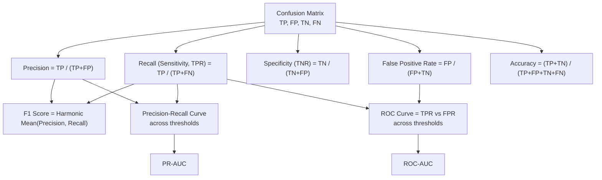
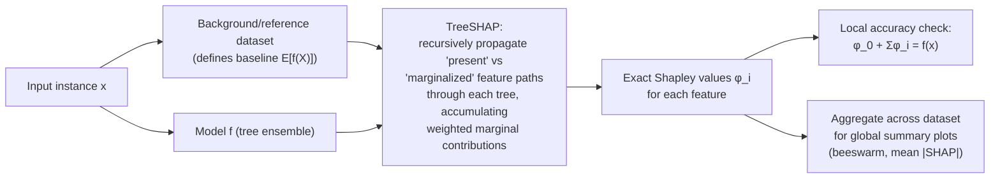

# Model Evaluation & Feature Engineering

This file covers how to measure whether a model is actually good (classification and regression metrics, calibration, cross-validation — including the time-series pitfalls that trip up even experienced practitioners), how to handle imbalanced data, how to engineer features properly, and — in depth, given production experience with it — how SHAP and other explainability tools actually work under the hood. It is written to be fully self-contained: formulas are shown in full, not referenced from elsewhere.

## Table of Contents

1. [Classification Metrics](#1-classification-metrics)
2. [Regression Metrics](#2-regression-metrics)
3. [Calibration](#3-calibration)
4. [Cross-Validation](#4-cross-validation)
5. [Handling Imbalanced Datasets](#5-handling-imbalanced-datasets)
6. [Feature Engineering](#6-feature-engineering)
7. [Explainability — SHAP, LIME, Permutation Importance, PDP](#7-explainability--shap-lime-permutation-importance-pdp)
8. [Popular Questions — Full Answers](#8-popular-questions--full-answers)
9. [Quick Recall Sheet](#quick-recall-sheet)

---

## 1. Classification Metrics

### 1.1 The Confusion Matrix

Every binary classification metric is derived from four counts, obtained by comparing predicted labels to actual labels at a chosen decision threshold:

| | Predicted Positive | Predicted Negative |
|---|---|---|
| **Actual Positive** | True Positive (TP) | False Negative (FN) |
| **Actual Negative** | False Positive (FP) | True Negative (TN) |

- **TP** — correctly predicted positive (e.g., correctly flagged fraud).
- **FP** — Type I error — predicted positive but actually negative (false alarm).
- **FN** — Type II error — predicted negative but actually positive (missed detection).
- **TN** — correctly predicted negative.



### 1.2 Precision

$$
\text{Precision} = \frac{TP}{TP + FP}
$$

Interpretation: **of everything the model predicted positive, how many actually were positive.** High precision means few false alarms. Matters when the cost of a false positive is high (e.g., flagging a legitimate transaction as fraud and blocking a customer's card).

### 1.3 Recall (Sensitivity, True Positive Rate)

$$
\text{Recall} = \text{TPR} = \frac{TP}{TP + FN}
$$

Interpretation: **of everything that actually was positive, how many did the model find.** High recall means few misses. Matters when the cost of a false negative is high (e.g., failing to detect a tumor or missing actual fraud).

Precision and recall trade off against each other as you move the decision threshold: lowering the threshold to catch more positives (raising recall) inevitably lets in more false positives (lowering precision).

### 1.4 F1 Score

$$
F_1 = 2 \cdot \frac{\text{Precision} \cdot \text{Recall}}{\text{Precision} + \text{Recall}}
$$

This is the **harmonic mean** of precision and recall, not the arithmetic mean. Why harmonic mean specifically?

- The harmonic mean is dominated by the smaller of the two values. If precision = 1.0 and recall = 0.01, the arithmetic mean is 0.505 (looks decent), but the harmonic mean is ≈ 0.0198 (correctly reflects a nearly useless model).
- This makes F1 **penalize imbalance between precision and recall** — a model can't achieve a high F1 by being excellent at one and terrible at the other; it must be reasonably balanced on both.
- The general weighted version, $F_\beta$, lets you weight recall $\beta$ times as important as precision:

$$
F_\beta = (1+\beta^2) \cdot \frac{\text{Precision} \cdot \text{Recall}}{\beta^2 \cdot \text{Precision} + \text{Recall}}
$$

($\beta=2$ weights recall higher — used when missing positives is costlier; $\beta=0.5$ weights precision higher.)

### 1.5 ROC Curve and ROC-AUC

The **ROC curve** plots True Positive Rate (recall) against **False Positive Rate**:

$$
\text{FPR} = \frac{FP}{FP + TN}
$$

at every possible classification threshold, from 0 to 1. A point at (0,0) corresponds to a threshold so high nothing is predicted positive; (1,1) corresponds to a threshold so low everything is predicted positive. A perfect classifier hugs the top-left corner (TPR=1, FPR=0).

**ROC-AUC** (Area Under the ROC Curve) has a clean probabilistic interpretation:

> ROC-AUC is the probability that the model ranks a randomly chosen positive example higher than a randomly chosen negative example.

AUC = 0.5 is random guessing (diagonal line); AUC = 1.0 is perfect ranking; AUC is threshold-independent, which makes it useful for comparing models before committing to an operating threshold.

### 1.6 Precision-Recall Curve and PR-AUC

The **PR curve** plots precision against recall at varying thresholds. **PR-AUC** (also called Average Precision) summarizes this curve as a single number.

### 1.7 Why PR-AUC Is Preferred Over ROC-AUC for Imbalanced Data

This is one of the most commonly tested conceptual points in DS interviews. The key mechanism:

- FPR's denominator is $FP + TN$ — dominated by the (huge) negative class in an imbalanced problem. If negatives outnumber positives 1000:1, even a large *absolute* number of false positives (say, 500) barely moves FPR, because it's divided by a huge TN count. The ROC curve can therefore look deceptively good — hugging the top-left — even when the model is generating many false positives relative to the (small) number of true positives.
- Precision's denominator is $TP + FP$ — it does **not** involve TN at all. It directly measures how polluted the positive predictions are with false alarms, which is exactly what you care about when positives are rare (fraud, disease, churn, defect detection).
- Consequently, PR-AUC is **sensitive to minority-class performance** in a way ROC-AUC is not: a model that produces lots of false positives relative to true positives will show a clear precision drop on the PR curve even if the ROC-AUC still looks close to 1.0.
- Rule of thumb: **when the positive class is rare, use PR-AUC (and F1) as the primary metric; ROC-AUC alone is not trustworthy.**

| Metric | Formula | Sensitive to class imbalance? | Best used when |
|---|---|---|---|
| Accuracy | $(TP+TN)/N$ | Very (misleading) | Balanced classes only |
| Precision | $TP/(TP+FP)$ | Yes (by design) | Cost of FP is high |
| Recall | $TP/(TP+FN)$ | Yes (by design) | Cost of FN is high |
| F1 | Harmonic mean(P, R) | Yes | Need single balanced metric |
| ROC-AUC | Area under TPR vs FPR | Can be deceptively high | Balanced classes / ranking quality |
| PR-AUC | Area under P vs R | Correctly reflects minority performance | Imbalanced classes, rare positive class |

**Interview angle:**

> **Q: Your model has ROC-AUC of 0.95 but the business says it's not catching fraud well. What's going on?**
> A: This is a classic imbalanced-data trap. With, say, 0.5% fraud rate, the negative class is so large that FPR stays tiny even when the raw count of false positives is large relative to the number of true positives — so the ROC curve looks excellent. I'd re-evaluate with PR-AUC and look at precision at the recall level the business actually needs (e.g., "what precision do we get at 80% recall?"). I'd also inspect the confusion matrix at the deployed threshold directly rather than trusting a threshold-independent aggregate metric.

> **Q: Why is F1 the harmonic mean rather than the average of precision and recall?**
> A: Because the harmonic mean punishes disparity between the two components — a model with precision 0.9 and recall 0.05 gets an arithmetic mean of ~0.48 but a harmonic mean of ~0.09, which is a far more honest signal that the model is close to useless despite one metric looking good. This forces both precision and recall to be jointly reasonable to score well.

---

## 2. Regression Metrics

### 2.1 RMSE (Root Mean Squared Error)

$$
\text{RMSE} = \sqrt{\frac{1}{n}\sum_{i=1}^{n} (y_i - \hat{y}_i)^2}
$$

Because errors are squared before averaging, RMSE **penalizes large errors disproportionately** — a single prediction off by 10 contributes 100x more to the sum than one off by 1. This makes RMSE sensitive to outliers: a handful of very bad predictions can dominate the metric even if most predictions are excellent. Same units as the target, which aids interpretability.

### 2.2 MAE (Mean Absolute Error)

$$
\text{MAE} = \frac{1}{n}\sum_{i=1}^{n} |y_i - \hat{y}_i|
$$

Treats every unit of error linearly and equally regardless of magnitude, so MAE is **robust to outliers** relative to RMSE — a few huge errors don't get squared into dominance. MAE is generally more interpretable as "typical error size." Always $\text{MAE} \leq \text{RMSE}$; the gap between them is itself diagnostic — a large RMSE/MAE gap signals the presence of a few large errors (outliers) rather than uniformly moderate error.

### 2.3 MAPE (Mean Absolute Percentage Error)

$$
\text{MAPE} = \frac{100\%}{n}\sum_{i=1}^{n} \left| \frac{y_i - \hat{y}_i}{y_i} \right|
$$

Expresses error as a percentage of actual value, which is appealing because it's scale-free and business-friendly ("we're off by 8% on average"). **Critical caveat (flagged here because it recurs heavily in time-series forecasting work):**

- **Undefined when $y_i = 0$**, and **explodes toward infinity as $y_i \to 0$** even when the absolute error is small. A forecast of 1 unit against an actual of 0.01 units produces a MAPE contribution of 9900%, even though the absolute miss is trivial.
- This makes MAPE dangerous for series with values near zero or with true zeros (e.g., intermittent demand, promotions dropping sales to near-zero periods).
- It's also **asymmetric**: it penalizes over-forecasting (predicting more than actual) more heavily than under-forecasting in percentage terms, because the denominator is always the actual, not the forecast. This can bias model selection toward systematically under-forecasting.
- Common mitigations: **sMAPE** (symmetric MAPE, dividing by the average of actual and predicted) or **WAPE/MAD-MAPE** (weighted APE, dividing the sum of absolute errors by the sum of actuals) which avoids the per-point division-by-zero issue entirely.

### 2.4 R² (Coefficient of Determination)

$$
R^2 = 1 - \frac{\sum_{i=1}^n (y_i - \hat{y}_i)^2}{\sum_{i=1}^n (y_i - \bar{y})^2} = 1 - \frac{SS_{res}}{SS_{tot}}
$$

Interpretation: **proportion of variance in the target explained by the model**, relative to a naive baseline that always predicts the mean. $R^2 = 1$ is a perfect fit; $R^2 = 0$ means the model is no better than predicting the mean; $R^2$ can go **negative** on held-out data if the model performs worse than that naive mean baseline (common with a badly overfit or misspecified model applied out-of-sample).

### 2.5 Adjusted R²

$$
R^2_{\text{adj}} = 1 - (1 - R^2)\cdot \frac{n - 1}{n - p - 1}
$$

where $n$ = number of observations, $p$ = number of predictors.

Plain $R^2$ is monotonically non-decreasing as you add more predictors — even a completely random, uninformative feature will not decrease (and by chance will slightly increase) $R^2$, because the optimizer can always find some infinitesimal signal to exploit in-sample. This makes $R^2$ unsuitable for comparing models with different numbers of features. Adjusted $R^2$ **penalizes additional predictors** via the $(n-1)/(n-p-1)$ correction factor — it only increases if a new predictor improves fit by more than would be expected by chance, so it can decrease when you add a useless feature.

### 2.6 Regression Metrics Comparison Table

| Metric | Formula | Sensitivity to outliers | Interpretability | Key caveat |
|---|---|---|---|---|
| RMSE | $\sqrt{\frac{1}{n}\sum(y-\hat y)^2}$ | High (squares errors) | Same units as target | Dominated by a few large errors |
| MAE | $\frac{1}{n}\sum \lvert y-\hat y\rvert$ | Low | Same units, "typical error" | Doesn't flag presence of outliers |
| MAPE | $\frac{100}{n}\sum \lvert\frac{y-\hat y}{y}\rvert$ | Moderate | Scale-free %, business-friendly | Undefined/explodes near $y=0$; asymmetric |
| R² | $1 - SS_{res}/SS_{tot}$ | Inherits RMSE's sensitivity | Unitless, 0-1 (usually) | Always non-decreasing with more features |
| Adjusted R² | $1-(1-R^2)\frac{n-1}{n-p-1}$ | Same as R² | Unitless, comparable across model sizes | Only valid for comparing models on same data/target |

**Interview angle:**

> **Q: Why would you ever prefer MAE over RMSE, or vice versa?**
> A: If the cost of large errors grows non-linearly (e.g., a forecast miss of 50 units is far worse operationally than 10x a miss of 5 units), RMSE aligns the training objective with that cost structure since it squares errors. If I want a metric that isn't dominated by a few extreme outliers — for instance if the data has occasional bad sensor readings — I'd report MAE, or both, since a large RMSE-to-MAE gap itself tells me outliers are present.

> **Q: Why can adjusted R² decrease when plain R² increases?**
> A: Plain R² only measures in-sample variance explained and never penalizes for the additional degree of freedom used by a new predictor — by construction, adding any column (even noise) can't make in-sample SSE worse under OLS. Adjusted R² multiplies the residual-variance ratio by $(n-1)/(n-p-1)$, a term that grows as $p$ grows, which offsets small/no genuine improvements in fit — so a near-useless added feature causes adjusted R² to drop even as R² ticks up slightly.

---

## 3. Calibration

A model is **calibrated** when its predicted probabilities match empirical, observed frequencies: among all instances the model assigns a predicted probability of 0.7, roughly 70% should actually be positive. A model can have excellent discriminative power (high AUC — it ranks positives above negatives correctly) while being poorly calibrated (its actual probability *values* are systematically off), and vice versa (rarely, but conceptually possible).

### 3.1 Why Tree Ensembles and Boosted Models Are Often Poorly Calibrated

- Bagged trees (random forests) tend to produce probability estimates that are **pushed toward 0.5** (under-confident) because averaging many trees' near-binary leaf predictions smooths out extremes.
- Boosted trees (GBM/XGBoost/LightGBM) optimizing log-loss can be reasonably calibrated, but those optimizing other losses (or with strong regularization, class weighting, or heavy imbalance correction) often produce probabilities that are **overconfident** (pushed toward 0 and 1), because the loss surface rewards separating classes more than matching the true underlying frequency.
- Any resampling for class imbalance (SMOTE, class weights, undersampling) *deliberately distorts* the class prior the model sees during training, so its output probabilities no longer reflect the true population base rate unless explicitly recalibrated afterward.
- Consequence: if downstream business logic uses the *raw probability itself* (e.g., "if predicted probability of default > 0.3, price the loan at X%"), an uncalibrated model will misprice systematically even if its ranking/AUC is fine.

### 3.2 Platt Scaling

Fits a **logistic regression on top of the model's raw scores** (or logits), typically on a held-out calibration set:

$$
P(y=1 \mid s) = \frac{1}{1 + e^{-(As + B)}}
$$

where $s$ is the model's raw score/logit and $A, B$ are the two parameters fit by maximum likelihood on true labels.

- **Parametric**: assumes a sigmoid-shaped miscalibration, which is a strong but often reasonable assumption for margin-based/boosted classifiers.
- Works well with **small calibration datasets** since only 2 parameters need to be estimated.
- Can underfit if the true miscalibration curve isn't sigmoidal.

### 3.3 Isotonic Regression

Fits a **non-parametric, monotonically non-decreasing step function** mapping raw scores to calibrated probabilities, using pool-adjacent-violators (PAV) algorithm to find the best-fitting monotonic function under squared-error loss.

- **Non-parametric / more flexible**: can correct any monotonic-preserving miscalibration shape, not just a sigmoid.
- **Needs more data** to fit reliably — with a small calibration set it can badly overfit, producing a jagged step function that memorizes calibration-set noise.
- Preserves rank-ordering (monotonic), so it never hurts AUC/ranking, only recalibrates the probability values.

| Method | Form | Data requirement | Flexibility | Overfitting risk |
|---|---|---|---|---|
| Platt scaling | Sigmoid (2 params) | Works with small calibration sets | Low (assumes sigmoid shape) | Low |
| Isotonic regression | Non-parametric monotonic step function | Needs larger calibration sets | High (any monotonic shape) | Higher, especially with small n |

**Interview angle:**

> **Q: Your fraud model has AUC 0.93 but the risk team says the probability outputs "don't mean anything." What would you do?**
> A: AUC only measures ranking quality, not calibration. I'd first plot a reliability diagram (predicted probability bucket vs observed positive rate) to confirm miscalibration. Since I likely trained with class weighting or SMOTE to handle imbalance, the raw probabilities are distorted relative to the true base rate — that's the expected root cause. I'd hold out a calibration set (not used in training) and fit either Platt scaling (if I suspect a smooth sigmoidal shift and have limited calibration data) or isotonic regression (if I have enough calibration data and suspect a non-sigmoidal miscalibration pattern), then re-validate with a reliability diagram and Brier score.

---

## 4. Cross-Validation

### 4.1 K-Fold Cross-Validation

Procedure: split the dataset into $k$ equal-sized folds; for each of the $k$ iterations, train on $k-1$ folds and validate on the held-out fold; average the $k$ validation scores.

- **Typical $k$**: 5 or 10.
- **Bias-variance tradeoff in choosing $k$**:
  - Small $k$ (e.g., $k=2$ or 3): each training fold is a smaller fraction of the data → the trained model is more different from the "true" full-data model → **higher bias** in the error estimate (tends to overestimate error), but the $k$ estimates are less correlated with each other → **lower variance** in the overall CV estimate, and it's computationally cheap.
  - Large $k$ (approaching LOOCV): each training fold nearly equals the full dataset → **low bias** (each trained model closely resembles the full-data model), but the $k$ training sets overlap heavily with each other → validation errors are highly correlated across folds → **higher variance** in the aggregate estimate, and expensive to compute.
  - $k=5$ or $10$ is the standard compromise found empirically to balance both.

### 4.2 Stratified K-Fold

Same as k-fold, but **each fold preserves the overall class proportion** of the target variable. Essential for imbalanced classification: with plain random k-fold on a 2%-positive dataset, an unlucky fold split could leave a training or validation fold with very few (or zero) positive examples, making metrics for that fold meaningless/noisy. Stratification ensures every fold has representative positive/negative ratios, giving stable, comparable per-fold metrics.

### 4.3 Leave-One-Out Cross-Validation (LOOCV)

The extreme case of k-fold where $k = n$ (number of observations): train on all but one observation, validate on that single held-out point, repeat $n$ times.

- **Exhaustive** — uses every data point for validation exactly once.
- **Low bias**: each of the $n$ models is trained on almost the entire dataset, so the average error is a near-unbiased estimate of the true test error of a model trained on the full dataset.
- **High variance**: the $n$ training sets are nearly identical to each other (differ by one point), so the $n$ resulting models — and their errors — are highly correlated; the aggregate estimate can swing a lot depending on which few points are "hard."
- **Expensive**: requires training $n$ separate models, infeasible for large $n$ or costly models (though for some linear models there are closed-form shortcuts).

| CV Strategy | Folds/Iterations | Bias | Variance | Cost | Notes |
|---|---|---|---|---|---|
| K-Fold (k=5/10) | k | Moderate | Moderate | Moderate | Standard default |
| Stratified K-Fold | k | Moderate | Moderate (lower than plain for imbalanced data) | Moderate | Required for imbalanced classification |
| LOOCV | n | Low | High | Very high | Near-unbiased but expensive & high-variance |
| Walk-forward (time series) | varies | Depends on window | Lower than naive k-fold *because it's actually valid* | Moderate–high | Required for any temporally ordered data |

### 4.4 Why Standard K-Fold Is Invalid for Time Series

This deserves the deepest treatment of the CV section given a forecasting background, since it's a very common interview probe.

Two independent, compounding problems:

1. **Temporal leakage / causality violation.** Standard k-fold shuffles (or at least splits without respecting order) the dataset into folds, so a model can end up **training on data from time $t+100$ while being validated on time $t$**. In deployment, you will never have future data available to predict the past — you only ever have data up to "now" to predict what comes next. A model validated this way gets an artificially optimistic score because it effectively "peeked into the future," e.g., if there's a regime shift or a feature that encodes future information (like a lagged rolling mean computed using centered windows), the leakage inflates validation performance in a way that will not replicate in production.

2. **Autocorrelation breaks the i.i.d. assumption that folds are independent.** K-fold's validity relies on each held-out fold being an independent, exchangeable sample from the same distribution as the training data — if that holds, the average across folds is a good estimate of generalization error. But time-series observations are autocorrelated: $y_t$ is statistically dependent on $y_{t-1}, y_{t-2}, \dots$. If a training fold contains $t=5$ and the validation fold contains $t=6$, the model can "cheat" by exploiting the near-identical, highly correlated neighboring observation, again yielding overly optimistic validation error. Even without direct future leakage, adjacent-in-time points contaminate each other's independence, breaking the statistical basis for k-fold averaging.

The correct approach is **walk-forward validation** (also called rolling-origin or out-of-time validation), which always trains only on the past relative to the validation window.

### 4.5 Walk-Forward Validation: Expanding Window vs Sliding Window

- **Expanding window**: the training set start is fixed, and its end grows with each fold — each successive fold adds the previously-validated period into the training set and moves the validation window forward. Training set only ever grows.
- **Sliding (rolling) window**: both the start and end of the training window move forward together, keeping training set size roughly constant — useful when older data is believed to be less relevant (e.g., due to concept drift) and you want the model to always train on a fixed-length "recent" window.

```
Expanding-window walk-forward CV (time flows left to right)

Fold 1: [ Train ─────── ][ Val ]
Fold 2: [ Train ───────────── ][ Val ]
Fold 3: [ Train ───────────────────── ][ Val ]
Fold 4: [ Train ───────────────────────────── ][ Val ]
                                                        → time
```



```mermaid
gantt
    title Walk-Forward (Expanding Window) Cross-Validation
    dateFormat  X
    axisFormat %s
    section Fold 1
    Train :done, f1t, 0, 10
    Validate :active, f1v, 10, 12
    section Fold 2
    Train :done, f2t, 0, 12
    Validate :active, f2v, 12, 14
    section Fold 3
    Train :done, f3t, 0, 14
    Validate :active, f3v, 14, 16
    section Fold 4
    Train :done, f4t, 0, 16
    Validate :active, f4v, 16, 18
```

Additional practical details:
- A **gap/embargo period** is often inserted between train and validation windows when features involve rolling windows or lagged aggregations, to prevent subtle leakage where a feature computed near the train/val boundary uses information that bleeds slightly across it.
- Metrics are usually averaged across folds just like k-fold, but each fold's validation window should be evaluated **in chronological order**, and it's common to report per-fold metrics to check performance stability over time (e.g., is error growing in later folds, suggesting concept drift the model doesn't adapt to?).
- Nested versions exist for hyperparameter tuning: an outer walk-forward loop for unbiased performance estimation, with an inner walk-forward loop (on the training portion only) for hyperparameter selection — avoiding tuning-induced leakage into the outer validation fold.

**Interview angle:**

> **Q: A colleague used standard 5-fold CV to validate a demand-forecasting model and reported 96% accuracy in backtest, but production performance is much worse. What went wrong and how would you fix it?**
> A: Standard k-fold shuffles data across time, so folds almost certainly trained on future periods to predict past ones — direct temporal leakage — and even where it didn't leak outright, adjacent time points are autocorrelated so folds aren't independent, which the k-fold averaging assumption requires. Both effects inflate the backtest score. I'd redo validation with walk-forward (expanding-window) CV: for each fold, train strictly on data up to time $T$ and validate on $T+1 \dots T+h$, moving the origin forward each fold, with an embargo gap if any engineered features use rolling windows near the boundary. I'd also check per-fold metrics over time to catch concept drift rather than reporting one averaged number.

> **Q: When would you use a sliding window instead of an expanding window for walk-forward validation?**
> A: When I have reason to believe older data is less representative of current dynamics — e.g., after a business process change, a market regime shift, or when the relationship between features and target drifts (concept drift) — a fixed-size sliding window keeps the training set "fresh" and prevents stale patterns from diluting the model. Expanding window is preferable when more historical data reliably improves the model and the underlying process is fairly stationary.

---

## 5. Handling Imbalanced Datasets

### 5.1 Why Accuracy Is Misleading

If 99% of transactions are legitimate, a trivial model that always predicts "legitimate" achieves 99% accuracy while catching zero fraud. Accuracy weights majority-class correctness so heavily that it can be maximized while being completely useless on the class that actually matters. This is the canonical justification for using precision/recall/F1/PR-AUC instead (tie-back to Section 1).

### 5.2 SMOTE (Synthetic Minority Oversampling Technique)

Rather than duplicating minority-class rows (which risks overfitting to exact repeated points), SMOTE **synthesizes new minority-class examples by interpolation**:

1. For each minority-class sample $x_i$, find its $k$ nearest minority-class neighbors (in feature space, typically Euclidean distance).
2. Randomly select one neighbor $x_{nn}$ from those $k$ neighbors.
3. Generate a synthetic point along the line segment connecting them:
   $$
   x_{\text{new}} = x_i + \lambda \cdot (x_{nn} - x_i), \quad \lambda \sim \text{Uniform}(0,1)
   $$
4. Repeat until the desired minority:majority ratio is reached.

This creates plausible new minority points inside the convex hull of existing minority points, rather than exact duplicates — reducing (but not eliminating) overfitting risk relative to naive oversampling. Caveats: SMOTE can generate noisy synthetic points in regions where minority and majority classes overlap, and doesn't work naturally on raw categorical features (variants like SMOTENC handle mixed types).

### 5.3 Class Weighting

Instead of resampling the data, **modify the loss function** so misclassifying a minority-class example is penalized more heavily than misclassifying a majority-class example:

$$
\mathcal{L} = \sum_i w_{y_i} \cdot \ell(y_i, \hat y_i)
$$

with a common default (`class_weight='balanced'` in scikit-learn) being:

$$
w_c = \frac{n_{\text{samples}}}{n_{\text{classes}} \times n_c}
$$

i.e., inversely proportional to class frequency. This changes the model's optimization objective directly without altering the data distribution the model observes, and doesn't require synthesizing or discarding any data — but note it means predicted probabilities are trained under a different effective prior, requiring recalibration (Section 3) if raw probability values matter downstream.

### 5.4 Random Undersampling vs Oversampling

| Approach | Mechanism | Pros | Cons |
|---|---|---|---|
| Random undersampling | Randomly drop majority-class rows until balanced | Fast, reduces training time/memory, no synthetic data | **Information loss** — discards potentially useful majority-class examples, can hurt performance if majority class is diverse |
| Random oversampling | Randomly duplicate minority-class rows | No information loss | **Overfitting risk** — exact duplicates make the model memorize specific minority points |
| SMOTE | Synthesize interpolated minority points | Less overfitting than naive duplication | Can create noisy points in overlapping regions; ill-defined near class boundaries |
| Class weighting | Reweight loss function | No data modification, no information loss | Doesn't add diversity to minority signal; may still need recalibration |

Combined approaches (e.g., SMOTE + undersampling majority, or SMOTE + Tomek links/ENN cleaning) are common in practice.

### 5.5 Choosing the Right Metric

As covered in Section 1: prefer **PR-AUC**, **F1** (or $F_\beta$ weighted toward recall if misses are costlier), **balanced accuracy** ($\frac{1}{2}(\text{TPR} + \text{TNR})$, which equally weights both classes regardless of their size), and **cost-sensitive metrics** that directly encode the real-world asymmetric cost of FP vs FN (e.g., expected monetary loss) when available. Never rely on plain accuracy as the primary metric for meaningfully imbalanced problems.

**Interview angle:**

> **Q: How does SMOTE differ from just duplicating minority-class samples, and what's still risky about it?**
> A: Duplication creates literally identical rows, so a flexible model can memorize them, which particularly hurts nearest-neighbor-style or high-variance models (barely helps trees prone to exact-match splits). SMOTE synthesizes new points by interpolating between a minority sample and one of its k-nearest minority neighbors, so the generated points are novel but stay within the local minority manifold — this reduces (not eliminates) overfitting since the model sees varied, not literally repeated, samples. The residual risk is that in regions where the minority and majority classes overlap in feature space, interpolated points can land inside majority territory, effectively adding noisy/mislabeled-looking points near the decision boundary.

---

## 6. Feature Engineering

### 6.1 Categorical Encoding

| Encoding | Mechanism | When to use | Key risk |
|---|---|---|---|
| One-hot | Binary column per category | Low-cardinality nominal categories | Curse of dimensionality with high cardinality (hundreds/thousands of sparse columns); memory/compute blow-up, especially painful for linear models and distance-based methods |
| Ordinal | Map categories to integers respecting order | Categories with a genuine natural order (e.g., low/medium/high, education level) | Using it on unordered categories imposes a fake numeric ordering/distance the model will wrongly exploit |
| Target encoding | Replace category with mean of target for that category | High-cardinality categoricals where one-hot is impractical (e.g., zip code, product ID) | **Leakage**: using a category's own target values to encode it (including that very row) leaks the label into the feature, inflating training performance and failing on unseen data. Mitigate with **smoothing** (blend category mean with global mean, weighted by category frequency) and **out-of-fold encoding** (compute each row's encoded value using only target values from *other* folds/rows, e.g. within a CV loop, so no row's own label ever contributes to its own feature value) |
| Frequency encoding | Replace category with its occurrence count/frequency in the data | High-cardinality categoricals, especially when frequency itself carries signal (e.g., rare categories behaving differently) | Two different categories with the same frequency become indistinguishable to the model |

Target encoding smoothing formula (Bayesian shrinkage toward the global mean):

$$
\text{TE}(c) = \frac{n_c \cdot \bar{y}_c + m \cdot \bar{y}_{\text{global}}}{n_c + m}
$$

where $n_c$ is the count of category $c$, $\bar y_c$ its raw target mean, $\bar y_{\text{global}}$ the overall target mean, and $m$ a smoothing hyperparameter (larger $m$ shrinks rare categories harder toward the global mean, reducing variance/overfitting for low-frequency categories).

### 6.2 Scaling: Standardization vs Normalization

**Standardization (Z-score):**
$$
x' = \frac{x - \mu}{\sigma}
$$
Centers data at mean 0, std 1. Does not bound the range. Preferred when data may be roughly Gaussian or when using models sensitive to variance (PCA, linear/logistic regression, SVM, k-means, neural networks with typical initializations).

**Normalization (Min-Max scaling):**
$$
x' = \frac{x - x_{\min}}{x_{\max} - x_{\min}}
$$
Bounds data to $[0,1]$. Sensitive to outliers (a single extreme value compresses the rest of the range). Useful when a bounded range is required (e.g., image pixel values, some neural net activation ranges).

**When scaling matters:**
- **Distance-based models** (KNN, K-Means, SVM with RBF kernel): unscaled features with larger numeric ranges dominate the distance calculation regardless of true importance — scaling is essential.
- **Gradient-based models** (linear/logistic regression via gradient descent, neural networks): unscaled features cause uneven, elongated loss surfaces, slowing or destabilizing convergence — scaling is essential.
- **Tree-based models** (decision trees, random forests, gradient boosting): **scale-invariant** — splits are chosen based on threshold comparisons per feature independently (e.g., "is $x_3 > 5.2$?"), so monotonic transformations of a single feature don't change the tree structure at all. Scaling is unnecessary for trees (though it doesn't hurt correctness, it's wasted effort).

### 6.3 Interaction Terms

Manually creating products (e.g., $x_1 \times x_2$) or ratios (e.g., $x_1 / x_2$, such as debt-to-income) to capture **non-additive effects** the model would otherwise be unable to represent as a simple linear combination.

- **Linear models** (linear/logistic regression) can only represent additive effects of the raw features fed to them — if the true relationship is that $x_1$'s effect on $y$ depends on the value of $x_2$ (a genuine interaction), the model needs the explicit interaction term $x_1 \times x_2$ as an input feature to capture it at all.
- **Tree-based models** can learn interactions implicitly and automatically, because a tree's splits can condition on one feature at a given node and a different feature at the next — effectively partitioning the space in a way that captures conditional (interaction) effects without being told to. Deep enough trees / enough boosting rounds can approximate arbitrary interactions.
- Even so, explicitly engineering a known, domain-meaningful ratio/product (e.g., price-per-square-foot, BMI-like ratios) can still help tree models by making the signal available directly at a single split rather than requiring several splits to approximate it — improving sample efficiency and interpretability even when not strictly necessary for expressiveness.

### 6.4 Missing Data Imputation Strategies

| Strategy | Mechanism | Best for | Caveat |
|---|---|---|---|
| Mean/median imputation | Fill with column mean (numeric, symmetric) or median (numeric, skewed/outlier-prone) | Numeric features, MCAR/MAR data | Shrinks variance, distorts correlations, ignores relationships between features |
| Mode imputation | Fill with most frequent category | Categorical features | Can over-represent the majority category |
| Forward/backward fill | Carry last (or next) observed value forward (or backward) | Time series with slowly changing values | Assumes local persistence; wrong if the series is genuinely missing due to a meaningful gap (e.g., sensor outage during a spike) |
| KNN imputer | Impute using the average of the $k$ nearest neighbors' values (in feature space using non-missing features) | Numeric data with informative feature correlations | Computationally expensive on large data; sensitive to feature scaling |
| Iterative / MICE (Multiple Imputation by Chained Equations) | Model each feature with missing values as a function of all other features, iterating round-robin until convergence | Multivariate data with complex inter-feature dependencies | More computationally expensive; can propagate model misspecification across iterations |

**Always create a `was_missing` indicator flag** (a binary column marking whether a value was originally missing) alongside any imputation. This preserves the "missingness signal" itself, which is very often informative — e.g., in surveys, high earners disproportionately skip income questions, so "income was missing" independently predicts something about the respondent even after imputing a placeholder value. Imputation alone discards this signal; the indicator flag lets a model use it.

### 6.5 Outlier Detection and Treatment

**Detection:**
- **IQR rule**: flag points outside $[Q_1 - 1.5 \cdot IQR,\ Q_3 + 1.5 \cdot IQR]$ where $IQR = Q_3 - Q_1$. Robust, distribution-free, standard for univariate screening.
- **Z-score threshold**: flag points where $|z| = \left|\frac{x-\mu}{\sigma}\right| > 3$ (or another chosen threshold). Assumes roughly normal data; itself sensitive to the outliers it's trying to detect (mean/std are outlier-sensitive), so often paired with robust variants using median/MAD instead.
- **Isolation Forest**: an ensemble method that isolates points via random recursive partitioning — outliers, being "few and different," tend to be isolated in fewer splits (shorter average path length across trees) than normal points. Works well in multivariate settings where simple univariate rules miss outliers that are only anomalous in combination of features.

**Treatment:**
- **Removal**: drop outlier rows entirely — appropriate when they're clearly data-entry errors or irrelevant to the modeling goal, risky if they're genuine rare-but-important events.
- **Capping / winsorizing**: clip values beyond a percentile threshold (e.g., cap at the 1st/99th percentile) rather than deleting the row, preserving sample size while limiting leverage.
- **Transformation**: apply log or Box-Cox transforms to compress the right tail and reduce the influence of extreme values without discarding data — particularly effective for right-skewed, strictly-positive variables (income, prices, counts).

**Interview angle:**

> **Q: You're target-encoding a high-cardinality "merchant ID" feature for a fraud model. What can go wrong, and how do you prevent it?**
> A: If I compute each merchant's target-encoded value using its own row's label as part of the mean, that row leaks its own answer into its feature — training performance looks artificially great, and it collapses on truly unseen data. I'd use out-of-fold encoding: within each CV fold, compute merchant means only from the *other* folds' data, so no row ever sees its own label baked into its feature. I'd also apply smoothing toward the global mean, weighted by the merchant's sample count, so rare merchants with only 1-2 transactions don't get an extreme, noisy encoded value.

> **Q: Do you need to scale features before training a gradient boosting model?**
> A: No — tree-based models split on threshold comparisons per feature independently, so any monotonic transformation of a feature (scaling, log, standardizing) doesn't change which splits are chosen or the resulting tree structure. Scaling matters for distance-based methods (KNN, k-means, SVM) and gradient-based linear models/neural nets where feature magnitude directly affects the loss surface geometry and convergence, but it's unnecessary — though harmless — for trees/GBMs.

---

## 7. Explainability — SHAP, LIME, Permutation Importance, PDP

### 7.1 SHAP: Foundations in Cooperative Game Theory

SHAP (SHapley Additive exPlanations) treats a prediction as the outcome of a cooperative game in which the **features are "players"** who cooperate to produce the model's output, and asks: how should the total "payout" (the model's prediction) be **fairly divided** among the features?

This is exactly the question the Shapley value (Lloyd Shapley, 1953, game theory) answers. SHAP applies it to ML models, treating a "coalition" $S$ of features as the subset currently "present," and $f(S)$ as the model's expected output when only the features in $S$ are known (others are marginalized out / set to a baseline).

### 7.2 The Shapley Value Formula, Fully Derived

For feature $i$, with $F$ the full set of all features:

$$
\phi_i = \sum_{S \subseteq F \setminus \{i\}} \frac{|S|!\,(|F| - |S| - 1)!}{|F|!} \Big[ f(S \cup \{i\}) - f(S) \Big]
$$

Breaking down every term:

- $S \subseteq F \setminus \{i\}$ — sum over **every possible subset of features that does not contain feature $i$**, i.e., every possible "coalition" feature $i$ could join.
- $f(S \cup \{i\}) - f(S)$ — the **marginal contribution** of adding feature $i$ to coalition $S$: how much does the model's output change when feature $i$ joins that specific subset of already-present features?
- $|S|!\,(|F|-|S|-1)!/|F|!$ — the **weighting term**. This is the probability of that particular subset $S$ arising if you consider all $|F|!$ possible random orderings in which features could be revealed one at a time: $|S|!$ ways to order the features already in $S$ before feature $i$ arrives, times $(|F|-|S|-1)!$ ways to order the remaining features after $i$, divided by the total $|F|!$ orderings. This exact weighting ensures the formula is equivalent to: **average feature $i$'s marginal contribution across every possible ordering (permutation) in which features could be added one-by-one**, not just every subset — subsets of a given size are weighted so that overall, all $|F|!$ orderings are equally likely.
- $\phi_i$ — the final Shapley value for feature $i$: the fair, order-averaged marginal contribution of that feature to the prediction.

Equivalently and more intuitively: imagine revealing features to the model in a **uniformly random order**; every time feature $i$ is revealed, record how much the prediction changed at that moment (its marginal contribution given whatever features were already revealed before it in that ordering). Average that marginal contribution over **all possible orderings** of all features — that average is $\phi_i$.

### 7.3 The Three Axiomatic Guarantees

SHAP is uniquely determined (it is the *only* additive feature-attribution method) by requiring these properties simultaneously — this is why SHAP is theoretically grounded rather than ad hoc:

1. **Local accuracy (efficiency)**: the sum of all feature attributions plus the baseline (expected model output) exactly equals the model's actual output for that specific prediction:
   $$
   f(x) = \phi_0 + \sum_{i=1}^{|F|} \phi_i
   $$
   where $\phi_0 = E[f(X)]$ is the baseline (average model output over the background/reference dataset). Nothing is left unaccounted for and nothing is double-counted.

2. **Consistency (monotonicity)**: if a model changes such that a feature's marginal contribution increases (or stays the same) for every possible coalition, that feature's Shapley value cannot decrease. This guarantees that comparing feature importance *across models* is meaningful — a feature genuinely more important in model B than model A will never receive a lower attribution in B.

3. **Missingness**: a feature that has no effect on the model's output for a given input regardless of coalition (i.e., $f(S \cup \{i\}) = f(S)$ for all $S$) receives a Shapley value of exactly zero. Features that don't affect the model in a given prediction path get no credit or blame.

These three axioms together are what distinguish SHAP from heuristic attribution schemes: no other additive attribution method satisfies all three simultaneously (this is a proven uniqueness result from cooperative game theory), which is the rigorous justification for preferring SHAP over ad hoc importance measures.

### 7.4 TreeSHAP: Making Exact Shapley Values Tractable

The brute-force Shapley formula requires evaluating $f(S)$ for every one of the $2^{|F|}$ possible subsets — **exponential** in the number of features, intractable beyond a handful of features.

**TreeSHAP** exploits the recursive structure of decision trees to compute *exact* Shapley values in **polynomial time** (specifically $O(TLD^2)$ for $T$ trees, $L$ leaves, $D$ max depth — versus exponential brute force), at a conceptual level:

- Instead of literally evaluating the model on every subset of "present" vs "absent" features, TreeSHAP tracks, for every possible path through the tree, the **proportion of training data (or a background dataset) that would follow that path** conditioned on which features are considered "known" (in $S$) versus "unknown" (marginalized out).
- It does this by recursively pushing a weighted combination of "what if this feature's split outcome is followed" and "what if it's marginalized by the background distribution's split proportions" down through the tree simultaneously, accumulating the correct combinatorial weights ($|S|!(|F|-|S|-1)!/|F|!$) along the way using a clever bookkeeping of path multiplicities.
- The tree's branching structure means most subsets' contributions can be aggregated implicitly by tracking a small set of running sums per node rather than literally enumerating all $2^{|F|}$ subsets — the recursive tree structure collapses the combinatorial explosion into a computation proportional to the number of leaves and depth.
- Result: **exact** Shapley values (not an approximation) for tree ensembles (random forests, GBM, XGBoost, LightGBM, CatBoost) in time that's practical even for models with hundreds of features and thousands of trees, which is precisely why SHAP became the production-viable standard for tree-based models specifically.
- For non-tree models (neural nets, arbitrary black boxes), **KernelSHAP** approximates Shapley values via a specially weighted local linear regression (conceptually related to LIME but with weights derived to satisfy the Shapley axioms), trading exactness for model-agnosticism.



### 7.5 SHAP vs Plain Tree Feature Importance (Gain / Split-Count)

| Aspect | Gain / split-count importance | SHAP |
|---|---|---|
| Scope | Global only (one importance value per feature, for the whole model) | Both **local** (per-prediction) and global (aggregated across predictions) |
| Bias toward high-cardinality features | Yes — features with more possible split points get more chances to be selected and show inflated "gain," even if not truly more predictive | No — mathematically corrected via the combinatorial weighting over all coalitions, not tied to how often a feature is used to split |
| Theoretical guarantees | None — heuristic, no fairness/consistency axioms | Local accuracy, consistency, missingness — provably unique, fair attribution |
| Per-prediction explanation | Not possible | Yes — exactly explains why *this specific instance* got *this specific prediction* |
| Consistency across models | Not guaranteed — a feature's "gain" ranking can behave inconsistently as the model changes | Guaranteed by the consistency axiom |
| Computation | Essentially free (byproduct of training) | More expensive, but tractable in polynomial time via TreeSHAP for tree models |

This comparison is the crux of why SHAP is preferred in production explainability work: gain-based importance answers "which features did the model use a lot," which can be misleading (e.g., a high-cardinality ID-like feature might rack up "gain" from spurious splits), while SHAP answers "how much did each feature actually move this specific prediction away from baseline, in a way that's provably fair and consistent."

### 7.6 LIME (Local Interpretable Model-agnostic Explanations)

LIME explains a single prediction by:
1. Generating perturbed samples around the instance of interest (e.g., randomly toggling/masking features, or sampling nearby points).
2. Getting the black-box model's predictions on those perturbed samples.
3. Fitting a **simple, interpretable surrogate model** (typically a weighted linear regression, weighted so perturbed samples closer to the original instance count more) on those (perturbed input, model output) pairs.
4. Using the surrogate model's coefficients as the local explanation for the original instance.

**Contrast with SHAP:**
- LIME is a **heuristic, locally-approximate** method — it has no guarantee that the surrogate model's coefficients correspond to any theoretically "fair" attribution; results depend on the choice of perturbation distribution, kernel width (defining "local" neighborhood), and number of samples.
- LIME explanations can be **unstable across runs**: because perturbation sampling is stochastic, re-running LIME on the exact same instance can produce meaningfully different coefficients/explanations, especially with a small sample count or in high-dimensional feature space.
- SHAP is **theoretically grounded** in the uniqueness result of cooperative game theory (satisfies local accuracy, consistency, missingness simultaneously), and TreeSHAP produces deterministic, exact values for tree models rather than a stochastic local approximation.
- LIME can be faster and is straightforwardly model-agnostic (works identically on any black box, including images/text via superpixel/word-masking perturbations), which is a practical advantage in some settings — but the tradeoff is the lack of formal guarantees and run-to-run stability.

### 7.7 Permutation Importance

Procedure: for a fitted model and a held-out dataset, for each feature $j$: shuffle (permute) that feature's values across all rows (breaking its relationship with the target while preserving its marginal distribution and the joint structure of all other features), re-score the model, and measure the **drop in performance** (e.g., increase in error or decrease in accuracy/AUC) versus the unshuffled baseline. Repeat for each feature independently (and ideally average over multiple random shuffles for stability).

- **Model-agnostic** — works on any model, not just trees.
- Naturally reflects a feature's actual contribution to *predictive performance* (not just how often it was split on), and — unlike naive impurity/gain importance — is computed on held-out data, so it better reflects real generalization contribution rather than in-sample overfitting to a feature.
- **Accounts for interactions** better than univariate impurity importance because performance drop reflects the feature's role within the full model, including any interaction effects it participates in.
- **Downsides**: computationally more expensive (requires re-scoring the model once per feature, times number of repeats). **Misleading under correlated features** — if two features are highly correlated, shuffling just one of them barely hurts performance because the model can still get equivalent information from its correlated partner, so both features can appear artificially unimportant even though the pair jointly matters a lot (or, depending on model behavior, one may seem to fully substitute for the other in a way that misrepresents standalone importance).

### 7.8 Partial Dependence Plots (PDP) and ICE

**PDP** shows the marginal effect of one (or two) features on the predicted outcome, by fixing that feature at a grid of values, and for each grid value, **averaging the model's prediction across all other feature values in the dataset** (holding those at their observed joint distribution, but varying only the feature of interest):

$$
\widehat{PD}_j(x_j) = \frac{1}{n}\sum_{i=1}^{n} f(x_j, x_{i,-j})
$$

where $x_{i,-j}$ denotes the observed values of all other features for row $i$.

- **Limitation — assumes feature independence.** By averaging over the observed joint distribution of the other features while forcing feature $j$ to an arbitrary grid value, PDP implicitly creates and evaluates combinations of features that may never occur together in reality (e.g., forcing "age=5" together with "years of work experience=20" for every row when computing the PDP for age) if features are correlated. When features are strongly correlated, PDP curves can reflect extrapolation into implausible/unobserved regions of feature space rather than genuine marginal effects.
- **ICE (Individual Conditional Expectation) plots** complement PDP by showing **one curve per individual instance** (how that specific row's prediction changes as feature $j$ varies, holding all its other features fixed at their actual observed values) rather than a single averaged curve. This reveals **heterogeneity** that PDP's averaging can hide — e.g., if the feature's effect is positive for half the population and negative for the other half, the PDP average might misleadingly show a flat line near zero, while ICE curves would reveal the two opposing groups directly.

**Interview angle:**

> **Q: How does SHAP work mathematically, and why is it better than feature importance from trees?**
> A: SHAP is built on the Shapley value from cooperative game theory: treat each feature as a "player" contributing to the "payout" (the model's prediction), and fairly divide that payout among features. Formally, $\phi_i = \sum_{S \subseteq F\setminus\{i\}} \frac{|S|!(|F|-|S|-1)!}{|F|!}[f(S\cup\{i\}) - f(S)]$ — for every possible subset of the other features, measure feature $i$'s marginal contribution when added to that subset, and average those marginal contributions across all possible orderings in which features could be revealed, using the combinatorial weight that makes every ordering equally likely. This guarantees three properties simultaneously: local accuracy (attributions sum exactly to the model's output minus the baseline), consistency (a feature's attribution can't decrease if its true marginal contribution increases or stays the same across a model change), and missingness (a feature with zero effect gets exactly zero attribution) — and it's provably the *only* additive attribution scheme satisfying all three. Plain gain/split-count importance from trees has none of these guarantees: it's biased toward high-cardinality features that simply get more opportunities to be split on, it only gives one global number per feature rather than an explanation for any individual prediction, and it isn't guaranteed to behave consistently as the model changes. Practically, exact Shapley values would need to evaluate $2^{|F|}$ feature subsets — TreeSHAP makes this tractable in polynomial time for tree ensembles by exploiting the tree's recursive structure to compute exact values without brute-force enumeration, which is what makes SHAP viable to run on every production prediction rather than just as an offline research exercise.

> **Q: When would you use permutation importance vs SHAP vs LIME?**
> A: I'd default to SHAP (TreeSHAP specifically, if using a tree ensemble) for both local, per-prediction explanations and reliable global importance summaries, since it's fast (polynomial time), exact, and axiomatically grounded — this is what I used in production because stakeholders needed to trust that "why did the model flag this specific case" answers were consistent and defensible. Permutation importance is a good sanity check for global importance on any model type (including non-trees), especially since it's computed on held-out data and reflects real performance contribution rather than training-time splits — but I'd watch for correlated features distorting it, and I wouldn't use it for per-instance explanations since it's fundamentally a global method. LIME I'd reserve for model-agnostic quick local explanations, e.g., on models where TreeSHAP/exact SHAP isn't available (like a deep learning model over unstructured data) and KernelSHAP is too slow — but I'd flag to stakeholders that LIME's explanations can vary run-to-run and lack SHAP's fairness guarantees.

---

## 8. Popular Questions — Full Answers

### "How does SHAP work mathematically, and why is it better than feature importance from trees?"

See the full derivation above (Sections 7.2–7.5). In short: SHAP computes each feature's Shapley value — its game-theoretically fair share of the difference between the model's prediction and the baseline expected output — by averaging its marginal contribution across every possible subset of other features, weighted so every feature ordering is equally likely:
$$
\phi_i = \sum_{S \subseteq F \setminus \{i\}} \frac{|S|!\,(|F|-|S|-1)!}{|F|!}\big[f(S\cup\{i\}) - f(S)\big]
$$
This guarantees local accuracy ($f(x) = \phi_0 + \sum_i \phi_i$), consistency, and missingness — properties no ad hoc importance measure satisfies. Gain/split-count importance is a byproduct of training with no fairness guarantees, is biased toward high-cardinality features, and provides only a single global number rather than per-prediction explanations. TreeSHAP makes computing exact Shapley values tractable (polynomial time) for tree ensembles by exploiting tree structure, avoiding the otherwise exponential brute-force cost, which is why SHAP is production-viable.

### "How do you handle a dataset with 90% class imbalance?"

A structured approach:

1. **Don't trust accuracy.** With 90% majority class, a trivial always-majority-class model scores 90% accuracy while being useless. Switch primary evaluation to **PR-AUC, F1 (or $F_\beta$), and balanced accuracy**, and inspect the confusion matrix at the actual deployed threshold.
2. **Diagnose whether the imbalance itself is the problem or just needs the right metric.** Sometimes just changing the evaluation metric and threshold (moving away from the default 0.5 cutoff, choosing a threshold that hits a target recall/precision tradeoff) is sufficient without touching the data or loss function at all.
3. **If the model still underperforms on the minority class**, apply one or a combination of:
   - **Class weighting** (`class_weight='balanced'` or custom weights) — cheapest, no data modification, good first attempt.
   - **SMOTE** (or SMOTE variants) to synthesize minority examples via interpolation between nearest minority neighbors, increasing minority representation without exact duplication.
   - **Random undersampling** of the majority class if it's large enough that discarding rows won't lose meaningful diversity (often combined with ensembling multiple undersampled subsets to avoid throwing away too much majority information at once, e.g., EasyEnsemble/BalancedBagging).
4. **Use stratified k-fold** (or stratified + walk-forward if temporal) during cross-validation so every fold retains representative minority-class examples — otherwise CV metrics become unstable/meaningless on a 90/10 split.
5. **Recalibrate probabilities** afterward (Platt scaling or isotonic regression) if class weighting/resampling was used and the raw probability values (not just rankings) need to be meaningful downstream, since resampling/weighting distorts the model's learned prior relative to the true population base rate.
6. **Align the metric/threshold choice with actual business cost** — e.g., if false negatives (missed fraud/disease) are far costlier than false positives, explicitly choose a threshold that favors recall, ideally by attaching real cost estimates to FP and FN and optimizing expected cost rather than an abstract statistical metric alone.

---

## Additional Common Interview Questions

These round out the topics above with questions that come up constantly in DS interviews but weren't yet given a full treatment elsewhere in this file.

**Q: How would you choose a decision threshold for a binary classifier beyond just using the default 0.5?**

The default 0.5 threshold is only sensible if the classes are balanced and the cost of a false positive equals the cost of a false negative — both assumptions are usually false in practice. There are several principled alternatives. First, if there's a genuine asymmetric cost (e.g., missing fraud costs $C_{FN}$, a false alarm costs $C_{FP}$), the Bayes-optimal decision rule under a calibrated model falls out of minimizing expected cost: predict positive when $C_{FN}\cdot p(x) > C_{FP}\cdot(1-p(x))$, i.e., when $p(x) > \frac{C_{FP}}{C_{FP}+C_{FN}}$. This directly ties the threshold to real business costs rather than an arbitrary 0.5. Second, if there's no clean cost figure but you want to balance sensitivity and specificity, **Youden's J statistic**, $J = \text{TPR} - \text{FPR}$, is maximized at the point on the ROC curve furthest from the diagonal — a reasonable default when errors are roughly symmetric in importance but you don't trust 0.5 specifically (e.g., under class imbalance the model's natural probability outputs are skewed away from 0.5 even for a "coin-flip" case). Third, and most common in practice, you pick an operating point off the precision-recall curve: decide a required recall (e.g., "we must catch at least 90% of fraud") and read off the threshold that achieves it, then check whether the resulting precision is tolerable, or vice versa if precision (review capacity) is the binding constraint — e.g., "we can only manually review 200 flagged transactions a day," which caps how low the threshold can go. Whichever method is used, the threshold must be selected on a validation set, never the test set, and should be periodically re-validated since the model's score distribution — and therefore the right cutoff for a given cost or capacity target — can drift over time even if the underlying ranking quality (AUC) stays stable.

**Q: What's the difference between macro, micro, and weighted averaging for multi-class precision/recall/F1?**

All three reduce a set of $K$ per-class binary (one-vs-rest) metrics to a single number, but they aggregate very differently. **Macro-averaging** computes the metric independently for each class and then takes an unweighted arithmetic mean: $\text{Macro-F1} = \frac{1}{K}\sum_{k=1}^K F1_k$. Because every class counts equally regardless of how many examples it has, macro-averaging is the right choice when you care about performance on rare classes just as much as common ones — a model that's excellent on 9 common classes but terrible on 1 rare class gets penalized heavily, which is exactly the point. **Micro-averaging** instead pools the raw TP, FP, FN counts across all classes first and computes the metric once on the aggregated totals: $\text{Micro-P} = \frac{\sum_k TP_k}{\sum_k (TP_k+FP_k)}$ (and similarly for recall). Because it's dominated by whichever classes have the most examples, micro-averaging effectively answers "how good is the model overall, weighted by how often each class actually occurs" — and in the single-label multi-class setting, a neat identity falls out: micro-precision = micro-recall = micro-F1 = overall accuracy, since every misclassification is simultaneously a FP for the predicted class and a FN for the true class, making the aggregated numerator/denominator collapse to just correct predictions over total predictions. **Weighted-averaging** is a middle ground: it computes per-class metrics like macro but then averages them weighted by each class's support (true instance count), $\text{Weighted-F1} = \sum_k \frac{n_k}{N} F1_k$ — so it accounts for imbalance (a class with more examples influences the aggregate more) while still separately measuring per-class performance, unlike micro which never disaggregates by class at all. In an interview, the crisp way to distinguish them: macro treats all classes as equally important, weighted treats classes as important in proportion to their frequency, and micro effectively just measures overall correctness without any class-level lens.

**Q: How do you evaluate whether a multi-class classification model is well-calibrated?**

The binary reliability-diagram idea extends directly: for each class $k$, treat it as a one-vs-rest binary problem (predicted probability of class $k$ vs. actually being class $k$), bucket predictions into probability bins, and plot observed frequency against average predicted probability per bin — this gives $K$ separate reliability diagrams, one per class. To summarize a single class's miscalibration as one number, use the **Expected Calibration Error (ECE)**: $\text{ECE} = \sum_{b=1}^{B} \frac{n_b}{N}\left|\text{acc}(b) - \text{conf}(b)\right|$, where each bin $b$ contributes its observed accuracy vs. average confidence gap weighted by how many predictions fall in it; this can be computed per-class and then averaged (macro or weighted) across classes for an overall figure. Alternatively, two proper scoring rules capture calibration and discrimination jointly across all classes at once without needing separate one-vs-rest diagrams: the **multi-class Brier score**, $\frac{1}{N}\sum_{i=1}^N \sum_{k=1}^K (\hat p_{i,k} - \mathbb{1}[y_i=k])^2$, and **multi-class log loss** (categorical cross-entropy), $-\frac{1}{N}\sum_i \sum_k \mathbb{1}[y_i=k]\log \hat p_{i,k}$ — both are minimized only when predicted probabilities match the true conditional distribution exactly, so a model can have perfect top-1 accuracy yet still score poorly on either if its probability vector is badly calibrated across classes. For recalibration, the natural multi-class extension of Platt scaling is **temperature scaling**: divide the pre-softmax logits by a single learned scalar $T$ before applying softmax, and fit $T$ by minimizing NLL on a held-out validation set — this rescales confidence uniformly without changing the model's ranking of classes, and crucially preserves the constraint that the $K$ probabilities sum to 1. Naively running per-class isotonic regression or per-class Platt scaling independently (as you would in the binary case) breaks that simplex constraint and requires an extra renormalization step, which is why temperature scaling (or a variant like vector/matrix scaling) is usually preferred for multi-class problems.

**Q: What's data leakage, and can you give an example of a subtle leakage bug in feature engineering?**

Data leakage is any situation where information that would not legitimately be available at prediction time — in production, or from genuinely unseen data — inadvertently enters the training or validation process, causing validation metrics to look far better than what the model will actually achieve once deployed. It's insidious precisely because it doesn't show up as a bug in the usual sense: the code runs fine, the numbers just lie. A subtle example that's easy to miss: fitting a stateful preprocessing step — a `StandardScaler`, a `SimpleImputer`, a PCA transform, or a target encoder — on the *entire* dataset (train + validation/test combined) before splitting, rather than fitting it only on the training fold and merely applying (transforming) it to validation/test. Even though no labels are touched, the mean/variance/principal components/imputed values now reflect information from rows the model is supposed to never have seen, so the validation score is contaminated by a small but real amount of "future" information about the eval set's own distribution — the fix is to always place the split *before* any `.fit()` call and use `.fit()` only on the training partition, then `.transform()`-only elsewhere (or run it correctly inside each CV fold). A second common variant, outside of the time-series case discussed elsewhere in this file: engineering a feature as an aggregate computed once over the *entire* history of an entity — e.g., "customer's total lifetime spend" or "average order value" computed by summing all of a customer's rows in the raw data — when some of those underlying transactions actually occurred *after* the point in time the model is meant to predict at (e.g., in a churn or next-purchase model). The feature technically doesn't touch the label column, but it encodes information from the future relative to the prediction cutoff, inflating validation performance in a way that silently fails once deployed against data that, by definition, hasn't happened yet. The general debugging habit that catches most leakage bugs: ask, for every single feature, "would this exact value have been knowable, in this exact form, at the moment I need to make this prediction in production?" — if the answer is no, or "depends," treat it as a leakage suspect.

**Q: How would you handle a categorical feature with very high cardinality — say, 100,000 unique values — beyond basic target encoding?**

Basic (even smoothed, out-of-fold) target encoding starts to strain at this scale because many categories will have only a handful of observations, so even a shrinkage-adjusted mean is noisy, and maintaining a lookup table of 100,000 encoded values is unwieldy and fragile to unseen categories at inference. A few complementary approaches: **Feature hashing** (the "hashing trick") maps each category string to one of $d$ fixed buckets via a hash function, giving a fixed-size, memory-bounded representation that gracefully handles previously unseen categories at inference (they just hash into an existing bucket) at the cost of occasional hash collisions merging two unrelated categories into the same bucket — usually an acceptable tradeoff at this scale since collisions are rare relative to $d$ and any single collision's effect on the model is small. **Entity embeddings** learn a dense, low-dimensional vector per category — either end-to-end as part of a neural network (an embedding layer indexed by category ID, updated via backprop like word embeddings) or via a separate co-occurrence-based embedding step — which lets the model discover that, say, two different but behaviorally similar zip codes or product IDs end up close together in embedding space, something a hashed or single-mean-encoded representation can't capture. **CatBoost's ordered target encoding** sidesteps the leakage/CV-loop overhead of manual out-of-fold encoding by processing rows in a random permutation order and, for each row, computing the target statistic using only rows that come *before* it in that ordering — giving an unbiased, leakage-free encoding without an explicit fold structure, and it's specifically designed to handle very high cardinality well. Simpler but still effective: **hierarchical/back-off encoding**, rolling a very fine-grained category up to a coarser parent (e.g., encode by zip code, but blend with the city- or state-level statistic, weighted more toward the coarse level as the fine-grained category's sample size shrinks) — conceptually the same shrinkage idea as target-encoding smoothing but applied across a category hierarchy rather than just toward a single global mean. Finally, a pragmatic baseline worth mentioning: bucket the long tail of rare categories (below some frequency threshold) into a single `"other"` category, which trades some granularity for much lower variance in the tail.

**Q: What's the difference between a validation set and a test set, and why do you need both?**

Both are held-out data the model didn't train on, but they serve fundamentally different roles tied to *how many times you look at them and act on what you see*. The **validation set** is used repeatedly and interactively during model development — for hyperparameter tuning, comparing feature sets, choosing between model architectures, early stopping — every time you make a decision informed by the validation score, you are implicitly (even if not literally) optimizing toward that specific set of held-out points. Over many such iterations, this turns the validation score into an optimistic, biased estimate of true generalization performance, an effect closely related to the "optimizer's curse" / multiple-comparisons problem: if you try 50 hyperparameter configurations and keep whichever one scores best on the validation set, some of that winning margin is just the validation set's own sampling noise being fit, not genuine model improvement. The **test set**, by contrast, is meant to be touched exactly once, at the very end, after all model-development decisions are finalized — its entire value comes from the fact that no decision was ever made by looking at it, so its score is an honest, (approximately) unbiased estimate of how the finally-chosen model will perform on truly unseen production data. This is why you need both: without a separate test set, you have no way to distinguish "the validation score is high because the model is genuinely good" from "the validation score is high because I tried enough things that something eventually overfit to this particular held-out sample's noise." The moment you look at the test set and then go back and change something — swap a model, tweak a hyperparameter, engineer a new feature — it has silently become another validation set, and you've lost your one clean, unbiased estimate; this is precisely the discipline nested cross-validation formalizes for smaller datasets, using an inner loop purely for tuning and an outer loop purely for the final unbiased estimate.

**Q: How would you detect whether your cross-validation folds are leaking information through grouped or related rows?**

This leakage mode shows up whenever multiple rows in the dataset are not truly independent because they share an underlying entity — multiple visits from the same patient, multiple transactions from the same customer, multiple time-adjacent readings from the same sensor, or multiple augmented copies derived from the same base image. If a naive random (or even class-stratified) k-fold split happens to place some of that entity's rows in the training fold and others in the validation fold, the model can pick up on entity-specific idiosyncrasies from the training rows — a customer's characteristic spending pattern, a patient's baseline vitals, near-duplicate pixels from an augmented image — and then effectively "recognize" that same entity when it reappears in the validation fold, producing a validation score that's inflated relative to how the model will perform on genuinely new entities in production. The clearest diagnostic is a direct comparison: rerun cross-validation using a group-aware splitter (e.g., scikit-learn's `GroupKFold` or `StratifiedGroupKFold`, keyed on the entity ID so that all of a given entity's rows land in exactly one fold) and compare its score to the naive random-split CV score. A meaningful drop under group-based splitting is the smoking gun that the naive splits were leaking entity information. It's also worth explicitly auditing the feature set for any column that's a near-perfect proxy for group identity (a leaked customer/session ID, a hash derived from one, or a feature with almost as many unique values as there are rows) — such a feature lets the model "memorize" entities directly rather than learning generalizable patterns, and it will only be exposed once you split by group. The fix, once identified, is simply to always use a group-aware CV splitter for any dataset where rows cluster by a shared real-world entity, exactly analogous to how time series requires walk-forward validation instead of naive k-fold.

**Q: How do SHAP interaction values differ from standard SHAP values?**

A standard Shapley value $\phi_i$ allocates the *entire* effect of feature $i$ on a prediction — including any portion of that effect that only exists because of how $i$ interacts with another feature — into a single number credited fully to $i$. This means two different features that jointly drive a prediction through an interaction (e.g., a model where "age" only matters a lot when "income" is also high) each get a share of that joint effect folded silently into their individual $\phi$ values, with no way to tell from $\phi_i$ alone how much of it was really an independent main effect versus a synergy with another feature. **SHAP interaction values** extend the Shapley framework — via the Shapley interaction index from cooperative game theory — to explicitly separate this out, producing a symmetric matrix $\Phi_{i,j}$ rather than a single vector: the off-diagonal entries $\Phi_{i,j}$ ($i \neq j$) capture the portion of the prediction driven by the interaction between features $i$ and $j$ specifically (split evenly between the $(i,j)$ and $(j,i)$ cells), while the diagonal entries $\Phi_{i,i}$ capture feature $i$'s "pure" main effect with all pairwise interaction effects removed. These decompose back into the standard SHAP value and the full prediction: summing across a row recovers the ordinary Shapley value, $\phi_i = \Phi_{i,i} + \sum_{j \neq i} \Phi_{i,j}$, and the full local-accuracy identity becomes $f(x) = \phi_0 + \sum_i \Phi_{i,i} + \sum_{i \neq j} \Phi_{i,j}$. TreeSHAP computes these exactly, in polynomial time, using the same underlying recursive tree-traversal machinery as ordinary SHAP, just applied pairwise (at a higher, but still tractable, constant-factor cost). Practically, this matters because it lets you *diagnose* interactions rather than just detect that a feature is important: an interaction summary plot or dependence plot colored by a second feature can reveal, for instance, that "age" has almost no main effect on its own ($\Phi_{\text{age,age}} \approx 0$) but a large interaction term with "income" — something a single SHAP value for age would never distinguish from a genuine standalone main effect.

**Q: How would you evaluate a regression model's performance when the target is heavily skewed, given that we'd typically log-transform such a target?**

When training on $\log(y)$ (or $\log(1+y)$, common for right-skewed, strictly-positive targets like price, income, or counts) to stabilize variance, evaluation needs to be handled carefully in two places. First, computing RMSE/MAE directly on the log-scale predictions measures error in log units, which corresponds roughly to a *multiplicative* or percentage-like error in the original scale — a fixed log-scale error treats a \$10 miss on a \$100 item and a \$1,000 miss on a \$10,000 item as equally bad, which is often exactly the right weighting for skewed monetary/count targets, since it matches how people intuitively judge relative rather than absolute error. This is formalized directly by **RMSLE (Root Mean Squared Log Error)**, $\text{RMSLE} = \sqrt{\frac{1}{n}\sum_i (\log(1+y_i) - \log(1+\hat y_i))^2}$, a metric you'll see explicitly named in many production and competition settings for exactly this scenario, since it penalizes proportional rather than absolute deviations and is less dominated by the handful of largest-value rows than plain RMSE on the raw scale would be. Second, if you need to report metrics or actual predictions back in the original units (e.g., dollars, for a business stakeholder), naively exponentiating the model's mean-log-prediction introduces a systematic *downward* bias in the expected value, because $\exp(\cdot)$ is convex and Jensen's inequality gives $E[\exp(X)] \geq \exp(E[X])$ — simply back-transforming point predictions under-estimates the true mean. The standard correction is **Duan's smearing estimator** (multiply the exponentiated prediction by the average of $\exp(\text{residual})$ over the training/calibration set) or, under an assumed-lognormal-residual approximation, multiplying by $\exp(\hat\sigma^2/2)$ before computing RMSE/MAE on the corrected, original-scale predictions. In practice it's good habit to report both: log-scale metrics (RMSLE, or RMSE/MAE computed on $\log y$) as the primary training/optimization signal, and back-transformed, bias-corrected original-scale metrics (dollar-denominated RMSE/MAE) for business consumption — and to separately eyeball whether the largest absolute-dollar errors are concentrated in a few high-value outliers even if the log-scale error looks uniformly small, since a model can look excellent in log-space while still making costly absolute-dollar mistakes on the rare largest cases.

---

## Quick Recall Sheet

- **Precision** = $TP/(TP+FP)$ — of predicted positives, how many correct. **Recall** = $TP/(TP+FN)$ — of actual positives, how many found.
- **F1** = harmonic mean of precision & recall — punishes imbalance between the two, unlike arithmetic mean.
- **ROC-AUC** = P(random positive ranks above random negative); can look deceptively good on imbalanced data because FPR's denominator ($FP+TN$) is dominated by the large negative class.
- **PR-AUC** preferred for imbalanced data — precision's denominator ($TP+FP$) directly reflects minority-class pollution.
- **RMSE** squares errors (outlier-sensitive); **MAE** is linear (outlier-robust); **MAPE** blows up/undefined near $y=0$ and is asymmetric; **R²** always non-decreasing with more features, **adjusted R²** penalizes useless predictors via $(n-1)/(n-p-1)$.
- **Calibration**: predicted probability should match empirical frequency. Trees/boosting often miscalibrated. **Platt scaling** = sigmoid fit, parametric, good for small data. **Isotonic regression** = flexible monotonic step function, needs more data, can overfit.
- **K-fold** (typ. k=5/10): tradeoff — small k = higher bias/lower variance/cheap; large k (→LOOCV) = low bias/high variance/expensive. **Stratified k-fold** preserves class ratios — essential for imbalance. **LOOCV** = k=n, near-unbiased but high-variance and costly.
- **Standard k-fold is invalid for time series**: causes temporal leakage (training on future to predict past) and violates the independent-folds assumption (autocorrelation). Use **walk-forward validation** — expanding window (training set grows) or sliding window (fixed-size, moves forward) — with an embargo gap if features use rolling windows.
- **Imbalance handling**: SMOTE (interpolate between minority nearest-neighbors), class weighting (reweight loss, e.g. inversely proportional to class frequency), random undersampling (info loss) vs oversampling (overfitting risk). Use PR-AUC/F1/balanced accuracy, not accuracy.
- **Encoding**: one-hot (curse of dimensionality at high cardinality), ordinal (natural order only), target encoding (leakage risk — use smoothing + out-of-fold), frequency encoding.
- **Scaling**: standardization ($\,(x-\mu)/\sigma$) vs min-max ($(x-x_{\min})/(x_{\max}-x_{\min})$) — required for distance/gradient-based models, irrelevant for trees (scale-invariant splits).
- **Missing data**: mean/median/mode, forward/backward fill (time series), KNN/MICE (model-based) — always add a `was_missing` indicator flag.
- **Outliers**: detect via IQR rule, z-score, Isolation Forest; treat via removal, capping/winsorizing, or log/Box-Cox transform.
- **SHAP**: $\phi_i = \sum_{S\subseteq F\setminus\{i\}} \frac{|S|!(|F|-|S|-1)!}{|F|!}[f(S\cup\{i\})-f(S)]$ — averaged marginal contribution over all orderings; guarantees local accuracy, consistency, missingness (proven unique). **TreeSHAP** computes exact values in polynomial time by exploiting tree structure, vs exponential brute force. Superior to gain/split-count importance (no axioms, biased toward high-cardinality features, global-only).
- **LIME**: perturb + fit local weighted linear surrogate — heuristic, unstable across runs, no theoretical guarantees (vs SHAP).
- **Permutation importance**: shuffle a feature, measure performance drop — model-agnostic, captures interactions, but expensive and misleading under correlated features.
- **PDP** = averaged marginal effect (assumes feature independence, can extrapolate into implausible regions); **ICE** = per-instance curves, reveals heterogeneity PDP's averaging hides.
