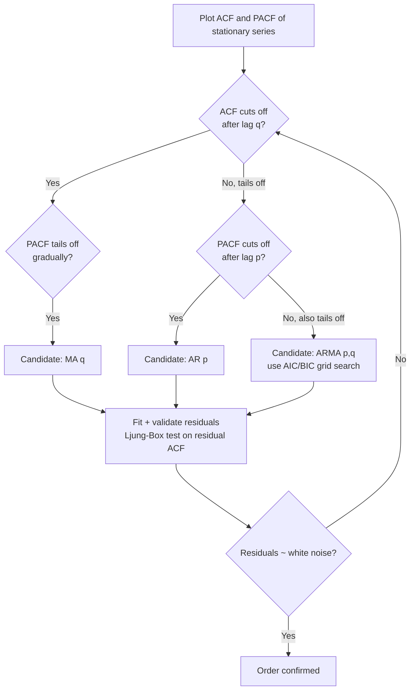
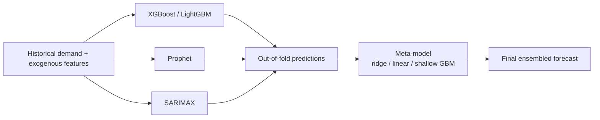
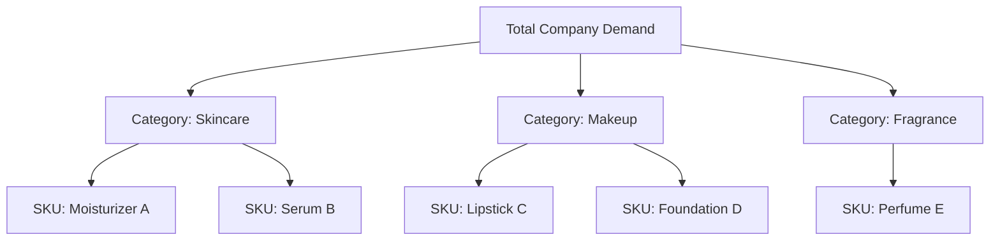

# Time Series Forecasting — Theory & Methods Deep Dive

This file covers the general technical foundations of time series forecasting — stationarity, classical models (ARIMA/SARIMAX, Prophet, exponential smoothing), ML and deep-learning approaches, ensembling theory, evaluation metrics, hierarchical reconciliation, cold-start, and intermittent demand — at the depth expected of a senior candidate who has shipped forecasting systems at scale. The companion project file covers this candidate's specific demand-forecasting case study (architecture, pipeline, results); this file is pure concept/theory so it stands alone regardless of which file an interviewer has open.

## Table of Contents

1. [Stationarity](#1-stationarity)
2. [ACF/PACF and Order Identification](#2-acfpacf-and-order-identification)
3. [ARIMA / SARIMAX](#3-arima--sarimax)
4. [Prophet](#4-prophet)
5. [Exponential Smoothing Family](#5-exponential-smoothing-family)
6. [Machine Learning for Forecasting](#6-machine-learning-for-forecasting)
7. [Deep Learning for Forecasting](#7-deep-learning-for-forecasting)
8. [Ensembling Forecasts](#8-ensembling-forecasts)
9. [Evaluation Metrics for Forecasting](#9-evaluation-metrics-for-forecasting)
10. [Hierarchical / Grouped Forecasting](#10-hierarchical--grouped-forecasting)
11. [Cold-Start Problem](#11-cold-start-problem)
12. [Intermittent Demand — Croston's Method](#12-intermittent-demand--crostons-method)
13. [Popular Interview Questions — Full Answers](#13-popular-interview-questions--full-answers)
14. [Quick Recall Sheet](#quick-recall-sheet)

---

## 1. Stationarity

### 1.1 Formal Definition

A time series $\{X_t\}$ is **strictly stationary** if the joint distribution of any collection of observations is invariant to time shifts. That's too strong a condition to test in practice, so almost all classical forecasting theory relies on the weaker, testable notion of **weak (covariance) stationarity**:

A series is weakly stationary if all three hold, for all $t$:

1. **Constant mean**: $E[X_t] = \mu$ (does not depend on $t$)
2. **Constant variance**: $Var(X_t) = \sigma^2$ (does not depend on $t$)
3. **Autocovariance depends only on lag, not on time**: $Cov(X_t, X_{t+k}) = \gamma(k)$ for all $t$ — the covariance between two points $k$ steps apart is the same no matter *where* in the series you look.

### 1.2 Why Classical Models Need It

ARIMA-family models (and, less obviously, exponential smoothing) are built on the assumption that the *statistical relationships* estimated from the past (autocorrelation structure, coefficients on lagged terms) will continue to hold in the future. If the mean is drifting (trend) or the variance is changing (heteroscedasticity) or the correlation structure itself is shifting, a single fixed set of AR/MA coefficients fitted on historical data cannot validly represent the process going forward — the model is *misspecified* for a moving target. Differencing (Section 1.4) and variance-stabilizing transforms (log, Box-Cox) are how we coerce a non-stationary series into one where these fixed coefficients are appropriate.

Note: this is specifically a constraint of the **linear, parametric classical family**. Tree-based ML models and deep nets don't require stationarity in the same formal sense, but they inherit a *different* problem with non-stationary trends — covered in Section 6.2.

### 1.3 Testing for Stationarity: ADF and KPSS

**Augmented Dickey-Fuller (ADF) test.** Conceptually, ADF tests whether a series has a **unit root** — i.e., whether it behaves like a random walk ($X_t = X_{t-1} + \epsilon_t$, where shocks are permanent and variance grows without bound) versus a mean-reverting process. The test regression (simplified, without extra lag augmentation terms) is:

$$
\Delta X_t = \alpha + \beta t + \gamma X_{t-1} + \sum_{i=1}^{p} \delta_i \Delta X_{t-i} + \epsilon_t
$$

where $\Delta X_t = X_t - X_{t-1}$. The augmented lagged-difference terms ($\delta_i \Delta X_{t-i}$) soak up serial correlation in the residuals so the test on $\gamma$ is valid.

- **Null hypothesis $H_0$: $\gamma = 0$** — a unit root is present, series is **non-stationary**.
- **Alternative $H_1$: $\gamma < 0$** — series is stationary (mean-reverting).
- If the ADF test statistic is more negative than the critical value (p-value < 0.05), we **reject $H_0$** → conclude stationary.

**KPSS (Kwiatkowski-Phillips-Schmidt-Shin) test.** KPSS deliberately flips the hypotheses relative to ADF:

- **Null hypothesis $H_0$**: series **is** (trend-)stationary.
- **Alternative $H_1$**: series has a unit root (non-stationary).
- If the KPSS statistic exceeds the critical value (p-value < 0.05), we **reject $H_0$** → conclude non-stationary.

**Why run both.** Neither test alone is definitive — each has known power problems (ADF has low power to reject $H_0$ when the series is stationary but close to a unit root; KPSS over-rejects stationarity in some settings). Running both and cross-tabulating the outcome resolves ambiguity:

| ADF result | KPSS result | Conclusion |
|---|---|---|
| Reject $H_0$ (stationary) | Fail to reject $H_0$ (stationary) | **Confirmed stationary** — both agree |
| Fail to reject $H_0$ (non-stationary) | Reject $H_0$ (non-stationary) | **Confirmed non-stationary** — both agree |
| Reject $H_0$ (stationary) | Reject $H_0$ (non-stationary) | **Conflicting** — often indicates a difference-stationary vs trend-stationary distinction; investigate a deterministic trend, consider detrending rather than differencing |
| Fail to reject (non-stat.) | Fail to reject (stationary) | **Inconclusive** — insufficient evidence either way; inspect visually, examine longer history |

In production demand-forecasting pipelines, I'd run this pair per SKU-series in an automated stationarity check before auto-selecting differencing order $d$ for an ARIMA fit (e.g., feeding into `pmdarima.auto_arima`'s internal ADF/KPSS-based `d` selection).

### 1.4 Differencing

**First-order (regular) differencing** removes a linear trend by looking at period-over-period changes:

$$
X_t' = X_t - X_{t-1} = \nabla X_t
$$

If one differencing pass isn't enough, apply it again ($d=2$): $\nabla^2 X_t = \nabla X_t - \nabla X_{t-1}$. In practice $d \in \{0,1,2\}$ covers nearly all real series; $d>2$ is rare and often signals a modeling error.

**Seasonal differencing** removes a seasonal pattern of period $m$ by subtracting the value from one full seasonal cycle ago:

$$
\nabla_m X_t = X_t - X_{t-m}
$$

For monthly retail data with yearly seasonality, $m=12$. Seasonal and regular differencing are often combined (e.g., $d=1, D=1, m=12$ for SARIMA on monthly retail demand with both a trend and a yearly cycle).

**Interview angle:**
> **Q: Your SKU-level demand series show a strong upward trend and holiday spikes. Walk me through how you'd decide the differencing order before fitting a SARIMA model.**
> A: I'd start with visual inspection (plot + STL decomposition) to see if there's a trend and seasonal component. Then I'd run ADF and KPSS on the raw series — if ADF fails to reject (non-stationary) and KPSS rejects (non-stationary), that agrees the series needs differencing. I'd apply first-order differencing ($d=1$) and re-run both tests; if they now agree on stationary, I stop there. Separately, I'd check for seasonality via ACF (large spikes at lag 12 for monthly data) and apply seasonal differencing at $m=12$ if the seasonal ACF pattern persists after regular differencing. In practice for retail I usually land on $d=1, D=1, m=12$ (monthly) or $m=7$ (daily with weekly cycles), then let `auto_arima`'s stepwise search pick $(p,q)$ and $(P,Q)$ via AIC on top of that.

> **Q: Why does KPSS have the opposite null hypothesis to ADF instead of just being another version of the same test?**
> A: They're constructed from different underlying models of what "stationary" means and are designed to be complementary rather than redundant. ADF models the series as potentially a unit-root (random walk) process and tests whether that specific non-stationary structure is present. KPSS instead assumes trend-stationarity as the baseline and tests whether the residual variance around a deterministic trend is stable (via a Lagrange-multiplier-style test on the partial sums of residuals). Because a "fail to reject" in either test is not proof of the null (it's just insufficient evidence to reject it), using two tests with reversed nulls means we get actual convergent evidence when they agree, instead of just accumulating one-sided failures to reject.

---

## 2. ACF/PACF and Order Identification

### 2.1 Definitions

**Autocorrelation Function (ACF)** at lag $k$ is the correlation between $X_t$ and $X_{t-k}$, including all the indirect correlation transmitted through intermediate lags:

$$
\rho(k) = \frac{Cov(X_t, X_{t-k})}{Var(X_t)} = \frac{\gamma(k)}{\gamma(0)}
$$

**Partial Autocorrelation Function (PACF)** at lag $k$ is the correlation between $X_t$ and $X_{t-k}$ **after removing** the linear effect of the intermediate lags $X_{t-1}, \dots, X_{t-k+1}$ — i.e., it isolates the *direct* relationship at exactly lag $k$. Formally it's the coefficient $\phi_{kk}$ from fitting an AR($k$) model:

$$
X_t = \phi_{k1}X_{t-1} + \phi_{k2}X_{t-2} + \dots + \phi_{kk}X_{t-k} + \epsilon_t
$$

### 2.2 Reading the Plots to Identify Order

| Process | ACF behavior | PACF behavior |
|---|---|---|
| AR($p$) | **Tails off** (decays gradually — exponentially or in a damped sinusoid) | **Cuts off sharply after lag $p$** (significant spikes at lags $1..p$, then near-zero) |
| MA($q$) | **Cuts off sharply after lag $q$** (significant spikes at lags $1..q$, then near-zero) | **Tails off** (decays gradually) |
| ARMA($p,q$) | Tails off (mixture of decay patterns) | Tails off (mixture of decay patterns) |
| White noise | No significant spikes at any lag | No significant spikes at any lag |

Intuition for *why* this asymmetry exists: an AR($p$) process only has direct dependence on the last $p$ lags, so once you partial out those $p$ lags there's nothing left — hence a hard PACF cutoff. But because each of those AR terms recursively depends on its own past, the *raw* correlation (ACF) never cleanly cuts off, it just decays. The mirror-image argument holds for MA($q$): the raw correlation between $X_t$ and $X_{t-k}$ is exactly zero once $k>q$ because the process literally has no dependence beyond $q$ error terms, so ACF cuts off; but the PACF, which tries to explain that dependence through a growing autoregression, needs an ever-larger number of terms and thus decays instead of cutting off.

In practice on real retail data the textbook clean cutoffs are rare — series are noisy and have multiple seasonal/promotional effects layered in — so most practitioners today use ACF/PACF as a *sanity check and starting range* for $(p,q)$, then let an information-criterion-driven search (AIC/BIC via `auto_arima` / grid search) pick the final orders, followed by a Ljung-Box test on the residuals to confirm no leftover autocorrelation.

**Interview angle:**
> **Q: You look at the ACF plot of a series and see it decaying slowly with damped oscillation, and the PACF has a single strong spike at lag 1. What model would you propose?**
> A: A PACF that cuts off after lag 1 with everything beyond that being insignificant, combined with an ACF that tails off (even with oscillation, which is common for AR processes with a negative or complex-root coefficient), is the textbook signature of an AR(1) process. I'd fit AR(1) (i.e., ARIMA(1,0,0) on the stationary series) as a first candidate, then confirm with a Ljung-Box test on the residuals and compare AIC against a couple of neighboring candidates like AR(2) or ARMA(1,1) before finalizing.

> **Q: Why can't you just always use a high-order AR or MA term and let the fit sort out which coefficients matter?**
> A: You can, but it costs you: more parameters means more estimation variance, higher risk of overfitting the noise in a finite training sample, worse out-of-sample forecast interval calibration, and (for AR terms in particular) it can produce a model with roots close to the unit circle that behaves unstably out-of-sample. Practically, I use ACF/PACF only to bound a reasonable search range for $(p,q)$ and then let AIC/BIC penalize unnecessary complexity during the grid search, rather than max out both.

---

## 3. ARIMA / SARIMAX

### 3.1 The Three Components

**AR (Autoregressive) component of order $p$** — regress the current value on its own past values:

$$
X_t = c + \phi_1 X_{t-1} + \phi_2 X_{t-2} + \dots + \phi_p X_{t-p} + \epsilon_t
$$

**I (Integrated) component of order $d$** — apply differencing $d$ times to the raw series until it is stationary (see Section 1.4); the AR and MA parts are then fit to $\nabla^d X_t$, not the raw series.

**MA (Moving Average) component of order $q$** — regress the current value on past **forecast errors** (not past observed values):

$$
X_t = \mu + \epsilon_t + \theta_1 \epsilon_{t-1} + \theta_2 \epsilon_{t-2} + \dots + \theta_q \epsilon_{t-q}
$$

This is fundamentally different in spirit from AR — it says today's value is explained by how wrong the model's recent predictions were (shocks that haven't fully dissipated), not by the raw historical levels themselves.

### 3.2 Full ARIMA(p,d,q) Equation

Combining all three, applied to the $d$-times-differenced series $Y_t = \nabla^d X_t$:

$$
Y_t = c + \sum_{i=1}^{p}\phi_i Y_{t-i} + \epsilon_t + \sum_{j=1}^{q}\theta_j \epsilon_{t-j}
$$

Using the backshift operator $B$ (where $B X_t = X_{t-1}$), this is often written compactly as:

$$
\phi(B)(1-B)^d X_t = c + \theta(B)\epsilon_t
$$

where $\phi(B) = 1-\phi_1 B - \dots - \phi_p B^p$ and $\theta(B) = 1+\theta_1 B + \dots + \theta_q B^q$.

### 3.3 Seasonal ARIMA (SARIMA)

Real retail/demand series have both non-seasonal short-range dependence *and* seasonal dependence (weekly, monthly, yearly cycles). SARIMA adds a second set of AR/I/MA terms operating at multiples of the seasonal period $m$, denoted $(P,D,Q)_m$:

$$
\Phi(B^m)\,\phi(B)\,(1-B^m)^D(1-B)^d X_t = c + \Theta(B^m)\,\theta(B)\,\epsilon_t
$$

- $P$: seasonal AR terms — dependence on $X_{t-m}, X_{t-2m}, \dots$
- $D$: seasonal differencing order — $(1-B^m)^D$, i.e., $X_t - X_{t-m}$ applied $D$ times
- $Q$: seasonal MA terms — dependence on $\epsilon_{t-m}, \epsilon_{t-2m}, \dots$
- $m$: the seasonal period (7 for daily-with-weekly, 12 for monthly-with-yearly, 52 for weekly-with-yearly)

Full notation: **SARIMA(p,d,q)(P,D,Q)$_m$**. For monthly cosmetics demand with a yearly cycle you'd commonly see something like SARIMA(1,1,1)(1,1,1)$_{12}$ as a starting grid-search candidate.

### 3.4 SARIMAX — Adding Exogenous Regressors

The "X" in SARIMAX adds a linear regression component on external variables $Z_{1,t}, \dots, Z_{k,t}$ that are **not** part of the series' own history but influence it:

$$
X_t = \beta_1 Z_{1,t} + \beta_2 Z_{2,t} + \dots + \beta_k Z_{k,t} + \big[\text{SARIMA structure on the residual}\big]
$$

The exogenous terms are fit jointly with the ARIMA structure — conceptually, you're regressing $X_t$ on the exogenous features, and the residual of that regression is modeled by the SARIMA process (this handles the serial correlation the regression alone can't explain).

**Why this matters specifically for demand forecasting**: pure autoregressive structure can't explain a promotion-driven spike, a stockout-driven dip, a price change, or a weather-driven swing (e.g., sunscreen demand vs temperature) — these are *exogenous shocks*, not something inferable from the series' own past values. SARIMAX lets you feed in:
- **Promotion/markdown flags or discount depth** (numeric or binary)
- **Holiday/event dummies** (Diwali, Christmas, Black Friday — critical in retail/cosmetics)
- **Price** (own price and, if available, competitor price)
- **Weather variables** (temperature, humidity — relevant for seasonal cosmetics/skincare lines)
- **Marketing spend / GRPs**

This is one of the main reasons classical SARIMAX alone is often insufficient at scale for thousands of SKUs with many exogenous drivers — the linear-additive assumption on exogenous effects and the need to hand-specify $(p,d,q)(P,D,Q)_m$ per series doesn't scale well, which is exactly the gap that ML models (Section 6) are brought in to fill.

**Interview angle:**
> **Q: When would you prefer SARIMAX over an XGBoost model for a demand series?**
> A: SARIMAX is a strong choice when (a) the series has clean, stable autocorrelation and seasonal structure, (b) you have relatively few, well-understood exogenous drivers with roughly linear effects, (c) you need well-calibrated prediction intervals with a solid theoretical basis (Gaussian error assumptions give you closed-form confidence intervals), and (d) interpretability of coefficients matters to stakeholders — e.g., "a $1 price increase reduces demand by X units, holding seasonality fixed" is a direct, auditable statement from a SARIMAX coefficient. It struggles when there are many exogenous features with non-linear interactions (e.g., promotion effect that differs by season, price elasticity that differs by store cluster) — that's where GBMs earn their keep, at the cost of needing explicit trend/lag feature engineering and losing the clean statistical inference story.

> **Q: What's the practical difference between the AR term and the MA term in terms of what kind of demand pattern each captures?**
> A: AR captures **momentum/persistence** — if demand was high last period, some of that elevated level tends to persist (inventory build-up behavior, sustained promotional lift, autocorrelated customer purchase cycles). MA captures **shock absorption/decay** — a one-off unexpected spike or dip (a stockout, a data glitch, a short-lived promo) whose *residual effect* fades out after $q$ periods but doesn't feed back into future *levels* the way an AR term would. In practice, a series with a promo that boosts demand for exactly 2 weeks post-event, decaying after, looks MA-like; a series where higher sales this month structurally raises the baseline for months to come looks AR-like.

---

## 4. Prophet

### 4.1 The Additive Model

Facebook's Prophet formulates forecasting as a curve-fitting decomposition rather than a classical time-series regression:

$$
y(t) = g(t) + s(t) + h(t) + \epsilon_t
$$

- **$g(t)$ — Trend**: a piecewise linear (or piecewise logistic, for saturating growth) function capturing the non-periodic long-term change. Piecewise-linear trend: $g(t) = (k + \mathbf{a}(t)^T\boldsymbol{\delta})t + (m + \mathbf{a}(t)^T\boldsymbol{\gamma})$, where $k$ is the base growth rate, $\boldsymbol{\delta}$ are rate adjustments at changepoints, and $\mathbf{a}(t)$ is an indicator vector for which changepoints have occurred by time $t$. Logistic growth caps the trend at a carrying capacity $C(t)$: $g(t) = \dfrac{C(t)}{1+\exp(-(k+\mathbf{a}(t)^T\boldsymbol{\delta})(t-(m+\mathbf{a}(t)^T\boldsymbol{\gamma})))}$.
- **$s(t)$ — Seasonality**: modeled via a **Fourier series** rather than dummy/one-hot calendar terms, giving smooth periodic curves with far fewer parameters:
$$
s(t) = \sum_{n=1}^{N}\left(a_n \cos\left(\frac{2\pi n t}{P}\right) + b_n \sin\left(\frac{2\pi n t}{P}\right)\right)
$$
  where $P$ is the period (365.25 for yearly, 7 for weekly) and $N$ controls how many harmonics — more harmonics fit sharper seasonal patterns but risk overfitting.
- **$h(t)$ — Holidays**: modeled as dummy regressors, each holiday (and a configurable window of days before/after it, since retail effects often bleed into surrounding days) gets its own coefficient: $h(t) = \sum_i \kappa_i \cdot \mathbb{1}[t \in D_i]$.
- **$\epsilon_t$**: irreducible normally-distributed noise not captured by the above.

### 4.2 Changepoint Detection

Prophet automatically detects points in the training history where the trend's growth *rate* shifts (product launches, market shocks, a major promotional strategy change), by placing a large number of candidate changepoints (by default at uniform quantiles across the history) and putting a **sparse (Laplace) prior** on the magnitude of the rate-change parameters $\boldsymbol{\delta}$:

$$
\delta_j \sim \text{Laplace}(0, \tau)
$$

The scale $\tau$ is exactly the `changepoint_prior_scale` hyperparameter:
- **Higher `changepoint_prior_scale`** → weaker shrinkage → more changepoints are allowed non-trivial magnitude → **more flexible trend**, better fit to sudden real shifts, but **higher risk of overfitting** to noise (chasing every wiggle as a "trend change").
- **Lower `changepoint_prior_scale`** → stronger shrinkage toward zero → most changepoints get suppressed to near-zero effect → **more rigid trend**, robust to noise but **risk of underfitting** genuine regime shifts (e.g., missing a real post-launch demand plateau).

Default is 0.05; in practice for volatile retail series I've had to tune this per-category rather than trust the default, and validate via a rolling-origin backtest rather than in-sample fit (a flexible trend always looks better in-sample).

### 4.3 Strengths vs Weaknesses

| Aspect | Strength | Weakness |
|---|---|---|
| Missing data / outliers | Handles gaps natively, robust curve-fitting approach doesn't require imputation | — |
| Interpretability | Additive components (trend/seasonality/holiday) are directly visualizable and explainable to non-technical stakeholders | Additive assumption can be limiting — some real series have multiplicative seasonality (seasonal swing scales with the trend level), requiring a log-transform workaround |
| Seasonality/holidays | Multiple seasonalities (daily+weekly+yearly) and holiday calendars configured with a few lines; strong out-of-the-box performance on business series with clear seasonal/holiday structure | Less accurate than ARIMA/ML on series with complex, fine-grained autocorrelation structure that isn't purely a trend+seasonality+holiday decomposition |
| Short/high-frequency series | — | Not well suited to short series (changepoint/seasonality estimation needs sufficient history) or high-frequency (sub-daily/intraday) data with intricate short-range dependence — ARIMA or ML captures that better |
| Automation at scale | Sensible defaults let you fit thousands of SKU-series with minimal per-series tuning | Per-series automatic changepoint/seasonality fitting can silently produce poor fits for weird series (e.g., near-zero demand, extreme intermittency) without careful monitoring |

**Interview angle:**
> **Q: Why would Prophet underperform XGBoost on a promotion-heavy SKU with many interacting exogenous drivers?**
> A: Prophet's holiday/regressor terms are additive and independent — each extra regressor you add (promo flag, price, weather) contributes its own linear effect on top of trend+seasonality, with no built-in way to model *interactions* (e.g., a promotion's lift being larger during the holiday season, or price elasticity differing by weather). XGBoost, by contrast, learns these interactions automatically through tree splits. So on SKUs where the real driver of demand variance is the interaction between promotion timing, price, and season — which is common in cosmetics/retail — a well-featured GBM tends to out-predict Prophet, even though Prophet's decomposition is more interpretable and easier to sanity check with a business stakeholder.

> **Q: How would you tune `changepoint_prior_scale` responsibly rather than just grid-searching against in-sample error?**
> A: I'd never tune it against in-sample fit, since a more flexible trend will always reduce in-sample residuals — that's precisely the overfitting risk. Instead I'd use rolling-origin (walk-forward) cross-validation: fit on an expanding/rolling window, forecast forward some horizon, measure out-of-sample error (WAPE/MASE), roll the origin forward, repeat, and pick the prior scale that minimizes average out-of-sample error across folds — which is exactly what Prophet's built-in `cross_validation` + `performance_metrics` utilities are designed to automate.

---

## 5. Exponential Smoothing Family

Exponential smoothing methods forecast by taking a weighted average of past observations where weights decay exponentially into the past — recent observations matter more, but nothing is ever fully discarded.

### 5.1 Simple Exponential Smoothing (SES)

For a series with **no trend, no seasonality**:

$$
\hat{y}_{t+1} = \alpha y_t + (1-\alpha)\hat{y}_t, \quad 0 < \alpha < 1
$$

Unrolling this recursively shows the exponentially decaying weight structure explicitly:

$$
\hat{y}_{t+1} = \alpha \sum_{i=0}^{t-1}(1-\alpha)^i y_{t-i} + (1-\alpha)^t \hat{y}_1
$$

Higher $\alpha$ → more weight on the most recent observation (reacts fast to changes, noisier forecast); lower $\alpha$ → smoother, slower to react.

### 5.2 Holt's Linear Method (Double Exponential Smoothing)

Adds a **trend** component $b_t$ alongside the level $\ell_t$:

$$
\begin{aligned}
\ell_t &= \alpha y_t + (1-\alpha)(\ell_{t-1} + b_{t-1}) \quad &\text{(level)}\\
b_t &= \beta(\ell_t - \ell_{t-1}) + (1-\beta)b_{t-1} \quad &\text{(trend)}\\
\hat{y}_{t+h} &= \ell_t + h\,b_t \quad &\text{(h-step forecast)}
\end{aligned}
$$

$\alpha$ controls how fast the level adapts; $\beta$ controls how fast the trend estimate adapts. A **damped trend** variant multiplies the trend contribution by $\phi^h$ (with $0<\phi<1$) so long-horizon forecasts flatten out rather than extrapolating a straight line indefinitely — important in demand forecasting since an un-damped linear trend extrapolated 12 months out is usually unrealistic.

### 5.3 Holt-Winters (Triple Exponential Smoothing)

Adds a **seasonal** component $s_t$ with period $m$. Two variants:

**Additive seasonality** (seasonal swings roughly constant in absolute size regardless of level):

$$
\begin{aligned}
\ell_t &= \alpha(y_t - s_{t-m}) + (1-\alpha)(\ell_{t-1}+b_{t-1})\\
b_t &= \beta(\ell_t-\ell_{t-1}) + (1-\beta)b_{t-1}\\
s_t &= \gamma(y_t - \ell_t) + (1-\gamma)s_{t-m}\\
\hat{y}_{t+h} &= \ell_t + h\,b_t + s_{t-m+((h-1)\bmod m)+1}
\end{aligned}
$$

**Multiplicative seasonality** (seasonal swings scale proportionally with the level — common in retail, where a 20%-above-baseline holiday spike is bigger in absolute units as the business grows):

$$
\begin{aligned}
\ell_t &= \alpha\frac{y_t}{s_{t-m}} + (1-\alpha)(\ell_{t-1}+b_{t-1})\\
b_t &= \beta(\ell_t-\ell_{t-1}) + (1-\beta)b_{t-1}\\
s_t &= \gamma\frac{y_t}{\ell_t} + (1-\gamma)s_{t-m}\\
\hat{y}_{t+h} &= (\ell_t + h\,b_t)\cdot s_{t-m+((h-1)\bmod m)+1}
\end{aligned}
$$

Rule of thumb: plot the series — if seasonal amplitude grows with the level, use multiplicative (or log-transform the series and use additive on the log scale, which is mathematically nearly equivalent).

**Interview angle:**
> **Q: For a fast-growing cosmetics SKU where the holiday-season spike is getting bigger each year in absolute unit terms, would you use additive or multiplicative Holt-Winters?**
> A: Multiplicative, because the spike scaling with the growing baseline level is the definition of multiplicative seasonality — an additive model would either underestimate this year's spike (if calibrated on early smaller history) or misattribute the growing spike size to trend rather than seasonality. Equivalently, I could log-transform the series and use additive Holt-Winters on the log scale, then exponentiate back the forecast — this is often more numerically stable in implementations and makes the seasonal component's confidence intervals easier to reason about.

> **Q: Why would you use a damped trend rather than Holt's plain linear trend for a 6-month-ahead SKU forecast?**
> A: An undamped linear trend assumes the recent growth (or decline) rate continues literally forever, which for demand series is almost always unrealistic beyond a few periods — products mature, saturate, or mean-revert. A damped trend multiplies the trend's per-step contribution by $\phi^h$ so that far-horizon forecasts asymptote toward a flat line rather than diverging, which in my experience produces materially better long-horizon MASE/WAPE on real SKU data versus a naively extrapolated straight-line trend, especially for newly launched or promotionally-inflated products.

---

## 6. Machine Learning for Forecasting

### 6.1 Feature Engineering for Time Series

Turning a forecasting problem into a supervised-learning problem for XGBoost/LightGBM requires manufacturing features that encode temporal structure the model has no other way of "seeing" (trees have no inherent notion of order or time):

- **Lag features**: $y_{t-1}, y_{t-7}, y_{t-14}, y_{t-28}, y_{t-364}$ — raw past values at meaningful lags (yesterday, same day last week, same day last year). For SKU-level demand, lags at 1, 7, 14, 28 days and the same period last year are standard.
- **Rolling window statistics**: rolling mean/std/min/max/median over trailing windows (e.g., 7-day, 28-day rolling mean of demand, rolling std as a volatility proxy). These smooth out noise and give the model a sense of recent "regime" (e.g., is demand currently trending up relative to its own recent history).
- **Date-based/calendar features**: day-of-week, day-of-month, month, quarter, is_weekend, is_holiday, days-to-next-holiday, days-since-promo-start, etc.
- **Fourier terms for cyclical encoding**: rather than feeding day-of-week or month as raw integers or even one-hot categoricals, encode them as $\sin$/$\cos$ pairs:
$$
x_{\sin} = \sin\left(\frac{2\pi \cdot d}{m}\right), \quad x_{\cos} = \cos\left(\frac{2\pi \cdot d}{m}\right)
$$
  where $d$ is the position within the cycle (e.g., day-of-year) and $m$ is the cycle length (365). **Why this is preferred**: a raw integer month (1–12) implies a false linear/ordinal relationship (December=12 is "far" from January=1 in raw numeric distance despite being adjacent in calendar time); a one-hot encoding discards the notion of *closeness* between adjacent periods entirely (June and July are as "different" as June and December to a one-hot model) and blows up dimensionality. The sin/cos pair wraps the cycle onto a circle, so December and January are correctly close in the 2D $(\sin,\cos)$ embedding space, and this holds for **both tree models** (which can now split cleanly on smooth, correctly-ordered proxies of "distance to a seasonal peak") **and linear models** (which get a genuinely continuous, periodic basis function instead of a discontinuous jump from 12 back to 1).

### 6.2 Why Trees Can (and Can't) Do Time Series

Tree-based models predict by **averaging target values within a leaf** — a leaf's prediction is a constant, bounded by the range of target values that fell into that leaf during training. This has a critical consequence for forecasting:

> **Trees cannot extrapolate a trend beyond the numeric range seen in training.** If historical demand ranged from 100–500 units/day and the true future trend would push it to 700, an XGBoost model will predict at most whatever the highest leaf average near the top of the training range was — it will systematically **under-forecast** a continuing upward trend (and analogously over-forecast a continuing downward trend), because it has no mechanism for linear extrapolation the way a regression coefficient does.

**Practitioner workarounds:**
1. **Detrend or difference the target before modeling.** Model $\nabla y_t$ (period-over-period change) or the residual after removing a fitted trend line, rather than raw $y_t$ — trees are then predicting a roughly stationary quantity, and the trend is added back deterministically at inference time.
2. **Provide an explicit trend feature.** Include a monotonic "time index" feature (e.g., days since series start) or a pre-computed trend estimate (e.g., from a simple linear fit or an EWMA of the level) as an input feature — this doesn't fully solve extrapolation but lets the tree route future time-index values that exceed the training range into the correct high/low leaves at least *directionally*, especially combined with monotonic constraints on that feature in XGBoost/LightGBM (`monotone_constraints`).
3. **Combine with a classical/statistical trend model** — which is exactly the ensembling motivation in Section 8: let SARIMAX/Prophet/exponential smoothing own the trend extrapolation, and let the GBM own the residual, cross-sectional, and exogenous-interaction structure.

**Where trees genuinely excel**: capturing **complex non-linear interactions across many exogenous features** — price × promotion × season × store-cluster × weather × cross-SKU cannibalization effects — that classical univariate time-series models simply have no mechanism to represent without manual interaction-term engineering. When you have thousands of SKUs with dozens of shared exogenous drivers, a single global GBM can learn shared non-linear response surfaces (e.g., "promotion lift is larger for low-price-elasticity categories during December") automatically from split structure, which would require an intractable number of hand-specified SARIMAX interaction terms to approximate.

### 6.3 Global vs Local Models

| Aspect | Global model (one model, many series) | Local model (one model per series) |
|---|---|---|
| Statistical strength | Shares patterns/coefficients across series — big win for short or sparse series that don't have enough history alone | Each series estimated in isolation — no borrowing of strength; short series produce unreliable fits |
| Scalability/ops | One model to train, validate, deploy, monitor, and retrain — tractable for thousands of SKUs | Thousands of independent models to fit and maintain — heavy operational burden (retraining, monitoring, drift detection per model) |
| Cross-series patterns | Can learn shared response surfaces (e.g., common promo elasticity, common seasonal shape) and even cross-series effects (cannibalization, substitution) via features like category/cluster embeddings | Cannot see other series at all — misses cross-SKU signal entirely |
| Idiosyncratic dynamics | Risk of **underfitting** a series with genuinely unusual dynamics (a cult product with unique seasonality) since the model is regularized toward the population pattern | Can fully capture series-specific quirks since it's fit only on that series' own history |
| Cold start / new series | Handles new series naturally — a new SKU with attribute features can get a reasonable forecast immediately by "looking like" similar existing SKUs (see Section 11) | Cannot forecast a new series at all until enough of its own history accumulates |
| Typical use in practice | Default choice for thousands-of-SKUs demand forecasting (single LightGBM/XGBoost with SKU/category ID or embedding as features) | Reserved for a small number of business-critical, high-volume series where dedicated per-series tuning is worth the operational cost |

In large-scale retail/cosmetics demand forecasting the practical answer is almost always a **global model with series identity encoded as a feature** (categorical SKU/category ID, or a learned embedding), sometimes supplemented with **local corrections** (e.g., a per-SKU bias correction term, or a small local model reserved for the handful of top-revenue SKUs where the extra tuning effort clearly pays off).

**Interview angle:**
> **Q: With thousands of SKUs, why not just fit a SARIMAX per SKU and parallelize the fitting?**
> A: You technically can, and it's a reasonable baseline, but it has real costs: (1) operationally you now own thousands of independently-drifting models — each needs its own re-fit cadence, its own outlier/data-quality monitoring, its own order-selection logic, which is a maintenance nightmare at scale; (2) statistically, a large fraction of SKUs — especially long-tail, slow-moving, or newly launched ones — simply don't have enough history for a reliable per-series ARIMA fit, whereas a global model automatically borrows strength from similar SKUs; (3) a global GBM can learn cross-SKU and cross-category effects (shared promotional elasticity, substitution effects) that per-series models can never see by construction. The tradeoff is that a global model can underfit a handful of genuinely idiosyncratic top-sellers — which is why in practice I'd combine a global GBM baseline with either a per-SKU bias-correction layer or dedicated local models for the small number of highest-revenue, highest-scrutiny SKUs.

---

## 7. Deep Learning for Forecasting

Deep sequence models are increasingly used for large-scale forecasting where thousands of related series and rich exogenous features exist. This section stays at a comparison level appropriate for a forecasting interview; full RNN/attention mechanics belong in a dedicated deep-learning file.

- **LSTM**: a recurrent architecture that processes the series step-by-step, maintaining a hidden state, with gating (input/forget/output gates) that lets it retain long-range dependencies better than a vanilla RNN (which suffers vanishing gradients over long sequences). For forecasting, it's typically framed as a sequence-to-one or sequence-to-sequence model: feed in a window of past values (+ exogenous features), predict the next step(s) autoregressively or directly as a multi-step output vector.
- **Temporal Fusion Transformer (TFT)**: an attention-based architecture purpose-built for **multi-horizon, multi-series** forecasting with mixed static/known-future/observed-past inputs. Key components: **variable selection networks** (learn to weight which input features matter at each time step, giving built-in feature-importance interpretability), an **LSTM encoder-decoder** for local processing, and **multi-head attention** over the time dimension for long-range dependency modeling, plus **quantile output heads** for probabilistic forecasts. Its variable-selection and attention weights are directly inspectable, making it one of the more interpretable deep models.
- **N-BEATS**: a pure deep architecture with **no recurrence and no attention** — just stacked fully-connected residual blocks arranged in a "backward-forward" structure: each block takes the previous block's residual, produces a **backcast** (reconstruction of the input, subtracted off to form the next block's input residual) and a **forecast** (added into the running forecast total). An interpretable variant constrains certain stacks to basis functions for trend (polynomial basis) and seasonality (Fourier basis), giving a decomposition similar in spirit to Prophet's but learned end-to-end and typically far more accurate on the M4-competition-style benchmarks it was designed for.
- **DeepAR**: an autoregressive RNN trained **globally** across many related series, but instead of predicting a point value, it predicts the **parameters of a likelihood** (e.g., negative binomial for count/intermittent demand, Gaussian for continuous) at each step, giving native **probabilistic** forecasts (full predictive distributions, not just point estimates) and naturally handling series on very different scales via a scaling mechanism.

| Model | Data volume needed | Interpretability | Training cost | Probabilistic output | Short-series performance |
|---|---|---|---|---|---|
| LSTM (vanilla seq2seq) | Medium-high (many series or long history) | Low (black-box hidden state) | Moderate (sequential, harder to parallelize) | Not by default (needs extra likelihood head) | Weak — needs decent history per series or a global training scheme |
| TFT | High (designed for many series + rich covariates) | High (variable-selection weights, attention maps are inspectable) | High (large architecture, attention over long horizons) | Yes (native quantile heads) | Moderate — benefits from global training on the whole panel |
| N-BEATS | Medium (works well even in fairly pure univariate settings) | Moderate-high (interpretable trend/seasonality stack variant) | Moderate | Not natively (extensions exist, e.g. N-BEATSx) | Moderate — strong pure-univariate performance without needing exogenous features |
| DeepAR | High (explicitly designed to pool statistical strength across many related series) | Low-moderate | Moderate-high | Yes (native, this is its core design goal) | Good *relative to other DL models* specifically because it globally pools across series — but still needs a reasonably large panel |
| Classical (ARIMA/ETS/Prophet) | Low (works with a single series) | High | Low | Yes (closed-form or simulation-based intervals) | Strong — designed for exactly this regime |
| GBM (XGBoost/LightGBM) | Medium (needs enough rows across all series combined) | Moderate (SHAP/feature importance) | Low-moderate | Not natively (needs quantile loss or conformal wrapping) | Moderate — benefits from being global across SKUs |

**When deep models are worth the extra complexity in a retail/demand context**: very large, rich panels (many thousands of series with abundant shared exogenous data), a genuine business need for calibrated probabilistic forecasts (e.g., safety-stock optimization needing full predictive distributions, not just point forecasts), and organizational capacity to own the extra training/serving/monitoring complexity. For a mid-sized SKU catalog with moderate history, a well-featured global GBM ensembled with Prophet/SARIMAX is often competitive with, and much cheaper to operate than, a TFT/DeepAR pipeline — which is exactly the tradeoff that justifies the GBM+classical ensemble approach in practice.

**Interview angle:**
> **Q: Would you recommend moving from an XGBoost+Prophet ensemble to DeepAR or TFT for a demand forecasting system with thousands of SKUs?**
> A: It depends on what's currently the bottleneck. If the GBM ensemble's accuracy is already strong and the real gap is *probabilistic* forecasts for inventory/safety-stock decisions, DeepAR is attractive because probabilistic output via a likelihood head is its core design point and it pools statistical strength across all SKUs by training globally — that maps well onto a "thousands of related series" setting. If the real gap is model transparency for supply-chain planners who need to trust and explain forecasts, TFT's variable-selection networks give you inspectable per-feature importance at each time step, which is more defensible than a black-box LSTM. But both come with meaningfully higher training/serving/monitoring cost and engineering complexity than a GBM+classical ensemble, and in my experience the accuracy gain over a well-tuned, well-featured GBM ensemble is often modest unless the panel is very large and rich in shared covariates — so I'd only recommend the move if there's a concrete business need (e.g., calibrated quantiles for stock-out risk) that the current ensemble can't cheaply satisfy (e.g., via quantile regression or conformal prediction wrapped around the GBM).

> **Q: What's the core architectural idea that lets N-BEATS forecast without any recurrence or attention?**
> A: It stacks blocks of fully-connected layers where each block does two things: predicts a **backcast** — its best reconstruction of the input window — which gets subtracted from the input to form the residual passed to the *next* block, and predicts a **forecast** contribution that gets added to a running total across all blocks. This residual "explain what you can, pass the leftover downstream" structure lets successive blocks progressively refine the forecast without ever needing an explicit notion of sequential state (no recurrence) or pairwise time-step comparisons (no attention) — it's pure feed-forward, which makes it fast to train and easy to parallelize, and the interpretable variant constrains specific stacks to trend (polynomial) and seasonality (Fourier) basis functions so you get a Prophet-like decomposition as a byproduct.

---

## 8. Ensembling Forecasts

### 8.1 Why Ensemble

Different model families capture different structure in a demand series — SARIMAX/Prophet own trend and calendar-seasonality cleanly with well-behaved extrapolation; GBMs own complex non-linear exogenous interactions but can't extrapolate trend (Section 6.2). No single model family dominates across the full diversity of thousands of SKUs (fast movers vs slow movers, promo-heavy vs stable, new vs mature) — a **weighted ensemble** captures the strengths of each and, critically, tends to reduce **variance of forecast error** even when the component models are individually similar in average accuracy, because their errors are not perfectly correlated (this is the same bias-variance/error-decorrelation argument behind bagging, just applied at the model-family level instead of the bootstrap-sample level).

### 8.2 Weighted Averaging

The simplest ensemble is a convex combination of $K$ base forecasts $\hat{y}^{(1)}_t, \dots, \hat{y}^{(K)}_t$:

$$
\hat{y}^{ens}_t = \sum_{k=1}^{K} w_k\, \hat{y}^{(k)}_t, \quad \text{s.t. } w_k \ge 0,\ \sum_k w_k = 1
$$

**Determining the weights:**
1. **Inverse-error weighting** (simple, no optimization needed): weight each model inversely proportional to its historical validation error, e.g. $w_k \propto 1/\text{MASE}_k$, then normalize to sum to 1. Fast, robust, easy to explain, a good default.
2. **Optimizing weights on a validation set** — pose it as a constrained least-squares / convex optimization problem: minimize the chosen error metric (e.g., sum of squared errors, or WAPE) over the weight simplex on a held-out validation window:
$$
\mathbf{w}^* = \arg\min_{\mathbf{w}} \; L\!\left(y_t,\ \sum_k w_k \hat{y}^{(k)}_t\right) \quad \text{s.t. } w_k\ge 0,\ \textstyle\sum_k w_k = 1
$$
   With squared-error loss this is a standard **non-negative least squares (NNLS)** problem, solvable exactly and efficiently; other loss choices (WAPE, MASE) push it into general constrained convex optimization solvable via projected gradient descent or off-the-shelf solvers (`scipy.optimize.minimize` with a simplex constraint).
3. **Grid search**: for a small number of base models (2–3, as in an XGBoost + Prophet + SARIMAX ensemble), a coarse grid over $w_1, w_2, (1-w_1-w_2)$ evaluated on a validation window is often sufficient and very interpretable — this maps directly onto the classic resume claim of "weighted-averaging ensemble across XGBoost/LightGBM + Prophet/SARIMAX."

Weights can be **global** (one set of weights for the whole catalog), **per-category** (different weighting for fast-movers vs slow-movers, since GBM vs classical strength differs by series type), or in principle **per-series** (most flexible but requires enough validation history per series to estimate weights reliably — often infeasible for short/sparse series, which is exactly where a single global weighting or category-level weighting is preferred).

### 8.3 Stacking

Rather than a fixed linear combination, **stacking** trains a meta-model on the **out-of-fold predictions** of the base models:

1. Split training data into $K$ folds (or, for time series, use rolling-origin folds to respect temporal order — never a random K-fold, which would leak future information into training).
2. For each fold, train each base model (XGBoost, Prophet, SARIMAX) on the other folds and predict on the held-out fold, producing out-of-fold predictions for every training point.
3. Train a meta-model (often a simple linear regression, ridge regression, or a shallow GBM) with the base models' out-of-fold predictions as features and the true target as the label.
4. At inference time, get predictions from all base models on new data and feed them through the fitted meta-model to get the final forecast.

Stacking generalizes weighted averaging (linear regression as the meta-model *is* a learned weighted average, without the sum-to-one/non-negativity constraints) and can capture **non-linear** combination rules (e.g., "trust GBM more when recent volatility is high, trust Prophet more when the series is smooth and highly seasonal") if the meta-model is non-linear and given contextual features (recent volatility, series length, category) alongside the base predictions. The cost is added complexity, a higher overfitting risk if the out-of-fold scheme isn't done carefully, and reduced interpretability of the final blend versus a simple fixed weighted average.

**Interview angle:**
> **Q: Walk me through, mechanically, how you'd determine the optimal weights for combining XGBoost, Prophet, and SARIMAX forecasts.**
> A: I'd hold out a rolling validation window (respecting time order, not random shuffling) and generate each base model's forecasts on that window. Then I'd solve for weights $w_1, w_2, w_3 \ge 0$ summing to 1 that minimize a chosen error metric — for squared error this is an NNLS problem with a closed-form-ish efficient solution, but I'd typically optimize directly against WAPE or MASE since that's the metric the business cares about, using a constrained optimizer like SLSQP with the simplex constraint. I'd validate the resulting weights aren't wildly overfit to that one validation window by checking stability across multiple rolling-origin folds, and I'd consider whether weights should differ by series segment (e.g., fast movers vs slow movers) rather than forcing one global weight vector, since GBM tends to add more value on volatile, promo-heavy series while SARIMAX/Prophet tend to be more competitive on smooth, low-noise series.

> **Q: What's the risk of stacking versus simple weighted averaging in a production forecasting system?**
> A: The main risks are (1) leakage — if the out-of-fold scheme for generating meta-features doesn't strictly respect chronological order, the meta-model looks artificially good in validation but fails in production; (2) added operational complexity — you now have to retrain and monitor a meta-model on top of the base models, and debugging a bad forecast means tracing through an extra layer; (3) reduced interpretability — a fixed weighted average is trivial to explain to a stakeholder ("60% GBM, 40% Prophet"), while a learned non-linear stacking rule is harder to audit and explain when a forecast looks wrong. In practice, for most SKU-level demand pipelines I'd default to a validated weighted average (or per-segment weights) and only reach for stacking if there's clear, backtested evidence that a learned combination rule meaningfully beats it out-of-sample.

---

## 9. Evaluation Metrics for Forecasting

### 9.1 The Metrics

**MAPE (Mean Absolute Percentage Error):**

$$
\text{MAPE} = \frac{100\%}{n}\sum_{t=1}^{n}\left|\frac{y_t - \hat{y}_t}{y_t}\right|
$$

Flaw: **undefined when $y_t=0$ and explodes toward infinity as $y_t \to 0$**, even for a tiny absolute error — a single near-zero-demand day/SKU can dominate or break the aggregate metric entirely.

**SMAPE (Symmetric MAPE):**

$$
\text{SMAPE} = \frac{100\%}{n}\sum_{t=1}^{n}\frac{|y_t - \hat{y}_t|}{(|y_t|+|\hat{y}_t|)/2}
$$

Intended to fix MAPE's asymmetry (MAPE penalizes over-forecasts and under-forecasts differently in percentage terms) and bound the metric, but still has real issues: it's **still unstable near zero** (denominator can still be tiny if both $y_t$ and $\hat{y}_t$ are near zero), and it has its own **asymmetry critique** — it penalizes under-forecasting ($\hat{y}_t < y_t$) less than over-forecasting for the same absolute error in certain regimes, because the denominator itself depends on $\hat{y}_t$, so it isn't as "symmetric" in practice as the name implies.

**WAPE (Weighted Absolute Percentage Error, aka WMAPE):**

$$
\text{WAPE} = \frac{\sum_{t=1}^{n}|y_t - \hat{y}_t|}{\sum_{t=1}^{n}|y_t|}
$$

This aggregates total absolute error over total actual volume **before** dividing, rather than averaging individual per-point ratios — so a handful of near-zero-actual points can't blow up the metric the way they do in MAPE, since they contribute a tiny amount to both numerator and denominator rather than an exploding individual term. This is why WAPE is a standard **aggregate-level** (e.g., across all SKUs in a category, or across all days for one SKU) metric in retail forecasting.

**MASE (Mean Absolute Scaled Error):**

$$
\text{MASE} = \frac{\dfrac{1}{n}\sum_{t=1}^{n}|y_t-\hat{y}_t|}{\dfrac{1}{n-m}\sum_{t=m+1}^{n}|y_t - y_{t-m}|}
$$

The denominator is the **in-sample MAE of a naive seasonal forecast** (predicting $y_{t-m}$ periods ago as the forecast, e.g., $m=1$ for non-seasonal naive, $m=7$ or $m=12$ for seasonal naive). MASE $<1$ means the model beats naive seasonal forecasting; MASE $>1$ means it's worse than just repeating last period/last season's value.

Why many practitioners consider MASE the best general-purpose metric:
- **Scale-independent**: because both numerator and denominator are in the same units, MASE can be meaningfully averaged/compared **across series of wildly different scale** (a slow-moving SKU selling 5 units/day and a fast-mover selling 5,000 units/day both produce a comparable, interpretable MASE) — MAPE/SMAPE/WAPE computed per-series and then averaged don't have this clean cross-series comparability property.
- **Defined even with zero actuals** — since the denominator is a fixed historical naive-forecast error (not per-point $y_t$), a handful of zero-demand periods in the numerator don't cause a division blow-up.
- **Has a clear, business-meaningful reference point** — "are we beating the dumbest reasonable baseline" — rather than an arbitrary percentage threshold.

**RMSE (Root Mean Squared Error):**

$$
\text{RMSE} = \sqrt{\frac{1}{n}\sum_{t=1}^{n}(y_t-\hat{y}_t)^2}
$$

Squaring the error means **large errors are penalized disproportionately more than small ones** — an asymmetric-in-magnitude risk that can be desirable (if large misses are truly more costly, e.g., a huge stockout) or undesirable (if it makes the metric overly sensitive to a few outlier days, e.g., a data glitch or an unmodeled one-off event, distorting the overall assessment of a model that's otherwise consistently good).

### 9.2 Comparison Table

| Metric | Formula (short) | Handles zero actuals? | Scale-dependent? | Asymmetric penalty risk? |
|---|---|---|---|---|
| MAPE | $\frac{100}{n}\sum\lvert\frac{y_t-\hat y_t}{y_t}\rvert$ | **No** — undefined/explodes at $y_t=0$ | No (percentage) | Yes — penalizes over- vs under-forecast asymmetrically |
| SMAPE | $\frac{100}{n}\sum\frac{\lvert y_t-\hat y_t\rvert}{(\lvert y_t\rvert+\lvert\hat y_t\rvert)/2}$ | Partially — still unstable if both near zero | No (percentage, bounded 0–200%) | Yes — denominator depends on $\hat y_t$, so not truly symmetric in practice |
| WAPE | $\frac{\sum\lvert y_t-\hat y_t\rvert}{\sum\lvert y_t\rvert}$ | **Yes**, at the aggregate level | No (ratio), but is an aggregate-level not point-level metric | Low — errors pooled across all points before ratio taken |
| MASE | $\frac{MAE_{model}}{MAE_{naive\ seasonal}}$ | **Yes** | **No** — scale-independent by construction | Low-moderate — still based on absolute error, no squaring |
| RMSE | $\sqrt{\frac{1}{n}\sum(y_t-\hat y_t)^2}$ | Yes (no division by actual) | **Yes** — in native units, not comparable across series of different scale | **High** — squaring heavily penalizes large errors/outliers |

**Interview angle:**
> **Q: Your catalog has thousands of SKUs, many of them slow-moving with lots of near-zero-demand days. Which metric would you report to leadership and why?**
> (Answered fully in Section 13 below, since this is one of the required "popular questions.")

> **Q: If RMSE penalizes large errors more, when is that actually the *right* thing to do in a demand forecasting business context?**
> A: When the cost function of the business is itself convex/super-linear in error size — e.g., a large under-forecast causes a stockout that cascades into lost sales, customer churn, and emergency expedited shipping costs that are disproportionately expensive relative to a small under-forecast; or a large over-forecast ties up working capital and warehouse space in a way that scales worse than linearly. In those cases, optimizing a model (or selecting among model variants) using RMSE-flavored loss aligns the metric with the true business cost curve. But I'd still report WAPE/MASE alongside RMSE for stakeholder communication, since RMSE in raw units is hard to interpret and not comparable across SKUs of very different scale — I'd use RMSE mainly as an internal model-selection signal when I have specific evidence the cost function is convex, not as the headline reporting metric.

---

## 10. Hierarchical / Grouped Forecasting

### 10.1 The Problem

Retail/cosmetics demand naturally lives in a **hierarchy** — e.g., total company demand → category (skincare, makeup, fragrance) → sub-category → individual SKU; or geographically, region → store → SKU. Forecasts made independently at each level are almost never **coherent** (the SKU-level forecasts don't sum up to match the independently-produced category-level forecast) — but different stakeholders consume forecasts at different levels (finance wants total revenue forecasts, category planners want category forecasts, store ops want SKU-store-level forecasts), and they need to agree with each other.

### 10.2 Approaches

| Approach | Method | Pros | Cons |
|---|---|---|---|
| **Top-down** | Forecast the total series (usually the most stable, least noisy series), then **disaggregate** down to lower levels using historical proportions (e.g., each SKU's average historical share of category volume) | Total-level forecast is typically the most accurate (aggregation cancels out idiosyncratic noise); simple to implement | Assumes historical proportions are stable going forward — misses SKU-level shifts (a SKU gaining/losing share) since disaggregation is mechanical, not re-forecast |
| **Bottom-up** | Forecast each bottom-level series (SKU) independently, then **sum up** to get every higher aggregate | Captures SKU-specific dynamics and drivers directly; naturally coherent by construction (sums always match) | Bottom-level series are noisiest (especially slow-movers/intermittent SKUs) — errors accumulate upward; computationally heavier (thousands of independent forecasts) |
| **Middle-out** | Forecast at an intermediate level (e.g., sub-category) where signal-to-noise is favorable, then **aggregate up** to total and **disaggregate down** to SKU | Balances noise-cancellation benefits of aggregation with more granular accuracy than pure top-down; practical middle ground often used in real retail planning | Still relies on a disaggregation assumption below the middle level; choice of "middle" level is somewhat arbitrary and needs validation |
| **Reconciliation (e.g., MinT)** | Forecast **independently at every level**, then apply a statistically optimal **reconciliation** step that adjusts all forecasts to be coherent while minimizing the total variance of the adjustment, using the full covariance structure of the base forecast errors (MinT = "Minimum Trace" — Hyndman et al.) | Uses information from every level simultaneously rather than picking one "true" level; provably minimizes reconciled-forecast variance under its assumptions; is the modern best-practice approach | More complex to implement and explain than top-down/bottom-up; requires estimating a full error covariance matrix across the hierarchy, which needs care with high-dimensional hierarchies (thousands of SKUs) |

**MinT (Minimum Trace) reconciliation**, briefly: given incoherent base forecasts $\hat{\mathbf{y}}$ at every level of the hierarchy, coherence is enforced via a summing matrix $\mathbf{S}$ (encoding which bottom series sum to which aggregates), and the reconciled forecasts are $\tilde{\mathbf{y}} = \mathbf{S}(\mathbf{S}^T\mathbf{W}^{-1}\mathbf{S})^{-1}\mathbf{S}^T\mathbf{W}^{-1}\hat{\mathbf{y}}$, where $\mathbf{W}$ is the (estimated) covariance matrix of the base forecast errors — this is the generalized-least-squares reconciliation that minimizes total forecast variance subject to the coherence constraint, and it strictly generalizes both top-down and bottom-up as special cases of the weighting choice.

**Interview angle:**
> **Q: Finance wants total revenue forecasts, category managers want category-level, and store ops needs SKU-store-level — how would you avoid these forecasts contradicting each other?**
> A: I'd treat this explicitly as a hierarchical reconciliation problem rather than three independent forecasting exercises. Practically, either (a) pick a middle-out approach — forecast at, say, sub-category level where the signal-to-noise ratio is favorable, aggregate up for finance and disaggregate down to SKU using recent share-of-category trends for store ops, or (b) for a more rigorous version, generate independent base forecasts at every level (total, category, SKU) using whatever model performs best at each, then apply an optimal reconciliation method like MinT that adjusts all of them simultaneously to be mutually coherent while minimizing the total variance introduced by the adjustment. I'd favor (b) when the stakes justify the added complexity (e.g., financial planning cycles), and a simpler top-down or middle-out disaggregation when the ask is more operational and speed/simplicity matters more than statistical optimality.

---

## 11. Cold-Start Problem

Forecasting demand for a **brand-new product with no sales history** is one of the hardest practical problems in retail forecasting, since every classical time-series method (ARIMA, Prophet, exponential smoothing, per-series GBM lags) fundamentally requires history to fit on.

**Strategies:**

1. **Attribute-based similarity / analog matching**: represent products by their attributes (category, sub-category, price point, brand tier, package size, ingredient/formulation tags for cosmetics) and find historically similar existing products ("analogs") whose early-life demand curve can be borrowed or blended as a launch template. Similarity can be as simple as nearest-neighbor matching on attribute vectors, or as sophisticated as learned product embeddings from a global model.
2. **Global models handle cold-start far more gracefully than local models by construction**: since a global GBM or DeepAR-style model is trained across the whole catalog with product attributes as features, a brand-new SKU can be scored immediately at inference time — the model generalizes from similar SKUs' learned response surface even though the new SKU itself contributed zero training rows. This is one of the strongest practical arguments for a global-model architecture in a catalog with continuous new-product introduction (very common in cosmetics).
3. **Hierarchical/pooled approaches**: borrow strength from the category/sub-category aggregate level (top-down or middle-out disaggregation, Section 10) to give the new SKU a share-of-category-based initial forecast, refined as its own early sales data accumulates.
4. **Launch curve templates**: many categories exhibit a characteristic **launch curve shape** (e.g., a spike from initial distribution/trial followed by decay to a steady-state repeat-purchase level) — cluster historical launches into a small number of canonical curve shapes (by category, price tier, or marketing spend level) and assign a new product's forecast to the matching template, rescaled to its expected volume (e.g., via distribution points, marketing budget, or analog product's peak volume).

In practice these are combined: analog-matching selects which historical launch curve template and which attribute-similarity peers to use, a global model provides a continuously-updated baseline that blends in real sales data as it starts arriving (transitioning smoothly from pure cold-start to a data-driven forecast over the first several weeks), and the forecast is reconciled against the category-level plan so the launch doesn't imply an incoherent jump in the category total.

**Interview angle:**
> **Q: A new SKU is launching next month with zero sales history — how do you produce a forecast for it?**
> A: First I'd find analog products — similar category, price point, package size, and (for cosmetics specifically) similar formulation/claims — using attribute-based nearest-neighbor matching or, if available, embeddings from a global model already trained on the catalog. I'd use their early-life demand curves, appropriately rescaled (e.g., by planned distribution points or marketing spend relative to the analogs), as an initial launch-curve template. In parallel, since the production forecasting model is a global GBM trained with product attributes as features, I can score the new SKU directly at inference time even with zero of its own history — the model generalizes from what it learned about similar SKUs' response surfaces. As actual sell-through data starts coming in post-launch, I'd blend from the analog-based prior toward a data-driven forecast over the first several weeks (e.g., a weighted blend where the weight on real data increases as more weeks of actuals accumulate), and reconcile the SKU-level number against the category-level plan so it doesn't imply an incoherent jump in the category total.

---

## 12. Intermittent Demand — Croston's Method

Many SKUs — especially long-tail, slow-moving items — have demand series with **many zero-demand periods** interspersed with occasional non-zero demand. Standard exponential smoothing applied directly to such a series produces systematically biased forecasts (the zeros drag the level estimate down right after a zero period, then a demand spike is under-forecast, then the next demand keeps getting predicted too high right after — a persistent sawtooth mis-forecast pattern that also badly distorts MAPE-style metrics).

### 12.1 Croston's Method

Croston's method decomposes the series into two separate processes and smooths each independently:

1. **Demand size** $z_t$: the size of demand *only on periods where demand actually occurs* (skipping zero periods entirely).
2. **Inter-demand interval** $q_t$: the number of periods between successive non-zero demand occurrences.

Each is updated via **simple exponential smoothing**, but only at the time steps where a non-zero demand is observed (let $t^*$ index the occasions of non-zero demand):

$$
\hat{z}_{t^*} = \alpha z_{t^*} + (1-\alpha)\hat{z}_{t^*-1}
$$
$$
\hat{q}_{t^*} = \alpha q_{t^*} + (1-\alpha)\hat{q}_{t^*-1}
$$

The forecast of the **per-period demand rate** at any point in time is then the ratio of the smoothed demand size to the smoothed interval:

$$
\hat{y}_t = \frac{\hat{z}_{t^*}}{\hat{q}_{t^*}}
$$

This is held constant between non-zero demand occasions (i.e., the forecast only updates when a new non-zero demand is observed, not every calendar period) — which is exactly the intended behavior: instead of a jagged demand estimate whipsawing to near-zero right after an observed zero, you get a smooth, stable *rate* estimate that only revises when genuinely new information (an actual demand occurrence) arrives.

### 12.2 The Syntetos-Boylan Approximation (SBA)

Croston's original method, despite being the standard approach, was later shown to be **biased** — it systematically **over-forecasts** demand on average, because the ratio-of-two-independent-exponential-smooths $\hat z/\hat q$ is not an unbiased estimator of the true demand rate even when each smoothed component individually is (a form of Jensen's-inequality-style bias from taking the expectation of a ratio). The **Syntetos-Boylan Approximation (SBA)** corrects this with a simple multiplicative bias-correction factor:

$$
\hat{y}_t^{SBA} = \left(1 - \frac{\alpha}{2}\right)\frac{\hat{z}_{t^*}}{\hat{q}_{t^*}}
$$

This small correction (typically shrinking the forecast by roughly $\alpha/2$, e.g., ~10% for $\alpha=0.2$) removes most of the systematic over-forecasting bias while keeping Croston's core two-recursion structure intact, and is now generally preferred over vanilla Croston in production intermittent-demand systems.

**Interview angle:**
> **Q: Why does applying standard Holt-Winters or SES directly to a slow-moving SKU with 80% zero-demand days produce bad forecasts, and how does Croston's method fix it?**
> A: Standard exponential smoothing updates its level estimate every single period, including zero-demand periods — so right after an observed zero, the level estimate gets pulled down toward zero, and then the next time actual demand occurs, the forecast badly under-predicts it; conversely, right after a demand spike, the forecast over-predicts the immediately following (likely zero) periods. You get a persistent sawtooth error pattern, and metrics like MAPE become close to meaningless since so many actuals are exactly zero. Croston's method fixes this by not updating on zero periods at all — it separately smooths (a) the size of demand *when it occurs* and (b) the *interval* between occurrences, only revising each of these two exponential smooths on the actual occasions when non-zero demand is observed. The forecast rate is the ratio of the two, held flat between occurrences, which produces a stable estimate that isn't whipsawed by the zeros. I'd also apply the Syntetos-Boylan correction on top, since vanilla Croston is known to systematically over-forecast — SBA multiplies the ratio by $(1-\alpha/2)$ to correct that bias, and it's a near-free addition to implement.

> **Q: How would you decide which SKUs need Croston/SBA versus a standard forecasting approach?**
> A: I'd classify SKUs by their demand pattern — a common industry approach (Syntetos-Boylan categorization) buckets series by average inter-demand interval and the squared coefficient of variation of non-zero demand sizes into "smooth," "intermittent," "erratic," and "lumpy" categories. Series with a long average inter-demand interval (many zero periods) get routed to Croston/SBA (or newer variants like TSB which also allows the demand-occurrence probability itself to decay, unlike Croston's fixed implicit assumption), while smooth, regularly-demanded SKUs are better served by standard exponential smoothing, SARIMAX, or the GBM ensemble. This routing is itself something I'd automate as a preprocessing classification step in a pipeline covering thousands of SKUs, rather than deciding per-SKU manually.

---

## 13. Popular Interview Questions — Full Answers

> **Q: Why use a weighted combination of XGBoost/LightGBM + Prophet/SARIMAX instead of one model?**
>
> A: Each model family has a structurally different failure mode, and no single one dominates across a catalog as heterogeneous as thousands of SKUs. SARIMAX and Prophet are built to extrapolate trend and calendar seasonality correctly by construction (linear/logistic trend terms, Fourier seasonal terms) and give well-calibrated, interpretable behavior on smooth, regularly-demanded series — but they handle complex, non-linear interactions between many exogenous drivers (price × promotion × season × cross-SKU cannibalization) poorly, since that would require manually specifying interaction terms. GBMs are the mirror image: they excel at learning exactly those non-linear exogenous interactions automatically through tree splits, and they scale beautifully as one global model across thousands of SKUs sharing statistical strength — but they fundamentally cannot extrapolate a trend beyond the numeric range seen in training, since a tree leaf predicts a bounded constant, not a linear projection. So a GBM alone will systematically under-forecast a genuinely continuing upward trend unless you explicitly detrend or feature-engineer a trend signal in. Combining them lets each cover the other's blind spot: classical models own trend/seasonality extrapolation cleanly, the GBM owns the residual/exogenous-interaction structure, and a validated weighted average (or stacked meta-model) on top typically reduces overall forecast variance even when the individual models have similar average accuracy, because their errors aren't perfectly correlated — the same error-decorrelation logic behind bagging, applied at the model-family level. Practically, the weights (or stacking rule) are fit and validated via rolling-origin backtesting against the metric the business actually cares about (WAPE/MASE), not chosen arbitrarily.

> **Q: What forecasting evaluation metric would you pick for a business with many near-zero-demand SKUs, and why?**
>
> A: I would not use MAPE as the primary metric — it's undefined at zero actuals and explodes toward infinity as actuals approach zero, so with a catalog containing many near-zero-demand SKUs, MAPE either breaks outright or gets dominated by a handful of pathological low-volume series that don't represent overall forecast quality. SMAPE softens this somewhat by using an averaged denominator, but it's still numerically unstable when both actual and forecast are near zero, and has its own asymmetry critique. My primary choice would be **MASE** for per-series or per-segment model comparison: it scales the mean absolute error by the in-sample MAE of a naive seasonal forecast, which means it's (a) defined even with zero actuals, since the denominator is a fixed historical baseline error rather than the current-period actual, and (b) scale-independent, so I can meaningfully compare and average performance across a slow-mover selling a few units a week and a fast-mover selling thousands a day on the same footing, and interpret the number directly as "are we beating a naive baseline." For aggregate/rolled-up reporting (e.g., total category or total company level, which is often what leadership actually wants to see), I'd report **WAPE** alongside MASE — WAPE sums absolute error and absolute actuals separately before taking the ratio, so a handful of zero/near-zero SKUs contribute only their (small) share to both numerator and denominator rather than blowing up an individual ratio term, giving a stable, business-interpretable "we were off by X% of total volume" number. I'd explicitly avoid leading with RMSE for this business, since squaring the error would let a few large-volume fast-mover SKUs' errors dominate the metric and drown out the (business-relevant) performance on the long tail — unless there's a specific cost-asymmetry argument for penalizing large misses more, in which case I'd track it as a secondary, not primary, metric.

---

## Additional Common Interview Questions

**Q: How would you detect and handle structural breaks or regime changes in a time series, as distinct from an ordinary gradual trend change?**

A gradual trend is a smooth, continuous change in level that a model like Holt's or a piecewise-linear Prophet trend can extrapolate reasonably well. A **structural break** is a discrete, often unanticipated shift in the underlying data-generating process itself — the mean, variance, or even the autocorrelation/coefficient structure changes abruptly at an unknown point in time (a supply-chain disruption, a pricing-strategy overhaul, a pandemic-driven demand shock, a category redefinition). Treating a structural break as if it were noise or an ordinary trend wiggle means the model keeps blending pre- and post-break regimes together, producing forecasts anchored to a process that no longer exists. Detection methods: the **Chow test** — if a candidate breakpoint is known or suspected, split the series into two regimes and test via an F-statistic whether the regression coefficients differ significantly, $F = \frac{(RSS_{pooled}-(RSS_1+RSS_2))/k}{(RSS_1+RSS_2)/(n_1+n_2-2k)}$, where $RSS_{pooled}$ is the residual sum of squares from fitting one model across both regimes and $RSS_1, RSS_2$ are from fitting separately; **CUSUM** (cumulative sum of recursive/OLS residuals) — plot the running cumulative sum of standardized residuals against time with 95% confidence bounds, and a break shows up as the cumulative path breaching the bounds; and the **Bai-Perron test** for multiple *unknown* breakpoints, which uses dynamic programming to find the number and location of breaks that minimize total sum-of-squared-errors with a BIC-style penalty on the number of breaks (so it doesn't just keep adding breakpoints to drive SSE to zero). For automated monitoring across thousands of series, online change-point detection algorithms like **PELT** (Pruned Exact Linear Time, e.g. via the `ruptures` library) are practical at scale. Once a break is confirmed, the handling decision is whether to discard pre-break history entirely and refit only on the post-break regime (appropriate when the break represents a genuine, permanent process change), add a regime-indicator/segment feature to a global model rather than throwing away the data, or exponentially down-weight pre-break observations. This is a deliberate, tested decision distinct from Prophet's automatic changepoint mechanism (Section 4.2), which detects trend-*rate* changes within a single continuous model rather than flagging "this history is no longer representative at all."

**Q: What's the difference between a leading, lagging, and coincident indicator, and how would you use exogenous leading indicators in a forecast?**

A **leading indicator** changes *before* the target variable moves, giving early warning of a future shift — e.g., new housing permits leading construction material demand, search-query or social-mention volume leading product sales, committed marketing spend or cart-add rates leading purchases. A **coincident indicator** moves in step with the target at roughly the same time — e.g., concurrent store foot-traffic alongside same-day sales. A **lagging indicator** only confirms a change *after* it has already happened — e.g., unemployment rate, or realized inventory levels reacting to demand shifts that already occurred. In forecasting, leading indicators are the valuable ones to add as exogenous regressors, but they need to be shifted to their empirically-determined lead time: rather than assuming the indicator at time $t$ predicts $y_t$, you find the lead $L$ that maximizes the cross-correlation between the indicator series and the target (analogous to using the ACF to find lag structure, but computed *between* two series — the cross-correlation function, CCF), then include the indicator's value at $t-L$ as the feature predicting $y_t$. In a cosmetics-demand context, adding search-trend or social-mention volume with an empirically found 2-3 week lead as a SARIMAX or GBM exogenous feature can flag a demand surge before it shows up in sales, enabling proactive inventory positioning. Two cautions: first, a **Granger causality test** (does including past values of the candidate indicator improve prediction of the target beyond what the target's own past already provides) is a useful formal check that the relationship isn't spurious, though it establishes predictive value, not true causation; second, and critically for backtesting validity, you must only use indicator values that would genuinely have been *known* at each historical forecast origin — many indicators are themselves reported with a data lag, and using the "final" revised value of an indicator in a backtest when only a preliminary, noisier value was actually available at that point in time is a subtle but common leakage bug.

**Q: How do you properly backtest a forecasting model, and what's different about it from a generic ML train/test split?**

The core requirement — never let training data include information from after the point you're forecasting from — is the same principle as walk-forward validation for any temporal/tabular ML problem, but forecasting backtesting has a few domain-specific nuances beyond it. The standard approach is **rolling-origin (walk-forward) validation**: choose a sequence of forecast origins progressing through history, and at each origin train only on data available up to that point, generate a forecast for the horizon $h$ actually used in production, measure the error, then advance the origin and repeat. Two windowing choices: an **expanding window** (training always starts from the beginning and grows longer each origin) uses all available history and suits a stable process where more data only helps; a **rolling/sliding window** (fixed-length training window that slides forward, discarding old data) is more robust to concept drift/regime change since only recent history informs the fit. The forecasting-specific nuance that's easy to miss is **re-fit cadence versus forecast cadence**: in a production system with thousands of SKUs, refitting a full SARIMAX or Prophet model from scratch at every single forecast origin is often too expensive, so in practice you retrain weekly (say) but generate forecasts daily by reusing last week's fitted parameters — and a correct backtest must replicate that *exact* mismatch, not silently refit at every origin, or the backtest will report an optimistically better accuracy than what production actually delivers. You should also track error broken out **by horizon step** ($h=1$ vs $h=7$ vs $h=28$ ahead) rather than one blended number, since accuracy reliably degrades with horizon and averaging over all horizons masks that degradation from stakeholders who need to know how much to trust the far end of the forecast. Finally, because consecutive rolling-origin windows overlap and their forecast errors are therefore autocorrelated with each other, naively treating each origin's error as an independent sample overstates how much independent evidence the backtest actually contains — a block-style adjustment (or simply spacing origins farther apart than the horizon) gives a more honest estimate of backtest variance.

**Q: How would you forecast a series with a very short history — say only 6 data points — and how is this different from the cold-start problem?**

Cold-start (Section 11) is *zero*-history forecasting for a brand-new product, solved by leaning entirely on attribute-based analogs, a global model, or launch-curve templates, since there's no own-series signal to use at all. The short-history case is subtly different: a handful of actual observations *do* exist, but far too few to fit anything with meaningful degrees of freedom — you can't estimate a seasonal Holt-Winters component (needs at least two full seasonal cycles, e.g. ~24 monthly points), can't reliably estimate ARIMA orders, and can't fit a per-series ML model on 6 rows. The variance of any within-series parameter estimate at $n=6$ is enormous, so the temptation to fit something moderately sophisticated (say SARIMA(2,1,2)(1,1,1)$_{12}$) is a severe overfitting trap — it will match those 6 points almost perfectly and be nonsense out of sample. The practical approach blends the cold-start global-model logic with genuine (if sparse) use of the observed data: lean primarily on cross-sectional/analog information (same global-model or category-average machinery as cold-start), but incorporate the 6 real points as an **empirical-Bayes shrinkage adjustment** — forecast as a weighted combination of the series' own naive statistic (e.g., mean of the 6 points) and the category/analog prior, with the weight on the series' own data increasing as more observations accumulate (a form of the classic Bayesian "more data → trust the likelihood over the prior more" update, sometimes formalized via a Bayesian hierarchical/partial-pooling model). Only very low-parameter methods should be used directly on the own-series data (SES with a fixed or borrowed smoothing parameter, or simply the recent average), prediction intervals should be deliberately widened to reflect the true parameter uncertainty rather than reporting a falsely narrow band, and the forecast should be re-run frequently — each additional observation is proportionally far more informative for a 6-point series than the 107th point would be for a mature one, so the estimate should visibly and rapidly sharpen as data accumulates.

**Q: What's the difference between point forecasts and probabilistic/quantile forecasts, and why would a business want the latter?**

A point forecast is a single number — typically an estimate of the conditional mean or median demand. A probabilistic (or quantile) forecast instead describes a full predictive distribution, or a set of quantiles such as P10/P50/P90, characterizing the range of plausible outcomes and their likelihood. This distinction matters commercially whenever the cost of over- versus under-forecasting is asymmetric, which is the normal case in inventory decisions: a stockout (under-forecasting) triggers lost sales and expedited-shipping costs, while excess stock (over-forecasting) ties up capital and warehouse space — these costs are rarely equal, so the decision-optimal inventory level isn't the mean demand at all. The classical **newsvendor** formulation makes this explicit: the optimal stocking quantile is the **critical fractile** $q^* = \frac{C_u}{C_u+C_o}$, where $C_u$ is the underage (stockout) cost per unit and $C_o$ is the overage (excess-holding) cost per unit — if stockouts are far more costly than holding excess stock, the business should stock to something like the P95 forecast quantile, not the P50 point forecast, and using a point forecast alone for this decision implicitly (and usually wrongly) assumes a 50/50 cost tradeoff. Quantile forecasts can be produced by training directly against the **pinball (quantile) loss** for a target quantile $\tau$: $L_\tau(y,\hat y) = \max\big(\tau(y-\hat y),\ (\tau-1)(y-\hat y)\big)$ — GBMs like LightGBM support this natively as an objective for each desired quantile without assuming any parametric distribution; by DeepAR/TFT's native likelihood or quantile output heads (Section 7); by classical models' closed-form Gaussian confidence intervals (valid only if the homoscedastic-Gaussian-residual assumption actually holds, which is often violated for count/intermittent demand); or by wrapping **conformal prediction** around any existing point-forecasting model, which gives distribution-free coverage guarantees calibrated on a held-out set regardless of the base model's own distributional assumptions. Point forecasts remain fine for simple aggregate KPI reporting, but any decision genuinely made under cost asymmetry — safety stock, staffing levels, capacity planning — should be driven by the business-relevant quantile, not the mean.

**Q: How do outliers, promotions, or other one-off events distort a classical time series model, and how do you handle them?**

Classical models like ARIMA/SARIMAX and exponential smoothing implicitly assume the recurring statistical structure — autocorrelation, seasonal pattern, level/trend dynamics — is stable, and that each period's value is that stable process plus ordinary noise. A one-off event (a data glitch, a stockout, a flash promotion, an unusual weather event) is neither permanent structural change nor genuine noise, and if left untreated it gets misread by the model in one of a few damaging ways: it can inflate the estimated noise variance $\sigma^2$ (widening prediction intervals for *all* future periods unnecessarily), it can contaminate the level/trend estimate via the exponential-smoothing or AR recursions (a single promo spike drags the level up for several subsequent periods, since these models have exponentially-decaying but non-zero memory of past shocks), or — if the event recurs annually without a corresponding regressor — it can get misattributed to the seasonal component entirely. The preferred fix when the event is *known and labeled* (a scheduled promotion, a known holiday) is an **explicit dummy/indicator exogenous regressor** — a binary or magnitude-scaled variable fed into SARIMAX or into Prophet's holiday framework ($h(t)$, Section 4.1) — because this lets the model attribute exactly the right share of variance to the event instead of letting it leak into trend or seasonality. When the event is *not* well-labeled (true anomalies — sensor glitches, pipeline errors, unpredictable one-offs), the appropriate tools are robust rather than regressor-based: winsorizing/capping extreme values, robust variants of STL decomposition, fitting residuals with a heavier-tailed error distribution (Student-t rather than Gaussian) so extreme points get down-weighted rather than dominating a least-squares/Gaussian-MLE fit, or an explicit outlier-detection preprocessing step (e.g., flagging points whose deviation from a robust seasonal-trend decomposition residual exceeds a MAD-based threshold) followed by imputation with a seasonal-naive or interpolated value before fitting — the classical Box-Jenkins term for this deliberate correction is "intervention analysis," adding a pulse or step dummy at the identified date. The choice between regressor-based and robust/detection-based handling hinges entirely on whether the event is knowable in advance: use a regressor when it is (it preserves information and enables clean attribution), and fall back to robust or detection-based treatment when it isn't (since you can't build a dummy variable for an event you don't know occurred).

**Q: How would you forecast a metric that's a ratio or rate — e.g., conversion rate — rather than a raw count?**

A rate like conversion rate (orders / visits) differs from an ordinary count series in two important ways: it's bounded (naturally constrained to $[0,1]$ or non-negative), and its variance depends heavily on the size of the denominator it was computed from — a rate estimated from 10 visits is far noisier than one estimated from 10,000 visits, a classic small-sample-proportion heteroscedasticity issue — and it behaves non-linearly near its boundaries in a way a standard additive real-valued time series model doesn't expect. Four practical approaches, roughly in order of preference: (1) **forecast numerator and denominator separately** (forecast visits and forecast orders, or visits and the rate) and combine at the end — often the most robust option, since the raw counts frequently have cleaner, independently-interpretable trend/seasonality (visits driven by marketing spend, conversion driven by product/pricing changes) that get conflated if you model only their ratio, and this naturally absorbs a growing-denominator effect (traffic growth) without misreading it as a change in the underlying rate; (2) **logit-transform** the rate before modeling — $z_t = \log\!\big(\frac{p_t}{1-p_t}\big)$ — forecast $z_t$ with any standard additive model (ARIMA/ETS/Prophet) on the now-unconstrained real line, then invert with the sigmoid to map back into $[0,1]$, which guarantees valid-range forecasts and better respects the compression near the boundaries than modeling the raw proportion directly; (3) a **GLM/weighted-regression framing** — beta regression, or a binomial GLM with a logit link and seasonal/time covariates — which explicitly models the variance-scales-with-denominator property and lets each period's rate be weighted by its sample size (visits), so low-traffic noisy days don't get equal influence in the fit as high-traffic days; (4) for a GBM/ML pipeline, simply pass the denominator in as a **sample weight** (e.g. LightGBM's `sample_weight = visits`) so the loss function naturally down-weights small-denominator, high-variance observations. In practice I'd default to forecasting orders and visits separately and deriving the ratio, reserving a direct logit-transformed rate model for cases where a genuinely standalone rate forecast is required and no reliable separate denominator forecast exists.

**Q: What is autocorrelation of residuals, and why do you check for it after fitting a model — e.g., via the Ljung-Box test?**

After fitting any forecasting model, the residuals $e_t = y_t - \hat y_t$ should ideally look like white noise if the model has captured all the systematic, predictable structure in the series — no leftover pattern where $e_t$ correlates with $e_{t-k}$ for any lag $k$. If significant residual autocorrelation remains, that's direct evidence the model is misspecified: an under-specified AR/MA order, a missed seasonal term, or an omitted regressor left real structure on the table. This matters for two reasons — first, obviously, it means forecast accuracy can likely be improved by revising the model; second, and often more consequential in production, it means the model's own **prediction intervals are wrong**, since those intervals are typically derived assuming i.i.d. (uncorrelated) residuals, and correlated residuals imply the true multi-step forecast-error variance is different — usually larger — than what the model reports, which directly undermines any downstream decision (like safety stock) built on those intervals. The **Ljung-Box test** formalizes the check: $Q_{LB} = n(n+2)\sum_{k=1}^{h}\frac{\hat\rho_k^2}{n-k}$, where $\hat\rho_k$ is the sample autocorrelation of the residuals at lag $k$, $n$ is the sample size, and $h$ is the number of lags being tested. Under $H_0$ (residuals are white noise up to lag $h$), $Q_{LB}$ follows a $\chi^2$ distribution with $h - p$ degrees of freedom, where $p$ adjusts for the number of parameters already estimated by the model (e.g., $p+q$ for a fitted ARIMA($p,d,q$)). A large $Q_{LB}$ (small p-value) rejects $H_0$, meaning significant residual autocorrelation remains and the model needs revision; failing to reject supports, but doesn't prove, adequacy. In practice I'd run Ljung-Box at a few lag horizons (e.g. $h=10$, $h=20$, and $h=$ the seasonal period) as a standard post-fit diagnostic on every ARIMA/SARIMAX model, alongside visually inspecting the residual ACF/PACF and a Q-Q plot for approximate normality, before trusting the model's prediction intervals for any downstream inventory decision.

**Q: How would you handle a forecasting problem with multiple, possibly conflicting seasonalities — e.g., daily, weekly, and yearly patterns in hourly or daily data?**

A single seasonal-period assumption (SARIMA's single $m$) can't represent a series with several genuinely overlapping cycles at very different scales — hourly web traffic, for instance, has a strong intraday cycle (period 24), a weekly cycle (period 168 in hours), and often a yearly cycle too. Forcing SARIMA's single-$m$ structure to cover this either misses the shorter cycles entirely or forces an enormous $m$ (e.g. $m=8760$ for yearly seasonality on hourly data) that's both computationally intractable and statistically starved — you'd need many years of hourly data just to observe a handful of full yearly cycles. Practical approaches: (1) **Prophet-style parallel Fourier blocks** — since Prophet's $s(t)$ is simply a sum of Fourier series at whatever periods you configure, you can add several independent seasonal blocks (period 24, period 168, period 365.25, each with its own harmonic count) into the same additive model without needing a single shared $m$ — this is one of Prophet's core design advantages for genuinely multi-seasonal series. (2) **TBATS** (Trigonometric seasonal terms, Box-Cox transform, ARMA errors, Trend, Seasonal components) — a classical method purpose-built to represent each seasonal period as its own trigonometric/Fourier component with automatically selected harmonics, explicitly supporting multiple and even non-integer seasonal periods that plain SARIMA structurally cannot express. (3) **MSTL** (multiple seasonal-trend decomposition using LOESS) — iteratively extracts each seasonal component in turn via repeated STL passes, leaving a deseasonalized trend-plus-remainder series that any univariate model can forecast, with each seasonal component added back at the end; it handles arbitrary combinations of periods without requiring them to be nested multiples of one another. (4) For a GBM/ML pipeline, simply engineer parallel Fourier or calendar features at each period (hour-of-day, day-of-week, day-of-year, each as $\sin/\cos$ pairs, Section 6.1) as independent inputs — trees handle overlapping cyclic features natively, without an explicit decomposition step, and can even learn interactions between seasonalities (e.g., the intraday shape differing on weekdays vs. weekends) automatically through split structure. In practice I'd default to Prophet with multiple Fourier blocks (interpretable, quick to configure) or a GBM with parallel calendar features (when exogenous drivers and non-linear interactions matter too), and reserve TBATS/MSTL for cases specifically requiring a classical statistical treatment with closed-form prediction intervals.

**Q: For multi-step-ahead forecasting, what's the difference between the recursive (iterated) and direct forecasting strategies, and how does error behave differently under each?**

The **recursive (iterated)** strategy fits a single one-step-ahead model $\hat y_t = f(y_{t-1}, y_{t-2}, \dots)$, and to forecast $h$ steps ahead, feeds the model's own previous-step forecasts back in as if they were real observed lags — the forecast for $t+2$ uses the *forecast* (not the true value) of $t+1$ as its lag-1 input, and so on out to the full horizon. The **direct** strategy instead fits $h$ separate models, each trained to predict directly at its own horizon from the current information set, $\hat y_{t+h} = f_h(y_t, y_{t-1}, \dots)$, with no dependence on any of the model's own intermediate forecasts. The recursive approach needs only one model (cheap to train and maintain) and produces a trajectory consistent with the fitted one-step dynamics, but it suffers from **compounding error propagation**: an error made at an early step gets fed back in as if it were ground truth, and this bias/variance accumulation grows with $h$ in a way that's hard to characterize analytically for non-linear models — it can be especially damaging for models like GBMs, which were never trained on their own imperfect predictions as inputs, a train/inference mismatch conceptually similar to exposure bias in sequence models. The direct strategy avoids this entirely since each horizon's model is trained and validated directly against the true $h$-steps-ahead target, generally giving more robust accuracy at longer horizons — at the cost of training and maintaining $h$ separate model artifacts, with no built-in guarantee that forecasts across different horizons are mutually smooth or consistent, since each horizon's model can behave somewhat independently of its neighbors. A middle ground is the **multi-output / direct-multi-horizon** approach used by architectures like TFT and N-BEATS: a single model produces the entire forecast vector $[\hat y_{t+1}, \dots, \hat y_{t+h}]$ in one forward pass conditioned on the same input window, retaining the direct strategy's avoidance of error compounding while training only one model, at the cost of a more involved loss design (e.g., a per-horizon or per-quantile loss term summed across the output vector). In demand-forecasting practice I'd prefer direct or multi-output strategies for horizons beyond a few steps specifically to avoid recursive error compounding, and reserve pure recursive iteration for very short horizons or for classical ARIMA/ETS models, where the recursive form is the natural, well-calibrated way to generate the closed-form multi-step forecast — since ARIMA's analytic $h$-step-ahead variance formula already correctly accounts for compounding uncertainty, unlike a naively iterated ML point-forecast that reports no growing uncertainty at all.

---

## Quick Recall Sheet

- **Weak stationarity**: constant mean, constant variance, autocovariance depends only on lag. ADF $H_0$: unit root present (non-stationary). KPSS $H_0$: series is stationary (reversed!). Use both together; agreement resolves ambiguity.
- **Differencing**: first-order $\nabla X_t = X_t - X_{t-1}$; seasonal $\nabla_m X_t = X_t - X_{t-m}$.
- **ACF/PACF order ID**: AR($p$) → ACF tails off, PACF cuts off at $p$. MA($q$) → ACF cuts off at $q$, PACF tails off. ARMA → both tail off.
- **ARIMA(p,d,q)**: AR = regress on own past values; I = differencing order $d$; MA = regress on past forecast errors. **SARIMA** adds seasonal $(P,D,Q)_m$ at lag multiples of $m$. **SARIMAX** adds exogenous linear regressors (promo, price, holiday, weather).
- **Prophet**: $y(t)=g(t)+s(t)+h(t)+\epsilon$ — piecewise linear/logistic trend, Fourier-series seasonality, holiday dummies. `changepoint_prior_scale` ↑ = more flexible trend (overfit risk); ↓ = more rigid (underfit risk). Strong on business seasonality/holidays/missing data; weaker on complex autocorrelation and short/high-frequency series.
- **Exponential smoothing**: SES (no trend/season) → $\hat y_{t+1}=\alpha y_t+(1-\alpha)\hat y_t$. Holt (+trend, level & trend recursions, optional damping). Holt-Winters (+seasonal, additive if constant seasonal amplitude, multiplicative if amplitude scales with level).
- **Fourier terms for calendar features**: $\sin/\cos(2\pi d/m)$ preferred over raw integer or one-hot calendar features — correctly encodes cyclical closeness (Dec≈Jan) for both trees and linear models.
- **Trees can't extrapolate trend** (leaf predictions are bounded averages) — fix via detrending/differencing the target or feeding an explicit (possibly monotonic-constrained) trend feature; trees excel at non-linear exogenous interactions instead.
- **Global vs local models**: global = one model across SKUs, shares strength, scales operationally, handles cold-start naturally, may underfit idiosyncratic series; local = per-series tuning, doesn't scale, fails on short history.
- **Deep models**: LSTM (sequential, gated long-range memory), TFT (attention + variable-selection networks, interpretable, quantile output), N-BEATS (pure residual backcast/forecast stacks, no recurrence/attention, interpretable trend+seasonality variant), DeepAR (global autoregressive RNN, likelihood-based probabilistic output).
- **Ensembling**: weighted average (inverse-error weighting, or NNLS/constrained-optimization on validation set, or grid search) vs stacking (meta-model on out-of-fold base predictions, must respect time order to avoid leakage).
- **Metrics**: MAPE breaks at zero actuals; SMAPE softens but still unstable near zero and has its own asymmetry issue; WAPE is aggregate-level and robust to zero actuals; **MASE is scale-independent, defined at zero actuals, and benchmarked against a naive seasonal forecast** — generally the best general-purpose choice; RMSE penalizes large errors disproportionately (use only when the business cost is genuinely convex in error size).
- **Hierarchical reconciliation**: top-down (forecast total, disaggregate by historical share), bottom-up (forecast bottom level, sum up), middle-out (forecast middle level, aggregate up + disaggregate down), MinT (optimal reconciliation using base-forecast error covariance across all levels simultaneously).
- **Cold-start**: attribute-based analog matching, global models (score new SKU immediately via shared attribute-based response surface), hierarchical/pooled share-of-category forecasts, launch-curve templates from historical analogs — blended toward data-driven forecasts as real sales accumulate.
- **Croston's method**: separately exponentially-smooth non-zero demand size $\hat z$ and inter-demand interval $\hat q$, forecast rate $=\hat z/\hat q$, held constant between demand occasions. **SBA correction**: multiply by $(1-\alpha/2)$ to remove Croston's known over-forecasting bias.
