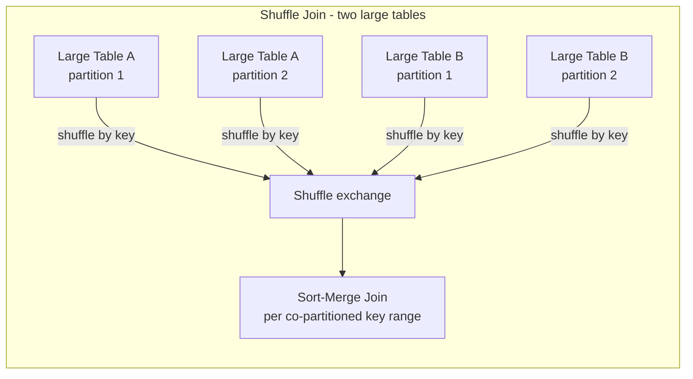
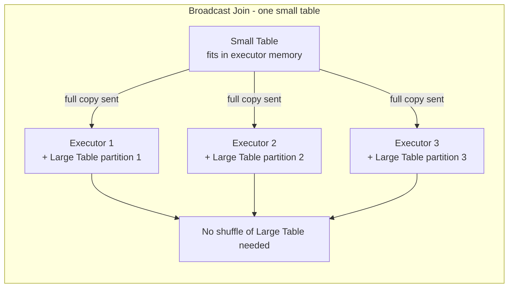
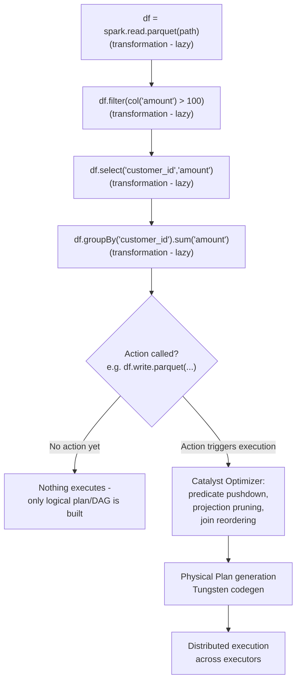
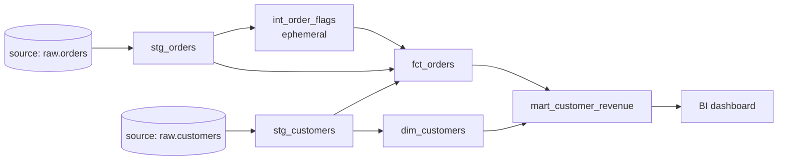
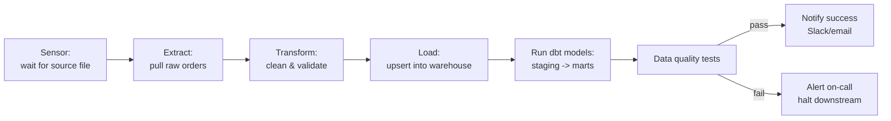

# SQL, PySpark, dbt & Data Engineering for Data Science Interviews

This file covers the practical data-engineering toolkit a senior (4 YoE) applied ML / data engineering candidate is expected to command: SQL joins and window functions, query optimization, PySpark's distributed execution model, dbt's transformation layer, and pipeline design patterns (batch vs streaming, idempotency, orchestration). Every pattern below is shown with real, runnable-looking SQL/PySpark/dbt code rather than described in the abstract. Use this as both a refresher and a source of interview-ready model answers.

## Table of Contents

1. [SQL Joins](#1-sql-joins)
2. [Window Functions](#2-window-functions)
3. [CTEs vs Subqueries](#3-ctes-vs-subqueries)
4. [GROUP BY / HAVING Nuances](#4-group-by--having-nuances)
5. [Query Optimization](#5-query-optimization)
6. [Common Query Patterns](#6-common-query-patterns)
7. [PySpark](#7-pyspark)
8. [dbt](#8-dbt)
9. [Data Pipeline Design](#9-data-pipeline-design)
10. [Quick Recall Sheet](#quick-recall-sheet)

---

## 1. SQL Joins

Sample schema used throughout this section:

```sql
CREATE TABLE customers (
    customer_id   INT PRIMARY KEY,
    customer_name VARCHAR(100),
    country       VARCHAR(50)
);

CREATE TABLE orders (
    order_id      INT PRIMARY KEY,
    customer_id   INT REFERENCES customers(customer_id),
    order_date    DATE,
    amount        NUMERIC(10,2)
);
```

Sample data:

| customer_id | customer_name | country |
|---|---|---|
| 1 | Alice | US |
| 2 | Bob | UK |
| 3 | Carol | IN |

| order_id | customer_id | order_date | amount |
|---|---|---|---|
| 101 | 1 | 2026-01-05 | 250.00 |
| 102 | 1 | 2026-01-10 | 100.00 |
| 103 | 2 | 2026-02-01 | 75.00 |
| 104 | NULL | 2026-02-15 | 40.00 |

### Inner Join

Returns only rows with a match in both tables.

```sql
SELECT c.customer_name, o.order_id, o.amount
FROM customers c
INNER JOIN orders o ON c.customer_id = o.customer_id;
-- Result: Alice/101, Alice/102, Bob/103  (Carol has no orders -> excluded,
-- order 104 has no customer_id match -> excluded)
```

### Left (Outer) Join

Returns all rows from the left table, with NULLs for unmatched right-side columns.

```sql
SELECT c.customer_name, o.order_id, o.amount
FROM customers c
LEFT JOIN orders o ON c.customer_id = o.customer_id;
-- Result: Alice/101, Alice/102, Bob/103, Carol/NULL/NULL
```

### Right (Outer) Join

Mirror of LEFT JOIN — all rows from the right table, NULLs for unmatched left side. Rarely used in practice because you can rewrite it as a LEFT JOIN by swapping table order; kept for completeness and portability.

```sql
SELECT c.customer_name, o.order_id, o.amount
FROM customers c
RIGHT JOIN orders o ON c.customer_id = o.customer_id;
-- Result: Alice/101, Alice/102, Bob/103, NULL/104 (order with no matching customer)
```

### Full Outer Join

Union of LEFT and RIGHT — all rows from both sides, NULLs where there's no match on either side. Useful for reconciliation (e.g., comparing two systems' data).

```sql
SELECT c.customer_name, o.order_id, o.amount
FROM customers c
FULL OUTER JOIN orders o ON c.customer_id = o.customer_id;
-- Result: Alice/101, Alice/102, Bob/103, Carol/NULL/NULL, NULL/104/40.00
```

### Self Join

Joining a table to itself, typically to compare rows within the same table (e.g., employee-manager, finding duplicate pairs, or sequential comparisons).

```sql
-- employees(employee_id, name, manager_id)
SELECT e.name AS employee, m.name AS manager
FROM employees e
LEFT JOIN employees m ON e.manager_id = m.employee_id;
```

### Cross Join

Cartesian product — every row of A paired with every row of B. Used deliberately for generating combinations (e.g., date x store_id grids for a forecasting feature table), and accidentally (a bug) when a join condition is missing.

```sql
-- generate a full (date, store) grid to left-join sales onto, so missing days show as zero-sales
SELECT d.calendar_date, s.store_id
FROM date_dim d
CROSS JOIN stores s;
```

### When Each Join Is Appropriate

| Join type | Use when |
|---|---|
| INNER | You only want rows that exist in both tables (e.g., orders that have a valid customer) |
| LEFT | You want to keep all rows from a "primary" entity even if the related fact doesn't exist (e.g., all customers, whether or not they ordered) |
| RIGHT | Same as LEFT but table order is reversed; usually rewritten as LEFT for style consistency |
| FULL OUTER | Reconciliation / diffing two datasets, finding mismatches in both directions |
| SELF | Comparing rows to other rows in the same table (hierarchies, sequences, duplicate detection) |
| CROSS | Generating combinations / a dense grid, or building all-pairs comparisons |

### Common Pitfall: Fan-Out Row Duplication

If you join a "one" table to a "many" table and then aggregate the "one" table's measures without first aggregating the "many" side, you silently multiply (double-count) the "one" side's values.

```sql
-- BUG: customers table joined to orders (1-to-many) then SUM(customer.lifetime_value)
-- double-counts lifetime_value once per order row.
SELECT c.customer_id, SUM(c.lifetime_value) AS bad_sum, SUM(o.amount) AS order_sum
FROM customers c
JOIN orders o ON c.customer_id = o.customer_id
GROUP BY c.customer_id;
-- If Alice has 2 orders, lifetime_value gets summed twice (fan-out).

-- FIX: pre-aggregate the many-side before joining, or aggregate customer-level
-- measures separately with a GROUP BY on customer_id only, or use a subquery/CTE.
WITH order_agg AS (
    SELECT customer_id, SUM(amount) AS total_orders
    FROM orders
    GROUP BY customer_id
)
SELECT c.customer_id, c.lifetime_value, oa.total_orders
FROM customers c
LEFT JOIN order_agg oa ON c.customer_id = oa.customer_id;
```

This is the single most common real-world join bug in analytics: revenue/metric numbers get inflated because a join fanned out rows before an aggregate was applied.

**Interview angle:**

*Q: "You joined `customers` to `orders` and then took `AVG(customer.satisfaction_score)`, but the number looks wrong — too many customers with high scores are overrepresented. What happened?"*

A: This is classic fan-out. Since `orders` is one-to-many against `customers`, the join produces one row per order, not one row per customer — so a customer with 10 orders has their `satisfaction_score` counted 10 times in the average, skewing it toward customers who order more frequently. The fix is to either (a) aggregate `orders` down to one row per `customer_id` in a CTE/subquery before joining, or (b) compute `AVG(satisfaction_score)` from a `SELECT DISTINCT customer_id, satisfaction_score` derived table, or (c) do the customer-level aggregation entirely separately from the order-level join and combine only at the end.

*Q: "When would you use a FULL OUTER JOIN in a real pipeline?"*

A: Typically for reconciliation: comparing a source system's records against a destination/warehouse table to find rows that exist only on one side (data-quality checks, migration validation), or diffing two versions of a dataset to see what changed, what's new, and what's missing — using `CASE WHEN a.id IS NULL THEN 'missing_in_a' WHEN b.id IS NULL THEN 'missing_in_b' ELSE 'matched' END` as a status column.

---

## 2. Window Functions

Window functions compute a value across a "window" of rows related to the current row, without collapsing rows the way `GROUP BY` does.

### ROW_NUMBER vs RANK vs DENSE_RANK

Consider this scores table with a tie:

| student | score |
|---|---|
| A | 95 |
| B | 90 |
| C | 90 |
| D | 80 |

```sql
SELECT
    student,
    score,
    ROW_NUMBER() OVER (ORDER BY score DESC) AS row_num,
    RANK()       OVER (ORDER BY score DESC) AS rank_num,
    DENSE_RANK() OVER (ORDER BY score DESC) AS dense_rank_num
FROM scores;
```

Result — note how ties are handled differently:

| student | score | row_num | rank_num | dense_rank_num |
|---|---|---|---|---|
| A | 95 | 1 | 1 | 1 |
| B | 90 | 2 | 2 | 2 |
| C | 90 | 3 | 2 | 2 |
| D | 80 | 4 | 4 | 3 |

- **ROW_NUMBER**: always unique, arbitrary tiebreak among equal values (1,2,3,4).
- **RANK**: ties share the same rank, but the *next* rank skips (1,2,2,4) — leaves a gap equal to the number of tied rows.
- **DENSE_RANK**: ties share the same rank, no gaps afterward (1,2,2,3).

### PARTITION BY

All three ranking functions (and every window function) commonly use `PARTITION BY` to restart the window per group:

```sql
SELECT
    department,
    employee,
    salary,
    RANK() OVER (PARTITION BY department ORDER BY salary DESC) AS dept_rank
FROM employees;
-- ranking restarts at 1 for every department
```

### LAG / LEAD

Access a prior or next row's value without a self-join — classic use case: period-over-period change.

```sql
SELECT
    product_id,
    month,
    revenue,
    LAG(revenue, 1) OVER (PARTITION BY product_id ORDER BY month) AS prev_month_revenue,
    revenue - LAG(revenue, 1) OVER (PARTITION BY product_id ORDER BY month) AS mom_change,
    LEAD(revenue, 1) OVER (PARTITION BY product_id ORDER BY month) AS next_month_revenue
FROM monthly_sales;
```

### Running Totals

```sql
SELECT
    order_date,
    amount,
    SUM(amount) OVER (
        ORDER BY order_date
        ROWS BETWEEN UNBOUNDED PRECEDING AND CURRENT ROW
    ) AS running_total
FROM orders
ORDER BY order_date;
```

### Moving Averages

```sql
SELECT
    order_date,
    amount,
    AVG(amount) OVER (
        ORDER BY order_date
        ROWS BETWEEN 6 PRECEDING AND CURRENT ROW
    ) AS moving_avg_7d
FROM daily_sales
ORDER BY order_date;
```

`ROWS BETWEEN N PRECEDING AND CURRENT ROW` gives a physical N-row window (good for "last N rows" regardless of gaps in dates); `RANGE BETWEEN INTERVAL 'N days' PRECEDING AND CURRENT ROW` gives a logical, calendar-based window (correct for "last N calendar days" even if some days are missing from the data) — an important distinction interviewers probe for.

**Interview angle:**

*Q: "Write a query to rank employees by salary within each department, and explain why you'd pick RANK vs DENSE_RANK vs ROW_NUMBER for a 'top 3 earners per department' report."*

A:
```sql
SELECT department, employee, salary, rnk
FROM (
    SELECT
        department, employee, salary,
        DENSE_RANK() OVER (PARTITION BY department ORDER BY salary DESC) AS rnk
    FROM employees
) t
WHERE rnk <= 3;
```
I'd use `DENSE_RANK` here if the business wants "the top 3 distinct salary tiers" (so two people tied at rank 1 both count, and the next distinct salary is rank 2). I'd use `ROW_NUMBER` if the business wants exactly 3 rows no matter what (arbitrary tiebreak). `RANK` is less common for "top N" because it can return more than N rows when there are ties at the boundary (e.g., rank 3 has 2 tied employees, rank 4 is skipped) or fewer natural next values — I'd clarify the requirement before choosing.

*Q: "How would you calculate month-over-month percentage growth in revenue per product using SQL?"*

A:
```sql
WITH monthly AS (
    SELECT
        product_id,
        DATE_TRUNC('month', order_date) AS month,
        SUM(amount) AS revenue
    FROM orders
    GROUP BY product_id, DATE_TRUNC('month', order_date)
)
SELECT
    product_id,
    month,
    revenue,
    LAG(revenue) OVER (PARTITION BY product_id ORDER BY month) AS prev_revenue,
    ROUND(
        100.0 * (revenue - LAG(revenue) OVER (PARTITION BY product_id ORDER BY month))
        / NULLIF(LAG(revenue) OVER (PARTITION BY product_id ORDER BY month), 0), 2
    ) AS pct_change
FROM monthly
ORDER BY product_id, month;
```
I aggregate to monthly revenue first (CTE), then use `LAG` partitioned by product to get the prior month, and guard the division with `NULLIF` to avoid divide-by-zero when the prior month had no revenue.

---

## 3. CTEs vs Subqueries

A **CTE** (`WITH x AS (...)`) is a named, temporary result set scoped to a single statement. A **subquery** is an inline nested query (in `FROM`, `WHERE`, or `SELECT`). Functionally, simple non-recursive CTEs and subqueries are often interchangeable — the choice is mostly about readability and reuse:

| Aspect | CTE | Subquery |
|---|---|---|
| Readability | High — named, top-down, reads like a pipeline | Lower — nested, harder to read when deep |
| Reusability within one query | Can be referenced multiple times in the same statement | Must be repeated/copy-pasted or wrapped in a derived table |
| Recursion | Supported (`WITH RECURSIVE`) | Not supported |
| Performance | Engine-dependent: Postgres < 12 always materializes CTEs (optimization fence); Postgres 12+ can inline them like subqueries unless marked `MATERIALIZED`; SQL Server / most modern optimizers typically inline CTEs like views | Typically inlined/optimized as part of the whole query plan |
| Scope | Query-local, cannot be indexed or reused across statements | Same |

The performance point is one of the most commonly mis-stated "facts" in interviews: it is **not universally true** that CTEs are always materialized. Modern Postgres (12+) will inline a CTE unless you force materialization with `AS MATERIALIZED`, or the CTE is referenced multiple times / has side effects. Always mention "it depends on the engine and version" rather than asserting a blanket rule.

```sql
-- Non-recursive CTE example: readable multi-step pipeline
WITH high_value_customers AS (
    SELECT customer_id, SUM(amount) AS total_spend
    FROM orders
    GROUP BY customer_id
    HAVING SUM(amount) > 1000
),
recent_orders AS (
    SELECT customer_id, MAX(order_date) AS last_order_date
    FROM orders
    GROUP BY customer_id
)
SELECT h.customer_id, h.total_spend, r.last_order_date
FROM high_value_customers h
JOIN recent_orders r ON h.customer_id = r.customer_id;
```

### Recursive CTE: Date Series

```sql
WITH RECURSIVE date_series AS (
    SELECT DATE '2026-01-01' AS dt         -- anchor member
    UNION ALL
    SELECT dt + INTERVAL '1 day'
    FROM date_series
    WHERE dt + INTERVAL '1 day' <= DATE '2026-01-31'  -- recursive member + termination
)
SELECT dt FROM date_series;
```

### Recursive CTE: Employee-Manager Hierarchy

```sql
WITH RECURSIVE org_chart AS (
    -- anchor: top-level employees (no manager)
    SELECT employee_id, name, manager_id, 1 AS level
    FROM employees
    WHERE manager_id IS NULL

    UNION ALL

    -- recursive: join each next level to the previous level's results
    SELECT e.employee_id, e.name, e.manager_id, oc.level + 1
    FROM employees e
    JOIN org_chart oc ON e.manager_id = oc.employee_id
)
SELECT * FROM org_chart ORDER BY level, employee_id;
```

**Interview angle:**

*Q: "Is a CTE always slower/faster than an equivalent subquery?"*

A: No — it's engine- and version-dependent. In older Postgres versions, CTEs were an "optimization fence": the planner materialized the CTE's result and couldn't push predicates from the outer query into it, which could hurt performance versus an equivalent subquery that the optimizer could freely rewrite. Postgres 12+ changed this default: non-recursive, single-reference CTEs are inlined like subqueries unless you explicitly write `AS MATERIALIZED`. Most other engines (SQL Server, Snowflake, BigQuery) generally treat CTEs as an inlined/rewritten part of the query plan rather than a materialization boundary. So the real answer is: use CTEs for readability and reuse, and only worry about materialization semantics if you hit an actual performance problem, at which point check `EXPLAIN` for your specific engine and version.

*Q: "Write a recursive CTE to find all reports (direct and indirect) under a given manager."*

A:
```sql
WITH RECURSIVE reports AS (
    SELECT employee_id, name, manager_id
    FROM employees
    WHERE manager_id = 101   -- the manager in question

    UNION ALL

    SELECT e.employee_id, e.name, e.manager_id
    FROM employees e
    JOIN reports r ON e.manager_id = r.employee_id
)
SELECT * FROM reports;
```
The anchor selects direct reports of employee 101; the recursive term repeatedly joins the employees table to the growing `reports` set until no more rows match (i.e., no more indirect reports are found), at which point the recursion terminates automatically.

---

## 4. GROUP BY / HAVING Nuances

`WHERE` filters individual rows **before** grouping/aggregation happens; `HAVING` filters **groups**, evaluated **after** aggregation, so it can reference aggregate expressions.

```sql
-- WHERE: keep only 2026 orders BEFORE aggregating
-- HAVING: keep only customers whose total (post-aggregation) exceeds 500
SELECT customer_id, SUM(amount) AS total_spend, COUNT(*) AS order_count
FROM orders
WHERE order_date >= '2026-01-01'
GROUP BY customer_id
HAVING SUM(amount) > 500 AND COUNT(*) >= 2
ORDER BY total_spend DESC;
```

Common aggregate functions: `COUNT(*)` (row count, including NULLs), `COUNT(column)` (non-NULL count), `COUNT(DISTINCT column)` (unique non-NULL values), `SUM`, `AVG`, `MIN`, `MAX`.

```sql
SELECT
    country,
    COUNT(*)                    AS total_orders,
    COUNT(DISTINCT customer_id) AS unique_customers,
    SUM(amount)                 AS total_revenue,
    AVG(amount)                 AS avg_order_value,
    MIN(amount)                 AS min_order,
    MAX(amount)                 AS max_order
FROM orders o
JOIN customers c ON o.customer_id = c.customer_id
GROUP BY country;
```

### Grouping Pitfall: Non-Aggregated Columns Not in GROUP BY

Standard SQL (and Postgres, BigQuery, Snowflake) requires every non-aggregated column in `SELECT` to appear in `GROUP BY`. MySQL historically allowed this silently (`ONLY_FULL_GROUP_BY` off by default in old versions) and would return an arbitrary row's value for the ungrouped column — a frequent source of subtle bugs.

```sql
-- INVALID in strict-mode engines (Postgres/Snowflake/BigQuery reject this):
SELECT customer_id, order_date, SUM(amount)
FROM orders
GROUP BY customer_id;
-- error: column "orders.order_date" must appear in the GROUP BY clause
-- or be used in an aggregate function

-- FIX 1: add order_date to GROUP BY (changes grouping granularity)
SELECT customer_id, order_date, SUM(amount)
FROM orders
GROUP BY customer_id, order_date;

-- FIX 2: aggregate order_date explicitly if you just want "a" representative value
SELECT customer_id, MAX(order_date) AS last_order_date, SUM(amount)
FROM orders
GROUP BY customer_id;
```

**Interview angle:**

*Q: "Why does `WHERE SUM(amount) > 100` fail, and what should you use instead?"*

A: `WHERE` is evaluated during the row-scan/filter phase, before `GROUP BY` has produced any aggregates — so `SUM(amount)` doesn't exist yet in that phase, and the engine throws an error like "aggregate functions are not allowed in WHERE". You need `HAVING SUM(amount) > 100`, which runs after grouping, once aggregates are computed. As a performance note: always push whatever filters you can into `WHERE` (row-level, pre-aggregation) rather than `HAVING`, since that reduces the number of rows the engine has to aggregate in the first place — filtering in `HAVING` when the condition doesn't actually depend on an aggregate is a common inefficiency.

*Q: "A junior engineer wrote `SELECT customer_id, order_date, SUM(amount) FROM orders GROUP BY customer_id` on MySQL and it ran without error, but the `order_date` values look wrong/inconsistent. What's happening?"*

A: MySQL (with `ONLY_FULL_GROUP_BY` disabled, which used to be the default) allows non-aggregated columns outside `GROUP BY` and just picks an arbitrary row's value from within each group — it's undefined which one. This isn't a bug in the sense of an error, but it's semantically meaningless output. On strict engines (Postgres, Snowflake, BigQuery) this same query would be rejected outright. The fix is to either add `order_date` to `GROUP BY` (changing the grain) or wrap it in an aggregate like `MAX(order_date)`/`MIN(order_date)` to make the intent explicit.

---

## 5. Query Optimization

### Indexing Basics

A **B-tree index** stores column values in sorted order with pointers back to the underlying rows, enabling `O(log n)` lookups instead of a full table scan. Indexes help most when:

- The column has **high cardinality** (many distinct values) — an index on a boolean `is_active` column with 90% `true` rarely helps, since the planner would still need to touch most of the table.
- The query filters/sorts/joins on the **leading column(s)** of the index. A composite index `(customer_id, order_date)` speeds up `WHERE customer_id = 5` and `WHERE customer_id = 5 AND order_date > ...`, but does **not** help a query that filters only on `order_date` (the leading edge is skipped).
- The query is selective (returns a small % of rows) — for a low-selectivity predicate, a sequential scan can be cheaper than jumping around via an index (random I/O), which is exactly what the optimizer decides via cost estimates.

```sql
CREATE INDEX idx_orders_customer_date ON orders (customer_id, order_date);

-- uses the index (leading column customer_id present)
SELECT * FROM orders WHERE customer_id = 42 AND order_date > '2026-01-01';

-- does NOT use idx_orders_customer_date efficiently (order_date is not the leading column)
SELECT * FROM orders WHERE order_date > '2026-01-01';
```

### Reading Execution Plans

```sql
EXPLAIN ANALYZE
SELECT c.customer_name, SUM(o.amount)
FROM customers c
JOIN orders o ON c.customer_id = o.customer_id
WHERE o.order_date >= '2026-01-01'
GROUP BY c.customer_name;
```

What to look for in the output:

- **Seq Scan vs Index Scan / Index Only Scan**: a sequential scan on a large table where you expected a selective filter often signals a missing index, stale statistics, or a predicate the planner can't use an index for (e.g., a function applied to the indexed column, `WHERE UPPER(email) = ...`, which defeats a plain index unless you have a functional/expression index).
- **Estimated rows vs actual rows** (`EXPLAIN ANALYZE` shows both): a huge gap indicates stale table statistics (`ANALYZE`/`VACUUM ANALYZE` needed) — the planner may then pick a bad join algorithm because its cardinality estimate was wrong.
- **Join algorithm chosen**: nested loop (fine for small outer sets), hash join (good for large, unsorted, equi-joins), merge join (good when both sides are already sorted on the join key). A nested loop join on two large unindexed tables is a red flag — usually means missing index or bad statistics.
- **Cost estimates** (`cost=0.43..8.51`): relative planner units, not wall-clock time — useful for comparing plans, but `ANALYZE` gives real elapsed time per node, which is what you actually trust when tuning.

### Avoiding SELECT *

```sql
-- BAD: pulls every column, including large/unused ones (blob columns, wide text fields),
-- increases I/O and network transfer, and silently breaks downstream consumers
-- if the table schema changes (columns added/reordered/dropped).
SELECT * FROM orders WHERE customer_id = 42;

-- GOOD: explicit column list — smaller payload, stable contract, and can enable
-- "covering index" / index-only-scan optimizations if all selected columns are indexed.
SELECT order_id, order_date, amount FROM orders WHERE customer_id = 42;
```

### Partition Pruning

If a table is physically partitioned by a column (commonly a date), and the query filters on that same column, the engine can skip reading partitions that can't possibly match — a huge I/O saving for large time-series fact tables.

```sql
-- Table partitioned by order_date (e.g., daily or monthly partitions in
-- Postgres declarative partitioning, BigQuery partitioned tables, or a Hive/Spark table).
CREATE TABLE orders (
    order_id INT,
    customer_id INT,
    order_date DATE,
    amount NUMERIC
) PARTITION BY RANGE (order_date);

-- Query filters on the partition key -> engine prunes to only the Jan 2026 partition(s),
-- never scans Feb/Mar/... data at all.
SELECT SUM(amount)
FROM orders
WHERE order_date >= '2026-01-01' AND order_date < '2026-02-01';
```

In distributed engines (Spark, BigQuery, Snowflake), partition pruning is often the single biggest lever for cutting cost/latency on large tables — always design partition keys around the columns most queries filter on (e.g., ingestion date), and always filter on that literal column rather than wrapping it in a function (`WHERE DATE(order_date) = ...` can defeat pruning if it prevents partition-key recognition; prefer `WHERE order_date >= X AND order_date < Y`).

**Interview angle:**

*Q: "A query got slow after the table grew to 50M rows. Walk me through how you'd diagnose it."*

A: First I'd run `EXPLAIN ANALYZE` to compare the planner's row estimates against actual rows returned at each node — a large mismatch means stale statistics, so I'd run `ANALYZE` on the table first and re-check. Next I'd look at the scan type: if I see a `Seq Scan` on a highly selective filter, I'd check whether an index exists on the filtered column(s), and if it does, why the planner isn't using it (function wrapping the column, wrong data type causing an implicit cast, or the predicate genuinely not selective enough that the planner correctly prefers a seq scan). I'd check the join algorithm — a nested loop over two large sets suggests missing indexes on join keys. I'd also check whether the table is partitioned and whether the query's `WHERE` clause actually hits the partition key so pruning can kick in. Finally I'd check for `SELECT *` bloating I/O and confirm whether a covering index could let the query be answered as an index-only scan.

*Q: "Why would a composite index on `(customer_id, order_date)` not help a query filtering only on `order_date`?"*

A: B-tree composite indexes are sorted by the leading column first, then the second column within each leading-column value — like a phone book sorted by last name then first name. If you only have the first name (`order_date`) and not the last name (`customer_id`), you can't binary-search the index efficiently; you'd effectively have to scan the whole thing, which the optimizer knows, so it just does a sequential table scan instead. If `order_date`-only lookups are also common, you'd want a separate index on `order_date` alone, or reverse the column order if the `order_date`-only query is more frequent/selective than the `customer_id`-leading queries.

---

## 6. Common Query Patterns

### Top-N Per Group

```sql
WITH ranked AS (
    SELECT
        product_category,
        product_name,
        revenue,
        ROW_NUMBER() OVER (PARTITION BY product_category ORDER BY revenue DESC) AS rn
    FROM product_sales
)
SELECT product_category, product_name, revenue
FROM ranked
WHERE rn <= 3;   -- top 3 products by revenue within each category
```

### Gaps and Islands (Consecutive Login Days)

Classic technique: subtract a `ROW_NUMBER()` (sequential within user) from the actual date — for consecutive dates, this difference stays constant, forming "islands" you can group on.

```sql
WITH login_days AS (
    SELECT DISTINCT user_id, login_date
    FROM user_logins
),
numbered AS (
    SELECT
        user_id,
        login_date,
        ROW_NUMBER() OVER (PARTITION BY user_id ORDER BY login_date) AS rn
    FROM login_days
),
islands AS (
    SELECT
        user_id,
        login_date,
        login_date - (rn * INTERVAL '1 day') AS island_group  -- constant within a streak
    FROM numbered
)
SELECT
    user_id,
    MIN(login_date) AS streak_start,
    MAX(login_date) AS streak_end,
    COUNT(*)          AS streak_length
FROM islands
GROUP BY user_id, island_group
ORDER BY user_id, streak_start;
```

Why it works: if `login_date` is consecutive within a user's rows, then `login_date - rn` (in day units) is identical across the whole consecutive run — because both `login_date` and `rn` advance by exactly 1 each row. Any gap in dates breaks the run, changing the `island_group` value and starting a new group.

### Deduplication

```sql
-- Approach 1 (portable): ROW_NUMBER, then keep rn = 1
WITH deduped AS (
    SELECT
        *,
        ROW_NUMBER() OVER (
            PARTITION BY email               -- dedup key(s)
            ORDER BY updated_at DESC          -- keep the most recently updated row
        ) AS rn
    FROM customers_raw
)
SELECT * FROM deduped WHERE rn = 1;

-- Approach 2 (Postgres-specific): DISTINCT ON
SELECT DISTINCT ON (email) *
FROM customers_raw
ORDER BY email, updated_at DESC;
```

`DISTINCT ON (email)` keeps the first row per `email` after sorting by `email, updated_at DESC` — functionally equivalent to the `ROW_NUMBER` approach but more concise (Postgres-only syntax).

**Interview angle:**

*Q: "Given a table of raw customer records with duplicate emails from multiple source-system syncs, write a query to keep only the most recent version of each customer."*

A: (See the deduplication snippet above.) I'd partition by the natural dedup key(s) — here `email` — order by `updated_at DESC` (or a source-priority column, ties broken by a surrogate `_ingested_at`), and keep `rn = 1`. I'd also add a secondary tiebreaker (e.g., `ORDER BY updated_at DESC, source_priority ASC, customer_id DESC`) to make the result deterministic in case of exact `updated_at` ties, since non-deterministic dedup can cause the pipeline to produce different results on re-runs.

*Q: "Find users who logged in on at least 5 consecutive days in the last 30 days."*

A: I'd build the gaps-and-islands `island_group` as shown above, restricted to `login_date >= CURRENT_DATE - 30`, then filter groups `HAVING COUNT(*) >= 5`. The key insight to communicate is the `date - row_number()` trick that converts a "find consecutive runs" problem into a plain `GROUP BY`.

---

## 7. PySpark

### RDD vs DataFrame API

| Aspect | RDD | DataFrame |
|---|---|---|
| Abstraction level | Low-level distributed collection of JVM/Python objects | High-level, schema-aware, table-like |
| Optimization | None — you control exact execution | Catalyst optimizer rewrites/optimizes the logical plan |
| Type safety | Compile-time typed (Scala/Java); Python RDDs are untyped at the API level | Schema-enforced, but no compile-time type checks in PySpark |
| Performance | Generally slower — no predicate pushdown, no columnar execution (Tungsten) | Faster — benefits from whole-stage codegen, columnar storage, pushdown |
| Ease of use | Verbose, functional (`map`, `flatMap`, `reduceByKey`) | Declarative, SQL-like (`select`, `filter`, `groupBy`, `agg`) |
| When still used | Custom partition-level logic (`mapPartitions` with fine control), non-tabular/unstructured data, legacy code, algorithms that don't map cleanly to relational ops | Default choice for 95%+ of modern Spark work |

```python
# RDD example: low-level word count
rdd = sc.textFile("s3://bucket/logs.txt")
counts = (rdd.flatMap(lambda line: line.split(" "))
             .map(lambda word: (word, 1))
             .reduceByKey(lambda a, b: a + b))

# DataFrame equivalent: Catalyst-optimized, columnar
from pyspark.sql import functions as F
df = spark.read.text("s3://bucket/logs.txt")
words = df.select(F.explode(F.split(df.value, " ")).alias("word"))
counts_df = words.groupBy("word").count()
```

You'd still drop to RDD (or `df.rdd.mapPartitions(...)`) for things like custom per-partition stateful logic, calling an external library that only accepts Python iterators row-by-row, or fine-grained control over partition-level side effects (e.g., opening one DB connection per partition) that don't have a clean DataFrame equivalent.

### Partitioning Strategy: repartition() vs coalesce()

Spark splits a DataFrame into partitions distributed across executors; each partition is processed by one task. Skewed or too few/many partitions hurt parallelism and cause straggler tasks.

```python
# repartition(): full shuffle across the cluster. Can INCREASE or DECREASE
# partition count, and redistributes data evenly (fixes skew) — but the
# shuffle itself costs network + disk I/O + serialization.
df_repartitioned = df.repartition(200)                 # by partition count
df_by_key = df.repartition(200, "customer_id")          # hash-partition by key (helps co-locate joins/aggs on that key)

# coalesce(): no full shuffle — merges existing partitions locally.
# Can only DECREASE partition count. Much cheaper, but can leave uneven
# partition sizes since it just combines adjacent partitions rather than
# rebalancing data.
df_coalesced = df.coalesce(10)
```

Rule of thumb: use `coalesce()` when writing out a large number of small output files down to fewer, larger files (e.g., before writing to S3/HDFS, to avoid the "small files problem"), when you don't need to fix skew. Use `repartition()` when you need to actually rebalance data (fix skew) or increase parallelism before a wide operation, and can afford the shuffle cost.

### Shuffling

A **shuffle** redistributes data across the cluster so that rows with the same key end up on the same executor/partition — required whenever an operation needs to combine data that isn't already co-located. Triggers: `groupBy`/`agg`, joins where the two sides aren't already partitioned identically on the join key, `repartition()`, `distinct()`, `orderBy`/`sort` (global sort). Shuffles are expensive because they involve: writing intermediate shuffle files to local disk on the source executors, transferring data over the network to destination executors, and (de)serializing data at both ends — all of which dwarf in-memory, same-partition computation.

```python
# Triggers a shuffle: groupBy aggregates rows across all partitions by key
revenue_by_customer = orders_df.groupBy("customer_id").agg(F.sum("amount").alias("total"))

# Triggers a shuffle: join on a key that isn't co-partitioned between the two DataFrames
joined = orders_df.join(customers_df, on="customer_id", how="inner")
```

### Broadcast Join vs Shuffle (Sort-Merge) Join





A **broadcast join** ships a full copy of the small table to every executor, so each executor can join it locally against its own partition of the large table — completely avoiding a shuffle of the large table. Appropriate when one side is small enough to fit comfortably in each executor's memory (governed by `spark.sql.autoBroadcastJoinThreshold`, default 10MB; Spark will auto-broadcast below this threshold, and you can raise it or force it explicitly).

```python
from pyspark.sql.functions import broadcast

# Force a broadcast join explicitly (useful when Spark's size estimate is off,
# e.g., after filtering, or when the table is borderline the auto-threshold)
large_orders_df = spark.table("orders")            # large fact table, billions of rows
small_countries_df = spark.table("country_lookup")  # small dimension table, ~200 rows

result = large_orders_df.join(
    broadcast(small_countries_df),
    on="country_code",
    how="left"
)

# Configure the auto-broadcast threshold globally (bytes)
spark.conf.set("spark.sql.autoBroadcastJoinThreshold", 50 * 1024 * 1024)  # 50MB
```

For two large tables, Spark defaults to a **sort-merge join** (or shuffle hash join): both sides are shuffled so matching keys land on the same partition, then (typically) sorted and merged. This is unavoidable when neither side is small enough to broadcast — the goal in tuning is then to minimize shuffle volume (e.g., pre-filter/pre-aggregate before the join, or bucket both tables by the join key at write time to avoid a runtime shuffle entirely).

### Lazy Evaluation, DAG, and Catalyst Optimizer

Spark **transformations** (`select`, `filter`, `join`, `withColumn`, `groupBy`) are lazy — they only build up a logical execution plan (a DAG of operations); no data is actually read or computed. **Actions** (`collect()`, `count()`, `show()`, `write()`) trigger the actual execution. Before executing, the **Catalyst optimizer** rewrites the logical plan: predicate pushdown (pushing filters as close to the data source as possible, e.g., into a Parquet file's row-group metadata), projection pruning (only reading columns actually referenced downstream), constant folding, and join reordering (choosing a cheaper join order/algorithm based on cost estimates) — all before generating the physical plan and executing it via Spark's Tungsten execution engine (whole-stage code generation, columnar processing).



```python
# All of these are lazy - nothing executes yet, just logical-plan construction:
df = spark.read.parquet("s3://bucket/orders/")
filtered = df.filter(F.col("amount") > 100)
projected = filtered.select("customer_id", "amount")
grouped = projected.groupBy("customer_id").agg(F.sum("amount").alias("total"))

# .explain(True) shows the logical AND optimized/physical plan without running it
grouped.explain(True)

# Only this action actually triggers execution across the cluster:
grouped.write.mode("overwrite").parquet("s3://bucket/output/")
```

**Interview angle:**

*Q: "Two DataFrames need to be joined — one is a 2GB dimension table, the other a 500GB fact table. How do you make this join fast?"*

A: Since the dimension table is small (well under the default `spark.sql.autoBroadcastJoinThreshold`, or at least small enough to raise the threshold to accommodate it), I'd force a broadcast join with `df_fact.join(broadcast(df_dim), on="key")`. This sends a full copy of the 2GB table to every executor once, and lets each executor join it locally against its own partition of the 500GB fact table — completely avoiding a shuffle of the 500GB side, which would otherwise be the dominant cost (disk spill + network transfer + serialization of hundreds of GB). I'd verify Spark actually picked the broadcast plan via `.explain()` (look for `BroadcastHashJoin` in the physical plan rather than `SortMergeJoin`), and if the dimension table is borderline the size threshold, I'd explicitly bump `spark.sql.autoBroadcastJoinThreshold` or use the `broadcast()` hint rather than relying on Spark's estimate, since estimates after several transformations can be inaccurate.

*Q: "Explain why calling `.count()` twice on the same DataFrame after a transformation chain can be slow, and how you'd fix it."*

A: Because transformations are lazy, Spark doesn't materialize any intermediate result — every action re-executes the entire DAG of transformations from the original data source. So calling `.count()` twice re-reads the source and reapplies every `filter`/`join`/`groupBy` twice, doubling the cost. The fix is to `.cache()` or `.persist()` the DataFrame after the transformations if it will be reused by multiple actions, which materializes it (in memory and/or disk, depending on storage level) after the first action computes it, so subsequent actions read from the cached data instead of recomputing the whole DAG. I'd also unpersist it once it's no longer needed to free executor memory.

*Q: "What does `repartition(200, 'customer_id')` actually do differently from `coalesce(200)`, and when would each cause a problem?"*

A: `repartition(200, "customer_id")` performs a full shuffle, hash-partitioning rows by `customer_id` into exactly 200 partitions — this rebalances data and co-locates same-key rows, which is essential before a `groupBy`/join on that key, but it costs network and disk I/O proportional to the full dataset size. `coalesce(200)` just merges existing partitions together without a full shuffle (cheaper), but since it doesn't redistribute individual rows across partitions, it can produce very uneven partition sizes if the input was already skewed — e.g., if one partition already had 10x the data of others, coalescing doesn't fix that imbalance, and you'll still get a straggler task. So `coalesce` risks data skew, while `repartition` risks (accepts) shuffle cost to actually fix skew.

---

## 8. dbt

### Materializations

| Materialization | Behavior | Storage | Typical use |
|---|---|---|---|
| `view` | Query re-run every time it's selected from | No data stored, just a SQL view definition | Lightweight transformations, frequently-changing logic, low query volume downstream |
| `table` | Fully rebuilt (dropped & recreated, or created-then-swapped) on every `dbt run` | Fully materialized on disk | Models queried often / by BI tools where query-time recomputation would be too slow |
| `incremental` | Only new/changed rows are processed and merged/appended on each run (after the first full build) | Fully materialized, but built incrementally | Large fact tables where full rebuilds are too slow/expensive |
| `ephemeral` | Not built as a database object at all — dbt inlines it as a CTE into every downstream model that references it | Nothing persisted | Small reusable logic snippets / intermediate staging steps you never need to query directly |

```sql
-- models/staging/stg_orders.sql
{{ config(materialized='view') }}

SELECT
    order_id,
    customer_id,
    order_date,
    amount
FROM {{ source('raw', 'orders') }}
```

```sql
-- models/marts/fct_orders.sql
{{ config(materialized='table') }}

SELECT
    o.order_id,
    o.customer_id,
    o.order_date,
    o.amount,
    c.country
FROM {{ ref('stg_orders') }} o
JOIN {{ ref('stg_customers') }} c ON o.customer_id = c.customer_id
```

```sql
-- models/staging/int_order_flags.sql  (ephemeral: inlined as a CTE downstream, never built as its own table/view)
{{ config(materialized='ephemeral') }}

SELECT
    order_id,
    CASE WHEN amount > 500 THEN TRUE ELSE FALSE END AS is_high_value
FROM {{ ref('stg_orders') }}
```

### Incremental Models

```sql
-- models/marts/fct_orders_incremental.sql
{{
    config(
        materialized='incremental',
        unique_key='order_id',
        incremental_strategy='merge'
    )
}}

SELECT
    order_id,
    customer_id,
    order_date,
    amount,
    updated_at
FROM {{ source('raw', 'orders') }}


    -- only pull rows updated since the last run's max watermark already in the table
    WHERE updated_at > (SELECT MAX(updated_at) FROM {{ this }})

```

`is_incremental()` evaluates to `False` on the first run (or a full-refresh run), so the model does a full initial load; on subsequent runs, it's `True`, and the `WHERE` clause restricts the query to only new/changed source rows, then merges them into the existing table using `unique_key`.

Merge strategies:

| Strategy | Behavior | When to use |
|---|---|---|
| `append` | Blindly inserts new rows, no dedup/update of existing rows | Pure event/log data where rows are immutable and never updated (e.g., append-only clickstream) |
| `merge` | Upserts: updates existing rows matching `unique_key`, inserts new ones | Slowly-changing dimension-like facts where a row can be updated after first landing (e.g., order status changes) — needs warehouse support for `MERGE` (Snowflake, BigQuery, Databricks) |
| `delete+insert` | Deletes rows matching the incremental predicate/unique key from the target, then inserts the new batch | Warehouses without native `MERGE` support, or when you want to fully replace a set of rows (e.g., reprocessing a whole day's partition) |

```sql
-- delete+insert example: reprocess a full day's partition idempotently
{{
    config(
        materialized='incremental',
        unique_key='order_id',
        incremental_strategy='delete+insert',
        partition_by={'field': 'order_date', 'data_type': 'date'}
    )
}}

SELECT order_id, customer_id, order_date, amount
FROM {{ source('raw', 'orders') }}


    WHERE order_date >= (SELECT MAX(order_date) FROM {{ this }}) - INTERVAL '3 day'

```

### Testing

```yaml
# models/marts/schema.yml
version: 2

models:
  - name: fct_orders
    description: "One row per order, joined to customer attributes."
    columns:
      - name: order_id
        description: "Primary key of the orders fact table."
        tests:
          - unique
          - not_null
      - name: customer_id
        tests:
          - not_null
          - relationships:
              to: ref('dim_customers')
              field: customer_id
      - name: order_status
        tests:
          - accepted_values:
              values: ['pending', 'shipped', 'delivered', 'cancelled']
```

- `unique` — no duplicate values in the column.
- `not_null` — column is never NULL.
- `accepted_values` — column only contains values from an allowed list.
- `relationships` — every value in this column exists in the referenced table's column (referential integrity check).

Custom (singular) test — a SQL file under `tests/` that should return **zero rows** for the test to pass (any returned row is treated as a failing record):

```sql
-- tests/assert_no_negative_order_amounts.sql
-- This test PASSES when it returns 0 rows.
SELECT order_id, amount
FROM {{ ref('fct_orders') }}
WHERE amount < 0
```

Documentation: `.yml` `description:` fields (as above) plus `dbt docs generate` builds a static documentation site from the project's models, columns, tests, and sources; `dbt docs serve` launches it locally, including the interactive **lineage graph** — a DAG showing how models connect via `ref()`/`source()` calls, letting you visually trace a downstream mart back to its raw source tables.



**Interview angle:**

*Q: "When would you choose `incremental` over `table` materialization, and what's the tradeoff?"*

A: I'd use `incremental` for large fact tables where a full rebuild (`table`) would take too long or cost too much compute every run — e.g., a billions-of-rows events table where only the last day's data changed. The tradeoff is added complexity: I need to define a correct `unique_key` and incremental filter (usually a watermark like `updated_at` or a partition column), handle late-arriving/updated records correctly (which is why `merge` exists instead of blind `append`), and periodically run a `--full-refresh` to correct any drift or handle upstream schema/logic changes that the incremental filter would otherwise miss. `table` is simpler and safer correctness-wise (it's always fully consistent with current source data) but doesn't scale to very large volumes without becoming prohibitively slow/expensive.

*Q: "Why does dbt make ephemeral models 'invisible' in the warehouse, and when is that a problem?"*

A: Ephemeral models are compiled inline as a CTE into every model that `ref()`s them — they're never executed as a standalone `CREATE TABLE`/`CREATE VIEW`, which avoids cluttering the warehouse with tiny intermediate objects and can reduce the number of round-trips for simple transformation steps. The tradeoff is that you can't query an ephemeral model directly for debugging (it doesn't exist as an object), and if it's referenced by many downstream models, the same CTE logic gets recompiled/re-executed redundantly in each of them rather than computed once and reused — so for anything moderately expensive or widely reused, `view` or `table` is usually the better choice; ephemeral is best reserved for small, cheap, single- or few-consumer logic.

*Q: "Write a custom dbt test that fails if any `fct_orders` row has an `order_date` earlier than the associated customer's `signup_date`."*

A:
```sql
-- tests/assert_order_not_before_signup.sql
SELECT f.order_id, f.order_date, c.signup_date
FROM {{ ref('fct_orders') }} f
JOIN {{ ref('dim_customers') }} c ON f.customer_id = c.customer_id
WHERE f.order_date < c.signup_date
```
This returns zero rows when the invariant holds (no order predates its customer's signup) and returns the offending rows otherwise, which dbt surfaces as failed test records for debugging.

---

## 9. Data Pipeline Design

### Batch vs Streaming

| Aspect | Batch | Streaming |
|---|---|---|
| Latency | Minutes to hours/days (scheduled runs) | Sub-second to seconds |
| Throughput | Optimized for large volume processed together | Optimized for continuous, per-event/micro-batch processing |
| Infra complexity | Lower — simpler retry/idempotency model | Higher — needs stateful processing, watermarking, exactly-once semantics |
| Cost model | Often cheaper per-record (amortized over large batches) | Generally more expensive per-record (always-on infra) |
| Example use case | Daily demand-forecasting feature refresh, nightly BI aggregates, monthly billing | Real-time fraud detection, live dashboards, alerting on anomalies |

Choose streaming only when the business actually needs sub-minute freshness and can justify the added operational complexity (checkpointing, exactly-once guarantees, backpressure handling); otherwise batch (or "micro-batch," e.g., an hourly Spark job) is simpler, cheaper, and easier to debug/reprocess.

### Idempotency

A pipeline is **idempotent** if running it multiple times with the same input produces the same end state as running it once — critical because retries (after a transient failure, a scheduler re-trigger, or a manual backfill) are inevitable, and a non-idempotent pipeline will duplicate or corrupt data on re-run.

```sql
-- NON-idempotent: a blind INSERT re-run after a retry duplicates every row
INSERT INTO fct_orders SELECT * FROM staging_orders WHERE load_date = '2026-08-14';

-- IDEMPOTENT pattern 1: MERGE/upsert on a natural key
MERGE INTO fct_orders AS target
USING staging_orders AS source
ON target.order_id = source.order_id
WHEN MATCHED THEN UPDATE SET
    amount = source.amount,
    order_date = source.order_date,
    updated_at = source.updated_at
WHEN NOT MATCHED THEN INSERT (order_id, customer_id, order_date, amount, updated_at)
VALUES (source.order_id, source.customer_id, source.order_date, source.amount, source.updated_at);

-- IDEMPOTENT pattern 2: partition overwrite (delete-then-insert scoped to the exact partition being reprocessed)
DELETE FROM fct_orders WHERE load_date = '2026-08-14';
INSERT INTO fct_orders SELECT * FROM staging_orders WHERE load_date = '2026-08-14';
-- (In Spark: df.write.mode("overwrite").option("partitionOverwriteMode", "dynamic")
--  .partitionBy("load_date").parquet(path) achieves the same thing atomically per-partition.)
```

Both patterns guarantee that re-running the exact same batch produces the exact same final state, rather than accumulating duplicates.

### Orchestration

Orchestration tools (Airflow, Dagster, Prefect) manage **task dependencies** (a DAG of steps, e.g., extract → transform → load → notify), **scheduling** (cron-like triggers, e.g., daily at 2 AM UTC), **retries** (automatic re-attempts with backoff on transient failures, e.g., a flaky API), and **sensors** (tasks that wait/poll for an external condition before proceeding, e.g., "wait until the upstream file lands in S3" or "wait until an upstream DAG run completes").

```python
# Airflow-style DAG example (illustrative)
from airflow import DAG
from airflow.operators.python import PythonOperator
from airflow.sensors.filesystem import FileSensor
from datetime import datetime, timedelta

default_args = {
    "retries": 3,
    "retry_delay": timedelta(minutes=5),
}

with DAG(
    dag_id="daily_orders_pipeline",
    schedule_interval="0 2 * * *",   # 2 AM UTC daily
    start_date=datetime(2026, 1, 1),
    default_args=default_args,
    catchup=False,
) as dag:

    wait_for_source_file = FileSensor(
        task_id="wait_for_source_file",
        filepath="/data/landing/orders_{{ ds }}.csv",
        poke_interval=60,
        timeout=60 * 60,
    )

    extract = PythonOperator(task_id="extract_orders", python_callable=extract_orders_fn)
    transform = PythonOperator(task_id="transform_orders", python_callable=transform_orders_fn)
    load = PythonOperator(task_id="load_to_warehouse", python_callable=load_orders_fn)
    run_dbt = PythonOperator(task_id="run_dbt_models", python_callable=run_dbt_fn)
    notify = PythonOperator(task_id="notify_success", python_callable=notify_fn)

    wait_for_source_file >> extract >> transform >> load >> run_dbt >> notify
```



**Interview angle:**

*Q: "You're designing a pipeline to power a demand-forecasting model that retrains nightly. Would you build it batch or streaming, and why?"*

A: Batch — the model retrains nightly, so there's no business value in sub-minute data freshness; a daily (or hourly, if intraday signals matter) batch job that aggregates the prior day's sales/inventory/pricing data is far simpler to build, test, backfill, and debug than a streaming pipeline, and it's cheaper to run since it doesn't need always-on stateful infrastructure. I'd reserve streaming for use cases where the latency requirement is inherent to the business problem itself — e.g., fraud detection, where a batch job running once a day would let fraudulent transactions succeed for up to 24 hours before being caught, defeating the purpose.

*Q: "Your nightly load job failed halfway through and was automatically retried by Airflow. How do you make sure this doesn't corrupt the warehouse table?"*

A: The core requirement is idempotency. I'd design the load step as a `MERGE`/upsert keyed on the natural business key (e.g., `order_id`) rather than a blind `INSERT`, so re-running the exact same batch updates existing rows instead of duplicating them. For a partition-based load (e.g., a specific `load_date`), I'd use a delete-then-insert (or Spark's dynamic partition overwrite) scoped strictly to that partition, so a retry deletes and reinserts only that day's data rather than touching or duplicating anything else. I'd also make the extract step itself deterministic/re-runnable (pulling the same well-defined date range or watermark range every time) so that a retried DAG run produces byte-for-byte the same output as the original attempt.

*Q: "What's the role of a sensor in an orchestration DAG, and what's a risk of using them poorly?"*

A: A sensor is a task that blocks (polls on an interval) until an external condition is met — e.g., waiting for an upstream file to land in S3, or waiting for another team's DAG to finish — before letting downstream tasks proceed, which prevents the pipeline from processing incomplete or stale data. The risk of misusing sensors is resource exhaustion: a naive sensor that polls continuously in "poke" mode occupies a worker slot for its entire wait duration, which can starve the scheduler of capacity for other tasks if many sensors are waiting simultaneously — the fix is using "reschedule" mode (which releases the worker slot between polls) or event-driven triggers (e.g., an S3 event notification that pushes a signal rather than the DAG pulling/polling), and always setting a sane `timeout` so a permanently-missing upstream dependency fails the DAG explicitly instead of hanging forever.

---

## Additional Common Interview Questions

A grab-bag of other classic SQL / PySpark / dbt / data-engineering questions that come up frequently in interviews, covering ground not already addressed above.

**Q: Write a query to find the second-highest salary in each department.**

```sql
-- Approach 1: DENSE_RANK (recommended) - handles ties the way most interviewers expect:
-- if two employees are tied for the highest salary, the "second highest" is the next
-- *distinct* salary value, not simply "the second row".
SELECT department, employee, salary
FROM (
    SELECT
        department, employee, salary,
        DENSE_RANK() OVER (PARTITION BY department ORDER BY salary DESC) AS salary_rank
    FROM employees
) ranked
WHERE salary_rank = 2;

-- Approach 2: correlated subquery (works even on engines/versions without window functions)
SELECT e1.department, e1.employee, e1.salary
FROM employees e1
WHERE 1 = (
    SELECT COUNT(DISTINCT e2.salary)
    FROM employees e2
    WHERE e2.department = e1.department
      AND e2.salary > e1.salary
);
```

I'd default to `DENSE_RANK` because it correctly treats "second highest" as the second-highest *distinct* value — `ROW_NUMBER` would instead just grab an arbitrary one of the tied top earners as if they were "1st and 2nd," which is usually not what's intended. The correlated-subquery version is worth knowing as a fallback for engines without window function support, or as a way to demonstrate you understand the underlying logic (count how many distinct salaries are strictly greater; a row is "second highest" when exactly one salary beats it) rather than just memorizing `DENSE_RANK`.

**Q: How would you find duplicate rows in a table using SQL?**

```sql
-- Duplicate on a business key (e.g. two "same" customers loaded twice with different customer_id)
SELECT email, COUNT(*) AS cnt
FROM customers_raw
GROUP BY email
HAVING COUNT(*) > 1;

-- Full-row duplicates (every column identical - true copy-paste duplicates)
SELECT customer_id, name, email, signup_date, COUNT(*) AS cnt
FROM customers_raw
GROUP BY customer_id, name, email, signup_date   -- list every column
HAVING COUNT(*) > 1;

-- Pull back the actual duplicate row instances (not just the counts) to inspect them
SELECT *
FROM (
    SELECT *, COUNT(*) OVER (PARTITION BY email) AS dup_count
    FROM customers_raw
) t
WHERE dup_count > 1
ORDER BY email;
```

The `GROUP BY ... HAVING COUNT(*) > 1` pattern is the standard way to *detect* duplicates and get a summary count per key; note the distinction between deduplicating on a meaningful business key (e.g. `email`) versus a literal full-row duplicate (every column, including the primary key, identical — which usually only happens from a botched double-load). The third form using `COUNT(*) OVER (PARTITION BY ...)` is handy when you want the actual offending rows back (not just aggregated counts) so you can inspect them before deciding how to deduplicate — see the earlier Deduplication section for the follow-up `ROW_NUMBER() ... WHERE rn = 1` pattern once you've confirmed which rows to drop.

**Q: What's the difference between `UNION` and `UNION ALL`, and when would using the wrong one cause a bug?**

```sql
-- UNION: implicitly de-duplicates the combined result set across ALL columns.
-- Requires a sort/hash-distinct pass over the entire combined output.
SELECT customer_id, order_date FROM orders_2025
UNION
SELECT customer_id, order_date FROM orders_2026;

-- UNION ALL: simple concatenation, no dedup pass at all - cheaper.
SELECT customer_id, order_date FROM orders_2025
UNION ALL
SELECT customer_id, order_date FROM orders_2026;
```

Two distinct failure modes: (1) **Correctness bug** — if the two inputs can legitimately contain identical rows that both need to be counted (e.g., combining two event-log tables where the same `customer_id`/`order_date` pair really did occur twice, or reconciling partitioned tables where you expect the union to preserve every row), using `UNION` silently drops one of them, undercounting. (2) **Performance bug** — the reverse case: if you already know (from how the data is partitioned, e.g., `orders_2025` and `orders_2026` can never overlap) that there are no duplicates to remove, using `UNION` instead of `UNION ALL` forces an unnecessary full sort/hash-distinct pass over the entire combined result, which is pure wasted cost at scale (potentially the single most expensive operation in the whole query on a multi-billion-row union). The rule of thumb: default to `UNION ALL` unless you have a specific, verified reason duplicates need removing — never use plain `UNION` "just in case."

**Q: How would you pivot rows into columns in SQL?**

```sql
-- Portable everywhere (Postgres, MySQL, BigQuery, Snowflake, SQL Server): CASE WHEN + aggregate
SELECT
    customer_id,
    SUM(CASE WHEN order_status = 'pending'   THEN 1 ELSE 0 END) AS pending_orders,
    SUM(CASE WHEN order_status = 'shipped'   THEN 1 ELSE 0 END) AS shipped_orders,
    SUM(CASE WHEN order_status = 'cancelled' THEN 1 ELSE 0 END) AS cancelled_orders
FROM orders
GROUP BY customer_id;

-- Native PIVOT operator (SQL Server / Snowflake syntax) - same result, more concise
SELECT customer_id, pending, shipped, cancelled
FROM (SELECT customer_id, order_status FROM orders) AS src
PIVOT (
    COUNT(order_status)
    FOR order_status IN (pending, shipped, cancelled)
) AS pvt;
```

The `SUM(CASE WHEN ... THEN 1 ELSE 0 END)` pattern (conditional aggregation) works on every SQL engine and is the safest default to reach for in an interview, since it needs no engine-specific syntax — you're just aggregating a flag per known category. The native `PIVOT` clause (SQL Server, Snowflake, Oracle) is more concise but requires the pivoted column values to be known up front, same as the `CASE WHEN` approach — for a truly dynamic set of categories unknown at query-write-time, you'd need to generate the SQL dynamically (dynamic SQL / templated dbt macro that queries `SELECT DISTINCT order_status` first, then renders the `CASE WHEN` list) rather than hand-writing every branch.

**Q: What's an accidental Cartesian product / cross-join bug, and how would you catch it in a query review?**

```sql
-- BUG: the join condition is incomplete - only matches on customer_id, not order_id -
-- so every refund for a customer gets joined against every one of that customer's orders.
SELECT o.order_id, o.amount, r.refund_id, r.refund_amount
FROM orders o
JOIN refunds r ON o.customer_id = r.customer_id;   -- missing "AND o.order_id = r.order_id"
-- If a customer has 5 orders and 3 refunds, this produces 15 rows instead of the
-- intended <= 3 (one row per actual refund-to-order match).

-- FIX: join on the full compound key that actually identifies a valid relationship
SELECT o.order_id, o.amount, r.refund_id, r.refund_amount
FROM orders o
JOIN refunds r ON o.customer_id = r.customer_id AND o.order_id = r.order_id;
```

The telltale sign in a review is a row count that's much larger than either input table when the join is supposed to be roughly one-to-one or many-to-one — e.g., if `orders` has 10M rows and `refunds` has 2M rows but the joined result has 40M rows, that's a strong signal of a missing/incomplete join predicate rather than a genuinely intended fan-out. Concretely, I'd check: (1) run `SELECT COUNT(*)` on the join result and sanity-check it against the expected cardinality of the relationship being modeled, (2) check `EXPLAIN` for the join algorithm — a nested loop with no obvious selective filter over two large tables is suspicious, and true cross joins show up explicitly as `Nested Loop` with no join condition at all, (3) add a dbt/data-quality test asserting the row count of a join output stays within an expected bound (e.g., `row count of joined table <= row count of the "many" side`) so a future accidental cross join fails CI instead of silently inflating a downstream metric.

**Q: In PySpark, how would you handle data skew in a join (e.g., via salting)?**

```python
from pyspark.sql import functions as F

# Symptom: a handful of keys (e.g. a "null"/"guest" placeholder customer_id) have
# millions of rows, so the task handling that partition becomes a straggler that
# stalls the entire stage while every other task finishes in seconds.

NUM_SALT_BUCKETS = 10

# Salt the skewed (large) side: append a random bucket number to the join key so the
# heavy key's rows get hash-partitioned across N buckets instead of just one.
orders_salted = (
    orders_df
    .withColumn("salt", (F.rand() * NUM_SALT_BUCKETS).cast("int"))
    .withColumn("salted_customer_id", F.concat_ws("_", F.col("customer_id"), F.col("salt")))
)

# Explode the small (dimension) side so every salt bucket has a matching row to join against.
customers_salted = (
    customers_df
    .crossJoin(spark.range(NUM_SALT_BUCKETS).withColumnRenamed("id", "salt"))
    .withColumn("salted_customer_id", F.concat_ws("_", F.col("customer_id"), F.col("salt")))
)

result = orders_salted.join(customers_salted, on="salted_customer_id", how="inner")
```

Salting artificially increases the cardinality of the skewed key so Spark's hash partitioner spreads that key's rows across `NUM_SALT_BUCKETS` partitions instead of concentrating them all on one, at the cost of replicating the small side `NUM_SALT_BUCKETS` times (cheap, since it's small) and some added query complexity. I'd only reach for manual salting when the automated fix isn't available or isn't sufficient: Spark 3.x's Adaptive Query Execution can detect and automatically split skewed partitions at runtime (`spark.sql.adaptive.enabled` + `spark.sql.adaptive.skewJoin.enabled`, both on by default in recent Spark versions) without any code changes, so in practice I'd check whether AQE is enabled and actually catching the skew (visible in the Spark UI as split skewed tasks) before hand-rolling a salting solution.

**Q: What's the difference between `persist()`/`cache()` and just letting Spark recompute a DataFrame, and when should you use it?**

```python
df_transformed = raw_df.filter(F.col("amount") > 0).join(dim_df, "customer_id")

# WITHOUT caching: each action below re-executes the ENTIRE lineage from raw_df -
# re-reads the source, re-applies the filter, and re-runs the join, every single time.
count_all = df_transformed.count()
count_us  = df_transformed.filter(F.col("country") == "US").count()   # full recompute again

# WITH caching: computed once, materialized, and reused by every subsequent action.
df_transformed.cache()   # shorthand for persist(StorageLevel.MEMORY_AND_DISK)

count_all = df_transformed.count()   # triggers the computation once and materializes the cache
count_us  = df_transformed.filter(F.col("country") == "US").count()   # reads straight from the cache

df_transformed.unpersist()   # release the cached data once it's no longer needed
```

`cache()`/`persist()` should be used whenever a DataFrame is going to be consumed by **more than one action**, or reused as the input to **multiple downstream branches** of the same DAG — without it, lazy evaluation means Spark recomputes the full transformation chain from the original data source for every single action, which is wasted I/O and CPU proportional to how many times it's reused. `persist()` additionally lets you pick a `StorageLevel` (`MEMORY_ONLY`, `MEMORY_AND_DISK` — the `cache()` default, spills to disk if it doesn't fit in memory, `DISK_ONLY`, and `*_SER` serialized variants that trade CPU for memory footprint) depending on how much executor memory is available and how expensive recomputation would be if evicted. The flip side is that caching something used only once is pure waste — it consumes executor memory and can evict other, more valuable cached data, so I'd only cache DataFrames that are genuinely reused, and always call `unpersist()` once they're no longer needed rather than relying on Spark's LRU eviction.

**Q: What's the difference between a data warehouse, a data lake, and a lakehouse?**

| Aspect | Data Warehouse | Data Lake | Lakehouse |
|---|---|---|---|
| Storage | Proprietary/managed, structured, schema-on-write | Raw files (Parquet/JSON/CSV/Avro) in cheap object storage, schema-on-read | Open file formats (Parquet/ORC) in object storage, plus a transactional metadata layer on top (Delta Lake, Apache Iceberg, Apache Hudi) |
| Data types supported | Structured only | Structured, semi-structured, and unstructured | Structured, semi-structured, and unstructured |
| ACID guarantees / concurrency | Strong (mature, decades-old query engines) | Weak/absent by default — concurrent writers can easily corrupt or produce inconsistent reads | Strong — the transaction log gives ACID writes, schema enforcement, and time travel on top of lake storage |
| Cost | Higher — compute and storage are often tightly coupled | Low — storage and compute are decoupled, storage is cheap object storage | Low storage cost with warehouse-like reliability |
| Examples | Snowflake, Redshift, Teradata, BigQuery (classic warehouse mode) | S3/ADLS + a Hive/Glue metastore over raw files | Databricks with Delta Lake, Snowflake/BigQuery/Trino over Iceberg tables |

The lakehouse pattern emerged specifically to solve the data lake's biggest weakness — the lack of ACID transactions and reliable schema enforcement made lakes prone to "data swamp" problems (partial writes, silently broken schemas, no easy point-in-time consistency) — without giving up the lake's core advantage of cheap, decoupled, open-format storage. In an interview, the crisp one-liner is: a warehouse gives you reliability but locks you into proprietary structured storage; a lake gives you cheap flexible storage but no reliability guarantees; a lakehouse adds a transactional layer (transaction log + schema enforcement + time travel) on top of lake storage to get most of both.

**Q: Write a query to compute year-over-year growth using window functions, and what's a common pitfall?**

```sql
WITH monthly AS (
    SELECT
        product_id,
        DATE_TRUNC('month', order_date) AS month,
        SUM(amount) AS revenue
    FROM orders
    GROUP BY product_id, DATE_TRUNC('month', order_date)
)
SELECT
    product_id,
    month,
    revenue,
    LAG(revenue, 12) OVER (PARTITION BY product_id ORDER BY month) AS revenue_year_ago,
    ROUND(
        100.0 * (revenue - LAG(revenue, 12) OVER (PARTITION BY product_id ORDER BY month))
        / NULLIF(LAG(revenue, 12) OVER (PARTITION BY product_id ORDER BY month), 0), 2
    ) AS yoy_pct_growth
FROM monthly
ORDER BY product_id, month;
```

The mechanics look just like month-over-month growth, but with `LAG(revenue, 12)` instead of `LAG(revenue, 1)` to reach back a full year of monthly rows. The pitfall interviewers probe for: `LAG(..., 12)` assumes a **dense, gap-free** monthly series per `product_id` — if a product had zero sales in some month and simply has *no row* for that month (rather than a row with `revenue = 0`), then `LAG(..., 12)` silently grabs the wrong prior period for every month after the gap, since it counts back 12 *existing* rows, not 12 calendar months. The fix is to first generate a complete `product_id x month` grid (a `CROSS JOIN` between `DISTINCT product_id` and a calendar/date-dimension table truncated to month, or `GENERATE_SERIES`), `LEFT JOIN` the actual revenue onto that grid with `COALESCE(revenue, 0)` to fill genuine gaps as zeros, and only then apply `LAG(revenue, 12)` on top of that dense series — this is exactly the kind of edge case that separates a candidate who's actually run this in production from one who's only seen the happy-path version of the query.

---

## Quick Recall Sheet

- **Joins**: INNER = matches only; LEFT/RIGHT = all of one side + matches; FULL OUTER = all of both; SELF = table joined to itself; CROSS = Cartesian product. Fan-out bug: aggregate the "many" side before joining to the "one" side.
- **Window functions**: `ROW_NUMBER` = unique sequential; `RANK` = ties share rank, gaps after; `DENSE_RANK` = ties share rank, no gaps. `LAG`/`LEAD` = prior/next row. Running total = `SUM() OVER (ORDER BY x ROWS BETWEEN UNBOUNDED PRECEDING AND CURRENT ROW)`. Moving avg = `AVG() OVER (ORDER BY x ROWS BETWEEN N PRECEDING AND CURRENT ROW)`.
- **CTE vs subquery**: CTEs = readability + reuse + recursion; materialization behavior is engine/version-specific (Postgres 12+ inlines by default unless `MATERIALIZED`).
- **Recursive CTE**: `WITH RECURSIVE name AS (anchor UNION ALL recursive-term referencing name)` — used for date series, org hierarchies.
- **WHERE vs HAVING**: WHERE filters rows pre-aggregation; HAVING filters groups post-aggregation, can reference aggregates.
- **GROUP BY pitfall**: every non-aggregated SELECT column must be in GROUP BY (strict engines enforce this; MySQL historically didn't).
- **Indexing**: B-tree helps high-cardinality, selective, leading-composite-column filters; low-cardinality or non-leading-column filters often ignored by the planner.
- **EXPLAIN ANALYZE**: check seq vs index scan, estimated vs actual row counts (stats staleness), join algorithm (nested loop/hash/merge).
- **Avoid SELECT \***: reduces I/O/network, avoids breakage on schema change, enables covering-index/index-only scans.
- **Partition pruning**: filter on the physical partition key (usually date) so the engine skips irrelevant partitions entirely.
- **Top-N per group**: `ROW_NUMBER() OVER (PARTITION BY grp ORDER BY metric DESC)` then `WHERE rn <= N`.
- **Gaps and islands**: `date - ROW_NUMBER() OVER (PARTITION BY key ORDER BY date)` is constant within a consecutive run.
- **Dedup**: `ROW_NUMBER() OVER (PARTITION BY dedup_keys ORDER BY updated_at DESC)` then `rn = 1`; Postgres shortcut = `DISTINCT ON (...)`.
- **RDD vs DataFrame**: RDD = low-level, no optimizer, full control; DataFrame = schema + Catalyst optimizer, default choice.
- **repartition() vs coalesce()**: repartition = full shuffle, can increase/decrease, fixes skew; coalesce = no full shuffle, decrease-only, cheaper but can leave skew.
- **Shuffle triggers**: groupBy, non-co-partitioned joins, repartition, distinct, global sort — expensive due to disk + network + serialization.
- **Broadcast join**: small table copied to every executor, avoids shuffling the large table; governed by `spark.sql.autoBroadcastJoinThreshold`; force with `broadcast()`.
- **Lazy evaluation**: transformations build a DAG (logical plan) lazily; actions (`collect`, `count`, `write`) trigger execution; Catalyst applies predicate pushdown, projection pruning, join reordering before physical execution.
- **dbt materializations**: view (no storage, always fresh), table (full rebuild), incremental (only new/changed rows), ephemeral (inlined CTE, no warehouse object).
- **dbt incremental strategies**: append (immutable events), merge (upsert by unique_key), delete+insert (partition replace / no native MERGE support).
- **dbt tests**: schema tests (`unique`, `not_null`, `accepted_values`, `relationships`) in `schema.yml`; custom tests = SQL returning zero rows on pass; lineage via `ref()` + `dbt docs generate`/`serve`.
- **Batch vs streaming**: batch = simpler, cheaper, higher latency (daily forecasting); streaming = complex, costly, low latency (fraud detection).
- **Idempotency**: use MERGE/upsert or scoped partition-overwrite instead of blind INSERT, so retries never duplicate/corrupt data.
- **Orchestration**: DAGs define task dependencies, retries with backoff, cron-like scheduling, and sensors that wait on external conditions (prefer reschedule mode / event-driven triggers over poke-mode polling).
