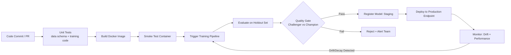
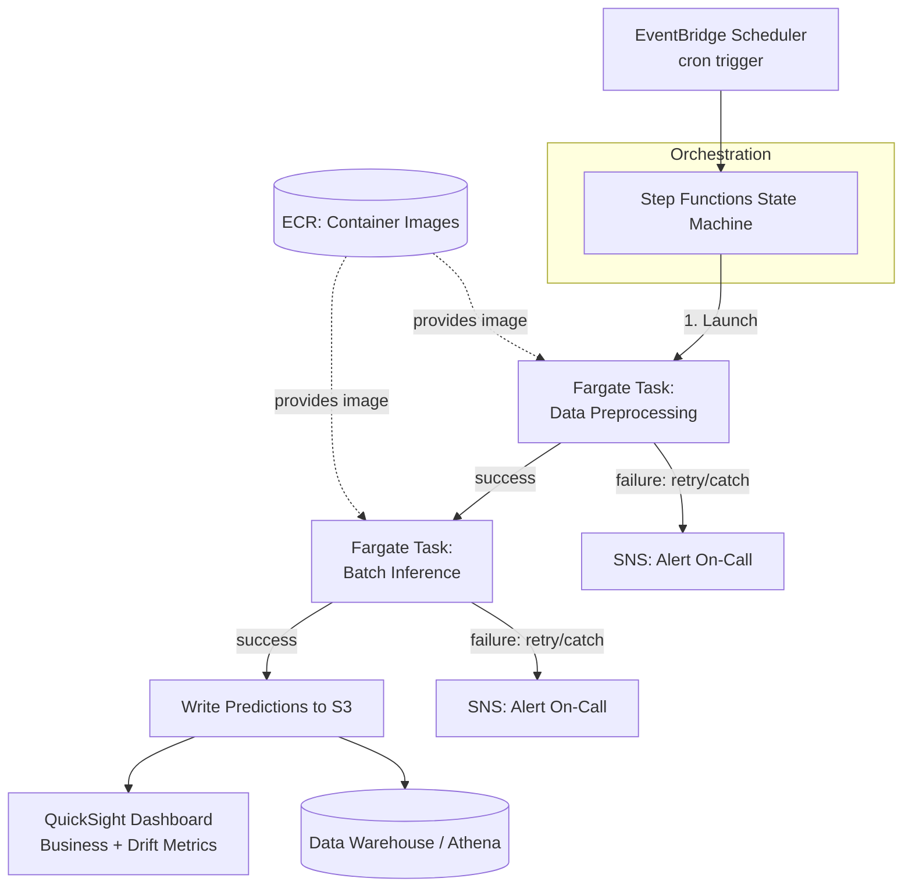
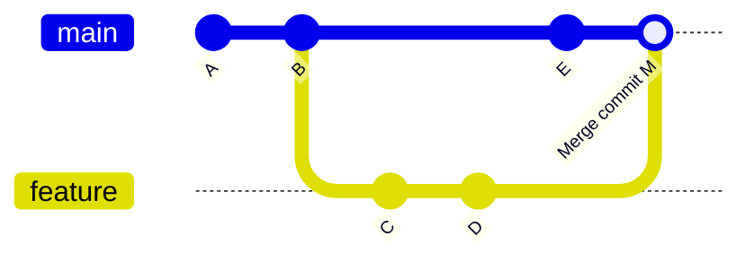
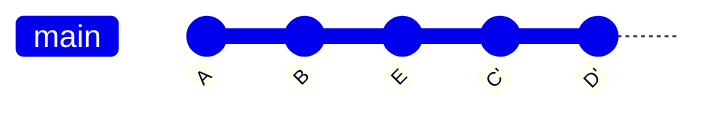

# MLOps & Cloud Deployment

This file covers the operational backbone of taking a model from a notebook to a reliable production system: experiment tracking and model registries with MLflow, serving frameworks (Flask vs FastAPI), containerization with Docker, CI/CD pipelines tailored for ML, production monitoring (data/concept drift), and the AWS and GCP services used to orchestrate and host all of it. It closes with Git workflows, since version control discipline underpins every one of the above. Each section is interview-ready: expect "why this and not that" framing throughout, since that's how senior MLOps competency is actually assessed.

## Table of Contents

1. [MLflow: Tracking, Registry, Reproducibility](#mlflow-tracking-registry-reproducibility)
2. [Model Serving: Flask vs FastAPI](#model-serving-flask-vs-fastapi)
3. [Docker: Images, Containers, Multi-Stage Builds](#docker-images-containers-multi-stage-builds)
4. [CI/CD for ML](#cicd-for-ml)
5. [Monitoring in Production: Data Drift vs Concept Drift](#monitoring-in-production-data-drift-vs-concept-drift)
6. [AWS Services Used](#aws-services-used)
7. [GCP Services Used](#gcp-services-used)
8. [Git: Branching, Merge Conflicts, Rebase vs Merge](#git-branching-merge-conflicts-rebase-vs-merge)
9. [Quick Recall Sheet](#quick-recall-sheet)

---

## MLflow: Tracking, Registry, Reproducibility

MLflow is an open-source platform with four main components — Tracking, Projects, Models, and Model Registry — but in day-to-day MLOps work, **Tracking** and **Model Registry** are what you touch constantly.

### Experiment Tracking

Every time you run a training script, MLflow can record a **run**: a single execution with a unique ID, timestamped, tied to an **experiment** (a logical grouping of related runs, e.g. "fraud-model-xgboost-tuning"). What gets logged per run:

- **Parameters** (`log_param` / `log_params`): hyperparameters, config values — anything that defines "how this run was configured" (learning rate, max_depth, feature set version).
- **Metrics** (`log_metric` / `log_metrics`): things that change over time or are outcomes — accuracy, AUC, loss per epoch. Metrics can be logged with a `step` argument so you get a full training curve, not just a final number.
- **Artifacts** (`log_artifact` / `log_artifacts`): arbitrary files — the serialized model, a confusion matrix PNG, a SHAP summary plot, the requirements.txt, even the raw config YAML.
- **Tags**: free-form metadata (git commit hash, data version, "owner: sharat", "candidate-model: true") used for filtering/searching runs later.

The **Tracking Server** is a lightweight service (backed by a database like PostgreSQL/MySQL for metadata and an artifact store like S3/GCS for files) that all training jobs point to via `MLFLOW_TRACKING_URI`. The **MLflow UI** is a web app on top of that server letting you compare runs side by side, sort by metric, and drill into artifacts — this is what you'd screen-share in a model review meeting.

```python
import mlflow
import mlflow.sklearn
from sklearn.ensemble import RandomForestClassifier
from sklearn.metrics import accuracy_score, roc_auc_score

mlflow.set_tracking_uri("http://mlflow-server:5000")
mlflow.set_experiment("churn-prediction")

with mlflow.start_run(run_name="rf_baseline_v3") as run:
    params = {"n_estimators": 300, "max_depth": 8, "min_samples_leaf": 5}
    mlflow.log_params(params)
    mlflow.set_tag("git_commit", "a1b2c3d")
    mlflow.set_tag("data_version", "s3://data-lake/churn/2026-08-01/")

    model = RandomForestClassifier(**params, random_state=42)
    model.fit(X_train, y_train)

    preds = model.predict(X_val)
    probs = model.predict_proba(X_val)[:, 1]
    mlflow.log_metric("accuracy", accuracy_score(y_val, preds))
    mlflow.log_metric("auc", roc_auc_score(y_val, probs))

    mlflow.log_artifact("requirements.txt")
    mlflow.sklearn.log_model(
        model,
        artifact_path="model",
        registered_model_name="churn-rf",  # auto-registers into Model Registry
    )

    print(f"Run ID: {run.info.run_id}")
```

### Model Registry

The Model Registry sits on top of tracking and gives models a **lifecycle**. When you register a model, it gets a name (e.g. `churn-rf`) and an incrementing **version number** (v1, v2, v3...) each time you register a new artifact under that name. Each version carries a **stage**:

| Stage | Meaning |
|---|---|
| **None** | Just registered, not yet reviewed |
| **Staging** | Candidate under validation — shadow testing, offline eval on holdout, business sign-off |
| **Production** | Currently serving live traffic / used by downstream batch jobs |
| **Archived** | Superseded — kept for audit/rollback, not actively used |

Transitions are typically done via `MlflowClient.transition_model_version_stage(...)` (or, in newer MLflow, via model **aliases** like `@champion`/`@challenger`, which is the direction MLflow has moved to replace the older stage enum — worth mentioning in an interview to show currency). The registry also stores **model lineage** — which run produced this version, so you can always trace a production model back to its exact params/metrics/code.

```python
from mlflow.tracking import MlflowClient

client = MlflowClient()
client.transition_model_version_stage(
    name="churn-rf",
    version=3,
    stage="Production",
    archive_existing_versions=True,  # auto-archives the old Production version
)
```

### Reproducibility

MLflow makes a run reproducible by capturing, alongside metrics, everything needed to recreate it:

- **Code version**: the git commit hash of the source is auto-captured (`mlflow.source.git.commit` tag) when running from a git-tracked directory.
- **Environment**: `mlflow.sklearn.log_model` (and equivalents for other flavors) automatically writes a `conda.yaml` / `requirements.txt` / `python_env.yaml` alongside the model artifact, pinning exact library versions.
- **Data version**: not automatic — best practice is to manually tag the run with a pointer to the data snapshot (an S3 prefix, a BigQuery table snapshot, or a DVC/Delta Lake version hash), as shown in the snippet above with `data_version`.
- **Entry point / Project spec**: if using MLflow Projects (an `MLproject` file), the exact command and conda/docker environment used to launch the run is captured too.

Together — code hash + pinned dependencies + data pointer + params — you can hand a run ID to another engineer and they can reconstruct the exact conditions that produced a given metric, which is the whole point of an audit trail in a regulated ML environment.

**Interview angle:**
- **Q: How would you roll back a bad production model deployment using MLflow?**
  A: Because the registry keeps every prior version and its stage history, rollback is a metadata operation, not a retraining job: transition the previous known-good version (e.g. v2) back to `Production` and archive the bad v3 (`transition_model_version_stage(name=..., version=2, stage="Production", archive_existing_versions=True)`). Because serving code loads models by stage/alias (`models:/churn-rf/Production`) rather than by hardcoded version, the rollback takes effect on the next model load with zero code deploy — assuming your serving layer re-resolves the alias periodically or on restart. I'd also alert on this transition and log the reason (linked to the incident/monitoring alert that triggered it) as a tag for audit.
- **Q: Two data scientists get different metrics from what they claim is "the same model." How do you use MLflow to figure out what diverged?**
  A: Pull up both runs in the UI or via `MlflowClient.get_run()` and diff params, tags, and the logged environment files. Check the `git_commit` tag first — if they're on different commits, that's the likely culprit. Then check the `data_version` tag — training-data drift between "the same" run a week apart is extremely common. Finally diff `requirements.txt`/`conda.yaml` — a silent library version bump (e.g., scikit-learn changing a default hyperparameter) can shift results even with identical code and data.

---

## Model Serving: Flask vs FastAPI

Both are Python web frameworks commonly used to wrap a trained model behind a REST endpoint, but they differ fundamentally in their concurrency model.

### Async support

**Flask** is built on **WSGI** (Web Server Gateway Interface), a synchronous, one-request-per-worker-thread-at-a-time specification. To handle concurrent requests you scale out via multiple worker processes/threads (e.g. gunicorn with N workers), and a single worker blocks entirely while waiting on I/O (a downstream feature-store call, a database read, another model's HTTP call).

**FastAPI** is built on **Starlette**, which implements **ASGI** (Asynchronous Server Gateway Interface). Endpoints can be declared `async def`, and when they `await` an I/O call, the event loop is freed to handle other requests on the *same* worker/thread in the meantime. This matters enormously for I/O-bound model serving: a real-time inference endpoint that needs to fetch features from a low-latency store (DynamoDB, Redis, Feature Store) before scoring benefits hugely from async, since the CPU isn't idled waiting on network I/O — you get far higher request throughput per instance/core, which directly lowers serving cost and P99 latency under load. (Note: pure CPU-bound inference, e.g. a heavy XGBoost `.predict()` call, doesn't get faster from async by itself — you still want to offload that to a thread pool or a separate worker process; async helps the I/O-bound *surrounding* work, not the raw prediction compute.)

### Performance & tooling differences

FastAPI is generally benchmarked faster than Flask, driven by three things: Starlette's async core, Pydantic's compiled/optimized validation (Pydantic v2 uses a Rust core — `pydantic-core`), and native support for running under high-performance ASGI servers (uvicorn/hypercorn) with uvloop. FastAPI also auto-generates interactive **OpenAPI/Swagger** docs (`/docs`) and a `redoc` page purely from your type hints and Pydantic models — no separate spec-writing effort — which is a real developer-experience and API-contract win for teams consuming your model endpoint.

### Request validation with Pydantic

FastAPI's other headline feature is that request/response schemas are defined once as Pydantic models and enforced automatically — invalid payloads are rejected with a structured 422 error before your handler code even runs, versus Flask where you'd hand-write validation (or bolt on `marshmallow`/`pydantic` yourself).

```python
from fastapi import FastAPI, HTTPException
from pydantic import BaseModel, Field, field_validator
import joblib
import numpy as np

app = FastAPI(title="Churn Model API")
model = joblib.load("model.pkl")


class PredictionRequest(BaseModel):
    tenure_months: int = Field(..., ge=0, le=600)
    monthly_charges: float = Field(..., gt=0)
    contract_type: str
    num_support_tickets: int = Field(default=0, ge=0)

    @field_validator("contract_type")
    @classmethod
    def validate_contract(cls, v: str) -> str:
        allowed = {"month-to-month", "one-year", "two-year"}
        if v not in allowed:
            raise ValueError(f"contract_type must be one of {allowed}")
        return v


class PredictionResponse(BaseModel):
    churn_probability: float
    will_churn: bool


@app.post("/predict", response_model=PredictionResponse)
async def predict(request: PredictionRequest) -> PredictionResponse:
    try:
        features = np.array([[
            request.tenure_months,
            request.monthly_charges,
            request.num_support_tickets,
        ]])
        prob = float(model.predict_proba(features)[0][1])
    except Exception as exc:
        raise HTTPException(status_code=500, detail=str(exc))
    return PredictionResponse(churn_probability=prob, will_churn=prob > 0.5)
```

### Comparison table

| Dimension | Flask | FastAPI |
|---|---|---|
| Concurrency model | WSGI, synchronous (thread/process-per-request) | ASGI, native `async def` support |
| Typical throughput (I/O-bound) | Lower — blocks per worker on I/O | Higher — event loop frees worker during I/O waits |
| Request validation | Manual, or third-party (marshmallow, webargs) | Built-in via Pydantic, automatic 422 on invalid input |
| API docs | Manual (Flask-RESTX, Swagger-UI plugins) | Auto-generated OpenAPI/Swagger + ReDoc from type hints |
| Type hints / IDE support | Optional, not enforced at runtime | Central to the framework, enforced at runtime |
| Learning curve | Very shallow, minimal boilerplate | Slightly steeper (Pydantic, async concepts) but still simple |
| Maturity / ecosystem | Older, huge ecosystem, very battle-tested | Newer but now widely production-adopted |
| Best fit | Simple internal tools, legacy codebases, teams already invested in Flask ecosystem | New real-time inference services, especially I/O-heavy ones needing high concurrency and self-documenting contracts |

**Interview angle:**
- **Q: Would you use FastAPI for a batch scoring job that reads a Parquet file, scores 10M rows, and writes results back to S3?**
  A: No — that workload is CPU/throughput-bound batch processing, not a concurrent-request-serving problem, so the async request-handling advantage of FastAPI is irrelevant. I'd run that as a Spark job, a SageMaker Batch Transform job, or a plain script in a Fargate task, not behind a web framework at all. FastAPI (or Flask) is the right tool specifically for *low-latency, real-time, request/response* inference where you need to serve many concurrent callers.
- **Q: Your FastAPI endpoint's P99 latency spikes under load even though it's declared `async def`. What would you check?**
  A: The most common cause is that the handler is doing blocking/CPU-bound work (e.g., calling a synchronous scikit-learn `.predict()` or a blocking `requests.get()`) inside an `async def` function without `await`-ing it properly — that blocks the entire event loop for every concurrent request, negating the async benefit entirely. Fixes: run blocking calls via `run_in_threadpool` / `asyncio.to_thread`, use an async HTTP client (`httpx.AsyncClient`) for downstream calls instead of `requests`, and profile whether the actual prediction step should be offloaded to a separate worker pool or a dedicated inference server (e.g. TorchServe/Triton) so the API layer stays purely I/O-bound.

---

## Docker: Images, Containers, Multi-Stage Builds

### Images vs Containers

A Docker **image** is an immutable, layered filesystem snapshot — a build artifact, analogous to a class or a compiled binary template. It contains your application code, dependencies, and a base OS layer, and is versioned/tagged (`my-model:1.4.2`) and stored in a registry (ECR, GCR, Docker Hub). A **container** is a running (or stopped) instance of an image — analogous to an object instantiated from a class. You can run many containers from the same image simultaneously, each with its own writable layer, process space, and network namespace, but they all share the same read-only image layers underneath (which is why spinning up containers is fast and cheap compared to booting VMs).

### Dockerfile basics

- `FROM` — the base image to build on top of (e.g. `python:3.11-slim`).
- `COPY` (or `ADD`) — copies files from the build context into the image.
- `RUN` — executes a command at *build* time, and its result is committed as a new image layer (e.g. `pip install`).
- `CMD` — the default command run when a container *starts*; can be overridden at `docker run` time.
- `ENTRYPOINT` — like `CMD` but not easily overridden; often used with `CMD` supplying default arguments to the entrypoint.

```dockerfile
FROM python:3.11-slim

WORKDIR /app

COPY requirements.txt .
RUN pip install --no-cache-dir -r requirements.txt

COPY . .

EXPOSE 8000
CMD ["uvicorn", "app:app", "--host", "0.0.0.0", "--port", "8000"]
```

This works, but it bakes build tools, compilers, and pip's cache/wheel-building artifacts into the final image alongside your app — bloating image size and widening the attack surface (anything installed is a potential CVE surface, even if unused at runtime).

### Multi-stage builds

A multi-stage Dockerfile uses more than one `FROM` — one or more "builder" stages that do the heavy lifting (compiling, installing build-time-only packages), and a final slim stage that copies over *only* the finished artifacts, discarding everything else (compilers, source caches, intermediate files) from the final image.

```dockerfile
# ---- Stage 1: builder ----
FROM python:3.11 AS builder

WORKDIR /app
COPY requirements.txt .
# Build wheels for all deps (some may need gcc/build tools present in the full image)
RUN pip install --no-cache-dir --upgrade pip && \
    pip wheel --no-cache-dir --wheel-dir /wheels -r requirements.txt

# ---- Stage 2: runtime ----
FROM python:3.11-slim AS runtime

WORKDIR /app
COPY --from=builder /wheels /wheels
COPY requirements.txt .
RUN pip install --no-cache-dir --no-index --find-links=/wheels -r requirements.txt && \
    rm -rf /wheels

COPY app.py model.pkl ./

RUN adduser --disabled-password --gecos "" appuser
USER appuser

EXPOSE 8000
ENTRYPOINT ["uvicorn", "app:app", "--host", "0.0.0.0", "--port", "8000"]
```

Why this matters:
- **Smaller final image**: the `python:3.11` full image (with gcc, dev headers, etc., needed to build wheels for packages like `numpy`/`scipy` that have C extensions) never ends up in the shipped image — only the compiled wheels and the slim base do. This can shrink an image from 1.2GB+ down to 200-300MB, which speeds up ECS/Fargate task startup and reduces registry storage/transfer cost.
- **Reduced attack surface**: no compilers, no build-only system packages, no source tarballs sitting in the final image for an attacker to exploit or extract secrets from.
- **Cleaner separation of concerns**: build-time dependencies (compilers, dev headers) are explicitly separate from runtime dependencies, making the Dockerfile easier to reason about and audit.
- Running as a **non-root user** (`appuser`) is a standard security hardening step — worth mentioning even though it's not strictly "multi-stage," it's the kind of detail that signals production maturity.

**Interview angle:**
- **Q: Your production inference image is 2.3GB and cold-start on Fargate is slow. Walk me through how you'd reduce it.**
  A: First, check if the Dockerfile is single-stage and pulling in build tools unnecessarily — switch to a multi-stage build so compilers/dev headers stay in the builder stage only. Second, switch the base image to a `-slim` or `-alpine` variant if compatible with your C-extension dependencies (alpine's musl libc can break some scientific Python wheels, so `-slim` on Debian is often the safer choice for data science images). Third, audit `requirements.txt` for unused heavy libraries (e.g., a full `tensorflow` install when only `tensorflow-cpu` or ONNX Runtime is needed for serving). Fourth, order Dockerfile layers so rarely-changing layers (base image, dependency installs) come before frequently-changing layers (app code) to maximize Docker layer-cache hits in CI. Finally, for Fargate specifically, a smaller image directly reduces the image-pull time that contributes to cold start, alongside choosing an appropriately-sized task (over-provisioned CPU/memory doesn't speed up image pull, so this is a separate lever).
- **Q: What's the difference between `CMD` and `ENTRYPOINT`, and when would you use both together?**
  A: `CMD` provides a default command that's easily overridden at `docker run` (e.g., `docker run myimage python other_script.py` replaces the whole `CMD`). `ENTRYPOINT` fixes the executable that always runs, and any `CMD` or command-line args are passed to it as arguments rather than replacing it. I use both together when I want a fixed entrypoint binary with overridable default arguments — e.g. `ENTRYPOINT ["python", "train.py"]` with `CMD ["--epochs", "10"]`, so a caller can override just the epoch count (`docker run myimage --epochs 50`) without needing to know or repeat the full python invocation.

---

## CI/CD for ML

CI/CD for ML extends standard software CI/CD (lint, unit test, build, deploy) with ML-specific concerns: data quality, model quality gates, and the fact that "the artifact" isn't just code — it's code + data + trained weights, all of which can independently go stale.

### Testing strategies specific to ML

- **Data validation / schema tests**: before training even starts, validate that incoming data matches expected schema, types, ranges, and null-rates. Tools like **pandera** let you define a schema as code (`pa.DataFrameSchema({"age": pa.Column(int, pa.Check.ge(0))})`) and assert against it in a CI step or as a pipeline gate; **Great Expectations** does similar "data contract" validation but with a more elaborate expectation-suite/checkpoint model geared toward production data pipelines, plus auto-generated data docs. Conceptually both answer: "is this batch of data safe to train/score on, or has an upstream ETL bug silently changed something?"
- **Unit tests for training code**: standard software unit testing applied to feature engineering functions, custom transformers, and loss/metric implementations — e.g., assert a `compute_recency_feature()` function returns expected values on a small synthetic DataFrame, independent of any real trained model. This catches logic bugs before you waste compute on a full training run.
- **Model quality gates (champion-challenger)**: before promoting a newly trained model ("challenger") to production, automatically compare its offline evaluation metrics (AUC, RMSE, F1, business KPI proxies) against the current production model's ("champion") metrics on the *same* holdout/evaluation set. Only promote if the challenger meets or beats the champion by some margin (to avoid promoting noise-level improvements) and passes any fairness/bias or latency checks. This is typically implemented as an automated pipeline step that queries the MLflow registry for the current Production model's recorded metrics, computes the challenger's metrics, and either auto-promotes, flags for manual review, or auto-rejects.
- **Integration/smoke tests on the serving container**: after building the Docker image, spin it up and hit `/predict` with a known input, asserting the response shape and a sane output range — catches "the container builds but the model actually fails to load" class of bugs before deploy.

### Automated retraining triggers

- **Scheduled**: simplest — retrain weekly/monthly regardless of signals, appropriate when data naturally refreshes on a cadence (e.g., SageMaker Scheduled Pipelines running a cron-like weekly retrain).
- **Data-volume-based**: trigger retraining once N new labeled records have accumulated since the last training run — useful when data arrives in bursts rather than steadily.
- **Drift-triggered**: a monitoring job detects data or concept drift beyond a threshold (see next section) and automatically kicks off a retraining pipeline run — the most sophisticated and most tightly coupled to production monitoring, since it directly closes the loop between "model is degrading" and "new model is being prepared."

In practice, mature setups combine all three: a *scheduled* baseline cadence as a safety net, with *drift-triggered* retraining able to fire early if things degrade faster than the schedule assumes.



**Interview angle:**
- **Q: How would you implement a champion-challenger quality gate concretely in a pipeline?**
  A: After training the challenger, I'd fetch the current Production model version's recorded evaluation metrics from the MLflow Model Registry (or re-score it fresh on the exact same holdout set the challenger was just evaluated on, to avoid stale-metric comparisons across different evaluation runs). I'd define an explicit promotion rule — e.g., "challenger AUC must exceed champion AUC by at least 0.5 percentage points, and P95 inference latency must stay within 20% of champion's" — encoded as a pipeline step that either calls `transition_model_version_stage` to `Staging` (with manual approval before `Production`) or immediately auto-promotes to `Production` if you trust the automation enough, archiving the old version. I'd also log the comparison result as an artifact for audit, and alert the ML team either way so a human always sees what the gate decided and why.
- **Q: A retraining pipeline is triggered nightly regardless of whether meaningful new data arrived. What's the downside, and how would you fix it?**
  A: Wasted compute cost and — more subtly — risk of overfitting to noise if you keep promoting models trained on marginal new data with no real signal change, causing unnecessary "model churn" downstream (cache invalidation, re-validation overhead, confusing version history). I'd add a pre-check step that queries data volume/drift metrics before kicking off full training — e.g., skip the run (or downgrade it to "evaluate only, don't retrain") if fewer than X new labeled rows arrived and no drift alarm fired, converting the nightly schedule into a data-volume-and-drift-gated schedule rather than an unconditional one.

---

## Monitoring in Production: Data Drift vs Concept Drift

Once a model is live, its offline evaluation metrics stop being ground truth — production monitoring is how you detect that reality has moved on without you.

### Data drift

**Data drift** (a.k.a. covariate shift) is a change in the distribution of input features over time, independent of whether the relationship between features and target has changed. Example: an e-commerce fraud model trained on transaction data where average order value was $40 — six months later, a new product line pushes average order value to $120. The feature distribution shifted; the model is now scoring inputs that look statistically different from what it was trained/validated on, even if the *underlying fraud pattern* per dollar hasn't changed.

Detection methods:
- **PSI (Population Stability Index)**: bins a feature's values (both in the training/reference window and the current production window), computes the percentage of records in each bin for both, and sums `(actual% - expected%) * ln(actual% / expected%)` across bins. Rule-of-thumb thresholds: PSI < 0.1 = no significant shift, 0.1–0.25 = moderate shift (investigate), > 0.25 = major shift (act). Cheap to compute, works well for a fixed set of monitored features, and is the standard metric in credit-risk/fraud MLOps.
- **KS-test (Kolmogorov-Smirnov)**: a nonparametric test comparing two continuous distributions (reference vs current) via the maximum distance between their empirical CDFs, producing a p-value for "these two samples come from the same distribution." Good for continuous features; for categorical features you'd use a chi-squared test instead.
- Other approaches: monitoring summary statistics (mean/std/percentiles) over rolling windows with control-chart-style thresholds, or embedding-based drift detection for unstructured inputs (image/text) using distance between embedding distributions.

### Concept drift

**Concept drift** is a change in the relationship between features and target — i.e., `P(y|x)` changes even if `P(x)` (the feature distribution) stays the same. The model's inputs look statistically identical to training, but what those inputs *mean* in terms of outcome has shifted. Concrete example: a customer-churn model where, pre-pandemic, "high number of customer support tickets" correlated with dissatisfaction and impending churn. Post-pandemic, remote-work customers might file more support tickets simply due to different usage patterns, without it being predictive of churn at all anymore — same feature distribution, different underlying relationship to the label. Another classic example: fraud patterns evolving as fraudsters adapt to the model's own decision boundary (adversarial concept drift) — transaction feature distributions can look the same, but which transactions are actually fraudulent changes.

Detection is harder than data drift because it requires **ground-truth labels**, which in production often arrive late or not at all:
- Where delayed labels exist (e.g., churn confirmed 30 days later, chargebacks confirmed weeks later), track live model performance metrics (precision/recall/AUC) on a rolling window of matched predictions-to-outcomes, and alarm on degradation versus the validation-time baseline.
- Where labels are sparse/expensive, use proxy signals: monitor prediction distribution shift (e.g., the model's average predicted probability creeping up or down over time even though nothing else changed) as an early, imperfect warning sign that something about the decision boundary's applicability may have shifted.
- Statistical concept-drift detectors from streaming ML (ADWIN, DDM, Page-Hinkley) are used in some real-time systems, tracking error-rate change-points over a data stream, though these are more common in classic streaming-ML literature than typical batch-retrained business models.

### Comparison table

| | Data Drift | Concept Drift |
|---|---|---|
| **Definition** | Distribution of input features `P(x)` changes | Relationship between features and target `P(y\|x)` changes |
| **Detection method** | PSI, KS-test, chi-squared (categorical), summary-stat monitoring — no labels needed | Live performance tracking against delayed ground truth; proxy signals (prediction distribution shift) when labels are unavailable |
| **Example** | Average order value rises from $40 to $120 due to a new product line | Support-ticket volume no longer predicts churn the way it did pre-pandemic |
| **Typical fix** | Retrain on recent data; add feature normalization/robustness; investigate upstream data pipeline changes | Retrain with recent labeled data reflecting the new relationship; potentially redesign features/labels entirely if the shift is structural |

### Alerting

Effective production alerting combines:
- **Thresholds**: PSI > 0.25 on any monitored feature, or live AUC dropping more than X points below the validation baseline, triggers an alert — not raw metric dashboards that nobody proactively checks.
- **On-call escalation**: route drift/performance alerts through the same on-call rotation/paging tool (PagerDuty, Opsgenie) used for other production incidents, with severity tiers (a single feature's mild PSI bump is a ticket; a live AUC collapse is a page).
- **Dashboards**: a QuickSight/Looker/Grafana dashboard showing rolling drift metrics per feature, live performance metrics where available, and prediction-distribution trends over time — the thing a model owner glances at weekly even without an active alert, and the thing you pull up during an incident to see "when did this actually start."

**Interview angle:**
- **Q: You get a PSI alert on one feature. Live model AUC (from delayed labels) hasn't moved yet. Do you retrain immediately?**
  A: Not necessarily immediately — a PSI alert on data drift alone tells you the input distribution shifted, not that the model's predictive relationship broke down; if `P(y|x)` still holds for the new distribution, the model may still generalize fine (this is why data drift and concept drift need to be tracked separately). I'd first check whether the shifted feature is one the model weights heavily (via feature importance/SHAP), investigate whether it's an upstream data pipeline bug versus a genuine population shift, and keep monitoring live performance metrics closely for the following days/weeks since concept drift often follows or accompanies data drift. If live performance does start degrading, or if the drift is severe/sustained, that's when I'd trigger retraining — treating the PSI alert as an early warning to increase monitoring cadence rather than an automatic retrain trigger on its own.
- **Q: How do you monitor concept drift for a model whose ground-truth labels take 90 days to materialize?**
  A: With such a long feedback loop, I'd rely on a layered approach: (1) proxy signals available immediately — track the model's predicted-probability distribution and flag if it shifts meaningfully from the training-time distribution, since even without labels this hints the model may be extrapolating into unfamiliar decision regions; (2) shorter-horizon leading indicators correlated with the true label if any exist (e.g., early engagement drop-off as a leading indicator for eventual churn); (3) accept that true concept-drift confirmation will lag by design, and compensate with a conservative, scheduled retraining cadence (e.g., monthly) as a safety net so the model never goes more than N days without incorporating recent data, rather than relying solely on a drift alarm that structurally can't fire in real time.

---

## AWS Services Used

### ECS (Elastic Container Service)

**Why**: container orchestration — scheduling, scaling, health-checking, and networking containers — without operating a Kubernetes control plane. For teams that don't need Kubernetes's full extensibility (custom operators, complex multi-tenant scheduling, CRDs), ECS gives "run my container reliably, restart it if it dies, and scale it based on load" with far less operational overhead than standing up and patching an EKS control plane, plus tight native integration with the rest of AWS (IAM roles per task, ALB integration, CloudWatch logs/metrics, Service Discovery) with less glue code required.

### Fargate

**Why**: serverless compute *for* ECS (or EKS) tasks — you specify CPU/memory for a task definition and AWS runs it without you provisioning or patching EC2 instances. This is ideal for **bursty or periodic batch workloads** (nightly training jobs, scheduled batch scoring, ETL) where maintaining a warm EC2 fleet 24/7 would waste money for infrequent work — you pay per task-second only while the task is actually running. It also removes an entire operational surface (AMI patching, instance scaling policies, capacity planning) that ECS-on-EC2 would otherwise require.

### Step Functions

**Why**: a state-machine-based orchestrator for multi-step workflows, defined declaratively (Amazon States Language, JSON) with **built-in retry, error-handling (Catch/Retry per state), branching (Choice states), parallel execution, and wait states** — all without writing custom retry loops, polling logic, or bespoke orchestration code. Compared to hand-rolled orchestration (e.g., a Python script or Airflow DAG calling each step and manually managing retries/failures), Step Functions gives you a visual execution graph in the console for debugging exactly which step failed and why, native integration with ECS/Fargate task launches, Lambda, SageMaker, and SNS/SQS for notifications, and a fully managed, serverless execution engine (no orchestrator infrastructure to maintain or scale yourself). For a multi-step ML batch pipeline — "extract features → run Fargate preprocessing task → run Fargate scoring task → write results → notify" — Step Functions gives you all the failure-handling plumbing for free.

### SageMaker Pipelines

**Why**: purpose-built ML workflow orchestration specifically for the ML lifecycle — preprocessing, training, evaluation, conditional model registration — as first-class pipeline step types (`ProcessingStep`, `TrainingStep`, `TransformStep`, `ConditionStep`, `RegisterModel`) integrated directly with SageMaker's managed training/hosting infrastructure, experiment tracking (SageMaker Experiments), and the SageMaker Model Registry. Compared to using generic Step Functions for the same job, SageMaker Pipelines has native awareness of ML concepts — it can pass a trained model's evaluation metrics into a `ConditionStep` to auto-gate registration, cache identical steps across runs to save cost/time (step caching keyed on input hash), and track full lineage from raw data through the trained model artifact, all within the SageMaker Studio UI.

### SageMaker Scheduled Pipelines (via EventBridge)

**Why**: cron-like recurring execution of a SageMaker Pipeline (via an EventBridge Scheduler rule targeting the pipeline's ARN) for periodic retraining — e.g., "run the full preprocessing → train → evaluate → conditionally register pipeline every Sunday at 2am" — without needing a separate always-on orchestrator polling a clock. This is the natural mechanism for the *scheduled* leg of the retraining-trigger strategies discussed above.

### QuickSight

**Why**: a fully managed BI/dashboarding service for visualizing model outputs and business metrics (prediction distributions, drift metrics, business KPIs tied to model decisions) without standing up and maintaining custom dashboard infrastructure (a Grafana/Superset deployment, its own hosting, auth, and scaling). QuickSight connects natively to data already in Redshift/Athena/S3/RDS, supports pay-per-session pricing (cost-efficient for dashboards with infrequent viewers), and lets business stakeholders self-serve slice-and-dice views without going through the ML team for every new chart request.



### Going deeper: SageMaker capabilities beyond day-to-day project usage

Since the AWS ML Specialty certification probes platform depth beyond "the three services my team happens to use," here are three additional SageMaker capabilities worth being fluent in:

**SageMaker built-in algorithms.** SageMaker ships pre-built, optimized training containers for common algorithms — e.g., the **XGBoost built-in container** (a maintained, performance-tuned XGBoost image you point at S3 training data with a config, no custom training script required) and **Linear Learner** (SageMaker's built-in algorithm for regression and classification via linear models, notably able to train multiple models in parallel internally to auto-tune the regularization strength efficiently). These matter because for well-understood problem shapes, using the built-in container gets you AWS-optimized distributed training (multi-instance, GPU-aware where relevant) and tight integration with SageMaker's hyperparameter tuning (Automatic Model Tuning) without writing or maintaining custom training code — a meaningful speed-to-production advantage over always defaulting to Bring-Your-Own-Container.

**SageMaker Feature Store.** A managed, purpose-built store for ML features with two coupled halves: an **online store** (low-latency key-value lookups, typically backed by a fast store, for real-time inference feature retrieval) and an **offline store** (backed by S3/Parquet, queryable via Athena, for training-time bulk feature retrieval and historical point-in-time queries). The core value proposition is guaranteeing **training/serving consistency** — the exact same feature definitions and transformation logic populate both stores, eliminating the classic "training-serving skew" bug where a feature is computed slightly differently in the offline training pipeline versus the online serving path. It also enables feature reuse across teams/models (a "recency of last purchase" feature computed once, consumed by multiple models) and supports point-in-time correct joins so training data doesn't leak future information.

**SageMaker Model Monitor.** Automated data quality and drift monitoring baked directly into SageMaker-hosted endpoints: it captures a sample of live inference request/response payloads, computes a **baseline** (statistics/constraints) from training data, and on a schedule runs a monitoring job comparing live traffic against that baseline — flagging data quality violations (unexpected nulls, type mismatches, out-of-range values) and statistical drift (using built-in metrics comparable in spirit to PSI) automatically, publishing violations to CloudWatch where they can drive alarms. This is effectively "PSI/data-drift monitoring as a managed platform feature" rather than something you'd have to hand-build as a separate monitoring job — directly relevant to the monitoring section above, and a good answer when an interviewer asks "how would AWS-native tooling change your drift-monitoring implementation."

**Interview angle:**
- **Q: Why choose Step Functions + Fargate over SageMaker Pipelines for an ML batch job?**
  A: It depends on whether the workload is "generically containerized batch processing" or "an ML training/eval lifecycle that benefits from SageMaker-native concepts." If the pipeline is mostly custom preprocessing/business logic in arbitrary containers with only a thin ML component, Step Functions + Fargate gives more general-purpose flexibility, simpler cost model (pay per task-second, no SageMaker training-instance markup), and one orchestration paradigm reusable across both ML and non-ML workflows in the org. If the pipeline is fundamentally "preprocess → train → evaluate → conditionally register a model," SageMaker Pipelines is usually the better fit because it gets you step caching, native lineage tracking, direct Model Registry integration, and built-in condition steps on model metrics for free, rather than re-implementing those concerns as custom Step Functions logic. In practice, teams often use both: SageMaker Pipelines for the training lifecycle, and Step Functions to orchestrate the broader business process around it (e.g., triggering the pipeline, then post-processing outputs, then updating a business dashboard).
- **Q: Why Fargate instead of always-on EC2 instances behind ECS for a nightly batch scoring job?**
  A: The job only runs for, say, 40 minutes a night — keeping EC2 instances running (or even auto-scaled to zero and back, which still requires managing launch templates/AMIs/patching) 24/7 to support a 40-minutes-a-day workload is wasted spend and unnecessary operational surface. Fargate's per-task-second billing means you pay only for those 40 minutes, and AWS handles all underlying host patching/capacity — the tradeoff being slightly higher per-vCPU-hour cost and less control over instance type selection, which is an acceptable tradeoff for a workload this light and non-latency-critical.

---

## GCP Services Used

### Vertex AI

Vertex AI is Google Cloud's unified ML platform, analogous in scope to the whole SageMaker family bundled into one product surface: **Vertex AI Pipelines** (Kubeflow Pipelines or TFX-based DAG orchestration, roughly analogous to SageMaker Pipelines), a **Model Registry** (versioning and lineage, analogous to the SageMaker Model Registry), **Endpoints** for online serving (analogous to SageMaker real-time endpoints, with automatic traffic-splitting for canary/A-B deployment across model versions), and built-in **Model Monitoring** on deployed endpoints (analogous to SageMaker Model Monitor — automated skew/drift detection comparing serving traffic against training data). The main conceptual difference from SageMaker's more modular "distinct AWS services stitched together" feel is that Vertex AI presents these as more tightly unified pieces of a single product, generally with a more consistent SDK/console experience end-to-end, at the tradeoff of somewhat less granular control over the individual underlying compute layers compared to composing raw ECS/Fargate/Step Functions yourself on AWS.

### BigQuery

BigQuery is a **serverless, columnar data warehouse** — you don't provision or manage clusters; you load data and query it, with Google auto-scaling compute behind the scenes. It's commonly used both as the org's core analytics warehouse *and* as a training-data source for ML, because: (a) feature engineering as SQL over already-warehoused data avoids a separate data-movement/ETL step before training, (b) it scales trivially to very large tables without capacity planning, and (c) **BigQuery ML** lets you train and even serve certain model types (linear/logistic regression, k-means, boosted trees, even importing TensorFlow/XGBoost models) directly with SQL syntax (`CREATE MODEL ... OPTIONS(model_type='boosted_tree_classifier') AS SELECT ...`), which is a fast way to get a baseline model in front of stakeholders without leaving the warehouse or writing pipeline code — a bonus capability worth name-dropping even if Vertex AI Pipelines is used for the "real" production model.

BigQuery's cost model is **bytes-scanned pricing** (on-demand: you pay per byte of data scanned by a query, not per byte stored, and storage itself is billed separately and cheaply) — or a flat-rate/capacity-based model (reserved slots) for high, predictable query volume. This has direct cost-optimization implications:
- **Partition tables** (commonly by date) so queries with a date filter only scan the relevant partitions instead of the whole table.
- **Cluster tables** on frequently-filtered/joined columns so BigQuery can skip irrelevant blocks within a partition too.
- **Avoid `SELECT *`** — since BigQuery is columnar, a query only pays for the columns it actually reads; `SELECT *` forces a full-column scan even if you only need three of forty columns, which can be a 10x+ cost difference on wide feature tables.
- **Use approximate aggregation where acceptable** — functions like `APPROX_COUNT_DISTINCT` or `APPROX_QUANTILES` scan the same bytes but compute cheaper approximate results faster; the actual savings lever here is really about avoiding expensive exact-distinct operations on huge datasets more than bytes-scanned pricing itself, but it's a commonly cited BigQuery cost/performance practice worth mentioning together with the others.
- Materializing frequently-reused expensive query results as tables (or using BigQuery's automatic query result caching, which is free for identical repeated queries) to avoid re-scanning the same bytes repeatedly.

### Pipeline orchestration and scheduling on GCP

**Vertex AI Pipelines** (Kubeflow Pipelines under the hood) define the DAG of preprocessing/training/evaluation/deployment components, each running as a containerized step on serverless Vertex-managed compute. For recurring execution, the common pattern is **Cloud Scheduler** (a managed cron service) triggering a **Cloud Function** (or Cloud Run job) that calls the Vertex AI Pipelines API to submit a new pipeline run — analogous to EventBridge Scheduler triggering a SageMaker Scheduled Pipeline on AWS. Cost considerations for recurring pipeline runs mirror the Fargate reasoning: because each pipeline run's compute is provisioned per-run (Vertex Pipelines steps spin up managed compute per component and tear down after), you pay only for the actual training/preprocessing compute-time used, not for idle capacity between scheduled runs — making a nightly/weekly retraining cadence cost-efficient by default, though it's worth watching per-run fixed overhead (container pull time, pipeline-step startup latency) which, at very frequent schedules (e.g., hourly), can start to matter as a fraction of total run cost.

### AWS vs GCP service equivalents

| Concern | AWS | GCP |
|---|---|---|
| Unified ML platform | SageMaker (Pipelines, Registry, Endpoints, Model Monitor as related but distinct services) | Vertex AI (Pipelines, Model Registry, Endpoints, Model Monitoring as one integrated product) |
| Container orchestration | ECS | Cloud Run / GKE |
| Serverless container compute | Fargate | Cloud Run |
| Workflow/state-machine orchestration | Step Functions | Workflows (or Vertex AI Pipelines / Cloud Composer for data/ML DAGs) |
| Data warehouse | Redshift | BigQuery |
| Scheduled trigger | EventBridge Scheduler | Cloud Scheduler |
| BI/dashboarding | QuickSight | Looker / Looker Studio |
| Container registry | ECR | Artifact Registry |
| Feature store | SageMaker Feature Store | Vertex AI Feature Store |

**Interview angle:**
- **Q: A stakeholder asks why the training pipeline reads directly from BigQuery instead of exporting to GCS/Parquet first. What's your answer, and when would you export instead?**
  A: Reading directly from BigQuery avoids a redundant data-movement/ETL hop when the feature engineering is expressible in SQL and the training framework (e.g., via the BigQuery Storage API/`bigframes`/TFX's BigQuery example-gen) can pull data efficiently at scale, keeping a single source of truth and lineage in the warehouse. I'd switch to exporting to GCS/Parquet first when: the training framework needs random-access shuffling/repeated-epoch reads that are far cheaper against local/columnar files than repeatedly querying BigQuery, when the exact same training snapshot needs to be immutable and reproducible across many experiment runs (avoiding BigQuery table mutations underneath you mid-experiment), or when training happens in an environment without convenient BigQuery connectivity (e.g., an on-prem GPU cluster). In short: BigQuery-direct for iteration speed and lineage simplicity, export-to-Parquet for reproducibility guarantees and repeated-read-heavy training loops.
- **Q: How would you control BigQuery costs for a feature-engineering job that's scanning a 50TB clickstream table daily?**
  A: First, confirm the table is partitioned by event date and clustered on a high-cardinality frequently-filtered column (e.g., user_id or event_type) — if not, that's the single highest-leverage fix, since an unpartitioned daily scan of 50TB versus a partition-pruned scan of one day's slice can be a 100x+ cost difference. Second, audit the query for `SELECT *` and trim to only the columns actually used downstream. Third, if the same aggregation feeds multiple downstream jobs, materialize it once as an incremental/scheduled table rather than having each consumer re-scan the raw clickstream. Fourth, if query volume from this pipeline is large and predictable, evaluate whether flat-rate/reserved slot pricing would be cheaper than on-demand bytes-scanned billing at that volume.

---

## Git: Branching, Merge Conflicts, Rebase vs Merge

### Branching strategies

**Git-flow** defines a strict branch topology: a long-lived `develop` branch for integration, long-lived `release/*` branches cut from `develop` for stabilization, `feature/*` branches per feature merged into `develop`, and `hotfix/*` branches cut directly from `main`/`master` for urgent production fixes, merged back into both `main` and `develop`. It gives strong structure for scheduled-release software (versioned installers, mobile apps with App Store review cycles) where you genuinely need a stabilization window before a release ships.

**Trunk-based development** uses a single long-lived branch (`main`/`trunk`) with short-lived feature branches (ideally living hours to a couple of days) merged back frequently behind feature flags if the work isn't ready to ship yet. It's the dominant pattern for teams doing continuous deployment, since it minimizes long-lived divergence and the resulting large, painful merges.

| | Git-flow | Trunk-based development |
|---|---|---|
| Branch lifetime | Long-lived (`develop`, `release/*`) | Short-lived feature branches (hours-days) |
| Merge complexity | Higher — long-lived branches drift further apart, bigger conflicts | Lower — small, frequent merges stay close to trunk |
| Release cadence fit | Scheduled/versioned releases with a stabilization window | Continuous deployment, frequent small releases |
| Incomplete work handling | Kept isolated on its own branch until ready | Merged behind feature flags, hidden from users until ready |
| CI/CD complexity | More branches to build/test/deploy per pipeline config | Simpler — pipeline mostly cares about `main` plus ephemeral feature branches |
| Team size / discipline needed | Works well for larger teams needing formal release gates | Requires strong test coverage/CI discipline to keep `main` always releasable |
| Typical ML team fit | Rare — ML pipelines rarely need App-Store-style release windows | Common — pairs naturally with CI/CD-driven retraining/redeploy pipelines |

### Resolving merge conflicts

The general workflow: run `git merge <branch>` (or hit the conflict during a `git pull`/`rebase`); Git marks conflicting files and inserts conflict markers (`<<<<<<<`, `=======`, `>>>>>>>`) around the diverging hunks in each conflicted file. You open each conflicted file, manually reconcile the two versions (deciding which lines to keep, combine, or rewrite), remove the conflict markers, then `git add <file>` to mark it resolved, and finally `git commit` (for a merge) or `git rebase --continue` (for a rebase) to finish. Tools like `git mergetool`, or IDE-integrated 3-way merge views, make visualizing "mine / theirs / base" easier for non-trivial conflicts. For conflicts in generated or non-mergeable files (e.g., a lockfile), it's often faster to accept one side wholesale (`git checkout --ours/--theirs <file>`) and regenerate the file rather than hand-merging it.

### Rebase vs merge

`git merge` combines two branches' histories by creating a new **merge commit** with two parents, preserving the true, chronological history of how work actually happened — safe on shared/public branches because it never rewrites existing commits. `git rebase` replays your branch's commits one-by-one on top of the target branch's current tip, producing a **linear history** with no merge commit — this is great for cleaning up a feature branch's history before merging into `main` (squashing/reordering noisy WIP commits into a clean, readable set), but because it rewrites commit hashes, it's dangerous on a branch other people have already pulled and built on top of (their local history now diverges from the rewritten upstream history, causing painful reconciliation) — the standard rule is: **rebase local/private branches freely, never rebase a branch others are actively basing work on** (particularly never rebase `main`/shared branches).





*(Top: `git merge` — feature commits C/D stay intact, joined by merge commit M with two parents. Bottom: `git rebase main` on the feature branch before merging — commits C/D are replayed as C'/D' on top of E, producing a single linear history with no merge commit.)*

**Interview angle:**
- **Q: Your team is doing continuous deployment with automated retraining triggered on every merge to `main`. Which branching model fits, and why?**
  A: Trunk-based development, clearly — with drift-triggered or scheduled retraining pipelines watching `main`, you want `main` to always be in a deployable, "this is truth" state, and you want feature work merged in small, frequent, well-tested increments so that any single merge-triggered pipeline run is evaluating a small, easily-attributable change rather than a giant multi-week branch's worth of changes all landing at once (which makes it much harder to trace a model-quality regression back to a specific code change). Git-flow's long-lived `develop`/`release` branches would mean the CI/CD pipeline is either running against `develop` (not truly production-representative) or waiting for infrequent release-branch merges, undermining the "detect and react quickly" goal of an automated retraining/redeploy pipeline.
- **Q: You need to update your feature branch with the latest `main` before opening a PR. Rebase or merge, and why?**
  A: Rebase — since the feature branch is still local/private (not yet shared or built upon by others), rebasing it onto the latest `main` (`git rebase main` from the feature branch) replays your commits cleanly on top of the newest `main`, giving reviewers a clean, linear diff without an unnecessary merge commit cluttering history, and resolving any conflicts once during the rebase rather than potentially again during the eventual PR merge. If the feature branch were already shared with teammates who'd pulled it and added their own commits on top, I'd use merge instead, to avoid rewriting commits they already have.

---

## Additional Common Interview Questions

**Q: What's a canary deployment vs a shadow deployment for ML models, and how do they differ?**

Both are strategies for de-risking a new model version before it fully replaces the incumbent, but they differ in whether the new model's output actually reaches users and how traffic is split. A **canary deployment** routes a small, real percentage of live traffic (e.g., 5%) to the new model version while the remaining 95% continues to hit the current production model; the canary's predictions are the ones actually returned to those users, so you're taking on real (but limited-blast-radius) risk in exchange for observing genuine user-facing behavior — latency, error rate, and downstream business metrics — on a live slice of traffic. You monitor the canary against the incumbent on the same dashboards used for full production monitoring, and if it holds up over some soak period you progressively ramp its traffic share up (5% → 25% → 50% → 100%), rolling back instantly by dialing traffic back to 0% if anything looks wrong. A **shadow deployment** (a.k.a. dark launch or shadow testing), by contrast, sends a *copy* of live traffic to the new model in parallel with the incumbent, but the new model's predictions are only logged/compared — never returned to the user; the incumbent's response is always what's served. This means zero user-facing risk, at the cost of not being able to observe true business-metric impact (you can compare predicted probabilities/labels between the two models offline, but you can't see how users would have reacted to the candidate's decisions since they never actually experienced them). In practice, shadow testing is the safer first gate for a genuinely novel or business-critical model change, followed by a canary rollout once shadow comparison looks healthy — you get "does this even behave sanely on real inputs" confidence for free from shadow mode before spending any real risk budget on a canary. On AWS this maps to SageMaker's production-variant traffic-shifting and shadow-variant support on real-time endpoints; on Vertex AI, the traffic-split percentages configurable directly on an Endpoint's deployed models are the canary mechanism.

**Q: How would you version datasets, not just models and code (e.g. DVC or a data lake snapshot strategy)?**

Code has git, models have the MLflow Model Registry, but datasets need their own versioning story because training data mutates over time (new rows appended, corrections to old rows, schema changes) and "which exact data produced this model" is essential for both reproducibility and debugging regressions. Two common patterns: **DVC (Data Version Control)** layers git-like versioning on top of large data files without storing the actual bytes in git — you run `dvc add data/train.parquet`, which computes a content hash, stores the actual file in a remote (S3/GCS/Azure Blob) keyed by that hash, and commits a small `.dvc` pointer file (containing the hash and remote path) into git itself. This means `git checkout <commit>` combined with `dvc checkout` reconstructs the exact dataset that existed at that commit, giving you the same branching/tagging/diffing workflow you already use for code, applied to data, and DVC pipelines (`dvc.yaml`) can further version the *transformations* (stages) that turned raw data into the training set, not just the final file. The alternative, common in cloud-warehouse-centric teams, is a **data lake / warehouse snapshot strategy**: writing immutable, timestamped or content-hashed partitions (e.g. `s3://data-lake/churn/2026-08-01/` or a BigQuery table snapshot / Delta Lake `VERSION AS OF` / time-travel query) rather than overwriting a single "latest" table in place, then tagging each training run (as shown earlier with the `data_version` MLflow tag) with the exact snapshot path or table version it consumed. Delta Lake and Iceberg formalize this further with built-in ACID table versioning, letting you query `SELECT * FROM table VERSION AS OF 42` directly. Whichever approach, the non-negotiable property is **immutability of past snapshots** — if "yesterday's data" can silently change today, you've lost the ability to ever reproduce a past training run, which breaks both debugging (was a metric regression caused by code, data, or both) and compliance/audit requirements in regulated domains.

**Q: What's the difference between online and offline feature stores, and why do you need both?**

An **offline feature store** is optimized for *bulk, historical* access: it's typically backed by a columnar store (S3/Parquet, BigQuery, a data warehouse table) and is used to assemble large training datasets via point-in-time-correct joins — for a given historical timestamp per training row, pulling the feature values *as they were known at that time* (to avoid leaking future information into training, a subtle but critical correctness requirement). Query latency of seconds-to-minutes is completely fine here since it's an offline, batch, non-user-facing workload. An **online feature store**, by contrast, is optimized for *single-key, low-latency* lookups at inference time — backed by a fast key-value store (DynamoDB, Redis, Bigtable) — because a real-time serving endpoint needs "give me the current feature vector for user 12345" in single-digit milliseconds, not minutes. You need both because they serve fundamentally incompatible access patterns: training needs efficient bulk historical scans with time-travel correctness, and serving needs efficient single-row current-state lookups with tight latency SLAs; trying to use one store for both jobs means either training becomes painfully slow (scanning a key-value store row-by-row for millions of training examples) or serving becomes too slow for real-time use (querying a columnar warehouse per-request). The critical engineering property that ties the two together is that both stores must be populated by the **same feature-computation logic**, so that a feature named `avg_order_value_30d` is computed identically whether it's being materialized into the offline store for training or the online store for serving — otherwise you get **training/serving skew**, where a model's live performance silently diverges from its offline-evaluated performance because the "same" feature was actually computed two subtly different ways in two different pipelines. Managed feature stores (SageMaker Feature Store, Vertex AI Feature Store, Feast as an open-source option) are built specifically to guarantee this consistency and to handle the streaming/batch dual-write path automatically rather than leaving two independent pipelines to drift apart over time.

**Q: How would you design a retraining pipeline that avoids automatically retraining on bad or corrupted data?**

I'd treat data validation as a hard gate *before* any training compute is spent, not as an afterthought — the goal is to fail loudly and stop the pipeline rather than silently train (and potentially auto-promote) a model on garbage. Concretely: (1) a **schema/contract check** at pipeline entry using something like Great Expectations or pandera, asserting column types, allowed ranges, null-rate thresholds, and referential integrity against an expectation suite built from historical-good data — if a required column now has 40% nulls or a numeric column suddenly contains strings, the pipeline halts and pages the on-call rather than proceeding; (2) a **volume/anomaly sanity check** comparing the incoming batch's row count, class balance, and key summary statistics against a rolling historical baseline (e.g., "today's batch has 95% fewer rows than the 7-day average" or "the positive-class rate jumped from 2% to 40%" are both red flags worth halting on, since either usually signals an upstream ETL bug rather than genuine signal change); (3) a **drift check against the reference/training distribution** (PSI/KS-test, as covered earlier) run on the fresh batch before it's used for retraining — not to block on drift necessarily (drift can be legitimate), but to flag/require manual sign-off if drift is extreme, distinguishing "the data changed because the world changed" from "the data changed because something broke"; and (4) keeping the **last known-good data snapshot always available** as a rollback target, so if a bad batch does slip through and get trained on, you can immediately re-point the pipeline at the prior good snapshot rather than scrambling to reconstruct it. All of these checks should be implemented as explicit pipeline steps (e.g., a `ProcessingStep`/`ConditionStep` in SageMaker Pipelines, or a Great Expectations checkpoint task in an Airflow/Step Functions DAG) whose failure short-circuits the DAG before the expensive `TrainingStep` ever runs, both to save compute and — more importantly — to prevent a corrupted model from ever reaching the champion-challenger quality gate in the first place.

**Q: What's the difference between horizontal and vertical scaling for a model-serving endpoint, and which is more common for ML inference workloads?**

**Vertical scaling** means making a single serving instance bigger — more vCPUs, more RAM, a bigger/faster GPU (e.g., moving from a `g4dn.xlarge` to a `g5.2xlarge`) — to handle more load or a heavier model on the same node. **Horizontal scaling** means adding more instances/replicas running the same model behind a load balancer, distributing requests across them, and scaling that replica count up or down based on load (via an auto-scaling policy on CPU utilization, request count, or a custom metric like queue depth). Horizontal scaling is by far the more common and more strongly preferred pattern for ML inference workloads, for a few concrete reasons: it gives you **fault tolerance** (one instance dying doesn't take the whole endpoint down, whereas a single big vertically-scaled instance is a single point of failure), it scales in much finer, cheaper-to-tune increments (adding a 6th replica is a smaller cost/capacity step than jumping to the next instance-size tier), and cloud auto-scaling groups/Kubernetes HPA are built natively around adding/removing replicas rather than dynamically resizing a running instance's hardware (which generally requires a restart and isn't a live operation for GPU instances anyway). Vertical scaling still matters as a *first-order* decision — you pick an instance/GPU type large enough to comfortably fit the model and hit your per-request latency target *before* thinking about replica count — and it's the right lever specifically when a single request can't be parallelized further and simply needs more compute per inference (a very large LLM that doesn't fit on a smaller GPU at all, for instance, has no choice but to scale up before it can scale out). But for the steady-state problem of "handle more concurrent requests within an existing latency budget," horizontal scaling behind a load balancer (ALB/API Gateway on AWS, or a Kubernetes Service/Ingress) with an auto-scaling policy tied to request volume is the standard, cost-efficient answer.

**Q: How would you handle secrets and credentials management in an ML pipeline?**

The non-negotiable rule is that secrets — database passwords, API keys, model-registry credentials, cloud service-account keys — never live in source code, Docker image layers, or plaintext config files committed to git, because any of those get copied, cached, and potentially exposed far more widely and permanently than intended (a secret baked into a Docker layer is retrievable by anyone who can pull the image, even if it's removed in a later layer). The standard pattern is a dedicated **secrets manager** (AWS Secrets Manager or Parameter Store, GCP Secret Manager, or a self-hosted HashiCorp Vault) that stores secrets encrypted at rest, exposes fine-grained IAM-based access control (this specific training job's execution role can read *this* specific secret and nothing else), supports automatic rotation (e.g., rotating a database password on a schedule without any code change, since the pipeline fetches the current value at runtime rather than having it hardcoded), and gives a full audit trail of who/what accessed which secret and when. At runtime, the pipeline or serving container fetches the secret via an SDK call authenticated by its own IAM role/service-account identity (e.g., `boto3.client("secretsmanager").get_secret_value(SecretId=...)` inside the container, itself running under a task IAM role that's been granted access to only that secret) and injects it as an in-memory environment variable or config value — never writing it to disk. Plain environment variables passed at container-launch time are an acceptable *lower-rigor* alternative for less sensitive values in some setups (and are simple, ubiquitous, and framework-agnostic), but they're weaker than a secrets manager because they're often visible in process-listing tools, container inspect output, or CI/CD logs if not handled carefully, and they don't give you rotation or fine-grained access auditing for free — for anything touching production data or paid infrastructure I'd default to the managed secrets service and treat bare env vars as a fallback only for genuinely low-sensitivity config.

**Q: What's infrastructure-as-code (e.g. Terraform/CloudFormation), and why does it matter for reproducible ML infra?**

Infrastructure-as-code means defining cloud infrastructure — VPCs, IAM roles, S3 buckets, SageMaker endpoints, ECS task definitions, EventBridge schedules — as declarative configuration files checked into version control, rather than clicking through a cloud console or running one-off CLI commands to provision resources by hand. **Terraform** (cloud-agnostic, HCL syntax, tracks a state file mapping declared resources to real cloud objects) and **AWS CloudFormation** (AWS-native, JSON/YAML, tracks state via managed "stacks") are the two most common tools; both let you run a plan/diff step showing exactly what will change before applying it, and both make "tear down and recreate this entire environment identically" a single command rather than a multi-hour manual reconstruction exercise. For ML infrastructure specifically, this matters for several reasons that mirror why MLflow's reproducibility story matters for models: (1) **reproducible environments** — a training pipeline's IAM permissions, VPC/subnet placement, and compute resources are exactly re-creatable in a new environment (a fresh dev/staging account, or disaster recovery), rather than depending on institutional memory of "someone clicked these seven console settings two years ago"; (2) **auditability** — every infrastructure change goes through the same PR-review process as code changes, so "who changed this security group and why" has the same git-blame trail as any other change, which matters a lot in regulated ML environments; (3) **drift detection** — Terraform/CloudFormation can detect when the actual cloud state has diverged from the declared configuration (someone manually changed something in the console) and flag or correct it, preventing silent configuration drift between environments; and (4) **environment parity** — the same Terraform module used to provision the "staging" SageMaker endpoint and IAM roles can be reused (parameterized) to provision an identical "production" setup, minimizing the classic "it worked in staging but not in prod because the environments were subtly different" failure mode. In short, IaC extends the same "everything as version-controlled, diffable, reviewable code" discipline that CI/CD and MLflow already bring to model code and training runs, out to the infrastructure those pipelines run on.

**Q: How would you A/B test two model versions in production safely, using traffic splitting at the serving layer?**

The mechanism is the same traffic-splitting infrastructure used for canary deployments, but the *intent* and *measurement design* differ: a canary is primarily a safety/regression check (is the new version at least as good, roll back fast if not), whereas an A/B test is a deliberate, typically longer-running statistical experiment to measure whether model B genuinely outperforms model A on a business metric, with pre-registered hypotheses and a fixed sample-size/duration plan (tying directly back to standard A/B testing methodology — power analysis, avoiding early-stopping/peeking bias, and correcting for multiple comparisons if testing several metrics). Concretely, at the serving layer you configure a fixed traffic split (e.g., 50/50, or unequal if you want to limit exposure to the variant) — on SageMaker via multiple production variants on one endpoint with `initial_variant_weight`, or on Vertex AI via traffic-split percentages across deployed models on one Endpoint, or via an application-level router/feature-flag service (LaunchDarkly, or a simple consistent-hash-on-user-id router) if you want more control than the managed endpoint's built-in splitting offers. Critically, the split needs to be **sticky per user/entity** (the same user consistently lands in the same arm for the test's duration, typically via a deterministic hash of a stable user ID) rather than randomized per-request, otherwise a single user could get inconsistent experiences across requests and your unit of analysis for the eventual statistical test becomes muddled. You log which arm served each prediction alongside the eventual outcome/label, run the experiment for a pre-determined duration long enough to reach adequate statistical power on the target metric (not "until it looks significant," which invites peeking bias), and analyze with the appropriate test (t-test/chi-squared/sequential testing framework depending on the metric type) at the end of the fixed window rather than continuously monitoring for early significance. Only after the test concludes with a clear, adequately-powered result would you ramp the winning model to 100% and formally promote it in the model registry.

**Q: What's the cost tradeoff between a serverless (Lambda/Fargate) and an always-on (EC2/dedicated instance) model-serving setup?**

The core tradeoff is idle-cost versus cold-start-latency, and which side wins depends heavily on the traffic pattern. A **serverless** setup (AWS Lambda for lightweight models, or Fargate/Cloud Run for slightly heavier containerized ones) bills per-invocation or per-task-second of actual compute used, with zero cost while no requests are arriving — making it very cost-efficient for **spiky, low-volume, or unpredictable traffic** (an internal tool called a few hundred times a day, or a workload with long idle stretches between bursts). The cost is **cold starts**: when no instance has served a request recently, the platform has to provision a fresh execution environment and load your model into memory before it can respond, adding anywhere from tens of milliseconds to several seconds of extra latency on that first request (worse for large models — a multi-GB deep learning model loading into a fresh Lambda container can dominate the entire request's latency budget), which is often unacceptable for a strict real-time SLA. An **always-on** setup (a fixed EC2 instance, or an ECS/SageMaker endpoint with a minimum instance count that never scales to zero) keeps the model loaded in memory continuously, so every request gets consistently low latency with no cold-start tax — at the cost of paying for compute 24/7 even during idle periods with zero traffic, which is wasteful for genuinely low/bursty-volume endpoints but is the right choice whenever you have **steady, predictable, latency-sensitive traffic** where the idle-time waste is small relative to total utilization anyway. In practice the decision comes down to: estimate your requests-per-day and required P99 latency, and if traffic is either high-volume-and-steady or has a hard low-latency SLA that can't tolerate occasional cold starts, always-on wins on both latency and often even cost-per-request at scale; if traffic is low, spiky, or non-latency-critical, serverless wins cost-wise given you're not paying for idle capacity — and hybrid approaches exist too (provisioned concurrency on Lambda, or a small always-on minimum-instance-count on an auto-scaled endpoint) specifically to blunt cold-start risk while still scaling down most of the way during quiet periods.

---

## Quick Recall Sheet

- **MLflow**: Tracking (params/metrics/artifacts per run) + Model Registry (None → Staging → Production → Archived, or aliases like `@champion`) + reproducibility via git commit tag + auto-captured environment files + manually-tagged data version.
- **`mlflow.log_param` / `log_metric` / `log_model`**: params = config, metrics = outcomes over steps, `log_model` with `registered_model_name` auto-registers a version.
- **Flask vs FastAPI**: Flask = WSGI, synchronous; FastAPI = ASGI, native `async def`, Pydantic validation, auto Swagger docs; async wins for I/O-bound concurrent serving, not for raw CPU-bound prediction compute.
- **Docker image vs container**: image = immutable build artifact; container = running instance of an image.
- **Multi-stage builds**: builder stage compiles/installs, runtime stage copies only finished artifacts → smaller image, smaller attack surface.
- **ML-specific CI/CD testing**: data schema validation (pandera/Great Expectations), training-code unit tests, champion-challenger quality gates before promotion.
- **Retraining triggers**: scheduled, data-volume-based, drift-triggered — mature systems combine all three.
- **Data drift**: `P(x)` changes — detect via PSI (>0.25 = major shift) or KS-test; no labels needed.
- **Concept drift**: `P(y|x)` changes even if `P(x)` doesn't — detect via live performance vs delayed ground truth, or proxy signals (prediction distribution shift) when labels are delayed/sparse.
- **AWS**: ECS = orchestration without managing K8s control plane; Fargate = serverless per-task compute, ideal for bursty/periodic batch; Step Functions = state-machine orchestration with built-in retry/branching, avoids hand-rolled orchestration code; SageMaker Pipelines = ML-native DAG orchestration with step caching + registry integration; SageMaker Scheduled Pipelines = cron-like recurring pipeline runs via EventBridge; QuickSight = managed BI without custom dashboard infra.
- **AWS ML Specialty depth**: built-in algorithms (XGBoost container, Linear Learner) for fast optimized training without custom code; Feature Store (online + offline) for training/serving consistency; Model Monitor for automated baseline-vs-live drift/data-quality checks on SageMaker endpoints.
- **GCP**: Vertex AI = unified platform (Pipelines/Registry/Endpoints/Model Monitoring in one product) vs SageMaker's more modular AWS-service-stitching; BigQuery = serverless columnar warehouse, bytes-scanned pricing → partition, cluster, avoid `SELECT *`, use approximate aggregation; BigQuery ML for SQL-native baseline models; Cloud Scheduler + Cloud Function/Run triggers Vertex AI Pipelines runs.
- **Git-flow vs trunk-based**: git-flow = long-lived develop/release branches, good for scheduled/versioned releases; trunk-based = short-lived feature branches merged frequently, good for continuous deployment (fits ML CI/CD better).
- **Merge conflict workflow**: conflict markers appear → manually reconcile → `git add` → `git commit` (merge) or `git rebase --continue` (rebase).
- **Rebase vs merge**: rebase rewrites history into a linear sequence (safe only on local/private branches); merge preserves true history via a two-parent merge commit (safe on shared/public branches) — never rebase shared/public branches.
