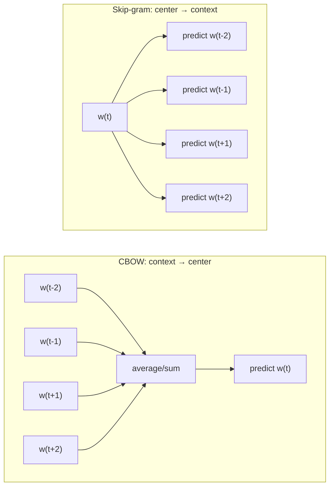
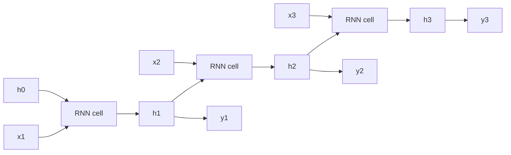
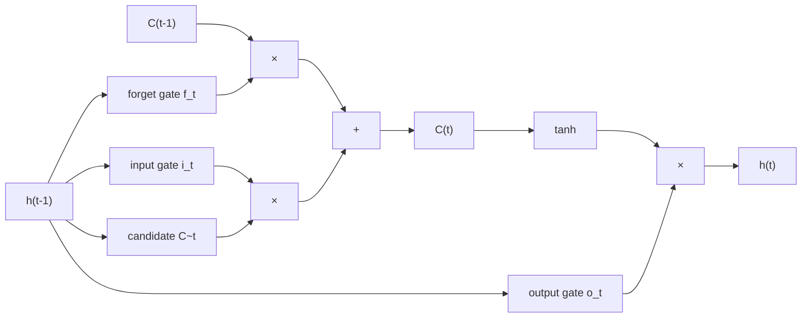
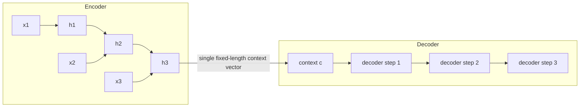
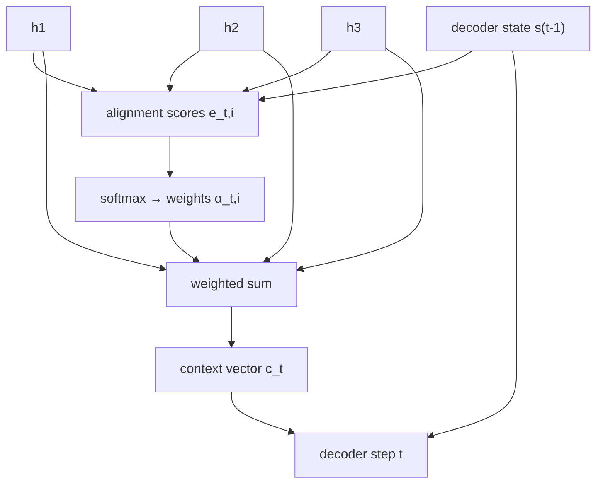

# NLP and Deep Learning Fundamentals

This file is a refresher on classical NLP pipelines (tokenization, stemming/lemmatization, BoW/TF-IDF, word embeddings), sequence models (RNN/LSTM/GRU), the attention mechanism, practical NLTK usage, and core deep learning fundamentals (CNNs, hyperparameter tuning, batch norm, dropout). It is written for someone comfortable with classical ML/forecasting who needs to re-solidify DL/NLP foundations before tackling Transformer-era GenAI material. **Scope note:** attention is covered here only as the conceptual bridge to Transformers (encoder-decoder bottleneck → alignment scores → weighted context); full self-attention, QKV projections, multi-head attention, and modern Transformer architecture are covered in a separate file in this kit, as are subword tokenization schemes like BPE/WordPiece.

## Table of Contents

1. [Text Preprocessing](#1-text-preprocessing)
2. [Bag-of-Words and TF-IDF](#2-bag-of-words-and-tf-idf)
3. [Word Embeddings](#3-word-embeddings)
4. [Sequence Models — RNN, LSTM, GRU](#4-sequence-models--rnn-lstm-gru)
5. [Attention Mechanism (Bridge to Transformers)](#5-attention-mechanism-bridge-to-transformers)
6. [NLTK in Practice](#6-nltk-in-practice)
7. [Deep Learning Fundamentals Refresh](#7-deep-learning-fundamentals-refresh)
8. [Quick Recall Sheet](#quick-recall-sheet)

---

## 1. Text Preprocessing

### 1.1 Tokenization

Tokenization is the process of splitting raw text into discrete units ("tokens") that downstream models can consume.

- **Word-level tokenization**: splits text on whitespace/punctuation into words (e.g., `"Don't stop."` → `["Do", "n't", "stop", "."]` depending on the tokenizer's contraction handling). Simple, human-interpretable, but produces a large vocabulary and cannot handle out-of-vocabulary (OOV) words at inference time.
- **Sentence-level tokenization**: splits a document into sentences (handling abbreviations like "Dr." or "e.g." correctly is the main difficulty), used as a pre-step before sentence-level tasks (summarization, sentence embeddings, NER over sentence spans).
- **Subword tokenization** (BPE, WordPiece, SentencePiece/Unigram): a middle ground between word-level and character-level that solves the OOV problem by breaking rare words into frequent sub-word pieces. This is the tokenization scheme actually used by modern Transformer/LLM architectures — **full treatment of BPE and friends is deferred to the Transformers file in this kit**; the only thing worth remembering here is *why* it exists: word-level tokenizers explode vocabulary size and can't represent unseen words, and character-level tokenizers make sequences too long and lose word-level semantics — subword tokenization is the practical compromise.

**Interview angle:**
- *Q: Why might a production NLP pipeline avoid pure word-level tokenization?*
  A: Word-level tokenization gives an unbounded, huge vocabulary (every inflection, typo, and rare proper noun is a new token), causes OOV failures at inference (any word not seen during training gets mapped to `<UNK>` and its meaning is lost), and inflates the embedding table size. Subword tokenization keeps the vocabulary small and fixed while still being able to represent arbitrary new words by composing them from known sub-pieces — this is why virtually all modern LLM tokenizers use BPE/WordPiece variants instead of whole-word vocabularies.

### 1.2 Stemming vs Lemmatization

Both aim to reduce inflected words to a common base form so that `run`, `running`, `ran` are treated as related, but they differ substantially in method and quality.

| Aspect | Stemming | Lemmatization |
|---|---|---|
| Method | Rule-based crude suffix stripping (e.g., Porter, Snowball, Lancaster stemmer) | Dictionary + morphological analysis, usually POS-aware |
| Output | May not be a real word | Always a valid dictionary word (the "lemma") |
| Speed | Fast (simple string rules) | Slower (needs lookup/POS tagging) |
| Context-awareness | None | Uses POS tags for correct reduction |
| Example: "studies" | `studi` | `study` |
| Example: "better" | `better` (no rule fires) | `good` (adjective, comparative → base form) |
| Example: "caring" | `care` | `care` (agree here) |
| Example: "meeting" (noun vs verb) | `meet` regardless of usage | `meeting` (noun) vs `meet` (verb) depending on POS |
| Typical use case | Search engines, IR where speed matters more than precision | Tasks needing linguistic accuracy: chatbots, question answering, grammar-sensitive pipelines |

The canonical illustrative example is **"better"**: the Porter stemmer has no suffix rule that maps `better` to anything, so the stem is `better` itself. A lemmatizer with POS context knows `better` is the comparative form of the adjective `good` and maps it to the lemma `good`. This is the single clearest example to give in an interview because it shows lemmatization requires actual linguistic/morphological knowledge (an irregular comparative), not just suffix stripping.

### 1.3 Stopword Removal

Stopwords are high-frequency, low-information words (`the`, `is`, `a`, `and`, `of`, ...). Removing them:

- **Reduces dimensionality** of BoW/TF-IDF vectors and speeds up downstream processing.
- **Reduces noise** for tasks like topic modeling or document retrieval where these words carry no discriminative signal.

**When you should NOT remove stopwords:**
- **Sentiment analysis / negation-sensitive tasks**: "not" is typically in stopword lists, but removing it flips meaning entirely — `"not good"` becomes `"good"` after naive stopword removal, which is catastrophic for sentiment polarity.
- **Machine translation / language generation**: word order and function words are structurally necessary; removing them destroys grammaticality.
- **Any task depending on syntax** (POS tagging, dependency parsing, coreference resolution): function words carry grammatical structure.
- **Transformer/LLM-based pipelines in general**: modern contextual models are trained on natural text and already learn to downweight uninformative tokens internally; stopword removal is largely a relic of the BoW/TF-IDF era and is usually *not* applied before feeding text to embedding-based or Transformer models.

**Interview angle:**
- *Q: You built a sentiment classifier and accuracy tanked on sentences with negation ("not bad", "not great"). What's the likely preprocessing bug?*
  A: Almost certainly the stopword list removed "not" (and possibly other negators like "no", "never") before vectorization, so `"not bad"` and `"bad"` become indistinguishable bag-of-words. Fix: use a negation-aware stopword list (exclude negators), or better, move to embeddings/n-grams/Transformer-based representations that preserve local word order and don't rely on stopword removal at all.
- *Q: Give an example where stemming and lemmatization disagree, and explain why.*
  A: "better" → stemmer outputs `better` (no suffix rule applies to an irregular comparative); lemmatizer outputs `good` because it uses a morphological dictionary and knows `better` is the comparative inflection of the adjective `good`. Stemming is purely suffix-pattern matching and has no notion of irregular forms; lemmatization requires POS tagging plus a lexical database (e.g., WordNet) to resolve to the canonical dictionary form.

---

## 2. Bag-of-Words and TF-IDF

### 2.1 Bag-of-Words (BoW)

BoW represents a document as a vector of word counts (or binary presence/absence) over a fixed vocabulary. For a vocabulary of size $|V|$, each document $d$ becomes a vector $\mathbf{x}_d \in \mathbb{R}^{|V|}$ where $x_i$ = count of vocabulary word $i$ in $d$.

**Limitations:**
- **Loses word order and local context**: `"dog bites man"` and `"man bites dog"` produce identical BoW vectors.
- **Sparse and high-dimensional**: vocabulary sizes in the tens/hundreds of thousands make vectors extremely sparse, hurting both memory and many downstream algorithms (curse of dimensionality).
- **No semantic similarity**: `"car"` and `"automobile"` are orthogonal dimensions with zero cosine similarity even though they're synonyms — BoW has no notion of meaning, only surface tokens.

### 2.2 TF-IDF

TF-IDF (Term Frequency–Inverse Document Frequency) improves on raw counts by downweighting words that are common across the whole corpus (and thus uninformative for distinguishing documents) and upweighting words that are frequent in a specific document but rare corpus-wide.

$$
\text{tfidf}(t, d) = tf(t, d) \times \log\!\left(\frac{N}{df(t)}\right)
$$

Where:
- $tf(t,d)$ = term frequency of term $t$ in document $d$ (often raw count, or normalized by document length: $\frac{\text{count of } t \text{ in } d}{\text{total terms in } d}$).
- $N$ = total number of documents in the corpus.
- $df(t)$ = document frequency — the number of documents that contain term $t$ at least once.
- $\log(N / df(t))$ is the **inverse document frequency (IDF)**: if a term appears in every document ($df(t) = N$), IDF $= \log(1) = 0$, completely zeroing out its contribution (e.g., "the" appearing in all documents contributes nothing). If a term is rare ($df(t)$ small), IDF is large, boosting that term's weight because rare terms are more discriminative for retrieval/classification.

**Intuition**: TF alone would let a corpus-wide common word (like "the") dominate the vector for every document just because it appears many times. IDF corrects this by asking "how special is this word to distinguishing this document from the rest of the corpus?" — words that appear everywhere get suppressed, words unique to a few documents get amplified.

**Limitations shared with BoW:**
- Still **no semantic similarity** between synonyms — "car" and "automobile" remain unrelated dimensions.
- Still **loses word order** — TF-IDF is still a bag-of-words weighting scheme, just count → weighted count.
- Still **sparse/high-dimensional** — same curse-of-dimensionality issues as BoW, just with better weights instead of raw counts.
- Doesn't capture polysemy (a word's different senses) or any contextual meaning — the vector for "bank" is identical whether the document is about rivers or finance.

**Interview angle:**
- *Q: Why does IDF use a log rather than a plain inverse ($N/df(t)$)?*
  A: The log dampens the scaling so extremely rare terms (appearing in 1 document out of a million) don't get an astronomically large weight relative to moderately rare terms; it turns a multiplicative blowup into a smoother, sublinear growth, and also makes the IDF term $0$ exactly (not just small) when a word appears in literally every document, cleanly nulling out universal stopword-like terms.
- *Q: When would you prefer TF-IDF features over word embeddings for a real project?*
  A: When you need an interpretable, fast-to-compute baseline (e.g., for document search/keyword matching, spam filtering, or as a strong linear-model baseline before investing in embeddings), when the corpus is small (embeddings need more data or pretrained vectors), or when exact lexical matching matters more than semantic similarity (e.g., legal/medical document retrieval where exact terminology matters).

---

## 3. Word Embeddings

Word embeddings map words to dense, low-dimensional (typically 100–300-d) continuous vectors such that semantically similar words are close together in vector space — directly addressing BoW/TF-IDF's inability to capture meaning.

### 3.1 Word2Vec: CBOW vs Skip-gram

Word2Vec (Mikolov et al., 2013) learns embeddings via a shallow neural network trained on a **local context window** prediction task. There are two architectures:

- **CBOW (Continuous Bag of Words)**: predict the **center word** given its surrounding **context words**. The context word embeddings are averaged/summed and used to predict the center word.
- **Skip-gram**: the inverse — predict the surrounding **context words** given the **center word**.



**Training objective (Skip-gram)**: maximize the average log probability of context words given the center word, over a corpus of $T$ words with window size $c$:

$$
J(\theta) = \frac{1}{T}\sum_{t=1}^{T} \sum_{-c \le j \le c,\, j \ne 0} \log p(w_{t+j} \mid w_t)
$$

with $p(w_O \mid w_I)$ modeled as a softmax over the entire vocabulary using input/output embedding vectors $v_{w_I}, v'_{w_O}$:

$$
p(w_O \mid w_I) = \frac{\exp(v'^{\top}_{w_O} v_{w_I})}{\sum_{w=1}^{|V|} \exp(v'^{\top}_{w} v_{w_I})}
$$

This full softmax is prohibitively expensive (denominator sums over the entire vocabulary, which can be hundreds of thousands of words, for every single training step). **Negative sampling** is the practical trick used to make this tractable: instead of updating all $|V|$ output vectors on every step, the model turns the problem into a set of binary classification tasks — distinguish the true context word from $k$ randomly sampled "negative" (noise) words — so each update touches only $k+1$ vectors instead of $|V|$.

**CBOW vs Skip-gram — practical tradeoffs:**
- **Skip-gram** tends to work better for **rare words** and smaller datasets, because each center word generates multiple independent (center, context) training pairs, giving rare words more gradient updates per occurrence.
- **CBOW** is **faster** to train (context words are averaged into one prediction rather than generating multiple prediction tasks per window) and tends to do slightly better for **frequent words**, since averaging smooths out noise from individual context words.

### 3.2 GloVe (Global Vectors)

GloVe (Pennington et al., 2014) takes a fundamentally different approach: instead of predicting words from local context windows (a local, online, prediction-based objective like Word2Vec), GloVe explicitly constructs a **global word-word co-occurrence matrix** $X$ over the entire corpus, where $X_{ij}$ counts how often word $j$ appears in the context of word $i$ across the whole corpus, and then factorizes/fits a weighted least-squares model on the **log** of these co-occurrence counts:

$$
J = \sum_{i,j=1}^{|V|} f(X_{ij}) \left( v_i^{\top} v_j + b_i + b_j - \log X_{ij} \right)^2
$$

where $f(X_{ij})$ is a weighting function that down-weights very rare and caps very frequent co-occurrences. The key conceptual contrast: **Word2Vec is a local-context, predictive/online model** (it never explicitly builds a global co-occurrence matrix — it slides a window and does gradient updates), while **GloVe is a global, count-based/matrix-factorization-style model** that uses corpus-wide statistics directly. In practice, both produce embeddings of comparable quality; GloVe's global statistics can be advantageous on very large, static corpora, while Word2Vec's online nature makes it easy to stream and update incrementally.

### 3.3 FastText

FastText (Bojanowski et al., 2017, from Facebook AI) extends Word2Vec's skip-gram idea by representing each word not as a single atomic vector but as a **bag of character n-grams** plus the whole word itself. For example, "where" with n=3 would be represented via character n-grams like `<wh, whe, her, ere, re>` (with boundary symbols), and the word's embedding is the sum of its constituent n-gram vectors.

This gives FastText two major practical advantages over Word2Vec/GloVe:
- **Out-of-vocabulary (OOV) handling**: since a novel/unseen word can still be decomposed into known character n-grams, FastText can synthesize a reasonable embedding for it, whereas Word2Vec/GloVe have no representation at all for a word absent from training.
- **Morphologically rich languages / rare words**: subword sharing means related forms (`run`, `running`, `runner`) share n-gram components and mutually reinforce each other's embeddings, which particularly helps highly inflected languages (Finnish, Turkish, German compounds) and rare/misspelled words.

### 3.4 Comparison Table

| Aspect | Word2Vec | GloVe | FastText |
|---|---|---|---|
| Training approach | Local context window, predictive (CBOW/Skip-gram) | Global word-word co-occurrence matrix, count-based factorization | Local context window (skip-gram style) + subword (character n-gram) composition |
| Handles OOV words? | No | No | Yes (via character n-grams) |
| Captures subword info? | No | No | Yes |
| Unit of representation | Whole word | Whole word | Character n-grams summed into whole-word vector |
| Typical use case | General-purpose embeddings, moderate corpora | Large static corpora where global co-occurrence stats are informative (e.g., Wikipedia-scale) | Morphologically rich languages, noisy/social-media text, rare/misspelled words, need for OOV coverage |

**Interview angle:**
- *Q: Your production text pipeline sees a lot of misspellings, hashtags, and rare product names not in your training vocabulary. Which embedding would you pick and why?*
  A: FastText, because it builds word vectors from character n-grams, so it can generate a reasonable embedding for OOV tokens (typos, rare brand names, hashtags) by decomposing them into subword pieces it has seen, whereas Word2Vec/GloVe have zero representation for any word not in their fixed training vocabulary.
- *Q: Conceptually, what's the core difference between how Word2Vec and GloVe are trained?*
  A: Word2Vec is a predictive, local-context model — it slides a window over the corpus and trains a shallow network to predict center↔context words, never explicitly materializing corpus-wide statistics. GloVe is a count-based, global model — it first builds an explicit word-word co-occurrence matrix over the whole corpus, then fits embeddings via a weighted least-squares objective on the log co-occurrence counts. Word2Vec is "local prediction," GloVe is "global matrix factorization."
- *Q: Why does Skip-gram tend to outperform CBOW on rare words?*
  A: Skip-gram generates one training example per (center, context) pair, so a rare word that appears even once as a center word still produces several gradient updates (one per context position). CBOW averages all context words into a single input before predicting the center word, which smooths out and dilutes the signal from any individual rare context word — good for frequent words (noise-averaging helps), bad for rare ones (their signal gets averaged away).

---

## 4. Sequence Models — RNN, LSTM, GRU

### 4.1 Vanilla RNN

A recurrent neural network processes a sequence $x_1, x_2, \ldots, x_T$ by maintaining a hidden state $h_t$ that is updated at each timestep as a function of the current input and the *previous* hidden state:

$$
h_t = \tanh(W_{hh} h_{t-1} + W_{xh} x_t + b)
$$

Because the **same** weight matrices ($W_{hh}, W_{xh}$) are reused at every timestep, an RNN can in principle process sequences of **any length** with a fixed number of parameters — this parameter sharing across time is the whole point of the recurrent architecture (contrast with a feedforward net that would need a different set of weights for every possible sequence position/length).



### 4.2 The Vanishing Gradient Problem

Training an RNN uses **Backpropagation Through Time (BPTT)**: the network is "unrolled" across timesteps and gradients are propagated backward through every timestep. The gradient of the loss at time $T$ with respect to an *early* hidden state $h_k$ (where $k \ll T$) requires the chain rule to be applied across every intermediate timestep:

$$
\frac{\partial \mathcal{L}_T}{\partial h_k} = \frac{\partial \mathcal{L}_T}{\partial h_T} \prod_{t=k+1}^{T} \frac{\partial h_t}{\partial h_{t-1}}
$$

Each Jacobian term expands (from $h_t = \tanh(W_{hh}h_{t-1} + W_{xh}x_t + b)$) to:

$$
\frac{\partial h_t}{\partial h_{t-1}} = \text{diag}\big(\tanh'(z_t)\big)\, W_{hh}, \qquad z_t = W_{hh}h_{t-1} + W_{xh}x_t + b
$$

So the full gradient is a **product of $T-k$ Jacobian matrices**, each of which is roughly (tanh-derivative magnitude) × ($W_{hh}$). Two compounding effects push this product toward zero:
1. $\tanh'(z) \in (0, 1]$, and is often much smaller than 1 whenever the pre-activation $z$ is large in magnitude (saturated tanh regions) — so every factor in the product shrinks the result.
2. If the largest singular value (spectral norm) of $W_{hh}$ is also $< 1$, then repeated multiplication by it causes the product to **decay exponentially** with the number of timesteps $T-k$.

Concretely: if each Jacobian factor has spectral norm roughly $\rho < 1$, then $\left\| \prod \frac{\partial h_t}{\partial h_{t-1}} \right\| \approx \rho^{T-k} \to 0$ as $T - k$ grows — the gradient signal from a loss many steps in the future essentially never reaches an early timestep, so the network cannot learn long-range dependencies. (The symmetric failure mode — if $\rho > 1$ — is the **exploding gradient** problem, usually mitigated with gradient clipping; vanishing gradients are the harder, structural problem that motivated LSTM/GRU.)

### 4.3 LSTM (Long Short-Term Memory)

LSTMs (Hochreiter & Schmidhuber, 1997) introduce a separate **cell state** $C_t$ that acts as a protected "memory conveyor belt," plus three gates that regulate what information is added to, removed from, and read out of that memory. Full equations (using $\sigma$ = sigmoid, $\odot$ = elementwise product):

**Forget gate** — decides what fraction of the old cell state to keep:
$$
f_t = \sigma(W_f [h_{t-1}, x_t] + b_f)
$$

**Input gate** — decides how much of the new candidate values to add:
$$
i_t = \sigma(W_i [h_{t-1}, x_t] + b_i)
$$

**Candidate cell state** — proposed new content:
$$
\tilde{C}_t = \tanh(W_C [h_{t-1}, x_t] + b_C)
$$

**Cell state update** — combine old memory (scaled by forget gate) with new candidate (scaled by input gate):
$$
C_t = f_t \odot C_{t-1} + i_t \odot \tilde{C}_t
$$

**Output gate** — decides what part of the cell state to expose as the hidden state:
$$
o_t = \sigma(W_o [h_{t-1}, x_t] + b_o)
$$

**Hidden state**:
$$
h_t = o_t \odot \tanh(C_t)
$$



**Why the cell state mitigates vanishing gradients**: the recurrence for $C_t$ is $C_t = f_t \odot C_{t-1} + i_t \odot \tilde{C}_t$ — this is an **additive**, elementwise update, not a repeated matrix multiplication passed through a squashing nonlinearity at every step (as in vanilla RNN's $h_t$). The gradient path $\partial C_t / \partial C_{t-1} = f_t$ (elementwise, plus a minor term from the other branches) means that whenever the forget gate is close to 1 (the network has learned "keep this memory"), gradients flow backward through the cell state almost **unchanged**, instead of being forced through a $\tanh'(\cdot) \times W_{hh}$ contraction at every single timestep. In other words, the additive highway lets error signal skip across many timesteps largely undiminished, as opposed to the vanilla RNN's purely multiplicative chain that shrinks exponentially. This doesn't make vanishing gradients impossible (a persistently near-zero forget gate still blocks gradient flow), but it gives the network the *ability* to preserve gradient over long ranges when the data calls for it — which vanilla RNNs structurally cannot do.

### 4.4 GRU (Gated Recurrent Unit)

GRUs (Cho et al., 2014) simplify the LSTM by merging the cell state and hidden state into one, and using only two gates instead of three:

**Update gate** — analogous to a *combined* forget+input gate, decides the balance between old and new state:
$$
z_t = \sigma(W_z [h_{t-1}, x_t] + b_z)
$$

**Reset gate** — decides how much past information to ignore when computing the candidate:
$$
r_t = \sigma(W_r [h_{t-1}, x_t] + b_r)
$$

**Candidate hidden state**:
$$
\tilde{h}_t = \tanh\big(W_h [r_t \odot h_{t-1}, x_t] + b_h\big)
$$

**Final hidden state update** (linear interpolation between old state and candidate):
$$
h_t = (1 - z_t) \odot h_{t-1} + z_t \odot \tilde{h}_t
$$

Structural contrast with LSTM: GRU has **no separate cell state** — $h_t$ plays both roles — and **no output gate**; the update gate $z_t$ alone controls the additive-interpolation "keep old vs. take new" tradeoff that LSTM splits across its forget and input gates. This gives GRU fewer parameters (2 gates × weight matrices vs. LSTM's 3 gates + candidate = effectively 4 weight matrices), which makes it faster to train and less data-hungry, while empirically achieving comparable performance to LSTM on many tasks.

### 4.5 Comparison Table

| Aspect | Vanilla RNN | LSTM | GRU |
|---|---|---|---|
| Gates | None | 3 (forget, input, output) | 2 (update, reset) |
| Separate cell state? | No | Yes ($C_t$ distinct from $h_t$) | No (merged into $h_t$) |
| Relative parameter count | Lowest (1 weight matrix set) | Highest (4 weight matrix sets: 3 gates + candidate) | Medium (3 weight matrix sets: 2 gates + candidate) |
| Vanishing-gradient robustness | Poor (purely multiplicative recurrence) | Strong (additive cell-state highway) | Strong (additive interpolation via update gate), slightly less "protected" memory separation than LSTM |
| Training speed | Fastest (simplest cell) | Slowest (most parameters/gates) | Faster than LSTM, slower than vanilla RNN |
| Typical use case | Short sequences, toy problems, when compute is very constrained | Long-range dependency tasks: language modeling, machine translation (pre-Transformer era), speech recognition | Similar tasks to LSTM where faster training / fewer parameters is preferred, smaller datasets |

**Interview angle:**
- *Q: Derive, at a high level, why vanilla RNNs suffer from vanishing gradients but LSTMs don't (as badly).*
  A: In a vanilla RNN, the gradient of a distant timestep's loss w.r.t. an early hidden state is a product of $T-k$ Jacobians, each roughly $\text{diag}(\tanh'(z_t)) W_{hh}$; since $\tanh' \le 1$ and $W_{hh}$'s spectral norm is often $<1$, this product shrinks exponentially with sequence length. LSTMs introduce a cell state with an *additive* recurrence $C_t = f_t \odot C_{t-1} + i_t\odot\tilde C_t$; the gradient path through the cell state is just elementwise multiplication by the forget gate $f_t$ (which the network can learn to keep near 1), so gradient magnitude is preserved across many timesteps instead of being repeatedly squashed by a nonlinearity and a full matrix multiply.
- *Q: When would you pick GRU over LSTM in practice?*
  A: When training data or compute is limited (fewer parameters means faster training and less overfitting risk), when latency at inference matters (fewer gate computations), or as a quick baseline — empirically GRU often matches LSTM performance on moderate-length sequences at lower cost. LSTM may still edge out GRU on tasks with very long-range dependencies where the extra capacity (separate cell state, dedicated output gate) helps.
- *Q: An RNN-based model works fine on short reviews (~20 words) but degrades badly on long documents (~500 words). What's happening and how would you fix it?*
  A: Classic vanishing-gradient / long-range-dependency failure — the vanilla RNN cannot propagate signal from early tokens all the way to the final prediction over hundreds of timesteps. Fixes: swap in an LSTM or GRU (additive memory pathway), consider bidirectional RNNs to shorten effective path length from either direction, truncate/chunk long documents with hierarchical models, or (pointing toward the next paradigm) move to attention-based/Transformer architectures that access all positions directly rather than through a sequential chain.

---

## 5. Attention Mechanism (Bridge to Transformers)

### 5.1 The Motivating Problem: the Fixed-Length Bottleneck

Classical sequence-to-sequence (seq2seq) models (e.g., for machine translation) use an **encoder-decoder** architecture: an encoder RNN/LSTM reads the entire source sequence and compresses it into a single fixed-length **context vector** (typically its final hidden state), and a decoder RNN/LSTM then generates the output sequence conditioned only on that one vector.



The problem: for long input sequences, forcing *all* the information needed to produce the entire output through **one single vector** is a severe information bottleneck — the model tends to "forget" earlier parts of long sentences, and translation/summarization quality degrades sharply as input length grows.

### 5.2 The Attention Fix

Attention (Bahdanau et al., 2014; Luong et al., 2015) removes this bottleneck by letting the decoder, **at every output step**, look back at **all** of the encoder's hidden states (not just the last one) and compute a dynamically weighted combination of them — a different weighted combination for each decoding step, focused on whichever source positions are currently most relevant.

The mechanic, at a conceptual/formula level, for decoder step $t$ with decoder state $s_{t-1}$ and encoder hidden states $h_1, \ldots, h_T$:

**1. Alignment scores** — a scalar "relevance" score between the current decoder state and each encoder hidden state. Two common scoring functions:

Additive/Bahdanau style:
$$
e_{t,i} = v_a^{\top}\tanh(W_a s_{t-1} + U_a h_i)
$$

Multiplicative/Luong style (dot-product):
$$
e_{t,i} = s_{t-1}^{\top} h_i
$$

**2. Softmax normalization** — convert raw alignment scores into a probability distribution over source positions:
$$
\alpha_{t,i} = \frac{\exp(e_{t,i})}{\sum_{j=1}^{T}\exp(e_{t,j})}
$$

**3. Weighted sum** — form a step-specific context vector as the weighted combination of *all* encoder hidden states, weighted by relevance:
$$
c_t = \sum_{i=1}^{T} \alpha_{t,i}\, h_i
$$

This $c_t$ (rather than one fixed vector reused for the whole output) is then fed into the decoder alongside $s_{t-1}$ to produce the next output token. Because $\alpha_{t,i}$ is recomputed fresh at every decoding step, the model can "attend" to different parts of the source sentence when generating different output words — e.g., when translating, the decoder can focus on the corresponding source word(s) for whatever word it's currently producing, regardless of how far away those words are positionally.



### 5.3 Why This Matters as the Bridge to Transformers

This encoder-decoder attention mechanism is the **direct conceptual ancestor** of the self-attention mechanism that powers Transformers. The core idea — compute relevance scores between a "query" position and a set of "key" positions, softmax-normalize them into weights, and take a weighted sum of corresponding "value" vectors — is exactly the query/key/value framing that self-attention formalizes and generalizes. The difference (covered in depth in the Transformers file) is that self-attention applies this same score→softmax→weighted-sum mechanic *within* a single sequence (every token attends to every other token, including itself) rather than only between a decoder and a separate encoder, and it does so via learned linear projections into query/key/value spaces rather than a small dedicated alignment-scoring network. Recognizing this lineage — "attention removes the fixed-length bottleneck by letting the decoder look at all encoder states with learned relevance weights; self-attention is the same idea applied to relate all positions of a sequence to each other" — is the single most useful bridging insight to carry into Transformer material.

**Interview angle:**
- *Q: What specific limitation of vanilla encoder-decoder seq2seq models does attention solve?*
  A: The fixed-length context vector bottleneck — a plain encoder-decoder compresses the entire input sequence into one vector (the encoder's final hidden state) that the decoder must rely on for every output step, which loses information for long sequences. Attention lets the decoder access a weighted combination of *all* encoder hidden states at every decoding step, with weights learned per-step based on relevance, so information doesn't have to survive being squeezed through a single vector.
- *Q: Walk me through the mechanics of computing an attention-weighted context vector at a single decoder timestep.*
  A: First compute an alignment/relevance score between the decoder's current state and every encoder hidden state (e.g., additive score $v_a^\top\tanh(W_a s_{t-1}+U_a h_i)$ or a simple dot product $s_{t-1}^\top h_i$). Then softmax those scores across all source positions to get attention weights $\alpha_{t,i}$ that sum to 1. Finally, take the weighted sum of the encoder hidden states using those weights, $c_t = \sum_i \alpha_{t,i} h_i$, giving a context vector tailored to what's relevant for producing the output at this specific step.
- *Q: How does this relate to self-attention in Transformers?*
  A: It's the same score → softmax → weighted-sum pattern, generalized: instead of scoring "decoder state vs. encoder states," self-attention scores every token's learned **query** vector against every other token's learned **key** vector (via linear projections of the same input), softmax-normalizes those scores, and takes a weighted sum of the corresponding **value** vectors. Encoder-decoder attention is attention *between* two sequences; self-attention is attention *within* one sequence, and it replaces the small dedicated alignment network with general learned Q/K/V projections — full details are in the Transformers file.

---

## 6. NLTK in Practice

NLTK (Natural Language Toolkit) is a Python library commonly used for classical NLP prototyping. The main things to be ready to talk about ("know your resume tools" level, not deep theory):

### 6.1 Tokenization Utilities
```python
from nltk.tokenize import word_tokenize, sent_tokenize

text = "Dr. Smith went to Washington. He didn't stay long."
sent_tokenize(text)  # -> ["Dr. Smith went to Washington.", "He didn't stay long."]
word_tokenize(text)  # -> ["Dr.", "Smith", "went", "to", "Washington", ".", "He", "did", "n't", "stay", "long", "."]
```
`sent_tokenize` correctly handles the "Dr." abbreviation without splitting there, using a pretrained Punkt sentence boundary detector.

### 6.2 POS Tagging
```python
import nltk
from nltk import pos_tag, word_tokenize

tokens = word_tokenize("The quick brown fox jumps over the lazy dog")
pos_tag(tokens)
# [('The', 'DT'), ('quick', 'JJ'), ('brown', 'JJ'), ('fox', 'NN'),
#  ('jumps', 'VBZ'), ('over', 'IN'), ('the', 'DT'), ('lazy', 'JJ'), ('dog', 'NN')]
```
`nltk.pos_tag` assigns Penn Treebank POS tags (DT = determiner, JJ = adjective, NN = noun, VBZ = verb 3rd-person singular present, IN = preposition). POS tags are a prerequisite input for proper lemmatization (resolving "better" → "good" requires knowing it's an adjective) and for extracting noun phrases/features in classical pipelines.

### 6.3 Stemming/Lemmatization utilities
```python
from nltk.stem import PorterStemmer, WordNetLemmatizer

PorterStemmer().stem("studies")            # -> "studi"
WordNetLemmatizer().lemmatize("studies", pos="v")  # -> "study"
WordNetLemmatizer().lemmatize("better", pos="a")   # -> "good"
```
Note the lemmatizer needs an explicit (or POS-tagger-derived) `pos` argument to resolve correctly — without it, `WordNetLemmatizer` defaults to treating the word as a noun, which can give wrong results.

### 6.4 Sentiment Lexicons — VADER
```python
from nltk.sentiment import SentimentIntensityAnalyzer

sia = SentimentIntensityAnalyzer()
sia.polarity_scores("This movie is not good at all!")
# {'neg': 0.489, 'neu': 0.511, 'pos': 0.0, 'compound': -0.5096}
```
**VADER (Valence Aware Dictionary and sEntiment Reasoner)** is a **rule/lexicon-based** sentiment scorer: it uses a precompiled dictionary of words with sentiment intensity scores plus hand-crafted rules for negation ("not good" flips polarity), intensifiers ("very good" boosts magnitude), punctuation/capitalization emphasis ("GOOD!!!" boosts further), and degree modifiers — all **without any training data or model fitting**. Contrast with **ML-based sentiment classifiers** (Naive Bayes / logistic regression on TF-IDF features, or a fine-tuned embedding/Transformer-based classifier), which learn sentiment associations statistically from labeled training data and generally generalize better to domain-specific/nuanced language, but require labeled data and don't work well zero-shot on a brand-new domain the way a well-built lexicon can.

**Interview angle:**
- *Q: When would you reach for VADER instead of training a sentiment classifier?*
  A: VADER is ideal for quick, no-training-data-needed sentiment scoring on short, informal text (social media, reviews, tweets) where its hand-tuned lexicon and negation/intensifier rules (built and validated specifically on social-media-style text) already work well out of the box. If you have labeled data and need higher accuracy on domain-specific language (e.g., financial or medical sentiment, where "aggressive growth" is positive but "aggressive" alone is often negative), a trained ML/Transformer-based classifier will outperform a fixed lexicon because it can learn domain-specific associations that a general-purpose lexicon doesn't encode.
- *Q: Why does `WordNetLemmatizer().lemmatize("better")` (without a `pos` argument) fail to return "good"?*
  A: Without an explicit POS, NLTK's `WordNetLemmatizer` defaults to assuming the word is a noun; "better" as a noun doesn't map to "good" (there's no such lemma relationship for the noun sense). You need to pass `pos="a"` (adjective) — or run a POS tagger first and feed its output in — for the lemmatizer to correctly resolve the irregular comparative adjective form.

---

## 7. Deep Learning Fundamentals Refresh

### 7.1 CNN Basics

Convolutional Neural Networks exploit spatial locality and translation invariance, originally for images but broadly applicable (1D convs are used on sequences/text too).

- **Convolution operation**: a small learnable kernel/filter (e.g., 3×3) slides over the input, computing a dot product at each position to produce a feature map. Because the *same* filter weights are reused at every spatial position (**parameter sharing**), the number of parameters is independent of input size, and the network gains **translation invariance** — a feature detector (e.g., an edge detector) that fires on a pattern in one part of the image will fire the same way if that pattern appears elsewhere.
- **Pooling** (max or average pooling): downsamples feature maps (e.g., taking the max value in each 2×2 block), reducing spatial resolution and parameter count in subsequent layers, while adding a further degree of local translation invariance (small shifts in the input don't change the max-pooled output).
- **Typical architecture pattern**: stack `[Conv → Activation (ReLU) → Pool]` blocks multiple times to progressively extract higher-level, more abstract features and reduce spatial dimensions, then flatten and feed into one or more **fully connected (dense) layers** for the final classification/regression output.

### 7.2 RNN Basics — Cross-Reference

Sequence modeling with RNN/LSTM/GRU (recurrence formula, vanishing gradients, gating mechanisms) is covered in full detail in **Section 4** above — see that section for the complete equations and comparison table.

### 7.3 Hyperparameter Tuning Best Practices

- **Learning rate**: widely regarded as the single most important hyperparameter to get right.
  - Too **high**: loss oscillates, diverges, or overshoots minima — training can visibly blow up (loss → NaN) or plateau at a poor value.
  - Too **low**: convergence is extremely slow, and optimization can get stuck in sharp local minima/saddle points for a very long time.
  - **Learning rate schedules**: step decay, exponential decay, or cosine annealing reduce the learning rate over training to allow large initial steps (fast early progress) followed by fine-grained convergence near the end.
  - **Warmup**: gradually ramping the learning rate up from a small value at the start of training (common with Adam-style optimizers and especially large batch sizes / Transformer training) avoids instability from large, poorly-conditioned early gradients before the model's statistics have stabilized.
- **Batch size**: tradeoff between gradient estimate quality, compute efficiency, and generalization.
  - **Larger batches**: give a more stable/accurate estimate of the true gradient (lower variance), better utilize parallel hardware (GPU throughput), but require more memory, and empirically often lead to **worse generalization** (tend to converge to sharper minima) unless learning rate is scaled up accordingly.
  - **Smaller batches**: noisier gradient estimates, which can act as an implicit regularizer and sometimes find flatter minima that generalize better, but are slower per-epoch on parallel hardware and can make training less stable.
- **Hyperparameter search strategy**:
  - **Grid search**: exhaustively tries every combination on a predefined grid — simple but scales poorly (exponential in the number of hyperparameters) and wastes evaluations on unimportant dimensions.
  - **Random search**: samples hyperparameter combinations randomly — empirically often outperforms grid search for the same compute budget, because it explores each individual hyperparameter's range more effectively when only a few hyperparameters actually matter (Bergstra & Bengio, 2012).
  - **Bayesian optimization**: builds a probabilistic surrogate model (e.g., Gaussian Process) of the objective as a function of hyperparameters and uses it to intelligently choose the next combination to try (balancing exploration vs. exploitation) — more sample-efficient than random search, especially valuable when each training run is expensive.

### 7.4 Batch Normalization

Batch normalization normalizes the inputs to a layer using the statistics of the current mini-batch, then applies a learnable affine transform:

$$
\hat{x}_i = \frac{x_i - \mu_B}{\sqrt{\sigma_B^2 + \epsilon}}, \qquad y_i = \gamma \hat{x}_i + \beta
$$

where $\mu_B$ and $\sigma_B^2$ are the mean and variance computed across the current mini-batch (per feature/channel), $\epsilon$ is a small constant for numerical stability, and $\gamma, \beta$ are **learnable** scale and shift parameters (allowing the network to undo the normalization if that's optimal, i.e., BN never *reduces* the model's representational capacity — it can always learn $\gamma = \sigma_B, \beta = \mu_B$ to recover the original distribution).

**Why it helps:**
- Originally motivated as reducing **internal covariate shift** — the distribution of each layer's inputs changing as the parameters of previous layers update during training, forcing later layers to constantly re-adapt.
- More recent analysis (Santurkar et al., 2018) suggests its primary benefit is actually **smoothing the loss landscape** (making the loss and its gradients more Lipschitz/well-behaved), which is why it enables using **higher learning rates** without divergence and generally **speeds up convergence**.
- Acts as a **mild regularizer**: since batch statistics vary slightly from batch to batch, each activation is normalized using a slightly different, noisy estimate of the mean/variance at each step, injecting a small amount of noise into training (similar in spirit, though weaker, to dropout's regularizing effect) — this is also why BN's train-time behavior (batch statistics) differs from its test-time behavior (uses running/exponential-moving-average statistics accumulated during training, not the current batch's, since test-time batches may be size 1 or non-representative).

### 7.5 Dropout

Dropout randomly zeroes out a fraction $p$ of a layer's activations at each training step (each unit is independently "dropped" with probability $p$), forcing the network not to rely too heavily on any single unit.

**Inverted dropout** (the standard modern implementation): scale the *surviving* activations by $\frac{1}{1-p}$ **during training**, so that at test time no rescaling is needed at all — the full network (with no units dropped) is used as-is for inference:

$$
\tilde{a} = \frac{a \odot m}{1-p}, \qquad m_i \sim \text{Bernoulli}(1-p)
$$

where $m$ is a binary mask sampled independently per unit per forward pass, and dividing by $(1-p)$ during training keeps the *expected* activation magnitude the same as it will be at test time (when the mask is effectively all-ones), avoiding the need to rescale weights at inference.

**Why it works:**
- **Prevents co-adaptation of neurons**: without dropout, neurons can become overly dependent on specific other neurons' outputs to correct their own errors (fragile, brittle joint feature detectors); randomly removing units at each step forces every neuron to be independently useful, since it can't rely on any particular partner being present.
- **Approximates ensembling**: training with dropout is roughly equivalent to training an exponential number of different "thinned" sub-networks (one per random mask) with shared weights, and test-time inference (using the full network) approximates averaging the predictions of this whole ensemble — a cheap approximation to the well-known variance-reduction benefit of model ensembling, without the cost of training/storing many separate models.

**Interview angle:**
- *Q: You increase batch size 8x for faster training on more GPUs, but validation accuracy drops. What's going on and how do you fix it?*
  A: Large batches give lower-variance (smoother) gradient estimates, which without any other change means less exploration/noise in optimization and can converge to sharper minima that generalize worse; it also effectively changes the "quantity" of update steps per epoch. Standard fixes: scale the learning rate up (roughly linearly with batch size, per Goyal et al.'s linear scaling rule) with a warmup period to avoid early instability, and/or reintroduce some regularization (dropout, weight decay) to compensate for the lost gradient noise.
- *Q: Explain the difference between batch normalization at train time vs. test time.*
  A: At train time, BN normalizes using the *current mini-batch's* mean and variance (computed on the fly), which introduces some batch-to-batch noise that acts as a mild regularizer. At test time, using batch statistics would be unstable/undefined for single-example inference or non-representative batches, so BN instead uses a running (exponential moving average) estimate of the mean/variance accumulated across all mini-batches seen during training — a fixed, deterministic normalization at inference.
- *Q: Why does inverted dropout scale by $1/(1-p)$ during training rather than scaling at test time?*
  A: To keep inference simple and fast: with inverted dropout, the expected output magnitude during training (after scaling survivors by $1/(1-p)$) already matches what the full, un-dropped network produces at test time, so test-time forward passes need zero modification — just run the full network. The (older, non-inverted) alternative — scale by $(1-p)$ at test time instead — works mathematically the same but requires remembering to apply that rescaling at inference, which is easy to forget/misconfigure in deployment, so inverted dropout is the standard in virtually all modern frameworks.
- *Q: Why does dropout approximate ensembling?*
  A: Each forward pass during training effectively samples a different random sub-network (a different subset of active units), and gradient updates are applied to that specific thinned network; over many training steps, this is like training a huge (exponential in number of units) collection of weight-sharing sub-networks. At test time, running the full network (no dropout) with appropriately scaled weights approximates averaging the predictions across all those sub-networks — the same variance-reduction principle that makes ensembles of independently trained models generalize better, but obtained essentially for free within a single model.

---

## Additional Common Interview Questions

**Q: You have a Word2Vec-based system and hit an out-of-vocabulary (OOV) word at inference time — what are your options, and how does this compare to FastText's built-in solution?**

Word2Vec (and GloVe) assign a fixed embedding to each whole word seen during training; if a word never appeared in the training corpus, there is **no vector for it at all** — the lookup table simply has no row for that token. Practical mitigation strategies, roughly in order of sophistication: (1) **map to a single `<UNK>` token** trained on rare/held-out words during training, so at least the model has *some* generic embedding to fall back on, though this loses all word-specific meaning; (2) **average the embeddings of surrounding context words** as a proxy vector for the missing word (crude, but better than a pure zero-vector or random vector, since it at least reflects local topical context); (3) **fall back to a rule-based signal**, e.g., use the word's surface form for a hash-based feature or an edit-distance nearest-neighbor lookup against known vocabulary (fuzzy matching to a known word with a similar spelling); (4) **retrain/update embeddings periodically** as new vocabulary accumulates, treating OOV as a data-freshness problem rather than a purely algorithmic one. All of these are workarounds bolted on after the fact. FastText avoids the problem structurally: because every word embedding is composed as the sum of its constituent character n-gram vectors, an unseen word can still be decomposed into n-grams that likely *were* seen during training (shared prefixes/suffixes/roots with known words), so FastText can synthesize a reasonable embedding for a novel word on the fly, with no explicit OOV-handling logic required at inference time. In an interview, the key contrast to articulate is: Word2Vec/GloVe treat OOV as a **missing-value problem to patch around**, whereas FastText treats it as a **non-issue by construction**, because its representational unit (character n-grams) is compositional rather than atomic.

**Q: What is the vanishing gradient problem versus the exploding gradient problem, and how does gradient clipping specifically address the exploding case?**

Both arise from the same structural cause discussed in Section 4.2 — during Backpropagation Through Time (or in any very deep network), the gradient of a loss with respect to an early layer/timestep's activations is a **product of many Jacobian terms** (roughly $\prod_t \text{diag}(\tanh'(z_t)) W_{hh}$ for an RNN). Whether this product shrinks or grows depends on the effective spectral norm $\rho$ of these repeated factors: if $\rho < 1$, the product decays exponentially toward zero as the number of multiplied terms grows (**vanishing gradients** — the network can't learn long-range dependencies because gradient signal from a distant loss never meaningfully reaches early timesteps/layers); if $\rho > 1$, the product grows exponentially instead (**exploding gradients** — gradient magnitudes blow up, causing wildly oscillating/NaN loss values and unstable, divergent training). The two failure modes are structurally symmetric (same repeated-multiplication mechanism, opposite direction of runaway), but they require **different fixes** because they have different practical characters: vanishing gradients are a *representational/architectural* problem (no amount of rescaling helps if the signal is already numerically indistinguishable from zero) and are addressed by changing the architecture itself (LSTM/GRU's additive memory pathway, residual/skip connections, careful initialization). Exploding gradients, by contrast, are a *numerical magnitude* problem — the gradient direction is still informative, it's just too large — and can be fixed post hoc without touching the architecture, via **gradient clipping**: rescale the gradient vector $g$ whenever its norm exceeds a threshold $\theta$, $g \leftarrow g \cdot \frac{\theta}{\|g\|}$ if $\|g\| > \theta$ (norm clipping), or simply clip each individual gradient component to a fixed range (value clipping). This caps the size of any single update step without changing its direction (in the norm-clipping case), preventing one anomalously large gradient from catastrophically overshooting the loss surface, while leaving well-behaved gradients completely untouched. Gradient clipping is standard practice in RNN/LSTM training and is also commonly applied in Transformer training for the same reason.

**Q: Why do modern deep feedforward and convolutional networks typically use ReLU instead of sigmoid or tanh activations, and how does this tie back to the vanishing gradient discussion?**

Sigmoid ($\sigma(z) = 1/(1+e^{-z})$) and tanh both **saturate**: for large-magnitude inputs (very positive or very negative $z$), their output flattens out and the derivative approaches zero ($\sigma'(z) = \sigma(z)(1-\sigma(z)) \le 0.25$ everywhere, and shrinks further as $|z|$ grows; $\tanh'(z) = 1-\tanh^2(z)$ behaves similarly). In a deep network, backpropagation multiplies these per-layer derivatives together across many layers — exactly the same multiplicative-Jacobian-chain mechanism that causes vanishing gradients in RNNs (Section 4.2) — so stacking many sigmoid/tanh layers means the gradient gets attenuated by a factor $\le 0.25$ (or less, in saturated regions) at every layer, vanishing almost completely after a handful of layers. ReLU ($f(z) = \max(0, z)$) has derivative exactly $1$ for any positive input and $0$ for negative input — no saturation on the positive side, so gradients pass through unattenuated (multiplied by exactly 1) for any unit that's "active," letting gradient signal propagate through dozens of layers without shrinking. This is the primary reason ReLU (and variants: Leaky ReLU, ELU, GELU) largely replaced sigmoid/tanh as the default hidden-layer activation in deep feedforward nets and CNNs. The tradeoff is the **"dying ReLU" problem**: a unit whose pre-activation is persistently negative outputs exactly 0 and has exactly 0 gradient, so it can get permanently "stuck" and never update again — addressed by Leaky ReLU/ELU (small non-zero slope for negative inputs) or careful initialization/learning rates. Sigmoid/tanh are still used in specific spots where their bounded output range is exactly what's needed — e.g., LSTM/GRU gates use sigmoid because a gate value must be in $[0,1]$ to act as a "how much to let through" fraction, and the candidate/output nonlinearity uses tanh to bound cell-state contributions to $[-1,1]$ — but as a *default hidden-layer activation for depth*, ReLU wins specifically because it doesn't compound the vanishing-gradient problem the way saturating activations do.

**Q: What's the difference between a 1D and a 2D convolution, and where would you use each — text versus images?**

Both share the same core mechanic (a learnable filter slides over the input computing local dot products, with parameter sharing across positions — Section 7.1), but they differ in the **dimensionality of the sliding window and what "locality" means**. A **2D convolution** slides a kernel (e.g., 3×3) across both the height and width axes of an image, so the receptive field at each position is a small 2D spatial patch across all input channels (e.g., RGB) — it's built for data with genuine 2D spatial structure, where a pattern (edge, texture, shape) can appear at any $(x,y)$ location and translation invariance should hold in both spatial directions. A **1D convolution** slides a kernel along a single sequence axis only (e.g., the token/time axis of a sentence or a time series), with the kernel spanning a fixed window of consecutive positions across all "channels" at once — for text, the channels are typically the embedding dimensions of each token, so a 1D conv with kernel width $k$ over word embeddings acts like sliding a learnable $k$-gram feature detector across the sentence (e.g., a kernel of width 3 learns to detect useful 3-word patterns anywhere in the sentence, analogous to a trainable, position-invariant n-gram feature). In practice: use **2D convolutions for images** (and other genuinely 2D-spatial data like spectrograms treated as images), and use **1D convolutions for text/sequences/time series** when you want a fast, parallelizable, local n-gram-style feature extractor as an alternative (or complement) to RNNs — 1D CNNs for text (e.g., Kim, 2014's TextCNN) are much cheaper to train than RNNs since all positions can be convolved in parallel (no sequential recurrence), at the cost of only capturing local windows unless multiple conv layers or larger kernels are stacked to grow the receptive field.

**Q: How would you build a simple sentiment classifier baseline using bag-of-words + logistic regression, and what does it systematically get wrong that word embeddings fix?**

The standard baseline pipeline: tokenize and lightly clean the text (lowercase, strip punctuation, optionally remove stopwords with care around negators — Section 1.3), vectorize each document into a BoW or TF-IDF vector over the training vocabulary (Section 2), and fit a logistic regression classifier $p(y=1\mid \mathbf{x}) = \sigma(\mathbf{w}^\top \mathbf{x} + b)$ on those sparse vectors against sentiment labels — this is fast to train, highly interpretable (the learned coefficient $w_i$ directly tells you how much word $i$ pushes the prediction toward positive/negative, useful for debugging and stakeholder explanations), and is a genuinely strong, hard-to-beat baseline for many document-level sentiment tasks. What it systematically gets wrong: (1) **no semantic generalization** — if "excellent" appears often in training but "superb" (a near-synonym) rarely does, the model learns a strong positive weight for "excellent" but can't transfer that knowledge to "superb," since BoW treats every vocabulary word as an independent, unrelated dimension; embeddings fix this because synonyms/related words already sit close together in vector space, so a classifier trained on embedding features generalizes to unseen-but-similar words rather than needing to see every synonym explicitly in training data. (2) **no word order/compositionality** — "not very good" and "very not good" (nonsensical, but illustrating the point) produce very similar or identical BoW vectors, and more realistically, negation scope ("not [good at all]" vs. "[not good] at all") and intensifiers ("not very good" vs. "not good") are hard for a linear bag-of-words model to capture correctly, since it just sums independent per-word contributions; sequence-aware models (RNN/CNN/Transformer over embeddings) can capture local word-order effects like negation and intensification because they process words in context rather than as an unordered multiset. (3) **can't capture polysemy** — a word like "sick" contributing a fixed weight regardless of whether it's used literally (illness, negative) or as slang (impressive, positive) — contextual embeddings (and Transformer-based representations especially) produce a different vector for the same word depending on surrounding context, which BoW/TF-IDF and even static Word2Vec/GloVe embeddings cannot do.

**Q: What is teacher forcing in sequence-to-sequence training, and what problem — exposure bias — does it create at inference time?**

When training a seq2seq decoder (RNN/LSTM-based encoder-decoder, as in Section 5), at each decoding step the model needs some "previous token" as input to help predict the next one. **Teacher forcing** means feeding the model the **ground-truth previous token from the training target sequence** at every step, regardless of what the model itself would have predicted — e.g., when training a translation model, even if the decoder's own top prediction at step 3 was wrong, step 4 still receives the *correct* step-3 target word as input, not the model's (possibly wrong) guess. This is done because it makes training dramatically faster and more stable: errors don't compound across the sequence (a single wrong early prediction doesn't derail every subsequent step's training signal), and it enables efficient parallelization of loss computation across all timesteps at once (since all target-side inputs are known in advance, unlike at inference). The problem is **exposure bias**: at inference time there is no ground truth to feed in — the model must condition each step on **its own previously generated tokens**, which may contain errors the model never had to recover from during training (because during training it was always shown the correct history, never its own mistakes). This creates a train/inference mismatch: the model is only ever "exposed" to correct histories during training but must handle its own imperfect histories at test time, so a single early mistake at inference can cascade and compound (the model drifts into an out-of-distribution state it never learned to recover from), degrading output quality especially on longer generated sequences. Common mitigations: **scheduled sampling** (Bengio et al., 2015) — probabilistically mix ground-truth and model-generated tokens as decoder input during training, gradually increasing the fraction of self-generated input as training progresses, so the model gets some practice conditioning on its own (possibly imperfect) predictions before it's asked to do so entirely at inference; beam search at inference time (explores multiple candidate continuations rather than greedily committing to one, reducing the chance of getting stuck following one early mistake); and, in modern practice, moving to non-autoregressive or Transformer-based training regimes with techniques that similarly try to close this gap.

**Q: What's the difference between Xavier/Glorot initialization and He initialization, and why does the choice of weight initialization scheme matter?**

Weight initialization matters because it directly controls the **scale of activations and gradients as they propagate through a deep network before any training has happened** — initialize weights too small and activations shrink toward zero layer by layer (a form of vanishing signal even before considering gradients); initialize them too large and activations blow up exponentially with depth (an exploding-signal analog to the exploding gradient problem). Both schemes address this by choosing the variance of the initial weight distribution as a function of layer fan-in (and fan-out), so that the variance of activations (and gradients) stays roughly constant across layers instead of shrinking or growing with depth. **Xavier/Glorot initialization** (Glorot & Bengio, 2010) draws weights with variance $\text{Var}(W) = \frac{2}{n_{in} + n_{out}}$ (or sometimes just $\frac{1}{n_{in}}$), derived under the assumption of a **linear or symmetric, zero-centered activation** like tanh or sigmoid around zero — the derivation balances the variance of the forward-pass activations and the backward-pass gradients simultaneously, assuming the activation function doesn't change the variance much (roughly true near zero for tanh/sigmoid). **He initialization** (He et al., 2015) instead uses variance $\text{Var}(W) = \frac{2}{n_{in}}$, derived specifically to account for **ReLU's** behavior: since ReLU zeroes out roughly half of its inputs (everything negative), it effectively halves the variance of the signal passing through compared to a linear unit, so He initialization compensates by doubling the variance relative to what a naive Xavier-style derivation would give, keeping the effective post-activation variance stable across layers. The practical rule of thumb: **use Xavier/Glorot for tanh/sigmoid-activated layers, use He initialization for ReLU-and-variants-activated layers** — using the wrong scheme (e.g., Xavier with ReLU) systematically under-scales the signal, effectively re-introducing a vanishing-activation/vanishing-gradient-like problem purely from a poor choice of initial weight variance, even though the architecture itself (ReLU, no saturation) would otherwise be well-suited to deep training.

**Q: How would you handle severely imbalanced classes in a text classification task (e.g., spam detection, toxic comment detection), and how does this differ from handling imbalance in tabular data?**

The core imbalance-handling toolkit is largely shared with tabular ML (covered in file 06): class weighting in the loss function (upweight the minority class's contribution, e.g., `class_weight='balanced'` in scikit-learn or a weighted cross-entropy), resampling (oversample the minority class, undersample the majority, or synthetic oversampling), thresholds tuned on precision/recall rather than default 0.5, and evaluation via precision/recall/F1/PR-AUC rather than accuracy, which is meaningless on a heavily skewed dataset (a model that always predicts "not spam" can still score 99% accuracy if spam is 1% of the data). What's **specifically different about text**: (1) **synthetic oversampling techniques like SMOTE don't translate cleanly** — SMOTE interpolates between minority-class feature vectors in continuous space, which works fine for tabular numeric features but produces nonsensical results on sparse BoW/TF-IDF vectors (an "interpolated" bag-of-words vector isn't a valid document) and is entirely undefined for raw text; text-appropriate analogs instead rely on **data augmentation at the text level** — back-translation (translate to another language and back to generate a paraphrase), synonym replacement, random insertion/deletion/swap (EDA — Easy Data Augmentation), or generating synthetic minority examples with a language model — rather than vector-space interpolation. (2) **Transfer learning changes the imbalance calculus**: because pretrained embeddings/Transformer language models already encode broad linguistic knowledge from large unlabeled corpora, fine-tuning a pretrained model on a small, imbalanced labeled set often needs far fewer minority-class examples to generalize well than training a text classifier entirely from scratch would — so for severely imbalanced text problems, reaching for a pretrained embedding/Transformer backbone and fine-tuning (rather than only relying on resampling/reweighting a from-scratch bag-of-words model) is often the highest-leverage first move, a lever that doesn't really have a tabular-ML analog in the same way. (3) **cost-sensitive framing based on real-world asymmetric costs** (a missed spam email is annoying, a legitimate email wrongly flagged as spam might mean a missed important message — or vice versa depending on the product) still applies exactly as it does for tabular imbalance and should drive the choice of decision threshold and evaluation metric regardless of modality.

**Q: What is label smoothing, and why is it used when training a classification model?**

Standard classification training uses **hard one-hot targets** — for the true class $y$, cross-entropy loss pushes the model toward predicting probability $1$ for the correct class and exactly $0$ for every other class. This has a subtle downside: because softmax output can only reach exactly $0$ or $1$ in the limit of infinitely large logit differences, training with hard targets pushes the model to make its correct-class logit arbitrarily larger than all other logits, which encourages **overconfident predictions** and can hurt generalization/calibration (the model becomes very sure of its answers, including on borderline or mislabeled examples, and its predicted probabilities stop reflecting true likelihoods). **Label smoothing** (Szegedy et al., 2016) softens the target distribution: instead of a one-hot vector $[0, \ldots, 1, \ldots, 0]$, the target becomes $y_{smooth} = (1-\epsilon) \cdot y_{onehot} + \frac{\epsilon}{K}$ for $K$ classes and a small smoothing parameter $\epsilon$ (e.g., $0.1$) — so the true class gets a target of $1-\epsilon+\epsilon/K$ (slightly less than 1) and every other class gets a small nonzero target $\epsilon/K$ (instead of exactly 0). Training against this softened target discourages the model from driving logit gaps to extreme values, which yields **better-calibrated confidence scores** (predicted probabilities more closely track true correctness likelihood), **improved generalization/regularization** (acts similarly in spirit to a mild regularizer, since the model isn't rewarded for extreme overconfidence on training examples, including any mislabeled ones), and empirically **reduced overfitting to label noise** — if a training label is occasionally wrong (common in large-scale text/image datasets scraped or crowd-labeled), hard targets punish the model heavily for hedging, whereas smoothed targets are inherently more forgiving of this uncertainty. Label smoothing is used widely in modern NLP/DL classification training, including in the original Transformer paper (Vaswani et al., 2017) and in most large-scale image classification training recipes.

**Q: What's the difference between a generative and a discriminative model, with a concrete NLP example?**

A **discriminative model** directly models the conditional probability of the label given the input, $p(y \mid x)$ (or simply learns a decision boundary/function that maps $x \to y$ without ever modeling how $x$ itself was generated) — it answers "given this input, what's the most likely label?" and nothing more. A **generative model** instead models the **joint distribution** $p(x, y)$ (or equivalently $p(x\mid y)\, p(y)$ via Bayes' rule), which means it implicitly captures how the input data itself is distributed *within* each class — and as a byproduct, a generative model can be used to *generate* new synthetic samples $x$ from the learned distribution, which a purely discriminative model cannot do. The canonical NLP pairing (cross-referenced in file 05) is **Naive Bayes vs. logistic regression** for text classification: Naive Bayes is generative — it estimates $p(x \mid y)$ (the likelihood of observing particular words given a class, via the "naive" conditional-independence-given-class assumption over word features) and $p(y)$ (class priors), then applies Bayes' rule at prediction time, $p(y\mid x) \propto p(x\mid y)p(y)$; logistic regression is discriminative — it directly parameterizes and fits $p(y\mid x) = \sigma(\mathbf{w}^\top\mathbf{x}+b)$ with no attempt to model how the word-count vectors themselves are distributed. Practical tradeoffs that follow from this distinction: generative models (Naive Bayes) tend to need **less training data** and converge faster to their (higher-bias) asymptotic error, because they exploit a strong structural assumption about how the data is generated (Ng & Jordan, 2001, showed Naive Bayes reaches its higher asymptotic error rate with far fewer samples than logistic regression needs to reach its lower one) — making Naive Bayes a strong choice for small labeled datasets or as a fast baseline (e.g., classic spam filtering). Discriminative models (logistic regression) typically achieve **better asymptotic accuracy with enough data**, because they don't waste modeling capacity on getting $p(x\mid y)$ right — they focus directly and only on the decision boundary that matters for classification, and don't suffer when the generative model's independence/distributional assumptions are wrong (Naive Bayes' "naive" word-independence assumption is almost always violated in real text, which caps its ceiling performance). A useful shorthand for an interview: "discriminative models answer *classify this*; generative models answer *how would data like this arise, for each class* — and Naive Bayes vs. logistic regression is the textbook NLP pair illustrating exactly that split."

---

## Quick Recall Sheet

- **Stemming vs Lemmatization**: stemming = crude rule-based suffix stripping (fast, may produce non-words, e.g., "better" → "better"); lemmatization = dictionary/POS-aware reduction to a valid base word (e.g., "better" → "good").
- **Stopword removal**: strips low-information high-frequency words to shrink BoW/TF-IDF dimensionality — but never blindly remove negators ("not", "no", "never") in sentiment/negation-sensitive tasks.
- **TF-IDF formula**: $tfidf(t,d) = tf(t,d)\times\log(N/df(t))$ — IDF zeroes out words present in every document, boosts rare/discriminative words.
- **BoW/TF-IDF limitations**: no semantics, no word order, sparse/high-dimensional.
- **Word2Vec**: CBOW predicts center from context (fast, good for frequent words); Skip-gram predicts context from center (better for rare words/small data); negative sampling avoids full-vocabulary softmax.
- **GloVe**: global co-occurrence matrix + weighted least-squares factorization (count-based/global) vs. Word2Vec's local-context prediction (online/local).
- **FastText**: words = bag of character n-grams → handles OOV/rare/morphologically complex words; Word2Vec/GloVe cannot.
- **Vanilla RNN**: $h_t=\tanh(W_{hh}h_{t-1}+W_{xh}x_t+b)$; vanishing gradients arise because BPTT gradients are a product of many Jacobians ($\tanh'\times W_{hh}$, each typically <1), shrinking exponentially with sequence length.
- **LSTM**: forget/input/output gates + cell state; additive cell-state update ($C_t=f_t\odot C_{t-1}+i_t\odot\tilde C_t$) preserves gradient flow far better than pure multiplicative RNN recurrence.
- **GRU**: update + reset gates, no separate cell state, fewer parameters than LSTM, comparable performance, faster to train.
- **Attention (bridge to Transformers)**: fixes the fixed-length context-vector bottleneck of vanilla seq2seq by letting the decoder compute, at each step, alignment scores → softmax weights → weighted sum over *all* encoder hidden states; this score→softmax→weighted-sum pattern is the direct ancestor of Transformer self-attention (QKV mechanics covered elsewhere).
- **NLTK**: `word_tokenize`/`sent_tokenize` for tokenization, `pos_tag` for POS tagging, `PorterStemmer`/`WordNetLemmatizer` for stemming/lemmatization, `SentimentIntensityAnalyzer` (VADER) for rule/lexicon-based sentiment vs. trained ML classifiers.
- **CNN**: convolution = shared-weight sliding filter (translation invariance); pooling = downsampling + more invariance; typical stack = [Conv→ReLU→Pool] × N → dense layers.
- **Hyperparameters**: learning rate is the most critical (too high diverges, too low stalls; use schedules/warmup); batch size trades gradient-estimate stability/throughput against generalization; random search/Bayesian optimization generally beat grid search for the same compute budget.
- **Batch norm**: $\hat x=(x-\mu_B)/\sqrt{\sigma_B^2+\epsilon}$, then $y=\gamma\hat x+\beta$ — smooths the loss landscape, enables higher learning rates, mild regularization; uses running statistics at test time.
- **Dropout**: zero out activations with probability $p$ during training, scale survivors by $1/(1-p)$ (inverted dropout) so test time needs no changes — prevents co-adaptation, approximates ensembling many sub-networks.
