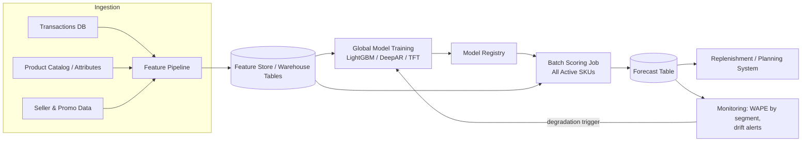
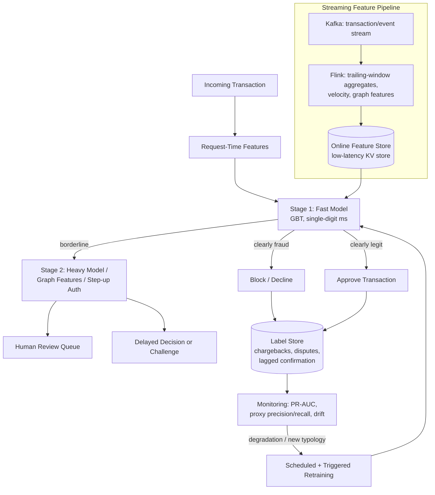
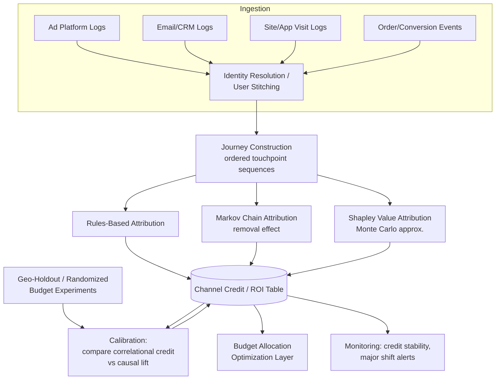
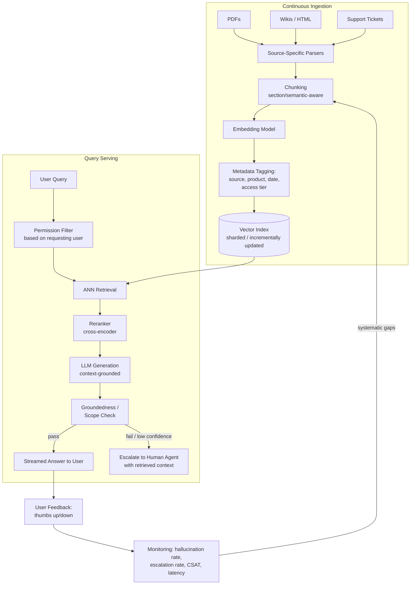
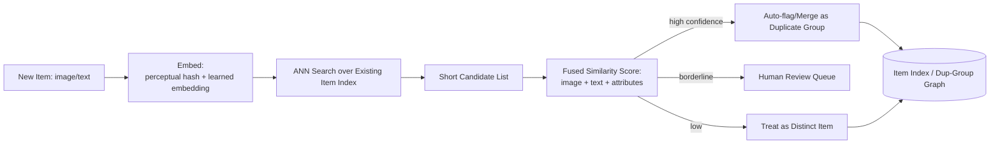

# ML System Design

This file is a practice set for open-ended "design an ML system" interview questions — the format senior candidates (3+ YOE) get hit with most. It gives a reusable general framework, then applies it end-to-end to six concrete designs spanning forecasting, real-time scoring, recommendations, attribution, RAG, and budget optimization. Where a design overlaps with a project already on the candidate's resume or with deep theory covered elsewhere in this kit, it cross-references rather than re-deriving.

## Table of Contents
- [General Framework](#general-framework)
- [1. Large-Scale Demand Forecasting for a New Marketplace](#1-large-scale-demand-forecasting-for-a-new-marketplace)
- [2. Real-Time Fraud/Anomaly Detection (<100ms)](#2-real-time-fraudanomaly-detection-100ms)
- [3. Recommendation System (Candidate Generation + Ranking)](#3-recommendation-system-candidate-generation--ranking)
- [4. Marketing Attribution / Incrementality Platform](#4-marketing-attribution--incrementality-platform)
- [5. RAG-Based Customer Support Chatbot](#5-rag-based-customer-support-chatbot)
- [6. Ad-Budget Optimization: LP vs Bandits](#6-ad-budget-optimization-lp-vs-bandits)
- [Quick Recall Sheet](#quick-recall-sheet)

---

## General Framework

The single biggest signal in an ML system design interview is not the final architecture — it's whether the candidate treats the problem as **under-specified on purpose** and clarifies before designing. Diving straight into "I'd use XGBoost with these features" without asking what's being optimized reads as junior. Spend the first 2-3 minutes narrowing scope out loud.

The eight-step framework used consistently across every design below:

1. **Problem clarification** — What exactly are we predicting or optimizing? What is the business objective (revenue, cost reduction, risk reduction, engagement)? What does success look like — a specific metric and target? What are the constraints (latency, budget, regulatory, team size)? What's explicitly out of scope?
2. **Data availability** — What data exists today, and in what state? Is it labeled, and if so how expensive/delayed are labels? What's the volume, freshness (batch vs streaming), and quality (missingness, label noise, selection bias)?
3. **Feature engineering** — What signals are actually predictive of the target? Which are available at inference time (avoid using features that don't exist yet in production, i.e. no future leakage)? What needs a feature store vs can be computed on the fly?
4. **Model choice** — Always start from the simplest reasonable baseline (heuristic, logistic regression, single global gradient-boosted model) and justify each increment in complexity by a specific limitation the baseline has. Complexity is a cost, not a virtue — the interviewer wants to see the tradeoff reasoning, not the fanciest architecture.
5. **Training/validation strategy** — How is data split so evaluation reflects production reality (time-based splits for anything with temporal structure, group-based splits to avoid leakage across correlated rows)? What's the target metric, and does it match the business objective from step 1?
6. **Deployment architecture** — Batch or real-time? What's the serving infrastructure (feature store, model registry, orchestration, endpoint)? What are the latency/throughput/cost tradeoffs of each choice?
7. **Monitoring/feedback loop** — How do we detect data drift, concept drift, and model degradation before it costs money? What triggers retraining — a schedule, a metric threshold, or both? How does online feedback (clicks, chargebacks, corrections) flow back into the training set?
8. **Scaling considerations** — What breaks first at 10x data/traffic? At 100x? Is the bottleneck compute, storage, feature-store read latency, or human-in-the-loop review capacity? What's the mitigation (sharding, approximate methods, caching, sampling)?

Every design below is structured with these exact eight subheadings, plus a short architecture diagram and a list of likely follow-up questions.

---

## 1. Large-Scale Demand Forecasting for a New Marketplace

**Prompt:** "Design a system to forecast demand for every SKU on a brand-new e-commerce marketplace with millions of SKUs." This design focuses on the *system* — the underlying time-series methods (ARIMA, Prophet, exponential smoothing, evaluation metrics like WAPE/MASE) are covered in depth in the dedicated time-series file and are only referenced here, not re-derived.

### Problem clarification
- What's the forecast horizon and granularity — next-day, next-week, next-quarter? Daily or weekly buckets? At SKU level, SKU×warehouse level, or category level?
- What decision consumes the forecast — replenishment/reorder quantities, staffing, ad spend planning? This changes the acceptable error and the cost asymmetry (under- vs over-forecasting).
- "New marketplace" is the critical qualifier: it means the *majority* of SKUs have little to no sales history at launch, and new sellers/SKUs onboard continuously — this is a cold-start-dominated problem, not a mature-catalog forecasting problem.
- Confirm scale: assume tens of millions of SKUs, heavy long-tail (a small fraction of SKUs drive most volume, a long tail sells a handful of units a month or nothing at all).

### Data availability
- Historical sales, when it exists, is short (marketplace is new) and often per-SKU sparse/intermittent — many SKUs have zero or a handful of transactions.
- Rich cross-sectional data usually *does* exist even without sales history: product catalog attributes (category, brand, price, images/text), seller attributes, and — critically — data from *similar* SKUs or the seller's other listings.
- External signals: marketing calendar, promotions, seasonality by category, competitor pricing if available, macro/holiday calendars.
- Data quality concerns typical of a new marketplace: inconsistent category taxonomies from sellers, duplicate/near-duplicate listings, missing attributes.

### Feature engineering
- Because so many SKUs lack history, the feature set must let the model **transfer information across SKUs**, not rely on each SKU's own lag features:
  - Product attribute features: category/subcategory, brand, price tier, pack size.
  - Text/image embeddings of the product title/description/photo, reduced via a pretrained encoder, to place semantically similar new products near known-selling products in feature space.
  - Category-level and seller-level aggregate statistics (mean/median demand of the category, seller's track record) as priors for new SKUs.
  - Calendar features (day-of-week, holiday, promotion flags) and price/discount features.
  - For SKUs that do have some history: lag features, rolling means/stds, days-since-launch (a "product age" feature is important — early-life demand curves differ systematically from steady-state).
- This is the standard cold-start mitigation pattern discussed in the time-series file's cold-start section: use hierarchical/attribute-based priors and cross-sectional pooling, rather than trying to fit a per-SKU model with no data.

### Model choice
- **Reject millions of local models as the default** — fitting a separate ARIMA/Prophet per SKU doesn't scale operationally (millions of models to train, store, and monitor) and, more importantly, cannot use cross-SKU information at all, which is fatal when most SKUs are cold-start.
- **Baseline:** category-level moving average / seasonal naive, assigned to new SKUs as a starting prior. Cheap, gives an immediate lower bar to beat.
- **Primary model: a single global model trained jointly across all SKUs**, using SKU/category/seller as categorical features rather than as separate models. Two reasonable choices:
  - A global gradient-boosted tree (LightGBM/XGBoost) on tabular features (lags where available, calendar, attributes, embeddings) — fast to train, handles missing lag features naturally (encode as "no history" via a flag + fallback aggregate), good default choice for a first production version.
  - A neural global forecaster (DeepAR, Temporal Fusion Transformer) that explicitly models a distribution over future demand per series and shares parameters across all series — better handles intermittent/sparse demand and gives calibrated prediction intervals, but heavier to train/serve and needs more engineering maturity.
- A single global model trained across all SKUs is the key design decision to call out explicitly: it makes cold-start tractable (a new SKU immediately gets a reasonable forecast from its attributes/category alone) and is operationally tractable (one pipeline to maintain, not millions).
- For very high-volume "hero" SKUs, consider a light per-SKU correction/ensemble layer once enough history accumulates — the same "which existing project" pattern as the demand-forecasting project deep-dive (ensembling global ML with local statistical models), but this is an optimization on top of, not a replacement for, the global model.

### Training/validation strategy
- **Time-based walk-forward validation, never random k-fold** — random splits leak future information into training and wildly overstate accuracy for a forecasting task.
- Evaluate with multiple rolling origins (e.g., train on data through month t, validate on month t+1, roll forward) to get a distribution of validation error rather than one lucky/unlucky split.
- **Hierarchical evaluation**: report error at SKU level, category level, and total-marketplace level — a model can look mediocre at SKU level (expected, given sparsity) but be excellent in aggregate, and the aggregate is often what the business decision actually needs (e.g., total inventory dollars). Reconcile forecasts across the hierarchy if needed (top-down/bottom-up/MinT reconciliation — see the time-series file).
- Primary metric: WAPE (weighted absolute percentage error) at the level relevant to the decision, since raw MAPE blows up on low-volume SKUs; segment SKUs by volume/history-length buckets (no history / short history / long history) and report accuracy per bucket, since a single blended number hides that cold-start SKUs are much worse.

### Deployment architecture
- Batch scoring, not real-time — demand forecasts feed replenishment/planning systems that run on daily or weekly cadence, so there's no latency pressure to justify a real-time endpoint.
- Orchestrate as a pipeline (Airflow / Vertex AI Pipelines / SageMaker Pipelines): ingest latest transactions → feature computation (including recomputing category/seller aggregates) → batch inference for all active SKUs → write forecasts to a warehouse table consumed by downstream planning systems.
- New SKUs get scored the same pipeline run they appear in (their attribute features are enough to get an inference), so cold-start SKUs don't wait for a special path.



### Monitoring/feedback loop
- Track WAPE/bias per SKU-volume segment over time, not just a single global number; flag categories or seller cohorts whose accuracy is degrading.
- Track forecast bias (systematic over/under-forecasting) separately from magnitude error — a supply chain cares about the sign of the error as much as its size.
- Data drift: monitor shifts in the input distribution (new categories appearing, price distribution shifts, sudden demand spikes from promotions/virality) that indicate the model is scoring outside its training distribution.
- Retraining trigger: scheduled retrain (e.g., weekly) is usually necessary regardless because the catalog keeps changing, supplemented by an alert-triggered retrain if aggregate WAPE crosses a threshold.
- As real history accumulates for a SKU, its forecast should smoothly transition from "mostly category prior" to "mostly its own signal" — monitor that this transition is actually happening (i.e., that per-SKU lag features are gaining importance as data accrues), rather than the model staying anchored to a stale cold-start prior forever.

### Scaling considerations
- Full retraining a global model across tens of millions of SKUs on every cadence gets expensive — use **incremental/warm-start training** (continue from the previous model's weights/trees rather than retraining from scratch) where the framework supports it, and reserve full retrains for a slower cadence (e.g., monthly) to absorb structural drift.
- If a single global model becomes unwieldy (training time, or genuinely different demand dynamics across very different categories — e.g., groceries vs electronics), **shard by category** into a handful of global models rather than millions of SKU-level models — this keeps the cold-start transfer benefit within a category while capping training cost.
- Batch inference cost scales linearly with SKU count — mitigate by only rescoring SKUs whose features actually changed materially since the last run, or by scoring low-volume long-tail SKUs at a lower cadence than high-volume SKUs.
- Feature-store read/write volume becomes the bottleneck before modeling does, at real scale — plan partitioning (by category/date) accordingly.

**Common follow-up questions:**
- *"Why not just fit an ARIMA per SKU?"* — Doesn't scale to millions of models operationally, and can't transfer information to new/sparse SKUs at all, which is fatal for a new marketplace where cold start dominates.
- *"How do you forecast a SKU with literally zero sales?"* — Fall back to category/seller/attribute-embedding-based prior from the global model; explicitly flag these as low-confidence forecasts downstream.
- *"How would you reconcile a SKU-level forecast with a category-level target the business already committed to?"* — Hierarchical reconciliation (top-down proportional allocation or MinT) so the SKU forecasts sum consistently to the category total.
- *"What retraining cadence, and why?"* — Incremental/warm-start weekly, full retrain monthly, balancing cost against how fast a new marketplace's catalog and demand mix genuinely change.

---

## 2. Real-Time Fraud/Anomaly Detection (<100ms)

**Prompt:** "Design a system that scores every transaction for fraud risk in under 100ms." The imbalanced-label handling techniques (SMOTE, class weighting, threshold tuning) are covered in depth in the model-evaluation file and are referenced, not re-derived, here.

### Problem clarification
- What kind of fraud — stolen card/account takeover, first-party/friendly fraud, promo abuse? Each has different signal.
- Critical asymmetry to surface explicitly: a false positive (blocking a legitimate transaction) has a real, immediate cost — customer friction, lost revenue, support burden — while a false negative (missed fraud) has a delayed, sometimes-recoverable cost (chargeback, but often insured/absorbed). This asymmetry should directly drive the operating threshold, not just "maximize F1."
- Confirm the 100ms budget is end-to-end (feature retrieval + inference + any downstream rule evaluation) and applies to the synchronous checkout path — asynchronous post-transaction review can run on a slower path.

### Data availability
- Historical transactions with fraud labels exist, but two problems dominate:
  - **Extreme class imbalance** — confirmed fraud is typically well under 1% of transactions.
  - **Label latency** — a "confirmed fraud" label often only arrives via a chargeback weeks later; transactions from the last few weeks are effectively unlabeled or provisionally labeled, which creates a serious risk of training on a systematically stale label set if not handled carefully.
- Labels are also **selection-biased**: you only observe an outcome for transactions that were approved (blocked transactions never get a chance to reveal whether they'd have been fraud), which biases naive retraining on your own model's decisions — a classic feedback-loop trap.

### Feature engineering
- Real-time behavioral/aggregation features computed over trailing windows: transaction velocity and amount over the last minute/hour/day for the card, device, IP, and account; time-since-last-transaction; deviation from the user's historical spend pattern.
- Reputation/graph features: device fingerprint reputation, IP reputation/geolocation mismatch with billing address, and graph-based features capturing shared devices/cards/emails across accounts (fraud rings share infrastructure — a graph or entity-resolution layer surfaces this far better than per-transaction features alone).
- Merchant/category risk features, and simple rule-derived features (e.g., mismatch between billing and shipping country).
- These all require a **low-latency online feature store** that can serve precomputed aggregates within single-digit milliseconds, since the model must consume them inside the 100ms budget alongside network and inference time.

### Model choice
- **Two-stage architecture** is the standard answer here, driven directly by the latency budget and the asymmetric cost structure:
  - **Stage 1 (fast path, applies to ~100% of traffic):** a lightweight, low-latency model — a gradient-boosted tree (well within a few ms to score) or a small neural net — trained to be well-calibrated at the extremes: confidently approve the large majority of clearly-legitimate transactions and confidently flag the small minority of clearly-fraudulent ones.
  - **Stage 2 (slow path, applies only to the ambiguous middle band):** transactions the fast model scores as borderline get routed to either a heavier model (more expensive features, ensembling, graph propagation) or a human review queue / step-up authentication (e.g., OTP challenge) — this path can take seconds, not milliseconds, because it's off the synchronous checkout critical path or only mildly delays it.
- GBTs (XGBoost/LightGBM) are the default choice for the fast path: they handle tabular, mixed-type, missing-value-heavy fraud features well, train fast, and are cheap to serve at low latency. A deep model is only worth the added serving complexity if graph/sequence structure (e.g., a GNN over the shared-device graph, or a sequence model over the user's transaction history) demonstrably beats GBT baselines in offline evaluation.

### Training/validation strategy
- **Time-based split, mandatory** — never randomly split, since fraud patterns evolve and a random split leaks future fraud typologies into training.
- Account explicitly for label latency: exclude or down-weight the most recent window of data (e.g., last 30-60 days) from the "confirmed legitimate" class during training, since a transaction with no chargeback yet might still become one — treat it as "not yet confirmed" rather than a clean negative, or use only fully-matured labeled cohorts for training/eval.
- Handle imbalance via class weighting or resampling (see the imbalanced-data techniques in the model-evaluation file) and evaluate with precision-recall AUC and precision-at-fixed-recall (or cost-weighted loss reflecting the false-positive/false-negative asymmetry from step 1) rather than accuracy, which is meaningless at <1% positive rate.
- Guard against the feedback-loop bias: periodically sample and manually review a random slice of *approved* transactions (not just ones the model flagged) so the label set isn't entirely conditioned on the model's own past decisions.

### Deployment architecture
- Streaming feature pipeline (Kafka/Kinesis feeding a stream processor like Flink) continuously updates the trailing-window aggregation features and writes them to a low-latency online feature store (e.g., Redis-backed) keyed by card/device/account/IP.
- At transaction time: the serving layer does a parallel fan-out read of precomputed features from the online store, combines with request-time features, and calls the model endpoint — all within the latency SLA. The model is served behind a low-latency endpoint with connection pooling and warm instances (no cold starts).
- Borderline-score transactions are pushed onto a queue for the heavier stage-2 model or a human-review UI, decoupled from the synchronous path.



### Monitoring/feedback loop
- True fraud labels lag by weeks, so monitor **proxy metrics available immediately**: the fast model's score distribution over time (shift indicates drift), the volume routed to stage 2/human review (a spike suggests either a fraud wave or model miscalibration), auto-decline rate, and step-up-auth pass rate.
- Once lagged labels do arrive, backfill true precision/recall and compare against the proxy metrics to validate they were a reasonable leading indicator.
- Fraud is adversarial — patterns actively evolve as fraudsters probe the system — so drift monitoring on feature distributions and score distributions needs to be more aggressive (shorter windows, lower alert thresholds) than in a typical non-adversarial setting, and retraining cadence needs to be faster than a standard batch-ML system.

### Scaling considerations
- The serving layer scales horizontally behind a load balancer; the real bottleneck at high QPS is almost always the **online feature store's read latency and throughput**, not the model itself — plan for sharding the feature store by key (card/device) and aggressive caching of hot keys.
- Graph-based features (shared device/card links) get expensive to compute in real time as the graph grows — typically precomputed/refreshed on a near-real-time cadence rather than fully recomputed per request.
- At 10-100x transaction volume, the human-review queue (stage 2's terminal path) becomes the actual capacity constraint, not compute — the fast model's precision at the boundary directly determines how much human review capacity is needed, which is a good concrete talking point for why stage-1 calibration quality matters operationally.

**Common follow-up questions:**
- *"How do you handle the fact that fraud labels take weeks to arrive?"* — Treat recent transactions as unconfirmed rather than clean negatives during training; only train/evaluate on fully-matured label cohorts, and monitor via proxy metrics in the interim.
- *"Accuracy is 99.5% — is the model good?"* — No, meaningless under <1% base rate; use PR-AUC and precision-at-fixed-recall or cost-weighted metrics instead.
- *"Why two stages instead of one very good model?"* — Latency budget forces the primary path to be cheap; a two-stage design lets the expensive, higher-precision path run only on the small ambiguous slice of traffic where it's worth the cost.
- *"How would you detect a brand-new fraud pattern the model has never seen?"* — Unsupervised/anomaly-detection signals (e.g., outlier scores, sudden shifts in feature distributions per segment) layered alongside the supervised model, since the supervised model is blind to genuinely novel patterns by construction.

---

## 3. Recommendation System (Candidate Generation + Ranking)

**Prompt:** "Design a recommendation system for a large catalog, including cold-start handling." Vector-index mechanics (FAISS/ANN internals) are covered in the RAG file and only referenced here; A/B testing methodology is covered in the hypothesis-testing/A/B file.

### Problem clarification
- What's being recommended, in what surface (homepage feed, "similar items," post-purchase), and what's the target — clicks, add-to-cart, purchases, watch-time? The objective determines the label used downstream.
- Confirm catalog and user scale (assume tens of millions of items, tens of millions of users) — this scale is exactly why a single model scoring every item for every user is infeasible and motivates the two-stage architecture.
- Clarify latency constraints for the recommendation surface (usually well under 200ms end-to-end for a live page load).

### Data availability
- Implicit feedback (clicks, views, purchases, dwell time) is abundant but noisy — a click is not the same as genuine preference (position bias, accidental clicks), and the *absence* of a click is not necessarily a negative signal (the user may never have seen the item).
- Explicit feedback (ratings, thumbs up/down) is sparse but higher-quality when available.
- Cold-start data gaps are structural: brand-new users have no interaction history, brand-new items have no interaction history, and both categories are added continuously.

### Feature engineering
- **User side:** embeddings learned from interaction history (sequence of past items engaged with), demographic/account features, session-level context (device, time of day).
- **Item side:** embeddings from interaction co-occurrence (collaborative signal) and content features (category, text/image embeddings of the item) — content features are what make cold-start items usable at all.
- **Context features:** time of day, device, page/surface, recency of last session.
- Cross features for the ranking stage: user-item affinity scores from simpler models, historical CTR for the item in similar contexts, freshness/recency of the item.

### Model choice
The standard, latency-driven answer is a **two-stage funnel**:

| Stage | Goal | Approach | Candidate set size |
|---|---|---|---|
| Candidate generation | High recall, cheap | Two-tower embedding model or matrix factorization; ANN search (e.g., FAISS/ScaNN) over item embeddings | Millions → few hundred |
| Ranking | High precision, expensive per item | GBT (e.g., LambdaMART) or a deep ranking model with rich cross features | Few hundred → top-N shown |

- **Candidate generation:** train a two-tower model (separate user tower and item tower, sharing a scoring function like dot product) on implicit feedback with negative sampling; at serving time, embed the user in real time and do approximate nearest-neighbor search against a precomputed item-embedding index to retrieve a few hundred candidates in milliseconds. Classic matrix factorization is a lighter-weight, still-valid alternative to two-tower when engineering resources are limited. Multiple candidate-generation sources are typically blended (collaborative embeddings, content-based similarity, trending/popularity, "bought together") to cover different retrieval angles.
- **Ranking:** re-score the few hundred candidates with a heavier model using rich user/item/context/cross features — a GBT ranking model is a strong, fast default; a deep model (e.g., a two-tower-plus-cross-features architecture or a transformer over the user's interaction sequence) is justified once offline gains over the GBT are demonstrated to be worth the added serving cost.
- **Cold-start handling** is a first-class part of the model choice, not an afterthought:
  - *New users:* fall back to non-personalized signals (popularity, trending, editorially curated) blended with any available signup context (declared preferences, referral source); shift weight toward personalized signal as interaction history accumulates within the session and over subsequent sessions.
  - *New items:* rely on content-based similarity (text/image embeddings placing the new item near similar existing items) to get it into candidate sets before it has accumulated its own collaborative signal; explicitly boost/explore new items in a small traffic slice to bootstrap real interaction data quickly.

### Training/validation strategy
- Implicit-feedback specific care: define positives carefully (e.g., click + sufficient dwell time, or purchase, rather than raw click) and use a principled **negative sampling** strategy (uniform random negatives are easy but too easy for the model; sampling "hard negatives" — items the candidate-generation stage retrieved but the user didn't engage with — produces a better-calibrated ranker).
- Time-based train/validation split (train on interactions up to time t, validate on interactions after t) to avoid leaking future engagement into training, analogous to the forecasting design.
- Offline metrics: NDCG@k and MAP@k on held-out interactions (same NDCG definition as used for retrieval evaluation in the RAG file — position-discounted relevance) plus recall@k specifically for the candidate-generation stage (did the true clicked item make it into the retrieved candidate set at all — a hard ceiling on ranking quality).
- Offline metrics are necessary but not sufficient — implicit-feedback offline eval is known to correlate imperfectly with actual online engagement, so an A/B test is mandatory before shipping a new ranking model (see the A/B-testing file for experiment design, sample size, and guardrail-metric methodology).

### Deployment architecture
- Item embeddings are computed in batch and loaded into an ANN index (FAISS or similar) that's refreshed on a cadence balancing freshness against rebuild cost.
- User embeddings are computed in real time (or near-real-time, updated per session) from recent interaction history.
- Ranking model is served as a low-latency online endpoint, invoked only on the small candidate set returned by the ANN lookup.
- A feature store supplies the cross features (historical CTR, affinity scores) needed by the ranker at serving time.

```mermaid
flowchart LR
    subgraph Offline / Batch
        I[Item Interaction Logs] --> E1[Item Tower Training]
        E1 --> IDX[(ANN Index\nFAISS / ScaNN)]
        C[Content Features:\ntext/image embeddings] --> E1
    end
    subgraph Online Serving
        U[User Request] --> UE[User Embedding\n(real-time / session-updated)]
        UE --> ANN[ANN Search over Item Index]
        IDX --> ANN
        ANN --> CAND[Candidate Set\n~few hundred items]
        CAND --> RANK[Ranking Model\nGBT / Deep Ranker]
        FS[(Feature Store:\ncross features, CTR, affinity)] --> RANK
        RANK --> TOPN[Top-N Recommendations]
    end
    TOPN --> LOG[Interaction Logging]
    LOG --> I
    LOG --> MON[Monitoring: engagement,\ndiversity, A/B tests]
    MON -->|new model candidate| E1
    MON -->|new model candidate| RANK
```

### Monitoring/feedback loop
- Online engagement metrics (CTR, conversion, session-level engagement) as the primary signal, tracked per surface/segment.
- **Diversity/filter-bubble monitoring** — track catalog coverage (what fraction of the catalog ever gets recommended), intra-list diversity, and whether the system is collapsing onto a narrow popular set; a purely engagement-optimized ranker will drift toward this failure mode if unchecked, so it's worth explicitly diversifying or re-ranking with a diversity penalty.
- All ranking model changes ship via A/B test, not just offline-metric comparison, given the known offline/online correlation gap; monitor guardrail metrics (e.g., long-term retention, not just short-term CTR, since CTR-only optimization can reward clickbait-y results that hurt retention).
- Feedback loop: logged interactions from the live system become training data for the next model iteration — watch for the same exposure-bias risk as in the fraud design (items never shown never get a chance to show engagement), mitigated via periodic exploration/randomization in a small traffic slice.

### Scaling considerations
- **Precompute and cache candidate sets** for highly active users/popular contexts to avoid redundant ANN lookups on every request.
- ANN index refresh cadence is a real tradeoff: full rebuilds are expensive at catalog scale, so incremental index updates (adding new items without a full rebuild) matter once the catalog is in the tens of millions.
- At 10-100x scale, the ranking stage's per-request cost (running the heavier model on a few hundred candidates for every request) becomes the dominant serving cost — mitigate via candidate-set caching, batching ranking requests, or a cheaper "pre-ranker" step between candidate generation and full ranking if the candidate set itself gets large.
- Two-tower/embedding retraining cadence vs ranking model retraining cadence can differ — the ranker (fast, cheap to retrain) can update more frequently than the embedding towers (slower, heavier to retrain), since ranking is more sensitive to recent trends and embeddings capture more stable long-term structure.

**Common follow-up questions:**
- *"Why not just rank the entire catalog directly?"* — Infeasible at millions of items under a tight latency budget; the two-stage funnel trades a small recall loss at the candidate-generation stage for tractable latency, recovering precision in the cheap-to-run-per-item ranking stage.
- *"How do you recommend to a user with zero history?"* — Popularity/trending fallback blended with any signup context, shifting to personalized signal as session/interaction history accumulates.
- *"How do you know a click means the user actually liked the item?"* — It doesn't reliably; use dwell time, downstream conversion, or explicit feedback as stronger positive signals, and treat raw clicks as a noisy proxy.
- *"How would you detect the model is stuck in a filter bubble?"* — Track catalog coverage and intra-list diversity over time, not just engagement; a shrinking recommended-item set despite catalog growth is the signature.

---

## 4. Marketing Attribution / Incrementality Platform

**Prompt:** "Design a marketing attribution system from scratch, as a platform serving the whole marketing org." The candidate's own multi-touch-attribution project (Markov chain + Shapley value, built on AWS) is the concrete implementation reference in the project-deep-dives file; this design generalizes it into a platform and adds the causal-incrementality distinction the standalone project didn't need to cover.

### Problem clarification
- What decision does the output feed — reallocating budget across channels, evaluating a specific new channel/campaign, justifying spend to finance? This determines whether correlational attribution is sufficient or a causal experiment is required.
- Which channels/touchpoints are in scope (paid search, social, display, email, affiliate, offline/TV)? Cross-device and cross-channel identity resolution is usually the hardest data problem here, so scope it explicitly.
- What's the conversion window and conversion event (purchase, signup, a specific in-app event)?

### Data availability
- Raw touchpoint logs per channel (impression/click events from ad platforms, email opens/clicks, site visit logs) — these typically live in different systems with different identifiers (cookie ID, device ID, hashed email, logged-in user ID), so **identity resolution / user stitching** across channels and devices is a prerequisite data-engineering problem before any attribution modeling can happen, and its quality caps the ceiling on attribution accuracy.
- Conversion events from the product/order system, joined back to the stitched identity.
- Data quality risks: walled-garden platforms (large ad platforms) often don't expose granular touchpoint-level data, only aggregated/self-reported conversion numbers — this is a real constraint that limits what attribution can measure for those channels and is worth stating explicitly rather than assuming full visibility.

### Feature engineering
- The core engineering task is building **customer journey sequences**: for each resolved identity, an ordered sequence of (channel, timestamp, campaign metadata) touchpoints ending in a conversion (or non-conversion) event within the defined window.
- Derived features per journey: touchpoint count, channel diversity, time-to-conversion, position of each channel in the sequence (first/middle/last touch), time gaps between touchpoints.
- Channel-level and campaign-level metadata (cost, creative, targeting) joined in for downstream ROI computation once credit is assigned.

### Model choice
- **Rules-based (first-touch/last-touch/linear/time-decay):** simplest, fully interpretable, and the right starting baseline — but arbitrary (why should last touch get 100% credit?) and known to systematically over-credit bottom-of-funnel/retargeting channels.
- **Markov chain attribution:** models the journey as transitions between channel-states, computes each channel's credit via the **removal effect** (the drop in overall conversion probability when that channel is removed from the transition graph) — captures sequential/interaction structure between channels that rules-based methods ignore, and is the method the candidate's own project implemented (see the project-deep-dives file for the removal-effect mechanics).
- **Shapley value attribution:** treats channels as players in a cooperative game and assigns credit based on each channel's average marginal contribution across all possible coalition orderings — theoretically the most principled (satisfies fairness axioms), but combinatorially expensive at high channel counts, addressed via Monte Carlo sampling of coalitions (again, see the project-deep-dives file for the specific approximation implemented previously).
- **The distinction that matters most at the platform level, and the one interviewers most want to hear explicitly:** all of the above — rules, Markov, Shapley — are **correlational** methods. They redistribute credit for conversions that already happened based on co-occurrence patterns in observational data; none of them establishes that the channel *caused* the conversion, because there's no counterfactual (what would have happened without that touchpoint) in observational data. Only a **randomized experiment** — a **geo-holdout test** (withhold advertising in a randomly selected set of geographies and compare conversion lift against matched control geos) or a **randomized budget/PSA experiment** (randomly assign users/regions to receive vs not receive a given channel's ads) — measures true **causal incremental lift**. A mature attribution platform runs both: correlational multi-touch attribution as the always-on, granular, fast-to-compute layer, and periodic incrementality experiments as the causal ground truth used to *calibrate* and sanity-check the attribution model's outputs (e.g., if MTA says channel X drives 20% of conversions but a geo-holdout shows near-zero incremental lift from X, that's a strong signal the correlational credit is inflated by cannibalization or brand-searchers who would have converted anyway).

### Training/validation strategy
- "Training" here is mostly recomputation rather than model fitting in the ML sense (for Markov/Shapley), but validation is still essential:
  - **Backtest attribution stability over time** — recompute channel credit on rolling historical windows and check that credit shares don't swing wildly month to month absent a real underlying change (instability suggests noisy transition-probability estimates, often from too little data in some channel combinations).
  - **Validate against incrementality experiments** wherever they've been run — treat the geo-holdout/randomized-experiment lift numbers as ground truth and check how far the correlational attribution numbers deviate, by channel.
  - Sensitivity-check the Markov transition-order assumption (first-order vs higher-order chains) and the Shapley Monte Carlo sample count for convergence.

### Deployment architecture
- Batch pipeline, recomputed on a regular cadence (e.g., weekly), not real-time — attribution informs budget decisions on a planning cycle, not a per-event basis.
- Pipeline stages: ingest touchpoint logs from all channel sources → identity resolution/stitching → journey construction → attribution model computation (rules + Markov + Shapley, computed in parallel as different views) → write channel-level credit and ROI to a reporting table.
- Attribution output feeds a downstream **budget-allocation optimization layer** (see Design 6) — this is the natural next stage of the platform, not a separate disconnected system.
- Incrementality experiments run on their own cadence (e.g., quarterly per major channel, or continuously via a small held-out control-geo slice) and are ingested as a separate calibration input.



### Monitoring/feedback loop
- Track each channel's attributed credit share over time and alert on large week-over-week shifts (could be a real market change, a tracking break — e.g., a platform's cookie/consent change reducing visibility — or a data pipeline bug, and these need to be distinguished quickly).
- Track identity-resolution match rates over time (degradation here silently corrupts every downstream attribution number, and is a very common real failure mode as browsers/platforms restrict cross-site tracking).
- Surface calibration gaps between correlational attribution and the latest incrementality experiment results to stakeholders directly, rather than presenting MTA numbers as unqualified truth.

### Scaling considerations
- Exact Shapley value computation is combinatorial in the number of channels/coalitions (2^n subsets), which becomes intractable beyond a handful of channels — mitigated via Monte Carlo sampling of random coalition orderings (converges to the true Shapley value with enough samples; the sample count needed vs channel count is a real, checkable tradeoff, and is exactly the approximation used in the candidate's own project — see project-deep-dives file for the specific implementation).
- At high touchpoint volume, journey construction (grouping and ordering events per identity) is the part most likely to need a distributed processing engine (Spark) rather than in-memory computation.
- Running incrementality experiments at scale (many channels, ongoing) requires a disciplined experiment-calendar/holdout-rotation design so geo-holdouts for different channels don't confound each other — an operational scaling concern as much as a technical one.

**Common follow-up questions:**
- *"Why not just use last-click attribution — it's what most tools default to?"* — Systematically over-credits bottom-of-funnel/retargeting channels and ignores the influence of upper-funnel touchpoints that made the conversion possible; fine as a cheap baseline, not defensible for real budget decisions.
- *"Markov vs Shapley — when would you pick one over the other?"* — Markov is cheaper and captures sequence/order effects naturally via transition probabilities; Shapley is more theoretically principled (fairness axioms) but combinatorially expensive and order-agnostic (treats a journey as a coalition, not a sequence) — many platforms compute both and present them as complementary views.
- *"How do you know your attribution model is actually right?"* — You don't, fully — it's correlational by construction; that's exactly why geo-holdout/randomized incrementality experiments exist as the causal ground truth to calibrate against.
- *"What breaks attribution quality most in practice?"* — Identity resolution failures (fragmented cross-device journeys) usually dominate error, more than the choice of attribution algorithm itself.

---

## 5. RAG-Based Customer Support Chatbot

**Prompt:** "Design an internal knowledge assistant / customer support chatbot over millions of documents." Chunking strategy, embedding model choice, and reranking mechanics are covered in depth in the dedicated RAG file and are only referenced here; this design focuses on the end-to-end product system for a support use case specifically.

### Problem clarification
- What's actually in scope for retrieval — product documentation, internal wikis, past support tickets, or all of the above? Ticket history in particular raises a scope question (is it useful precedent, or noisy/contradictory?).
- What's the acceptable latency (interactive chat implies a few seconds, including any streaming) and, more importantly, what's the acceptable **error mode** — is a wrong-but-plausible answer to a customer worse than an "I don't know, let me escalate"? For customer-facing support this usually means bias hard toward escalation over confident hallucination.
- Who are the users — external customers, or internal support agents (an internal-agent-assist tool has a much higher tolerance for occasional retrieval misses, since a human reviews the output before it reaches a customer).

### Data availability
- Heterogeneous sources: PDFs, wiki pages (HTML/Markdown), structured KB articles, historical support tickets (often messy, containing PII, informal language, and outdated resolutions) — this heterogeneity means the ingestion pipeline needs source-specific parsers feeding a common downstream chunk format.
- Documents have varying **access permissions** (some KB articles are internal-only, some ticket data may be customer/account-specific) and varying freshness requirements (a pricing page changes far more often than an architecture overview) — both must be captured as metadata, not just the raw text.
- Volume: millions of documents/chunks at scale, which is the regime the RAG file's indexing-and-scaling section is written for.

### Feature engineering / ingestion
- Unified ingestion pipeline: source-specific extraction (PDF parsing, HTML cleaning, ticket-thread flattening) → chunking (semantic/section-aware chunking rather than fixed-size, per the RAG file's chunking guidance) → embedding each chunk with a consistent embedding model → metadata tagging per chunk (source type, product area, last-updated date, access-permission tier, document owner).
- Metadata tagging is what enables **filtered retrieval** (e.g., only search chunks the requesting user is permitted to see, or only within a specific product line the user asked about) — this needs to be designed in from the start, not bolted on later, since retrofitting access control onto an existing index is painful.

### Model choice
- Standard retrieve-then-generate pipeline, with support-specific additions:
  - **Retrieval:** embedding-based ANN search (same FAISS/vector-index mechanics as the RAG file) over the chunk index, filtered by the requesting user's access permissions and any query-specified scope (product area, date range).
  - **Reranking:** a cross-encoder reranker over the top-k retrieved chunks to improve precision before they're fed to the generator (per the RAG file's reranking discussion) — particularly valuable in support since a wrong top-1 chunk directly becomes a wrong customer-facing answer.
  - **Generation:** an LLM conditioned on the reranked chunks, prompted to answer only from provided context and to explicitly say it doesn't know rather than fabricate when the retrieved context doesn't cover the question.
  - **Routing/escalation logic** is the support-specific addition beyond a generic RAG file's scope: a confidence/groundedness check (does the generated answer's content actually appear supported by the retrieved chunks?) and a scope check (is this question even answerable from the knowledge base, e.g., account-specific billing disputes might need a human regardless of retrieval quality) gate whether the answer is shown directly or the conversation is escalated to a human agent, with the retrieved context handed to that agent as a head start.

### Training/validation strategy
- **Offline retrieval evaluation:** recall@k and NDCG@k against a curated set of (query, relevant-document) pairs — ideally built from real historical support queries and their correct resolving documents, since this reflects the actual query distribution far better than synthetic queries.
- **End-to-end answer quality:** LLM-as-judge scoring (correctness, groundedness/faithfulness to retrieved context, helpfulness) on a held-out query set, supplemented by regular human spot-checks — LLM-as-judge alone is not sufficient for a customer-facing system given known judge biases and blind spots, so human review of a sampled slice is a necessary check, not optional.
- **Faithfulness/groundedness checks** specifically: verify the generated answer's claims are actually entailed by the retrieved chunks (not just topically related) — this is the primary hallucination-prevention validation step and should be tracked as its own metric, separate from general answer quality.
- Regression testing: maintain a fixed evaluation set of known-tricky queries (ambiguous, out-of-scope, multi-hop) that gets re-run on every pipeline/model change so improvements to one query type aren't silently regressing another.

### Deployment architecture
- Continuous ingestion pipeline that picks up new/updated documents on a schedule or via source-system webhooks, re-chunks and re-embeds only the changed documents (not the whole corpus), and upserts into the vector index — full reprocessing of millions of documents on every update is not viable.
- Serving API: query comes in → permission-filtered retrieval → rerank → generate, with **streaming responses** back to the user for perceived latency, and the escalation-routing check running either before display (blocking) or as a fast parallel check that can retract/flag an already-streamed answer if it fails the groundedness check.
- Access-control-aware retrieval is enforced at the retrieval layer itself (filtering by the metadata tags from ingestion, joined against the requesting user's permission set) — never left to the LLM to "decide" not to mention something it was given in context, since that's not a reliable security boundary.



### Monitoring/feedback loop
- **Hallucination rate:** sampled human or LLM-judge review of live answers against their retrieved context, tracked as a first-class metric, not an afterthought.
- **Escalation rate to human agents:** both an operational cost metric and a quality signal — a rising escalation rate on a stable query mix indicates a retrieval or knowledge-base coverage gap.
- **User satisfaction** (thumbs up/down, or downstream ticket-resolution correlation) and **latency** (retrieval + rerank + generation + any streaming overhead) tracked continuously.
- Feed low-confidence/escalated queries and negative feedback back into the eval set and, where a genuine knowledge-base gap is identified, back to content owners to fill — RAG quality is capped by document coverage as much as by the retrieval/generation pipeline.

### Scaling considerations
- At millions of documents, the vector index needs **sharding** (e.g., by product area or document source) both for query latency and for parallelizing incremental updates.
- **Incremental re-indexing** (only reprocessing changed/new documents) instead of full corpus rebuilds is a hard requirement at this scale, not an optimization — full rebuilds become operationally infeasible well before reaching millions of documents.
- **Caching frequent queries** (and their retrieved-context/answer pairs, with a TTL tied to document freshness) cuts both latency and LLM inference cost substantially for a support bot, where query distributions are heavily long-tailed with a hot set of very common questions.
- At 10-100x document scale, retrieval recall quality (not generation) is usually the first thing to degrade — mitigated by better metadata filtering (narrowing the search space before the ANN search) and by tuning/scaling the reranking stage rather than relying on retrieval breadth alone.

**Common follow-up questions:**
- *"How do you prevent the bot from leaking documents a user isn't permitted to see?"* — Enforce access-control filtering at the retrieval layer using metadata tags, never rely on the LLM's judgment as the security boundary.
- *"How do you measure hallucination without ground truth for every possible query?"* — Groundedness checks against retrieved context (is the answer actually entailed by what was retrieved) plus sampled human review, rather than requiring a full ground-truth answer key.
- *"What do you do when retrieval returns nothing relevant?"* — Explicit "insufficient information" response and escalate, rather than letting the generator fill the gap with a plausible-sounding fabrication.
- *"How do you keep the index fresh as documents change constantly?"* — Incremental re-indexing triggered by source-system updates/webhooks, not scheduled full rebuilds.

---

## 6. Ad-Budget Optimization: LP vs Bandits

**Prompt:** "Design an ad-budget allocation system, and discuss a bandit-based alternative to a linear-programming approach." The candidate's own LP-based project implementation is covered in the project-deep-dives file; this design goes deeper on the specific LP-vs-bandit tradeoff since it's the crux of the question.

### Problem clarification
- Confirm the decision cadence (daily/weekly reallocation across channels?) and the granularity of "arms"/allocation units (whole channels, or channel×campaign×audience-segment buckets?).
- Clarify whether per-channel response curves (spend → conversions/ROI, typically diminishing-returns/concave) are already reasonably well-estimated from historical data and marketing-mix modeling, or whether they're highly uncertain/volatile — this single fact is what should drive the LP-vs-bandit recommendation.

### Data availability
- Historical spend-vs-outcome data per channel, ideally from prior incrementality experiments (see Design 4) rather than purely observational attribution, since response-curve inputs built on correlational attribution risk baking in the same causal-inference problems discussed there.
- If historical experimentation is sparse, response curves are necessarily noisy/uncertain estimates — this is the core condition that motivates the bandit alternative.

### Feature engineering
- Not a classical feature-engineering problem in the tabular-ML sense; the relevant "features" are the estimated response-curve parameters per channel (e.g., a concave function fit via a Hill/saturation curve or a marketing-mix model) and any contextual features that shift response curves (seasonality, day of week, concurrent promotions) if a contextual-bandit extension is used.

### Model choice — the LP formulation
Frame it as a constrained optimization: given $n$ channels, each with an estimated concave response function $f_i(x_i)$ mapping spend $x_i$ to expected conversions/ROI, allocate a total budget $B$:

$$
\max_{x_1,\dots,x_n} \sum_{i=1}^{n} f_i(x_i) \quad \text{s.t.} \quad \sum_{i=1}^{n} x_i \le B, \quad \ell_i \le x_i \le u_i \ \ \forall i
$$

where $\ell_i, u_i$ are minimum/maximum spend constraints per channel (e.g., contractual minimums, diminishing-returns-driven maximums). If each $f_i$ is piecewise-linear (a common simplification of a diminishing-returns curve), this is a linear program solvable exactly and fast even at large $n$; if $f_i$ is smooth-concave, it's a convex program, still efficiently and globally solvable.

**Why LP is attractive:** simple to implement and explain to stakeholders, extremely fast to solve even with many channels/constraints, and gives a globally optimal allocation *given* its inputs. It's the right default when response curves are relatively stable and well-estimated (e.g., a mature channel mix with a long history of experimentation).

**Limitations of LP:** it treats the estimated response curves as known, fixed ground truth. It has no mechanism to represent *uncertainty* in those curves, and no mechanism to keep learning/improving the curve estimates over time — if the curves are wrong (new channel, seasonality shift, market change), the LP will confidently and optimally allocate budget according to a wrong model, with no built-in explore/exploit behavior to correct itself. This is precisely the **explore-exploit problem** LP doesn't address.

### The multi-armed bandit alternative
Frame each channel (or channel×budget-tier bucket, for finer granularity) as an **arm**; the reward observed after allocating budget to that arm is the realized ROI/conversions. The system must balance:
- **Exploitation** — allocating more budget to arms currently believed to have the best return.
- **Exploration** — allocating some budget to arms with uncertain estimates, to reduce that uncertainty and avoid prematurely locking in on a suboptimal allocation.

Two standard algorithm choices:
- **Thompson Sampling** — maintain a posterior distribution over each arm's expected reward, sample from each posterior, allocate according to the sampled values (naturally explores more where posterior uncertainty is wider, and converges to concentrating on the best arm as evidence accumulates).
- **UCB (Upper Confidence Bound)** — allocate to the arm maximizing an optimistic upper bound on estimated reward (mean estimate plus an uncertainty term that shrinks with more observations), which provably bounds regret.

**Regret**, the standard way to formalize how good a bandit policy is, is the gap between the reward of the best-fixed-arm-in-hindsight and the policy's actual cumulative reward:

$$
\text{Regret}(T) = \sum_{t=1}^{T}\big(\mu^{*} - \mu_{a_t}\big)
$$

where $\mu^{*}$ is the true mean reward of the best arm and $\mu_{a_t}$ is the true mean reward of the arm chosen at round $t$. A good bandit algorithm achieves **sub-linear** regret in $T$ (e.g., $O(\sqrt{T})$ or $O(\log T)$ depending on the algorithm) — meaning the average regret per round shrinks toward zero as the system keeps learning, rather than paying a constant per-round penalty forever.

### Training/validation strategy
- For the LP approach, "validation" means backtesting the fitted response curves against held-out spend/outcome data (or, ideally, against actual incrementality-experiment results) to check the curve shape is trustworthy before trusting the LP's allocation.
- For the bandit approach, validate via simulation first (replay historical spend/outcome data or a simulated environment built from the fitted response curves) to compare cumulative regret across candidate algorithms (Thompson Sampling vs UCB vs a naive epsilon-greedy baseline) before risking live budget.
- Both approaches should ultimately be checked against real incrementality experiments (Design 4) — a bandit that "explores" using purely correlational reward signals inherits the same causality caveats as attribution.

### Deployment architecture
- LP: a batch job, run on the reallocation cadence (e.g., weekly), that takes the latest fitted response-curve parameters and constraints, solves the optimization, and outputs the recommended spend split.
- Bandit: an online/continuous component that, on a faster cadence (e.g., daily, or per-campaign-experiment cycle), allocates small test increments of budget across arms according to the bandit policy, observes the resulting ROI, and updates each arm's posterior/estimate.
- **Practical hybrid architecture (the strongest answer to this prompt):** use the LP to set the *current best-estimate* allocation for the bulk of the budget (stable, explainable, globally optimal given current knowledge), and run a bandit layer on a smaller reserved slice of budget to continuously test and refine the underlying response-curve estimates — periodically feeding the bandit's updated, more confident curve estimates back into the LP's inputs. This captures LP's interpretability/optimality-given-inputs for the majority of spend while still solving the explore-exploit problem LP alone can't.

```mermaid
flowchart TB
    subgraph Data Layer
        H[Historical Spend/Outcome Data] --> RC[Fitted Response Curves\nper channel]
        EXP[Incrementality Experiments] --> RC
    end
    RC --> LP[LP / Convex Optimizer\nmax sum f_i(x_i) s.t. budget & bounds]
    LP --> ALLOC[Primary Budget Allocation\nbulk of spend]
    subgraph Bandit Layer
        RB[Reserved Exploration Budget] --> BA[Bandit Policy\nThompson Sampling / UCB]
        BA --> TEST[Test Allocations per Arm]
        TEST --> OBS[Observed ROI per Arm]
        OBS --> UPD[Posterior / Estimate Update]
        UPD --> BA
    end
    UPD -->|refined curve estimates| RC
    ALLOC --> SPEND[Total Deployed Budget]
    RB --> SPEND
    SPEND --> MON[Monitoring: realized ROI vs\nLP prediction, regret tracking,\ncurve-stability alerts]
    MON -->|significant re-estimate| RC
```

### Monitoring/feedback loop
- Track realized ROI/conversions per channel against what the LP's response-curve model predicted — systematic deviation signals the curves are stale and need re-fitting (or that the bandit's exploration budget should be increased).
- Track cumulative regret of the bandit layer over time as a direct measure of how much exploration cost is being "paid" versus how much curve-estimate improvement is being gained.
- Alert on channels where estimated response curves shift materially (e.g., a channel's marginal ROI drops sharply due to market saturation or a platform algorithm change) — this is the scenario the pure-LP approach handles worst, since it has no native mechanism to notice its own model is stale.

### Scaling considerations
- At many channels/segments (fine-grained arms — e.g., channel × audience × creative), the LP scales fine computationally (still just a bigger convex program), but the **bandit layer's exploration cost scales up proportionally with the number of arms** — more arms means more exploration budget needed to keep each arm's estimate reasonably confident, which eats into the exploitation budget; contextual bandits (sharing information across similar arms via shared context features) help this scale better than treating every fine-grained bucket as a fully independent arm.
- At very high arm counts, consider a hierarchical structure: bandit exploration at the channel level feeding LP allocation within each channel, or vice versa, rather than one flat bandit over every fine-grained bucket.

| Dimension | Linear Programming | Multi-Armed Bandit |
|---|---|---|
| Core assumption | Response curves per channel are known/well-estimated inputs | Response curves are uncertain and worth actively learning |
| Adaptivity | Static given its inputs; needs external re-fitting to adapt | Continuously adapts allocation based on observed reward |
| Optimality guarantee | Globally optimal *given* the input curves are correct | No single-shot optimum; converges toward optimal with sub-linear regret over time |
| Handles uncertainty | No — treats point estimates as ground truth | Yes — explicitly balances explore vs exploit |
| Complexity to implement | Low — standard convex/LP solver | Moderate — needs online reward tracking, posterior/estimate updates |
| Best fit | Stable, mature channel mix with reliable historical estimates | New/volatile channels, or evolving market conditions |
| Practical combination | Sets primary allocation from best current estimates | Runs on a reserved slice of budget to refine those estimates over time |

**Common follow-up questions:**
- *"When would you not bother with a bandit layer at all?"* — When response curves are already well-validated by extensive incrementality experimentation and the channel mix/market is stable — the added complexity of a bandit buys little if there's little genuine uncertainty left to resolve.
- *"How much budget should go to exploration?"* — No fixed answer — governed by the confidence-interval width on current curve estimates and the cost of exploration (a small reserved percentage, e.g., 5-10%, is a common practical starting point, tuned via regret monitoring).
- *"What's the actual formula/intuition behind regret?"* — The cumulative gap between the reward the best-in-hindsight fixed arm would have earned and what the policy actually earned; a good algorithm's regret grows sub-linearly (e.g., $O(\sqrt{T})$), meaning average per-round regret shrinks toward zero as more is learned.
- *"Doesn't the bandit's reward signal have the same causality problem as attribution?"* — Yes if reward is measured via correlational attribution; ideally the bandit's "reward" per test allocation is itself measured via a mini incrementality check (e.g., a geo-holdout on the test slice), not just raw observed conversions, to avoid inheriting attribution's causal-inference caveats.

---

## Additional Common Interview Questions

These are meta-level and smaller-scope questions that interviewers commonly weave into an ML system design round but that don't map onto any single full design above — either because they're about the *process* of doing system design itself, or because they're compact prompts that don't warrant a full eight-step writeup.

**Q: How do you decide whether a problem needs ML at all, versus a simpler rules-based or heuristic system?**

Start from the default assumption that ML is a cost (data pipelines, training infrastructure, monitoring, retraining, explainability burden, a whole extra failure surface) and has to earn its place over a simpler alternative — this framing itself is a strong signal to an interviewer. Concretely walk through: (1) *Is there already a well-understood, stable rule that captures most of the value?* If "flag any transaction over $10k from a new device" catches 80% of fraud loss, ship that first and let ML earn the remaining 20%. (2) *Is the pattern actually too complex or high-dimensional for humans to hand-encode?* — e.g., interactions across dozens of correlated signals, or a pattern that drifts faster than a human can update rules; that's where ML's ability to learn from data instead of being hand-specified pays for itself. (3) *Is there enough labeled data, or a cheap enough way to get it, to make a learned model actually outperform a heuristic in practice?* — ML with too little data usually loses to a well-tuned heuristic. (4) *What's the cost of a wrong decision, and does the situation demand explainability/auditability* (e.g., regulated credit decisions) that a simple rule delivers for free and a complex model complicates. In practice the right answer is almost never "pure ML" vs "pure rules" — it's usually a staged rollout: ship the heuristic immediately to get value on day one and establish a baseline, instrument it to collect labeled outcomes, then introduce ML once there's a data-backed case that it beats the heuristic by a margin that justifies the added operational complexity, often keeping the rules as a safety-net/override layer around the model rather than deleting them.

**Q: How would you design an experimentation/feature-flagging system to safely roll out a new ML model to production traffic gradually?**

Frame this as a staged confidence-building pipeline, not a single cutover:
1. **Offline evaluation gate** — the new model must beat the current production model on the standard offline metric suite (and not regress on any guardrail metric) on a held-out set before it's even eligible for a live rollout.
2. **Shadow mode** — deploy the new model alongside the existing one in production, feeding it live traffic and logging its predictions, but *never acting on them*; compare its predictions against the incumbent's and against eventual ground truth with zero user-facing risk. This catches production-only issues (feature-serving skew, latency regressions, edge-case inputs) that offline eval can't.
3. **Canary / percentage-based rollout via a feature-flagging layer** — route a small, randomized slice of live traffic (e.g., 1%) to the new model's actual decisions, monitor both the model's own metrics and system health (latency, error rate) and business guardrails, and ramp the percentage up in stages (1% → 5% → 25% → 50% → 100%) only after each stage clears its bar for a fixed observation window. The feature flag must support instant rollback (flip traffic back to the old model with no redeploy) since that's the whole point of gating exposure this way.
4. **Randomization unit matters** — decide whether to randomize by request, user, or session; user-level randomization is usually preferred so a given user gets a consistent experience across their session rather than flip-flopping between model versions.
5. **Statistical rigor** — treat each rollout stage as a mini A/B test with a pre-registered primary metric and guardrails, not just an eyeballed dashboard, so a genuinely bad model doesn't get rubber-stamped through by an underpowered check at 1% traffic (see the A/B-testing file for sample-size/power mechanics).
6. **Champion/challenger in steady state** — once fully rolled out, keep running a small persistent challenger slice so the next model iteration always has a live comparison arm ready, rather than starting the whole staged process from scratch every time.

The key thing interviewers listen for is the *shadow-mode-before-canary* step and the *automatic-rollback-on-guardrail-breach* mechanism — both are what separates "we A/B tested it" from an actually safe production rollout process.

**Q: What questions would you ask before designing a churn prediction system?**

This is a "clarify, don't design" prompt — the interviewer wants to see the first two framework steps applied crisply, not a full architecture. Compact structured answer:
- **Definition of churn** — is it a hard event (contract cancellation, account deletion) or a soft/implicit one (no login/purchase in N days)? The threshold N is itself a business decision, not a data-science one, and completely changes the label.
- **Prediction horizon and action window** — predicting churn 1 day before it happens is useless if there's no time to intervene; the horizon must match how long a retention action (discount offer, outreach call) takes to have effect.
- **What intervention exists at all?** — if there's no retention lever the business can pull, a churn model has no decision to inform and the project isn't worth building regardless of how accurate it could be; confirm the downstream action (targeted discount, CSM outreach, in-app nudge) exists and has a known cost.
- **Cost asymmetry** — cost of a false positive (wasted retention offer to someone who wasn't going to churn, which can even backfire by training users to expect discounts) versus a false negative (silently losing a customer) — this sets the operating threshold, exactly as in the fraud design.
- **Contractual vs non-contractual setting** — contractual churn (subscription cancellation) has an unambiguous label; non-contractual churn (a customer just stops buying) requires an arbitrary inactivity-window definition and is inherently noisier.
- **Population scope** — all customers, or only a specific segment (high-value accounts, recently onboarded users) where retention spend is justified? This also affects the class balance and the acceptable false-positive rate.
- **Data available** — usage/engagement logs, support-ticket history, billing/payment history, and whether early-lifecycle behavior (onboarding completion, time-to-first-value) is captured, since churn is often decided in a customer's first weeks even if it manifests months later.

Only after these are pinned down would a candidate move into a specific model (typically a GBT on tabular engagement/billing/support features, evaluated with precision-recall and cost-weighted metrics, retrained on a cadence matched to how fast usage patterns shift).

**Q: How would you design a system to detect duplicate or near-duplicate content at scale (e.g. images or marketplace listings)?**

A compact version of the standard framework, since the interesting part is almost entirely in feature engineering and the retrieval architecture:
- **Clarify**: exact duplicates (byte-identical) or near-duplicates (cropped/resized image, reworded listing with the same product)? Near-duplicate is the harder and more commonly asked version.
- **Representation**: embed each item into a vector space where near-duplicates land close together — a perceptual hash (pHash) for images as a cheap first pass, or a learned embedding (a CNN/vision-transformer embedding for images, a sentence embedding for text listings) for semantic near-duplicates that a hash would miss (different photo of the same product, reworded description).
- **Retrieval architecture**: this reduces to the same "avoid brute-force all-pairs comparison" problem as recommendation candidate generation — with N items, all-pairs comparison is O(N²) and infeasible at scale, so build an ANN index (FAISS/ScaNN) over the embeddings and, for each new item, query its approximate nearest neighbors and only run an expensive precise comparison (or a cross-encoder-style similarity model) on that short candidate list.
- **Thresholding and clustering**: rather than a single global similarity threshold, treat this as **clustering** — connect items whose similarity exceeds a threshold as edges in a graph, then extract connected components (or run a proper clustering algorithm) so that duplicate *groups* are identified, not just pairwise flags; this also naturally handles duplicate chains (A~B~C where A and C individually look less similar than a direct pairwise check might catch).
- **Multi-modal signal fusion**: for marketplace listings specifically, combine image-embedding similarity, text-embedding similarity, and structured-attribute matches (same price, same seller-declared SKU, same location) — any single signal alone has false positives (two visually similar but genuinely different products) that a fused score handles better.
- **Human-in-the-loop for the ambiguous band**, mirroring the fraud design's two-stage pattern: auto-merge/auto-flag high-confidence duplicates, route borderline-similarity pairs to human review rather than guessing.
- **Scaling**: incremental index updates as new items stream in (never a full rebuild per new listing), and shard the index by coarse category/region first to shrink the candidate pool before the fine-grained ANN search.



**Q: How do you decide between building your own ML system versus buying/using a managed or vendor service?**

Treat this as a structured cost-benefit tradeoff the interviewer wants argued explicitly, not a reflexive "always build" or "always buy":
- **Differentiation test** — is this capability core to the product's competitive advantage, or a commodity capability every company in the space needs? A recommendation engine for a company whose entire value proposition *is* personalization is worth building in-house; a spam filter for internal tooling probably isn't.
- **Data sensitivity/control** — does the data need to stay in-house for regulatory, privacy, or competitive reasons? A vendor solution requires shipping data externally, which can be a hard blocker regardless of cost.
- **Time-to-value** — a managed service (e.g., a cloud vendor's recommendation/forecasting/fraud API) can be integrated in weeks; a custom system takes months and a dedicated team. If the business need is urgent, start with the vendor solution to capture value immediately, and treat "build" as a later optimization once the value is proven and the vendor's limitations (customization ceiling, per-call cost at scale, lack of domain-specific feature support) start to bind.
- **Total cost of ownership crossover** — vendor solutions typically charge per-prediction/per-call, which is cheap at low volume but can become far more expensive than in-house infrastructure at high volume; model this crossover point explicitly rather than comparing sticker prices at a single volume level.
- **Customization ceiling** — can the vendor's model actually incorporate the domain-specific features/business logic that matter here, or does it treat the problem generically? A generic vendor fraud model, for instance, can't use a company's specific graph-of-shared-devices signal.
- **Team maturity** — does the org have the ML/data engineering talent and operational maturity (monitoring, retraining pipelines) to run a custom system reliably? If not, a managed service's operational simplicity is itself a major benefit independent of raw cost.
- **Practical answer pattern**: start with build-vs-buy as a staged decision, not a one-time one — buy/use a managed service first to validate the use case and get to market fast, instrument usage and outcomes, and revisit "build" once volume, differentiation needs, or cost crossover make an in-house system clearly worth the investment.

**Q: How do you handle a system design interview where the interviewer keeps changing the scale requirement mid-answer (e.g., "now imagine it's 100x")?**

This is a deliberate stress-test of whether the candidate's design was actually scale-aware from the start or just got lucky at the scale first stated — recognize it as such and respond by identifying *which specific component breaks first*, not by redesigning everything from scratch. Practical approach: (1) Don't panic-pivot to a totally different architecture; instead say out loud which part of the current design was already the bottleneck and how it degrades as scale grows (e.g., "at 100x, the online feature store's read QPS becomes the constraint before the model does — here's how I'd shard it"). (2) Reason in terms of what actually grows linearly vs sub-linearly vs what stays constant with scale — data volume, feature-store QPS, and index size usually grow with scale, but a model's raw inference cost per request often doesn't, so distinguish these instead of treating "everything gets 100x harder" as true. (3) Have 2-3 standard scale-mitigation moves ready to reach for regardless of the specific system — sharding/partitioning by a natural key, caching hot paths, sampling/approximate methods (ANN instead of exact search, approximate quantiles instead of exact), and moving from synchronous to asynchronous/batched processing where the latency budget allows it. (4) Explicitly flag when a component that was fine at the original scale needs a *qualitatively different* approach at 100x, not just "add more servers" — e.g., a single global feature store becomes a sharded one, a full nightly retrain becomes an incremental/warm-start one, an exact nearest-neighbor search becomes an approximate one. This response pattern — name the new bottleneck, distinguish what scales linearly, reach for a standard mitigation, and know when a qualitative (not just quantitative) architecture change is needed — is exactly step 8 of the general framework, and demonstrating you can apply it live, under a moving target, is the actual thing being tested.

**Q: What's the role of a feature store in a system design answer, and when should you bring one up?**

A feature store solves two distinct problems, and naming both is what separates a candidate who's actually used one from one who's just heard the term: (1) **Online/offline consistency ("training-serving skew")** — the same feature-computation logic must produce identical values whether it's run in a batch job over historical data (for training) or in real time at request time (for serving); a feature store centralizes the feature definitions so both paths compute them the same way, rather than having duplicate logic drift apart in two codebases. (2) **Low-latency serving of precomputed aggregates** — features like "this card's transaction count in the last hour" or "this user's rolling 7-day engagement score" are too expensive to compute from raw event logs at request time, so a feature store precomputes and stores them in a low-latency key-value layer (Redis-backed online store) that can be read within the serving latency budget, alongside a batch/offline store (data warehouse tables) used for training-set construction. Bring it up specifically when: the design has *any* real-time serving component (fraud detection, recommendation ranking) that needs aggregate/historical features computed ahead of time rather than from scratch per request; when multiple models/teams would otherwise duplicate the same feature-computation logic independently (a strong argument for centralizing it once feature reuse across the demand-forecasting, fraud, and recommendation systems becomes plausible); or when the interviewer probes "how do you make sure the features the model saw in training match what it sees in production." Don't over-mention it for designs with no real-time component and no feature reuse across models (e.g., a one-off batch attribution job) — forcing a feature store into every answer regardless of whether it's earning its keep reads as buzzword-matching rather than actual judgment.

**Q: How would you design for graceful degradation if your ML model's serving infrastructure goes down?**

The core principle: an ML-powered feature going down should degrade the user/business experience, not break it entirely — treat the model as an enhancement layer over a baseline that can survive on its own. Concrete layers: (1) **Fallback to the last-known-good cached prediction** where staleness is tolerable (e.g., yesterday's demand forecast, a cached recommendation list) rather than failing the request. (2) **Fallback to a cheaper, always-available heuristic** when a cached value isn't appropriate — e.g., if the ranking model endpoint times out, fall back to a simple popularity- or recency-based ranking rather than showing an error; if the fraud model is unreachable, fall back to a conservative rules-based check (block anything above a threshold, allow the rest) rather than either blocking all traffic or approving all traffic blindly. (3) **Circuit breakers and timeouts** on every call to the model-serving layer, so a slow/degraded model endpoint fails fast into the fallback path instead of cascading latency into the entire request and taking down an otherwise-healthy upstream system. (4) **Redundancy/multi-AZ or multi-region serving** for the model endpoint itself, so infrastructure failure in one zone doesn't take down the whole service — standard distributed-systems practice, but worth naming explicitly since ML-system-design candidates sometimes forget the serving layer is a regular production service subject to regular reliability engineering. (5) **Decide and communicate the acceptable degraded mode ahead of time with the business** — for some systems (fraud), "fail closed" (default to blocking, safer but costlier) is right; for others (recommendations), "fail open" to a non-personalized fallback is right; this choice should be explicit, not accidental, and mirrors the false-positive/false-negative asymmetry reasoning used in the fraud design. The strongest answers explicitly note that the fallback path should be tested regularly (chaos-engineering style — actually kill the model endpoint in a staging/canary environment periodically), since an untested fallback path often turns out to be broken exactly when it's needed.

**Q: How do you talk about the cost/latency/accuracy tradeoff triangle in a system design answer?**

Frame every major design decision — model complexity, real-time vs batch, single-stage vs multi-stage architecture, ensemble size — as a point chosen deliberately on a three-way tradeoff, and make the tradeoff explicit rather than implying a design is "free" on all three axes simultaneously (a common tell of an inexperienced answer). Concretely: a bigger/deeper model or a larger ensemble typically buys accuracy at the cost of both latency and serving cost; a cached/precomputed prediction buys latency and cost at the expense of freshness-driven accuracy loss (staleness); a multi-stage funnel (candidate generation → ranking, or fast-path → slow-path as in the fraud design) is precisely a way to *buy back* some of this tradeoff by spending the accuracy/latency/cost budget non-uniformly — cheap and approximate over the bulk of traffic/candidates, expensive and precise only where it's needed. When walking through a design, name which corner of the triangle the current constraint binds on (e.g., "the 100ms budget means we're latency-constrained here, so we accept a small accuracy hit from using a GBT instead of a heavier model") and revisit the tradeoff explicitly whenever the interviewer changes a constraint (see the scale-changing-mid-answer question above) — a higher latency budget or bigger compute budget should visibly unlock a different, more accuracy-favoring point on the same triangle rather than requiring an unrelated redesign. This framing is also a good default way to answer "how would you improve accuracy further" follow-ups: name the specific cost or latency being spent to buy that accuracy gain (a bigger model, an ensemble, a slower/more expensive feature), rather than presenting the improvement as costless.

---

## Quick Recall Sheet

**General framework (say this structure out loud before diving into any design):**
1. Problem clarification — target, business objective, success metric, constraints, explicit scope.
2. Data availability — what exists, labeled or not, volume/freshness/quality, label latency/bias.
3. Feature engineering — predictive signals actually available at inference time, no leakage.
4. Model choice — simplest baseline first, justify every increment in complexity.
5. Training/validation — correct splits (time-based/group-based), metric matched to the objective.
6. Deployment architecture — batch vs real-time, and why, given the latency/cost constraints.
7. Monitoring/feedback loop — drift detection, retraining triggers, online proxy metrics before labels arrive.
8. Scaling considerations — what breaks at 10x/100x, and the specific mitigation.

**One key differentiator per design:**

| Design | Key differentiator to lead with |
|---|---|
| Demand forecasting at scale | One **global** model across all SKUs (not millions of local models) — the only way to make cold-start tractable and training operationally sane. |
| Real-time fraud detection | **Two-stage architecture** — cheap fast-path model for ~100% of traffic, expensive slow-path/human review only for the ambiguous middle, driven by the false-positive/false-negative cost asymmetry. |
| Recommendation system | **Candidate generation (high recall, ANN) → ranking (high precision, rich features)** funnel — never rank the full catalog directly; cold-start handled via content-based fallback until collaborative signal accumulates. |
| Marketing attribution | Multi-touch attribution (rules/Markov/Shapley) is **correlational**; only **randomized geo-holdout/incrementality experiments** establish true causal lift — use experiments to calibrate the always-on attribution layer. |
| RAG support chatbot | **Access-control-aware retrieval + groundedness-gated escalation** — permission filtering belongs at the retrieval layer, and low-confidence answers should escalate to a human rather than risk a confident hallucination. |
| Ad-budget optimization | LP gives a globally optimal allocation **given known response curves**; bandits (Thompson Sampling/UCB) solve the **explore-exploit problem** LP can't — the strongest answer is a hybrid: LP for the primary allocation, a reserved bandit slice to keep refining the curves feeding it. |
