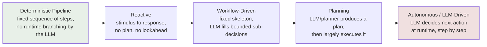
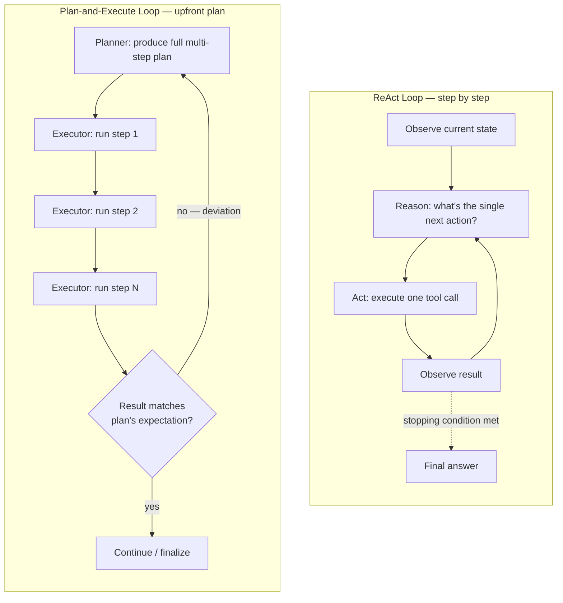
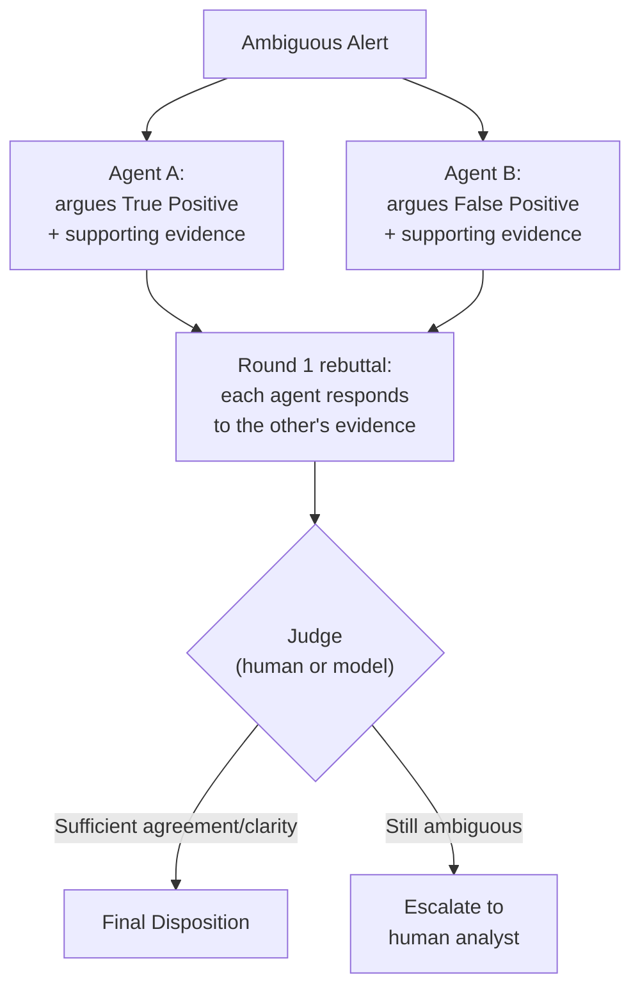
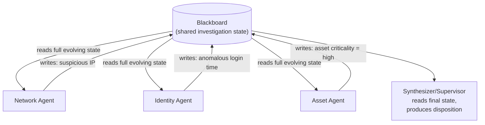
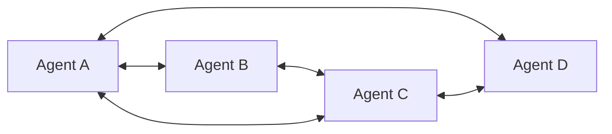
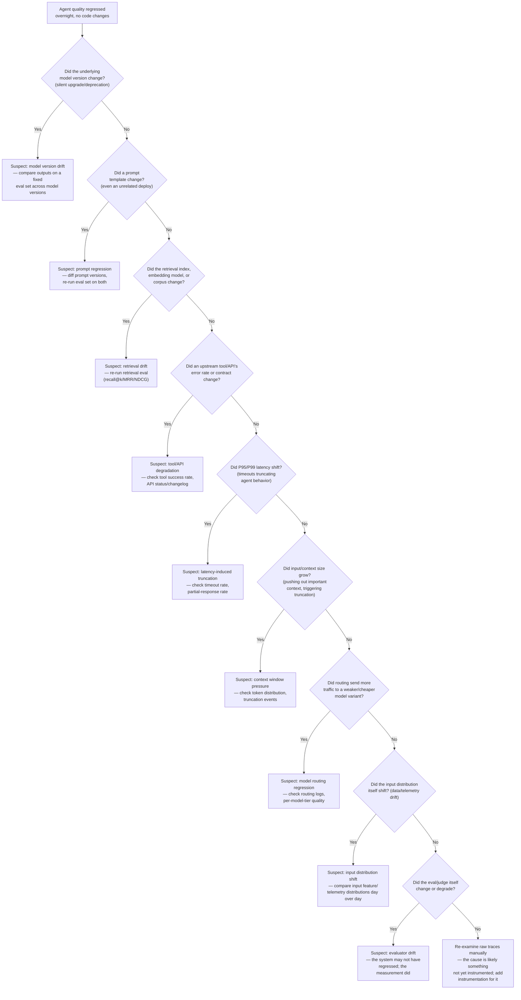
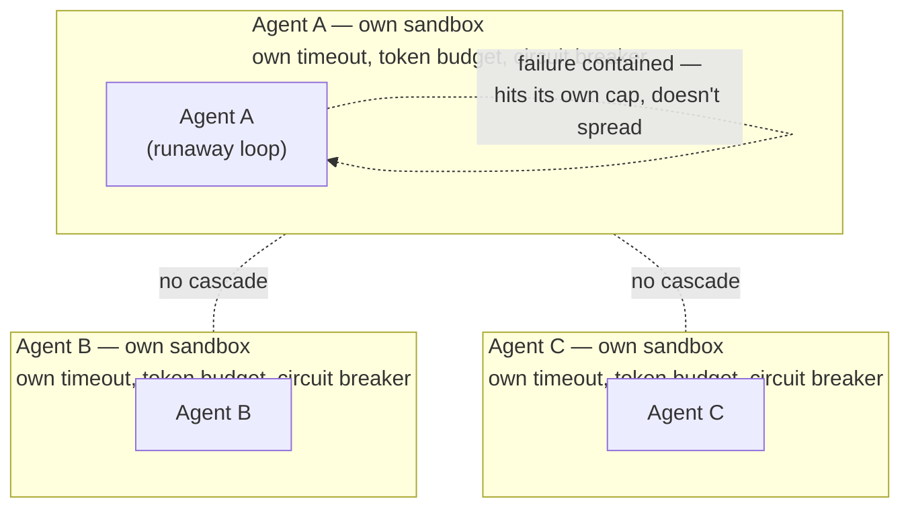

# Agentic Systems: Architecture, Planning, Memory, Coordination & Evaluation

This file goes **deeper on agent architecture, planning strategies, memory design, multi-agent coordination, evaluation, and observability** than file 12, which covers the RAG deep-dive and the LangChain/LangGraph *application layer* (chains, state graphs, tool-calling mechanics, guardrails). Where the two overlap, this file cross-references file 12 by name rather than re-deriving the same material, and instead treats agents as a systems-architecture and evaluation problem — the kind of depth relevant to building/tuning multi-agent systems that investigate security alerts and take remediation actions (the "Project Perception"-style scope). Companion files referenced throughout: file 06 (general classification metrics/calibration), file 11 (prompting-pattern framing of ReAct/self-consistency/tree-of-thought), file 12 (RAG + LangChain/LangGraph + guardrails), and forthcoming companion files on platform reliability-design and on agent/prompt-injection security, which this file flags but does not fully treat.

## Table of Contents

1. [Agent Architecture Taxonomy](#1-agent-architecture-taxonomy)
2. [Planning](#2-planning)
3. [Memory](#3-memory)
4. [Multi-Agent Coordination Patterns](#4-multi-agent-coordination-patterns)
    - [Peer-to-Peer Coordination](#peer-to-peer-coordination)
5. [Why More Agents Can Make a System Worse](#5-why-more-agents-can-make-a-system-worse)
6. [Agent Evaluation — The Five Layers](#6-agent-evaluation--the-five-layers)
    - [Regression Testing for Agents](#regression-testing-for-agents)
7. [Agent Observability](#7-agent-observability)
8. [Agent-Level Reliability / Failure Modes](#8-agent-level-reliability--failure-modes)
    - [Failure Isolation / Bulkheading](#failure-isolation--bulkheading)
9. [Popular Interview Questions — Full Answers](#9-popular-interview-questions--full-answers)
10. [Quick Recall Sheet](#quick-recall-sheet)

---

## 1. Agent Architecture Taxonomy

"Agent" is used loosely across the industry to mean everything from a single tool-augmented LLM call to a fully autonomous multi-day workflow. It's worth pinning down the actual architectural dimensions, because interviewers in this space use these terms precisely and expect you to distinguish them.

- **Reactive agents:** stimulus → response, with no internal deliberation over future consequences. Given the current observation, the agent maps it directly to an action (classic example: a rule-based or lightly-ML-scored triage system that fires a canned response to a known alert pattern). No plan is constructed; there's no lookahead. Fast, cheap, highly predictable — but brittle outside the situations it was designed for.
- **Planning agents:** before acting, the agent deliberates over a *sequence* of actions and their expected outcomes, selecting (or generating) a plan and only then executing it. This is the architectural difference between "decide what to do next, one step at a time, reactively" and "decide what to do across several steps, then act."
- **Tool-using agents:** the agent can invoke external functions/APIs as part of its action space (see file 12's Tool Calling section for the mechanics of how a model actually emits a structured call). This is an orthogonal capability, not a competing architecture — a reactive agent, a planning agent, and an autonomous agent can all be tool-using or not.
- **Memory-based agents:** maintain state across turns or sessions — the agent's behavior on turn $t+1$ can depend on what happened at turn $t$ (or in a session from last week), not only on the current input. See [Section 3](#3-memory) for the full taxonomy of memory types.
- **Stateful agents:** a broader notion than memory. A stateful agent tracks not just "what has the agent seen/said" (memory) but the evolving state of the *task itself* — which sub-steps of a multi-step workflow have completed, what the current plan is, what resources have been allocated, what the current confidence/risk score is. Memory is one input to state; state also includes things like "step 3 of 7 of the incident-response playbook is in progress" that aren't naturally "memories" at all.
- **Autonomous agents:** operate toward a goal with minimal per-step human input — the agent decides its own next action at each step without a human approving each one, often across long horizons and with the ability to revise its own plan. Autonomy is a *spectrum*, not a binary: how many decision points require human sign-off is the actual knob.
- **Workflow-driven agents:** execute a largely pre-defined workflow (a fixed sequence or state machine of steps — e.g., "collect alert context → check known-bad-IP list → check asset criticality → decide escalate or auto-remediate") with some adaptive steps (an LLM call fills in a sub-decision, like which explanation to write or which of several remediation templates fits) inside that fixed skeleton. This is the dominant pattern for production security/ops agents, not incidentally — see below.

### The critical axis: deterministic vs. LLM-driven orchestration

Every one of the categories above can be built with the *control flow* (what step runs next, under what conditions, with what fallback) implemented either as fixed code/state-machine logic, or as a runtime decision an LLM makes each time ("look at the state and decide what to do next"). This is a genuinely separate axis from "how autonomous is the agent's goal-pursuit," and it's the axis production security teams care about most:

- **Deterministic orchestration:** the sequence of steps, the branching conditions, and the fallback paths are fixed in code (or a state machine/graph definition) ahead of time. The LLM is invoked *within* specific, bounded steps of that fixed flow — e.g., "summarize this alert," "classify this indicator as malicious/benign given this fixed rubric," "draft this remediation ticket" — but it never decides *which step runs next* or *whether to skip a step*. Predictable, auditable, replayable, easy to test step-by-step, and — critically for security work — the blast radius of a bad LLM output is bounded to whatever that one step controls (an ill-worded summary is very different from an ill-considered decision to skip the approval gate).
- **LLM-driven orchestration:** the LLM itself decides, at runtime, what the next action/tool call should be, based on the current context (this is the classic ReAct-style agent loop — see [Section 2](#2-planning)). More flexible and better at genuinely novel situations the designer didn't anticipate, but the control flow itself is now non-deterministic: the same input can, in principle, take a different path through the system on different runs, which makes testing, auditing, and reasoning about worst-case behavior much harder.

**Why production systems — especially security-relevant ones — deliberately keep orchestration deterministic:** in an incident-response/remediation context, the *set of things that are allowed to happen* (which systems can be touched, what remediation actions exist, what requires human approval, what the escalation path is) is a compliance and safety question, not a creativity question. Baking that into fixed code means you can reason about worst-case behavior independent of what the LLM says on any given run, you can unit-test each transition, you get a clean audit trail ("the system followed playbook v3, step 4"), and a prompt-injection or hallucination failure is contained to *what the LLM is asked to produce inside one step* rather than *what the LLM decides the whole system should do next*. The LLM is used for what it's actually good at — synthesizing unstructured signals, writing natural-language rationale, filling in judgment calls within a bounded rubric — while the state machine (deterministic code) owns the guardrails: which transitions are legal, which actions require a human, when to halt and escalate. Fully autonomous, LLM-driven orchestration is reserved for lower-stakes, easily-reversible, or purely advisory workflows (research agents, draft-generation agents) where a wrong turn costs time, not an unauthorized action against production infrastructure.

| Architecture type | Autonomy level | Predictability / auditability | Typical use case |
|---|---|---|---|
| Reactive | None — direct mapping, no lookahead | Very high | Simple triage rules, canned alert responses |
| Workflow-driven | Low-to-medium — LLM fills sub-decisions inside a fixed skeleton | High | Production security/ops agents, regulated remediation flows |
| Planning (upfront) | Medium — plans ahead, then largely executes as planned | Medium-high (plan is inspectable before execution) | Multi-step investigations with a known playbook shape but unknown specifics |
| Tool-using (orthogonal) | Depends on host architecture | Depends on host architecture | Any agent needing external data/actions |
| Memory-based / stateful (orthogonal) | Depends on host architecture | Depends on host architecture | Long-running investigations, multi-session workflows |
| LLM-driven / autonomous (ReAct-style) | High — decides next action at runtime, step by step | Lower — path varies run to run | Open-ended research/investigation agents, exploratory tasks, low blast-radius actions |

**Interview angle:**
- *"Would you build a security remediation agent as a fully autonomous ReAct-style agent, or something more constrained? Why?"* — Model answer: I'd default to a workflow-driven architecture with deterministic orchestration — a fixed state machine (in LangGraph terms, a graph with mostly fixed edges and a small number of conditional edges) that encodes the playbook: gather context, enrich indicators, score severity, decide auto-remediate vs. escalate, execute or hand off. The LLM is invoked *inside* specific nodes — summarizing evidence, classifying an indicator against a rubric, drafting the remediation rationale — but it never decides which node runs next or whether to skip the human-approval gate; that's fixed code. The reason is blast radius and auditability: if the control flow itself were LLM-decided, a hallucination or a prompt-injection payload embedded in ingested telemetry could, in principle, talk the agent into skipping approval or taking an unauthorized action, and a compliance review couldn't point to a fixed set of legal transitions to reason about worst-case behavior. I'd reserve fully autonomous, LLM-driven orchestration for the advisory/research side — an agent that investigates and proposes a hypothesis for a human to review — where a wrong turn costs analyst time, not an unauthorized action against production systems.
- *"Isn't 'workflow-driven with an LLM filling in sub-decisions' just a chain, not really an agent?"* — Model answer: The line is fuzzier than the terminology suggests, and I wouldn't get hung up on the label. What matters is where the judgment calls live: if the system can only ever execute one pre-scripted sequence, it's a pipeline; the moment there are multiple legal next-states and something — even a narrow, rubric-bound LLM call — decides *which* one based on the current state, that's meaningfully agentic, even if the set of possible transitions is fixed and enumerable in advance. The "workflow-driven" label is about *how much* of the decision space is open, not whether any of it is.

---

## 2. Planning

### Task decomposition and hierarchical planning

**Task decomposition** is the basic move underlying every planning strategy below: break a high-level goal ("investigate and remediate this alert") into a set of sub-tasks that are individually more tractable (gather host telemetry, check indicator reputation, correlate with recent alerts on the same asset, assess blast radius, decide remediation action). **Hierarchical planning** takes this further by planning at *multiple levels of abstraction*: a high-level strategic plan ("this looks like a credential-compromise incident — investigate lateral movement, then contain") is itself decomposed into low-level executable steps ("query the identity provider's sign-in logs for this user over the last 24 hours," "diff the set of resources this account touched against its baseline"). The high-level plan changes rarely and is easier to reason about/audit; the low-level plan is regenerated or adapted per-incident. This mirrors classical AI planning (STRIPS-style hierarchical task networks) — the "hierarchical" part is what lets you keep a human-auditable strategic plan stable while the tactical details flex per-case.

### ReAct as an execution-loop architecture

File 11 covers ReAct as a *prompting pattern* (interleaving reasoning tokens with actions inside a single generation). Here, treat it as an **agent execution-loop architecture**: the agent operates one step at a time — reason about the current state, decide on a single next action (often a tool call), execute it, observe the result, and only then decide the next step, feeding the new observation back into the next reasoning step. There is no full plan committed to upfront; the "plan" only ever exists one step ahead. This makes ReAct naturally adaptive to new information (an unexpected tool result immediately informs the next decision) at the cost of being harder to preview, audit, or bound in advance — you don't know the full action sequence until it's already happened.

### Plan-and-execute

Contrasted directly with ReAct: a **planner** step produces a **complete multi-step plan upfront** (e.g., "1. query DNS logs for this domain, 2. check the domain against threat-intel feeds, 3. check which hosts resolved it in the last 7 days, 4. cross-reference those hosts against the asset-criticality DB, 5. draft a containment recommendation"), and a separate **executor** then carries out each step in order, generally without re-invoking the planner unless something deviates from what the plan expected (a step fails, returns an unexpected result type, or a downstream step's precondition doesn't hold) — at which point the plan is revised ([replanning](#replanning-and-verification-loops), below).

The practical tradeoff: ReAct is more adaptive step-to-step (no wasted planning if early results change everything) but each step incurs its own reasoning latency and the full action sequence is opaque until it's already run. Plan-and-execute front-loads reasoning into one inspectable plan (an operator or a guardrail layer can review/approve the plan *before* any action executes — valuable for anything touching production security infrastructure), executes the (usually cheaper, more mechanical) steps efficiently, and only pays the "replan" cost when reality actually diverges from expectation — which for many well-scoped tasks (most single-incident investigations following a known playbook shape) is the minority case.

### Tree/graph search over action sequences

Rather than committing to one plan (plan-and-execute) or one step at a time (ReAct), some architectures search over **multiple candidate plans or action sequences** before committing, structurally analogous to Tree-of-Thought (file 11) but applied to *actions* rather than *reasoning tokens*. MCTS-style (Monte Carlo Tree Search) approaches expand a tree of possible next-actions, simulate/estimate the value of following each branch some number of steps forward, and select the most promising branch — with the ability to **backtrack**: if a branch's early steps turn out to lead nowhere (a tool call fails repeatedly, an investigation path dead-ends), the search abandons that branch and resumes exploring from an earlier node rather than being stuck committed to a single failing trajectory. This is expensive (multiple candidate action sequences must be generated and/or partially executed/simulated) and is mostly reserved for high-value, high-ambiguity tasks where the cost of exploring several candidate investigation paths is worth it — e.g., an ambiguous incident where the first hypothesis (credential compromise vs. insider misuse vs. false positive) genuinely isn't clear from the initial alert alone.

### Self-reflection, replanning, and verification loops

- **Self-reflection:** the agent explicitly critiques its own intermediate output or proposed action against the goal *before* proceeding or finalizing — e.g., "here's my proposed remediation action; does this actually address the root cause, and could it have unintended side effects?" — as a distinct reasoning step, not merely hoping the first-pass answer is correct. This is architecturally similar to self-consistency/self-critique prompting patterns (file 11) but wired into the agent loop as a gate a proposed action must pass before execution.
- **Replanning:** when execution diverges from the expected trajectory (a step's actual result doesn't match what the plan assumed), the agent updates the remaining plan rather than blindly continuing to execute stale steps built on a now-false assumption. Good replanning re-invokes the planner with the *updated* state (what's actually been learned, not just what was originally assumed) rather than re-planning from scratch, which wastes the work already validated.
- **Verification loops:** explicitly check that a sub-task's output meets defined success criteria *before* moving to the next step, rather than assuming success because the tool call didn't throw an exception. This matters enormously in practice: a tool call can "succeed" (no error, HTTP 200) while returning a result that doesn't actually satisfy the sub-goal (an empty result set, a stale cache hit, a partial/truncated response) — verification is the difference between checking "did the call complete" and "did the call accomplish what step 3 of the plan needed."

**Interview angle:**
- *"When would you choose plan-and-execute over ReAct for an agentic system, and vice versa?"* — Model answer: I'd reach for plan-and-execute when the task has a mostly-known shape (a defined playbook exists), when I want the plan to be human-reviewable or auditable before any action executes — which matters a lot for anything touching production or security infrastructure — and when step-level reasoning cost matters (planning once up front is cheaper than re-reasoning from scratch at every single step). I'd reach for ReAct when the task is genuinely exploratory and each observation could meaningfully redirect the next action — early investigation of a novel, ambiguous alert where I can't confidently predict step 3 until I've seen step 1's result. In practice, hybrid designs are common: plan-and-execute at the top level for the known playbook skeleton, with a ReAct-style sub-loop inside any individual step that's inherently exploratory (e.g., "investigate this indicator" might itself be a small ReAct loop within a larger plan-and-execute investigation).
- *"What's the difference between a tool call 'succeeding' and a verification loop passing?"* — Model answer: A tool call succeeding just means the call executed without a transport/API-level error — the endpoint responded, no exception was thrown. A verification loop checks something stronger and task-specific: did the *content* of that response actually satisfy the sub-goal the plan needed at that step? A log query that "succeeds" but returns zero rows because the time-window parameter was off by a timezone is a successful call and a failed verification — and without an explicit verification step, the agent would happily proceed to the next step reasoning from an empty, misleading observation as if it were meaningful (i.e., "no matching logs found" gets silently misread as "confirmed: no suspicious activity," when it actually means "the query itself was wrong").

---

## 3. Memory

| Memory type | Persistence duration | Retrieval mechanism | Typical failure mode |
|---|---|---|---|
| Short-term / context memory | Current turn/session only — as long as it's in the context window | Implicit — whatever's still in the window | Falls out of context (truncation) as the conversation/task grows, silently losing earlier facts |
| Episodic memory | Durable, indexed by specific past event/session | Explicit lookup by "what happened when" — often retrieved by matching the current situation to similar past episodes | Retrieves an episode that's superficially similar but contextually inapplicable ("last time we saw this alert pattern" may not generalize) |
| Semantic memory | Durable, decoupled from the originating episode | Retrieved as a distilled fact/rule, independent of which session it was learned in | Over-generalizes from a small or biased sample of episodes into a "fact" that isn't actually reliable |
| Persistent memory | Survives across sessions/restarts by definition | Whatever storage-specific mechanism backs it (DB, vector store, file) | Grows unbounded if not pruned; stale entries never get invalidated |
| Retrieval-based (vector-store-backed) memory | As durable as the underlying store | Semantic similarity search against an embedding index — see file 12's Agent Memory section for the RAG-over-memories mechanism | Misses relevant memories phrased differently from the query (embedding mismatch); can also surface irrelevant near-duplicates |

**Short-term/context memory** is exactly what file 12 calls the "conversation buffer" — the raw content sitting in the current context window right now. **Episodic memory** is memory of specific past events, sessions, or interactions, indexed by *when* and *what* happened — "on March 3rd, this same host triggered a similar alert that turned out to be a false positive caused by a scheduled backup job." **Semantic memory** is the distilled, generalized knowledge extracted *from* episodes but no longer tied to any one of them — "this asset's backup job runs nightly at 2am UTC and commonly triggers a benign spike in outbound traffic," which may have been learned from several episodic instances but is now stored as a standalone fact usable regardless of which specific past incident taught it. The episodic-vs-semantic distinction matters architecturally because they're usually stored and retrieved differently: episodic memory is naturally a timestamped, event-indexed store (was this alert seen before, and what happened?), while semantic memory is more like a distilled knowledge base (facts, rules, learned asset baselines) that gets *updated* as new episodes are digested rather than merely appended to.

**Persistent memory** is the durability property that both episodic and semantic memory typically need in a production agent: it survives across sessions, stored durably (a database, a vector store, a file), rather than living only in one conversation's context window. **Retrieval-based memory** is the *mechanism* most persistent memory uses in practice — vector-store-backed recall triggered by semantic similarity between the current context and stored memory entries (embed the current situation, similarity-search the memory store, inject the top-k matches). See file 12's Agent Memory section for the mechanics, which are structurally identical to RAG but over "memories" instead of documents.

### Memory contamination — a security-relevant concern

**Memory contamination** is irrelevant, stale, or adversarially-injected content polluting an agent's memory store and biasing its future reasoning. This is worth flagging explicitly for a security-agent context: an agent that persists "facts" it learned during an investigation (e.g., "indicator X was confirmed benign") is only as trustworthy as the process that wrote that fact — if a compromised or manipulated upstream data source, or a deliberately crafted piece of content an earlier investigation ingested, gets summarized into semantic memory as an established fact, every future investigation that retrieves that memory inherits the contamination, and the false conclusion looks exactly like a legitimately-learned fact from the retrieval layer's point of view. This connects directly to **memory poisoning** as an attack technique (an adversary deliberately engineering inputs so the agent writes a false, exploit-enabling "fact" into durable memory) — full security treatment (attack mechanics, detection, defenses) belongs in the companion agent-security file; the architectural takeaway here is that any persistent-memory design needs provenance tracking (where did this memory entry come from, how confident was the source) and some notion of memory review/expiry, not blind trust-on-write.

### Memory pruning

Unbounded memory growth degrades both cost (larger indexes, more retrieval latency) and quality (more near-duplicate or stale entries competing for the top-k retrieval slots, diluting genuinely relevant results). Standard pruning strategies:

- **Summarization/compaction:** periodically collapse many raw episodic entries into a smaller number of distilled semantic entries (this is also how episodic memory often *becomes* semantic memory over time), reducing storage and improving retrieval signal-to-noise.
- **Recency + relevance-weighted forgetting:** decay the retrieval-priority of older, less-frequently-retrieved entries rather than treating all memory as equally salient forever — analogous to a cache eviction policy, but scored by a blend of recency and how often/successfully an entry has actually been retrieved and used.
- **Explicit TTLs (time-to-live):** hard-expire certain classes of memory after a defined window — appropriate for facts with a known shelf life (a "this IP was benign as of last week" entry should not be trusted indefinitely without re-verification, since IP reputation is exactly the kind of fact that goes stale).

**Interview angle:**
- *"How would you design memory for a security investigation agent that needs to recall past incidents on the same asset?"* — Model answer: I'd keep episodic memory as timestamped, structured investigation records (what alert fired, what was found, what action was taken, confirmed disposition) indexed both by asset and embedded for semantic similarity search, so a new alert can retrieve "similar past incidents on this or comparable assets." I'd separately maintain a semantic memory layer of distilled asset baselines and learned facts ("this host's normal traffic pattern," "this service account's typical access scope") that gets updated, not just appended to, as new episodes confirm or contradict it. Critically, every memory write would carry provenance (which investigation produced this, what confidence level, was it human-confirmed or agent-inferred) so a downstream consumer can weight agent-inferred-and-unconfirmed memory lower than analyst-confirmed memory, and I'd put TTLs on anything time-sensitive (indicator reputation, asset criticality) so the agent doesn't act on stale "facts" indefinitely — this is also my main defense against memory contamination: unconfirmed, low-provenance entries get down-weighted or excluded from being used to justify autonomous action, even if they're allowed to surface as a lead for a human to check.
- *"What's the difference between episodic and semantic memory, and why does the distinction matter operationally?"* — Model answer: Episodic memory is "what happened, when" — a record of a specific past event you can look up. Semantic memory is the generalized fact or rule *extracted from* one or more episodes, no longer tied to any particular one. The operational reason this matters is that they should be pruned, trusted, and retrieved differently: an episodic record should stay attributable to its source event (so it's auditable — "why does the agent believe this?" should trace back to a specific past incident), while semantic memory is meant to be used *without* re-deriving it from raw episodes every time, which is exactly why it's more dangerous if wrong — a bad semantic "fact" gets used repeatedly across many future investigations without anyone re-checking the episode(s) it was distilled from, whereas a bad episodic record only misleads the specific query that happens to retrieve that one event.

---

## 4. Multi-Agent Coordination Patterns

| Pattern | Coordination style | Latency profile | Failure isolation | Best-fit scenario |
|---|---|---|---|---|
| Supervisor → workers | Centralized routing/aggregation | Supervisor + one worker's latency (workers run independently, not necessarily fanned-out) | Good — supervisor can catch a bad worker output before it propagates | Distinct specialties with a natural router (billing/tech/refunds; see file 12) |
| Sequential (fixed pipeline) | Linear, each stage feeds the next | Additive — sum of every stage's latency | Poor — an early-stage error propagates downstream unless explicitly checked | Well-defined multi-stage transformation (ingest → enrich → score → report) |
| Parallel (fan-out/fan-in) | Independent, simultaneous, then combined | Max of the parallel branches, plus fan-in/aggregation overhead | Good per-branch — one branch failing doesn't block others, if fan-in tolerates partial results | Independent sub-investigations that can run concurrently (check IP reputation + check user behavior + check asset criticality, simultaneously) |
| Debate | Two-plus agents argue opposing positions, a judge decides | Higher — multiple rounds of argument before resolution | Good — disagreement is surfaced explicitly rather than silently averaged away | High-stakes, ambiguous calls where surfacing disagreement (not hiding it) is valuable — e.g., "is this actually malicious?" |
| Voting / ensemble | Independent parallel answers, majority/weighted vote | Similar to parallel fan-out | Moderate — a systematic bias shared by all voters isn't caught by voting alone | Reducing variance on a well-defined classification-style decision |
| Specialist agents | Invoked narrowly for domain expertise (often as workers under a supervisor or blackboard) | Depends on host pattern | Good — narrow scope limits what a specialist's error can affect | Any sub-task genuinely requiring narrow expertise (malware reverse-engineering agent, identity-log agent) |
| Blackboard / shared-context | Agents read/write a common shared state, not each other directly | Can be lower than sequential — agents can act opportunistically as soon as relevant state appears, not strictly in turn | Weaker by default — requires explicit synchronization discipline (see [Section 5](#5-why-more-agents-can-make-a-system-worse)) | Many agents need visibility into an evolving shared situation — e.g., an incident investigation where new evidence should immediately inform every agent's next move |
| Peer-to-peer | Decentralized — agents message each other directly, no central router or shared board | Variable — depends on how many negotiation rounds it takes to converge | Poor by default — no central node sees the whole exchange or can catch a bad message before it propagates through the mesh | Decentralized negotiation between agents with differing local information/incentives, swarms of many small agents, designs where a single supervisor node would itself be an unacceptable single point of failure |

### Supervisor → workers, deeper

File 12 introduces supervisor-worker as *routing to the right specialist*. Going deeper: the supervisor's real job spans three distinct responsibilities that are worth separating when designing one — (1) **routing**: deciding which worker(s) should handle a given sub-task, (2) **aggregation**: combining worker outputs into a coherent result (which is nontrivial when workers disagree or return partial/conflicting information), and (3) **arbitration**: resolving conflicts between worker outputs or deciding when a worker's output isn't trustworthy enough to use as-is (low confidence, contradicts another worker, contradicts known ground truth) and needs a follow-up (re-query the worker, escalate to a human, invoke a different worker). Many supervisor implementations only really do (1) well and treat (2)/(3) as an afterthought — that's often where multi-agent security-investigation systems actually fail: not in any one specialist being wrong, but in the supervisor naively concatenating or averaging outputs that should have been flagged as conflicting.

### Sequential and parallel patterns

**Sequential agents** form a fixed pipeline: agent A's output is agent B's input, is agent C's input, and so on — structurally identical to a LangChain chain (file 12) but at the multi-agent granularity rather than the single-call granularity. Simple to reason about and debug (linear trace), but latency is additive and an early error has no chance to be caught before it propagates, unless an explicit validation stage is inserted between agents.

**Parallel agents** fan a task out to multiple agents that work simultaneously on independent sub-problems, then fan back in to a combination step. This trades additive latency for max-of-branches latency (much faster when sub-tasks are genuinely independent) at the cost of needing a real fan-in strategy: what happens if one branch is slow, errors, or returns a low-confidence result while the others succeed? A good fan-in design decides upfront whether to wait for all branches, proceed with a timeout and partial results, or treat a missing branch as itself informative (e.g., "the asset-criticality lookup timed out" might itself be worth flagging).

### Debate

Two or more agents are assigned **opposing positions or independently-derived solutions**, argue for them (each agent sees and can rebut the other's argument, often over multiple rounds), and a judge — a human, a separate model, or a fixed rubric — decides the outcome. The value isn't that debate magically produces truth; it's that structured disagreement surfaces the specific points of uncertainty or weak evidence that a single agent's confident-sounding answer would otherwise hide. In a security context: one agent argues "this is a true positive, here's why," another argues "this is a false positive, here's why," and the judge (or a human analyst) reviews both arguments rather than trusting a single agent's unopposed conclusion — useful precisely in the ambiguous cases where a single-agent judgment is least reliable.

### Voting/ensemble

Multiple agents independently produce an answer to the *same* question (not opposing positions — just independent attempts, often with some diversity injected via different prompts, different models, or sampling temperature), and a majority or weighted vote decides the final answer. This is architecturally the multi-agent analogue of self-consistency (file 11) — sample diversity, then aggregate — and is most useful for reducing variance on a well-defined decision (a classification-style call: malicious/benign, escalate/don't) rather than for surfacing genuinely novel reasoning, since a systematic bias shared across all the voters (e.g., all instances of the same underlying model sharing the same blind spot) isn't caught by voting at all.

### Specialist agents

Narrow, domain-specific sub-agents invoked for their specific expertise — a malware-analysis agent, an identity/access-log agent, a network-traffic agent — typically as workers under a supervisor or as contributors to a shared blackboard. The value of narrowness is containment: a specialist with a tightly scoped tool set and prompt is much easier to evaluate, test, and reason about the failure modes of than a single generalist agent trying to do everything, and its errors are naturally bounded to its narrow domain rather than leaking into unrelated judgments.

### Blackboard / shared-context architecture

Structurally distinct from every pattern above: instead of agents passing messages directly to one specific other agent (supervisor→worker, A→B→C sequentially, or peer-to-peer debate), all agents read from and write to a **common shared state** — the "blackboard." An agent doesn't need to know which other agent will consume what it writes, or wait for a specific upstream agent to hand it a message; it simply posts findings to the shared state and any other agent that needs that information reads it directly. This is preferred when **many agents need visibility into an evolving shared situation** rather than a fixed producer→consumer relationship — the canonical example is exactly an incident investigation: as one agent discovers a suspicious IP, another discovers unusual login timing, and a third discovers an affected asset's criticality, every other agent benefits from seeing all of that as it accumulates, not just the piece a rigid message-passing topology happened to route to it. The structural tradeoff versus message-passing: blackboard removes the need to design and maintain an explicit communication topology (who talks to whom), which scales better as agent count grows and the "who needs to know what" relationships are dense/unpredictable — but it pushes the coordination problem into **state management**: without careful synchronization, agents can read a stale snapshot of the blackboard, two agents can write conflicting updates, and there's no built-in guarantee about read/write ordering the way a message-passing sequence naturally provides (see [Section 5](#5-why-more-agents-can-make-a-system-worse) for exactly this failure mode).

### Peer-to-Peer Coordination

The last structural option, and the one that removes centralization most completely: agents communicate **directly with each other**, with no supervisor deciding routing/aggregation/arbitration and no shared blackboard mediating what anyone sees. Agent A sends a message straight to agent B (or broadcasts to whichever peers it's wired to), gets a direct reply or counter-proposal, and the two (or more) agents negotiate or coordinate without any central node ever seeing the whole exchange.

Contrast explicitly with the two patterns it's easiest to confuse it with:
- **vs. supervisor-worker:** supervisor-worker centralizes routing, aggregation, and arbitration in one node that every message effectively passes through (or at least is visible to); peer-to-peer has no such node — there's nothing that necessarily sees every exchange, and no single place that can veto or reconcile a bad message before it takes effect downstream.
- **vs. blackboard/shared-context:** blackboard decentralizes *state* (no one agent owns the shared picture) but still coordinates *indirectly* through one common location — every agent reads and writes the same board, so at least the state itself is a single, inspectable place to look. Peer-to-peer decentralizes the *communication* itself: coordination happens through direct messages between specific agents, with no shared board and no requirement that any third party ever observes the exchange at all.

Typical use cases: **negotiation** between agents that each hold genuinely local information or conflicting incentives and need to reach a joint decision (neither agent's view is authoritative on its own, so a supervisor imposing a decision from outside would be working with less information than the two peers combined); **decentralized swarms** of many small, narrow agents coordinating locally rather than funneling everything through one router; and any design where a **single supervisor node would itself be an unacceptable single point of failure** — resilience-first architectures that would rather degrade gracefully (some peers keep negotiating even if others drop out) than depend on one central coordinator staying up.

*No central node — every arrow is a direct, unmediated message between two peers; nothing in the topology guarantees any third party observes a given exchange.*

**The core tradeoff:** peer-to-peer is the most resilient pattern to a single point of failure — there's no supervisor whose outage stalls the whole system, and no shared board whose corruption poisons every consumer at once — but that same lack of centralization is exactly what makes it the hardest pattern to reason about, debug, and bound. Emergent behavior is the norm rather than the exception: the system's overall behavior is whatever falls out of many local, pairwise interactions, and predicting it from the individual agents' rules alone is genuinely hard. There's no central point that can guarantee **termination or convergence** — a negotiation between peers can in principle loop indefinitely with neither side yielding, where a supervisor pattern would have a natural place to impose a decision and stop. It's the hardest pattern to **debug**: a bug in the "conversation" between two specific peers has no natural place to observe it globally, unlike a supervisor's aggregation step or a blackboard's central log — reconstructing what happened means tracing pairwise message logs across the whole mesh rather than reading one aggregation point. And it can introduce its own **coordination overhead** in the other direction — redundant back-and-forth negotiation between peers to reach an agreement a supervisor could have settled in one authoritative decision. For these reasons, peer-to-peer is comparatively rare in production security/ops agent systems specifically *because* auditability and bounded behavior are first-order requirements there — it's a better fit for research/simulation settings or genuinely decentralized swarms than for a system whose actions need a clean audit trail.

**Interview angle:**
- *"When would you use a blackboard/shared-context pattern instead of a supervisor pattern?"* — See the fully worked answer in [Section 9](#9-popular-interview-questions--full-answers).
- *"What's the actual structural difference between message-passing (like supervisor-worker) and a blackboard architecture?"* — Model answer: In message-passing patterns, communication is point-to-point and directed — agent A's output is *addressed* to a specific consumer (the supervisor, or the next stage in a pipeline), and an agent that didn't receive a message doesn't know about it. In a blackboard architecture, there's no addressing at all — agents write to a shared state and any agent can read the current state of that shared blackboard whenever it needs to, without the writer needing to know who will read it or when. This matters practically: message-passing gives you an implicit ordering guarantee (a message arrives, then gets processed) that makes race conditions less likely by construction, while blackboard architectures need to solve that explicitly — via locking, versioning, or an append-only log with explicit read-cursor semantics — because "read the shared state" has no inherent ordering relative to "another agent is mid-write."
- *"How does peer-to-peer coordination differ from blackboard, and why would you be cautious about it for a production security agent?"* — Model answer: Blackboard still centralizes the *state* — even without a supervisor, every agent reads and writes one common, inspectable location, so there's always a single place to look to reconstruct what the system currently believes. Peer-to-peer centralizes nothing at all: agents message each other directly, and coordination emerges from many pairwise exchanges that no third party is guaranteed to see in full. That buys resilience — no single supervisor or shared board is a single point of failure — but it costs almost everything a security-agent deployment needs: there's no central point that can guarantee the negotiation terminates, no natural place to observe the whole exchange for debugging, and no clean audit trail of "who decided what and why" the way a supervisor's aggregation step or a blackboard's log naturally provides. I'd reach for peer-to-peer only where decentralization/resilience genuinely outweighs auditability — for a security remediation agent, where auditability and bounded behavior are close to non-negotiable, I'd default to supervisor or blackboard and treat peer-to-peer as the pattern I explicitly avoid, not the one I reach for.

---

## 5. Why More Agents Can Make a System Worse

This is a favorite "gotcha" topic precisely because the naive intuition — more specialized agents, each good at their narrow thing, should only help — is wrong past a certain point, for several distinct, compounding reasons:

- **Coordination overhead:** the number of potential communication paths between agents grows combinatorially with agent count (roughly $O(n^2)$ pairwise relationships for $n$ agents in a fully-connected topology, though most architectures constrain this via a supervisor or blackboard). Every additional agent is an additional interface to design, an additional handoff that can be malformed, and an additional place where the "who talks to whom, in what format" contract can silently drift out of sync between two agents' expectations.
- **Latency:** in any pattern with sequential dependencies (an agent needs another agent's output before it can proceed), latency stacks up **additively** even if every individual agent is fast — five agents at 2 seconds each is 10 seconds end-to-end regardless of how well-optimized each one is individually, and this is easy to underestimate when evaluating agents one at a time in isolation rather than the full chain.
- **Token growth:** context frequently gets passed to, and partially regenerated/re-summarized by, every agent in the chain — each agent typically needs some version of the accumulated state to do its job, so total token spend across the system can grow far faster than linearly with agent count, especially if each agent re-includes the full upstream context rather than a distilled version of it.
- **Duplicated reasoning:** multiple agents can independently re-derive the same sub-conclusion because no single agent "owns" that piece of reasoning — e.g., both a network agent and an identity agent independently re-check whether a given IP is known-malicious, wasting tool calls/tokens and, worse, potentially reaching *different* conclusions about the same fact if their independent checks hit slightly different data (a race against a live threat-intel feed, for instance) — which then requires yet more coordination effort to reconcile.
- **Inconsistent state:** agents acting on different or stale snapshots of shared state — especially dangerous in a blackboard-style architecture without careful synchronization (see [Section 4](#4-multi-agent-coordination-patterns)): agent A reads the blackboard, starts its work, and by the time it writes its conclusion, agent B has already read the *pre-A* state and is now reasoning from information that's since been superseded, potentially producing a conclusion that contradicts what A just established.
- **Cascading errors:** one agent's mistake or hallucination gets treated as ground truth by every downstream agent that consumes its output, and the error compounds rather than gets caught — a specialist agent that misreports "IP confirmed benign" propagates that false premise into every subsequent agent's reasoning, and by the time a human reviews the final synthesized conclusion, the original error is buried several layers deep and much harder to trace back to its source than if a single agent had made the same mistake in isolation.

**Interview angle:**
- *"The team wants to add a fourth specialist agent to improve accuracy — what would you push back on?"* — Model answer: I wouldn't reflexively block it, but I'd ask for evidence the marginal accuracy gain is worth the marginal cost, because the cost isn't just "one more agent's inference time" — it's combinatorial in the coordination surface (does the new agent need to talk to all three existing agents, or route through the supervisor?), additive in end-to-end latency if it sits anywhere in a sequential dependency, and multiplicative in token spend if it needs the accumulated context of everything upstream. I'd also specifically check for duplicated reasoning — does this new specialist re-derive something an existing agent already establishes, just less efficiently or (worse) with a chance of disagreeing with it — and for cascading-error risk — does this agent's output feed directly into an automated action, such that its specific failure mode (what does it get wrong, and how often) becomes a new single point of failure for the whole pipeline. Concretely, I'd want to see a measured accuracy delta from a controlled comparison (with vs. without the new agent, on the same held-out incident set) weighed explicitly against the measured latency and token-cost delta, and I'd push to try a cheaper alternative first — e.g., a better prompt or an added validation step on an *existing* agent — before accepting a whole new coordination surface for a gain that might be achievable more cheaply.

---

## 6. Agent Evaluation — The Five Layers

Evaluating an agentic system requires layered measurement, because a healthy metric at one layer can mask a broken system at another (a model with excellent perplexity can still be part of an agent with a near-zero task completion rate, if the orchestration or tool layer is broken).

### Model-level

One-line definitions — full depth is in file 06 (calibration) and file 12 (LLM-as-judge, hallucination detection):
- **Perplexity:** how well the model predicts held-out text (lower is better) — a training/pretraining-quality signal, not a task-outcome signal.
- **Accuracy:** fraction of outputs matching a ground-truth label, for tasks with a well-defined correct answer.
- **Calibration:** whether the model's stated/implied confidence matches its actual correctness rate — see file 06 for Brier score, calibration curves, and ECE.
- **Hallucination rate:** fraction of outputs containing unsupported/fabricated claims — see file 12's Hallucination Detection & Mitigation section.
- **Benchmark scores:** general capability proxies (MMLU, HellaSwag, etc.) — see file 12's General Benchmark Suites section for why these are a weak proxy for task-specific quality.

### Retrieval-level

One-line/formula each — full derivations in file 12's Retrieval Evaluation Metrics section:
- **Recall@k:** fraction of truly relevant documents captured in the top-k.
- **Precision@k:** fraction of the top-k retrieved documents that are actually relevant.
- **MRR:** average reciprocal rank of the first relevant result.
- **NDCG:** rank-and-graded-relevance-aware score, normalized against an ideal ranking.
- **Retrieval latency:** wall-clock time for the retrieval step alone, since it composes into overall agent latency.

### Agent-level (the genuinely new content)

This is where agent evaluation diverges most sharply from plain model/retrieval evaluation, because it's measuring an entire *episode* of decisions, not a single input→output pair.

- **Task completion rate:** the fraction of episodes in which the agent achieves the defined goal state.
$$\text{Task Completion Rate} = \frac{\text{episodes reaching the goal state}}{\text{total episodes}}$$
  Instrumentation: requires a precise, checkable definition of "goal state" per task type (e.g., for an investigation agent: "produced a disposition — malicious/benign/needs-escalation — with supporting evidence citations, within N steps") — without a crisp goal-state definition, this metric silently degrades into "did the agent stop and say something," which measures nothing useful.
- **Tool success rate:** the fraction of tool calls that execute without error and return usable output.
$$\text{Tool Success Rate} = \frac{\text{tool calls returning a valid, usable result}}{\text{total tool calls}}$$
  Instrumentation: log every tool call with its arguments, raw response, and a validity check (did it error, did it time out, did it return an empty/malformed result that a downstream verification step would reject) — distinguishing "the call transported successfully" from "the call's *content* was usable" (see [Section 2](#2-planning)'s verification-loop discussion).
- **Planning accuracy:** does the generated plan match what a correct plan should contain/achieve — typically measured against a reference plan (from an expert-authored playbook or a human-labeled gold plan) via step-overlap/edit-distance-style comparison, or via an LLM-judge rubric scoring whether the plan's steps would, if executed, actually achieve the goal.
  Instrumentation: requires a labeled set of (task, reference plan) pairs, which is expensive to build but reusable across model/prompt versions — this is the single most under-instrumented agent metric in practice because it demands upfront investment in gold plans.
- **Unnecessary tool calls:** calls that didn't contribute to the outcome — a cost/efficiency signal distinct from correctness (an agent can reach the right answer while wastefully calling three redundant tools along the way).
$$\text{Unnecessary Call Rate} = \frac{\text{tool calls not used in the final justification/output}}{\text{total tool calls}}$$
  Instrumentation: trace which tool-call results actually get referenced in the agent's final reasoning/output versus which were called but never used — a call whose result never appears in the final trace's justification is a strong candidate for "unnecessary."
- **Invalid tool calls:** malformed arguments, wrong tool chosen for the situation, schema violations.
  Instrumentation: schema-validate every tool call before execution (this doubles as a guardrail, per file 12) and log validation failures separately from execution failures, since they indicate a different problem (the model's understanding of the tool's interface, versus the tool/API itself being unavailable).
- **Recovery rate:** the fraction of failures the agent successfully recovers from without escalating or crashing.
$$\text{Recovery Rate} = \frac{\text{failures followed by a successful retry/replan/workaround}}{\text{total failures encountered}}$$
  Instrumentation: tag each episode's trace with every failure event (a tool error, an invalid output, a verification-loop rejection) and whether the episode subsequently reached its goal state anyway — a high failure count with a high recovery rate is a very different system health signal than a low failure count (fewer things go wrong, but when they do, the agent has no fallback).
- **Escalation rate:** the fraction of episodes requiring human handoff.
$$\text{Escalation Rate} = \frac{\text{episodes escalated to a human}}{\text{total episodes}}$$
  Instrumentation: straightforward to log (every escalation event is an explicit control-flow transition), but interpretation is subtle — a rising escalation rate could mean the agent is correctly recognizing its own limits on harder cases, or it could mean an upstream regression is making previously-solvable cases newly unsolvable; distinguishing these requires segmenting escalation rate by task difficulty/category, not just tracking the aggregate number.
- **Human approval rate:** the fraction of proposed actions a human approves, when a human-in-the-loop checkpoint exists.
$$\text{Human Approval Rate} = \frac{\text{proposed actions approved by a human reviewer}}{\text{total proposed actions submitted for approval}}$$
  Instrumentation: log every proposed-action event alongside the reviewer's decision (approve/reject/modify-then-approve) — a *modified*-then-approved action is worth tracking as its own bucket, since it signals the agent's proposal was directionally right but not trustworthy as-is, a different failure mode than an outright rejection.

### Security-agent-level (directly relevant to this role)

Generic ML/agent evaluation under-serves security use cases because of three structural differences: **asymmetric cost of errors** (a missed real incident can be catastrophically more expensive than a false alarm, so accuracy alone is the wrong optimization target), **the need for human-auditable investigation trails** (a security decision — especially one leading to an automated action — needs to be explainable and reviewable after the fact, not just "the model said so"), and **the base-rate problem** (true incidents are typically a vanishingly small fraction of the millions of alerts a system processes, so even a seemingly-strong precision/recall pair can still mean an overwhelming absolute number of false positives in practice — see file 02's base-rate/Bayes discussion for the underlying math).

- **True-positive rate / false-positive rate for detections:** standard sensitivity/specificity framing (see file 06 for the general confusion-matrix derivation), but read against the base-rate context above — a 1% false-positive rate sounds excellent until you multiply it against millions of daily alerts and get thousands of false alarms an analyst team must still triage.
- **Missed threats (false negatives):** the costliest failure mode in security specifically — a missed true incident isn't merely "one wrong prediction," it's a live, unaddressed compromise that keeps causing damage until (if ever) it's caught some other way. This is why security evaluation typically weights false negatives far more heavily than false positives in any cost-sensitive framing, the inverse of many consumer-ML settings where false positives (annoying a user) are the more visible cost.
- **Investigation quality:** did the agent correctly scope (which assets/accounts are actually involved), attribute (what's the likely cause/actor), and explain (a rationale a human analyst can audit and act on) an incident — evaluated against analyst-labeled ground truth on a held-out set of real (or realistic, replayed) past incidents. Unlike a single-number accuracy metric, investigation quality is usually itself a rubric (scope correctness, attribution correctness, explanation completeness/faithfulness to the evidence actually gathered) scored by expert human review or a calibrated LLM-judge, precisely because "was this a good investigation" doesn't reduce to a single label.
- **Remediation success rate:** the fraction of remediation actions that actually resolved the underlying issue (not merely "the action executed without erroring" — analogous to the tool-success-vs-verification distinction above, applied at the outcome level: did the remediation actually stop the threat/close the exposure, checked via a follow-up verification signal, not assumed from the action having run).
- **Unsafe action rate:** the fraction of agent-proposed or agent-taken actions that would have caused unintended harm (took down a production service unnecessarily, revoked legitimate access, deleted needed data) — arguably the single most critical metric for an autonomous remediation agent, since this is the metric that directly measures the system's downside risk rather than its upside accuracy. Instrumentation typically requires a red-team/adversarial-review process (a human or a separate evaluator agent specifically tasked with asking "could this action have gone wrong in a way accuracy metrics wouldn't catch") rather than relying on the same eval pipeline that measures detection accuracy, since "did it detect the right thing" and "was the resulting action safe" are genuinely separate questions — a correct detection can still lead to an unsafe remediation action (e.g., correctly identifying a compromised account but then disabling a shared service account that many legitimate processes depend on).
- **Mean Time to Detect (MTTD):**
$$\text{MTTD} = \frac{1}{N}\sum_{i=1}^{N} \left(t_{\text{detected},i} - t_{\text{incident start},i}\right)$$
  The average time between an incident actually starting and the system detecting it. Directly measures how much dwell time an attacker gets before detection — the single most consequential latency metric in security, since damage generally accrues for as long as an incident goes undetected.
- **Mean Time to Respond (MTTR — response):**
$$\text{MTTR}_{\text{respond}} = \frac{1}{N}\sum_{i=1}^{N} \left(t_{\text{initial response action},i} - t_{\text{detected},i}\right)$$
  The average time between detection and the *first* responsive action (triage, containment step, or escalation) — measures how quickly the system moves from "we saw it" to "we're doing something about it."
- **Mean Time to Remediate:**
$$\text{Mean Time to Remediate} = \frac{1}{N}\sum_{i=1}^{N} \left(t_{\text{fully remediated},i} - t_{\text{detected},i}\right)$$
  The average time between detection and the incident being fully resolved (not just an initial response action taken, but the underlying exposure actually closed) — the end-to-end latency metric that matters most to the business, since it's the true measure of how long an organization remained exposed.

### Production-level

One-line definitions — this section is about *measuring*; the *optimizing* side (caching, batching, routing strategies to hit these targets) belongs in a companion platform-design file:
- **P50/P95/P99 latency:** median/95th/99th percentile response time — tail percentiles matter more than the mean for user-facing SLAs, since a mean can look fine while a meaningful fraction of requests are unacceptably slow.
- **Tokens/request:** average (and distributional) token consumption per request — a cost and context-budget signal.
- **Cost/request:** fully-loaded dollar cost per request (model inference + any tool/API costs incurred).
- **Throughput:** requests (or episodes) successfully handled per unit time.
- **Error rate:** fraction of requests/episodes ending in an unhandled error rather than a valid (even if low-quality) result.
- **Timeout rate:** fraction of requests/episodes exceeding a defined time budget before completing.
- **Availability:** fraction of time the system is able to serve requests at all (the classic uptime metric).
- **Model failure rate:** fraction of underlying model calls that fail (API error, malformed response, refused/empty completion) independent of whether the surrounding system recovers from it.

### Regression Testing for Agents

Every layer above measures whether the system is currently good; regression testing is about catching the moment it *stops* being as good as it was — specifically the class of silent regression that has no corresponding code diff, which is common enough in agentic systems (see Section 7's "good yesterday, bad today" checklist) that it deserves its own deploy-time practice rather than only a post-hoc debugging process.

- **Golden/frozen evaluation sets:** a fixed, curated set of representative tasks — chosen to cover the important task types, edge cases, and previously-seen failure modes — each paired with a known-good expected output or a rubric describing what a correct response looks like. The set is re-run before every deploy (prompt change, model version bump, tool/API update, retrieval index refresh) as a gate, not just periodically for reporting.
- **Why standard software regression testing doesn't transfer directly:** a conventional regression suite asserts *exact-match* output — the same function call on the same input returns bit-for-bit the same result, and any deviation is a bug. An LLM-driven agent given the identical input twice can legitimately produce different, equally-correct phrasing, a differently-ordered but equally-valid tool-call sequence, or a differently-worded rationale that reaches the same disposition — exact-match assertions would flag all of that as regressions and drown the real signal in false alarms. Golden-set grading instead needs **semantic/fuzzy matching** (does the *substance* of the output match — the same disposition, the same cited evidence, the same action taken — regardless of exact wording) or an **LLM-judge rubric** scoring whether defined success criteria are met, the same judge-based approach used elsewhere in this file's evaluation layers (Section 6's agent-level metrics, file 12's LLM-as-judge treatment) rather than a plain string/value comparison.
- **What it actually catches:** the golden set is specifically good at surfacing regressions that arrive with *no corresponding code change on your side* — a prompt template edited elsewhere in a shared library, a model version silently upgraded behind a fixed alias, an upstream tool/API changing its response contract without erroring, or a retrieval index/embedding model/corpus update degrading grounding. Any of these can quietly change agent behavior, and the golden set, run before the change ships (or continuously against a sampled slice of production traffic), is often the only mechanism that catches it before users do.
- **Versioning golden sets alongside prompts/models:** a golden set isn't static — it should be versioned in lockstep with the prompt/model version it was last validated against, so that "did this prompt change actually help" has a concrete artifact to check it against (re-run the new prompt against the same golden set the old prompt was validated on, and compare scores directly) rather than a vague impression. Treat golden-set results as a historical baseline series to compare against over time, not a single pass/fail verdict frozen at one point.
- **Flakiness management:** because model output is stochastic (nonzero temperature, or genuinely ambiguous cases where a correct model can reasonably answer either way), a single run against the golden set can produce a false regression alarm from ordinary sampling variance rather than an actual regression. Mitigations: retry a failing case some number of times before declaring it a confirmed regression, and use **majority-vote grading** — sample the case multiple times and require a consistent majority verdict — rather than treating any single failing sample as proof the system regressed. Without this, a noisy golden-set signal trains the team to ignore golden-set failures altogether, which defeats the entire point of having one.

**Interview angle:**
- *"Why can't you just reuse a standard software regression-test suite for an LLM-driven agent?"* — Model answer: A standard regression suite works because the system under test is deterministic — the same input reliably produces the same output, so an exact-match assertion is a meaningful signal, and any deviation really is a bug. An LLM agent breaks that assumption on both sides: the *output* is not required to be byte-identical to be correct (different phrasing, a different but equally valid tool-call order, a differently-worded rationale can all be equally right), and the *underlying dependencies* can change silently — a model version behind a fixed alias, a prompt in a shared library, a retrieval index — with no code diff to flag it. So agent regression testing keeps the *idea* of a golden/frozen test set re-run before every deploy, but replaces exact-match assertions with semantic/fuzzy matching or LLM-judge grading against a rubric, and has to explicitly manage flakiness (retries, majority-vote grading) so that legitimate model stochasticity doesn't get mistaken for a regression on every run.

### Consolidated table — all five layers, for fast recall

| Layer | Example metric 1 | Example metric 2 | Example metric 3 |
|---|---|---|---|
| Model-level | Accuracy | Calibration (ECE, Brier) | Hallucination rate |
| Retrieval-level | Recall@k | MRR | NDCG |
| Agent-level | Task completion rate | Recovery rate | Invalid tool call rate |
| Security-agent-level | MTTD / MTTR | Unsafe action rate | Missed threats (false negatives) |
| Production-level | P95/P99 latency | Cost/request | Availability |

**Interview angle:**
- *"Why isn't overall task completion rate enough to evaluate a security agent?"* — Model answer: Task completion rate tells you the agent reached *some* goal state, but says nothing about whether reaching it was safe, timely, or auditable — an agent could have a 95% completion rate while its remaining 5% of failures are exactly the highest-severity incidents, or while a meaningful fraction of its "completed" episodes involved an unsafe remediation action that technically closed the ticket but caused unintended harm. That's why security-agent evaluation needs its own layer: MTTD/MTTR because dwell time is the actual cost driver in security, missed-threat rate (false negatives) weighted far above false positives because of the asymmetric cost of a missed real incident, and unsafe-action rate as a completely separate axis from accuracy, since a correct detection can still be followed by a harmful remediation action — completion rate alone would score that episode as a success.
- *"How would you instrument 'unnecessary tool calls' in a running agent system?"* — Model answer: I'd trace every tool call in a request/episode and, at the point the agent produces its final output, do a backward pass over the trace checking whether each tool call's result was actually referenced in the reasoning that led to the final answer/action — a call whose result never surfaces in the justification is flagged as a candidate unnecessary call. I'd track this as a rate over time and segment by tool type, since some tools (a broad "search everything" call) are more prone to being called speculatively than others (a narrow, clearly-scoped lookup) — a rising unnecessary-call rate on a specific tool is often the first sign that a prompt/plan change made the agent less selective about when it reaches for that tool.

---

## 7. Agent Observability

### "The agent was good yesterday and is bad today" — the systematic debugging process

This is one of the most commonly asked practical questions in this space, precisely because "just look at a few bad transcripts" is not a real answer — a working process needs to systematically rule causes in or out.

Walking through each branch and why it matters:

- **Model version:** many hosted-model providers silently update a model behind a fixed model-name alias, or deprecate/replace a version; a perfectly stable prompt against a changed model can regress with zero code changes on your side. Pin and log exact model version per call, and keep a fixed eval set to re-run against a new version before or immediately after any provider-side change is known/suspected.
- **Prompt version:** a prompt template change anywhere in the system (including one made for an unrelated reason, in a shared prompt library) can silently regress agent behavior. Requires prompt version tracking (below) so you can diff exactly what changed and re-run the eval set against both versions.
- **Retrieval changes:** for any agent that retrieves (RAG-backed context, memory retrieval), a changed index, embedding model, or underlying corpus can degrade grounding even though the LLM and prompt are untouched — re-run the retrieval-level metrics (recall@k, MRR, NDCG — file 12) specifically, isolated from generation quality.
- **Tool failure rate:** an upstream API silently degrading (higher error rate, slower responses, subtly different response schema) can make an otherwise-unchanged agent perform worse purely because its tool calls are failing or returning bad data more often — check tool success rate trends per tool.
- **Latency (P95/P99 shift):** if a downstream dependency slows down, timeouts can start truncating agent behavior mid-reasoning-loop (cutting off a ReAct loop before it reaches a conclusion, or forcing a fallback path) — a latency regression can masquerade as a quality regression.
- **Context size:** growing average input size (more conversation history, larger retrieved context, more memory injected) can push earlier, still-relevant content out of the window, or trigger a truncation/summarization path that loses fidelity — check the token-count distribution over time, not just the average.
- **Token distribution / unusual input patterns:** a shift in the shape of what's being sent in (not just volume) can indicate an upstream change in what's being fed to the agent — worth checking independently of context size.
- **Routing decisions:** if the system does model routing (cheaper/faster model for "easy" cases, stronger model for "hard" cases), a routing-logic change or a shift in the input mix that trips more requests into the cheaper-model path can look exactly like a quality regression at the aggregate level while being invisible at the per-model level.
- **Changed security telemetry / data drift:** for a security agent specifically, the input distribution itself — the telemetry, alert types, and traffic patterns the agent is ingesting — can shift for reasons entirely outside the AI system (a new attack campaign, a new logging source coming online, a change in what's monitored) and this can look identical to a model regression if you're not separately tracking input distribution.
- **Tool/API contract changes:** an external API changing its response schema, deprecating a field, or changing default behavior can break parsing or silently return subtly different data without erroring outright — distinct from "tool failure rate" in that the call still "succeeds" while returning something the agent (or the code around it) now misinterprets.
- **Evaluator drift:** the possibility that the *system* didn't regress at all — the eval judge (an LLM-as-judge model, a rubric, a human-labeling process) changed or degraded, giving a false read on quality. This is why file 12's guidance to periodically re-validate the judge against human agreement matters operationally, not just as a one-time setup step — an evaluator that silently drifts gives you a false alarm (or worse, a false all-clear) indistinguishable from a real system regression without that ongoing check.

### Instrumentation that makes these questions answerable

- **Traces:** the full multi-agent/multi-step task from start to finish — the top-level unit of observability for an agentic system, analogous to a distributed trace in classical microservices observability.
- **Spans:** one agent's or one tool call's individual execution *within* a trace — the trace is the whole investigation; a span is "the network agent's IP-reputation tool call." Span hierarchy (which span is nested under which) is what lets you localize a regression to a specific agent or a specific tool call rather than only knowing "something in this multi-step trace went wrong."
- **Correlation IDs:** a single identifier tying together logs/metrics/traces for one logical request across every service/agent it touches — essential the moment a request spans more than one process/service, which every multi-agent system does by definition; without a correlation ID, reconstructing what actually happened for one failed episode means manually cross-referencing timestamps across disjoint logs.
- **Structured logs:** machine-parseable (not free-text) log entries with consistent fields (agent name, step, input hash, output, latency, error) — makes it possible to query "show me every tool-call span with a non-200 result in the last hour" rather than grepping text.
- **Metrics:** the aggregated numeric time series (every metric from Section 6, tracked continuously) that let you *notice* a regression exists before you dig into any individual trace.
- **Session replay:** the ability to re-run or step back through a full past session/episode exactly as it happened (same inputs, same intermediate tool results if captured, or re-executed live against current systems) — crucial for reproducing a reported bad episode rather than only theorizing about what might have gone wrong.
- **Prompt/version tracking:** an explicit, queryable record of which prompt template version, and which model version, produced any given trace — without this, "did a prompt change cause this" is unanswerable after the fact.
- **Tool-call traces / model-call traces:** dedicated, structured records of every tool invocation and every model call (inputs, outputs, latency, version) as first-class logged entities, not incidentally-captured side effects of generic application logs.
- **User/analyst feedback signals:** explicit signals (thumbs up/down, an analyst marking an agent's disposition correct/incorrect on review) fed back into the same trace/session record, so quality regressions can eventually be correlated against real outcome labels rather than only proxy metrics.

Why this matters specifically for multi-agent systems: a single logical request can span many agents and many tool calls, so **without span hierarchy and correlation IDs the system is not debuggable at all** — you'd be trying to reconstruct a distributed, multi-step decision process from disjoint per-agent logs with no way to tie them back to one originating request, which in practice means every non-trivial regression investigation starts from scratch instead of from a queryable trace.

**Interview angle:** see the fully worked "walk me through how you'd debug it" answer in [Section 9](#9-popular-interview-questions--full-answers).

---

## 8. Agent-Level Reliability / Failure Modes

Kept brief here at the architecture level — reliability-engineering *patterns* (circuit breakers, graceful degradation, retry-with-backoff design, redundancy) live in a companion platform-design file, and the *security-attack* framing of some of these (deliberately induced loops, deliberately corrupted state via injected content) lives in a companion agent-security file. The failure modes themselves, at the level relevant to agent architecture:

- **Infinite loops:** an agent repeating the same action/reasoning without making progress — common in ReAct-style loops when a tool keeps returning a result the agent doesn't recognize as sufficient, or when a stopping condition is poorly specified. Mitigation at minimum requires a hard max-iteration/max-tool-call cap per episode.
- **Retries:** naive blind retry-on-failure can itself cause problems (repeating a costly or side-effecting action) if the retry logic doesn't distinguish transient failures (worth retrying) from failures that will deterministically recur (not worth retrying, needs replanning or escalation instead).
- **Partial failure:** some sub-tasks in a multi-step plan succeed and others fail, leaving the system in an inconsistent intermediate state (e.g., a containment step executed but a corresponding logging/audit step failed) — this is precisely why verification loops and explicit state tracking (Section 1's "stateful agents") matter, so a partial failure is detected and handled rather than silently leaving the workflow in a state nobody accounted for.
- **State corruption:** shared or persisted state (blackboard entries, memory) being written incorrectly or inconsistently, especially under concurrent agent writes without synchronization (Section 4/5).
- **Bad tool calls:** malformed arguments or a wrong-tool choice (Section 6's invalid-tool-call metric) — the architecture-level mitigation is schema validation before execution, treated as a hard gate, not a soft warning.
- **Prompt injection:** flagged here only — untrusted content (an ingested alert, a scraped page, a tool response) containing embedded instructions that hijack the agent's reasoning is a first-class security concern for agentic systems; full attack mechanics and defenses belong in the companion agent-security file (file 12's Guardrails section gives the baseline mitigation pattern: treat all retrieved/tool content as untrusted data, never as instructions).

### Failure Isolation / Bulkheading

The **bulkhead pattern** — borrowed from ship design, where a hull is physically compartmentalized so that one compartment flooding doesn't sink the whole vessel — applied to multi-agent systems: architect the system so that one agent's failure, runaway loop, or resource exhaustion is contained to that agent and can't cascade into the rest of the system. This is a distinct concern from the failure modes listed above: those are about *what* can go wrong with a given agent; bulkheading is about *containing the blast radius* once something has, on the working assumption that some agent, somewhere, eventually will fail, loop, or misbehave, and the architecture shouldn't let that take the whole system down with it.

Practical mechanisms:
- **Per-agent resource/timeout limits:** cap wall-clock time, token budget, and tool-call count *per agent*, not only per episode — otherwise one agent looping or burning tokens can consume the entire episode's shared budget before any other agent gets a fair share of it.
- **Circuit breakers scoped per-agent or per-tool:** rather than one global breaker for "the system," trip a breaker specific to the failing dependency — e.g., "the malware-analysis agent's underlying API is erroring above threshold this window: stop routing to it, degrade gracefully, or escalate" — so a single degraded dependency doesn't take down agents that don't depend on it.
- **Separate execution sandboxes/processes per agent:** isolate each agent's execution environment (its own process, container, or sandbox) so a crash, memory exhaustion, or runaway resource consumption in one agent's execution doesn't take down the host process running the others — especially important for any agent that executes generated code or shells out to external tools.
- **Capping recursive sub-agent spawning depth:** an architecture where an agent can spawn sub-agents (a supervisor spawning workers that can themselves spawn further sub-agents) needs a hard maximum recursion depth, exactly analogous to a stack-overflow guard — without one, a single misbehaving agent can spawn an unbounded tree of sub-agents, silently exhausting the whole system's compute/cost budget.
- **Rate-limiting the misbehaving agent specifically:** when the system detects one agent (or one class of request) consuming a disproportionate share of a shared resource — an external API's rate limit, the token budget, the human-review queue — throttle *that* agent/class specifically rather than degrading throughput for every well-behaved agent sharing the same resource.

This is the same family of pattern as circuit breakers and graceful degradation in classical distributed-systems reliability engineering — full general-purpose depth on those patterns (and how to design them platform-wide, not just at the agent boundary) belongs in a companion platform-reliability-design file; the treatment here is specifically about applying bulkheading *at the agent/tool boundary* of a multi-agent system.

**Interview angle:**
- *"A single misbehaving agent in a multi-agent pipeline started consuming most of the system's token/API budget and degraded everything else — how would you prevent that architecturally?"* — Model answer: I'd treat it as a bulkheading gap and fix it at the boundary, not by patching the one agent's prompt. Concretely: give every agent its own resource budget (timeout, token cap, tool-call cap) enforced independently of the episode-level budget, so one agent looping can't starve the others; scope circuit breakers per-agent/per-tool rather than globally, so a degraded dependency for one agent doesn't trip a breaker that blocks unrelated agents; run agents that execute code or call untrusted tools in separate sandboxes/processes so a crash or runaway resource use in one doesn't take down the host process running the rest; cap recursive sub-agent spawning depth if the architecture allows agents to spawn sub-agents at all; and rate-limit the specific misbehaving agent or request class rather than throttling the whole system. The underlying principle is the same as a bulkhead in ship design — compartmentalize so a single failure is contained to its compartment instead of sinking the whole system.

---

## 9. Popular Interview Questions — Full Answers

**"Why might adding more agents to a system make it worse, not better?"**
Model answer: Because the naive intuition — more specialized agents, each good at its narrow thing, should strictly help — ignores the costs that scale with agent count rather than with task difficulty. Coordination overhead grows roughly combinatorially with the number of communication paths between agents; end-to-end latency stacks additively across any sequential dependency even if each agent is individually fast; token spend grows because context typically gets passed to and regenerated by every agent in the chain; multiple agents can waste effort independently re-deriving the same sub-conclusion (and worse, can disagree with each other when they do); agents acting on different or stale snapshots of shared state can produce genuinely inconsistent output, especially in a blackboard-style architecture without careful synchronization; and one agent's hallucination or mistake can get silently treated as ground truth by every downstream agent, compounding rather than getting caught. The practical implication is that adding an agent should be justified by a measured accuracy gain on a held-out evaluation set, weighed explicitly against the measured latency, token-cost, and new-failure-mode cost of adding it — not assumed by default.

**"How would you evaluate an agentic system end-to-end, not just the underlying model?"**
Model answer: I'd evaluate across the five layers rather than any single metric: model-level (accuracy, calibration, hallucination rate — is the underlying LLM itself reliable), retrieval-level if the system retrieves anything (recall@k/MRR/NDCG — is grounding working), agent-level (task completion rate, tool success rate, planning accuracy, unnecessary/invalid tool call rates, recovery rate, escalation rate, human approval rate — is the *episode*, not just one model call, achieving its goal efficiently and safely), a security-specific layer if it's a security agent (MTTD/MTTR, missed-threat rate, unsafe-action rate, investigation quality against analyst-labeled ground truth), and production-level (P95/P99 latency, cost/request, availability). The reason all five matter independently is that a healthy metric at one layer can mask a broken system at another — excellent model-level accuracy doesn't tell you the orchestration layer isn't looping forever, and a high task completion rate doesn't tell you whether the actions taken along the way were safe. I'd also build the evaluation around full episode traces, not single-turn snapshots, since agent quality is fundamentally about a *sequence* of decisions, not one isolated output.

**"The agent's performance regressed overnight with no code changes — walk me through how you'd debug it."**
Model answer: I'd work through a systematic checklist rather than diving straight into transcripts, because "no code changes on my side" rules out far less than it sounds like it does. First, check whether the underlying model version changed — many providers silently update a model behind a fixed alias. Second, check prompt version history, including changes made elsewhere in a shared prompt library. Third, check retrieval-layer health if the agent retrieves anything — did the index, embedding model, or corpus change, measured via recall@k/MRR/NDCG in isolation from generation quality. Fourth, check upstream tool/API health — a degraded external API can quietly increase tool failure rate or subtly change its response contract without erroring outright. Fifth, check latency — a P95/P99 shift can mean timeouts are truncating multi-step reasoning loops before they complete. Sixth, check context size and token distribution — growing inputs can push relevant context out of the window or trigger truncation. Seventh, if the system does model routing, check whether more traffic quietly shifted to a weaker/cheaper model tier. Eighth — especially relevant for a security agent — check whether the *input* distribution itself shifted (new telemetry sources, a new attack pattern, a change in what's being monitored), which can look identical to a model regression. Ninth, and often overlooked, check whether the *evaluator* itself drifted or degraded — sometimes the system didn't regress, the measurement did. All of this requires the instrumentation to actually be in place beforehand: full traces with span-level detail per agent/tool call, correlation IDs tying a request together across every service it touches, prompt/model version tracking on every trace, and session replay so I can re-run a specific bad episode rather than only theorizing about it. If none of the above explains it, that itself is a signal that something isn't instrumented yet, and closing that gap becomes the immediate follow-up work.

**"When would you use a supervisor pattern versus a blackboard/shared-context pattern for multi-agent coordination?"**
Model answer: Supervisor-worker fits best when there's a natural router — a small, relatively stable set of specialist categories and a clear "which specialist handles this" decision, with information flowing in a fairly directed way (request in, delegate, aggregate, respond). It gives you strong failure isolation (the supervisor can catch a bad worker output before it propagates) and a clean audit trail (every routing and aggregation decision is explicit and centralized). Blackboard/shared-context fits best when many agents need visibility into an evolving shared situation rather than a fixed producer-consumer relationship — the canonical case is an incident investigation, where a network agent, an identity agent, and an asset-criticality agent are all discovering pieces of the same evolving picture, and each one benefits from seeing what the others have found as soon as it's posted, without a rigid message-passing topology dictating who tells whom. The cost of choosing blackboard is that you inherit a state-synchronization problem instead of a routing problem — you need explicit discipline (versioning, locking, or an append-only log with clear read-cursor semantics) to prevent agents from acting on stale snapshots or producing conflicting writes, which a supervisor's more centralized flow avoids largely by construction. In practice, many real systems are hybrid: a blackboard for the investigation's accumulating evidence, with a supervisor/synthesizer agent that reads the blackboard's final state and owns producing the disposition and any action.

**"What's the difference between ReAct and plan-and-execute, and when would you choose each?"**
Model answer: ReAct interleaves reasoning and acting one step at a time — observe, reason about the single next action, act, observe the result, repeat — with no full plan committed to upfront; each step's decision is informed by the freshest possible information. Plan-and-execute front-loads reasoning into one complete multi-step plan produced by a planner, then an executor carries it out largely as written, only invoking the planner again if execution deviates from what the plan expected. I'd choose ReAct for genuinely exploratory tasks where each observation could meaningfully redirect the next action and I can't usefully predict later steps before seeing earlier results. I'd choose plan-and-execute when the task has a reasonably well-known shape, when I want the plan to be human-reviewable or auditable *before* any action executes (which matters a great deal for anything touching production or security infrastructure), and when step-level LLM-reasoning cost matters, since plan-and-execute pays that cost once up front rather than at every single step. In practice I favor hybrids: plan-and-execute for the top-level, mostly-known playbook skeleton, with a ReAct-style sub-loop inside any individual step that's inherently open-ended (e.g., "investigate this specific indicator" as a small embedded ReAct loop within a larger, auditable top-level plan).

**"How would you design human-in-the-loop checkpoints for an agent that can take real actions?"**
Model answer: I'd start from the risk/reversibility of the action, not from a blanket "always ask a human" or "never ask a human" rule. Low-risk, easily-reversible actions (gathering more evidence, drafting a summary, proposing but not executing a remediation) can proceed autonomously. Actions that are irreversible, touch production systems, or affect access/availability for real users (disabling an account, isolating a host, revoking credentials) get a hard approval gate — the agent proposes the action with its supporting evidence and rationale, and execution is blocked until a human approves, in a deterministically-enforced state machine, not something the LLM can talk its way around at runtime (tying back to Section 1's deterministic-orchestration argument). I'd track human approval rate and, separately, the modify-then-approve rate as its own signal — a rising modify-rate means the agent's proposals are directionally right but not yet trustworthy as submitted, which is useful feedback distinct from an outright rejection. I'd also make approval-gate placement adaptive over time based on measured outcomes, not fixed forever: as unsafe-action rate and remediation-success-rate data accumulate for a given action type, a consistently-safe, consistently-approved action class is a candidate to graduate toward more autonomous execution (with continued sampling/audit), while any action type showing elevated unsafe-action or escalation rates should get *more* conservative gating, not less. And every proposed action — approved or not — needs to be logged with the full evidence trail that justified it, so any post-hoc audit can reconstruct exactly why the agent proposed what it did.

---

## Quick Recall Sheet

**Architecture spectrum:** deterministic pipeline → reactive → workflow-driven → planning → autonomous/LLM-driven orchestration. Production security agents deliberately stay deterministic in *control flow*, using the LLM only inside bounded steps — bounds the blast radius of a bad LLM output and keeps the system auditable/testable.

**Planning:** task decomposition (break goal into sub-tasks) → hierarchical planning (strategy level + tactical level). ReAct = interleaved reason/act/observe, one step at a time, no upfront plan. Plan-and-execute = full plan upfront, executor runs it, replans only on deviation. Tree/graph search = explore multiple candidate action sequences with backtracking (MCTS-style), for high-ambiguity tasks. Self-reflection = critique own output before finalizing. Verification loops = check a sub-task's *output content* met success criteria, not just "the call didn't error."

**Memory:** short-term (context window, implicit) < episodic (specific past events, timestamped) < semantic (distilled generalized facts) — persistent + retrieval-based (vector-store, semantic-similarity lookup) make memory durable across sessions. Memory contamination = irrelevant/stale/adversarial content polluting memory → biases future reasoning; connects to memory-poisoning attacks (full depth: companion security file). Pruning: summarization/compaction, recency+relevance-weighted forgetting, explicit TTLs.

**Multi-agent patterns:** supervisor-worker (routing + aggregation + arbitration), sequential (additive latency, poor error isolation), parallel (max-latency, needs a real fan-in strategy), debate (opposing positions + judge, surfaces disagreement), voting/ensemble (independent answers + majority vote, reduces variance not shared bias), specialist agents (narrow scope = contained failure), blackboard/shared-context (read/write common state, no addressing — needs explicit synchronization discipline in exchange for scaling better as "who needs to know what" gets dense), peer-to-peer (agents message each other directly, no supervisor and no shared board — most resilient to a single point of failure, but hardest to bound: no guaranteed termination/convergence, no central place to observe or debug the exchange, emergent behavior; generally avoided where auditability matters).

**Why more agents can hurt:** coordination overhead (~combinatorial paths), latency (additive across sequential dependencies), token growth (context re-passed/regenerated per agent), duplicated reasoning, inconsistent state (stale blackboard reads), cascading errors (one hallucination treated as ground truth downstream).

**Five evaluation layers:** model-level (accuracy, calibration, hallucination rate) → retrieval-level (recall@k, MRR, NDCG) → agent-level (task completion rate, tool success rate, planning accuracy, unnecessary/invalid tool calls, recovery rate, escalation rate, human approval rate) → security-agent-level (TPR/FPR, missed threats, investigation quality, remediation success rate, unsafe action rate, MTTD/MTTR/mean-time-to-remediate) → production-level (P50/P95/P99 latency, tokens/cost per request, throughput, error/timeout rate, availability). A healthy metric at one layer can mask a broken system at another — always evaluate all five, not just the one that's easiest to measure.

**Security eval is structurally different:** asymmetric cost (missed true incidents cost far more than false alarms), needs human-auditable trails (not just a score), and a severe base-rate problem (true incidents are a tiny fraction of total alert volume, so even strong precision/recall can still mean huge absolute false-alarm counts).

**Regression testing for agents:** golden/frozen eval sets (fixed, curated tasks with known-good outputs, re-run before every deploy) catch silent regressions with no code diff — a model version bumped behind a fixed alias, a shared-library prompt edit, a tool/API contract change, a retrieval index update. Exact-match assertions don't transfer from standard software testing (equally-valid outputs can differ in wording/order) — grade with semantic/fuzzy matching or an LLM-judge rubric instead. Version golden sets alongside prompts/models; manage flakiness (retries, majority-vote grading) so legitimate model stochasticity isn't mistaken for a regression.

**"Good yesterday, bad today" checklist:** model version → prompt version → retrieval/index/embedding changes → tool/API failure rate or contract change → latency (P95/P99, timeout-induced truncation) → context size/token distribution → routing to a weaker model tier → input/telemetry distribution shift → evaluator drift (the measurement, not the system, regressed).

**Observability primitives:** trace (the whole multi-agent episode) → span (one agent's/tool call's execution within it) → correlation ID (ties logs/metrics/traces for one request across services) → structured logs → metrics → session replay → prompt/model version tracking → tool-call and model-call traces → user/analyst feedback. Multi-agent systems are undebuggable without span hierarchy + correlation IDs, since one logical request spans many agents and tool calls.

**Reliability failure modes (brief; full patterns in companion files):** infinite loops, naive retries, partial failure (inconsistent intermediate state), state corruption, bad/invalid tool calls, prompt injection (security depth elsewhere).

**Failure isolation / bulkheading:** contain one agent's failure/runaway loop/resource exhaustion so it can't cascade into the rest of the system (the bulkhead pattern applied at the agent boundary) — per-agent timeout/token/tool-call limits, circuit breakers scoped per-agent or per-tool (not one global breaker), separate sandboxes/processes per agent, a hard cap on recursive sub-agent spawning depth, and rate-limiting the specific misbehaving agent rather than throttling the whole system.
