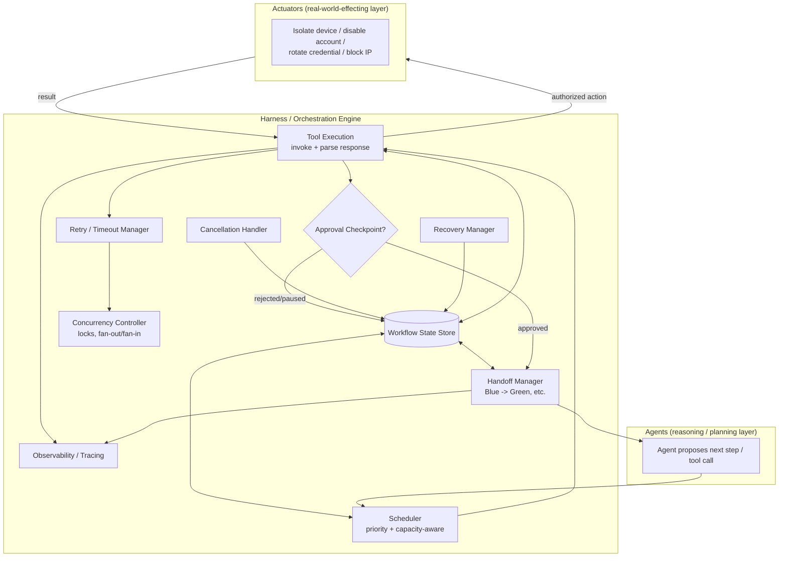
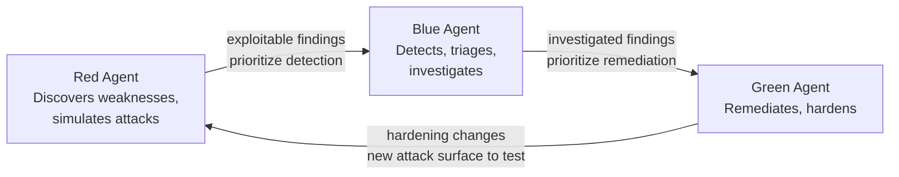
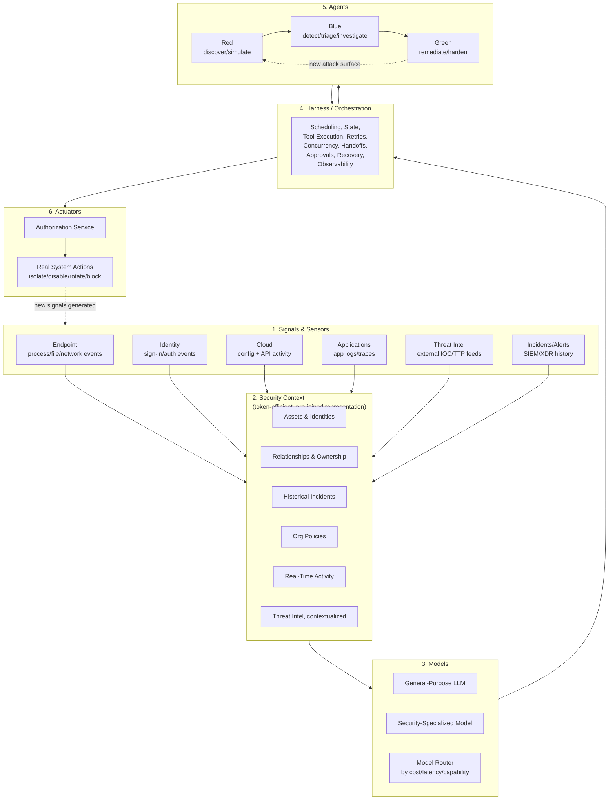
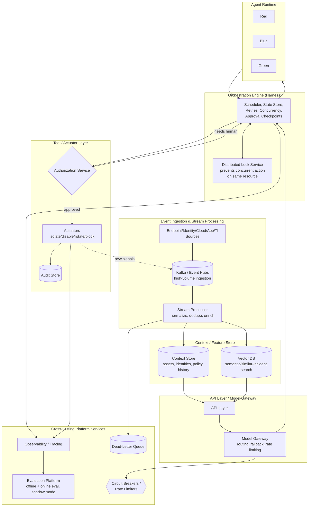

# Project Perception & Enterprise Agentic Security Platform Design

This file is the flagship "whiteboard architecture" file for an agentic AI security platform role modeled closely on Microsoft's publicly-described "Project Perception" — a system that pipes security **signals** through **context** into **models**, executes agent plans through a **harness**, runs coordinated **Red/Blue/Green agents**, and lands real changes through **actuators**. It builds directly on the transformer/LLM mechanics in `11_genai_llms_transformers.md`, the RAG/agent orchestration patterns in `12_rag_agents_llm_systems.md`, the general 8-step ML system design framework in `13_system_design_ml.md`, the agent architecture/evaluation material in `14_agentic_systems_architecture_and_evaluation.md`, and the security fundamentals (CIA triad, SOC/SIEM/SOAR, MITRE ATT&CK, prompt injection, "the model is never the final authority") in `15_security_fundamentals_and_ai_agent_security.md` — each is cross-referenced rather than re-derived. **A caveat that applies to all of Section 1 specifically:** the Project Perception architecture described below is reconstructed from the candidate's own notes and research, not verified against a live source (web search was unavailable when this file was written) — treat it as a rehearsal script for structuring the *concepts*, and verify the exact current terminology, product naming, and any specific model names against Microsoft's own public documentation or blog posts before the interview, since public product details and naming change over time and should never be asserted as independently fact-checked here.

## Table of Contents
- [Section 1 — The Project Perception Architecture (Whiteboard-Ready)](#section-1--the-project-perception-architecture-whiteboard-ready)
  - [1.1 Signals & Sensors](#11-signals--sensors)
  - [1.2 Security Context](#12-security-context)
  - [1.3 Models](#13-models)
  - [1.4 Harness / Orchestration](#14-harness--orchestration)
  - [1.5 Agents — Red, Blue, Green](#15-agents--red-blue-green)
  - [1.6 Actuators](#16-actuators)
  - [1.7 Consolidated Pipeline & Whiteboard Narration Script](#17-consolidated-pipeline--whiteboard-narration-script)
- [Section 2 — Enterprise System Design: Multi-Agent Security Platform](#section-2--enterprise-system-design-multi-agent-security-platform)
  - [Consistency Models](#consistency-models)
- [Section 3 — Reliability Engineering](#section-3--reliability-engineering)
- [Section 4 — Latency Optimization](#section-4--latency-optimization)
- [Section 5 — Cost Optimization](#section-5--cost-optimization)
- [Popular Questions — Full Answers](#popular-questions--full-answers)
- [Quick Recall Sheet](#quick-recall-sheet)

---

## Section 1 — The Project Perception Architecture (Whiteboard-Ready)

> **Verification caveat (read this before the interview, not just before this section):** everything in Section 1 is built from the candidate's own provided material describing a Project-Perception-style platform, not from a source that was independently checked against Microsoft's live documentation. Use it to rehearse the *shape* of the architecture — the layers, the reasoning for why each layer exists, the closed-loop framing — but confirm the current public terminology, diagram labels, and any specific named models (see Section 1.3) against Microsoft's own materials before you say them out loud in a real interview. If asked "is this exactly how Microsoft describes it," the honest answer is "this is my understanding from my own research, structured the way I'd defend it architecturally — I'd want to confirm the precise current terminology against their latest published material."

The platform is best understood as six layers, and the order below is deliberately the order you should draw and narrate them on a whiteboard: **Signals → Context → Models → Harness → Agents → Actuators**. Each layer answers a distinct question: Signals answers "what raw data exists," Context answers "what does that data *mean* in this organization," Models answer "what reasoning can we apply to it," the Harness answers "how do we actually run that reasoning against real systems reliably," Agents answer "what personas/objectives organize that reasoning into a security mission," and Actuators answer "how does a decision become a real, authorized, auditable change."

### 1.1 Signals & Sensors

Signals are the raw telemetry the platform ingests, before any interpretation. Each source type provides a fundamentally different *kind* of raw fact:

| Source type | What raw signal it actually provides | Typical origin |
|---|---|---|
| **Endpoint** | Process creation/termination events, file reads/writes/deletes, network connections initiated by a process, registry/driver activity | EDR agents running on the host (kernel/user-mode sensors) |
| **Identity** | Sign-in events (success/failure, MFA used, from where), token issuance, privilege/role changes, password resets | Identity provider logs (Azure AD/Entra-style directory, SSO logs) |
| **Cloud** | Resource configuration state and configuration changes, control-plane API activity (who called what management API, from where), network topology/exposure state | Cloud provider activity logs / control-plane audit logs |
| **Applications** | Application-level logs, request traces, error rates, authentication events at the app layer | Application logging/tracing frameworks (structured logs, distributed traces) |
| **Threat intelligence** | External indicators of compromise (malicious IPs/domains/hashes) and adversary tactics/techniques (TTPs) not observed internally yet, but known to be active elsewhere | External TI feeds, ISAC sharing, vendor threat research |
| **Incidents & alerts** | The organization's own SIEM/XDR's prior detections and case history — what's already been flagged, investigated, or closed, and how | The SIEM/XDR platform's own alert and case store |

The key property of this layer is that it is **raw and uninterpreted**: an endpoint event that says "process X spawned process Y and made an outbound connection to IP Z" is a fact, not a judgment — it says nothing yet about whether that's malicious, who owns the machine, or whether this has happened before. That interpretation is exactly what the next layer exists to add.

**Interview angle:**
- *"Why do you need six different signal source types instead of just ingesting the SIEM's alerts?"* — Model answer: A SIEM alert is already someone else's (rule-based or ML-based) interpretation of raw telemetry, and interpretations lose information — an alert tells you "this looked suspicious by rule R," but an investigating agent often needs the underlying raw events (the actual process tree, the actual sign-in history) to reason about *why* and to correlate across source types the original rule never considered. Endpoint, identity, cloud, and application signals each cover a different attack surface — an account-takeover shows up primarily in identity signals, a cloud misconfiguration shows up in cloud control-plane signals, lateral movement shows up in endpoint process/network signals — and a real incident frequently spans more than one surface (e.g., a phished identity used to pivot into a cloud resource), so an agent that can only see SIEM alerts and not the underlying raw multi-source telemetry will miss cross-surface correlation that's often exactly what distinguishes a real incident from noise.

### 1.2 Security Context

Raw signals alone are insufficient for an agent to reason well, and the reason is structural, not just a matter of "add more data." If an investigating agent has to answer "which asset is this," "who owns it," "has this happened before," and "what's the org's policy here" by re-deriving each fact from scratch on every single investigation — re-querying an asset inventory, re-walking an org chart, re-searching incident history — that's both **slow** (every sub-question becomes its own retrieval round-trip before the agent can even start reasoning about the actual security question) and **token-expensive** (every re-derived fact has to be re-serialized into the prompt as raw rows/documents, most of which restate information that was already true yesterday and will still be true tomorrow).

Security context is the layer that pre-connects assets, identities, relationships, historical incidents, organizational policies, real-time activity, and threat intelligence into one coherent, queryable structure the agent can reason over **directly**, rather than re-collecting and re-deriving it per investigation. The framing to state explicitly in an interview: **context is a token-efficient representation of the organization's environment.** It's not "yet more retrieval" bolted onto signals — it's a compression and pre-joining of what would otherwise be many raw facts and many raw retrieval calls into a compact, already-reasoned-over structure (e.g., "this host = finance-server-03, owned by team X, criticality tier 1, three prior incidents in the last 90 days, currently subject to policy P"), so a single context lookup replaces what would otherwise be five or six separate raw-signal queries and their associated tokens. At the scale this platform runs at — millions of alerts — that difference compounds directly into both **latency** (fewer round trips per investigation) and **cost** (fewer tokens re-serialized per investigation), which is why context is architected as its own persistent layer rather than left as "the agent will just call more retrieval tools when it needs to know something."

This maps directly onto the memory-types discussion in `14_agentic_systems_architecture_and_evaluation.md`: security context here is closer to a **continuously-maintained semantic/persistent memory layer** — a standing, organization-wide knowledge structure that's kept up to date independent of any single agent run — than to **episodic memory**, which is scoped to one session/task and discarded or archived once that task ends. An agent's episodic memory for a single incident investigation ("what have I found so far in this specific case") sits on top of context, not instead of it: episodic memory is disposable and task-scoped, while context is durable and shared across every agent and every investigation that touches the same asset or identity.

**Interview angle:**
- *"Why is security context described as a token-efficient representation rather than just 'more retrieval'?"* — Model answer: Because the problem it solves isn't "the agent can't find the data" — the data is usually findable via one more tool call — it's that re-finding and re-serializing the same slowly-changing facts (asset ownership, criticality, policy, prior-incident history) into the prompt on every single investigation is wasteful along exactly the two axes that matter at scale: latency (each re-derivation is a round trip) and token cost (each re-derivation re-injects raw context into the prompt). Context pre-joins those slowly-changing facts into a compact structure once, refreshed on its own cadence, so an agent's prompt gets a small, dense, already-reasoned-over context block instead of the raw materials to reason it out from scratch — that's a genuinely different design choice (build and maintain a semantic layer) from "give the agent a retrieval tool and let it query more."

### 1.3 Models

The model layer is where reasoning actually happens, and a production security platform at this scale needs more than one model behind a single API:

- **General-purpose LLM vs. a security-specialized model:** a general-purpose frontier model brings broad reasoning, language understanding, and tool-use ability; a security-specialized model is tuned (via pretraining data mix, fine-tuning, or both — see `11_genai_llms_transformers.md` for the underlying mechanics) specifically on security-domain text, telemetry formats, and attack/defense reasoning patterns, and can outperform a general model on in-domain tasks (parsing a specific log format correctly, recognizing a specific attack pattern) at lower cost, because it doesn't need as much in-context instruction to behave well on that narrow domain.
- **Model routing:** a given sub-task is sent to whichever model is best suited for it by a joint cost/latency/capability judgment, rather than every request going to the same model regardless of difficulty — this is the same model-cascade idea covered in `12_rag_agents_llm_systems.md`'s cost/latency section, applied here at the level of "which security sub-task needs which model."
- **Model selection by task, and small vs. large models:** a cheap classification-style sub-task (e.g., "is this alert plausibly a duplicate of an already-closed case") doesn't need a large frontier model's full reasoning depth; a genuinely novel, multi-step investigative judgment does. Matching model size to task difficulty is the single biggest lever on both latency and cost at this scale (full treatment in Sections 4 and 5 below).
- **Fine-tuning vs. prompting vs. RAG — three different ways to get domain knowledge into a model's behavior:** prompting (few-shot examples, instructions) is cheapest to iterate on and needs no training infrastructure, but is bounded by context window and doesn't durably change how the model reasons; RAG injects current, specific, inspectable facts (this asset's history, this policy's current text) without retraining, and is exactly what the context layer above feeds into the model; fine-tuning changes the model's underlying behavior/style/task-format durably (e.g., training it to always emit a specific structured investigation-summary schema, or to reason in security-specific patterns), at the cost of a training cycle to update. See `11_genai_llms_transformers.md` for LoRA/QLoRA/RLHF/DPO mechanics and `12_rag_agents_llm_systems.md` for the RAG-vs-fine-tuning tradeoff table — the short version reused here: reach for RAG/context when the gap is "the model doesn't know this specific fact," reach for fine-tuning when the gap is "the model doesn't reason/format/behave the way this platform needs."
- **Latency/cost/quality tradeoffs:** covered in full in Sections 4 and 5 of this file — the short pointer here is that model choice is the single biggest lever on all three simultaneously, so model routing decisions should be made with explicit reference to those tradeoffs, not just "use the best model everywhere."
- **Model fallback:** what happens when a primary model call errors, times out, or returns something unusable (malformed output, a refusal, an empty response) — the harness (Section 1.4) needs an explicit fallback path: retry the same model, fall back to a secondary model, or fall back to a safe default behavior (e.g., "escalate to human review" rather than silently proceeding on a bad model response). This is the model-layer instance of the general reliability patterns in Section 3.
- **Model versioning:** pinning and tracking the exact model version used for every decision matters enormously for a security platform specifically, for two reasons: **auditability** (if an incident response decision is questioned six months later, you need to know exactly which model version made that call, since model behavior can shift between versions even under "the same" model name) and **debugging regressions** (if quality on a specific task type suddenly drops, the first question is "did a model version change underneath us," and you can only answer that if every decision is logged with its exact model version — see `14_agentic_systems_architecture_and_evaluation.md`'s observability section for the general logging/tracing pattern this plugs into).

With the verification caveat from the top of Section 1 restated here specifically: the candidate's material describes this platform as using **multiple purpose-built models**, including one referred to as **"MAI-Cyber-1-Flash"** as a security-specialized model. Treat this exact name as something to confirm — not assert — before the interview; the durable, interview-safe point to make regardless of the exact name is the architectural one: *a mature agentic security platform doesn't run one model for everything — it routes across a general-purpose model and one or more security-specialized models, chosen per sub-task by capability, cost, and latency.*

**Interview angle:**
- *"Why not just use one large frontier model for every step of the investigation?"* — Model answer: Because a single model choice forces every sub-task to pay the cost/latency of the hardest sub-task's requirements. Most of an investigation's steps are narrow and repetitive (classify this alert type, check this log line against a known pattern) and are well within a small or specialized model's capability at a fraction of the cost and latency; reserving a large general-purpose model for the genuinely hard, novel reasoning steps (synthesizing a cross-signal hypothesis, deciding on a remediation with real consequences) gets the best quality where it matters most while keeping the platform affordable and fast enough to handle millions of alerts. I'd also want model fallback and pinned versioning in place regardless of which models are chosen, since a security platform's decisions need to be reproducible and auditable after the fact.

### 1.4 Harness / Orchestration

This is likely **the single most important subsection for this specific role** — the harness is the part of the stack an agent-platform engineer actually builds and tunes day to day, far more than the model weights or prompts themselves.

**What a harness architecturally is:** the runtime layer that actually *executes* an agent's plan against real tools and systems. It is distinct from the model, which only generates reasoning and decisions (text/structured output — "call this tool with these arguments," "here's my investigation summary") but never itself touches a real system; and it is distinct from the actuator, which is where an action actually lands and takes effect in the real world. The harness sits in between: it takes a model's decision, actually invokes the corresponding tool/API, manages everything that can go wrong or take time in doing so, and feeds the result back to the model (or the next agent) to continue the task.

Concretely, the harness owns:

- **Agent scheduling** — deciding which agent/task runs when, especially under load when millions of alerts are competing for finite compute/model-call capacity: this requires prioritization (a high-severity alert should preempt a low-severity one's queue position), fairness (one noisy source shouldn't starve everything else), and capacity-aware admission control.
- **Workflow state** — tracking exactly where a given multi-step agent task currently is (which step of the investigation plan has executed, what's pending, what's blocked on a tool response or a human approval) so the task's progress is always inspectable, not implicit in an in-memory call stack.
- **Tool execution** — actually invoking a tool/API on the model's behalf and handling its response: mapping the model's structured tool-call output to a real API call, handling the API's response format, and feeding a clean observation back.
- **Retries and timeouts** — the harness enforces bounded wait times on every tool/model call and retries transient failures with backoff (full patterns in Section 3, and see `14_agentic_systems_architecture_and_evaluation.md`'s reliability mention for the general principle).
- **Concurrency** — multiple agents, or multiple steps of the same investigation, running simultaneously (e.g., pulling endpoint and identity signals in parallel) requires coordination so results are joined correctly and shared resources aren't corrupted by simultaneous writes (see Section 3's distributed-locking discussion for the specific "two agents touch the same resource" failure mode).
- **Agent handoffs** — passing a task and its accumulated context from one agent to another, e.g., Blue handing an investigated incident (with its findings, evidence, and confidence level) to Green for remediation — the harness is what carries state across that boundary reliably rather than relying on an ad hoc message.
- **State persistence** — durably storing workflow state (e.g., in a database, not just in memory) so a long-running multi-step investigation survives a process restart or a deploy, and can resume exactly where it left off rather than starting over or silently losing progress.
- **Approval checkpoints** — a deliberate, first-class pause point in the workflow where execution stops and waits for a human sign-off before a sensitive step proceeds (e.g., before Green disables a production account) — this is not an afterthought bolted onto the workflow, it's a node type the harness natively supports, tied directly to the actuator-layer authorization discussion in Section 1.6.
- **Cancellation** — stopping an in-flight agent task cleanly (e.g., an analyst determines the underlying alert was a false positive mid-investigation) without leaving partial, inconsistent side effects behind.
- **Recovery** — resuming or safely retrying a task after a failure, using the persisted workflow state above to pick up from the last known-good checkpoint rather than re-running an entire multi-step task (and risking non-idempotent re-execution — see Section 3).
- **Observability** — full tracing of every step, tool call, model call, and decision for debugging and audit; this is covered in depth in `14_agentic_systems_architecture_and_evaluation.md`'s observability section and is referenced, not repeated, here — the harness is the layer that *emits* the traces that section explains how to structure and consume.



**Interview angle:**
- *"What's the difference between the harness/orchestration layer and the agents themselves?"* — Model answer: The agent is the reasoning layer — given the current state and context, it decides *what* should happen next (call this tool, ask for human approval, hand off to another agent), and its output is a decision, not an effect. The harness is the runtime that actually *makes that decision happen* against real systems: it schedules the task, tracks exactly where the multi-step workflow is, actually invokes the tool the agent asked for, handles the retry/timeout/concurrency/approval/cancellation/recovery mechanics around that invocation, and persists state so the task survives a restart. A useful way to say it out loud: the model decides, the harness executes and manages that execution reliably, and the actuator is where the executed action actually lands and changes something real. An agent-platform engineer builds and tunes the harness far more often than the model itself, since that's where scheduling, reliability, concurrency, and auditability all actually live.
- *"Why does the harness need explicit approval checkpoints rather than just letting an agent call a 'request approval' tool like any other tool?"* — Model answer: Because an approval checkpoint isn't just another tool call with a response — it's a state transition the whole workflow needs to durably pause on, potentially for hours, across process restarts, with a clear audit trail of who approved what and when. Modeling it as a first-class node type in the harness (rather than an ordinary tool call that happens to be slow) means the workflow-state persistence, recovery, and observability machinery all apply to it uniformly, and it's trivial to answer "which incidents are currently waiting on human approval" as a query against workflow state, rather than needing to reconstruct that from tool-call logs.

### 1.5 Agents — Red, Blue, Green

Three agent personas, each with a distinct mission:

| Agent | Mission | Primary consumer of |
|---|---|---|
| **Red** | Discovers weaknesses and simulates attacks — an automated, continuous adversarial/pentest-style agent that actively probes the environment for exploitable gaps | Context (asset/attack-surface map), threat intelligence signals |
| **Blue** | Detects, triages, and investigates — the defensive SOC-analyst-style agent that is the primary consumer of Signals and Context, turning raw alerts into an investigated, evidence-backed finding | Signals + Context (heaviest consumer of both) |
| **Green** | Remediates and hardens — closes the loop by fixing what Blue found, and, ideally, what Red proved was actually exploitable | Blue's investigation output, Red's proof-of-exploitability |

The critical framing to state explicitly: this is **a coordinated closed loop, not three independent chatbots** each solving their own isolated problem. The loop only does its job if information actually flows between the three:

- **Red's findings should inform what Blue prioritizes** — if Red just proved a specific misconfiguration is actually exploitable (not just theoretically risky), Blue's detection/triage priorities should shift to actively watch for exploitation attempts against that exact gap, rather than treating it as one entry in a generic vulnerability backlog.
- **Blue's investigation findings should inform what Green prioritizes** — Green shouldn't remediate generically; it should remediate what Blue's actual investigations show is being exploited or attempted in this specific environment, prioritized by real observed risk rather than a static severity score.
- **Green's hardening changes should in turn inform what Red tests next** — once Green closes a gap, the attack surface has genuinely changed, and Red's next round of testing should adapt to probe the *new* surface (verify the fix actually holds, and look for what changed as a side effect of the fix) rather than continuing to re-run the same fixed test suite against an environment that's no longer the same one it was tested against last time.

This is a genuine feedback loop with a state-dependent next step at every stage — not three separate point solutions that happen to share a dashboard.



**Playbooks.** Rather than giving any agent fully open-ended autonomy over what actions it may take, each agent's behavior for a given scenario type is constrained by a **playbook** — a predefined, human-reviewed procedure that specifies what steps are allowed, what evidence is required before escalating confidence, and what actions are or aren't in scope for that scenario. Playbooks matter enormously in a security context specifically for two reasons: **auditability** (a reviewer can look at a playbook once and know the full space of what an agent following it could possibly have done, rather than needing to audit every individual decision from scratch as if it were unconstrained) and **predictability** (an agent constrained to a reviewed playbook behaves consistently across incidents of the same type, which is exactly the property a SOC needs to trust automation with real actions — an agent that reasons its way to a genuinely novel action every time is much harder to certify as safe to run unattended).

**Interview angle:**
- *"Why not just run Red, Blue, and Green as three separate independent tools?"* — Model answer: Because the value of the loop is specifically in the information flowing *between* them, not in any one agent's isolated output. Run independently, Red produces a vulnerability report nobody prioritizes against real detections, Blue investigates alerts without knowing which gaps are proven-exploitable versus theoretical, and Green remediates against a generic severity score instead of actual observed risk — you'd get three point solutions with three separate backlogs and no mechanism connecting "what's actually being attacked" to "what gets fixed first" to "what gets tested next now that the environment changed." Coordinating them closes that loop: each agent's output becomes the next agent's prioritization signal, and Green's changes feed back into Red's next test cycle, so the whole system continuously adapts to its own actual attack surface rather than working off static, disconnected snapshots.
- *"Why constrain agents with playbooks instead of letting them reason freely about what action to take?"* — Model answer: Free-form reasoning about what action to take is exactly the failure mode a security platform can't tolerate at scale — an agent might arrive at a defensible-sounding but genuinely novel and unreviewed action for a scenario type that's supposed to be routine, and there'd be no way to audit the full space of what the fleet of agents could have done across millions of alerts without going incident-by-incident. A playbook fixes the allowed action space for a given scenario type in advance, gets reviewed once by a human as a static document, and then every agent execution against that scenario type is provably constrained to that reviewed space — which is a far cheaper and more reliable way to establish trust than trying to audit every individual agent decision after the fact.

### 1.6 Actuators

The actuator is where the chain of "model output" stops being purely informational and starts having real, potentially irreversible effects on production systems. The distinction to hold onto precisely: **model output → recommendation → authorized action → actual system change** — four distinct stages, not one. A model producing text that says "isolate this device" is a *recommendation*; it only becomes an *authorized action* once a separate authorization/policy check approves it; and it only becomes an *actual system change* once the actuator executes it against the real device-management API.

This is exactly why authorization, validation, rollback, and auditability are non-negotiable specifically at this layer:

- **Authorization** — a policy/authorization check gates every actuator call, checking the proposed action against playbook scope, blast-radius limits, and (for high-risk actions) requiring the human-approval checkpoint from Section 1.4 to have actually fired.
- **Validation** — the actuator validates the action's parameters against the real state of the target system immediately before executing (e.g., confirm the device ID is real and currently in the expected state) rather than trusting the model's claim about that state blindly.
- **Rollback** — actions with real-world effects need a defined undo path (re-enable the account, un-isolate the device, restore the prior firewall rule) so a mistaken or later-invalidated action can be reversed, not just logged as regrettable.
- **Auditability** — every actuator invocation is logged with what was requested, who/what authorized it, and what actually executed, since this is the layer where "who/what actually changed production" needs a definitive, queryable answer.

This is precisely the architectural enforcement point for the principle from `15_security_fundamentals_and_ai_agent_security.md`: **the model should never be the final authority.** The authorization/policy check sits directly in front of the actuator — architecturally outside the model, and outside the agent's own reasoning — not inside the model's prompt as an instruction to "please check permissions first." A model that's been convincingly prompt-injected or that simply reasons its way to an unsafe conclusion still cannot cause real-world effect unless the independent authorization check in front of the actuator approves it; the actuator is where that separation is a hard architectural boundary, not a soft behavioral expectation of the model. See `15_security_fundamentals_and_ai_agent_security.md`'s treatment of this principle and its agent-proposes-action → authorization-service → actuator diagram for the full mechanics of the authorization step itself (identity of the acting agent, scope checks, policy evaluation) — this section covers *why* actuators are the layer that principle gets enforced at.

```mermaid
flowchart LR
    M[Agent Output\n\"recommendation\"] --> AUTH{Authorization Service\npolicy + scope + blast-radius check}
    AUTH -- approved --> V[Validation\nconfirm target state is as claimed]
    AUTH -- denied / needs human --> H[Human Approval Checkpoint]
    H -- approved --> V
    H -- denied --> LOG1[Audit Log: rejected]
    V --> ACT[Actuator\nisolate device / disable account /\nrotate credential / block IP]
    ACT --> RB[Rollback Path Defined]
    ACT --> LOG2[Audit Log: executed]
```

*(This diagram intentionally mirrors the fuller agent-proposes-action → authorization-service → actuator diagram in `15_security_fundamentals_and_ai_agent_security.md`, which goes deeper on the authorization service's internal checks — refer there for that detail rather than treating this as a second, competing version.)*

**Interview angle:**
- *"Where exactly does authorization get enforced, and why does that location matter?"* — Model answer: Authorization is enforced in a dedicated authorization service sitting directly in front of the actuator — architecturally outside both the model and the agent's own control flow — never as an instruction inside the model's prompt or system message. That location matters because a prompt-based "check permissions before acting" instruction is just more text the model is generating, and text generation can be wrong, manipulated (prompt injection), or simply reasoned-around under an unusual chain of thought; it provides no actual guarantee. An authorization check that sits outside the model, as real code path the actuator physically cannot be reached without passing through, provides a guarantee independent of whatever the model said or was tricked into saying. This is the direct architectural expression of "the model is never the final authority" — the model can recommend anything; only the authorization service and the actuator together can make something real happen.

### 1.7 Consolidated Pipeline & Whiteboard Narration Script



**5-10 minute whiteboard narration script** — say it in this exact order, drawing each box as you name it:

1. "I'll start on the left with **Signals** — this is raw telemetry, no interpretation yet. Six source types: endpoint gives me process/file/network events from EDR agents; identity gives me sign-in and auth events; cloud gives me resource config and control-plane API activity; applications give me app-level logs and traces; threat intel gives me external IOC/TTP feeds; and incidents/alerts give me the SIEM's own prior detection history."
2. "All of that flows into **Security Context** — and this is the layer I want to spend a second justifying, because it's not just 'more retrieval.' If an agent has to re-derive 'which asset is this, who owns it, has this happened before' from raw signals on every single investigation, that's slow and token-expensive at millions-of-alerts scale. Context pre-joins assets, identities, relationships, history, policy, and threat intel into one compact structure — it's a **token-efficient representation** of the environment the agent can reason over directly."
3. "Context feeds the **Models** layer — I'd route between a general-purpose LLM and a security-specialized model by task, cost, and latency, with fallback if a call fails and strict version pinning for auditability, since a security platform needs to know exactly which model version made which call."
4. "Model decisions get executed by the **Harness** — this is the layer I'd spend the most engineering time on in this role. It's the runtime that actually invokes tools/APIs on the model's behalf: scheduling under load, tracking workflow state, retries/timeouts, concurrency across parallel steps, handoffs between agents, durable state persistence, human approval checkpoints for sensitive actions, cancellation, recovery after failure, and full observability."
5. "The harness runs the **Agents** — Red discovers weaknesses and simulates attacks, Blue detects/triages/investigates and is the heaviest consumer of signals and context, Green remediates and hardens. The important part: this is a **closed loop**, not three independent tools — Red's findings prioritize what Blue investigates, Blue's findings prioritize what Green remediates, and Green's changes reshape the attack surface Red tests next. Each agent's behavior is bounded by a reviewed **playbook**, not open-ended autonomy."
6. "Finally, **Actuators** — this is where a recommendation becomes a real system change. I want to be precise about the chain: model output, then recommendation, then authorized action, then actual change. An **authorization service sits in front of the actuator**, architecturally outside the model, so the model is never the final authority — that check, plus validation, rollback, and audit logging, all live at this layer specifically because this is where effects become real and potentially irreversible."
7. "And it's a loop end to end — actions taken by actuators generate new signals, which flow back into context, which the next round of agents reasons over — so the system is continuously adapting, not a one-shot pipeline."

---

## Section 2 — Enterprise System Design: Multi-Agent Security Platform

**Prompt:** "Design a multi-agent security platform that investigates millions of alerts and automatically remediates low-risk incidents." Using the same 8-step framework from `13_system_design_ml.md`, now naming the concrete components from Section 1 above.

### 1. Problem clarification
- What's actually being optimized — mean time to detect (MTTD) and mean time to remediate (MTTR), analyst hours saved, or blast-radius reduction from faster containment? These pull the design in different directions (MTTR favors more auto-remediation; analyst-hours-saved tolerates more human-in-the-loop if it's still net faster than fully manual).
- What's "low-risk enough to auto-remediate" — this needs an explicit definition before any architecture decision, not left implicit (full treatment below).
- Scale assumption: millions of raw alerts/day across endpoint, identity, cloud, application, and TI sources, with a small fraction requiring any human attention at all if triage works.
- Constraints: latency (an active-attack blocking decision can't wait minutes; an investigation can), regulatory/compliance requirements on auditability of any automated action, and blast-radius tolerance (an auto-remediation that's wrong at this scale can affect thousands of accounts/devices near-simultaneously if unconstrained).

### 2. Frame as an ML/agentic problem
- This isn't a single model-scoring problem — it's a pipeline of many sub-decisions (is this alert a duplicate/false positive, what's the likely attack pattern, what evidence would confirm/refute it, what's the appropriate remediation, is that remediation safe to auto-apply) chained together, exactly the Signals→Context→Models→Harness→Agents→Actuators pipeline from Section 1.
- Cast it as **triage as a funnel**: millions of raw alerts in, most resolved automatically at low cost (deduped, auto-closed as benign, or auto-remediated within policy), a much smaller number escalated to Blue for real investigation, and a smaller number still requiring human approval before Green acts.

### 3. Data
- Signal sources as in Section 1.1: endpoint/EDR, identity/IdP, cloud control-plane, application logs/traces, threat intel feeds, and the SIEM/XDR's own alert/case history.
- Ingested at high volume and variable burst rate (an active campaign can spike alert volume by orders of magnitude in minutes) — this drives the backpressure discussion below.
- Labeled data for training/evaluating any classifiers in the pipeline (duplicate detection, severity scoring) comes from analyst dispositions on historical alerts (confirmed true positive / false positive / benign-but-expected) — same label-latency caution as any security-labeling problem: a "no incident followed" label can still be revised later if a slow-burn campaign is later discovered.

### 4. Feature/context engineering
- This is exactly the **Security Context** layer from Section 1.2: pre-joined asset/identity/ownership/policy/history data, refreshed on its own cadence (near-real-time for identity/asset state, slower for org-policy/ownership data that changes rarely), so per-alert context lookups are cheap reads against a maintained structure rather than expensive re-derivations.
- Retrieval layer (vector DB, cross-referenced to `12_rag_agents_llm_systems.md`) for unstructured/semantic lookups — similar-past-incident search, TI feed matching by description/TTP similarity — layered on top of the structured context store for exact-match/relational lookups (asset ownership, policy tables).

### 5. Model/agent selection
- Model gateway routes each sub-task to the right model per Section 1.3's model-routing discussion: cheap classification-style steps (dedup, initial severity) to small/fast models, deep investigative synthesis to a larger or security-specialized model.
- Agent runtime hosts Red/Blue/Green as described in Section 1.5, each constrained by playbooks per scenario type.
- Orchestration engine = the harness from Section 1.4, the actual component doing scheduling, state tracking, retries, concurrency, and approval checkpoints across this whole pipeline.

### 6. Evaluation (offline + online)
- **Offline:** held-out labeled alert sets scored for triage-classifier precision/recall, and trajectory evaluation (see `14_agentic_systems_architecture_and_evaluation.md`) of agent investigation traces against expected tool-call sequences/expected findings.
- **Online:** live metrics on unsafe-action rate and human-approval rate (see `14_agentic_systems_architecture_and_evaluation.md`) as the primary safety gate for auto-remediation, alongside MTTD/MTTR and analyst-hours-saved as the primary business-value metrics; shadow-mode (agent proposes, human decides, agent's proposal is scored against the human's actual decision without ever being auto-executed) is the standard way to validate a new playbook or a raised auto-remediation threshold before trusting it live.

### 7. Deployment architecture



- **Ingestion:** Kafka/Event Hubs for high-throughput, durable event ingestion, feeding a stream processor that normalizes and deduplicates before anything touches an agent.
- **Context/retrieval:** structured context store for relational/exact-match lookups (ownership, policy) plus a vector database for semantic/similar-incident retrieval (see `12_rag_agents_llm_systems.md`), fronted by caching for hot/repeated lookups.
- **Model gateway:** routes requests across models, enforces rate limiting and per-tenant quotas (Section 5), and applies fallback on error.
- **Orchestration engine:** the harness itself, with a **distributed lock service** specifically to prevent two agents from concurrently acting on the same resource (full failure-mode treatment in Section 3) — this is a microservice in its own right, since lock contention and lock-holder crash recovery are non-trivial concerns.
- **Actuator layer:** authorization service gates every actuator call; every executed (and every rejected) action is written to an append-only audit store.
- **Cross-cutting:** circuit breakers and rate limiters protect the model gateway and downstream services from cascading overload; dead-letter queues catch events/tasks that fail processing repeatedly rather than silently dropping or endlessly retrying them; an evaluation platform runs offline eval suites and online shadow-mode comparisons continuously.

### Consistency Models

The deployment architecture above has at least four distinct stores with genuinely different consistency needs — the **context store**, the **vector DB**, the **audit store**, and the **Kafka/Event Hubs event log** feeding all of them — and a common interview trap is to reach for "just use a strongly consistent database everywhere" without being able to say what that costs, or "just use eventual consistency for throughput" without being able to say what that risks. The right answer is that consistency is a per-store design decision, not a platform-wide default, and it should be justified store by store against what that store is actually for.

**CAP theorem.** For any distributed data store, you can only fully guarantee two of the following three properties **at the same time, while a network partition is actually happening**: **C**onsistency (every read sees the most recent write, or an error — never stale data), **A**vailability (every request to a non-failing node gets a response, even during the partition), and **P**artition tolerance (the system keeps operating despite dropped/delayed messages between nodes). The theorem statement is precise about *when* the tradeoff bites: outside of a partition, a well-built system can be both consistent and available simultaneously — the tradeoff only becomes forced the moment a network partition actually splits the system into pieces that can't talk to each other.

The reason this collapses to a two-way choice in practice, not a three-way one: **partition tolerance is not optional in any real distributed system.** Networks fail — a link drops, a region goes unreachable, a load balancer misroutes — and a system that isn't partition-tolerant simply stops working the first time that happens, which isn't a real design option once you're running across multiple nodes/regions (as this platform does at "millions of alerts" scale). So the theorem's actual practical content for an interview is: **you must choose partition tolerance, which means the real decision during an actual partition is CP vs. AP** —

- **CP (Consistency + Partition tolerance):** during a partition, the system refuses to serve (or blocks) requests that can't be guaranteed consistent, sacrificing availability rather than risk returning or accepting stale/conflicting data.
- **AP (Availability + Partition tolerance):** during a partition, the system keeps accepting reads/writes on both sides of the split, sacrificing consistency — different partitions may temporarily disagree, to be reconciled once the partition heals.

**Strong consistency vs. eventual consistency, applied to this platform's own stores:**

- **Strong consistency** means every read is guaranteed to reflect the most recently acknowledged write, everywhere, with no staleness window — which typically requires synchronous coordination across replicas (a consensus round, a quorum write) before a write is even acknowledged. The **audit/decision store** is the clearest candidate for this in this platform: it's the definitive record of "was this agent action actually taken, by whom/what, under what authorization," and an auditor or compliance reviewer querying that store cannot be given a stale "no record found" answer for an action that in fact already executed — that's not a cosmetic staleness bug, it's a broken guarantee for exactly the layer (Section 1.6) that exists to make actuator effects provably auditable. At minimum this store needs **read-your-writes** (Blue/Green's own subsequent reads always see their own just-completed writes) and in practice should lean toward full strong consistency for cross-reader queries, given how directly compliance/audit correctness depends on it.
- **Eventual consistency** means replicas are only guaranteed to converge *eventually*, with no bound on how long a reader might see a stale value in the meantime, in exchange for writes/reads that stay fast and available even under load or partition. The **signal/telemetry ingestion pipeline** (Kafka/Event Hubs → stream processor, Section 7) and a **denormalized search/triage index** built for Blue's alert-browsing UI are the clear candidates here: at millions-of-events-per-day throughput, requiring every ingested signal to be synchronously committed and visible everywhere before the pipeline acknowledges it would throttle ingestion to the speed of the slowest replica, for no real benefit — an analyst's triage view being a few seconds stale on "alert count from source X in the last hour" costs nothing that matters, while the throughput and availability eventual consistency buys is exactly what the backpressure/shedding discussion (Section 8 below) depends on.

A short table of the levels in between pure-strong and pure-eventual, since real systems rarely need only the two extremes:

| Consistency model | Guarantee | Latency / availability cost | Example use in this platform |
|---|---|---|---|
| **Strong consistency** | Every read reflects the latest acknowledged write, globally, with no staleness window | Highest — writes typically need synchronous cross-replica/cross-region coordination (quorum/consensus) before acknowledging, and reads may block or fail during a partition | Audit/decision store — an auditor can never be shown a stale "action not taken" |
| **Read-your-writes** | A client always sees its own prior writes; other clients may briefly see older data | Low-moderate — achievable cheaply by pinning a client's reads to the replica/region it wrote to, or via a session token, without global synchronization | An analyst who just approved a remediation and reloads the case immediately sees it as "approved" |
| **Session consistency** | Read-your-writes plus monotonic reads/writes, scoped to one session | Low-moderate | An agent's own multi-step investigation session sees a consistent, forward-only view of the context store as it accumulates findings, even if other sessions are mid-update elsewhere |
| **Causal consistency** | Causally related operations (a write that depends on a prior read) are seen in the same order by every observer; unrelated writes may be observed in different orders by different readers | Moderate — needs causal metadata (e.g., vector clocks/dependency tracking) but no global lock | Red's "proof of exploitability" finding must be visible to Blue only *after* the vulnerability it references, never before, even if Red and Blue read from different replicas |
| **Eventual consistency** | All replicas converge to the same value eventually, given no further writes; no bound on staleness in between | Lowest — writes complete fast and stay available even during a partition, replicas propagate asynchronously | High-volume signal ingestion (Kafka pipeline); denormalized triage/search index for Blue's alert queue |

**Worked example for the whiteboard — a partition between Blue's region and the audit store's region.** Say Blue's detection agent runs in region A, and the audit store's primary replica is pinned to region B (common for a globally-distributed platform), and the cross-region link between them drops mid-decision, right as Blue's investigation concludes "isolate device X" and the actuator is about to execute:

```mermaid
flowchart TB
    EVENT[Blue's actuator call executes:\n"isolate device X"] --> PART{Network partition between\nBlue's region A and Audit Store's region B?}

    PART -- "no partition" --> SYNC[Write decision + evidence\nsynchronously to Audit Store]
    SYNC --> ACK[Ack: durably and globally recorded\nbefore actuator reports success]

    PART -- "partition detected" --> CHOICE{Choose CP or AP\nfor this write}

    CHOICE -- "CP: block" --> BLOCK[Hold/reject the actuator call\nuntil Audit Store is reachable again]
    BLOCK --> SAFEBUT[Safe: no action ever executes\nwithout a guaranteed audit record]
    BLOCK --> COST1[Cost: a legitimate, low-risk\nremediation is delayed or lost]

    CHOICE -- "AP: accept + reconcile" --> LOCAL[Execute the action;\nwrite decision to a local/regional\nqueue in region A]
    LOCAL --> RECONCILE[Replay into the Audit Store\nonce the partition heals]
    RECONCILE --> COST2[Cost: a window exists where the action\nis real but not yet globally auditable —\nan auditor querying region B mid-partition\nsees no record of it yet]
```

Narrated the way you'd say it out loud: "If I go **CP** here, I'm choosing to block Blue's actuator call the moment I can't guarantee the audit write will land — that's safe for the audit trail (nothing ever executes unrecorded) but it means a legitimate device-isolation gets delayed or dropped exactly when the network is already unreliable, which is often the worst possible time to become unavailable, since an ongoing partition can itself be a symptom of an active incident. If I go **AP**, I let Blue's action execute and queue the audit write locally in region A, reconciling into the audit store once the link recovers — that keeps the platform available and doesn't block a time-sensitive containment action, but it means there's a real window where the action has already happened in production but isn't yet visible to a compliance query hitting region B. For *this specific store*, I'd lean CP-leaning-with-a-safety-valve: never skip the audit write silently — always queue it durably somewhere partition-tolerant (even a regional durable queue) so 'eventually consistent, but never lost' is the actual guarantee, and reserve true blocking (refusing to act at all) only for the highest-blast-radius action classes where an unaudited action would itself be unacceptable regardless of urgency." This is exactly the reversibility/blast-radius framing from the auto-remediation policy above, applied to the audit-write decision itself rather than to the remediation action.

**Interview angle:**
- *"How would you reason about consistency requirements across the different data stores in this platform?"* — Model answer: I wouldn't pick one consistency model platform-wide — I'd treat it as a per-store decision driven by what a stale read at that store actually costs. Starting from CAP: partition tolerance isn't optional at this scale (multi-region, millions of events/day, networks will partition), so the real choice at every store is CP vs. AP during a partition. For the **audit/decision store**, a stale or missing read is unacceptable — an auditor asking "was this action taken" can't get a wrong answer — so I'd want strong consistency or at minimum read-your-writes, and I'd rather have the system briefly refuse to act (or queue durably and reconcile) than silently lose or delay an audit record. For the **signal ingestion pipeline and the denormalized triage index**, the opposite is true: a few seconds of staleness on alert counts or a search index costs nothing that matters, while requiring synchronous global consistency there would throttle ingestion throughput to the slowest node for no real benefit — so I'd run those eventually consistent, prioritizing availability and throughput. In between, I'd reach for causal consistency specifically where ordering (not full consistency) is what matters — e.g., Red's exploitability proof must always be visible to Blue after the vulnerability it references — and read-your-writes/session consistency wherever a single agent or analyst's own immediate follow-up reads need to see their own prior writes without paying for global synchronization. The general principle I'd state explicitly: match the consistency guarantee to the actual cost of being wrong at that specific store, not to a single platform-wide default.

### 8. Monitoring, iteration & scaling
- **Backpressure/shedding, explicit, not just "scale up":** at millions-of-alerts scale, a spike (an active campaign, a noisy new detection rule) can outpace processing capacity faster than autoscaling can react. Concrete strategy: (1) the stream layer buffers via Kafka's own durability rather than dropping at the source; (2) admission control at the scheduler prioritizes by severity/confidence so high-value work isn't starved by a flood of low-value alerts; (3) load-shedding rules that are explicit and reviewed in advance — e.g., "if queue depth exceeds threshold X for duplicate-suspected low-severity alerts from a single noisy source, auto-suppress/batch them rather than processing each individually" — so shedding is a deliberate, auditable policy decision, not silent data loss; (4) circuit breakers on the model gateway so a slow/overloaded model doesn't back up the entire pipeline behind it.
- Standard microservices/event-driven scaling levers apply throughout: horizontal scaling of stateless services (stream processors, agent runtime workers), partitioning Kafka topics by tenant/source for parallelism, caching hot context lookups, and circuit breakers between every service boundary so one degraded dependency doesn't cascade into a platform-wide outage.
- Iteration loop: online unsafe-action-rate and human-approval-rate trends (below) directly drive playbook revisions and auto-remediation threshold changes, reviewed on a regular cadence, not just reactively after an incident.

### Deciding "low-risk enough to auto-remediate" vs. requiring human approval

This decision should be a deliberate policy encoded in the playbook and enforced at the authorization-service/approval-checkpoint layer (Sections 1.4/1.6), not an implicit judgment left to the model. Concrete factors that should drive the threshold:

- **Reversibility of the action** — a fully reversible action (temporarily isolate a device with an automatic un-isolate on next check-in) tolerates a lower confidence bar than an irreversible one (permanently delete a resource, force a password reset that logs a user out of everything).
- **Blast radius** — an action scoped to one asset/identity is lower risk than one that could affect many (e.g., a policy change applied org-wide).
- **Confidence/evidence strength of the underlying investigation** — Blue's investigation should attach an explicit confidence signal (how much corroborating evidence, how well it matches a known playbook pattern) that the authorization policy can threshold against.
- **Historical accuracy of this exact playbook/scenario type** — a playbook with a long track record of correct low-risk classifications on live traffic (validated via shadow mode, per Section 6) earns a higher auto-remediation ceiling over time; a new or recently-changed playbook should start conservative.
- **Regulatory/compliance sensitivity of the affected asset** — some asset classes (regulated data stores, executive accounts) should never auto-remediate regardless of confidence, by explicit policy.

Operationally, this ties directly to `14_agentic_systems_architecture_and_evaluation.md`'s **unsafe action rate** (the fraction of auto-executed actions later found to have been wrong or harmful — the metric that should be trending toward zero and is the hard ceiling on how aggressively you can lower the human-approval bar) and **human approval rate** (the fraction of actions still requiring a human sign-off — the metric that should be trending down over time as confidence in specific playbooks is earned, but never forced down against evidence). The right mental model: start every new playbook or scenario type with a *low* auto-remediation ceiling and a correspondingly *high* human-approval rate, prove out low unsafe-action rate in shadow mode and then in limited live auto-remediation, and only then earn a wider auto-remediation scope for that specific, narrow scenario type — never as a blanket "the platform is now trusted" upgrade.

**Interview angle:**
- *"How would you decide whether an incident is low-risk enough to auto-remediate versus requiring human approval?"* — Model answer: I'd never leave that as an implicit model judgment — I'd encode it as an explicit playbook-level policy evaluated by the authorization service, driven by reversibility of the action, blast radius, the investigating agent's confidence/evidence strength, the historical track record of that specific playbook validated in shadow mode, and any hard regulatory exclusions on certain asset classes. Concretely, I'd start every new scenario type with a low auto-remediation ceiling and a high human-approval rate, prove it out with shadow-mode comparisons against real human decisions, and only widen the auto-remediation scope for that narrow scenario type once the unsafe-action rate stays low over a meaningful volume of live traffic — and I'd treat unsafe-action rate as a hard ceiling that gates any further loosening, not a metric to optimize against volume/speed pressure.

---

## Section 3 — Reliability Engineering

Presented as explicit "what happens if X" failure-mode Q&A, since that's how this gets asked in an interview and how it should actually be reasoned about in design.

| Failure mode | Concrete mitigation |
|---|---|
| **LLM call times out** | Bounded timeout enforced by the harness; retry with exponential backoff up to a cap; on exhausted retries, fall back to a secondary/smaller model or a safe default (escalate to human) rather than blocking the workflow indefinitely. |
| **Tool call times out** | Same timeout/retry/backoff pattern at the harness's tool-execution layer; if the tool call was non-idempotent, use an idempotency key (see below) so a retry after an ambiguous timeout doesn't double-execute the action. |
| **Agent process crashes mid-task** | Workflow state was persisted (Section 1.4) at each checkpoint, so recovery resumes from the last durably-saved step rather than restarting the whole task or silently losing it — this is why state persistence is a first-class harness responsibility, not an implementation detail. |
| **Two agents attempt to modify the same resource concurrently** | Distributed lock on the resource (device/account/identity) acquired before any actuator call touches it, so a second agent's concurrent attempt blocks or is rejected rather than racing; combine with optimistic concurrency control (check a version/timestamp on the resource immediately before committing the write, fail the write if it's changed since read) as a defense-in-depth backstop if the lock itself is ever bypassed or expires mid-operation. |
| **Retrieval returns nothing** | Treat empty retrieval as a distinct, explicit case rather than silently proceeding with no context — the agent should either broaden the query, fall back to a coarser context tier (e.g., category-level instead of asset-specific), or explicitly flag "insufficient context" and escalate rather than reasoning from nothing and guessing. |
| **Retrieval returns malicious content (indirect prompt injection)** | Treat all retrieved/tool-returned content as untrusted data, never as instructions — this is the same principle covered in `15_security_fundamentals_and_ai_agent_security.md`'s prompt-injection section; concretely, retrieved content is wrapped/delimited so the model is instructed to treat it as data to reason about, not commands to follow, and any action the model proposes after ingesting retrieved content still has to pass the independent authorization check before an actuator executes it — so even a successful injection cannot itself cause a real-world effect. |
| **Model produces invalid JSON/malformed output** | Schema validation on every structured model output before it's used; on validation failure, retry with an error-specific reprompt (feed the validation error back to the model) up to a small retry cap, then fall back to a safe default or human escalation rather than passing malformed output downstream to a tool call. |
| **Model hallucinates an entity that doesn't exist** (references a device/user that isn't real) | Validate every entity reference the model proposes against the actual context/asset store before acting on it — this is exactly the actuator-layer "validation" step from Section 1.6: confirm the target genuinely exists and is in the claimed state immediately before executing, rather than trusting the model's claim. |
| **Downstream service/API is unavailable** | Circuit breaker trips after a failure-rate threshold, short-circuiting further calls to the failing service for a cooldown period (protecting both the caller from wasted latency and the failing service from being hammered while it recovers) and either fails fast with a clear error or routes to a documented fallback/degraded path. |
| **Agent repeats the same action redundantly (idempotency violation)** | Idempotency keys — a unique key per logical action (not per attempt) that the actuator checks before executing, so a retried or duplicated request for the same logical action is recognized and skipped/returns the prior result rather than executing twice. |

**Reference: reliability patterns, one line each**

- **Retries** — re-attempt a failed operation, usually a fixed number of times.
- **Exponential backoff** — increase the wait between retries exponentially (and add jitter) so retries don't pile up and overwhelm a recovering service.
- **Idempotency / idempotency keys** — designing an operation so executing it multiple times has the same effect as executing it once; an idempotency key is a unique identifier attached to a logical action so a system can recognize and skip a duplicate execution of the *same* action.
- **Circuit breakers** — after a failure-rate threshold is crossed, stop sending requests to a failing dependency for a cooldown period instead of continuing to hit it.
- **Dead-letter queues** — a separate queue that repeatedly-failing messages/tasks are routed to after exhausting retries, so they're preserved for inspection rather than lost or endlessly retried.
- **Compensating transactions** — an explicit "undo" action for a step that already committed, used when a later step in a multi-step process fails and the earlier step can't simply be rolled back by a database transaction.
- **Checkpoints** — durably-saved snapshots of progress through a multi-step task, used as the resume point after a failure.
- **Workflow persistence** — durably storing a workflow's current state (not just its checkpoints) so the *entire* in-progress task, not only its last checkpoint, survives a process restart.
- **The saga pattern** — a way to coordinate a multi-step transaction across multiple services when you can't wrap it in one atomic database transaction: each step has a defined compensating ("undo") action, and if a later step fails, the saga runs the compensating actions for every step that already succeeded, in reverse, to bring the overall system back to a consistent state.
- **Exactly-once vs. at-least-once delivery** — at-least-once guarantees a message is delivered one or more times (never silently dropped) but can duplicate; exactly-once (delivered precisely once, no duplicates, no loss) is generally unachievable in the strict sense across distributed systems with independent failure modes, because you can't atomically both process a message and acknowledge that processing across a network without some window where a crash between the two causes either a duplicate or a loss — in practice, systems achieve **at-least-once delivery plus idempotent processing**, which is behaviorally equivalent to exactly-once from the consumer's point of view without needing the (generally unachievable) strict guarantee.
- **Optimistic concurrency control** — check a version number or timestamp on a resource immediately before committing a write, and reject/retry the write if the version has changed since it was read, as the cheap way to detect and handle two writers touching the same resource concurrently without needing a lock held for the whole operation.

**Interview angle:**
- *"Two agents try to act on the same device at the same time — walk me through what actually prevents a conflict."* — Model answer: Layered defense. First line: a distributed lock on the resource, acquired by whichever agent gets there first, before either one's actuator call is allowed to proceed — the second agent either blocks briefly or is told the resource is currently locked and should re-evaluate once it's free (the underlying state may have changed). Second line, in case the lock is ever bypassed, expires mid-operation, or there's a race in acquiring it: optimistic concurrency control at the actuator/database layer — read the resource's current version, propose the write conditioned on that version, and reject the write if the version has since changed, which forces the second agent to re-read the now-current state and re-decide rather than blindly overwriting. Combined, these mean a genuine double-action on the same resource essentially can't happen silently — it either gets serialized by the lock or caught and rejected by the version check.
- *"Why is 'exactly-once delivery' usually not actually achievable, and what do you do instead?"* — Model answer: Exactly-once requires that processing a message and acknowledging it happen as a single atomic step across a network boundary between independently-failing systems, and there's always a window — crash after processing but before acknowledging, or after acknowledging but before the ack is durably recorded — where you can't distinguish "delivered and processed once" from "delivered, processed, but the ack was lost, so it'll be redelivered." Rather than chasing that unachievable strict guarantee, the practical approach is at-least-once delivery (never silently drop a message, retry until acknowledged) combined with idempotent processing on the consumer side (an idempotency key per logical action, checked before executing) — the net effect for the system's actual behavior is indistinguishable from exactly-once, without needing a guarantee distributed systems generally can't provide.

---

## Section 4 — Latency Optimization

### Model latency levers
- **Smaller models** — fewer parameters, proportionally faster forward pass; reach for this on high-volume, low-difficulty sub-tasks (classification, dedup) where a large model's extra reasoning depth isn't needed.
- **Quantization** — reduced numeric precision of weights/activations shrinks memory bandwidth and compute per token (full mechanics in `11_genai_llms_transformers.md`); reach for this to fit a model in cheaper/faster serving hardware without a full model-size downgrade.
- **Batching** — grouping multiple concurrent requests into one forward pass improves throughput per GPU; reach for this under high concurrent load, with the tradeoff that an individual request may wait briefly to be batched with others (a latency/throughput tradeoff to tune explicitly).
- **Speculative decoding** — a small draft model proposes several tokens the large model verifies in one pass (mechanics in `11_genai_llms_transformers.md`); reach for this when you need the large model's output quality but want to cut its effective latency, since verification is cheaper than full autoregressive generation.
- **Streaming responses** — emit tokens as they're generated rather than waiting for the full response; reach for this whenever a human is waiting on the output (e.g., a live investigation summary an analyst is reading), since it improves perceived latency (time-to-first-token) even when total generation time is unchanged.
- **Model routing** — send each sub-task to the cheapest/fastest model that's capable enough for it (Section 1.3); this is usually the single biggest latency lever available, because it avoids paying a large model's latency on sub-tasks that never needed it.

### Agent latency levers
- **Parallel tool calls** — fan out independent tool/signal calls (e.g., pull endpoint and identity signals simultaneously) instead of calling them sequentially, whenever there's no data dependency between them.
- **Fewer agent hops** — every additional agent in a chain adds its own model-call latency on top of the others; per `14_agentic_systems_architecture_and_evaluation.md`'s "why more agents can make things worse," don't add an extra agent hop to a workflow unless the specialization it buys is worth the added latency (and cost, and failure surface) it costs.
- **Smaller prompts / context compression** — trim the context injected into a step down to only what that specific step needs (tying directly back to Section 1.2's "context as a token-efficient representation" framing) rather than always injecting the full available context; a smaller prompt is both faster to process and cheaper.
- **Caching** — cache the result of a sub-task (a context lookup, a model call on a recurring input pattern) so a repeat or near-duplicate request skips the work entirely.
- **Deterministic substeps** — replace an LLM call with a fast deterministic function wherever the sub-task doesn't actually need model reasoning (e.g., a straightforward rule-based dedup check, a lookup against a known-IOC list) — this is one of the highest-leverage latency wins precisely because it removes a model call from the critical path entirely rather than optimizing it.
- **Early termination** — stop as soon as a confident answer/action is reached rather than always running the full pipeline to completion (e.g., if an early step confidently identifies "known benign, previously investigated identical alert," skip the remaining investigation steps rather than running them for form's sake).

### Retrieval latency levers
- **Approximate nearest neighbor search** (HNSW/IVF — see `12_rag_agents_llm_systems.md`) — trades a small amount of recall for large speed gains over exact search, essential at the vector-store scale this platform needs.
- **Caching** — cache retrieval results for repeated/near-duplicate queries.
- **Filtering before retrieval** — apply metadata filters (asset type, time window, source) to narrow the search space *before* the expensive vector search runs, rather than searching the full index and filtering after.
- **Parallel retrieval** — run retrieval against multiple sources/indexes concurrently rather than sequentially, when the results will be combined afterward anyway.
- **Reranker optimization** — see `12_rag_agents_llm_systems.md`'s reranker-cost section: shrink the shortlist, cache reranker results, use a smaller/distilled reranker, or skip reranking conditionally when first-stage retrieval is already confidently separated.

### The quality/latency/cost tradeoff triangle

There is no free lever that improves all three simultaneously — every optimization above trades one for another (a smaller model is faster and cheaper but risks quality on hard sub-tasks; a bigger model is higher quality but slower and costlier; more retrieval/context improves grounding-quality but costs latency and tokens). Framed as a formula for a given step's expected cost, treating quality-per-unit-work as roughly fixed for a given model choice:

$$\text{TotalCost} = \sum_{\text{steps}} \big(\text{tokens}_{\text{in}} \cdot c_{\text{in}} + \text{tokens}_{\text{out}} \cdot c_{\text{out}}\big), \qquad \text{TotalLatency} \approx \sum_{\text{sequential steps}} \text{latency}_i + \max_{\text{parallel steps}}(\text{latency}_j)$$

where cost sums linearly across every step regardless of parallelism, but latency only sums across the *sequential* critical path — which is exactly why parallelizing independent steps (parallel tool calls, parallel retrieval) is a pure latency win with no cost penalty, while model downsizing is a genuine three-way tradeoff (cheaper and faster, but a real quality risk that has to be validated against eval, not assumed away).

**How to reason about where to spend a fixed budget for a SOC-facing agent specifically:** the right allocation is not uniform across the pipeline — it should track how much a given step's speed vs. accuracy actually matters to the outcome:

- **Investigation/triage steps that gate a human's attention** (Blue's analysis feeding an analyst's queue) can tolerate meaningfully more latency in exchange for higher quality, because the cost of being slow is bounded (the analyst waits a few extra seconds/minutes) while the cost of being wrong (a missed real incident, or a false positive wasting analyst time) compounds across every future alert of that type.
- **A real-time blocking decision on a live, ongoing attack** (e.g., deciding whether to sever an active malicious connection right now) needs to be fast even at some quality cost, because the cost of latency here is measured in active damage accumulating in real time, and a slightly-lower-confidence fast block is often strictly better than a highly-confident block that arrives after the damage is already done.

**Interview angle:**
- *"How do latency, quality, and cost trade off for a SOC-facing agent, and how would you decide where to spend the budget?"* — Model answer: None of the three levers are free — every optimization I'd reach for trades one against another, except for parallelization of genuinely independent steps, which is close to a free latency win since it doesn't change total token cost, just the length of the critical path. Where I'd spend a fixed budget depends on what the step is actually gating: for investigation and triage steps that ultimately hand off to a human analyst, I'd spend the budget on quality — use the larger/specialized model, richer context, maybe a reranked retrieval pass — because a human is going to read this and the cost of a wrong or low-quality investigation compounds (wasted analyst time, or worse, a missed real incident) far more than a few extra seconds of latency costs. For a real-time containment decision on an actively ongoing attack, I'd flip that: use the fastest capable model, skip anything that isn't strictly necessary, and accept a somewhat lower-confidence decision, because in that specific step latency itself is the dominant cost — every second an active attack continues is measured in real damage, and a fast, good-enough block beats a slow, more-confident one that arrives after the damage is already done.

---

## Section 5 — Cost Optimization

- **Token economics** — cost scales with input tokens plus output tokens, and output tokens are typically priced higher per token than input tokens, because generating each output token requires a full forward pass through the model conditioned on everything so far, while input tokens can be processed together in parallel during the prefill phase — generation is inherently the more expensive, sequential part of the compute. Roughly:

$$\text{Cost}_{\text{call}} = n_{\text{in}} \cdot c_{\text{in}} + n_{\text{out}} \cdot c_{\text{out}}, \qquad c_{\text{out}} > c_{\text{in}}$$

  which is exactly why trimming *output* verbosity (e.g., a structured, concise investigation summary schema instead of free-form prose) is often a bigger cost win than trimming input context by the same token count.
- **Model routing** — send easy, high-volume, classification-style sub-tasks (dedup, initial severity scoring) to a cheap/small model, and reserve an expensive large model only for genuinely hard reasoning steps — same lever as Section 4, doubly valuable here because it's simultaneously a latency and a cost win.
- **Caching** — exact-match caching for identical repeated requests, and semantic caching (cache keyed by embedding similarity rather than exact string match, so paraphrased/near-duplicate alerts still hit) for the more common case at this scale where inputs are similar but not identical — see `12_rag_agents_llm_systems.md`'s semantic caching section for the mechanics and threshold-tuning tradeoff.
- **Prompt compression / context pruning** — trim the context injected into a given step down to only what's actually needed for *that* step, rather than always injecting the full available context block — this is the direct cost-side payoff of Section 1.2's "context as a token-efficient representation" framing: a well-designed context layer is cheaper to inject precisely because it's already compact, and pruning further per-step compounds that savings.
- **Small-model delegation** — same as model routing, stated as a design principle: default to the smallest model that reliably passes eval for a given sub-task, and only escalate to a larger model for the sub-tasks that demonstrably need it.
- **Batching** — batch requests where the latency SLA allows it (asynchronous/background investigation work tolerates batching far better than a live blocking decision), to improve throughput-per-dollar on served compute.
- **Quota management** — enforce per-model and per-service call quotas so a bug (e.g., an agent stuck in a near-loop, see `12_rag_agents_llm_systems.md`'s agent-loop failure mode) can't silently run up unbounded spend before anyone notices.
- **Per-tenant budgets** — cap spend per customer/team so one unusually noisy tenant (a customer whose environment generates disproportionate alert volume) can't consume budget that starves everyone else on a shared platform.
- **Cost attribution** — track cost per customer/team/feature/agent-type, not just an aggregate platform total, so spend is chargeback-able to the right owner and so optimization effort gets prioritized against wherever the actual dollars are concentrated rather than by guesswork.

**Interview angle:**
- *"Why does output token cost matter more than input token cost, and how does that change what you optimize?"* — Model answer: Output tokens cost more per token because generating each one is an inherently sequential, full-forward-pass operation conditioned on everything generated so far, whereas input tokens can largely be processed in parallel during prefill — so the marginal compute cost of one more output token is higher than one more input token. Practically, that reweights where I'd spend optimization effort: I'd push hard on making agent outputs concise and structured (a fixed-schema investigation summary instead of a free-form paragraph) before I'd spend equivalent effort trimming input context by the same token count, because a token saved on the output side is worth more than a token saved on the input side, dollar for dollar — though I'd still do both, since input context at this platform's scale (millions of alerts, each carrying context) adds up regardless.

---

## Popular Questions — Full Answers

**Q: Design a multi-agent security platform that investigates millions of alerts and automatically remediates low-risk incidents.**
See Section 2 in full. Short-form answer: clarify what's being optimized (MTTD/MTTR, analyst-hours-saved) and what "low-risk enough to auto-remediate" means before designing anything; frame it as a funnel where most alerts resolve automatically at low cost and only a shrinking fraction escalate to real investigation or human approval; build on the Signals→Context→Models→Harness→Agents→Actuators pipeline from Section 1, backed concretely by Kafka/Event Hubs ingestion, a structured context store plus vector DB for retrieval, a model gateway with routing/fallback, an orchestration engine (the harness) with a distributed lock service, an authorization service gating every actuator call, and an audit store; handle scale explicitly with backpressure/shedding policy (not just autoscaling), circuit breakers, and rate limiting; and make the auto-remediate-vs-human-approval decision an explicit, evidence-driven, per-playbook policy gated by unsafe-action rate, not an implicit model judgment.

**Q: Walk me through the Project Perception-style architecture on a whiteboard in under 10 minutes.**
See Section 1.7's numbered narration script verbatim — it's written to be said out loud in the order it's drawn: Signals (six source types, raw and uninterpreted) → Context (token-efficient pre-joined representation, not "more retrieval") → Models (routed across general-purpose and security-specialized models, with fallback and version pinning) → Harness (the runtime executing plans against real tools — scheduling, state, retries, concurrency, handoffs, approvals, recovery, observability) → Agents (Red/Blue/Green as a closed loop constrained by playbooks) → Actuators (recommendation → authorized action → real change, with authorization enforced outside the model). Close by noting the loop is end-to-end: actuator actions generate new signals that feed back into context for the next round.

**Q: Why is security context described as a token-efficient representation rather than just 'more retrieval'?**
See Section 1.2 in full. Short-form: because the problem it solves is re-derivation cost (latency + tokens) of slowly-changing facts on every single investigation, not "the agent can't find data" — context pre-joins those facts once, on its own refresh cadence, into a compact structure, rather than leaving the agent to re-collect and re-serialize the same raw facts from scratch every time, which is what a pure "give the agent more retrieval tools" approach would still require.

**Q: How would you decide whether an incident is low-risk enough to auto-remediate versus requiring human approval?**
See Section 2's dedicated subsection and its Interview angle answer. Short-form: encode it as explicit playbook-level policy (never an implicit model judgment) driven by action reversibility, blast radius, investigation confidence, the specific playbook's proven track record in shadow mode, and hard regulatory exclusions — start conservative per scenario type and widen scope only as unsafe-action rate stays low over real volume.

**Q: How do latency, quality, and cost trade off for a SOC-facing agent, and how would you decide where to spend the budget?**
See Section 4's tradeoff-triangle subsection and its Interview angle answer. Short-form: parallelizing independent steps is close to a free latency win; every other lever genuinely trades one property for another; spend the budget on quality for investigation/triage steps that gate a human's attention (the cost of being wrong compounds more than the cost of being slow), and spend it on speed for real-time blocking decisions on an active attack (the cost of being slow compounds in real time as active damage).

**Q: What's the difference between the harness/orchestration layer and the agents themselves?**
See Section 1.4's Interview angle answer. Short-form: the agent decides (reasoning/planning, produces a recommendation); the harness executes that decision reliably against real systems (scheduling, state tracking, tool invocation, retries, concurrency, handoffs, approvals, recovery, observability); the actuator is where the executed action actually lands. An agent-platform engineer spends most of their time building and tuning the harness, not the model.

---

## Quick Recall Sheet

- **Pipeline order (whiteboard it in this order):** Signals → Context → Models → Harness → Agents → Actuators, looping back (actuator actions generate new signals).
- **Signals:** endpoint = process/file/network events; identity = sign-in/auth; cloud = config + API activity; applications = app logs/traces; threat intel = external IOC/TTP; incidents/alerts = SIEM/XDR history. Raw, uninterpreted.
- **Context:** pre-joins assets/identities/relationships/history/policy/threat-intel into one structure — a **token-efficient representation**, not more retrieval; maps to semantic/persistent memory (file 14), not episodic memory.
- **Models:** route across general-purpose vs. security-specialized (verify exact naming, e.g. "MAI-Cyber-1-Flash," before the interview); fine-tune/prompt/RAG = three distinct ways to inject domain knowledge; fallback + version pinning are non-negotiable for auditability.
- **Harness:** the most important subsection for this role — the runtime executing agent decisions against real tools: scheduling, workflow state, tool execution, retries/timeouts, concurrency, handoffs, state persistence, approval checkpoints, cancellation, recovery, observability. Distinct from both the model (decides) and the actuator (effects land).
- **Agents — Red/Blue/Green:** Red discovers/simulates, Blue detects/triages/investigates, Green remediates/hardens — a genuine **closed loop** (Red→Blue→Green→Red), each constrained by a reviewed **playbook** for auditability/predictability, not open-ended autonomy.
- **Actuators:** model output → recommendation → authorized action → actual change; authorization service sits *in front of* the actuator, outside the model — the architectural enforcement of "the model is never the final authority" (file 15).
- **Enterprise design:** Kafka/Event Hubs ingestion → stream processing → context store + vector DB → model gateway (routing/fallback) → orchestration engine/harness (+ distributed locks) → agent runtime → authorization service → actuators → audit store; backpressure/shedding is an explicit policy, not just autoscaling.
- **Auto-remediate vs. human approval:** explicit per-playbook policy driven by reversibility, blast radius, investigation confidence, proven track record (shadow mode), regulatory exclusions; gated by unsafe-action rate, widened only as evidence accrues.
- **Consistency models:** CAP theorem — under an actual network partition you can only fully guarantee 2 of {Consistency, Availability, Partition tolerance}; partition tolerance isn't optional in any real distributed system, so the real choice during a partition is **CP vs. AP**. Strong consistency (or at least read-your-writes) for the **audit/decision store** — an auditor can't be shown a stale "action not taken"; eventual consistency for high-volume **signal ingestion** and the **denormalized triage index** — staleness is cheap, throughput/availability matter more. Read-your-writes, session, and causal consistency sit in between (order/own-writes guarantees without full global sync).
- **Reliability patterns:** retries + exponential backoff; idempotency/idempotency keys; circuit breakers; dead-letter queues; compensating transactions; checkpoints + workflow persistence; saga pattern (per-step undo across services); at-least-once + idempotency ≈ exactly-once in practice; optimistic concurrency control (version check before write) alongside distributed locks for concurrent-resource conflicts.
- **Latency levers:** model (smaller/quantized/batched/speculative-decoded/streamed/routed), agent (parallel tool calls, fewer hops, smaller prompts/context compression, caching, deterministic substeps, early termination), retrieval (ANN, caching, pre-filtering, parallel retrieval, reranker optimization). Parallelizing independent steps is close to a free latency win; almost everything else trades quality or cost.
- **Cost levers:** output tokens cost more than input (sequential generation vs. parallel prefill); model routing/small-model delegation; exact + semantic caching; prompt compression/context pruning; batching; quota management; per-tenant budgets; cost attribution.
- **Tradeoff framing:** investigation/triage steps gating a human tolerate more latency for quality; real-time blocking decisions on an active attack need speed even at some quality cost.
