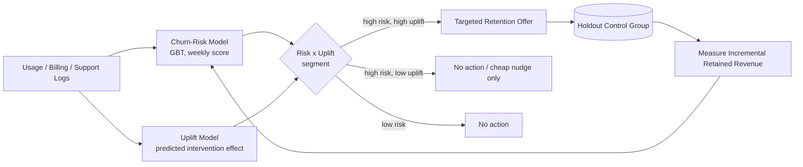
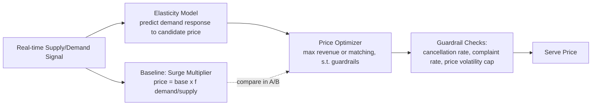
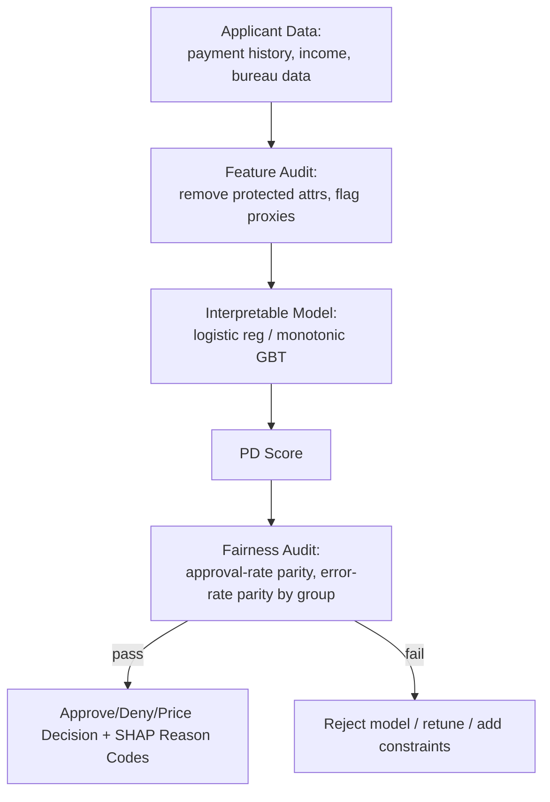
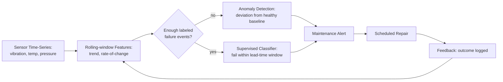
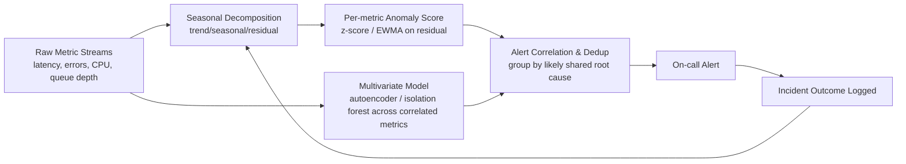
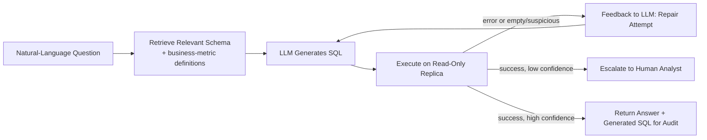
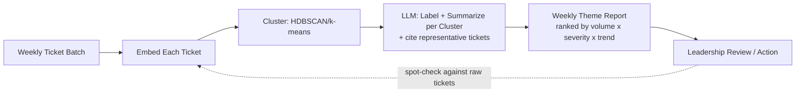
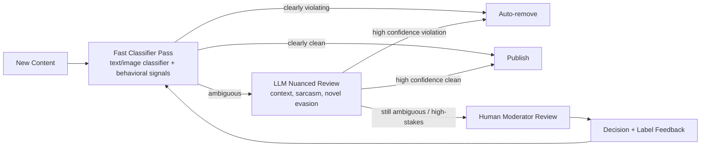
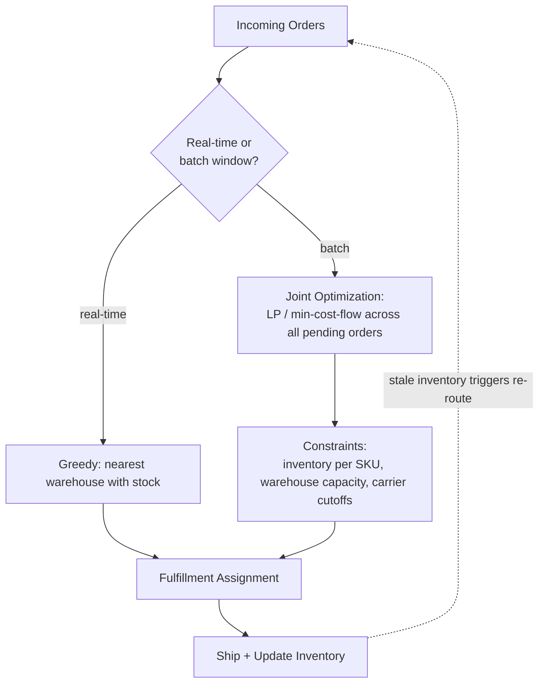

# Case Studies & Applied Use-Case Bank

This file is a companion to `14_system_design_ml.md`, not a replacement for it. File 14 gives you **6 full deep-dive system designs**, each worked through an 8-step framework in real depth — read it when you want to practice going deep on a small number of flagship designs.

This file does the opposite: it's a **wide, shallow bank of ~30 shorter case-study prompts** — the "case interview meets product sense meets ML" style questions that show up in rapid-fire rounds, product-sense screens, and "how would you approach this" segments of a broader interview. Where two prompts sound similar to a design in file 14 (duplicate detection, churn, search/ranking), this file deliberately takes a **different angle or a different sub-question** so the two files complement rather than repeat each other.

**How to use this file:** don't read straight through. For each prompt, cover the answer below with your hand, spend **2-3 minutes talking your own structured answer out loud** — objective, clarifying questions, data, approach, risks, validation — and only then read the given approach and compare. The value here is volume and pattern recognition across scenarios, not maximal depth on any one of them; if you want to go deep on a specific scenario afterward, that's what file 14 (and the topic-specific files elsewhere in this kit) are for.

Every answer below follows the same lightweight 6-part skeleton so the pattern becomes automatic:

> **Objective/metric → Clarifying questions → Data & features → Approach (baseline → refinement) → Risks/tradeoffs → How you'd validate impact**

---

## Table of Contents

- [A. Business/Product Case Studies](#a-businessproduct-case-studies)
  - [A1. Measuring Whether a Feature Launch Succeeded](#a1-measuring-whether-a-feature-launch-succeeded)
  - [A2. DAU Dropped 10% Last Week](#a2-dau-dropped-10-last-week)
  - [A3. Should We Build a Subscription/Loyalty Program?](#a3-should-we-build-a-subscriptionloyalty-program)
  - [A4. Should We Lower Prices to Increase Volume?](#a4-should-we-lower-prices-to-increase-volume)
  - [A5. Churn Prediction & Intervention, End-to-End](#a5-churn-prediction--intervention-end-to-end)
  - [A6. Did the Marketing Campaign Actually Drive Incremental Revenue?](#a6-did-the-marketing-campaign-actually-drive-incremental-revenue)
  - [A7. Prioritizing 5 ML Projects With Limited Headcount](#a7-prioritizing-5-ml-projects-with-limited-headcount)
- [B. Applied ML Case Studies](#b-applied-ml-case-studies)
  - [B1. Dynamic Pricing for Ride-Sharing / E-Commerce](#b1-dynamic-pricing-for-ride-sharing--e-commerce)
  - [B2. Near-Duplicate / Plagiarism Detection at Scale](#b2-near-duplicate--plagiarism-detection-at-scale)
  - [B3. Credit Risk / Loan Default Model + Fairness](#b3-credit-risk--loan-default-model--fairness)
  - [B4. Predictive Maintenance for Manufacturing/IoT](#b4-predictive-maintenance-for-manufacturingiot)
  - [B5. Search Relevance Ranking for E-Commerce](#b5-search-relevance-ranking-for-e-commerce)
  - [B6. Anomaly Detection for Server/Infrastructure Metrics](#b6-anomaly-detection-for-serverinfrastructure-metrics)
  - [B7. Lead-Scoring Model for a Sales Team](#b7-lead-scoring-model-for-a-sales-team)
- [C. GenAI / LLM Use-Case Case Studies](#c-genai--llm-use-case-case-studies)
  - [C1. Text-to-SQL for Non-Technical Employees](#c1-text-to-sql-for-non-technical-employees)
  - [C2. LLM-Powered Resume Screening Assistant](#c2-llm-powered-resume-screening-assistant)
  - [C3. Customer-Service Email Auto-Drafting Assistant](#c3-customer-service-email-auto-drafting-assistant)
  - [C4. Summarizing Thousands of Support Tickets Into Weekly Themes](#c4-summarizing-thousands-of-support-tickets-into-weekly-themes)
  - [C5. Proprietary LLM API vs. Fine-Tuned Open-Source Model](#c5-proprietary-llm-api-vs-fine-tuned-open-source-model)
  - [C6. Content Moderation Pipeline (LLM + Classifiers)](#c6-content-moderation-pipeline-llm--classifiers)
- [D. Forecasting / Supply Chain / Operations](#d-forecasting--supply-chain--operations)
  - [D1. Reorder Points & Safety Stock for Thousands of SKUs](#d1-reorder-points--safety-stock-for-thousands-of-skus)
  - [D2. Predicting Call-Center Staffing Needs by Hour](#d2-predicting-call-center-staffing-needs-by-hour)
  - [D3. Assigning Warehouses to Fulfill Orders](#d3-assigning-warehouses-to-fulfill-orders)
- [E. Experimentation / Metrics Case Studies](#e-experimentation--metrics-case-studies)
  - [E1. North Star Metric for a Two-Sided Marketplace](#e1-north-star-metric-for-a-two-sided-marketplace)
  - [E2. "We're Sure It's Better — Skip the A/B Test"](#e2-were-sure-its-better--skip-the-ab-test)
  - [E3. Catching a Regression Before It Reaches All Users](#e3-catching-a-regression-before-it-reaches-all-users)
- [F. Ambiguous / Trick "What Would You Do" Scenarios](#f-ambiguous--trick-what-would-you-do-scenarios)
  - [F1. Model Is Great Offline But "Doesn't Feel Right" in Production](#f1-model-is-great-offline-but-doesnt-feel-right-in-production)
  - [F2. Build in 2 Days What Normally Takes 2 Weeks](#f2-build-in-2-days-what-normally-takes-2-weeks)
  - [F3. Leadership Wants One Accuracy Number to "Trust the Model"](#f3-leadership-wants-one-accuracy-number-to-trust-the-model)
- [Quick Recall Sheet](#quick-recall-sheet)

---

## A. Business/Product Case Studies

### A1. Measuring Whether a Feature Launch Succeeded

**"How would you measure whether a new feature launch was successful?"**

**Approach:**
- **Objective/metric:** Before anything else, force a definition of "success" tied to the reason the feature was built — was it meant to increase engagement, drive revenue, reduce churn, or reduce support load? Pick one primary metric and 2-3 guardrails (e.g., latency, complaint rate, unrelated-feature cannibalization) up front, not after the data comes in.
- **Clarifying questions:** What was the hypothesis behind building this? Was there a pre-registered success threshold? Is this randomizable (A/B) or did it ship to everyone at once? What's the expected time-to-effect (immediate vs. needs weeks to show up)?
- **Data & features:** Usage/adoption of the feature itself (did people even find and use it), the primary metric split by exposed vs. not-exposed cohort, and segment cuts (new vs. existing users, platform, geography) to catch heterogeneous effects.
- **Approach (baseline → refinement):** Baseline is simple pre/post or exposed/unexposed comparison on the primary metric with a significance test; refine by running it as a proper randomized A/B if at all possible (see file 02 for testing mechanics), and if it shipped to 100% with no control, fall back to a quasi-experimental design — diff-in-diff against a comparable market/cohort that didn't get the feature, or an interrupted time-series with a pre-period trend extrapolation.
- **Risks/tradeoffs:** Novelty effects inflate short-term engagement; survivorship bias if only engaged users adopt the feature (adoption ≠ causal lift); metric can look good in aggregate while cannibalizing another metric.
- **Validate impact:** Re-check the metric at multiple horizons (1 week, 1 month) to separate novelty from durable lift, and confirm the guardrails didn't regress before declaring victory.

### A2. DAU Dropped 10% Last Week

**"Our daily active users dropped 10% last week — how would you investigate?"**

**Approach:**
- **Objective/metric:** The goal here isn't a model, it's root-cause diagnosis — the "metric" is time-to-correct-diagnosis, and the interviewer is grading your triage process, not a final number.
- **Clarifying questions:** Is this seasonal (day-of-week, holiday)? Is the drop global or isolated to one platform/geo/segment? Did anything ship that week (a release, a pricing change, an outage)? Is this a real behavior change or an instrumentation/logging break?
- **Data & features:** Break the aggregate DAU number down by platform, geography, new vs. returning users, and acquisition channel — a global aggregate metric hides which slice actually moved.
- **Approach (baseline → refinement):** Start with the cheapest, most common explanations first, in order: (1) instrumentation bug (a logging pipeline change, an SDK version bump) — check event volume and schema, not just the DAU rollup; (2) an external/seasonal cause (holiday, competitor launch, app-store outage) — check if this correlates with a known calendar event; (3) an internal cause — correlate the drop's start date against the deploy log/changelog; (4) if none of the above explain it, segment-slice the drop to isolate which user cohort or platform is responsible, then form a hypothesis specific to that slice (e.g., "iOS only" → suspect an App Store update or push-notification permission change).
- **Risks/tradeoffs:** Jumping to a causal story before ruling out instrumentation is the single most common mistake — a broken event pipeline looks identical to a real drop in a top-line dashboard.
- **Validate impact:** Once a hypothesis is found, confirm it explains the *magnitude* of the drop (not just direction) and check whether the metric recovers once the suspected cause is reverted/fixed.

### A3. Should We Build a Subscription/Loyalty Program?

**"How would you decide whether to build a subscription/loyalty program, and how would you measure its success?"**

**Approach:**
- **Objective/metric:** Frame this as an investment decision first, an ML question a distant second. Primary metric candidates: incremental customer lifetime value (LTV), repeat-purchase rate, or retention lift among members vs. comparable non-members.
- **Clarifying questions:** What specific behavior is the program trying to change (frequency, basket size, retention)? What's the cost structure (discounts, free shipping, points liabilities)? Is there already a natural "power user" segment whose behavior the program would try to formalize/reward?
- **Data & features:** Historical purchase frequency/recency/monetary (RFM) segmentation to estimate what fraction of revenue already comes from loyal repeat customers without any program — if it's already high, a paid program may just be subsidizing existing behavior rather than creating new behavior.
- **Approach (baseline → refinement):** Baseline: a small pilot/regional or opt-in randomized rollout (not a full launch) sized to detect the expected LTV lift; refine by segmenting the pilot analysis by prior purchase frequency, since loyalty programs typically show the biggest true incremental effect on *mid-tier* customers (top-tier customers would have stayed loyal anyway — same logic as marketing incrementality below).
- **Risks/tradeoffs:** Self-selection into the program (only already-loyal customers join) makes naive before/after comparisons overstate impact; the program's cost (discount economics, points breakage assumptions) must be modeled against the incremental LTV lift, not just against gross engagement.
- **Validate impact:** Track incremental LTV and margin-adjusted ROI of the program over a horizon long enough to capture repeat behavior (quarters, not weeks), with a held-out control group maintained even after "launch" to keep measuring true incrementality.

### A4. Should We Lower Prices to Increase Volume?

**"A stakeholder asks: 'should we lower prices to increase volume?' — how do you approach this analytically?"**

**Approach:**
- **Objective/metric:** The real objective is almost never "volume" alone — it's margin-adjusted revenue or profit. Reframe the question from "will volume go up" (almost certainly yes) to "does the volume gain outweigh the margin given up."
- **Clarifying questions:** What's the current gross margin per unit? Is demand price-elastic in this category (commodity vs. differentiated product)? Is this a one-time promotional cut or a permanent price change? Are competitors likely to match (a price war risk)?
- **Data & features:** Historical price-volume data (from past promotions/regional price variation) to estimate price elasticity of demand; cost structure to know the margin floor; competitor pricing data.
- **Approach (baseline → refinement):** Baseline is a back-of-envelope elasticity estimate from historical natural price variation (regional pricing differences, past promotions) fit as a log-log demand curve; refine with a controlled experiment — randomize price changes across comparable markets/stores/user segments and measure the actual volume response and net revenue, since historical correlational elasticity estimates are confounded by whatever else was happening when prices changed in the past.
- **Risks/tradeoffs:** compare the two ways of answering this explicitly:

| Approach | Speed | Rigor | Risk |
|---|---|---|---|
| Historical elasticity model (log-log regression on past price/volume) | Fast, uses existing data | Confounded by concurrent promotions, seasonality, competitor moves | Can badly over/under-state true elasticity |
| Randomized price experiment (geo or segment holdout) | Slower, needs a live test window | Causally clean | Real revenue at risk during the test; competitors may react |

- **Validate impact:** Measure net margin-adjusted revenue (not just units sold) post-change, watch for competitor price matching eroding the expected volume gain, and check whether the effect persists after any short-term promotional spike fades.

### A5. Churn Prediction & Intervention, End-to-End

**"How would you design a customer churn prediction and intervention system end-to-end (business + technical)?"**

**Approach:**
- **Objective/metric:** The end goal is *incremental retained revenue net of intervention cost*, not model AUC — a churn model that's accurate but drives no profitable action is worthless. (File 14 covers the clarifying questions for churn *modeling* — definition, horizon, cost asymmetry — in its Additional Questions section; this answer focuses on the closed-loop *system*, model → decision → action → feedback.)
- **Clarifying questions:** What retention lever actually exists (discount, CSM call, in-app nudge), what does it cost, and how effective has it historically been when used? Is there a control group of untreated at-risk customers to keep measuring true incrementality?
- **Data & features:** Engagement/usage trend, support-ticket sentiment/volume, billing/payment history, tenure, and early-lifecycle onboarding signals — churn is often predictable from a customer's first weeks.
- **Approach (baseline → refinement):** Baseline: a GBT classifier on tabular engagement/billing features scored weekly, thresholded by the cost of a false positive (wasted offer) vs. false negative (lost customer); refine into a genuine decision system by uplift-modeling instead of pure churn-risk-modeling — score customers not just by *risk of churning* but by *predicted incremental effect of the intervention*, since the highest-risk customers are sometimes the ones least likely to be saved by any offer (already decided to leave) while a mid-risk, high-uplift segment is where the intervention actually pays off.
- **Risks/tradeoffs:** Over-targeting trains customers to expect discounts (moral hazard); acting on every "at risk" flag without a control group destroys your ability to ever measure true program impact again.
- **Validate impact:** Hold out a randomized slice of at-risk customers from intervention permanently (or on a rotating basis) to measure the causal lift of the retention program itself, not just the accuracy of the churn score.

### A6. Did the Marketing Campaign Actually Drive Incremental Revenue?

**"How would you evaluate whether a marketing campaign actually drove incremental revenue (vs. just correlating with it)?"**

**Approach:**
- **Objective/metric:** Incremental revenue (or conversions) caused by the campaign, net of what would have happened anyway — this is a causality question, not a correlation-reporting one.
- **Clarifying questions:** Was the campaign targeted at users already likely to convert (retargeting bias)? Can exposure be randomized or geographically held out? What's the expected lag between exposure and conversion?
- **Data & features:** Exposure logs, conversion events, and — critically — a comparable **unexposed** population (holdout users, holdout geographies, or a matched synthetic control) to compare against.
- **Approach (baseline → refinement):** Baseline (and the wrong answer if used alone): before/after or exposed-vs-converted correlation — this overstates impact because retargeting/lookalike-audience campaigns are deliberately shown to people already likely to convert. Correct approach: a randomized geo-holdout or user-holdout incrementality test — hold back a randomized control group from the campaign entirely and compare conversion rates, or use a matched-market test (synthetic control from unexposed comparable regions) when a clean individual-level holdout isn't feasible. This is the same causal-inference logic as the marketing-attribution design in file 14, applied narrowly to a single campaign's go/no-go decision rather than an always-on attribution platform.
- **Risks/tradeoffs:** Multi-touch attribution models (last-click, linear, Shapley) are useful for budget allocation across channels but are still correlational — they can't tell you the campaign's true incremental lift over doing nothing, only how to split credit among touches assuming everything is incremental.
- **Validate impact:** Compare the incrementality-test lift estimate against what the correlational/attribution model would have implied for the same campaign — a large gap between the two is itself a valuable finding to report back to stakeholders about how much attribution numbers can overstate real impact.

### A7. Prioritizing 5 ML Projects With Limited Headcount

**"How would you prioritize which of 5 proposed ML projects to build first with limited data science headcount?"**

**Approach:**
- **Objective/metric:** Maximize expected business value delivered per unit of scarce DS time — this is a portfolio/prioritization framework question, not a modeling question.
- **Clarifying questions:** For each project — what's the estimated business value if it works, what's the confidence that it *will* work given available data, and what's the estimated effort/time to a usable v1?
- **Data & features:** For scoring, you need per-project estimates of (a) expected value/impact, (b) confidence/probability of success (data readiness, technical risk), and (c) effort/cost, ideally converted to comparable units (e.g., dollar impact, engineer-weeks).
- **Approach (baseline → refinement):** Baseline: score each project on a simple **Impact × Confidence ÷ Effort** framework (a lightweight ICE/RICE-style score) and rank; refine by explicitly separating "quick wins" (high impact, low effort, ship first regardless of ranking precision) from genuinely close calls that deserve a deeper business case, and by checking data readiness as a gating factor — a high-scoring project with no usable labeled data yet isn't actually buildable this quarter, so it becomes a data-collection task, not an ML task, for now.

| Factor | What to ask | Why it matters |
|---|---|---|
| Impact | What's the $ or strategic value if this works as hoped? | Sets the ceiling worth chasing |
| Confidence | Do we have the data/labels today? Is the problem well-posed? | A high-impact idea with no data is a data project, not an ML project, this quarter |
| Effort | Engineer-weeks to a usable v1, not a perfect system | Determines opportunity cost against the other 4 projects |
| Dependency/leverage | Does this project's infrastructure (feature store, labeling pipeline) unlock the others? | Sequencing matters, not just standalone score |

- **Risks/tradeoffs:** Pure impact-ranking ignores sequencing — a lower-scoring project that builds shared infrastructure (a feature store, a labeling pipeline) other projects need can be worth doing first even at a lower standalone score.
- **Validate impact:** Set an explicit checkpoint (e.g., 2-4 weeks) for each started project to prove out a leading indicator of success before committing further headcount, rather than fully committing to all 5 sequentially on faith.

---

## B. Applied ML Case Studies

### B1. Dynamic Pricing for Ride-Sharing / E-Commerce

**"How would you build a dynamic pricing model for a ride-sharing or e-commerce platform?"**

**Approach:**
- **Objective/metric:** Maximize a business objective under constraints — usually revenue or marketplace efficiency (matching supply to demand) subject to fairness/perception guardrails, not "predict the perfect price" in isolation.
- **Clarifying questions:** What's actually being balanced — supply-demand matching (ride-sharing surge) or margin optimization (e-commerce)? Are there regulatory or PR constraints on how much/fast price can move? Is price elasticity assumed known or does it need to be estimated live?
- **Data & features:** Real-time supply/demand ratio (open drivers vs. active ride requests, or inventory levels vs. traffic), historical price-elasticity by segment/time/location, competitor pricing (e-commerce), and event/context signals (weather, local events, time of day).
- **Approach (baseline → refinement):** Baseline: a simple supply/demand ratio multiplier (classic "surge pricing" rule — price = base × f(demand/supply)) that's transparent and easy to reason about; refine into a learned elasticity model that predicts the demand response to a candidate price and picks the revenue/matching-optimal price per segment, validated against the simple multiplier via a live experiment before fully replacing it.
- **Risks/tradeoffs:** Price optimization ignoring fairness/PR optics causes real backlash (surge pricing during emergencies is a recurring PR crisis); overly volatile pricing erodes user trust even if short-term revenue-optimal; feedback loops (raising price reduces demand which the model then reads as "less demand," a subtlety requiring off-policy/counterfactual evaluation rather than naive logged-data training).
- **Validate impact:** A/B test candidate pricing policies on a slice of markets/users, measuring both revenue/matching efficiency *and* guardrails (cancellation rate, repeat-usage rate, complaint volume) — never ship a pricing model on a revenue metric alone.

### B2. Near-Duplicate / Plagiarism Detection at Scale

**"How would you detect near-duplicate or plagiarized content at scale?"**

**Approach:** *(File 14's Additional Questions section already covers the full architecture for marketplace-listing/image duplicate detection — ANN index, embedding fusion, clustering. This answer takes the text/plagiarism angle and leads with the business-decision layer instead of the retrieval architecture.)*
- **Objective/metric:** Precision on flagged content matters more than raw recall here, because the downstream action (accusing someone of plagiarism, delisting content) has real reputational cost for a false positive — set the operating point accordingly.
- **Clarifying questions:** Is exact-match copying the concern, or paraphrased/reworded plagiarism? What's the action taken on a flag — automatic takedown, or routed to human review? Is there a legitimate-reuse case to exclude (licensed syndication, quoted excerpts with attribution)?
- **Data & features:** For text, classic scalable approach is **shingling + MinHash + LSH** (locality-sensitive hashing) to estimate Jaccard similarity between documents without all-pairs comparison; for semantic (not just lexical) plagiarism, a sentence/document embedding similarity catches reworded content that shares no exact n-grams.
- **Approach (baseline → refinement):** Baseline: MinHash/LSH over shingles — cheap, scales to huge corpora, catches copy-paste and light editing; refine by layering a semantic embedding similarity pass on the LSH-retrieved candidate set to catch paraphrased plagiarism the lexical method misses, then a rules layer to whitelist legitimate quoting/attribution patterns before flagging.
- **Risks/tradeoffs:** Lexical-only methods miss paraphrasing; embedding-only methods are expensive at full-corpus scale and can false-positive on same-topic-different-content pairs; the whitelisting/attribution-detection layer is often the highest-effort, highest-payoff part of the system in practice.
- **Validate impact:** Track precision/recall against a human-labeled sample specifically stratified by "exact copy," "light edit," and "heavy paraphrase" cases, since aggregate accuracy hides which category the system is actually failing on.

### B3. Credit Risk / Loan Default Model + Fairness

**"How would you build a credit risk / loan default prediction model, and what fairness considerations would you check for?"**

**Approach:**
- **Objective/metric:** Predict probability of default (PD) to inform an approve/deny/pricing decision, optimized against expected loss (cost of a bad loan approved vs. profit from a good loan denied), under regulatory fairness and explainability constraints.
- **Clarifying questions:** What's the regulatory regime (fair lending laws restrict which features are usable — e.g., protected-class proxies)? Is the model used for approve/deny, or for risk-based pricing? What explainability is legally required for adverse-action notices?
- **Data & features:** Payment history, income/debt ratios, credit bureau data, loan characteristics; explicitly *excluding* protected attributes (race, gender) and auditing for proxies (zip code can proxy for race, so geographic features need fairness scrutiny even though they seem "neutral").
- **Approach (baseline → refinement):** Baseline: a regularized logistic regression or a monotonic-constrained GBT (monotonicity between income and approval likelihood, for instance, is both a business sanity check and an explainability aid) — favor interpretable models here more than in most ML settings, precisely because of the regulatory/explainability requirement; refine cautiously toward more complex models only if the accuracy gain clearly outweighs the explainability loss, and pair any complex model with a post-hoc explanation method (SHAP) for adverse-action reason codes.
- **Risks/tradeoffs:** Fairness checks aren't optional here — evaluate approval rates and default-prediction error rates *across* demographic groups (disparate impact, equalized odds), not just aggregate accuracy; a model can be highly accurate overall while systematically disadvantaging a protected group, and that's a compliance and ethical failure, not just a modeling nuance.
- **Validate impact:** Beyond AUC/KS-statistic on holdout, run a fairness audit (approval rate parity, false-positive-rate parity across protected groups) as a hard gate before deployment, and monitor it continuously in production, not just at model-launch time.

### B4. Predictive Maintenance for Manufacturing/IoT

**"How would you design a system to predict equipment failure in a manufacturing/IoT setting (predictive maintenance)?"**

**Approach:**
- **Objective/metric:** Minimize total cost = cost of unplanned downtime/failure + cost of unnecessary preventive maintenance, predicting failure with enough lead time to schedule a repair before it happens (an "early enough to act" horizon, exactly like the churn-horizon logic).
- **Clarifying questions:** What's the required lead time for a maintenance action to be scheduled and completed? Are failures rare (extreme class imbalance) and well-labeled, or largely inferred from post-hoc maintenance logs? Is this remaining-useful-life (RUL) regression or binary "will fail in next N days" classification?
- **Data & features:** Sensor time-series (vibration, temperature, pressure, current draw), maintenance/repair logs as historical labels, equipment age/usage cycles, and engineered features like rolling statistics and rate-of-change/degradation trends rather than raw instantaneous readings.
- **Approach (baseline → refinement):** Baseline: threshold-based alerting on a single sensor reading (simple, transparent, already exists in most plants) as the always-on safety net; refine to a supervised model (GBT on rolling-window sensor features, or an RNN/temporal-CNN directly on the raw sequence) trained to predict failure within a lead-time window, framed as extreme-class-imbalance classification with a precision-recall (not accuracy) evaluation, since failures are rare and both false positives (unneeded maintenance) and false negatives (unplanned downtime) are costly but asymmetrically so.
- **Risks/tradeoffs:** Labels are frequently noisy/sparse (a failure only gets logged when an operator notices, not the moment degradation starts) — an anomaly-detection framing (flag deviation from a healthy-equipment baseline, B6's approach) is often a more label-efficient first step than supervised failure classification when labeled failure events are scarce.
- **Validate impact:** Track realized reduction in unplanned-downtime hours and maintenance cost per unit versus the prior threshold-based regime in a phased rollout across a subset of machines/lines before plant-wide deployment.

### B5. Search Relevance Ranking for E-Commerce

**"How would you build a search relevance ranking system for an e-commerce site?"**

**Approach:** *(Distinct from file 14's recommendation-system design — search is query-driven and intent-explicit, versus recommendations being largely query-less and preference-driven; the funnel shape is similar but the signal and cold-start problem differ.)*
- **Objective/metric:** Primary metric is typically a relevance/conversion proxy (NDCG or MRR against clicks/purchases attributable to a query), balanced against business metrics like conversion rate and revenue-per-search.
- **Clarifying questions:** Is query understanding (typo correction, synonym expansion, intent classification) in scope, or just ranking a given candidate set? How much history exists per query (long-tail/rare queries need a different strategy than head queries)?
- **Data & features:** Query-product text match features (BM25/TF-IDF), historical click/purchase-through-rate for a (query, product) pair, product popularity/quality signals (ratings, return rate, in-stock status), and personalization signals (user's past category affinity) as a re-ranking layer.
- **Approach (baseline → refinement):** Two-stage funnel, same shape as recommendation ranking: (1) lexical/BM25 retrieval or a lightweight embedding-based semantic search over the full catalog to get a candidate set with high recall, then (2) a learning-to-rank model (gradient-boosted LambdaMART-style or a re-ranking neural model) over richer features to order that candidate set for precision, since running the expensive ranker over the entire catalog per query is infeasible at scale.

| Approach | Handles synonyms/semantic intent? | Cold-start on new products | Latency/cost |
|---|---|---|---|
| Lexical (BM25/TF-IDF) retrieval | Weak — needs explicit synonym lists | Fine, works from day one on text alone | Very fast/cheap |
| Embedding-based semantic retrieval | Strong — captures intent beyond exact terms | Fine if using content embeddings | Needs ANN index, more infra |
| Learning-to-rank on top of either | N/A — this is the ranking stage, not retrieval | Needs interaction data to rank well; blend with content signals for new items | Runs only on the short candidate list |

- **Risks/tradeoffs:** Pure click-through optimization can over-favor popular items and starve new/niche products of exposure (a rich-get-richer feedback loop identical to the recommendation cold-start problem); relevance and business-conversion objectives can diverge (a highly relevant but out-of-stock or low-margin item).
- **Validate impact:** A/B test on conversion rate and revenue-per-search, not just offline NDCG, and specifically monitor null-result rate and long-tail query performance as a guardrail against the ranker only being tuned for head queries.

### B6. Anomaly Detection for Server/Infrastructure Metrics

**"How would you design an anomaly detection system for server/infrastructure metrics?"**

**Approach:**
- **Objective/metric:** Minimize time-to-detection of real incidents while keeping alert-fatigue (false positive rate) low enough that on-call engineers still trust and act on alerts — the real objective is a *usable alerting system*, not a maximally sensitive one.
- **Clarifying questions:** Which metrics matter (latency, error rate, CPU/memory, queue depth) and do they have known seasonality (daily/weekly traffic patterns)? What's the acceptable alert volume per on-call shift? Is the goal detection only, or also root-cause localization across a service graph?
- **Data & features:** Time-series metrics per service/host, with seasonality-aware decomposition (trend/seasonal/residual) so a Monday-morning traffic spike isn't flagged as anomalous every single week.
- **Approach (baseline → refinement):** Baseline: statistical control limits on the residual after seasonal decomposition (e.g., STL decomposition + z-score or EWMA control chart on the residual) — simple, interpretable, and a reasonable per-metric starting point; refine toward a multivariate approach (e.g., an autoencoder or isolation forest across correlated metrics jointly) once single-metric thresholds prove too noisy, since incidents often manifest as a *pattern* across several metrics moving together rather than one metric crossing a fixed line.
- **Risks/tradeoffs:** Per-metric thresholding alone causes alert storms during real incidents (every downstream metric fires its own alert) — needs alert correlation/deduplication (group alerts firing from the same root incident) on top of raw anomaly detection; overly sensitive thresholds cause alert fatigue that erodes trust and leads to alerts being ignored, which is worse than not having the system at all.
- **Validate impact:** Track precision (fraction of alerts that were real, actionable incidents) and mean-time-to-detection against historical incident logs, and explicitly tune the sensitivity/false-positive tradeoff with on-call engineers rather than in isolation.

### B7. Lead-Scoring Model for a Sales Team

**"How would you approach building a lead-scoring model for a sales team?"**

**Approach:**
- **Objective/metric:** Predict probability of a lead converting (or expected deal value) to help a sales team prioritize *finite outreach time* toward the highest-expected-value leads — the objective is sales efficiency (conversions or revenue per rep-hour), not raw prediction accuracy.
- **Clarifying questions:** Is the goal to prioritize which leads to call first, or to also decide which to *not* pursue at all? What data exists at the moment of scoring (firmographic/demographic data available immediately vs. behavioral data that accumulates only after some engagement)? How is the sales team currently prioritizing (a baseline to beat)?
- **Data & features:** Firmographic data (company size, industry) for B2B, engagement signals (website visits, content downloads, email opens), lead source/channel, and historical conversion outcomes as labels — with care that engagement features are only used if genuinely available at scoring time (not leaking post-conversion activity).
- **Approach (baseline → refinement):** Baseline: a simple weighted rules-based score (industry fit + engagement level + firmographic fit) sales already intuitively uses, formalized and made consistent; refine to a supervised model (logistic regression or GBT) trained on historical lead-to-conversion outcomes, output as a calibrated probability so reps can trust "70% score" to roughly mean 70% conversion likelihood, and feed reps a ranked queue rather than a raw score.
- **Risks/tradeoffs:** Labels are sales-process-dependent (a lead marked "lost" might just mean a rep didn't follow up, not that it was a bad lead) — survivorship/selection bias in historical outcomes needs explicit checking; a purely conversion-probability-ranked queue can systematically under-prioritize large, slower-to-close but high-value deals unless expected *value* (probability × deal size) is used instead of probability alone.
- **Validate impact:** Run a held-out control group of reps still using the old prioritization method against a treatment group using the new scores, and measure conversion rate and revenue per rep-hour, not just model AUC on a historical holdout.

---

## C. GenAI / LLM Use-Case Case Studies

### C1. Text-to-SQL for Non-Technical Employees

**"How would you build an internal tool that lets non-technical employees ask questions of a SQL database in natural language (text-to-SQL)?"**

**Approach:**
- **Objective/metric:** Fraction of natural-language questions answered with a *correct* query result, weighted heavily toward precision — a wrong number confidently presented to a non-technical stakeholder who can't sanity-check the SQL is worse than the tool refusing to answer.
- **Clarifying questions:** How complex/large is the schema (dozens of tables vs. hundreds with ambiguous joins)? Is this read-only analytics, or could it ever write/modify data (a hard security line)? What's the acceptable latency, and is there a human review step before a number reaches a decision-maker?
- **Data & features:** The schema itself (table/column names, types, foreign-key relationships, and ideally business-friendly column descriptions) is the core "feature" — an LLM's biggest text-to-SQL failure mode is guessing an ambiguous join or a column's meaning, not syntax errors.
- **Approach (baseline → refinement):** Baseline: prompt an LLM with the relevant schema (via retrieval — don't stuff the *entire* warehouse schema into context, retrieve just the tables/columns relevant to the question) plus a few worked examples (few-shot), and execute the generated SQL in a sandboxed **read-only** replica; refine by adding a self-check/repair loop (run the query, and if it errors or returns an empty/suspicious result, feed the error back to the LLM to retry), a confidence-based escalation to a human data analyst for ambiguous questions, and a semantic layer/curated set of business-metric definitions (so "revenue" resolves consistently to the same agreed definition instead of the LLM guessing which column means revenue).
- **Risks/tradeoffs:** Silent wrong answers are the dominant risk, not crashes — always surface the generated SQL alongside the answer so a technical reviewer can spot-check it, and never grant the tool write access regardless of how well text-to-SQL performs on reads.
- **Validate impact:** Maintain a curated benchmark set of real business questions with known-correct SQL/answers, track exact-match and semantic-correctness rate over time as the schema and prompt evolve, and separately track how often users report a wrong answer in production.

### C2. LLM-Powered Resume Screening Assistant

**"How would you design an LLM-powered resume screening assistant, and what risks would you flag?"**

**Approach:**
- **Objective/metric:** Reduce recruiter time-per-qualified-candidate-surfaced while maintaining (not degrading) the quality and fairness of who advances — this is a productivity-tool design constrained hard by legal/fairness risk, more than a pure accuracy optimization.
- **Clarifying questions:** Is the tool assistive (surfaces a shortlist/summary for a human to review) or making an autonomous reject decision? What jurisdictions' employment-discrimination laws apply (several now specifically regulate automated hiring tools)? What's the current human baseline process being augmented?
- **Data & features:** Resume text, job description/requirements, and — critically — an audit of what historical hiring-outcome data (if any) is used to train/tune the tool, since past hiring decisions can encode historical bias that a naive model would learn to replicate.
- **Approach (baseline → refinement):** Baseline: use an LLM purely for *extraction and structuring* (pull out years of experience, skills, education into a structured summary against the job requirements) rather than a bare "fit score," keeping a human as the actual decision-maker; refine, if a ranking/score is truly needed, by strictly limiting inputs to job-relevant criteria, explicitly excluding/redacting proxies for protected characteristics (name, graduation year as an age proxy, address), and validating the score's outcomes don't disparately impact any protected group.
- **Risks/tradeoffs:** This is one of the highest-regulatory-risk LLM use cases in practice — flag explicitly: (1) proxy discrimination (names/schools correlating with race or gender), (2) hallucinated or misread qualifications from messy resume parsing, (3) legal requirements in some jurisdictions to disclose automated decision-making to candidates and allow opt-out/appeal, (4) a human decision-maker rubber-stamping the AI's ranking without real review ("automation bias"), which defeats the "assistive, not autonomous" design intent.
- **Validate impact:** Audit shortlist/advancement rates by protected-class group on a recurring basis (not just at launch), and separately audit a sample of the LLM's extracted-qualification summaries against the raw resume for accuracy/hallucination.

### C3. Customer-Service Email Auto-Drafting Assistant

**"How would you build a customer-service email auto-drafting assistant that a human reviews before sending?"**

**Approach:**
- **Objective/metric:** Reduce average agent handle-time per ticket while maintaining (or improving) response quality/customer satisfaction — measured by edit distance between draft and sent email (a proxy for how useful the draft was) plus CSAT, not just "did we generate a draft."
- **Clarifying questions:** What's the range of ticket types/complexity (simple FAQ-style vs. account-specific/sensitive issues)? Does the assistant need access to account/order data to draft a genuinely useful response, and if so, what access-control boundaries apply? Is a human review of every draft mandatory (yes, per the prompt) — so latency to draft matters more than end-to-end automation.
- **Data & features:** The customer's message, relevant account/order context (retrieved, not hallucinated), and a knowledge base of policy/response templates retrieved via RAG (same retrieval pattern as file 14's support chatbot design, but generating a draft for a human rather than a direct customer-facing answer).
- **Approach (baseline → refinement):** Baseline: RAG over a policy/knowledge-base + account-context retrieval feeding an LLM prompt to draft a response, with the draft always landing in an agent's edit queue, never auto-sent; refine by learning from agent edits over time (if agents consistently rewrite a certain phrase or ticket type the same way, feed that back into the prompt/few-shot examples or flag that ticket type as poorly suited to auto-drafting) and by adding a confidence/complexity gate that skips auto-drafting entirely for high-sensitivity ticket categories (legal complaints, safety issues) where a blank-page human draft is safer than anchoring the agent to a wrong AI suggestion.
- **Risks/tradeoffs:** Anchoring bias — agents may under-edit a plausible-sounding but subtly wrong draft (a policy misstatement, wrong account details) simply because editing existing text has lower activation energy than catching every fine detail; over time, low edit rates can reflect either "the assistant is great" or "agents are rubber-stamping," which look identical in the edit-distance metric alone.
- **Validate impact:** Track handle-time reduction, CSAT, and — as a specific check against rubber-stamping — periodically audit a sample of low-edit-distance sent emails for factual correctness against the account/policy data, not just assume low edits mean a good draft.

### C4. Summarizing Thousands of Support Tickets Into Weekly Themes

**"How would you design a system to summarize thousands of customer support tickets into weekly themes for leadership?"**

**Approach:**
- **Objective/metric:** A concise, accurate, and *trustworthy* weekly theme report leadership can act on — success is measured by whether leadership actually uses it to make decisions and by absence of embarrassing misrepresentations (a theme reported as "top issue" that's actually a handful of tickets), not by ROUGE score against nothing in particular.
- **Clarifying questions:** Do leadership want raw theme discovery (bottom-up, "what are people complaining about") or tracking against known categories (top-down, "how many billing complaints this week")? What volume are we talking (hundreds vs. tens of thousands of tickets/week) — this determines whether per-ticket LLM summarization is even cost-feasible?
- **Data & features:** Ticket text, existing categorical tags (if any, useful as a prior/cross-check), ticket volume and resolution-time metadata to weight themes by severity/impact, not just frequency.
- **Approach (baseline → refinement):** Baseline: embed each ticket, cluster (e.g., HDBSCAN or k-means over embeddings) to discover thematic groups bottom-up, then use an LLM to generate a human-readable label/summary *per cluster* rather than per individual ticket (drastically cheaper and more consistent than summarizing thousands of tickets individually then re-summarizing the summaries); refine by tracking cluster membership week-over-week to report trend (a theme growing 3x week-over-week is a much more actionable signal than a static count), and by having the LLM cite representative example tickets per theme so leadership can spot-check the summary against real customer language.
- **Risks/tradeoffs:** LLM summarization can smooth over or hallucinate a coherent-sounding theme from a noisy cluster that isn't actually one topic; a small number of loud/repeated tickets from one customer can look like a "trend" if not deduplicated by unique customer.
- **Validate impact:** Have a human (support-ops lead) periodically review generated themes against a manual read of a ticket sample for accuracy, and track whether leadership's actions based on the report (e.g., a fix shipped for a reported top theme) correlate with the theme actually shrinking the following week.

### C5. Proprietary LLM API vs. Fine-Tuned Open-Source Model

**"How would you evaluate whether it's worth switching from a proprietary LLM API to a fine-tuned open-source model for a specific product feature?"**

**Approach:**
- **Objective/metric:** Total cost of ownership and risk-adjusted quality at the feature's actual production volume — this is a build-vs-buy tradeoff (same underlying logic as file 14's build-vs-vendor question), specialized to LLMs.
- **Clarifying questions:** What's current/projected request volume (the crossover point between per-call API pricing and hosting-your-own-model cost depends entirely on scale)? Is data sensitivity/residency a hard constraint (some data can't leave the org's infrastructure)? How narrow is the task (a narrow, repetitive task fine-tunes well on a smaller open model; a broad, open-ended task may still need frontier-model general reasoning)?
- **Data & features:** Enough labeled/curated examples of the specific task to fine-tune on (if this doesn't exist yet, that's itself a strong point in favor of staying on the API short-term); current API cost and latency at production volume as the baseline to beat.
- **Approach (baseline → refinement):** Baseline: stay on the proprietary API — fastest to iterate, no training infrastructure needed, and usually higher raw quality on broad/novel tasks out of the box; refine the decision using a structured comparison rather than a gut call:

| Factor | Proprietary API | Fine-tuned open-source model |
|---|---|---|
| Time-to-value | Immediate | Weeks (data curation, fine-tuning, eval, hosting setup) |
| Cost at low volume | Cheap (pay-per-call) | Expensive (fixed hosting cost regardless of volume) |
| Cost at high volume | Can dominate spend | Often cheaper — fixed cost amortized over volume |
| Data control/residency | Data leaves your infra | Full control, can stay in-house |
| Quality on narrow, repetitive task | Good, sometimes over-general | Can match or exceed after fine-tuning on task-specific data |
| Quality on broad/novel reasoning | Best-in-class | Usually behind frontier models unless heavily tuned |
| Operational burden | None (vendor-managed) | Real — hosting, scaling, monitoring, re-tuning as needs shift |

- **Risks/tradeoffs:** Don't fine-tune prematurely — do it only once the task is stable/narrow enough that a smaller specialized model is expected to match quality, and volume is high enough that the hosting cost is actually justified by the API-cost savings.
- **Validate impact:** Run both side-by-side on the same production traffic sample (shadow mode), compare quality (task-specific eval, not generic benchmarks), latency, and fully loaded cost (including engineering time to maintain the fine-tuned pipeline) before committing to a switch.

### C6. Content Moderation Pipeline (LLM + Classifiers)

**"How would you design a content moderation pipeline that combines an LLM with traditional classifiers?"**

**Approach:**
- **Objective/metric:** Maximize harmful-content recall subject to a strict cost/latency budget and an acceptable false-positive rate (over-removal of legitimate content is its own harm — user trust and free-expression concerns), evaluated per-policy-category since "harmful content" isn't one uniform class.
- **Clarifying questions:** What's the required moderation latency (pre-publish blocking vs. post-publish review)? What policy categories are in scope (spam, hate speech, violence, misinformation — each has different base rates and different acceptable error tradeoffs)? What's the appeals/human-review process for content actioned incorrectly?
- **Data & features:** Historical labeled moderation decisions per policy category, text/image/multimodal content itself, and account/behavioral signals (posting velocity, prior violation history) as a fast, cheap pre-filter.
- **Approach (baseline → refinement):** Same two-stage cost/latency logic as file 14's fraud-detection design: fast, cheap traditional classifiers (a lightweight text classifier, or account/behavioral heuristics) run on ~100% of content as a low-latency first pass, catching clear-cut violations and clear-cut clean content at the tails of the confidence distribution; the ambiguous middle band gets routed to a more expensive LLM pass for nuanced judgment (sarcasm, context-dependent policy violations, novel evasion patterns a static classifier hasn't seen) that a fast classifier alone would misjudge; genuinely ambiguous or high-stakes LLM outputs still escalate to human review rather than auto-actioning.
- **Risks/tradeoffs:** LLMs are more adaptable to novel/evolving harmful-content patterns than a static classifier (which needs retraining to catch a new evasion technique) but are slower and costlier per item — running the LLM on all traffic is usually not affordable at platform scale, which is exactly why the funnel exists; auto-actioning purely on an LLM's judgment without human review on borderline/high-stakes content risks both under- and over-moderation at a scale that erodes trust quickly.
- **Validate impact:** Track precision/recall per policy category against human-reviewed ground truth, monitor for emerging evasion patterns the fast classifier starts missing (a drift signal that should trigger classifier retraining), and separately track appeal-overturn rate as a proxy for false-positive harm to legitimate users.

---

## D. Forecasting / Supply Chain / Operations

### D1. Reorder Points & Safety Stock for Thousands of SKUs

**"A retailer wants to decide optimal reorder points and safety stock levels for thousands of SKUs — how would you approach it?"**

**Approach:** *(Distinct angle from file 14's demand-forecasting design: that design is about producing the demand *forecast* itself at scale; this one is the downstream inventory-policy decision that consumes a forecast — reorder point and safety stock, not point prediction.)*
- **Objective/metric:** Minimize total inventory cost (holding cost + stockout/lost-sales cost) subject to a target service level (e.g., 95% in-stock probability), per SKU or per SKU-cluster.
- **Clarifying questions:** What service-level target does the business want (and does it vary by SKU importance/margin)? What's the supplier lead time distribution (fixed vs. variable — variability is what actually drives safety stock need, not just average demand)? Are SKUs independent or does one stockout cascade (substitute/bundle effects)?
- **Data & features:** Historical demand (mean and *variance*, not just mean — safety stock is driven by demand variability and lead-time variability), supplier lead-time history, current holding cost per unit, and stockout cost/margin per SKU.
- **Approach (baseline → refinement):** Baseline: the classical formula — **reorder point = (average demand during lead time) + safety stock**, where **safety stock = z × σ_demand-during-lead-time** (z chosen from the target service level's normal-distribution quantile) — computed per SKU using the demand forecast's mean and variance as inputs; refine by clustering SKUs by demand pattern (steady vs. intermittent/lumpy demand, which the normal-distribution assumption badly fits) and using a different safety-stock method for intermittent-demand SKUs (e.g., Croston's method or a quantile-based empirical approach instead of a normal-approximation z-score), and by accounting for lead-time variability jointly with demand variability rather than just one or the other.

| Component | What drives it | Common failure mode if ignored |
|---|---|---|
| Reorder point | Average demand during lead time | Set too low if lead time itself is volatile, not just average |
| Safety stock (steady demand) | Demand variance × service-level z-score | Normal-distribution assumption breaks for low-volume/intermittent SKUs |
| Safety stock (intermittent demand) | Needs Croston's method or empirical quantiles | Normal approximation understates true stockout risk |
| Service level target | Business-chosen, often per SKU tier | Applying one uniform target wastes capital on low-margin SKUs and under-stocks high-margin ones |

- **Risks/tradeoffs:** A single global service-level target is usually wrong — high-margin/high-strategic-importance SKUs justify a higher target (more safety stock, more capital tied up) than long-tail SKUs where an occasional stockout is cheap to tolerate.
- **Validate impact:** Track realized service level (actual in-stock rate) against target and total inventory holding cost over several reorder cycles, per SKU-cluster, adjusting z-scores/policies where realized service level and target persistently diverge.

### D2. Predicting Call-Center Staffing Needs by Hour

**"How would you design a system to predict staffing needs for a call center by hour of day?"**

**Approach:**
- **Objective/metric:** Minimize total cost of (understaffing → long wait times/abandoned calls/poor CSAT) plus (overstaffing → wasted labor cost), subject to a target service level (e.g., 80% of calls answered within 30 seconds).
- **Clarifying questions:** What's the target service level and how strict is it (regulatory/contractual SLA vs. a soft internal goal)? How much lead time is there to adjust staffing (same-day flexibility vs. locked-in weeks-ahead schedules)? Do call volume and average handle time both vary by hour, or just volume?
- **Data & features:** Historical call volume by hour/day-of-week/season, known calendar effects (promotions, product launches, billing cycles that spike call volume), and average handle time by call type/hour (handle time itself can vary by time of day due to call complexity mix).
- **Approach (baseline → refinement):** Baseline: a time-series forecast of call volume by hour (seasonal decomposition or a model like Prophet/SARIMA capturing daily/weekly/holiday seasonality), then convert forecast volume into required agents via a queuing-theory formula (Erlang C) that accounts for handle time and target service level, not just a naive volume/handle-time division that ignores queuing variability; refine by forecasting handle time as well as volume (both drive required staffing) and by layering known events (marketing campaigns, outages, billing dates) as explicit regressors rather than expecting pure time-series seasonality to catch them.
- **Risks/tradeoffs:** Naive "volume ÷ average handle time" understaffs relative to what queuing theory says is actually needed for a given service level, because it ignores the variance/burstiness of call arrivals; over-relying on historical seasonality misses one-off shocks (an outage causing a volume spike) that need a manual override layer.
- **Validate impact:** Compare forecasted-required-staffing against realized service level and agent utilization each week, and track forecast error (MAPE) by hour-of-day to catch systematic mis-forecasting at specific times (e.g., lunch-hour spikes) that a coarser daily forecast would hide.

### D3. Assigning Warehouses to Fulfill Orders

**"How would you help a business decide which warehouse should fulfill which customer orders to minimize shipping cost/time?"**

**Approach:**
- **Objective/metric:** Minimize total shipping cost and delivery time across all orders, subject to inventory availability and warehouse capacity constraints — this is fundamentally a constrained optimization/assignment problem, not primarily a predictive-modeling one, though prediction feeds it.
- **Clarifying questions:** Is the decision made per-order in real time (as it's placed) or in batch (end-of-day optimization across all orders)? What constraints matter beyond distance — inventory availability per warehouse, warehouse processing capacity/backlog, shipping-carrier cutoff times? Is the objective pure cost minimization or a cost/speed tradeoff (some orders may need express handling)?
- **Data & features:** Real-time inventory levels per SKU per warehouse, warehouse-to-destination shipping cost and transit-time tables (per carrier/zone), current warehouse capacity/backlog, and order priority/promised delivery date.
- **Approach (baseline → refinement):** Baseline: a greedy nearest-warehouse-with-stock rule per order — simple, fast, reasonable when inventory is broadly available; refine into a proper assignment/optimization formulation once volume and constraint complexity grow — frame as a transportation/assignment problem (linear programming or a min-cost-flow formulation) that jointly assigns *all* pending orders to warehouses to minimize total cost subject to per-warehouse inventory and capacity constraints, since greedy per-order assignment can leave a suboptimal global outcome (e.g., depleting the one warehouse with stock near a demand cluster on early orders, forcing much costlier fulfillment for later orders in the same region that a jointly-optimized batch assignment would have avoided).
- **Risks/tradeoffs:** Real-time (must decide as each order arrives) vs. batch (can wait and jointly optimize) is a real tradeoff — batch optimization is more globally efficient but delays fulfillment start and isn't feasible if orders must ship immediately; predicted inventory needs to be fresh (a stale inventory snapshot causes assigning an order to a warehouse that's actually out of stock, forcing an expensive re-route).
- **Validate impact:** Compare realized shipping cost and delivery time per order against the greedy baseline in an A/B or phased rollout by region, and monitor split-shipment rate (an order fulfilled from multiple warehouses) as a proxy for how often the assignment logic is finding true optimization opportunities vs. being constrained by inventory fragmentation.

---

## E. Experimentation / Metrics Case Studies

*(These are framing/judgment questions about metric design and experimentation culture — distinct from the mechanics of running a test, which live in the A/B testing file.)*

### E1. North Star Metric for a Two-Sided Marketplace

**"How would you design a North Star metric for a two-sided marketplace?"**

**Approach:**
- **Objective/metric:** A single metric that captures durable value creation for *both* sides of the marketplace simultaneously, since optimizing one side's metric alone (e.g., just buyer conversion) can silently starve the other side (seller supply/liquidity) and eventually collapse the whole marketplace.
- **Clarifying questions:** What does "successful transaction" mean here (completed and not refunded/disputed)? Is supply (sellers/drivers/listings) currently the binding constraint, or is demand? Does the metric need to be decomposable into inputs each team can actually move?
- **Data & features:** Completed-transaction volume/value as the core signal, paired with supply-side health metrics (active seller count, listing freshness, fill rate) and demand-side health metrics (search-to-purchase conversion, repeat usage) as component/diagnostic metrics feeding the top-line number.
- **Approach (baseline → refinement):** Baseline candidate: **successful transactions per period** (or GMV) as the single top-line North Star, since it only increments when *both* a buyer and seller found each other and completed a transaction — a naturally two-sided metric, unlike DAU or listings-count alone which each reflect only one side; refine by pairing the North Star with a small set of guardrail/input metrics per side (e.g., liquidity/match rate — the fraction of searches that result in a completed transaction, which directly measures marketplace health rather than just its output volume) so teams have decomposable levers to move without gaming the top-line number alone (e.g., growing GMV by discounting so heavily it's unprofitable).
- **Risks/tradeoffs:** A single-number North Star always risks a team over-indexing on it in a way that harms an unmeasured dimension (transaction volume up but via unsustainable discounting, or fraud); the North Star should always travel with 2-3 explicit guardrails.
- **Validate impact:** Periodically check that movement in the North Star metric correlates with actual business health (revenue, retention, repeat usage on both sides) rather than becoming a metric optimized in isolation — a classic Goodhart's-law check.

### E2. "We're Sure It's Better — Skip the A/B Test"

**"Product wants to ship a feature without an A/B test because 'we're sure it's better' — how do you respond?"**

**Approach:**
- **Objective/metric:** The goal of this conversation is to correctly calibrate the actual cost of testing vs. the actual cost of being wrong — not to reflexively insist on a test for its own sake.
- **Clarifying questions:** What's the actual downside if the "obviously better" feature turns out to hurt a key metric — reversible in a day, or a costly re-platforming? Is there a *cheap* way to still get a read (a fast, low-effort A/B rather than a multi-week one)? Has a similarly "obvious" change surprised the team before?
- **Data & features:** Historical base rate of how often "obviously good" ideas *actually* tested well at this company/industry — this is often surprisingly low (a well-known industry pattern: most launched features move the needle less than intuition predicts, and a meaningful fraction actively hurt the metric), which is itself the strongest argument to bring to this conversation.
- **Approach (baseline → refinement):** Don't frame it as a binary "test or don't" fight — offer a lightweight, low-friction version of testing that captures most of the value at a fraction of the perceived cost: a short-duration or small-percentage-holdout A/B test that resolves in days, not a full multi-week program, precisely so it stops being "an obstacle to shipping fast" and becomes "a free insurance policy that barely delays the launch." If a true random holdout is genuinely infeasible (e.g., a change requiring 100% rollout for technical reasons), at minimum get a fallback quasi-experimental read — a pre/post comparison with a matched control cohort, or an interrupted time-series — rather than shipping with zero measurement at all.
- **Risks/tradeoffs:** Shipping with zero holdout means the company can never learn from this launch even in retrospect — if the metric moves the "wrong" way weeks later, there's no clean way to attribute it, wasting not just this decision but future organizational learning about what works.
- **Validate impact:** Frame success of *this conversation* not as "I won the argument to test" but as "we agreed on the smallest test that still gives a clean read" — and hold even a small held-out control group through the launch so the outcome is measurable regardless of how the initial disagreement resolves.

### E3. Catching a Regression Before It Reaches All Users

**"How would you set up a metrics framework to catch a regression before it reaches all users?"**

**Approach:**
- **Objective/metric:** Minimize the blast radius (number of users affected) and time-to-detection of any metric regression from a new release/change, before it reaches 100% of traffic.
- **Clarifying questions:** What's the current release process (big-bang deploy vs. already-staged rollout)? What counts as a "regression" — a hard guardrail breach, or a softer statistical-significance threshold on the primary metric? What's the acceptable delay between release and full rollout given competitive/business pressure to ship fast?
- **Data & features:** Real-time or near-real-time metric pipelines (not just end-of-day batch dashboards) for a small set of guardrail metrics (error rate, latency, core conversion metric, complaint rate) instrumented at a granularity fine enough to detect a regression within a small percentage of traffic.
- **Approach (baseline → refinement):** Baseline: staged percentage rollout (1% → 5% → 25% → 100%) with a manual dashboard check at each stage before continuing — better than a big-bang launch but relies on someone remembering to look; refine into an automated gating system — each stage has pre-registered statistical guardrail thresholds, and the rollout **automatically halts and pages an owner** (rather than continuing on a timer) if a guardrail metric breaches its threshold with statistical confidence at the current traffic percentage, closing the "nobody was watching the dashboard at 2am when the canary breached" gap.
- **Risks/tradeoffs:** Metrics computed only in daily batch are too slow to catch a regression before it's already reached most users by the time a human notices; overly sensitive automated thresholds at very small traffic percentages (1%) can false-positive on noise alone, so the gating thresholds need proper statistical power/sequential-testing correction (see the A/B testing file), not a naive fixed p-value check re-run continuously.
- **Validate impact:** Track, as a meta-metric of the framework itself, the average blast radius (users exposed) and time-to-detection of past real regressions caught this way versus what a big-bang release would have exposed — a system whose canary stage never actually catches anything in practice is itself a signal the guardrail thresholds may be miscalibrated (too loose) rather than proof everything shipped was fine.

---

## F. Ambiguous / Trick "What Would You Do" Scenarios

### F1. Model Is Great Offline But "Doesn't Feel Right" in Production

**"Your model performs great offline but the business says it 'doesn't feel right' in production — what do you do?"**

**Approach:**
- **Objective/metric:** Treat "doesn't feel right" as a real signal to investigate, not a vague objection to dismiss — the goal is to find the specific gap between the offline evaluation and the production reality, and to translate the vague complaint into a concrete, checkable hypothesis.
- **Clarifying questions:** Ask for specific examples — which predictions felt wrong, on which segment, and to whom (a customer complaint, a sales rep's gut sense, an executive's spot-check)? Concrete cases turn a vague feeling into a debuggable data point.
- **Data & features:** Compare the offline evaluation set's distribution against live production traffic's actual distribution — the single most common cause of this exact complaint is **training-serving skew**: the offline test set no longer represents current production data (population drift, a feature computed differently online than offline, or a segment underrepresented in the offline set but common in production).
- **Approach (baseline → refinement):** Systematically check, in order of likelihood: (1) **data/feature skew** — do online-computed features match what the offline training pipeline computed for the same inputs (a live spot-check on a handful of real requests); (2) **segment-level performance** — the offline aggregate metric can look great while the model is quietly bad on a specific segment the business happens to look at closely (VIP customers, a particular region) — slice the offline eval by the same segments the business is complaining about; (3) **metric-objective mismatch** — the offline metric optimized (e.g., AUC) may not correspond to what "feels right" means to the business (e.g., calibrated probabilities, or specific high-visibility cases being correct even if aggregate accuracy is unaffected); (4) **label leakage or an overly easy offline test set** inflating the offline number in a way that doesn't hold on genuinely new production data.
- **Risks/tradeoffs:** Dismissing the complaint because "the offline number is good" is the single biggest credibility-destroying move available here — offline metrics are a necessary but not sufficient proxy for production quality, and a business stakeholder's pattern-matching intuition, while imprecise, is real production signal.
- **Validate impact:** Once a specific gap is found and fixed, re-validate with a live shadow-mode or small-canary comparison against the stakeholder's specific flagged examples, not just a re-run of the same offline metric that already said the model was fine.

### F2. Build in 2 Days What Normally Takes 2 Weeks

**"You're asked to build a model in 2 days that normally takes 2 weeks — how do you scope it down responsibly?"**

**Approach:**
- **Objective/metric:** Deliver the maximum decision-useful value within the hard deadline while being explicit about what's being cut and what risk that introduces — the skill being tested is *responsible* scoping, not silent corner-cutting.
- **Clarifying questions:** What decision is this model actually informing, and how wrong can it be before that decision goes wrong? Is 2 days a hard external deadline (a board meeting, a contractual date) or an internal push that has some flex? Is a "good enough for now, replaced properly later" framing acceptable to the requester?
- **Data & features:** Use whatever's already available and clean — this is exactly the wrong time to build new data pipelines or acquire new labeled data; if the needed data doesn't already exist in usable form, that's the first thing to flag as a hard blocker, not something to build in the remaining time.
- **Approach (baseline → refinement):** Explicitly cut to the simplest model that could plausibly work — a heuristic or a simple regression/logistic model on a handful of the most obviously predictive features, skip hyperparameter tuning and ensemble/complexity entirely, and skip anything not strictly needed for the specific decision at hand (no need for a real-time serving pipeline if this is a one-time analysis for a meeting). Spend disproportionate time on the parts that are cheap to get right and expensive to get wrong: sanity-checking the data for obvious errors, and clearly documenting assumptions/limitations — both take minutes and prevent the output from being trusted more than it should be.
- **Risks/tradeoffs:** The real risk isn't shipping a simple model — it's the simple model being treated by stakeholders as equivalent in confidence to a properly-validated 2-week model; the responsible move is to attach explicit caveats (what wasn't validated, what edge cases aren't handled, what a proper version would additionally check) directly to the deliverable, and flag that it needs to be revisited/hardened before any high-stakes or repeated use.
- **Validate impact:** Even under time pressure, hold out a small validation slice to sanity-check the rushed model isn't badly wrong (a 30-minute check is still worth doing), and explicitly schedule the follow-up work to bring it to full rigor rather than letting the 2-day version silently become permanent.

### F3. Leadership Wants One Accuracy Number to "Trust the Model"

**"Leadership wants a single accuracy number to decide whether to 'trust the model' — how do you respond?"**

**Approach:**
- **Objective/metric:** Give leadership a decision-useful answer to what they're actually asking (should we trust this enough to act on it) without either (a) refusing to give a number, which reads as evasive, or (b) handing over a single number that will be over-interpreted and later blamed when reality doesn't match it.
- **Clarifying questions:** Trust it for *what specific decision*, and what does a wrong prediction cost in that specific context? Is the concern about average performance, or about performance on the specific cases leadership cares most about (the high-stakes tail)?
- **Data & features:** Translate "accuracy" into whatever's actually decision-relevant for their use case — for an imbalanced problem, plain accuracy is often close to meaningless (a 99%-accurate fraud model can be worse than a naive "always predict no fraud" baseline if fraud is rare) and precision/recall at the actual operating threshold, or expected dollar impact, is the honest answer.
- **Approach (baseline → refinement):** Give a real number, but always paired with (1) what it means in business terms at the actual decision threshold being used (e.g., "at this threshold, we catch 80% of fraud while wrongly flagging 2% of good transactions — here's the dollar tradeoff"), not an abstract percentage; (2) the honest caveat of what the metric doesn't cover — performance on segments/edge cases not well represented in the eval set, and how quickly performance is expected to degrade as the world drifts from the training data; (3) a comparison point — "this model versus what baseline" (the current manual process, a simple heuristic, no model at all), since a bare number is meaningless without a comparison anchor.
- **Risks/tradeoffs:** A single unqualified number invites two failure modes: leadership over-trusting the model in situations the metric didn't actually cover, or the model getting unfairly blamed later for a failure mode the original number was never measuring (e.g., blamed for a segment it was never good at, if that limitation wasn't flagged up front).
- **Validate impact:** Set expectations for ongoing monitoring alongside the initial number — commit to reporting the same metric on a recurring cadence in production (not just once at launch) so "trust" is based on a track record, not a one-time offline snapshot that may not hold as data drifts.

---

## Quick Recall Sheet

| # | Case | Single most important framing/insight |
|---|---|---|
| A1 | Feature launch success | Pick the primary metric *before* launch tied to why it was built; use pre-registered A/B where possible, quasi-experimental (diff-in-diff) if not. |
| A2 | DAU drop investigation | Rule out instrumentation/logging breaks and seasonality *before* reaching for a causal business story. |
| A3 | Subscription/loyalty program | Self-selection into the program inflates naive before/after comparisons — measure incremental LTV with a held-out control. |
| A4 | Lower prices to increase volume | Reframe "volume" to margin-adjusted revenue; historical elasticity is confounded, a randomized price experiment is the clean answer. |
| A5 | Churn prediction end-to-end | Score by predicted *uplift* of the intervention, not just churn risk, and keep a permanent holdout to measure the program's true causal lift. |
| A6 | Marketing campaign incrementality | Correlational attribution overstates impact due to retargeting bias; only a randomized/geo-holdout test proves incrementality. |
| A7 | Prioritizing 5 ML projects | Score Impact × Confidence ÷ Effort, but gate on data readiness and account for projects that unlock shared infrastructure for the others. |
| B1 | Dynamic pricing | Start from a transparent supply/demand multiplier baseline; layer a learned elasticity model, always with fairness/volatility guardrails. |
| B2 | Near-duplicate/plagiarism detection | MinHash/LSH for lexical copies is cheap and scales; embeddings catch paraphrasing but need a candidate-set pre-filter to be affordable. |
| B3 | Credit risk + fairness | Favor interpretable models given regulatory/explainability needs; fairness audits (approval/error-rate parity by group) are a hard gate, not a nice-to-have. |
| B4 | Predictive maintenance | If labeled failures are scarce, anomaly detection (deviation from healthy baseline) beats supervised classification as the first step. |
| B5 | Search relevance ranking | Same funnel shape as recommendations (retrieve → rank) but query-driven; pure CTR optimization starves new/niche products of exposure. |
| B6 | Infra anomaly detection | Seasonally decompose first so weekly traffic patterns aren't flagged; correlate/dedup alerts so one incident doesn't page on-call ten times. |
| B7 | Lead scoring | Rank by expected value (probability × deal size), not raw conversion probability alone, or large slow-closing deals get under-prioritized. |
| C1 | Text-to-SQL | Silent wrong answers, not crashes, are the real risk — always surface the generated SQL and gate write access entirely. |
| C2 | LLM resume screening | Keep the LLM assistive (extraction/structuring) with a human decision-maker; proxy discrimination and automation bias are the top two flags. |
| C3 | Email auto-drafting assistant | Low edit-distance can mean "great draft" or "rubber-stamped wrong draft" — periodically audit sent emails for factual accuracy, not just edit rate. |
| C4 | Ticket theme summarization | Cluster embeddings first, then summarize per cluster (not per ticket) — cheaper and more consistent; always cite representative tickets for spot-checking. |
| C5 | API vs. fine-tuned OSS model | Cost crossover depends on volume; fine-tune only once the task is narrow/stable enough and volume justifies the fixed hosting cost. |
| C6 | Content moderation pipeline | Same fast-path/slow-path funnel as fraud detection — cheap classifier for most traffic, LLM for the ambiguous middle, human for high-stakes edge cases. |
| D1 | Reorder points & safety stock | Safety stock is driven by demand *and* lead-time variability, not the mean — intermittent-demand SKUs break the normal-distribution assumption. |
| D2 | Call-center staffing | Convert volume forecast to staffing via queuing theory (Erlang C), not naive volume÷handle-time division, which ignores arrival burstiness. |
| D3 | Warehouse fulfillment assignment | Greedy nearest-warehouse assignment is locally reasonable but globally suboptimal; batch orders and solve as a joint LP/min-cost-flow when volume allows. |
| E1 | North Star for a marketplace | Pick a metric that only increments when *both* sides transact (e.g., completed transactions), paired with guardrails so it isn't gamed from one side. |
| E2 | Skip the A/B test? | Don't fight over test-or-not — offer the smallest, fastest test that still gives a clean causal read; zero measurement forfeits future learning too. |
| E3 | Catch regressions before full rollout | Automate the halt-and-page on guardrail breach during staged rollout — a dashboard nobody is watching at 2am doesn't count as a safety net. |
| F1 | Great offline, wrong in production | Check training-serving skew and segment-level performance first — "doesn't feel right" is usually a real, specific, debuggable signal. |
| F2 | 2-day model instead of 2-week | Cut model complexity and scope ruthlessly, but never cut data sanity-checks or explicit documented caveats — attach limitations to the deliverable. |
| F3 | One accuracy number to "trust" it | Never give a bare number — pair it with the business-term meaning at the actual decision threshold, a baseline comparison, and an ongoing monitoring commitment. |
