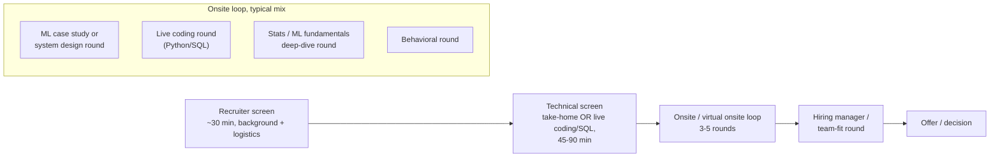

# Mock Interview Rehearsal & Progress Tracker

This is the last file in the kit, and it's a different kind of file from the other 19. Files 01-14, 17, 18, and 19 are **reference material** — theory, derivations, Q&A, code, and case-study answers to read and re-read. This file is not something you read once; it's a tool you come back to repeatedly, starting about a week before your interview, to (1) rehearse the material *out loud under time pressure* instead of just reading it, and (2) track, honestly, which parts of the kit you've actually internalized versus which parts you've only skimmed.

---

## Part 1 — Mock Interview Rehearsal

**The core insight:** reading a system design write-up or a well-phrased answer is a completely different skill from producing one out loud, from scratch, with a clock running and someone watching your face for hesitation. You can read file 14's fraud-detection design three times and nod along at every section, and still freeze up when a live interviewer says "design a fraud detection system" and stares at you expectantly. The only fix is rehearsal reps that force retrieval and production, not recognition. Everything below turns this kit's reference material into drills that do that.

A practical note on format: all four drills below work solo (talk to an empty room, or record a voice memo and play it back — you will wince, that's the point) or with a partner (a friend, a study buddy, another candidate) who reads the prompt and plays interviewer. Partner mode is strictly better because it adds unpredictability (follow-up questions you didn't script), but solo mode with a timer is good enough and is infinitely more available.

### 1. System design rehearsal drill

**Protocol (35-40 minutes total, use a real timer):**

1. **Pick a prompt (1 min).** Draw from file 14 (the 6 worked system designs — forecasting, fraud, recsys, attribution, RAG chatbot, ad-budget bandits) or file 19 (case studies B1-B7, D1-D3, and the ambiguous "what would you do" prompts in section F double well as system-design springboards). Pick one you haven't just read, or better, have someone else pick for you so you can't pattern-match from memory of the page layout.
2. **Clarifying questions — ~5 minutes.** State out loud what you think the objective is, then ask 3-5 clarifying questions (scale, latency budget, what data exists today, what "success" means, real-time vs batch). Do not start designing yet.
3. **Structured design — ~25 minutes.** Talk continuously. Cover: problem framing → data/features → baseline model → chosen model → training/validation strategy → deployment architecture → monitoring/retraining → (if time) scaling and failure modes. Sketch a diagram (boxes and arrows on paper, a whiteboard app, or even just narrated structure like "three stages: ingestion, serving, feedback") — do not deliver 25 minutes of unstructured prose.
4. **Follow-up questions — ~5-10 minutes.** Have your partner (or your own second pass, playing devil's advocate) push on: "what if traffic 10x's?", "what if the model degrades silently?", "how would you know if this feature actually helped?"
5. **Self-grade immediately, before you forget what you said**, using the rubric below.

**Rubric — score each item 0 (missed) / 1 (mentioned but shallow) / 2 (addressed concretely):**

| # | Item | 0 / 1 / 2 |
|---|------|:---:|
| 1 | Clarified the objective/scope before designing anything (didn't jump straight to model choice) | |
| 2 | Stated assumptions explicitly (scale, latency, data availability) rather than silently assuming them | |
| 3 | Proposed a simple baseline before the complex solution | |
| 4 | Addressed data/feature engineering concretely (not just "we'd use relevant features") | |
| 5 | Addressed evaluation — **both** offline (metrics, validation scheme) **and** online (A/B test, guardrail metrics) | |
| 6 | Addressed deployment architecture concretely (batch vs real-time, specific serving pattern) — not just "we deploy it" | |
| 7 | Addressed monitoring, drift detection, and a retraining trigger/cadence | |
| 8 | Addressed scaling and failure modes when prompted (didn't go blank under follow-up pressure) | |
| 9 | Managed time — didn't spend 30 of 35-40 minutes on clarifying questions or on one section | |
| 10 | Used a diagram or explicit structure (numbered stages, boxes/arrows) rather than a wall of spoken prose | |

**Scoring:** sum out of 20.
- **16-20 = ready.** You'd pass this round; keep this prompt in rotation for variety, move to a new one.
- **10-15 = solid but has gaps.** Note which 2-3 rubric items scored 0-1, re-drill the same prompt in 2-3 days after reviewing that specific gap in file 14's framework section.
- **< 10 = needs more reps.** Re-read file 14's general framework section, then redo this exact prompt within 24 hours before moving to a new one.

Log your score in the Part 3 tracker under file 14 and file 19.

### 2. Technical Q&A rapid-fire drill

Files 01-14 each end with an **"Additional Common Interview Questions"** section, and several (04, 05, 06) also have a **"Popular Questions — Full Answers"** section plus inline **"Interview angle"** callouts scattered through the body. This drill turns that scattered Q&A into a retrieval-practice deck.

**Protocol:**

1. Open one file. Cover the answer text with your hand, a sticky note, or a second window — read **only** the question.
2. Give yourself **90 seconds** to answer out loud, unaided, as if an interviewer just asked you this live.
3. Uncover the written answer and self-grade:
   - **Pass** — you covered the key structure and the "why," even if your wording differed.
   - **Partial** — you got the shape right but missed a key term, tradeoff, or number.
   - **Fail** — you froze, rambled, or gave a materially wrong answer.
4. Move to the next question in the file. Don't stop to fix a partial/fail mid-run — note it and keep going, then circle back after finishing the file.
5. A file is "cleared" when every question in it scores pass on a clean run (no partials). Re-run cleared files periodically (see Part 4) since retrieval fades.

Track misses (which specific questions were partial/fail, and on which attempt they finally passed) in the Part 3 tracker so you know exactly what to re-drill instead of re-reading whole files blind.

### 3. Coding/whiteboard rehearsal drill

File 18's Part 4 (coding exercises) and Part 5 (whiteboard/algorithm exercises) are meant to be *attempted*, not read.

**Protocol:**

1. Open a blank editor or blank text file — no reference material, no provided solution visible.
2. Read only the exercise prompt. Set a timer for **15-20 minutes per exercise**.
3. Write the actual code (or actual pseudocode/SQL, for whiteboard-style problems) from scratch within the time box. Talk through your approach out loud as you go, the same way you would in a live screen.
4. When the timer ends (or you finish early), **stop typing**, then compare against the provided solution.
5. Note the gap: did you miss an edge case, use a less efficient approach, get the syntax wrong under pressure, or run out of time mid-solution? These are different failure modes needing different fixes (edge cases → re-read the problem statement more carefully next time; efficiency → review the solution's complexity discussion; syntax → drill that language construct in isolation; time management → practice writing faster / typing the skeleton first).

Reading a correct solution and nodding "yes, that's right, I would have done that" is not evidence you can produce it cold — the whole point of this drill is that writing code with a blank screen and a clock is measurably harder than reading code, and the only way to know you're ready is to do the harder version.

### 4. Mock case-study drill

File 19's case-study bank (sections A-F, ~29 prompts across business/product, applied ML, GenAI, forecasting/ops, experimentation, and ambiguous "what would you do" scenarios) is built for this drill specifically.

**Protocol:**

1. Pick **3 random prompts** from file 19 (literally roll a die against the numbered list, or have a partner pick, so you can't cherry-pick ones you already feel strong on).
2. For each: **2-3 minutes of silent structuring time** — write bullet points only (framework skeleton: clarify → hypotheses → data/metrics → recommendation → risks), no full sentences, no talking yet.
3. Then **talk through the full answer out loud in under 5 minutes**, using only your bullet points as a guide, as if answering live.
4. Compare against the file's given approach. Note specifically what you missed — a whole branch of the framework (e.g. you forgot to mention a guardrail metric), a specific number/benchmark, or a consideration the written answer raises that hadn't occurred to you at all.
5. Repeat with the next 2 prompts. Log the 3 prompts and outcomes in the Part 3 tracker.

---

## Part 2 — Interview Format & Logistics Primer

A short, practical primer on the mechanics around the actual content — the stuff that's easy to under-prepare for because it's not "technical."

### The typical DS / MLE / GenAI-engineer interview loop

- **Recruiter screen**: mostly logistics and motivation — why this role, comp expectations, timeline. Low technical bar, but don't coast; a recruiter's "strong yes/no" recommendation to the hiring manager matters.
- **Technical screen**: either a take-home (see below) or a live coding/SQL screen (see below). This is usually the first hard filter.
- **Onsite loop**: some combination of an ML case study or system design round (file 14 / file 19 drills above), a live coding round, a stats/ML fundamentals round (files 01-07, rapid-fire drill above), and at least one behavioral/culture round. Order and exact mix varies a lot by company size — smaller companies often compress this into 2-3 rounds, larger companies spread it across 4-5.
- **Hiring manager / team-fit round**: often the last round, lower on whiteboard technicals and higher on "how do you work," "what are you looking for," and mutual fit. Treat it as still an evaluation, not a formality.

### Take-home assignment tips

- **Read the instructions and rubric twice before writing any code.** Take-homes are frequently graded against a checklist you never see; missing an explicitly stated requirement (a specific metric, a specific deliverable format) costs more than a slightly weaker model.
- **Prioritize a working end-to-end pipeline over a partially-built sophisticated one.** A simple model that runs, is evaluated, and produces a clear result beats a half-finished neural network with no evaluation section. Get something end-to-end working first, then spend remaining time deepening it.
- **Write a short README** explaining what you built, key tradeoffs you made under the time constraint, and — importantly — what you'd do differently or next with more time. This last part signals seniority: it shows you know the difference between "done" and "good enough for the constraints given," which is exactly what a hiring manager wants to see in a real teammate.
- Respect the stated time budget. Spending triple the suggested time to over-engineer a take-home is itself a signal, and not always a good one.

### Live coding / SQL screen tips

- **Talk through your approach before typing.** State the algorithm or query structure in plain language first; this lets the interviewer redirect you before you've sunk 10 minutes into the wrong approach, and it's evaluated as its own skill (communication under pressure), not just a courtesy.
- **Ask about edge cases and expected scale before assuming.** Empty inputs? Duplicate keys? Millions of rows or hundreds? These change the right answer and asking signals rigor rather than uncertainty.
- **Test your own code with a small example before declaring done.** Trace through 1-2 concrete inputs by hand (or run it, if the environment allows) rather than eyeballing the code and asserting it's correct. Interviewers notice whether you verify your own work.

### Negotiating next steps professionally

- At the end of each round, it's normal and expected to ask about **timeline and next steps** ("what does the process look like from here, and roughly when should I expect to hear back?"). This isn't pushy — not asking can read as incuriosity.
- If you haven't heard back within the window they gave you, a **brief, polite follow-up** (one short email or message to the recruiter) is appropriate and expected — hiring processes slip constantly and a nudge is normal, not needy. Keep it short: reaffirm interest, ask for a status update, don't editorialize about the delay.

---

## Part 3 — Progress Tracker

Check off boxes as you genuinely reach each level — not aspirationally. The point of this tracker is to tell you, honestly, where the gaps still are 3 days out, so don't check a box because you skimmed the section once.

### File 01 — Statistics & Probability
- [ ] First full read-through complete
- [ ] Can derive Bayes' theorem and apply it to a brainteaser cold, out loud
- [ ] Can state all 7 core distributions and when each applies, without looking
- [ ] Drilled all "Additional Common Interview Questions" at pass level
- [ ] Quick Recall Sheet reviewed within the last 3 days

### File 02 — Hypothesis Testing & A/B Testing
- [ ] First full read-through complete
- [ ] Can walk through a full sample-size/power calculation out loud from scratch
- [ ] Can explain peeking, multiple-testing correction, and SRM without notes
- [ ] Drilled all "Additional Common Interview Questions" at pass level
- [ ] Quick Recall Sheet reviewed within the last 3 days

### File 03 — ML Fundamentals
- [ ] First full read-through complete
- [ ] Can derive the OLS closed-form solution and the logistic regression log-loss gradient on a whiteboard
- [ ] Can explain bias-variance tradeoff and L1 vs L2 vs ElasticNet with a concrete example, unaided
- [ ] Drilled all "Additional Common Interview Questions" at pass level
- [ ] Quick Recall Sheet reviewed within the last 3 days

### File 04 — Trees, Ensembles & Boosting
- [ ] First full read-through complete
- [ ] Can recite the XGBoost split-gain formula (2nd-order Taylor expansion) from memory
- [ ] Can explain GOSS and EFB (LightGBM) and why leaf-wise vs level-wise growth matters, unaided
- [ ] Drilled all "Popular Interview Questions" + "Additional Common Interview Questions" at pass level
- [ ] Quick Recall Sheet reviewed within the last 3 days

### File 05 — Other ML Algorithms
- [ ] First full read-through complete
- [ ] Can explain the SVM kernel trick and derive the margin objective, unaided
- [ ] Can compare k-means vs DBSCAN vs GMM and PCA vs t-SNE vs UMAP without notes
- [ ] Drilled all "Popular Questions" + "Additional Common Interview Questions" at pass level
- [ ] Quick Recall Sheet reviewed within the last 3 days

### File 06 — Model Evaluation & Feature Engineering
- [ ] First full read-through complete
- [ ] Can explain the SHAP deep dive (Shapley value formula, TreeSHAP intuition) from memory
- [ ] Can pick the right metric for a given business scenario (imbalanced, cost-asymmetric, ranking) on the fly
- [ ] Drilled all "Popular Questions" + "Additional Common Interview Questions" at pass level
- [ ] Quick Recall Sheet reviewed within the last 3 days

### File 07 — Time Series Forecasting
- [ ] First full read-through complete
- [ ] Can explain stationarity, ARIMA/SARIMAX order selection, and Prophet's components, unaided
- [ ] Can walk through walk-forward CV and hierarchical reconciliation out loud
- [ ] Drilled all "Additional Common Interview Questions" at pass level
- [ ] Quick Recall Sheet reviewed within the last 3 days

### File 09 — SQL, PySpark, dbt & Data Engineering
- [ ] First full read-through complete
- [ ] Can write window-function and CTE queries from a blank editor without references, correctly, under 10 minutes
- [ ] Can explain PySpark partitioning/shuffle behavior and a dbt model lineage, unaided
- [ ] Drilled all "Additional Common Interview Questions" at pass level
- [ ] Quick Recall Sheet reviewed within the last 3 days

### File 10 — MLOps & Cloud Deployment
- [ ] First full read-through complete
- [ ] Can explain the MLflow tracking/registry workflow and Docker multi-stage builds without notes
- [ ] Can explain data drift vs concept drift and describe a concrete monitoring setup
- [ ] Drilled all "Additional Common Interview Questions" at pass level
- [ ] Quick Recall Sheet reviewed within the last 3 days

### File 11 — NLP & Deep Learning Fundamentals
- [ ] First full read-through complete
- [ ] Can explain TF-IDF vs Word2Vec/GloVe/FastText tradeoffs and LSTM/GRU gating, unaided
- [ ] Can explain the pre-Transformer attention mechanism as a bridge concept to file 12
- [ ] Drilled all "Additional Common Interview Questions" at pass level
- [ ] Quick Recall Sheet reviewed within the last 3 days

### File 12 — GenAI, LLMs & Transformers
- [ ] First full read-through complete
- [ ] Can derive scaled dot-product self-attention and explain multi-head attention on a whiteboard
- [ ] Can explain LoRA/QLoRA, RLHF vs DPO, and RoPE/ALiBi context extrapolation from memory
- [ ] Drilled all "Additional Common Interview Questions" at pass level
- [ ] Quick Recall Sheet reviewed within the last 3 days

### File 13 — RAG, Agents & LLM Systems
- [ ] First full read-through complete
- [ ] Can explain chunking strategy tradeoffs, hybrid search/reranking, and RAG failure modes without notes
- [ ] Can explain LangGraph state graphs and multi-agent orchestration patterns, unaided
- [ ] Drilled all "Additional Common Interview Questions" at pass level
- [ ] Quick Recall Sheet reviewed within the last 3 days

### File 14 — ML System Design
- [ ] First full read-through complete
- [ ] Ran the System Design Rehearsal Drill (Part 1.1) on at least 3 of the 6 worked designs, scoring 16+/20
- [ ] Can state the General Framework from memory without opening the file
- [ ] Comfortable improvising a 7th design (not in the file) using the same framework
- [ ] Quick Recall Sheet reviewed within the last 3 days

### File 17 — Active Recall Flashcards
- [ ] First full pass through the whole deck complete
- [ ] Every card has been drilled at least twice
- [ ] Cards missed on the last pass are flagged and isolated into a "weak deck"
- [ ] Weak deck re-drilled until every card passes twice in a row

### File 18 — Practice Problems / Code
- [ ] Part 4 (coding exercises): attempted all, blank-editor + timer, before viewing solutions
- [ ] Part 4: re-attempted every exercise that wasn't solved cleanly the first time
- [ ] Part 5 (whiteboard/algorithm exercises): attempted all, blank-editor + timer, before viewing solutions
- [ ] Part 5: re-attempted every exercise that wasn't solved cleanly the first time

### File 19 — Case Studies & Applied Use-Case Bank
- [ ] First full read-through complete
- [ ] Ran the Mock Case-Study Drill (Part 1.4) on at least 9 of the ~29 prompts (3 sessions)
- [ ] Drilled at least one prompt from every section (A-F)
- [ ] Comfortable structuring a brand-new, unseen ambiguous prompt using the same framework in under 3 minutes

### Summary tracker

| # | File | Topic | Status |
|---|------|-------|--------|
| 01 | Statistics & Probability | Distributions, Bayes, CLT/LLN, biases | ☐ Not started / ☐ In progress / ☐ Drilled |
| 02 | Hypothesis Testing & A/B Testing | Testing, power, A/B deep dive | ☐ Not started / ☐ In progress / ☐ Drilled |
| 03 | ML Fundamentals | Bias-variance, regularization, linear/logistic regression | ☐ Not started / ☐ In progress / ☐ Drilled |
| 04 | Trees, Ensembles & Boosting | RF, XGBoost/LightGBM internals | ☐ Not started / ☐ In progress / ☐ Drilled |
| 05 | Other ML Algorithms | SVM, k-NN, Naive Bayes, clustering, PCA/t-SNE/UMAP | ☐ Not started / ☐ In progress / ☐ Drilled |
| 06 | Model Evaluation & Feature Engineering | Metrics, calibration, CV, imbalance, SHAP | ☐ Not started / ☐ In progress / ☐ Drilled |
| 07 | Time Series Forecasting | ARIMA/SARIMAX, Prophet, ML/DL forecasting | ☐ Not started / ☐ In progress / ☐ Drilled |
| 09 | SQL, PySpark, dbt & Data Engineering | Joins, window fns, Spark, dbt, pipelines | ☐ Not started / ☐ In progress / ☐ Drilled |
| 10 | MLOps & Cloud Deployment | MLflow, serving, Docker, CI/CD, drift, AWS/GCP | ☐ Not started / ☐ In progress / ☐ Drilled |
| 11 | NLP & Deep Learning Fundamentals | Embeddings, RNN/LSTM/GRU, attention | ☐ Not started / ☐ In progress / ☐ Drilled |
| 12 | GenAI, LLMs & Transformers | Self-attention, PEFT, RLHF/DPO, scaling laws | ☐ Not started / ☐ In progress / ☐ Drilled |
| 13 | RAG, Agents & LLM Systems | RAG, LangChain/LangGraph, agent eval | ☐ Not started / ☐ In progress / ☐ Drilled |
| 14 | ML System Design | Framework + 6 worked designs | ☐ Not started / ☐ In progress / ☐ Drilled |
| 17 | Active Recall Flashcards | Full-kit flashcard deck | ☐ Not started / ☐ In progress / ☐ Drilled |
| 18 | Practice Problems / Code | Coding + whiteboard exercises | ☐ Not started / ☐ In progress / ☐ Drilled |
| 19 | Case Studies & Applied Use-Case Bank | ~29 business/ML/GenAI/ops/experimentation prompts | ☐ Not started / ☐ In progress / ☐ Drilled |

---

## Part 4 — T-Minus Countdown

This is a multi-day **taper schedule** — it's about *when* to do what over the final week, distinct from file 16's Part 3, which is a same-morning walk-in-the-door checklist. Use this section to pace yourself across the days leading up to the interview; use file 16 only on the day itself.

### T-minus 1 week
- Finish the first full read-through pass of every file you haven't yet covered.
- Run the Part 3 tracker honestly and identify your **weakest 2-3 files** — the ones with the fewest boxes checked or the lowest rehearsal scores. These get disproportionate attention over the next week; everything else just needs maintenance.

### T-minus 3 days
- Drill the full file 17 flashcard deck end to end; isolate a "weak deck" of anything missed.
- Run the Technical Q&A Rapid-Fire Drill (Part 1.2) specifically on your 2-3 weakest files until they clear.

### T-minus 1 day
- Run one full System Design Rehearsal Drill (Part 1.1) and one full Mock Case-Study Drill (Part 1.4).
- Do not cram new material today — consolidate, don't expand. Stop studying at a reasonable hour and sleep well; a tired brain under-performs on live retrieval far more than one extra hour of review helps.

### Morning of
- Skim file 16 (the quickfire cram sheet) only — this is not the day to re-read full derivations.
- Skim your flagged flashcard misses one more time.
- Review your project narratives and behavioral stories (files 08/15 if present in your kit) so they're fresh and specific, not generic.
- Arrive (or join the call) **5 minutes early** — not 20, not late. Use any earlier free time to breathe, not to cram further.
