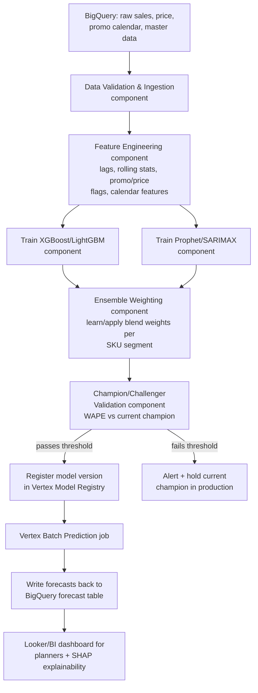
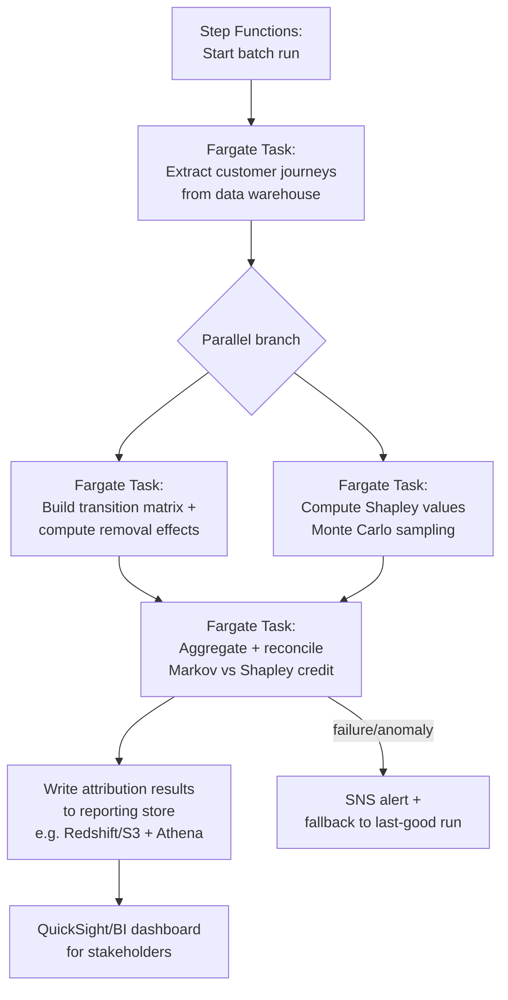

# Project Deep Dives — Defending Your Resume Under Cross-Examination

This file is different from the rest of the kit. The other files build general ML/DS theory; this one is **interview-defense prep for three specific resume projects** — demand forecasting, multi-touch attribution, and RL-based inventory optimization. A senior interviewer probing these projects is not testing whether you can define XGBoost — they're testing whether *you* built this, whether you understand the tradeoffs you made, and whether you can defend the numbers on your resume under mild hostility ("why not just use one model?", "how do you know that 7% is real and not a backtest artifact?", "walk me through what happens if BigQuery is down at 2am").

**How to use this file.** The exact internal details of what you built two years ago at Nagarro are not something an external prep document can know. What follows is a **strong, internally-consistent, technically defensible narrative template** for each project — the kind of answer a senior candidate with this exact resume line *would* plausibly give if they built it well. Read every answer as "here is how I would explain and justify this decision," not as a transcript of what definitely happened. Before the interview, go through each Q&A and swap in your actual specifics (the real tool version, the real number, the real edge case that bit you) wherever your memory differs from the template — the reasoning structure and the honest tradeoffs are the reusable part; the surface details are yours to personalize. If asked something you genuinely don't remember the exact number for, it is always safer to say "directionally it was in this range, let me reason through why" than to invent false precision — interviewers respect a candidate who reasons from principles over one who recites a memorized script and can't survive a follow-up.

## Table of Contents

1. [Project 1 — Demand Forecasting (Retail/Cosmetics)](#1-project-1--demand-forecasting-retailcosmetics)
   - 1.1 [Framing](#11-framing)
   - 1.2 [Why an ensemble of XGBoost/LightGBM + Prophet/SARIMAX?](#12-why-an-ensemble-of-xgboostlightgbm--prophetsarimax)
   - 1.3 [How was the ±5% accuracy benchmark defined and measured?](#13-how-was-the-5-accuracy-benchmark-defined-and-measured)
   - 1.4 [The Vertex AI pipeline architecture](#14-the-vertex-ai-pipeline-architecture)
   - 1.5 [BigQuery-based retraining — triggers, scheduling, staleness](#15-bigquery-based-retraining--triggers-scheduling-staleness)
   - 1.6 [SHAP analysis — what drivers surfaced and what changed](#16-shap-analysis--what-drivers-surfaced-and-what-changed)
   - 1.7 [Scaling to thousands of SKUs](#17-scaling-to-thousands-of-skus)
   - 1.8 [What you'd improve if starting over](#18-what-youd-improve-if-starting-over)
2. [Project 2 — Multi-Touch Attribution (Advertising/Telecom)](#2-project-2--multi-touch-attribution-advertisingtelecom)
   - 2.1 [Framing](#21-framing)
   - 2.2 [Markov chain attribution and the removal effect](#22-markov-chain-attribution-and-the-removal-effect)
   - 2.3 [Shapley value attribution and its computational cost](#23-shapley-value-attribution-and-its-computational-cost)
   - 2.4 [Why not last-click/first-click/linear attribution?](#24-why-not-last-clickfirst-clicklinear-attribution)
   - 2.5 [AWS architecture — ECS, Fargate, Step Functions](#25-aws-architecture--ecs-fargate-step-functions)
   - 2.6 [How were attribution outputs validated?](#26-how-were-attribution-outputs-validated)
   - 2.7 [Business impact — quantifying buy-in and actionability](#27-business-impact--quantifying-buy-in-and-actionability)
3. [Project 3 — Inventory Optimization (Supply Chain/RL)](#3-project-3--inventory-optimization-supply-chainrl)
   - 3.1 [Framing](#31-framing)
   - 3.2 [The MDP formulation](#32-the-mdp-formulation)
   - 3.3 [Why PPO (Stable Baselines3)?](#33-why-ppo-stable-baselines3)
   - 3.4 [Simulation environment design](#34-simulation-environment-design)
   - 3.5 [Validating the 7% holding-cost reduction and $5k/week savings](#35-validating-the-7-holding-cost-reduction-and-5kweek-savings)
   - 3.6 [SageMaker deployment and QuickSight monitoring](#36-sagemaker-deployment-and-quicksight-monitoring)
   - 3.7 [RL-specific challenges](#37-rl-specific-challenges)
4. [General Project-Defense Questions](#4-general-project-defense-questions)
5. [Quick Recall Sheet](#quick-recall-sheet)

---

## 1. Project 1 — Demand Forecasting (Retail/Cosmetics)

### 1.1 Framing

The project: build an automated demand forecasting system for a cosmetics/retail client, forecasting SKU-level (or SKU-location-week) demand across thousands of items, replacing a manual/spreadsheet-driven planning process. The system combined a weighted ensemble of gradient-boosted trees (XGBoost/LightGBM) with classical time-series models (Prophet/SARIMAX), ran as an automated pipeline on GCP Vertex AI with BigQuery as the data backbone, used SHAP to explain drivers to planning/merchandising stakeholders, and was benchmarked against a ±5% accuracy target versus the prior manual process.

### 1.2 Why an ensemble of XGBoost/LightGBM + Prophet/SARIMAX?

> **Q: Why combine tree models with classical time-series models instead of just picking the single best-performing one?**

The honest answer is that "best-performing on average" and "best on every SKU in every regime" are different things, and a demand forecasting portfolio spanning thousands of SKUs never has a single model that dominates everywhere — so the ensemble is a deliberate variance-reduction and blind-spot-hedging decision, not indecision.

Tree-based models (XGBoost/LightGBM) are excellent at capturing **non-linear, cross-feature interactions**: how a promotional flag interacts with price elasticity, how a price cut's effect differs by category or by whether a competing SKU is simultaneously on promotion, how day-of-week effects compound with a holiday flag. Because they split on arbitrary combinations of features, they naturally model these interactions without you having to hand-specify them — which matters a lot in retail, where promo/price/cannibalization effects are exactly the kind of nonlinear interaction that a linear or additive classical model has to be told about explicitly (interaction terms) rather than discovering on its own. Their weakness is that they don't inherently understand *time* — a plain GBM has no built-in notion of trend continuation or seasonal periodicity unless you engineer lag features, rolling averages, and calendar features to expose that structure, and on **short or sparse histories** (a new SKU with 20 weeks of data) they can overfit to noise because there isn't enough data for the tree to learn a reliable interaction pattern.

Prophet and SARIMAX are the complementary case. They are explicitly parameterized around trend + seasonality + calendar effects (SARIMAX additionally through its seasonal AR/MA/differencing terms, Prophet through additive trend changepoints + Fourier seasonal terms + holiday regressors), so they are **robust with much less data** and degrade gracefully — they don't need to statistically "discover" that December has a demand spike, they can be told, and they extrapolate a trend/seasonal pattern sensibly even for a short history. Their weakness is the mirror image: they don't naturally capture the nonlinear cross-feature promo/price/cannibalization interactions that the tree model handles well, and multivariate exogenous effects have to be added as regressors (SARIMAX's exogenous terms, Prophet's extra regressors) in a comparatively rigid, largely additive way.

Putting these together as a **weighted ensemble** (rather than a strict either/or) gives two concrete benefits I'd defend to a skeptical interviewer:

1. **Error variance reduction.** If the two model families' errors are not perfectly correlated (which they typically aren't — a tree model and an ARIMA-family model fail in different, largely uncorrelated ways, one on data-interaction structure, the other on decomposition assumptions), a weighted average of their forecasts has *strictly lower variance* than either model alone, for the classic reason that $\text{Var}(wX + (1-w)Y) = w^2\text{Var}(X) + (1-w)^2\text{Var}(Y) + 2w(1-w)\text{Cov}(X,Y)$ is minimized below $\min(\text{Var}(X), \text{Var}(Y))$ whenever $\text{Cov}(X,Y)$ is not perfectly positive.
2. **Blind-spot hedging.** For any individual SKU-week, if the tree model is currently mis-specified (e.g., a genuinely novel promo combination it hasn't seen), the classical model's trend/seasonal baseline anchors the forecast from swinging too far; conversely, if a classical model's seasonal assumption breaks (a one-off event, a stockout distorting the recent trend), the tree model's feature-driven view corrects it.

In practice, the weighting was **not a fixed 50/50** — it was learned or tuned (e.g., an out-of-time validation-set-optimized weight, potentially varying by SKU segment/category, or a simple inverse-error weighting scheme where each model's weight is proportional to its recent validation-window accuracy) so that categories with rich promo/price history leaned more on the tree model and cold-start/low-volume SKUs leaned more on the classical component. I'd be upfront in an interview that a straightforward weighted average is a defensible first cut, and that a natural evolution (see 1.8) is a proper stacked/meta-learner ensemble that learns the weighting function itself.

### 1.3 How was the ±5% accuracy benchmark defined and measured?

> **Q: What does "±5% accuracy" actually mean here — accuracy of what, measured how?**

"±5% accuracy" as a headline number needs a precise metric definition to survive scrutiny, and the metric I'd defend using is **WAPE (Weighted Absolute Percentage Error)**, sometimes called weighted MAPE, computed at an appropriate aggregation level, rather than a naive per-SKU MAPE.

$$
\text{WAPE} = \frac{\sum_{i} |y_i - \hat{y}_i|}{\sum_i |y_i|}
$$

The reason WAPE over plain MAPE ($\frac{1}{n}\sum_i \frac{|y_i - \hat y_i|}{|y_i|}$) matters a lot here: MAPE is undefined/explodes for SKU-weeks with near-zero or zero actual demand — extremely common in a long-tail SKU catalog — and a handful of low-volume SKUs with huge percentage errors can dominate and distort an unweighted average, giving a misleadingly bad (or, if you exclude them, misleadingly good) headline number. WAPE instead weights each error by its actual demand volume, so the metric is naturally dominated by high-volume, business-relevant SKUs and isn't destabilized by low-volume noise — which is exactly the property you want when the business question is "how far off are we in aggregate revenue/units," not "what's the average percentage miss treating a 2-unit SKU the same as a 2,000-unit SKU."

The ±5% tolerance band itself I'd frame as: the forecast is considered "within accuracy target" for a given rollup (SKU-category-week, or total-week) if $1 - \text{WAPE} \geq 95\%$ (i.e., WAPE $\leq 5\%$) at that aggregation level, tracked as a **rolling accuracy metric** — computed per SKU-week at the finest grain, then rolled up to category/region/total to report against the target, because a single-SKU-week miss is expected noise but a systematic category-level miss is a real signal. I'd also track this against the **prior manual forecasting process's own historical error rate** as the baseline comparison, since "±5%" is only meaningful relative to what it replaced — the deliverable claim isn't "the model is perfect," it's "the model materially beats the manual baseline and lands within a tolerance band the business considers actionable for replenishment planning."

Operationally, this was computed on a rolling basis (e.g., weekly, as actuals landed) with a dashboard tracking WAPE trend by category and flagging categories/SKU-groups that breached the band for two or more consecutive periods — which is the practical staleness/degradation signal that feeds into the retraining and monitoring story in the next section.

### 1.4 The Vertex AI pipeline architecture

> **Q: Walk me through the actual automated pipeline — what replaced the manual process end to end?**

The manual process being replaced was, realistically, planners pulling data into spreadsheets, running ad hoc statistical rules of thumb or last-year's-numbers-plus-uplift heuristics, and manually re-running this every planning cycle with no versioning, no reproducibility, and no systematic feature engineering. The automation goal was to make the entire forecast-generation cycle a **scheduled, reproducible, monitored pipeline** with no manual intervention required for a normal run.

I'd describe the pipeline as a **Vertex AI Pipelines** (Kubeflow-Pipelines-based) DAG, structured as:

Walking through the components in defensible detail:

- **Ingestion/validation**: pulls sales history, price, promo calendar, and product master data directly from BigQuery, with schema and basic data-quality checks (nulls, negative quantities, duplicate SKU-week rows) gating the pipeline from proceeding on bad data — this is the piece that most manual processes skip and that causes silent garbage-in-garbage-out forecasts.
- **Feature engineering component**: a containerized step generating lag features, rolling means/std at multiple windows, promo/price flags and elasticity proxies, calendar features (day-of-week, holiday, month), and (per 1.6) any weather or cannibalization features — written as a reusable component so the exact same transformation logic runs at training and at batch-prediction time, avoiding train/serve skew.
- **Parallel training components**: XGBoost/LightGBM and Prophet/SARIMAX trained as separate Vertex custom-training-job components, run in parallel since they're independent, each logging metrics (per-SKU/category validation WAPE) to Vertex Experiments for comparison.
- **Ensemble/weighting component**: combines the two models' predictions using the learned or tuned blend weights (per 1.2), producing the final ensemble forecast.
- **Champion/challenger validation component**: compares the new candidate pipeline's ensemble forecast against the currently-deployed champion model on a held-out recent window, and only promotes the challenger if it beats the champion's WAPE by a meaningful margin (not just noise) — this is the safety gate that prevents a bad retrain from silently degrading production forecasts.
- **Vertex Model Registry**: registers the promoted model version with lineage back to the exact pipeline run, training data snapshot, and hyperparameters — giving reproducibility and rollback capability (see Section 4's rollback question).
- **Batch prediction + write-back**: since retail demand forecasting is inherently a batch (not real-time) prediction problem — forecasts are generated for the next N weeks on a schedule, not per-request — Vertex Batch Prediction runs the registered model over the current feature set and writes results back to a BigQuery forecast table, from which planners' dashboards and downstream replenishment/inventory systems (including Project 3) consume the numbers.

The core interview-defensible point of this architecture: it converts what used to be a person's manual judgment call, repeated every cycle with no audit trail, into a **versioned, reproducible, gated, monitored** system — every forecast can be traced back to an exact model version, training data snapshot, and validation result, and a bad model version cannot reach production without beating the current champion on held-out data first.

### 1.5 BigQuery-based retraining — trigger mechanism, scheduling, monitoring for staleness

> **Q: How does retraining actually get triggered, and how do you know when a model has gone stale?**

I'd describe two complementary trigger mechanisms rather than relying on just one, because a purely time-based schedule can retrain on stale/incomplete data, and a purely event-based trigger can fire too often or on noisy small deltas:

- **Scheduled cadence**: a Cloud Scheduler job (e.g., weekly, aligned to the retail planning cycle) invokes a Cloud Function/Cloud Run endpoint that kicks off a new Vertex Pipeline run once fresh actuals for the prior week have landed in BigQuery. This is the primary, predictable retraining rhythm — you don't want tree-based demand models retraining on every single new row given how noisy day-level retail data can be, but you also don't want them going stale for months.
- **Event-driven triggers** as a secondary/exception mechanism: e.g., BigQuery scheduled queries or Pub/Sub notifications on new promo-calendar uploads (a major upcoming promotion is exactly the kind of event that justifies retraining out-of-cycle, since promo effects are a first-class driver per Section 1.6) can trigger an out-of-band pipeline run rather than waiting for the next scheduled cycle.

**Staleness monitoring** is the piece that actually catches degradation between retrains, and I'd frame it as tracking three signals continuously, not just "days since last retrain":

1. **Days-since-last-successful-retrain**, alerted if it exceeds an SLA (e.g., >10 days for a weekly-cadence pipeline signals a broken scheduler or a repeatedly-failing champion/challenger gate).
2. **Rolling WAPE drift** (from 1.3) — a sustained upward trend in rolling WAPE at the category level, even between scheduled retrains, is the direct symptom of a model going stale relative to a changing demand pattern.
3. **Feature/input drift** — comparing the distribution of key input features (price points, promo frequency, recent-demand-level) in the current scoring window against the training distribution (e.g., population stability index or a simple KS-test on key features) to catch out-of-distribution conditions *before* they show up as forecast error — a new competitor promo cadence or a supply shock changing typical order sizes is exactly the kind of shift this catches early.

The retraining trigger and the champion/challenger gate from 1.4 work together: retraining fires on a cadence or an event, but a new model only actually reaches production if it passes validation, so staleness monitoring is really answering "is the *current production model* still good enough," independent of whether a retrain has technically run recently.

### 1.6 SHAP analysis — what drivers surfaced and what changed

> **Q: What did SHAP actually tell you that you didn't already know, and what changed because of it?**

The value of SHAP here wasn't discovering demand drivers no one suspected — planners already had intuitions about price and promos — it was making those effects **quantified, per-SKU, and directionally explicit** in a way that turned a vague intuition into an actionable, defensible number, and occasionally surfacing an effect that was underweighted or mis-estimated by manual judgment.

Concretely, the drivers a SHAP summary/beeswarm plot would plausibly surface as top contributors on the tree-model component:

- **Price and promotional lift**: SHAP dependence plots showing the marginal effect of a promo-discount-depth feature on predicted demand — e.g., a clearly nonlinear, saturating lift curve where discount depth beyond a certain threshold stops producing proportional extra lift — which is exactly the kind of nonlinearity a tree model captures well and a SHAP dependence plot makes visible and quantifiable (e.g., "a 20% discount lifts unit demand ~1.6x, but a 30% discount only lifts it ~1.75x," directly informing whether deeper discounting is worth the margin hit).
- **Day-of-week / calendar seasonality**: weekend and pre-holiday effects showing up as consistently high-magnitude SHAP contributions, cross-checked against the classical model's own seasonal decomposition.
- **Weather** (for weather-sensitive categories, e.g., sunscreen/skincare lines in a cosmetics portfolio): a temperature or seasonal-proxy feature showing meaningfully positive SHAP contributions for specific sub-categories — a driver a purely manual process would likely bake into a rough seasonal multiplier rather than quantify per-SKU.
- **Cannibalization from related SKUs**: a feature capturing a related/substitute SKU's own promo status showing a *negative* SHAP contribution on the focal SKU's forecast when the substitute is heavily promoted — directly surfacing cross-SKU cannibalization, which manual spreadsheet processes routinely miss because they forecast SKU-by-SKU in isolation.

The stakeholder-facing change this produced: presenting SHAP dependence plots to merchandising/planning stakeholders reframed a promo-calendar or pricing conversation from "the model says X units, trust it" (which invites skepticism, correctly) to "here is exactly why the model says X — this promo depth's marginal lift has been diminishing, and this related-SKU cannibalization is being double-counted in your current promo calendar" — which is a fundamentally more persuasive and auditable argument, and it's the kind of concrete example I'd use to answer the general "how did you get stakeholder buy-in" question in Section 4: the SHAP explanation *was* the buy-in mechanism, not a black-box number stakeholders had to trust on faith.

### 1.7 Scaling to thousands of SKUs

> **Q: Thousands of SKUs — are you training a separate model per SKU? What does that cost, and how do you manage it?**

This is the classic **global vs. local modeling tradeoff**, and the honest, defensible position is that a strict per-SKU ("local") model for every one of thousands of SKUs is usually the wrong default at this scale, for both cost and statistical reasons, so the practical design leaned toward **grouped/semi-global models** with local components only where justified.

Arguments against pure per-SKU local models at scale:

- **Compute/orchestration cost**: training, validating, versioning, and monitoring thousands of independent models multiplies infrastructure cost and pipeline complexity roughly linearly (or worse, given per-model overhead) — thousands of Vertex Model Registry entries, thousands of champion/challenger comparisons every retrain cycle, thousands of potential silent failure points.
- **Statistical inefficiency for low-volume SKUs**: a long-tail SKU with sparse history simply doesn't have enough data to fit a reliable local model — a per-SKU tree model on 20 weeks of data overfits noise, whereas a **grouped model** (trained across a category or cluster of similar SKUs, with SKU-ID as a categorical feature) can borrow statistical strength across similar items, learning a shared promo-elasticity or seasonality pattern from the category's collective history and applying it (adjusted by SKU-level features) even to a newer or lower-volume SKU.

Arguments *for* some degree of localization: a small number of very high-volume, structurally distinct "hero" SKUs (or SKU groups with genuinely different demand dynamics — e.g., a giftset category with extreme, unique seasonal spikes vs. everyday-use products) can justify their own dedicated model or at least their own hyperparameter tuning, because forcing them into a shared global model risks the global model being pulled toward the "average" behavior and underfitting their genuinely distinct pattern.

The practical resolution I'd describe: a **hierarchical/grouped modeling scheme** — cluster SKUs into a manageable number of groups (by category, price tier, and demand-volume/volatility profile), train one XGBoost/LightGBM model per group (with SKU-ID, category, and SKU-level static features as inputs so the model still differentiates within the group) rather than one model per SKU, reserving fully dedicated models only for the handful of SKUs with genuinely unique dynamics and enough volume to justify it. This reduces the number of models from "thousands" to a manageable few dozen-to-low-hundreds, which is directly tractable for the Vertex Model Registry/versioning and champion-challenger infrastructure in 1.4, while still getting most of the accuracy benefit of localization through the categorical/hierarchical features.

Cost-wise, I'd frame the tradeoff explicitly: a smaller number of grouped models means lower training compute cost, lower registry/versioning overhead, and lower monitoring burden, at the cost of some accuracy give-up on SKUs whose dynamics genuinely diverge from their group's average — and the mitigation for that give-up is making sure the grouping/clustering itself is done thoughtfully (e.g., via a demand-volatility or category taxonomy that actually reflects distinct behavior) rather than an arbitrary bucket, plus monitoring per-SKU WAPE (not just per-group WAPE) so a systematically underperforming SKU within a group can be flagged and escalated to its own model if it's high-value enough to justify it.

### 1.8 What you'd improve if starting over today

> **Q: With hindsight and current tooling, what would you change?**

Four concrete, defensible improvements, ordered roughly by expected impact:

1. **A global deep-learning architecture for cross-SKU learning** — specifically something like **Temporal Fusion Transformer (TFT)** or **DeepAR**, trained once across the *entire* SKU portfolio rather than per-group. These architectures are explicitly designed to learn shared temporal patterns and cross-series structure (via shared embeddings/attention over related series) while still producing per-SKU forecasts with proper probabilistic outputs (quantile forecasts, not just point estimates) — which would meaningfully improve cold-start/low-volume SKU forecasts (today's biggest weak point in the grouped-XGBoost approach) by learning transferable seasonal/promo-response patterns directly from data-rich SKUs and applying them to sparse ones, rather than relying on a coarser manual clustering scheme.
2. **More automated, systematic hyperparameter tuning** — e.g., Vertex AI Vizier-based Bayesian optimization integrated as a pipeline component, run periodically (not just once at initial build) to catch hyperparameter staleness as the underlying data distribution shifts over the product lifecycle, rather than hyperparameters set once and left largely static.
3. **Tighter, more automated drift monitoring** — moving beyond the WAPE-trend/PSI checks in 1.5 toward a dedicated feature-store-integrated drift monitoring service (e.g., Vertex AI Model Monitoring) with automatic alerting thresholds tuned per category, plus explicit **concept drift** detection (not just input/feature drift) — tracking whether the *relationship* between features and demand is shifting, which a pure feature-distribution check can miss.
4. **More rigorous causal/incrementality validation of promo effects** — the SHAP-surfaced promo lift numbers in 1.6 are *correlational* (the model's learned association between promo flag and demand), not a causally validated incremental lift. A more rigorous version would validate promo elasticity estimates against actual **geo-holdout or randomized promo experiments** where available (test some stores/regions without the promo as a control), which is the same causal-inference discipline the attribution project (Project 2, Section 2.6) uses for validating channel effects — and it's a good moment in an interview to connect the two projects: both ultimately needed some causal grounding beyond a purely predictive/associative model, and that's a principle I'd carry forward, not a gap unique to one project.

---

## 2. Project 2 — Multi-Touch Attribution (Advertising/Telecom)

### 2.1 Framing

The project: build a multi-touch attribution (MTA) system to fairly credit conversions (a telecom sign-up, a plan upgrade) across the multiple marketing channels a customer touched before converting — replacing simplistic last-click/first-click/linear rules with **data-driven, algorithmic attribution**: Markov chain removal-effect attribution and Shapley value attribution, computed over customer journey data, running as a batch pipeline on AWS (ECS + Fargate + Step Functions), with outputs feeding a stakeholder-facing budget-reallocation dashboard.

### 2.2 Markov chain attribution and the removal effect

> **Q: Explain exactly how the Markov chain attribution model works — the transition matrix and the removal effect calculation.**

The setup: every observed customer journey is a sequence of touchpoints across marketing channels (e.g., Display → Social → Search → **Conversion**, or Email → Display → **Null**) ending in one of two **absorbing states**: **Conversion** or **Null** (no conversion, journey ended without one). Every channel a customer can be exposed to (Display, Social, Search, Email, Affiliate, etc.) is modeled as a **transient state**, plus a **Start** state representing "journey begins here."

**Building the transition matrix.** From the full set of observed journeys, count, for every state $i$, how many times a transition from $i$ to every other state $j$ (including to Null or Conversion) occurred, then normalize each row to sum to 1:

$$
P(i \to j) = \frac{\text{count of transitions from } i \text{ to } j}{\text{total transitions out of } i}
$$

This gives a first-order Markov chain (each next-step transition probability depends only on the current channel, not the full history before it — the standard, defensible simplifying assumption; higher-order chains, conditioning on the last 2–3 touches, are a documented extension when the data supports it, addressed as a follow-up if pressed). Conversion and Null are absorbing: once reached, $P(\text{Conversion} \to \text{Conversion}) = 1$ and $P(\text{Null} \to \text{Null}) = 1$.

**Computing baseline conversion probability.** With the full transition matrix built (all channels present), you can compute the overall probability of reaching the Conversion absorbing state starting from Start — call this $P(\text{conversion})$ — either by direct simulation (Monte Carlo: simulate many random walks through the chain from Start, following the transition probabilities, and measure the fraction that end in Conversion) or analytically via absorbing Markov chain matrix algebra (partitioning the transition matrix into transient/absorbing blocks and using the fundamental matrix $N = (I - Q)^{-1}$, where $Q$ is the transient-to-transient sub-matrix, to get absorption probabilities in closed form).

**The removal effect**, precisely: for each channel $c$, remove that channel's state from the graph entirely — meaning any journey that passed through $c$ is rerouted, typically by sending transitions that would have gone to $c$ directly to Null instead (the standard "removal effect" convention: removing a channel means treating its influence as lost, not skipped-through) — and recompute the conversion probability of this modified chain, call it $P(\text{conversion} \mid c \text{ removed})$. The removal effect for channel $c$ is:

$$
\text{RE}(c) = \frac{P(\text{conversion}) - P(\text{conversion} \mid c \text{ removed})}{P(\text{conversion})}
$$

This is the fractional drop in overall conversion probability caused by removing channel $c$ — a channel whose removal causes a large drop in conversion probability is one whose presence was highly influential in driving conversions across the observed journeys. Since these raw removal effects across all channels don't necessarily sum to 1 (or to the total observed conversions), the final step **normalizes** them into attribution credit:

$$
\text{Attribution}(c) = \frac{\text{RE}(c)}{\sum_{c'} \text{RE}(c')} \times \text{Total Conversions}
$$

distributing total observed conversions across channels in proportion to their normalized removal effect — giving each channel a concrete, defensible conversion credit (and, downstream, a revenue/ROI credit) rather than an arbitrary rule-based split.

### 2.3 Shapley value attribution and its computational cost

> **Q: How does the Shapley approach differ from the Markov chain approach, and how did you make it computationally tractable?**

Shapley value attribution reframes the same problem as a **cooperative game**: channels are the "players," a journey's conversion (or its conversion value) is the "payout" being divided, and a "coalition" $S$ is any subset of channels that could co-occur in a customer's path. The Shapley value gives each channel its fair, order-averaged marginal contribution to conversion value across every possible coalition it could be part of — the same formula covered in full in the model-evaluation file's SHAP derivation (Section 7.2 there), applied here with channels as players instead of features:

$$
\phi_c = \sum_{S \subseteq C \setminus \{c\}} \frac{|S|!\,(|C| - |S| - 1)!}{|C|!} \Big[ v(S \cup \{c\}) - v(S) \Big]
$$

where $C$ is the full set of channels, and $v(S)$ is the **value function** — here, the total conversion value (or conversion count/rate) attributable to journeys/coalitions restricted to channel subset $S$ (estimated empirically from observed journey data: what conversion rate or value do journeys touching exactly the channels in $S$ achieve). $\phi_c$ is then channel $c$'s fair share of total conversion value, averaged over every possible ordering in which channels could be "added" to a coalition.

**The computational cost problem** is exactly the one flagged in the SHAP derivation: the exact formula requires evaluating $v(S)$ for every one of the $2^{|C|}$ possible channel subsets — with even a modest 10–15 marketing channels, that's 1,024–32,768+ subsets, and the number of *observed, distinct* journey-path combinations to estimate $v(S)$ reliably from data (rather than from a fitted model) grows just as fast, making brute-force enumeration intractable once the channel count is realistic for a real media mix.

Two practical approximation strategies, and I'd present both as legitimate, complementary choices depending on what the data supports:

1. **Monte Carlo sampling of random permutations**: instead of enumerating all $2^{|C|}$ subsets, sample a large number of random orderings of channels, and for each sampled ordering compute channel $c$'s marginal contribution at the point it's "added" to the coalition built up so far in that ordering, then average across samples. This converges to the true Shapley value as sample count grows, with well-understood variance/sample-size tradeoffs (larger sample size for high-cardinality channel sets, or for channels whose marginal contribution is highly ordering-dependent).
2. **Restricting to observed path combinations only**: rather than evaluating $v(S)$ for theoretical subsets that never actually occur in the data, restrict the coalition space to subsets $S$ that actually appear as (sub-paths of) real observed customer journeys, and estimate $v(S)$ directly from those journeys' empirical conversion rates. This is both a computational simplification (far fewer subsets to consider) and, arguably, a more defensible modeling choice — it avoids extrapolating conversion value for channel combinations that never actually co-occur in your market, which a brute-force enumeration over the full power set would otherwise implicitly require.

In an interview, I'd frame the choice between Markov removal-effect and Shapley as **complementary, cross-validating methods** rather than "we picked one" — Markov chain attribution is cheaper to compute and directly interpretable via the removal-effect story, while Shapley gives game-theoretically axiomatic fairness guarantees (efficiency/local accuracy, symmetry, additivity — same properties as in the SHAP derivation) at higher computational cost; running both and checking that they broadly agree on channel rank-ordering was itself a validation step (Section 2.6), and any material disagreement between the two was worth digging into rather than picking whichever one told a nicer story.

### 2.4 Why not last-click/first-click/linear attribution?

> **Q: The business already had last-click attribution. Why was that not good enough?**

Every simple heuristic rule has a **systematic, predictable bias** because it encodes an assumption about which touchpoint "matters" without actually looking at the interaction structure of the journey data:

| Heuristic | Assumption baked in | Systematic bias produced |
|---|---|---|
| **Last-click** | Only the final touch before conversion matters | Massively overvalues bottom-funnel channels (retargeting, branded search) that tend to appear right before conversion regardless of whether they *caused* it; undervalues upper-funnel awareness channels (display, social) that create initial intent but rarely get the last touch |
| **First-click** | Only the first touch matters | Overvalues broad-reach awareness/prospecting channels; ignores the touches that actually closed the conversion, can reward channels that generated low-quality/low-intent initial traffic |
| **Linear** | Every touch in the path gets equal credit | Ignores that touches plausibly differ enormously in actual influence — a channel appearing in nearly every journey (because it's high-frequency/low-cost, e.g., retargeting) gets the same per-touch credit as a channel that appears rarely but disproportionately correlates with conversion, diluting the signal for genuinely high-value channels and inflating it for merely high-frequency ones |

The deeper problem is that these rules never look at **actual co-occurrence and ordering structure** in the data at all — they apply the same fixed weighting scheme to every journey regardless of what channels were actually involved or how they interacted, which is precisely why a channel like branded search (which often appears as the last click on journeys that were really driven by an upper-funnel display or social touch earlier) gets systematically overcredited under last-click, leading directly to **budget misallocation**: over-investing in the channel that "closes" conversions while starving the channel that actually generates the demand being closed. Markov and Shapley attribution instead derive credit from the transition/co-occurrence structure and marginal-contribution structure actually present in the journey data, so a channel's credit reflects its measured influence on conversion probability/value rather than an assumption about funnel position. The tradeoff I'd acknowledge honestly: heuristic rules are trivial to compute and explain, while algorithmic attribution requires enough journey volume and channel diversity in the data to estimate transition probabilities/coalition values reliably — for a very low-traffic channel mix, a heuristic might genuinely be the more stable choice, which is worth acknowledging rather than claiming algorithmic attribution is strictly superior in every regime.

### 2.5 AWS architecture — ECS, Fargate, Step Functions

> **Q: Why this specific AWS stack, and how was the orchestration actually structured?**

Attribution computation here is a **periodic batch job** (e.g., daily or weekly recomputation over a rolling journey window), not a real-time serving workload, which directly motivates the architecture choice: you want compute that scales up for the duration of the batch job and scales to **zero** cost the rest of the time, with no persistent server to patch or manage.

- **ECS + Fargate**: Fargate is the serverless container runtime for ECS — you define the task (a Docker container running the journey-extraction / Markov-matrix / Shapley-computation logic, with pinned Python/pandas/numpy dependency versions for reproducibility) and Fargate provisions the compute only for the task's runtime, with no EC2 instances to manage or pay for when idle. This matters both for **cost** (a batch job running for an hour a day shouldn't pay for 24 hours of a provisioned instance) and for **reproducibility** — a containerized task guarantees the exact same dependency versions run every time, avoiding the classic "worked on my laptop, broke in the scheduled job" class of bug that comes from environment drift.
- **Step Functions**: orchestrates the multi-stage batch job as an explicit state machine, giving built-in retry/error-handling, parallel execution, and a visual/auditable execution history per run — valuable for a job with genuinely parallelizable independent stages (Markov and Shapley computation don't depend on each other) and clear sequential dependencies (both need journeys extracted first; both feed into a common aggregation step).

Walking the state machine: the run starts by extracting the relevant window of customer journeys from the data warehouse into a normalized journey-path format; this feeds two **parallel** Fargate tasks (Step Functions' native `Parallel` state) — one building the transition matrix and computing removal effects, the other running the Monte Carlo Shapley approximation — since neither depends on the other's output; both feed into an aggregation task that reconciles the two methods' outputs (per 2.3, checking for material rank-order disagreement) and produces the final attribution credit table; results are written to a reporting store (e.g., S3 + Athena, or Redshift) for the BI dashboard to consume. Step Functions' built-in retry policies handle transient Fargate task failures without manual intervention, and a failure path routes to an alert (SNS) plus a fallback of continuing to serve the last known-good attribution result rather than surfacing a broken/partial result to stakeholders — directly the rollback-plan discipline covered generically in Section 4.

### 2.6 How were attribution outputs validated?

> **Q: How do you know the attribution credit you're producing is actually right, and not just an artifact of the algorithm?**

Attribution is a notoriously hard thing to validate because you rarely have unambiguous ground truth for "how much did channel X actually cause this conversion" — so the validation approach has to be a **triangulation of imperfect signals** rather than a single definitive check, and I'd be upfront about that limitation rather than overclaiming certainty:

1. **Backtesting against incrementality experiments where available.** The gold standard is a **geo-holdout or randomized incrementality test** — running a channel at reduced/zero spend in a randomly selected subset of geos or audience segments while holding it constant elsewhere, and measuring the actual causal conversion lift attributable to that channel via the resulting treatment/control difference. Where such experiments existed (even for a subset of channels, e.g., a paid-search geo-holdout), the algorithmic attribution credit for that channel was checked for directional and rough-magnitude consistency against the experimentally measured incremental lift — this is the same causal-validation discipline flagged as a good-to-have in Project 1's hindsight answer (Section 1.8), and connecting the two in an interview shows the causal-inference instinct is a consistent principle, not a one-off.
2. **Directional business-intuition sanity checks.** Cross-checking attribution rank-orderings against known qualitative facts the business already had strong priors on — e.g., "does branded search still get meaningful credit even after correcting for last-click overcounting" (it should, since brand awareness driving branded search is a real effect, just not the *only* effect), or "does a channel known to be pure noise/low-quality traffic get near-zero attribution" (it should). This won't catch subtle errors but does catch a badly broken pipeline or an obviously wrong sign.
3. **Stability of channel credit across time windows.** Recomputing attribution over different, overlapping historical windows (e.g., trailing 30/60/90 days) and checking that a given channel's relative credit doesn't swing wildly between windows absent an actual known change in media mix or campaign strategy — high instability is a signal of either insufficient journey volume for reliable transition-matrix/coalition-value estimation, or genuine underlying volatility in customer behavior worth flagging to stakeholders rather than presenting a single point-in-time number as if it were stable ground truth.
4. **Cross-method agreement** (per 2.3) — Markov removal-effect and Shapley credit broadly agreeing in rank order across channels is itself a (weak but useful) consistency check, since the two methods have different mathematical bases (graph-structure-based vs. coalition-game-based) and would not be expected to agree by construction if the underlying signal weren't real.

### 2.7 Business impact — quantifying buy-in and actionable insights

> **Q: How do you actually know this drove business value, versus just being an interesting analysis?**

The honest framing: buy-in and actionability were demonstrated through a **before/after budget-reallocation loop with measured outcome**, not just the elegance of the model. Concretely, the workflow I'd defend:

1. Present the removal-effect (and Shapley) channel rankings in an **interpretable dashboard** — not raw numbers but a ranked view showing each channel's attributed conversion share/value alongside its current spend share, making the mismatch between "spend" and "attributed credit" immediately visually obvious (a channel getting 25% of attributed conversions on 10% of spend is a much more persuasive artifact than a table of Shapley values).
2. Use that mismatch to propose a **specific budget reallocation** (shift spend from an overcredited-by-last-click channel like branded retargeting toward an undercredited upper-funnel channel), sized to a concrete dollar/percentage shift stakeholders could actually action.
3. **Measure the resulting outcome** after the reallocation was implemented (even partially/as a pilot) — tracking whether overall conversion volume/ROI moved in the predicted direction over the following weeks/months, which is the actual proof point: attribution credit that *predicts* which reallocation improves outcomes is validated in a way that a purely descriptive dashboard never is.

That loop — interpretable ranking → concrete reallocation recommendation → measured post-reallocation ROI change — is the answer to "how was buy-in quantified": buy-in wasn't a one-time presentation that stakeholders nodded along to, it was demonstrated by stakeholders actually acting on the recommendation and the subsequent numbers validating the decision, which is the most defensible form of "this drove business impact" a candidate can claim.

---

## 3. Project 3 — Inventory Optimization (Supply Chain/RL)

### 3.1 Framing

The project: replace a static/heuristic inventory replenishment policy (e.g., a fixed reorder-point/reorder-quantity rule) with a **reinforcement-learning-based replenishment policy**, trained via Stable Baselines3 on a custom simulation environment modeling stock dynamics (inbound orders, outbound demand, returns), deployed via AWS SageMaker, with a QuickSight dashboard for real-time monitoring — reporting a 7% reduction in holding costs and roughly $5k/week in savings.

### 3.2 The MDP formulation

> **Q: Formalize this as an MDP — state, action, reward, transition.**

Framing inventory replenishment as an MDP means defining $(\mathcal{S}, \mathcal{A}, P, R, \gamma)$ precisely enough that the reward function's incentives can be reasoned about and defended, not just described qualitatively:

**State space $\mathcal{S}$** — at each decision epoch $t$ (e.g., daily or weekly, per SKU-location), a state vector capturing everything the policy needs to make a good replenishment decision:

$$
s_t = \big(\, I_t,\ \hat{d}_{t:t+L},\ L,\ \text{DOW}_t,\ \text{season}_t,\ O_t \,\big)
$$

where $I_t$ is current on-hand inventory level, $\hat{d}_{t:t+L}$ is the recent/forecasted demand signal over the lead-time horizon (plausibly consumed directly from Project 1's forecasting output — a natural and worth-mentioning cross-project connection), $L$ is the replenishment lead time, $\text{DOW}_t$/$\text{season}_t$ are calendar/seasonality indicators, and $O_t$ is the pipeline of outstanding orders already placed but not yet arrived (necessary so the agent doesn't double-order while inventory is already in transit).

**Action space $\mathcal{A}$** — the replenishment order quantity to place at time $t$, $a_t = q_t \in [0, q_{max}]$. This can be modeled as continuous (a `Box` action space in Gym terms) or discretized into order-quantity buckets (a `Discrete` space); I'd defend continuous as the more natural choice given order quantities are inherently a continuous decision, with the caveat that a discretized action space simplifies the algorithm choice (opens up DQN as an option, per 3.3) at the cost of coarser control.

**Reward function** — the core design decision, combining holding cost, stockout/backorder penalty, and ordering cost into a single scalar the agent maximizes (equivalently, minimizes the negative of total cost):

$$
r_t = -\Big[\, h \cdot \max(I_t, 0) \ +\ p \cdot \max(-I_t, 0) \ +\ c_o \cdot \mathbb{1}[q_t > 0] \ +\ c_v \cdot q_t \,\Big]
$$

where $h$ is the per-unit **holding cost** rate (charged on positive on-hand inventory), $p$ is the per-unit **stockout/backorder penalty** (charged when demand exceeds available inventory, i.e., $I_t < 0$ represents backorder/unmet demand), $c_o$ is a fixed **ordering cost** incurred whenever an order is placed (encouraging the agent not to place trivially small orders too frequently), and $c_v$ is a per-unit variable ordering/procurement cost. The relative magnitudes of $h$ and $p$ are the single most consequential design choice in this reward (elaborated in 3.7) — get that ratio wrong and the learned policy either hoards excess safety stock (if $p \gg h$ without bound) or tolerates unacceptable stockout frequency (if $h$ dominates).

**Transition dynamics $P$** — stochastic, driven by the simulator: $I_{t+1} = I_t + (\text{inbound arrivals at } t) - (\text{demand realized at } t) + (\text{returns at } t)$, where inbound arrivals are orders placed $L$ periods ago finally landing (lead-time-delayed), demand is drawn from a stochastic demand distribution (ideally informed by the historical/forecasted demand distribution from Project 1 rather than an arbitrary synthetic distribution), and returns are a probabilistic inflow governed by a return-rate distribution applied to recent sales — detailed further in 3.4.

**Discount factor $\gamma$**: close to but below 1 (e.g., 0.95–0.99), reflecting that near-term holding/stockout costs matter more than costs many periods away but the agent should still value avoiding a stockout a few periods out, not act myopically period-by-period.

### 3.3 Why PPO (Stable Baselines3)?

> **Q: Why PPO specifically, and did you consider DQN or A2C?**

PPO (Proximal Policy Optimization) is a defensible default choice here for several concrete, not just "it's popular," reasons:

- **Handles continuous or large discrete action spaces natively.** Since the action space (replenishment quantity) is most naturally continuous (or at minimum a fairly large discretized range of order quantities), PPO's policy-gradient formulation (learning a parameterized, typically Gaussian, policy distribution over continuous actions) fits directly, whereas **DQN** is fundamentally built for **small discrete action spaces** (it learns a Q-value per discrete action and picks $\arg\max$) — DQN would require heavily discretizing the order-quantity range into a small number of buckets, losing precision in the replenishment decision, and doesn't extend to continuous actions without substantial modification (e.g., DDPG/TD3 territory instead).
- **On-policy stability via the clipped surrogate objective.** PPO's core mechanism constrains each policy update to stay within a "trust region" of the previous policy via a clipped probability ratio, which in practice makes training **more stable and less sensitive to hyperparameter choices** than raw policy gradient or even than DQN's replay-buffer/target-network stabilization tricks — a meaningful practical consideration for a supply-chain team that needs a policy to train reliably without an extensive RL-specific tuning cycle, i.e., a **good default that doesn't require heavy tuning** to get a reasonable result out of a custom Gym environment.
- **Sample robustness for shaped, continuous-valued rewards.** The reward function here (3.2) is a continuous, multi-component cost signal (holding cost + stockout penalty + ordering cost, all continuous-valued), which policy-gradient methods like PPO handle naturally since they directly optimize expected return without needing to represent a Q-function over a large/continuous action range — whereas DQN, built around discrete Q-value estimation, is a more natural fit for problems with a genuinely small, clearly enumerable action set and a more naturally discrete/sparse reward structure.

I'd acknowledge **DQN and A2C as considered alternatives**, not options dismissed without thought: DQN would be viable if the action space were deliberately discretized to a small number of order-quantity tiers (e.g., "no order / small / medium / large") and might even be preferable there for its sample efficiency via experience replay in a lower-dimensional action setting; A2C (PPO's simpler, synchronous-actor-critic predecessor without the clipped trust-region mechanism) was a reasonable simpler baseline to compare against, but PPO's added training stability was worth the modest extra complexity given how costly it is to debug a misbehaving RL policy in a business-critical inventory setting — an unstable training run silently converging to a bad policy is a much worse failure mode here than it would be in a lower-stakes RL application.

| Algorithm | Action space fit | Sample efficiency | Training stability | Verdict for this problem |
|---|---|---|---|---|
| **PPO** | Continuous or large discrete (native) | Moderate (on-policy) | High (clipped surrogate objective) | **Chosen** — best fit for continuous order-quantity action + stable default |
| **DQN** | Small discrete only | High (off-policy, replay buffer) | Moderate (needs target network, careful tuning) | Viable if action space discretized to few tiers; not natural for continuous quantities |
| **A2C** | Continuous or discrete | Lower (on-policy, no clipping) | Lower (no trust-region constraint) | Reasonable simpler baseline; PPO's stability preferred for production use |

### 3.4 Simulation environment design

> **Q: Describe the simulator itself — how did you model inbound, outbound, and returns?**

The environment was built as a **custom OpenAI Gym-style environment** (subclassing `gym.Env`, compatible directly with Stable Baselines3's training loop), with the core logic living in `step()` and `reset()`:

- **Inbound orders (lead-time-delayed arrivals).** An order placed at time $t$ for quantity $q_t$ does not arrive immediately — it's held in an outstanding-orders queue/pipeline and arrives at $t + L$ (with $L$ either fixed or itself stochastic, e.g., drawn from a lead-time distribution to reflect real supplier variability, which is a meaningfully more realistic and harder version of the problem than a fixed lead time). The environment's internal state tracks this pipeline explicitly (a small queue/array of pending order quantities keyed by arrival time) so `step()` can correctly add arriving inventory each period.
- **Outbound sales (stochastic demand draws).** Each period, realized demand $d_t$ is drawn from a stochastic distribution — ideally **not an arbitrary synthetic distribution** but one calibrated against real historical demand patterns, and naturally, this is where a connection back to Project 1 is defensible: the demand generative process in the simulator can be informed by (or directly bootstrap-resample from) the historical demand data and even the forecast distributions produced by the Project 1 forecasting models, so the RL policy is trained against demand dynamics that actually resemble the real SKU's behavior (including its seasonality and promo-driven spikes) rather than a generic i.i.d. Poisson/Normal assumption that would understate real-world demand volatility.
- **Returns (probabilistic return flow).** A fraction of recent sales flow back into available inventory after some delay, modeled as a return-rate parameter (e.g., 3–8% of units sold $k$ periods ago, category-dependent) applied stochastically — this return inflow adds back to $I_t$ in `step()`'s inventory update and is a detail that's easy to omit but matters for retail/cosmetics-adjacent categories with non-trivial return rates, since ignoring it would bias the trained policy toward systematically over-ordering (chasing an inventory level that in reality gets partially replenished by returns).

A sketch of the `step()` logic in words (a decent way to demonstrate genuine understanding without reciting literal code): given the current state and the agent's chosen order quantity $a_t$, `step()` (1) adds any inbound arrivals scheduled for this period from the outstanding-order pipeline, (2) adds any returns scheduled for this period, (3) draws and subtracts realized stochastic demand (tracking unmet demand as backorder/lost sales if it exceeds available inventory), (4) records the new order $a_t$ into the outstanding-order pipeline for arrival at $t+L$, (5) computes the reward via the formula in 3.2 using the resulting inventory position, and (6) returns the next state, reward, and a done flag (e.g., end of a fixed-length training episode, such as one simulated year). Building this as a genuinely **vectorized** simulator (able to run many episodes/environments in parallel, e.g., via Stable Baselines3's `VecEnv` wrappers) is what makes the sample-inefficiency of RL training tractable in practice — directly relevant to the challenges discussed in 3.7.

### 3.5 Validating the 7% holding-cost reduction and $5k/week savings

> **Q: How do you know that 7% and $5k/week are real, and not an artifact of the simulator being too easy on the policy?**

This is the single most important question to have a rigorous answer to, because a number that only exists inside a simulator the policy was trained in is exactly the kind of claim a skeptical interviewer will push hardest on — and the honest defense requires a **two-stage validation**, not just a backtest:

**Stage 1 — offline backtest against a baseline heuristic.** Replay actual historical demand (not simulator-generated demand) through the trained PPO policy in an offline evaluation harness, and separately replay the same historical demand through the **incumbent baseline policy** (a standard $(s, S)$ reorder-point/order-up-to policy, or a min-max heuristic — whatever the actual prior replenishment rule was), computing total realized holding cost, stockout incidents, and ordering cost for both under *identical* historical demand sequences. The 7%/$5k figures come from this side-by-side comparison, which is a legitimate first-pass validation because it uses **real historical demand**, not synthetic simulator demand — controlling for the concern that the policy was just trained and evaluated against an unrealistically forgiving generative demand model.

**Stage 2 — live shadow/pilot rollout before full deployment.** An offline backtest, however, still can't capture everything a live deployment will (e.g., the RL policy's actions changing the actual ordering behavior in ways that interact with real supplier lead-time variability, or with other systems reacting to the new order pattern) — so before claiming the savings as validated for full rollout, the policy should run as a **live pilot on a subset of SKUs/warehouses** (a shadow mode initially — the RL policy's recommended orders are logged and compared against what the incumbent policy would have ordered, without actually executing the RL policy's orders — followed by a live pilot where the RL policy's orders are actually executed for the pilot subset), measuring realized holding cost and stockout rate over a meaningful pilot window (e.g., 8–12 weeks, long enough to span typical demand variability) before extrapolating the pilot's savings rate to a full-portfolio dollar figure.

The $5k/week headline number, defended honestly, is therefore the **pilot-observed savings rate extrapolated to the target scope** (e.g., "pilot subset saved $X/week on Y% of total SKU-location volume, extrapolated linearly to the full portfolio gives ~$5k/week," with the caveat that linear extrapolation assumes the pilot subset is representative — worth stating explicitly rather than implying the full-portfolio number was directly observed). I'd also flag that **statistical significance/noise** matters at this stage — an 8–12 week pilot window with real demand variability has real sampling noise, so a defensible answer includes some sense of a confidence range or at least an acknowledgment that a short pilot window shouldn't be treated as a guaranteed steady-state result.

### 3.6 SageMaker deployment and QuickSight monitoring

> **Q: How was this actually deployed and monitored day to day?**

The trained Stable Baselines3 PPO policy was packaged and deployed as a **SageMaker endpoint** (or a SageMaker batch-transform/scheduled-inference job, since replenishment decisions are naturally a periodic — daily/weekly — batch decision per SKU-location rather than a continuously-polled real-time endpoint, though a lightweight real-time endpoint is defensible too if decisions need to be triggered on-demand by an upstream ordering system) — the policy's forward pass (state in, action/order-quantity out) is a cheap, fast inference call regardless of hosting mode, since PPO's trained policy network is small relative to typical deep-learning inference workloads.

**QuickSight dashboard monitoring**, structured around the operational signals that actually matter for a replenishment policy running in production:

- **Stock levels vs. reorder points** — a time-series view per SKU-location of actual on-hand inventory against the (now RL-driven, no longer fixed) implied reorder threshold, so planners can visually sanity-check that the policy's behavior looks reasonable and catch any SKU trending toward a concerning inventory trajectory.
- **Realized holding cost trend** — tracked against the pre-deployment baseline holding cost trend, which is the direct, ongoing evidence for the claimed savings continuing to hold in production (not just in the pilot window).
- **Stockout incidents** — count/frequency of backorder events, tracked as a guardrail metric explicitly *alongside* the holding-cost savings, since a naive read of "holding cost went down" without also checking stockout rate could mask a policy that's cutting holding cost by tolerating more stockouts than acceptable (directly the reward-shaping pitfall from 3.7).
- **Policy action distribution vs. guardrails** — a distribution view of the order quantities the policy is actually choosing, checked against sane business guardrails (e.g., minimum/maximum order size, order frequency) to catch a policy drifting toward degenerate behavior (e.g., placing unusually large or unusually frequent small orders) before it causes a real operational problem — this is the production analog of the reward-shaping sanity checks done during training, now running continuously against live behavior.

### 3.7 RL-specific challenges

> **Q: What actually went wrong or was hard, RL-specifically?**

Three distinct, well-known RL failure modes, each with a concrete mitigation — this is the section where genuine hands-on RL experience is easiest to distinguish from someone who's only read about it, so the mitigations matter as much as naming the problem:

- **Sample efficiency.** On-policy algorithms like PPO need a large number of environment interactions (episodes) to converge to a good policy, and a naive single-environment simulator makes this prohibitively slow to iterate on. The mitigation is building a genuinely **fast, vectorized simulator** (per 3.4) that runs many parallel environment instances simultaneously (Stable Baselines3's `SubprocVecEnv`/`DummyVecEnv`), turning what would be a slow sequential rollout into a batched, GPU/CPU-parallelizable one — this is the practical difference between an RL training run taking days versus hours, and it's the single biggest lever on making PPO's inherent on-policy sample inefficiency tractable in a real project timeline.
- **Sim-to-real gap.** The trained policy is only as good as the simulator's fidelity to real-world dynamics, and a simulator's demand distribution (even one calibrated from historical data per 3.4) will never perfectly match reality going forward — especially as real demand patterns drift over time (new promotions, changing customer behavior, supply disruptions the simulator never modeled). The mitigation is **periodic simulator recalibration**: regularly refitting the simulator's demand-generating distribution (and lead-time/return-rate parameters) against the most recent real outcomes, and periodically re-training or fine-tuning the policy against the recalibrated simulator — essentially treating simulator fidelity as itself a monitored, maintained asset rather than a one-time build, directly analogous to the retraining/staleness discipline in Project 1 (Section 1.5) and worth explicitly drawing that parallel in an interview.
- **Reward shaping pitfalls.** Two specific, concrete failure modes worth naming rather than a vague "reward shaping is hard": (1) **over-penalizing stockouts** — if the stockout penalty $p$ in the reward function (3.2) is set too high relative to holding cost $h$, the learned policy converges to a degenerate strategy of massively over-ordering to drive stockout probability toward zero, producing excess safety stock that defeats the entire purpose of holding-cost optimization (the policy "solves" the MDP by making the rare, expensive event essentially impossible at the cost of the common, cheaper one becoming constant); (2) **reward scale imbalance** between the holding-cost term and the stockout-penalty term (e.g., if one is denominated in small per-unit-per-day costs and the other in large lump-sum backorder penalties without careful relative calibration) can dominate the gradient signal and cause the policy to effectively ignore one term entirely, again producing a degenerate policy that looks fine on whichever single metric the reward accidentally overweighted. The mitigation for both is **deliberately calibrating $h$ and $p$ to reflect actual real business costs** (not arbitrary placeholder values) before training, and then explicitly checking the trained policy's behavior against both metrics separately (not just total reward) during evaluation — exactly the "policy action distribution vs. guardrails" and "stockout incidents" monitoring built into the QuickSight dashboard in 3.6, which exists specifically because a single aggregate reward/cost number can hide this kind of degenerate tradeoff.

---

## 4. General Project-Defense Questions

These apply across all three projects — an interviewer will often ask a version of these regardless of which project is on the table, and a strong answer should be **specific to the project just discussed**, not a generic platitude. Below is a defensible template for each, written generically enough to adapt to whichever project comes up.

> **Q: What was the hardest technical decision in this project, and why did you make it?**

The strongest answers name a decision with a genuine tradeoff on both sides — not a decision that was obviously correct in hindsight — and explain the reasoning *at the time*, including what could have gone the other way. Good candidates across these three projects: for demand forecasting, the ensemble-weighting scheme and the global-vs-local modeling boundary (Sections 1.2, 1.7) — both had defensible alternatives and the choice involved a real cost/accuracy tradeoff, not a free lunch. For attribution, the choice of removal-effect convention (rerouting removed-channel transitions to Null vs. some other convention) and how aggressively to approximate Shapley (Monte Carlo sample size vs. compute budget) — both directly trade off fidelity against cost. For inventory RL, calibrating the reward function's $h$/$p$ ratio (Section 3.7) was arguably the hardest because it's not a decision with an objectively correct answer — it directly encodes a business risk tolerance (how much stockout risk is acceptable to save how much holding cost) that has to come from stakeholder input, not from the model itself, which made it as much a negotiation with the business as a technical exercise.

> **Q: What would you do differently with hindsight?**

Answer with the improvements listed per-project (Sections 1.8's four points, the Project 2 causal-validation point in 2.6, and Project 3's reward-calibration/simulator-fidelity lessons in 3.7) — the throughline across all three, worth stating explicitly, is that **causal validation was consistently the piece that would benefit from more rigor**: Project 1's promo-lift SHAP numbers are correlational, Project 2's attribution credit is validated against experiments only where they happened to exist, and Project 3's simulator-based savings claim needed a live pilot to become trustworthy. Naming that as a consistent theme across three different projects reads as genuine self-awareness rather than three disconnected complaints.

> **Q: How did you get stakeholder buy-in when the model's output contradicted their intuition?**

The consistent, defensible pattern across all three projects: buy-in came from making the model's reasoning **inspectable and falsifiable**, not from asserting authority. In Project 1, that was SHAP dependence plots turning "the model says X" into "here is exactly which feature/interaction is driving X, and here's the historical evidence for it" (Section 1.6). In Project 2, that was presenting removal-effect rankings alongside current spend allocation so the mismatch was visually self-evident, then proposing a small, reversible reallocation pilot rather than asking for a large bet upfront (Section 2.7). In Project 3, that would be running the policy in shadow mode first (Section 3.5) so stakeholders could see its recommended actions logged and compared against the incumbent policy's actions *before* it controlled any real orders — letting skepticism be resolved by observed evidence over a pilot window rather than by argument. The general principle: when a model's output contradicts intuition, the fastest way to lose credibility is to insist the model is right; the way to actually earn buy-in is to make the disagreement *checkable* — show the underlying evidence, propose a low-risk way to test it, and let the pilot data settle it.

> **Q: What was your rollback/fallback plan if the model underperformed in production?**

Every one of these three systems needs an explicit answer here, and "we'd just fix it" is not one. For Project 1, the champion/challenger gate (Section 1.4) combined with Vertex Model Registry versioning means a bad model version literally cannot reach production without beating the current champion first, and any registered version can be rolled back to a prior known-good version by re-pointing the batch prediction job at an earlier registry entry. For Project 2, the Step Functions state machine's failure path (Section 2.5) falls back to serving the last known-good attribution result rather than a broken/partial one, with an alert firing so a human investigates before the next scheduled run. For Project 3, the shadow-mode-then-pilot deployment sequence (Section 3.5) is itself the rollback plan — the policy never controls real orders for the full portfolio until it's proven itself on a pilot subset, and even post-full-rollout, the guardrail monitoring in Section 3.6 (stockout incidents, action-distribution checks) is designed to catch a degenerate policy early enough to revert to the incumbent heuristic policy before real business damage accumulates. The general principle worth stating explicitly: a rollback plan isn't an afterthought bolted on after deployment, it's a first-class design constraint from the start — every one of the champion/challenger gate, the last-known-good fallback, and the shadow-mode pilot was designed *before* the system went live, specifically because "what if this is wrong in production" needs an answer that doesn't require writing new code under pressure at 2am.

> **Q: How did you monitor for model drift post-deployment?**

Each project has a monitoring answer already built out above, and the useful thing to do in an interview is name the **general categories** of drift being watched, then point to the concrete project mechanism: **performance/output drift** (Project 1's rolling WAPE trend, Section 1.5; Project 2's cross-time-window attribution stability check, Section 2.6; Project 3's realized holding-cost trend vs. baseline, Section 3.6), **input/feature drift** (Project 1's PSI/KS-test checks on key features, Section 1.5 — the same technique would apply to Project 3's demand-distribution recalibration check in Section 3.7), and **behavioral/guardrail drift** (Project 3's policy action-distribution monitoring against sane guardrails, Section 3.6, which is really watching for the model's *decisions* drifting toward degenerate behavior even before that shows up as a clear performance metric change). The general principle: drift monitoring has to watch both "is the model's output getting worse" (a lagging indicator, only visible after damage is already happening) and "is the model's inputs or behavior looking unusual" (a leading indicator, catching a coming problem before it manifests in output quality) — good monitoring design uses both, because relying on output-quality metrics alone means you find out about drift only after it's already cost the business money.

---

## Quick Recall Sheet

**Project 1 — Demand Forecasting**
- Ensemble: XGBoost/LightGBM (nonlinear promo/price/cross-feature interactions) + Prophet/SARIMAX (robust trend/seasonality on less data), weighted blend, variance reduction via $\text{Var}(wX+(1-w)Y)$ minimized when $\text{Cov}(X,Y)$ isn't perfectly positive.
- Metric: **WAPE** $= \frac{\sum|y_i-\hat y_i|}{\sum|y_i|}$, tracked per SKU-week, rolled up to category/total; ±5% band = WAPE ≤ 5% vs. manual-process baseline.
- Pipeline: BigQuery → feature-eng component → parallel XGBoost/Prophet training → ensemble weighting → champion/challenger validation → Vertex Model Registry → batch prediction → BigQuery write-back.
- Retraining: Cloud Scheduler (weekly cadence) + event-driven triggers (promo calendar updates); staleness via days-since-retrain, rolling WAPE trend, feature-drift (PSI/KS).
- SHAP drivers: promo/price elasticity (nonlinear, saturating), day-of-week/calendar seasonality, weather (category-specific), cross-SKU cannibalization.
- Scale: grouped/hierarchical models (by category/volume-tier) over per-SKU local models — statistical strength-sharing + tractable registry/monitoring overhead; reserve dedicated models for genuinely distinct high-volume SKUs.
- Hindsight: TFT/DeepAR for global cross-SKU learning, automated Vizier tuning, feature-store drift monitoring + concept drift, geo-holdout causal validation of promo lift.

**Project 2 — Multi-Touch Attribution**
- Markov removal effect: $\text{RE}(c) = \frac{P(\text{conv}) - P(\text{conv}\mid c\text{ removed})}{P(\text{conv})}$, normalized across channels for attribution credit; transition matrix $P(i\to j)$ = normalized transition counts; Conversion/Null are absorbing states.
- Shapley: $\phi_c = \sum_{S\subseteq C\setminus\{c\}} \frac{|S|!(|C|-|S|-1)!}{|C|!}[v(S\cup\{c\})-v(S)]$ (channels = players, conversion value = payout); $2^{|C|}$ subsets → intractable beyond ~15 channels → Monte Carlo permutation sampling or restrict to observed path combinations.
- Heuristics rejected: last-click overvalues bottom-funnel/branded search, undervalues upper-funnel; first-click overvalues awareness; linear ignores differential influence.
- AWS: ECS+Fargate (serverless, scale-to-zero, containerized reproducibility for periodic batch job) + Step Functions (parallel Markov/Shapley branches, retry/error handling, fallback to last-good-run on failure).
- Validation: geo-holdout/incrementality backtests where available, directional business-intuition checks, cross-time-window credit stability, Markov-vs-Shapley rank-order agreement.
- Business impact: interpretable ranking (attributed credit vs. spend share) → concrete reallocation → measured post-reallocation ROI change.

**Project 3 — Inventory Optimization (RL)**
- MDP: $s_t = (I_t, \hat d_{t:t+L}, L, \text{DOW}_t, \text{season}_t, O_t)$; $a_t = q_t$ (order quantity, continuous or discretized); reward $r_t = -[h\cdot\max(I_t,0) + p\cdot\max(-I_t,0) + c_o\cdot\mathbb{1}[q_t>0] + c_v q_t]$; $\gamma \approx 0.95$–$0.99$.
- Algorithm: **PPO** (Stable Baselines3) — native continuous/large-discrete action fit, clipped-surrogate training stability, good default without heavy tuning; DQN/A2C considered but DQN suits small discrete spaces, A2C lacks PPO's trust-region stability.
- Simulator: custom Gym env, `step()` handles lead-time-delayed inbound arrivals, stochastic outbound demand (ideally calibrated from Project 1's forecasts), probabilistic return inflow; vectorized (`VecEnv`) for sample-efficient training.
- Validation: offline backtest (trained policy vs. baseline $(s,S)$/min-max heuristic on real historical demand) → shadow mode → live pilot on SKU/warehouse subset → extrapolate pilot savings rate to full-portfolio $5k/week figure (with extrapolation caveat stated explicitly).
- Deployment: SageMaker endpoint/batch-transform; QuickSight dashboard tracks stock-vs-reorder-point, realized holding-cost trend, stockout incidents, policy action distribution vs. guardrails.
- RL pitfalls: sample efficiency (fast vectorized simulator), sim-to-real gap (periodic simulator recalibration against real outcomes), reward shaping (stockout-penalty/holding-cost ratio miscalibration → excess safety stock or reward-scale-dominated degenerate policy).

**Cross-project themes for general questions**: hardest decisions were the ones with genuine two-sided tradeoffs (ensemble weighting, removal-effect convention/Shapley approximation, reward $h$/$p$ ratio); hindsight consistently points to more rigorous **causal** validation (promo lift, attribution credit, simulator-based savings); stakeholder buy-in came from making model reasoning inspectable (SHAP, removal-effect vs. spend-share dashboards, shadow-mode piloting) rather than asserted; rollback plans (champion/challenger gates, last-known-good fallback, shadow-mode-before-full-rollout) were designed in from the start, not bolted on after an incident; drift monitoring combined lagging output-quality signals (WAPE trend, attribution stability, holding-cost trend) with leading input/behavioral signals (feature drift/PSI, policy action-distribution guardrails).
