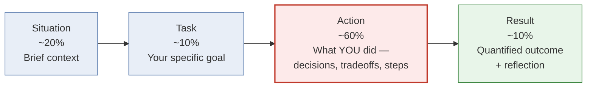

# Behavioral & Fit Interview — STAR Story Workbook

This file is a **prep workbook, not a transcript of real events**. It does not know your actual stories — it knows your resume shape (4 years at Nagarro-Space Analytics, demand forecasting, marketing attribution, RL-based inventory optimization, AWS ML Specialty + deeplearning.ai Deep Learning Specialization, MTech from BITS Pilani, BTech from Bharati Vidyapeeth, and two internal awards — "The Rookie" and "The Brightest Mind" in 2024). Every worked example below is an **illustrative scaffold**: a plausible way this story *could* be told given that context, written so you can see the shape of a strong answer. Read each one as a template to gut and refill with your real specifics (real numbers, real disagreements, real fixes) — not as a script to memorize or a claim about what actually happened.

## Table of Contents

- [1. The STAR Method](#1-the-star-method)
  - [1.1 The four components](#11-the-four-components)
  - [1.2 Time allocation](#12-time-allocation)
  - [1.3 Common mistakes](#13-common-mistakes)
- [2. Story Prep List](#2-story-prep-list)
  - [2.1 Disagreement with a stakeholder](#21-a-time-you-disagreed-with-a-stakeholder)
  - [2.2 A model failed in production](#22-a-time-a-model-failed-in-production)
  - [2.3 Explaining a complex concept simply](#23-explaining-a-complex-technical-concept-to-a-non-technical-audience)
  - [2.4 Mentoring / leading a technical decision](#24-mentoring-someone-or-leading-a-technical-decision)
  - [2.5 The Rookie award story](#25-the-story-behind-the-rookie-award)
  - [2.6 The Brightest Mind award story](#26-the-story-behind-the-brightest-mind-award)
  - [2.7 Decision with incomplete data](#27-a-decision-with-incomplete-data)
  - [2.8 Pushing back on timelines/scope](#28-pushing-back-on-unrealistic-timelinesscope)
  - [2.9 Business impact vs technical elegance](#29-balancing-business-impact-vs-technical-elegance)
- [3. Common Behavioral Questions](#3-common-behavioral-questions)
- [4. Questions to Ask Them](#4-questions-to-ask-them)
- [5. Quick Recall Sheet](#quick-recall-sheet)

---

## 1. The STAR Method

STAR is a structure for turning a vague prompt ("tell me about a time you...") into an answer an interviewer can actually score. Interviewers asking behavioral questions are usually grading against a rubric with categories like "ownership," "communication," "judgment under ambiguity," or "conflict resolution" — STAR is the shape that makes it easy for them to find the evidence for each category without having to dig for it.

### 1.1 The four components

| Component | What it covers | Typical length | The one question it answers |
|---|---|---|---|
| **S**ituation | The context: what project, what was going on, why did this situation arise | 2-3 sentences | "Where are we?" |
| **T**ask | Your specific goal or responsibility in that situation — not the team's goal, yours | 1-2 sentences | "What were you on the hook for?" |
| **A**ction | What *you* specifically did — the decisions you made, the tradeoffs you weighed, the steps you took | The bulk of the answer | "What did you actually do?" |
| **R**esult | The quantified outcome, plus a reflection on what you learned or would do differently | 2-4 sentences | "So what?" |

A useful mental model: Situation and Task are the *setup*, Action is the *movie*, Result is the *punchline*. Most candidates over-invest in the setup and under-invest in the movie — see 1.3.

### 1.2 Time allocation

For a ~90-second to 2-minute spoken answer (the natural length for most behavioral questions), a rough allocation:

If you're speaking for 90 seconds, that's roughly:
- Situation: ~18 seconds
- Task: ~9 seconds
- Action: ~55 seconds
- Result: ~9 seconds

The Action block being 60% is the single most important ratio to internalize. Interviewers can't score what they can't see, and "what you did" is the only part of the story that's actually about you. Practice trimming Situation ruthlessly — most candidates could cut their Situation in half without losing anything the interviewer needs.

### 1.3 Common mistakes

**Too much Situation, not enough Action.** The most common failure mode by far. A candidate spends 60 seconds setting the scene — the org structure, the history of the project, three tangential details about the client — and then rushes the actual action into a single sentence: "So I built a better model and it worked." The interviewer walks away with a vivid picture of the *context* and almost no evidence about the *candidate*. Fix: draft your story, then literally count sentences in each bucket. If Situation has more sentences than Action, cut it.

**No quantified Result.** "It went well" or "the stakeholders were happy" is forgettable. "MAPE dropped from 34% to 19% over the next two forecast cycles, and the client extended the contract for another two quarters" is not. If you don't have an exact number, use the best directionally honest approximate you can defend ("roughly a third reduction," "cut review time from days to about an hour") — a defensible approximate beats a vague adjective every time. Also don't skip the reflection half of Result — "and going forward I started doing X by default" shows growth, not just a good outcome.

**Using "we" so much the interviewer can't tell what you did.** This is especially easy to fall into for someone who genuinely works well on teams and is uncomfortable over-claiming credit. But "we decided to switch approaches" tells the interviewer nothing about your judgment. The fix isn't to lie about solo heroics — it's to be precise: "the team decided to switch approaches; specifically, *I* was the one who ran the comparison that showed the current approach was failing, and *I* proposed the alternative and built the first working version." You can absolutely credit the team while still being unambiguous about your slice of it.

**Rehearsed-sounding delivery.** A story that's clearly memorized word-for-word reads as inauthentic and falls apart the moment the interviewer asks a follow-up that isn't in the script. The fix is to rehearse the *beats* (Situation → Task → Action → Result, in that ratio) rather than the exact sentences, so you can reconstruct the story fresh each time and answer follow-ups naturally.

**Choosing a story that's technically impressive but behaviorally thin.** A story can be a great *technical* story (clever feature engineering, an elegant model) and a weak *behavioral* story (no conflict, no ambiguity, no decision under pressure) at the same time. Pick stories for behavioral rounds based on what judgment/conflict/ownership moment they contain, not based on how technically sophisticated the underlying project was.

---

## 2. Story Prep List

For each prompt below: first, what a strong answer needs to hit; then, an illustrative STAR example built from your resume context. Treat every example as **a shape to borrow**, not a fact about your career — swap in your real project, your real numbers, your real disagreement.

### 2.1 A time you disagreed with a stakeholder

**What a strong answer addresses:**
- The disagreement is specific and substantive (not "they wanted red, I wanted blue") — ideally rooted in a genuine difference in information or risk tolerance.
- You show you took the other side's concern seriously before pushing back — this is what separates "advocated for my position" from "argued."
- Your resolution involved *evidence*, not just persistence — a backtest, a smaller pilot, a side-by-side comparison.
- The ending isn't "and I was right and they were wrong" — even if you were right, frame the result as a shared outcome and a trust-building moment, not a win.

**Illustrative example — a way you might tell this story:**

> **Situation:** On a demand forecasting engagement, I'd rebuilt the SKU-level forecast using a gradient-boosted model, replacing a moving-average baseline the client's planning team had used for years. The model disagreed sharply with the planners' intuition for a subset of promotional SKUs, and the lead planner didn't want to use the new numbers for the upcoming quarter's purchasing plan.
>
> **Task:** I needed to either validate the model's promotional forecasts or find out where they were wrong — without just asserting "trust the model" to someone with years of category knowledge.
>
> **Action:** Instead of arguing I was right, I first asked him to walk me through *why* his intuition said the uplift should be bigger — he was anchoring on one promotion two years back that had spiked unusually due to a competitor's stockout, an event the model had no way to know about. I pulled the actual historical uplift distribution for that SKU category, showed him that promotion was an outlier against the other dozen in the training data, and backtested the new model against the old heuristic on exactly the promotional weeks he was worried about. I also proposed a middle ground: for the SKUs he was most worried about, run the new model alongside the old heuristic for one cycle as a side-by-side check before fully cutting over.
>
> **Result:** He agreed to the pilot. The new model came in closer to actuals on 9 of the 11 flagged SKUs, and the planning team adopted it fully the next quarter. The bigger outcome was that the pilot became our default rollout pattern for that client — every subsequent model change ran shadow-mode against the incumbent for one cycle before cutover, which cut stakeholder pushback on later updates too. What I took from it: disagreement from a domain expert is usually pointing at information the model doesn't have, not stubbornness — worth ten minutes of listening before reaching for evidence.

### 2.2 A time a model failed in production

**What a strong answer addresses:**
- Ownership of the failure without either over-dramatizing it or deflecting blame elsewhere.
- A concrete detection story — how did you *find out*, ideally before it became a bigger problem (monitoring/alerting beats "a stakeholder complained").
- A clear sequence: contain (rollback/mitigate) → diagnose (root cause) → fix (permanent) → prevent (what changed afterward so it can't happen the same way again).
- This is a strong story to also show calm under pressure — production incidents are one of the few places interviewers get to probe how you behave when something is actively broken.

**Illustrative example — a way you might tell this story:**

> **Situation:** A demand forecasting model I owned had run stably in production for months when a routine weekly monitoring check flagged that MAPE for one region's SKUs had jumped well outside its normal band for two consecutive cycles.
>
> **Task:** I owned diagnosing and fixing the regression before it fed into that region's next purchasing cycle, about a week away.
>
> **Action:** First I contained the risk — flagged the region's forecasts as low-confidence and reverted purchasing recommendations to the prior stable model version while investigating, rather than letting bad numbers flow into a live decision. Then I checked root cause in order — upstream data first, then feature drift, then the model itself. A promotional-calendar feed for that region had silently stopped updating three weeks earlier, so the model was scoring live promotional weeks as ordinary weeks — a boring, common failure mode, not a dramatic one. I restored the feed and retrained on the corrected calendar, then addressed the systemic gap: added a freshness check on every upstream feature source with an automated alert if a feed hadn't updated within its expected cadence, so a silent failure would surface in a day instead of three weeks.
>
> **Result:** The region's MAPE returned to its normal band the next cycle, and the freshness-check pattern became standard across every forecasting pipeline on that project, catching at least one other stale-feed issue before it hit a forecast. The lesson: most "model failures" in production aren't the model — they're the data feeding it — so now I instrument upstream data health as seriously as the model's own output metrics.

### 2.3 Explaining a complex technical concept to a non-technical audience

**What a strong answer addresses:**
- Recognizing that the challenge isn't "dumbing it down" — it's finding the right *analogy* or *framing* that preserves the correct intuition while dropping the math.
- Reading the room and adjusting mid-explanation, not just delivering a pre-packaged metaphor.
- Ideally, evidence that the explanation *changed a decision* — the audience didn't just nod, they acted differently because they understood.

**Illustrative example — a way you might tell this story:**

> **Situation:** On the marketing attribution project, I'd built a Markov-chain-based model using removal effects to assign credit to each channel — requested because the marketing team distrusted their last-click attribution. When I presented the output, stakeholders were confused why display, which rarely appeared as the last touch, was suddenly getting a large share of credit.
>
> **Task:** I needed the marketing leads to understand the mechanism well enough to trust reallocating real budget based on it, not just accept it as a black box.
>
> **Action:** I dropped the transition-matrix math and used an analogy instead: each channel as a relay-team member — "if you removed the second runner entirely, how much would the team's time get worse, even though they never crossed the finish line?" That's the removal effect: how much conversion drops if a channel is taken out of the journey entirely, even if it's rarely the final touch. I paired it with a simple before/after chart — conversions with all channels present vs. simulated-removed per channel — so the "credit" was a visible bar-chart drop, not an abstract number. When one stakeholder still pushed back, I walked through one anonymized customer path with display appearing early, showing concretely how it set up a later conversion.
>
> **Result:** The marketing team approved reallocating roughly 15% of budget toward the upper/mid-funnel channels the model surfaced as undervalued, and asked me to present the same analogy to a wider leadership group the next month. The lesson: find the one everyday analogy that preserves the actual mechanism, not just the vibe — a bad analogy falls apart under the first good follow-up question.

### 2.4 Mentoring someone or leading a technical decision

**What a strong answer addresses:**
- Specificity about the actual technical judgment call, not just "I helped onboard someone."
- A mentoring style that teaches reasoning, not just gives the answer — show you built the other person's judgment, not just fixed their code.
- If it's a technical-decision story rather than a pure mentoring story: a clear articulation of the tradeoff you weighed and why you landed where you did.

**Illustrative example — a way you might tell this story:**

> **Situation:** A junior team member joining the forecasting workstream was deciding between XGBoost and LightGBM for a new SKU-level model, leaning toward XGBoost mainly because it was what he'd used in a course project.
>
> **Task:** I wanted to help him make and defend that choice on the actual merits, while making sure he owned the decision rather than me just picking for him.
>
> **Action:** Rather than naming a winner, I walked him through the axes that mattered for our case — a few hundred thousand rows, high-cardinality categoricals (store x SKU), weekly retraining on a modest compute budget — and asked him to lay out how each library would handle high-cardinality categoricals and what the training-time difference would look like at our scale, rather than answering it for him. He found that LightGBM's native categorical handling and leaf-wise growth would likely train faster with comparable accuracy, and proposed a direct comparison. I reviewed his comparison setup (checking the train/validation split respected time order, not a random split) before he ran it, and we agreed on LightGBM once his results confirmed the reasoning.
>
> **Result:** LightGBM's weekly retrain time came in meaningfully faster at essentially the same validation accuracy, and became the team's default for subsequent models. More importantly, he ran the next two model-selection decisions on his own with the same reasoning pattern — starting from the data's actual characteristics rather than familiarity — without needing me to walk him through it again, which is the outcome I cared about most.

### 2.5 The story behind "The Rookie" award

**Guidance on telling an early-career recognition story:** The trap here is sounding like you're proudly reciting ancient history — "in my first year I did X" can land as thin if it's the *only* content of your answer, three-plus years later. The fix is to tell the specific first-year moment briefly, then **explicitly tie it to a principle or habit that's still active in how you work today**. That turns a "here's an old trophy" story into a "here's evidence of a consistent trait" story, which is what the interviewer actually wants to hear.

**Illustrative example — a way you might tell this story:**

> **Situation:** In my first year at Nagarro, I was the newest and most junior person on a demand forecasting project, initially just handling data cleaning and feature prep while more senior folks owned the modeling.
>
> **Task:** Nobody asked me to look beyond my assigned scope, but during data prep I noticed a subset of SKUs had systematically different demand behavior around regional holidays that weren't in the standard calendar features — and I wanted to check whether it actually mattered before just flagging it.
>
> **Action:** On my own time, I quantified how much forecast error was concentrated in that SKU subset around those unflagged dates, and brought a specific calendar-feature fix to the senior modeler with the analysis already done, rather than raising a vague concern.
>
> **Result:** The fix got folded into the production feature set and measurably reduced error for that subset — and that habit, doing the legwork to make the case with evidence before raising it, is what I was recognized for with the "Rookie" award. It's stayed how I default to working since: if something looks off, spend an hour building the smallest version of the evidence rather than raising a hunch. That same instinct, applied at a bigger scope, is a big part of why the "Brightest Mind" story below happened a few years later.

### 2.6 The story behind "The Brightest Mind" award (2024)

**Guidance on telling this one well:** The single biggest risk is vagueness — "I did great work and got recognized for it" tells the interviewer nothing they can evaluate. Be concrete about **what specifically made the work exceptional** along at least one of three axes: novelty (nobody had solved it that way before, on this team or this client), business impact (a number that mattered to someone with a P&L), or technical difficulty (a genuinely hard problem, not just a long one). The strongest version of this story hits at least two of the three.

**Illustrative example — a way you might tell this story:**

> **Situation:** In 2024 I was the primary owner of a project applying reinforcement learning to inventory replenishment — moving a client from a static reorder-point heuristic to a learned policy accounting for lead-time variability, holding costs, and stockout risk simultaneously.
>
> **Task:** The ask was ambiguous at the outset — "can we do better than the current heuristic" — with no pre-defined algorithm, reward design, or evaluation protocol, so a large share of the actual work was defining the problem correctly before any modeling could happen.
>
> **Action:** I designed the reward function to directly encode the real business tradeoff — holding cost vs. stockout cost vs. order frequency — rather than a simpler proxy like forecast accuracy, which is what made the RL formulation actually useful rather than just interesting. I built a simulation environment from historical demand and lead-time distributions to train and validate the policy safely offline, then ran it through a staged rollout — shadow mode against the existing heuristic, a limited live pilot on a subset of SKUs, then a full rollout — so the client never had to trust an RL policy on faith. The hardest part technically was tuning exploration so the policy didn't chase short-term reward in ways that looked good in simulation but were fragile against real demand volatility.
>
> **Result:** The rollout reduced stockout incidents while also reducing average holding cost on the piloted SKU subset — a rare double-win rather than the usual tradeoff, which is why it registered as more than incremental. The "Brightest Mind" recognition was for combining a genuinely open-ended, technically nontrivial problem with a rollout process safe enough to trust with a live business decision, delivering a result that moved a real business metric rather than a proxy. If pressed for depth: the hard part was never the RL algorithm — it was the reward design and the rollout safety net.

### 2.7 A decision with incomplete data

**What a strong answer addresses:**
- The specific gap in the data, and why waiting for complete data wasn't a viable option (a real deadline, a real cost of delay).
- Your reasoning process for estimating under uncertainty — proxy signals, similar-item/analog reasoning, explicit uncertainty bounds — rather than just guessing.
- Being honest that the decision carried real risk, and what you did to bound the downside (a conservative default, a fast feedback loop to correct once real data arrived).

**Illustrative example — a way you might tell this story:**

> **Situation:** On the demand forecasting project, a client launched new SKUs with no sales history, but the planning team still needed an initial forecast for the first purchasing cycle — a cold-start problem the standard lag-feature model couldn't handle since it had nothing to look back on.
>
> **Task:** I needed a defensible initial forecast for those SKUs within the same cycle as the historical-data SKUs, without pretending to a precision the data didn't support.
>
> **Action:** Instead of guessing or falling back to a flat average, I built an analog-based approach: identified the closest existing SKUs by attributes that actually drive demand (price tier, sub-category, launch season) and used their early-life demand trajectory — not their steady-state level, since new items behave differently at launch — as the basis for the estimate. I explicitly widened the uncertainty bounds relative to the historical-data SKUs and flagged them as such to the planning team, rather than presenting equal confidence, and proposed a fast re-forecast as soon as the first two weeks of real sales came in rather than waiting for the normal monthly cadence.
>
> **Result:** The cold-start forecasts came in reasonably close to actuals for most new SKUs, and the two-week checkpoint caught and corrected the couple that were off before they caused meaningful over- or under-stock. The analog approach and fast-feedback checkpoint became the standard playbook for every subsequent new-SKU launch. The lesson: when data is genuinely missing, be explicit about the lower confidence rather than hide it behind false precision, and build in the fastest possible feedback loop to correct the estimate.

### 2.8 Pushing back on unrealistic timelines/scope

**What a strong answer addresses:**
- Framing the pushback as protecting the *outcome*, not protecting yourself — "here's what we'd have to cut and here's the risk that creates," not "this is too hard."
- Coming with a proposed alternative (a phased scope, a reduced first version, an extra resource) rather than just saying no.
- A collaborative resolution — ideally you didn't just win the argument, you and the stakeholder found a version of the plan you both could live with.

**Illustrative example — a way you might tell this story:**

> **Situation:** Midway through the attribution project, a stakeholder asked to add three additional marketing channels to the model's scope while keeping the original delivery date unchanged.
>
> **Task:** I needed an honest read on whether that was achievable without silently absorbing the extra scope by cutting corners on validation — usually the part that quietly gets sacrificed when timelines don't move but scope does.
>
> **Action:** I broke down the actual work in properly integrating three new channels — data onboarding and quality checks, re-validating the Markov model's assumptions with the expanded channel set, re-running the removal-effect analysis end to end — and showed concretely which steps would have to be compressed to hit the original date. Rather than just flagging the problem, I proposed two alternatives: extend the date by roughly what the new channels genuinely required, or keep the date and deliver the three channels as a fast-follow phase two after the core model shipped and was validated.
>
> **Result:** The stakeholder chose the phased approach — original scope on time, the three channels properly validated about three weeks later as phase two — rather than one rushed deliverable with weaker validation across the board. The lesson: pushing back is far more persuasive with a menu of real options and the actual cost behind each, instead of just "we can't."

### 2.9 Balancing business impact vs. technical elegance

**What a strong answer addresses:**
- A genuine tension between a more sophisticated/interesting method and a simpler one, resolved in favor of business fit rather than technical prestige.
- This is a natural fit for the **linear-programming-over-a-more-sophisticated-method** decision from the ad-budget allocation project — using it directly is a strong choice since it's a real architectural tradeoff you can speak to at depth if pressed (see the LP-vs-bandit discussion in the system design file for the fuller technical version of this same tradeoff).
- Showing you understood the sophisticated alternative well enough that choosing simplicity was a decision, not a default — the strength of this story depends on it being clear you *could* have built the fancier thing.

**Illustrative example — a way you might tell this story:**

> **Situation:** On the ad-budget allocation project, the more technically interesting approach would have been a multi-armed-bandit system continuously exploring and learning channel response curves online. I'd actually prototyped a bandit-based approach and it worked reasonably well in simulation.
>
> **Task:** I had to decide, and make the case for, the actual production approach — the bandit method, or a linear-programming allocation over response curves estimated from historical marketing-mix data — knowing the two had very different tradeoffs for this client.
>
> **Action:** I weighed the two honestly rather than defaulting to whichever was more interesting to build. The client's channel mix was fairly mature with a long history of stable spend/response data, so the response curves were already reasonably well-estimated — exactly the condition where LP is strong: a globally optimal allocation given trustworthy inputs, fast to solve, and easy to explain to a finance stakeholder as "here's the constraint, here's the objective, here's the optimal split." A bandit's real advantage is correcting for *uncertain or drifting* curves, which wasn't the client's actual problem, and it would have cost real interpretability — an evolving exploration policy is a much harder monthly sign-off conversation than a constrained optimization. I proposed the LP as the primary method, but kept a small reserved budget slice on an experimental basis to keep refining the response curves — capturing some of the explore-exploit benefit without paying its full interpretability cost on the whole budget.
>
> **Result:** The LP-based allocation shipped on schedule, was straightforward for the finance stakeholder to sign off on every cycle since the logic was fully auditable, and the small experimental slice kept the curve estimates from going stale without destabilizing the bulk of spend. The lesson wasn't "simple beats sophisticated" in general — it was that a sophisticated method's real advantage has to actually match the problem's real uncertainty, or you're paying its complexity cost for nothing.

---

## 3. Common Behavioral Questions

Not every behavioral question needs full STAR — some are more conversational. Below is guidance plus a short model-answer sketch for each.

### "Tell me about yourself"

**Guidance:** Aim for a tight ~90 seconds with a clear narrative arc, not a recitation of your resume line by line. A useful arc for your background: brief educational grounding → the early-career period where you built core skill and got noticed → the growth into owning meaningful applied ML work → where that's led you now → what you're looking for next. End by connecting to *why this role*, so the story has forward momentum rather than trailing off.

**Sketch:**
> "I did my undergrad in CS at Bharati Vidyapeeth, then went on to an MTech in Data Science and Engineering at BITS Pilani, which is where I got serious about the statistical and ML foundations rather than just the software-engineering side of things. I've spent the last four years at Nagarro-Space Analytics, and the arc there has basically been: start on data-prep and feature work early on, get recognized in my first year for going a bit beyond assigned scope, and grow from there into owning full model lifecycles — I've led demand forecasting work with gradient-boosted trees and classical time series methods, built marketing attribution models using Markov chains and Shapley-style credit assignment, and more recently led a reinforcement-learning-based inventory optimization project, which is the work I was recognized for with an internal 'Brightest Mind' award last year. Alongside that I picked up the AWS ML Specialty certification and did the deeplearning.ai Deep Learning Specialization to round out the deployment and deep learning sides of the skill set. At this point I'm looking for a role where I can keep owning that kind of end-to-end applied ML work at a bit more scale, and where I can grow into [whatever's genuinely true for you about this role/company] — which is a big part of why this conversation is interesting to me."

Adjust the last sentence per company — always end on something specific to *them*, not a generic close.

### "Why are you looking to leave your current role?"

**Guidance:** Frame everything forward-looking — what you want *more of* — rather than backward-looking complaints about the current employer. Even legitimate frustrations should be translated into a growth need. Never criticize Nagarro, specific people, or clients by name or in a way that reads as venting; interviewers read employer-bashing as a signal about how you'll talk about *them* in eighteen months.

**Sketch:**
> "Nagarro's given me a lot of room to grow — from data prep in year one to owning full model lifecycles and leading a couple of larger projects since. At this point I'm looking for [a role with more direct ownership of production ML systems at scale / more exposure to a specific domain / a team with a deeper GenAI mandate — pick whichever is genuinely true], and I think that's a natural next step rather than something I could keep growing into where I am."

### "Tell me about a time you failed"

**Guidance:** Pick a real miss, not a humble-brag disguised as a failure ("I worked too hard" is an instant red flag to any experienced interviewer). The best failure stories show genuine misjudgment, own it cleanly without over-flagellating, and end with a specific behavior change that's still in effect. This is a good place to reuse the shape of the production-failure story in 2.2, but told with more focus on *your own* misjudgment (e.g., not adding the data-freshness monitoring earlier, rather than framing it purely as an external system failure) if you want a genuine ownership-of-failure story rather than an incident-response story.

**Sketch (framing, not full STAR):**
> A genuine version of this for you might center on a monitoring gap you didn't build early enough, an assumption you didn't validate before shipping (e.g. trusting an upstream feed without a freshness check), or a case where you optimized for a proxy metric that didn't fully match the real business objective. The key beats: what you missed, why in hindsight it was a miss, and the specific concrete practice you adopted afterward that's still part of how you work.

### "Tell me about a time you had to influence without authority"

**Guidance:** This is really asking for a persuasion story where you had no formal power to force the outcome — a peer, a stakeholder, or someone senior to you. The strongest answers show you influenced through evidence and framing the ask in terms of what the other person cared about, not through pressure or escalation. The 2.1 (stakeholder disagreement) or 2.8 (pushback on timelines) stories both work well here with a slightly different emphasis — on the *influence mechanism* itself.

### "How do you prioritize when you have multiple stakeholders with competing asks?"

**Guidance:** Interviewers want a repeatable *method*, not just one example. Name a framework in plain language — e.g., "I try to separate urgency from importance, get explicit about what each stakeholder's actual deadline and downside-of-delay is rather than assuming, and when two asks are genuinely tied, I escalate the tradeoff to whoever owns the priority call rather than silently picking one." Then anchor it with a brief real-feeling example (e.g., balancing a forecast-accuracy improvement request against an urgent data-pipeline fix during the same sprint).

### "Describe your ideal working style/team"

**Guidance:** Be specific and be honest rather than reciting "I work well with everyone." Good anchors for a senior applied-ML candidate: a team that pairs strong technical ownership with real access to domain/business context (you don't want to build in a vacuum), a team that does design review or code review seriously rather than as a rubber stamp, and a team where senior people give you real ownership rather than micromanaging the how.

### "Where do you see yourself in 5 years?"

**Guidance:** Show ambition anchored in the actual trajectory a company can offer, not a vague "management or IC, whichever" hedge. For your background, a credible answer ties together technical depth (going deeper into the applied ML / GenAI systems side) with growing scope of ownership (owning a bigger system or a small team of your own), without over-committing to a specific title.

**Sketch:**
> "I'd like to be someone who owns a significant piece of technical architecture end-to-end — probably having grown from individually leading projects like the forecasting and RL work I've done, to owning technical direction for a broader area, possibly with some mentoring/technical-lead responsibility along the way given that's a part of the work I've already found I enjoy. I'm less attached to a specific title and more to continuing to grow the scope of the systems I'm trusted to own."

---

## 4. Questions to Ask Them

Asking good questions is itself part of the evaluation — it signals what you actually care about. A few strong picks, plus why each works:

| Question | Why it's a good question to ask |
|---|---|
| "What's the team's roadmap for GenAI/LLM-based work over the next year, and how does that connect to the more classical ML work already in production?" | Shows you're thinking about where the field (and this team specifically) is heading, and surfaces whether the team has a real plan vs. GenAI-as-buzzword. |
| "How does data science collaborate with engineering here — do DS folks own their own deployment, or is there a dedicated MLE/platform team in between?" | Directly relevant to how much of the MLOps/deployment work you'd personally own day to day — a practical, not just curious, question. |
| "What does 'senior' look like in this org — is it more about depth of individual technical ownership, or does it come with people/mentoring responsibility by default?" | Helps you calibrate expectations for the role you're actually being hired into, and signals you're thinking seriously about growth rather than just title. |
| "What's the biggest technical challenge the team is currently wrestling with?" | One of the best all-purpose questions — the answer tells you more about the real state of the team's systems and problems than almost anything else you could ask, and gives you a natural follow-up conversation. |
| "What does the model/system lifecycle look like once something's in production — who owns monitoring, and how do you decide when something needs to be retrained or reworked?" | Practical and specific; shows you're already thinking like someone who'll own production systems, not just build models. |
| "What's one thing you'd change about how the team currently works, if you could?" | Asked to your actual interviewer (especially if they're a peer or manager-to-be), this often gets a more candid answer than "what's it like working here" and gives real signal about team health. |
| "How does the team decide between building something in-house versus buying/using an off-the-shelf or vendor solution, for ML infrastructure specifically?" | Signals pragmatic engineering judgment on your part and often reveals a lot about the team's maturity and constraints. |

Pick 3-4 per interview rather than working through the whole list — asking too many can read as running a checklist rather than having a real conversation. Save at least one for later rounds if you get through your list early.

---

## Quick Recall Sheet

**STAR in one line:** Situation (brief, ~20%) → Task (your specific goal, ~10%) → Action (what *you* did — decisions & tradeoffs, ~60%) → Result (quantified outcome + reflection, ~10%). The Action block is the whole point — everything else is scaffolding around it.

**Three failure modes to catch yourself on:** too much Situation / not enough Action; no number in the Result; "we" so often the interviewer can't find "I."

### Story bank

| Story | Answers questions like... | One-line hook |
|---|---|---|
| Stakeholder disagreement (forecasting model vs. planner intuition) | Conflict resolution, influence without authority, communication | Listened for the *why* behind the pushback, then won trust with a shadow-mode pilot, not an argument |
| Production model failure (silent stale promo-calendar feed) | Ownership, incident response, "tell me about a failure" | Contained fast, traced it to a boring upstream data issue, then built the monitoring that prevents the *next* one |
| Explaining attribution to marketing stakeholders | Communication, technical-to-non-technical translation | Relay-race analogy for removal-effect attribution — changed a real budget-allocation decision |
| Mentoring on XGBoost vs. LightGBM choice | Leadership, mentoring, technical judgment | Taught the *reasoning framework*, didn't just hand over the answer |
| "The Rookie" award | Early-career growth, initiative, "tell me about yourself" | Went beyond assigned scope in year one with evidence, not just a hunch — and it's still the habit today |
| "The Brightest Mind" award (2024) | Biggest achievement, technical depth, business impact | RL inventory policy: reward design + staged rollout cut both stockouts and holding cost at once |
| Cold-start SKU forecasting | Decision-making under uncertainty, incomplete data | Analog-based estimate + explicit wide uncertainty bounds + fast two-week re-forecast checkpoint |
| Pushback on scope/timeline (attribution project) | Pushing back, stakeholder management, prioritization | Didn't say no — gave a phased-delivery option that protected validation quality |
| LP vs. bandits for ad-budget allocation | Business impact vs. elegance, pragmatism, technical depth on demand | Chose interpretable LP because the real uncertainty didn't justify a bandit's complexity cost |

### 30-second pre-interview warmup checklist

- [ ] Recall your **90-second "tell me about yourself"** arc — BTech → MTech → early Nagarro growth → Rookie → forecasting/attribution/RL ownership → Brightest Mind → what's next.
- [ ] Recall your **Rookie** hook and the *principle* it ties to (don't let it sound like ancient history).
- [ ] Recall your **Brightest Mind** hook and the two axes (novelty/impact/difficulty) you'll lean on if pushed for specifics.
- [ ] Recall **one stakeholder-pushback or disagreement** story, ready in under 2 minutes.
- [ ] Recall **one production-failure/incident** story with a clean contain → diagnose → fix → prevent shape.
- [ ] Recall **3-4 questions to ask them**, picked for this specific company/team.
- [ ] Reset your "why are you leaving" framing to forward-looking, zero employer-criticism.
- [ ] Breathe. Slow down the first answer on purpose — the first 30 seconds sets your pace for the whole interview.
